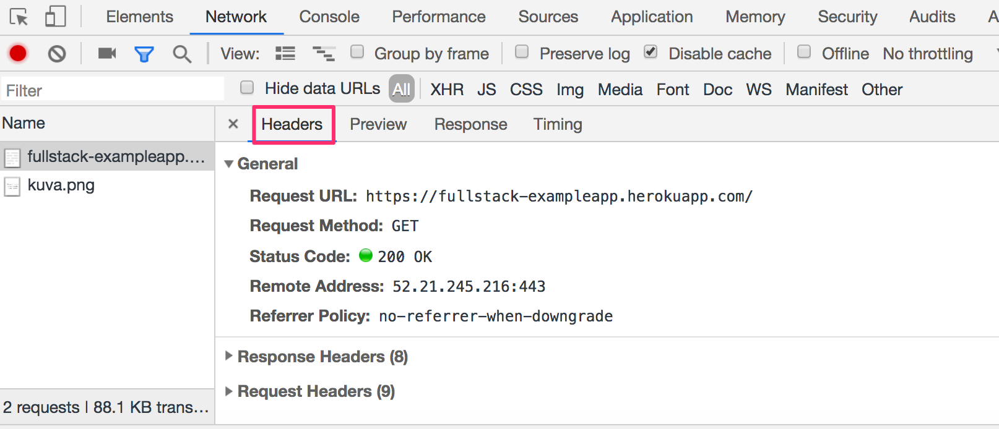
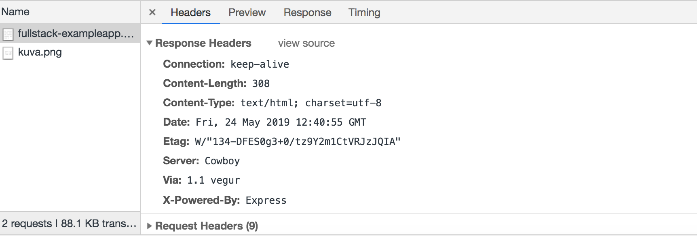
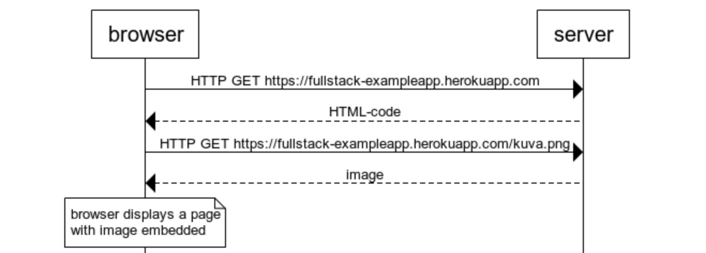
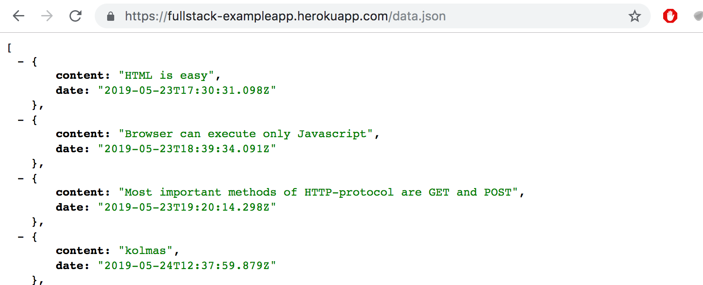
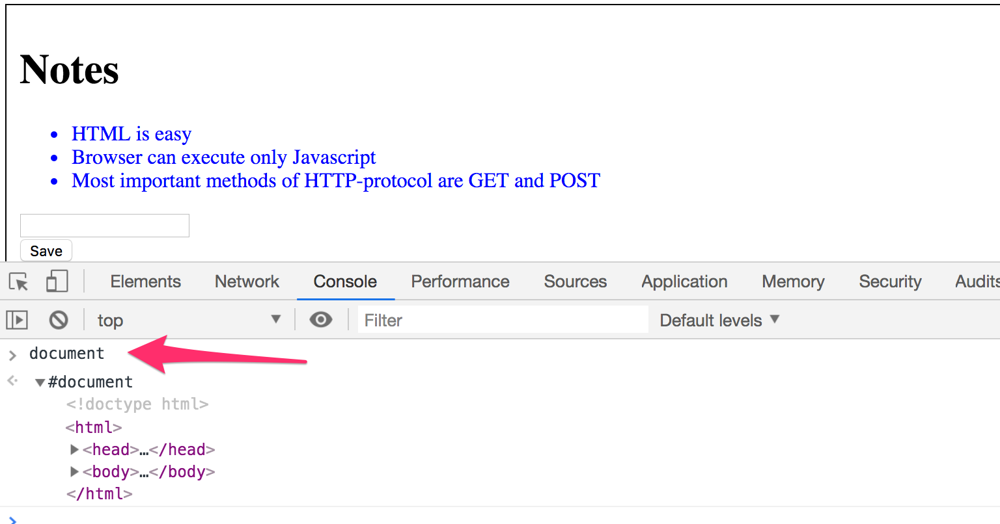
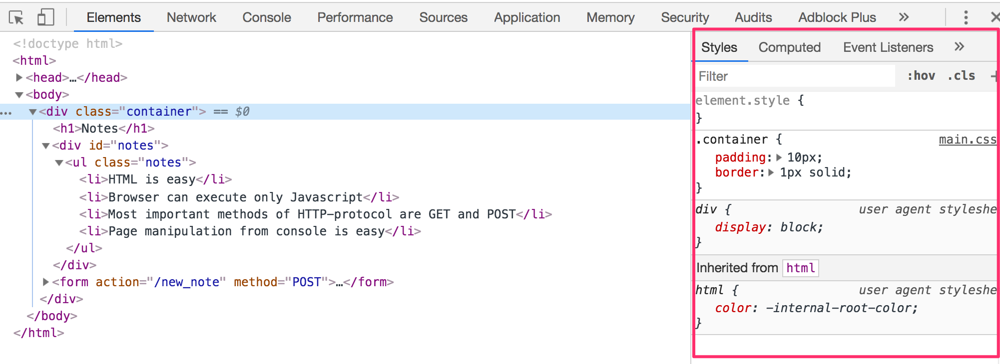
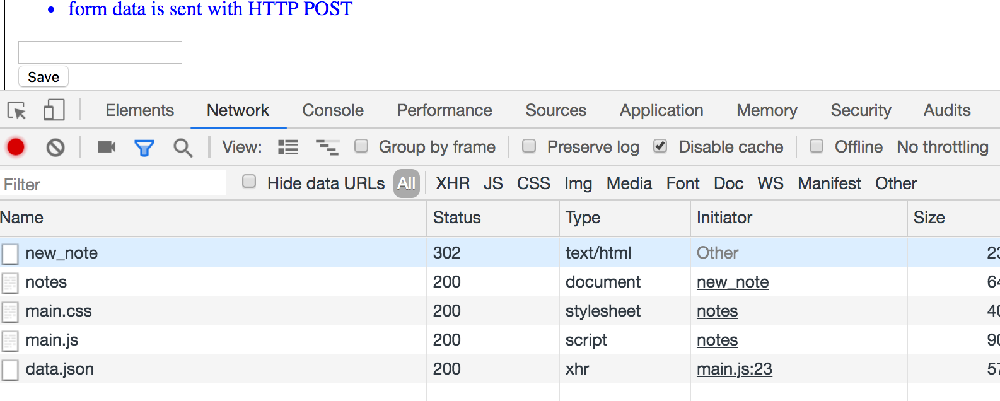
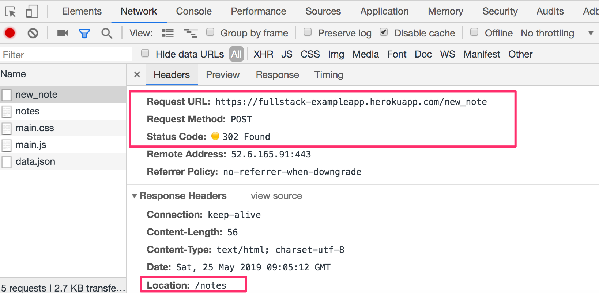
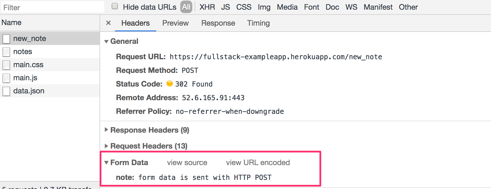
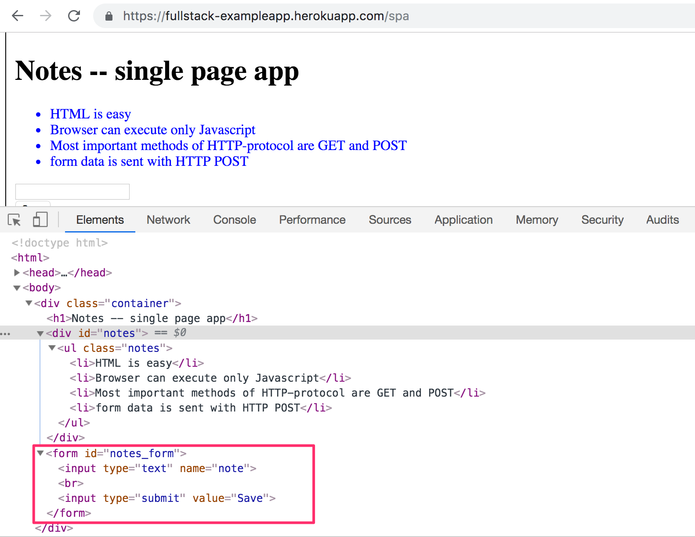

<div class="content">

Before we start programming, we will go through some principles of web development by examining an example application at <https://fullstack-exampleapp.herokuapp.com/>.
Another (Finnish language) version of the application can be found at <https://fullstack-example.now.sh>. You are free to use either one. 

The applications are there only to demonstrate some basic concepts of the course, and are by no means examples of <i>how</i>  web applications should be made. 
On the contrary, they demonstrate some old techniques of web development, which can even be seen as <i>bad practice</i> nowadays. 

Coding in the recommended style begins in [part 1](/en/part1).

Use the Chrome browser <i>now and all throughout the course</i>.

Open the [example application](https://fullstack-exampleapp.herokuapp.com/) on your browser. Sometimes this takes a while. 

**The 1st rule of web development**: Always keep the developer console open on your browser. With mac, the console can be opened by pressing _alt_ _cmd_ and _i_ simultaneously. 
With windows the console opens by pressing _F12_ or _ctrl_ _shift_ and _i_ simultaneously. 

Before continuing, find out how to open the developer console on your computer (google if necessary) and remember to <i>always</i> keep it open when developing web applications. 

The console looks as follows: 


Ensure that the <i>Network</i> tab is open, and activate <i>Disable cache</i> as shown. <i>Preserve log</i> can also be useful. It saves the logs printed by the application when the page is reloaded. 

**NB:** The most important tab is the <i>Console</i>. However, in the introduction we will be using the <i>Network</i> tab quite a bit.

### HTTP GET

The server and the web browser communicate with each other using the [HTTP](https://developer.mozilla.org/fi/docs/Web/HTTP) protocol. The Network tab shows how the browser and the server communicate.

When you reload the page (press the F5 key or the &#8634; symbol on your browser), the console shows that two events have happened:

- The browser fetches the contents of the page <i>fullstack-exampleapp.herokuapp.com/</i> from the server
- And downloads the image <i>kuva.png</i>


On a small screen you might have to widen the console window to see these. 

Clicking the first event reveals more information on what's happening: 



The upper part, <i>General</i>, shows that the browser did a request to the address <i>https://fullstack-exampleapp.herokuapp.com/</i> using the  [GET](https://developer.mozilla.org/en-US/docs/Web/HTTP/Methods/GET) method, and that the request was successfull, because the server response had the [Status code](https://en.wikipedia.org/wiki/List_of_HTTP_status_codes) 200. 

The request and the server response have serveral [headers](https://en.wikipedia.org/wiki/List_of_HTTP_header_fields):




The <i>Response headers</i> on top tell us e.g the size of the response in bytes, and the exact time of the response. An important header [Content-Type](https://developer.mozilla.org/en-US/docs/Web/HTTP/Headers/Content-Type) tells us that the response is a text file in [utf-8](https://en.wikipedia.org/wiki/UTF-8)-format, contents of which have been formatted with HTML. This way the browser knows the response to be a regular [HTML](https://en.wikipedia.org/wiki/HTML)-page, and to render it to the browser 'like a web page'.

The <i>Response</i> tab shows the response data, a regular HTML-page. The <i>body</i> section determines the structure of the page rendered to the screen: 


The page contains a [div](https://developer.mozilla.org/en-US/docs/Web/HTML/Element/div) element, which in turn contains a header, a link to the page <i>notes</i>, and an [img](https://developer.mozilla.org/en-US/docs/Web/HTML/Element/img) tag, and displays the amount of notes created.

Because of the img tag, the browser does a second <i>HTTP-request</i> to fetch the image <i>kuva.png</i> from the server. The details of the request are as follows: 


The request was made to the address <https://fullstack-exampleapp.herokuapp.com/kuva.png> and its type is HTTP GET. The response headers tell us that the response size is 89350 bytes, and its [Content-type](https://developer.mozilla.org/en-US/docs/Web/HTTP/Headers/Content-Type) is <i>image/png</i>, so it is a png image. The browser uses this information to render the image correctly to the screen. 

The chain of events caused by opening the page https://fullstack-exampleapp.herokuapp.com/ on a browser form the following [sequence diagram](https://www.geeksforgeeks.org/unified-modeling-language-uml-sequence-diagrams/):



First, the browser does a HTTP GET request to the server to fetch the HTML code of the page. The <i>img</i> tag in the HTML prompts the browser to fetch the image <i>kuva.png</i>. The browser renders the HTML page and the image to the screen. 

Even though it is difficult to notice, the HTML page begins to render before the image has been fetched from the server. 

### Traditional web applications

The homepage of the example application works like a <i>traditional web application</i>. When entering the page, the browser fetches the HTML document detailing the structure and the textual content of the page from the server.

The server has formed this document somehow. The document can be a <i>static</i> text file saved into the server's directory. The server can also form the HTML documents <i>dynamically</i>  according to the application code, using, for example, data from a database. 
The HTML code of the example application has been formed dynamically, because it contains information on the amount of created notes. 

The HTML code of the homepage is as follows: 

```js
const getFrontPageHtml = (noteCount) => {
  return(`
    <!DOCTYPE html>
    <html>
      <head>
      </head>
      <body>
        <div class='container'>
          <h1>Full stack example app</h1>
          <p>number of notes created ${noteCount}</p>
          <a href='/notes'>notes</a>
          
        </div>
      </body>
    </html>
`)
} 

app.get('/', (req, res) => {
  const page = getFrontPageHtml(notes.length)
  res.send(page)
})
```
You don't have to understand the code just yet. 

The content of the HTML page has been saved as a template string, or a string which allows for evaluating, for example, variables in the midst of it. The dynamically changing part of the homepage, the amount of saved notes (in the code <em>noteCount</em>), is replaced by the current amount of notes (in the code <em>notes.length</em>) in the template string.

Writing HTML in the midst of the code is of course not smart, but for old-school PHP-programmers it was a normal practice.

In traditional web applications the browser is "dumb". It only fetches HTML data from the server, and all application logic is on the server. A server can be created, for example, using Java Spring like on the University of Helsinki course [Web-palvelinohjelmointi](https://courses.helsinki.fi/fi/tkt21007/119558639), Python Flask (like on the course [tietokantasovellus](https://materiaalit.github.io/tsoha-18/)) or with [Ruby on Rails](http://rubyonrails.org/).

The example uses [Express](https://expressjs.com/) from Node.js. 
This course will use Node.js and Express to create web servers. 

### Running application logic on the browser

Keep the developer console open. Empty the console by clicking the &empty; symbol. 
Now when you go to the [notes](https://fullstack-exampleapp.herokuapp.com/notes) page, the browser does 4 HTTP requests: 


All of the requests have <i>different</i> types. The first request's type is <i>document</i>. It is the HTML code of the page, and it looks as follows: 


When we compare the page shown on the browser and the HTML code returned by the server, we notice that the code does not contain the list of notes. 
The [head](https://developer.mozilla.org/en-US/docs/Web/HTML/Element/head)-section of the HTML contains a [script](https://developer.mozilla.org/en-US/docs/Web/HTML/Element/script)-tag, which causes the browser to fetch a JavaScript file called <i>main.js</i>.

The JavaScript code looks as follows:

```js
var xhttp = new XMLHttpRequest()

xhttp.onreadystatechange = function() {
  if (this.readyState == 4 && this.status == 200) {
    const data = JSON.parse(this.responseText)
    console.log(data)

    var ul = document.createElement('ul')
    ul.setAttribute('class', 'notes')

    data.forEach(function(note) {
      var li = document.createElement('li')

      ul.appendChild(li)
      li.appendChild(document.createTextNode(note.content))
    })

    document.getElementById('notes').appendChild(ul)
  }
)

xhttp.open('GET', '/data.json', true)
xhttp.send()
```
The details of the code are not important right now, but some code has been included to spice up the images and the text. We will properly start coding in [part 1](/en/part1). The sample code in this part is actually not relevant at all to the coding techniques of this course. 

> Some might wonder why xhttp-object is used instead of the modern fetch. This is due to not wanting to go into promises at all yet, and the code having a secondary role in this part. We will return to modern ways to make requests to the server in part 2. 

Immediately after fetching the <i>script</i> tag, the browser begins to execute the code. 

The last two lines define that the browser does a HTTP GET request to the server's address <i>/data.json</i>:

```js
xhttp.open('GET', '/data.json', true)
xhttp.send()
```
This is the down-most request shown on the Network tab. 

We can try going to the address <https://fullstack-exampleapp.herokuapp.com/data.json> straight from the browser:


There we find the notes in [JSON](https://en.wikipedia.org/wiki/JSON) "raw data". 
By default, the browser is not too good at displaying JSON-data. Plugins can be used to handle the formatting. Install, for example, [JSONView](https://chrome.google.com/webstore/detail/jsonview/chklaanhfefbnpoihckbnefhakgolnmc) to Chrome, and reload the page. The data is now much more nicely formatted: 



So, the JavaScript code of the notes page above downloads the JSON-data containing the notes, and forms a bullet-point list from the note contents: 

This is done by the following code: 

```js
const data = JSON.parse(this.responseText)
console.log(data)

var ul = document.createElement('ul')
ul.setAttribute('class', 'notes')

data.forEach(function(note) {
  var li = document.createElement('li')

  ul.appendChild(li)
  li.appendChild(document.createTextNode(note.content))
})

document.getElementById('notes').appendChild(ul)
```
The code first creates an unordered list with an [ul](https://developer.mozilla.org/en-US/docs/Web/HTML/Element/ul)-tag...

```js
var ul = document.createElement('ul')
ul.setAttribute('class', 'notes')
```
...and then adds one [li](https://developer.mozilla.org/en-US/docs/Web/HTML/Element/li)-tag for each note. Only the <i>content</i> field of each note becomes the contents of the li-tag. The timestamps found in the raw data are not used for anything here. 

```js
data.forEach(function(note) {
  var li = document.createElement('li')

  ul.appendChild(li)
  li.appendChild(document.createTextNode(note.content))
})
```
Now open the <i>Console</i>-tab on your developer console:


By clicking the little triangle at the beginning of the line, you can expand the text on the console.


This output on the console is caused by <em>console.log</em> command in the code:

```js
const data = JSON.parse(this.responseText)
console.log(data)
```

So after receiving data from the server, the code prints it to the console. 

The <i>Console</i> tab and the <em>console.log</em> command will become very familiar to you during the course. 


### Event handlers and Callback functions

The structure of this code is a bit odd:


```js
var xhttp = new XMLHttpRequest()

xhttp.onreadystatechange = function() {
  // code that takes care of the server response
}

xhttp.open('GET', '/data.json', true)
xhttp.send()
```
The request to the server is sent on the last line, but the code to handle the response can be found further up. Whats going on? 

On this line,

```js
xhttp.onreadystatechange = function () {
```
an <i>event handler</i> for event <i>onreadystatechange</i> is defined for the <em>xhttp</em> object doing the request. When the state of the object changes, the browser calls the event handler function. The function code checks that the [readyState](https://developer.mozilla.org/en-US/docs/Web/API/XMLHttpRequest/readyState) equals 4 (which depicts the situation <i>The operation is complete</i> ) and that the HTTP status code of the response is 200. 


```js
xhttp.onreadystatechange = function() {
  if (this.readyState == 4 && this.status == 200) {
    // code that takes care of the server response
  }
)
```
The mechanism of invoking event handlers is very common in JavaScript. Event handler functions are called [callback](https://developer.mozilla.org/en-US/docs/Glossary/Callback_function) functions. The application code does not invoke the functions itself, but the runtime environment - the browser, invokes the function at an appropriate time, when the <i>event</i> has occurred. 

### Document Object Model or DOM

We can think of HTML-pages as implicit tree structures.

<pre>
html
  head
    link
    script
  body
    div
      h1
      div
        ul
          li
          li
          li
      form
        input
        input
</pre>

The same treelike structure can be seen on the console tab <i>Elements</i>.


The functioning of the browser is based on the idea of depicting HTML elements as a tree. 

Document Object Model, or [DOM](https://en.wikipedia.org/wiki/Document_Object_Model) is an Application Programming Interface, (an <i>API</i>), which enables programmatic modification of the <i>element trees</i> corresponding to web-pages.

The JavaScript code introduced in the previous chapter used the DOM-API to add a list of notes to the page. 

The following code creates a new node to the variable <em>ul</em>, and adds some child nodes to it: 

```js
var ul = document.createElement('ul')

data.forEach(function(note) {
  var li = document.createElement('li')

  ul.appendChild(li)
  li.appendChild(document.createTextNode(note.content))
})
```
Finally, the tree branch of the <em>ul</em> variable is connected to its proper place in the HTML tree of the whole page: 

```js
document.getElementById('notes').appendChild(ul)
```

### Manipulating the document-object from console

The topmost node of the DOM tree of a HTML document is called the <em>document</em>. You can access this object from the Console-tab (you have to type it by yourself): 



We can perform various operations on a web-page using the DOM-API and utilizing the <em>document</em> object. 

Let's add a new note to the page from the console. 

First, we'll get the list of notes from the page. The list is in the first ul-element of the page: 


```js
list = document.getElementsByTagName('ul')[0]
```

Then create a new li-element and add some text content to it:

```js
newElement = document.createElement('li')
newElement.textContent = 'Page manipulation from console is easy'
```

And add the new li-element to the list:

```js
list.appendChild(newElement)
```


Even though the page updates on your browser, the changes are not permanent. If the page is reloaded, the new note will dissappear, because the changes were not pushed to the server. The JavaScript code the browser fetches will always create the list of notes based on JSON-data from address <https://fullstack-exampleapp.herokuapp.com/data.json>.

### CSS

The <i>head</i> element of the HTML code of the Notes page contains a [link](https://developer.mozilla.org/en-US/docs/Web/HTML/Element/link) tag, which determines that the browser must fetch a [CSS](https://developer.mozilla.org/en-US/docs/Web/CSS) style sheet from the address [main.css](https://fullstack-exampleapp.herokuapp.com/main.css).

Cascading Style Sheets, or CSS, is a markup language used to determine the appearance of web applications. 

The fetched CSS-file looks as follows: 

```css
.container {
  padding: 10px;
  border: 1px solid; 
}

.notes {
  color: blue;
}
```
The file defines two [class selectors](https://developer.mozilla.org/en-US/docs/Web/CSS/Class_selectors). These are used to select certain parts of the page and to define styling rules to style them. 

A class selector definition always starts with a period, and contains the name of the class. 

The classes are [attributes](https://developer.mozilla.org/en-US/docs/Web/HTML/Global_attributes/class), which can be added to HTML elements. 

CSS attributes can be examined on the <i>elements</i> tab on the console:  



The outermost <i>div</i> element has the class <i>container</i>. The <i>ul</i> element containing the list of notes has the class <i>notes</i>.

The CSS rule defines that elements with the <i>container</i> class will be outlined with a one pixel wide [border](https://developer.mozilla.org/en-US/docs/Web/CSS/border). It also sets 10 pixel [padding](https://developer.mozilla.org/en-US/docs/Web/CSS/padding) to the element. This sets some empty space between the element content and the border. 

The second CSS rule sets the text color of the notes blue. 

HTML elements can also have other attributes than classes. The <i>div</i> element containing the notes has an [id](https://developer.mozilla.org/en-US/docs/Web/HTML/Global_attributes/id) attribute. JavaScript code uses the id to find the element. 

The <i>Elements</i> tab of the console can be used to change the styles of the elements. 


Changes made on the console will not be permanent. If you want to make lasting changes, they must be saved to the CSS style sheet on the server. 


### Loading a page containing JavaScript - revised

Let's revise what happens when the page https://fullstack-exampleapp.herokuapp.com/notes is opened on the browser. 


- The browser fetches the HTML code defining the content and the structure of the page from the server using an HTTP GET request.
- Links in the HTML code cause the browser to also fetch the CSS style sheet <i>main.css</i>...
- ...and a JavaScript code file <i>main.js</i>
- The browser executes the JavaScript code. The code makes an HTTP GET request to the address https://fullstack-exampleapp.herokuapp.com/data.json, which 
  returns the notes as JSON  data. 
- When the data has been fetched, the browser executes an <i>event handler</i>, which renders the notes to the page using the DOM-API. 

### Forms and HTTP POST

Next let's examine how adding a new note is done. 

The Notes page contains a [form-element](https://developer.mozilla.org/en-US/docs/Learn/HTML/Forms/Your_first_HTML_form)


When the button on the form is clicked, the browser will send the user input to the server. Let's open the <i>Network</i> tab and see what submitting the form looks like: 



Surprisingly, submitting the form causes altogether <i>five</i> HTTP requests. 
The first one is the form submit event. Let's zoom into it: 



It is an [HTTP POST](https://developer.mozilla.org/en-US/docs/Web/HTTP/Methods/POST) request to the server address <i>new\_note</i>. The server responds with HTTP status code 302. This is an [URL redirect](https://en.wikipedia.org/wiki/URL_redirection), with which the server asks the browser to do a new HTTP GET request to the address defined in the header's <i>Location</i> - the address <i>notes</i>.

So, the browser reloads the Notes page. The reload causes three more HTTP requests: fetching the style sheet (main.css), the JavaScript code (main.js), and the raw data of the notes (data.json). 

The network tab also shows the data submitted with the form: 



The Form tag has attributes <i>action</i> and <i>method</i>, which define that submitting the form is done as an HTTP POST request to the address <i>new_note</i>. 


The code on the server responsible for the POST request is simple (NB: this code is on the server, and not on the JavaScript code fetched by the browser):

```js
app.post('/new_note', (req, res) => {
  notes.push({
    content: req.body.note,
    date: new Date(),
  })

  return res.redirect('/notes')
})
```

Data is sent as the [body](https://developer.mozilla.org/en-US/docs/Web/HTTP/Methods/POST) of the POST-request. 


The server can access the data by accessing the <em>req.body</em> field of the request object <em>req</em>.

The Server creates a new note object, and adds it to an array called <em>notes</em>.

```js
notes.push({
  content: req.body.note,
  date: new Date(),
})
```

The Note objects have two fields: <i>content</i> containing the actual content of the note, and <i>date</i> containing the date and time the note was created. 
The server does not save new notes to a database, so new notes dissappear when Heroku restarts the service. 

### AJAX

The Notes page of the application follows the noughties style of web development and "uses Ajax", so it is on the forefront of web technology for the early 2000's. 

[AJAX](<https://en.wikipedia.org/wiki/Ajax_(programming)>) (Asynchronous Javascript and XML) is a term which was launched in February 2005 to 
describe the new revolutionary way browser development enabled fetching new content to webpages using JavaScript included in the HTML without having to rerender the page. 

Before the AJAX era, all web pages worked like the [traditional web application](/en/part0/fundamentals_of_web_apps#traditional-web-applications) we saw earlier in this chapter. 
All of the data shown on the page was fetched with the HTML-code generated by the server. 

The Notes page uses AJAX to fetch the notes data. Submitting the form still uses the traditional mechanism of submitting web-forms. 

The application URLs reflect the old, carefree times. JSON data is fetched from the url <https://fullstack-exampleapp.herokuapp.com/data.json> and new notes are sent to the url <https://fullstack-exampleapp.herokuapp.com/new_note>.  
Nowadays urls like these would not be good at all, as they don't follow the generally acnowledged conventions of [RESTful](https://en.wikipedia.org/wiki/Representational_state_transfer#Applied_to_Web_services) APIs, which we'll look into more in [part 3](/en/part3)

The thing called AJAX is now so commonplace it's taken for granted. The term has faded into oblivion, and the new generations have never even heard of it. 

### Single page app

In our example app, the home page works like a traditional web-page: All of the logic is on the server, and the browser only renders the HTML as instructed. 

The Notes page gives some of the responsibility, generating the HTML code for existing notes, to the browser. The browser tackles this task by executing the JavaScript code it fetched from the server. The code fetches the notes from the server as JSON-data, and adds HTML elements for displaying the notes to the page using the [DOM-API](/en/part0/fundamentals_of_web_apps#document-object-model-or-dom).

In recent years, the [Single-page application](https://en.wikipedia.org/wiki/Single-page_application) (SPA) style of creating web-applications has emerged. SPA style websites don't fetch all of their pages separately from the server like our sample application does, but are composed of one HTML page fetched from the server, contents of which are manipulated with JavaScript running on the browser.

The Notes page of our application bears some resemblance to SPA-style apps, but it's not quite there yet. Even though the logic for rendering the notes is run on the browser, the page still uses the traditional way of adding new notes. The data is sent to the server with form submit, and the server instructs the browser to reload the Notes page with a <i>redirect</i>.

A single page app version of our example application can be found from <https://fullstack-exampleapp.herokuapp.com/spa>.
At first glance, the application looks exactly the same as the previous one. 
The HTML code is almost identical, but the JavaScript file is different (<i>spa.js</i>) and there is a small change in how the form-tag is defined: 



The form has no <i>action</i> or <i>method</i> attributes to define how and where to send the input data. 

Open the <i>Network</i>-tab and empty it by clicking the &empty; symbol. When you now create a new note, you'll notice that the browser sends only one request to the server. 


The POST request to the address <i>new\_note\_spa</i> contains the new note as JSON-data containing both the content of the note (<i>content</i>) and the timestamp (<i>date</i>): 

```js
{
  content: "single page app does not reload the whole page",
  date: "2019-05-25T15:15:59.905Z"
}
```

The <i>Content-Type</i> header of the request tells the server, that the included data is represented in the JSON format. 


Without this header, the server would not know how to correctly parse the data. 

The server responds with statuscode [201 created](https://httpstatuses.com/201). This time the server does not ask for a redirect, the browser stays on the same page, and it sends no further HTTP-requests. 

The SPA version of the app does not send the form data the traditional way, but instead uses the JavaScript code it fetched from the server. 
We'll look into this code a bit, even though understanding all the details of it is not important just yet. 

```js
var form = document.getElementById('notes_form')
form.onsubmit = function(e) {
  e.preventDefault()

  var note = {
    content: e.target.elements[0].value,
    date: new Date(),
  )

  notes.push(note)
  e.target.elements[0].value = ''
  redrawNotes()
  sendToServer(note)
)
```

The command <em>document.getElementById('notes\_form')</em> instructs the code to fetch the form-element from the page, and to register an <i>event handler</i> to handle the form submit event. The event handler immediately calls the method <em>e.preventDefault()</em> to prevent the default handling of form submit. The default method would send the data to server and cause a redirect, which we don't want to happen. 


Then the event handler creates a new note, adds it to the notes list with the command <em>notes.push(note)</em>, rerenders the note list on the page and sends the new note to the server. 

The code for sending the note to the server is as follows: 

```js
var sendToServer = function(note) {
  var xhttpForPost = new XMLHttpRequest()
  // ...

  xhttpForPost.open('POST', '/new_note_spa', true)
  xhttpForPost.setRequestHeader(
    'Content-type', 'application/json'
  )
  xhttpForPost.send(JSON.stringify(note))
)
```

The code determines, that the data is to be sent with an HTTP POST request and the data type is to be JSON. The data type is determined with a <i>Content-type</i> header. Then the data is sent as JSON-string. 

The application code is available at <https://github.com/mluukkai/example_app>. 
It's worth to remember, that the application is only meant to demonstrate the concepts of the course. The code is partially bad style, and should not be used as an example when coding your own applications. The same is true for the URLs used. The URL <i>new\_note\_spa</i>, which new notes are sent to, does not follow the current best practices. 

### Javascript-libraries

The sample app is done with so called [vanilla Javascript](https://medium.freecodecamp.org/is-vanilla-javascript-worth-learning-absolutely-c2c67140ac34) using only the DOM-API and JavaScript to manipulate the structure of the pages. 

Instead of using just JavaScript and the DOM-API, different libraries containing easier to use tools than the DOM-API are often used to manipulate pages. One of these libraries is the ever-so-popular [JQuery](https://jquery.com/).

JQuery was developed back when web-pages mainly followed the traditional style of the server generating HTML pages, functionality of which was enhanced on the browser using JavaScript written with JQuery. One of the reasons for the success of JQuery was so-called cross-browser compatibility. The library worked regardless of the browser or the company who made it, so there was no need for browser-specific solutions. Nowadays using JQuery is not as justified, as VanillaJS has advanced a lot, and the most popular browsers generally support basic functionalities well. 

The rise of the single page app brought serveral more "modern" ways of web development than JQuery. The favourite of the first wave of developers was [BackboneJS](http://backbonejs.org/). After its [launch](https://github.com/angular/angular.js/blob/master/CHANGELOG.md#100-temporal-domination-2012-06-13) in 2012, Google's [AngularJS](https://angularjs.org/) quickly became almost the de facto standard of modern web development. 

However, the popularity of Angular plummeted after the Angular team [announced](https://jaxenter.com/angular-2-0-announcement-backfires-112127.html) in October 2014 that support for version 1 will end, and Angular 2 will not be backwards compatible with the first version. Angular 2 and the newer versions have not gotten too warm of a welcome. 

Currently the most popular tool for implementing the browser-side logic of web-applications is Facebook's [React](https://reactjs.org/)-library. 
During this course, we will get familiar with React and the [Redux](https://github.com/reactjs/redux)-library, which are frequently used together. 

The status of React seems strong, but the world of JavaScript is ever changing. For example, recently a newcomer [VueJS](https://vuejs.org/) has been capturing some interest. 

### Full stack -web development

What does the name of the course, <i>Full stack web development</i>, mean? Full stack is a buzzword, and everyone talks about it while no one really knows what it actually means. Or at least no agreed upon definition exists for the term. 

Practically all web applications have (at least) two "layers": the browser at the top layer, being closer to the end user, and the server at the bottom layer. Often there is also a database layer below the server. We can therefore think of the <i>architecture</i> of a web application as a kind of a <i>stack</i> of layers. 

Often we also talk about the [frontend](https://en.wikipedia.org/wiki/Front_and_back_ends) and the [backend](https://en.wikipedia.org/wiki/Front_and_back_ends). The browser is the frontend, and JavaScript run on the browser is frontend code. The server on the other hand is the backend. 

In the context of this course, full stack web development means that we focus on all parts of the application: the frontend, the backend, and the database. Sometimes the software on the server and its operating system are seen as parts of the stack, but we won't go into those. 

We will code the backend with JavaScript, using [Node.js](https://nodejs.org/en/) runtime environment. Using the same programming language on multiple layers of the stack gives full stack web development a whole new dimension. However it's not a requirement of full stack web development to use the same programming language (JavaScript) for all layers of the stack. 

It used to be more common for developers to specialize in one layer of the stack, for example the backend. Technologies on the backend and the frontend were quite different. With the Full stack trend, it has become common for developers to be proficient on all layers of the application and the database. Oftentimes, full stack developers must also have enough configuration and administration skills to operate their application for example in the cloud. 

### Javascript fatigue

Full stack web development is challenging in many ways. Things are happening in many places at once, and  debugging is quite a bit harder than with regular desktop applications. JavaScript does not always work like you'd expect it to (compared to many other languages) and the asynchronous way its runtime environments work causes all sorts of challenges. Communicating in the web requires knowledge of the HTTP-protocol. One must also handle databases and server administration and configuration. It would also be good to know enough CSS to make applications at least somewhat presentable. 

The world of JavaScript develops fast, which brings its own set of challenges. Tools, libraries and the language itself are under constant development. Some are starting to get tired of the constant changes, and have launched to term for it: [Javascript](https://medium.com/@ericclemmons/javascript-fatigue-48d4011b6fc4) [fatigue](https://auth0.com/blog/how-to-manage-javascript-fatigue/).

You will catch the JavaScript fatigue during this course. Lucky for us, there are a few ways to lower the learning curve, and we can start with coding instead of configuration. We can't avoid configuration completely, but the next few weeks we can merrily push ahead avoiding the worst of the configuration hells. 

</div>

<div class="tasks"> 
  <h3>Exercises</h3>

The exercises are submitted via GitHub, and by marking the exercises as done in the [submission system](https://studies.cs.helsinki.fi/fullstackopen2019/).

You can submit all of the exercises into the same repository, or use multiple different repositories. If you submit exercises from different parts into the same repository, name your directories well. If you use a private repository to submit the exercises, add _mluukkai_ as a contributor to it.

One good way to name the directories in your submission repository is as follows: 

```
part0
part1
  courseinfo
  unicafe
  anecdotes
part2
  phonebook
  countries
```

So each part has it's own directory, which contains a directory for each exercise set (like the unicafe exercises in part 1). 

The exercises are submitted **one part at a time**. When you have submitted the exercises for a part, you can no longer submit any missed exercises for that part. 

  <h4>0.1: HTML</h4>

Revise the basics of HTML by reading this tutorial from Mozilla: [HTML tutorial](https://developer.mozilla.org/en-US/docs/Learn/Getting_started_with_the_web/HTML_basics). 

<i>This exercise is not submitted to GitHub, it's enough to just read the tutorial</i>

  <h4>0.2: CSS</h4>

Revise the basics of CSS by reading this tutorial from Mozilla: [CSS tutorial](https://developer.mozilla.org/en-US/docs/Learn/Getting_started_with_the_web/CSS_basics).

<i>This exercise is not submitted to GitHub, it's enough to just read the tutorial</i>

  <h4>0.3: HTML forms</h4>

Learn about the basics of HTML forms by reading Mozilla's tutorial [Your first form](https://developer.mozilla.org/en-US/docs/Learn/HTML/Forms/Your_first_HTML_form).

<i>This exercise is not submitted to GitHub, it's enough to just read the tutorial</i>

  <h4>0.4: new note</h4>

In chapter [Loading a page containing JavaScript - revised](/en/part0/fundamentals_of_web_apps#loading-a-page-containing-java-script-revised) the chain of events caused by opening the page <https://fullstack-exampleapp.herokuapp.com/notes> is depicted as a [sequence diagram](https://www.geeksforgeeks.org/unified-modeling-language-uml-sequence-diagrams/)

The diagram was made using [websequencediagrams](https://www.websequencediagrams.com) service as follows: 

```
browser->server: HTTP GET https://fullstack-exampleapp.herokuapp.com/notes
server-->browser: HTML-code
browser->server: HTTP GET https://fullstack-exampleapp.herokuapp.com/main.css
server-->browser: main.css
browser->server: HTTP GET https://fullstack-exampleapp.herokuapp.com/main.js
server-->browser: main.js

note over browser:
browser starts executing js-code
that requests JSON data from server 
end note

browser->server: HTTP GET https://fullstack-exampleapp.herokuapp.com/data.json
server-->browser: [{ content: "HTML is easy", date: "2019-05-23" }, ...]

note over browser:
browser executes the event handler
that renders notes to display
end note
```

**Create a similar diagram** depicting the situation where the user creates a new note on page <https://fullstack-exampleapp.herokuapp.com/notes> by writing something into the text field and clicking the <i>submit</i> button. 

If necessary, show operations on the browser or on the server as comments on the diagram.

The diagram does not have to be a sequence diagram. Any sensible way of presenting the events is fine. 

All necessary information for doing this, and the next three exercises, can be found from the text of [this part](/en/part0/fundamentals_of_web_apps).
The idea of these exercises is to read the text through once more, and to think through what is going on where. Reading the application [code](https://github.com/mluukkai/example_app) is not necessary, but it is of course possible. 

  <h4>0.5: Single page app</h4>

Create a diagram depicting the situation where the user goes to the [single page app](/en/part0/fundamentals_of_web_apps#single-page-app) version of the notes app at <https://fullstack-exampleapp.herokuapp.com/spa>.

  <h4>0.6: New note</h4>

Create a diagram depicting the situation, where user creates a new note using the single page version of the app. 

This was the last exercise, and it's time to push your answers to GitHub and mark the exercises as done in the [submission application](https://studies.cs.helsinki.fi/fullstackopen2019/).

</div>
