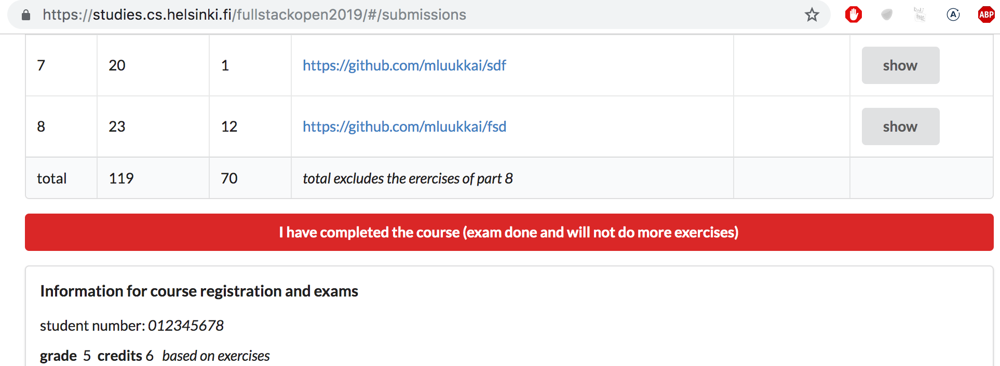
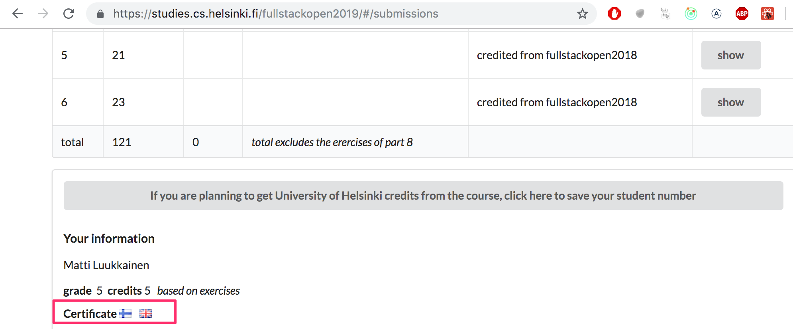

Kurssilla tutustutaan Javascriptilla tapahtuvaan moderniin websovelluskehitykseen. Pääpaino on React-kirjaston avulla toteutettavissa single page -sovelluksissa, ja niitä tukevissa Node.js:llä toteutetuissa REST-rajapinnoissa. Uutuutena kurssilla on mukana GraphQL, joka on Facebookin kehittämä REST:ille vaihtoehtoinen tapa rajapintojen toteutukseen.

Kurssilla käsitellään myös sovellusten testaamista, konfigurointia ja suoritusympäristöjen hallintaa sekä NoSQL-tietokantoja.

### Oletetut esitiedot

Osallistujilta edellytetään vahvaa ohjelmointirutiinia, web-ohjelmoinnin ja tietokantojen perustuntemusta, git-versionhallintajärjestelmän peruskäytön hallintaa, kykyä pitkäjänteiseen työskentelyyn sekä valmiutta omatoimiseen tiedonhakuun ja ongelmanratkaisuun.

Osallistuminen ei kuitenkaan edellytä kurssilla käsiteltävien tekniikoiden tai Javascript-kielen hallintaa.

### Kurssimateriaali

Kurssimateriaali on tarkoitettu luettavaksi osa kerrallaan "alusta loppuun". Materiaalin seassa on tehtäviä, jotka on sijoiteltu siten, että kunkin tehtävän tekemiseen pitäsi olla riittävät tekniset valmiudet sitä edeltävässä materiaalissa. Voit siis tehdä tehtäviä sitä mukaan kun niitä tulee materiaalissa vastaan. Voi myös olla, että koko osan tehtävät kannattaa tehdä vasta sen jälkeen, kun olet ensin lukenut osan alusta loppuun kertaalleen. Useissa osissa tehtävät ovat samaa ohjelmaa laajentavia pienistä osista koostuvia kokonaisuuksia. Muutamia tehtävien ohjelmia kehitetään eteenpäin useamman osan aikana.

Materiaali perustuu muutamien osasta osaan vaihtuvien esimerkkiohjelmien asteittaiseen laajentamiseen. Materiaali toiminee parhaiten, jos kirjoitat samalla koodin myös itse ja teet koodiin myös pieniä modifikaatioita. Materiaalin käyttämien ohjelmien koodin eri vaiheiden tilanteita on tallennettu GitHubiin.

### Suoritustapa

Kurssi koostuu yhdeksästä osasta, joista ensimmäinen on historiallisista syistä numero nolla. Osat voi tulkita löyhästi ajatellen viikoiksi. Osia kuitenkin ilmestyy nopeampaa tahtia, ja suoritusnopeuskin on melko vapaa.

Materiaalissa osasta <i>n</i> osaan <i>n+1</i> eteneminen ei ole mielekästä ennen kuin riittävä osaaminen osan <i>n</i> asioista on saavutettu. Kurssilla sovelletaankin pedagogisin termein <i>tavoiteoppimista</i>, [engl. mastery learning](https://en.wikipedia.org/wiki/Mastery_learning) ja on tarkoitus, että etenet seuraavaan osaan vasta, kun riittävä määrä edellisen osan tehtävistä on tehty.

Oletuksena on, että teet kunkin osan tehtävistä <i>ainakin ne</i> jotka eivät ole merkattu tähdellä. Myös tähdellä merkatut tehtävät vaikuttavat arvosteluun, mutta niiden tekemättäjättäminen ei aiheuta liian suuria esteitä seuraavan osan (tähdellä merkkaamattomien) tehtävien tekemiseen.

Etenemisnopeus kurssilla on vapaa, tehtäviä voi palauttaa 10.1.2020. klo 23:59 asti. Mahdollisen suoritusmerkinnän saat sen jälkeen kun olet suorittanut myös kurssiin liittyvän kokeen.

Tämän kurssin eri osiin jo tehtyjen palautusten ajankäyttöstatistiikan näet [tehtävien palautussovelluksesta](https://studies.cs.helsinki.fi/fullstackopen2019).

### Arvosteluperusteet

Kurssi voidaan suorittaa joko 3 tai 5-8 opintopisteen laajuisena.

Laajuus ja arvosana määräytyy kaikkien tehtyjen tehtävien perusteella, myös tähdellä merkityt tehtävät siis vaikuttavat arvosanaan. Kurssilla on myös koe, joka on suoritettava hyväksytysti. Koe ei kuitenkaan vaikuta arvosanaan.

Jos haluat kurssilta virallisen suoritusmerkinnän, tallenna <b>Helsingin yliopiston</b> opiskelijanumerosi [palautussovelluksen](https://studies.cs.helsinki.fi/fullstackopen2019) näkymään my submissions. Jos et ole Helsingin yliopiston opiskelija, saat opiskelijanumeron ilmoittautumalla kurssille [Avoimen yliopiston kurssisivun](https://courses.helsinki.fi/fi/aytkt21009/124726896) kautta.

Saat suoritusmerkinnän sen jälkeen kun olet tehnyt hyväksyttävään suositukseen oikeuttavan määrän tehtäviä, suorittanut kokeen hyväksytysti ja [ilmoittanut palautussovelluksessa](/osa0/yleista#suoritusmerkinnan-pyytaminen) olevasi valmis kurssin suorituksen kanssa.

Suoritusmerkintä ja kokeen tekeminen edellyttävät että olet ilmoittautunut kurssille Avoimeen yliopistoon. Ilmoittautuminen tapahtuu kurssin [avoimen yliopiston kurssisivun](https://courses.helsinki.fi/fi/aytkt21009/124726896) kautta. Läydät sivulta tarkemmat ohjeet ilmoittautumiseen, Moodlen kurssiavaimen ja lisätietoja opintosuorituksen rekisteröinnistä. 

#### Kolmen opintopisteen suoritus

Kolmen opintopisteen suorituksen edellytyksenä on osien 0-3 kaikkien tähdellä merkitsemättömien tehtävien tekeminen sekä hyväksytty suoritus 3 opintopisteen laajuuden kokeesta.

Koe suoritetaan Moodlessa. Pääset Moodleen [Avoimen yliopiston kurssisivun](https://courses.helsinki.fi/fi/aytkt21009/124726896) kautta. Kokeen voi suorittaa 1.4. alkaen. Kokeen viimeinen suorituspäivä on 10.1.2020. Voit osallistua kokeeseen vasta siinä vaiheessa kun olet tehnyt kaikki kolmen opintopisteen suorituksen edellyttämät tehtävät. <b>Huomaa, että viimeinen päivä kokeeseen ilmoittautumiselle on 9.1.2020.</b>

Kokeen tuloksen näet palautussovelluksen välilehdeltä my submissions viimeistään 4 viikkoa kokeen suorittamisen jälkeen (heinäkuu saattaa aiheuttaa kokeen tarkastamiseen pidemmän viiveen). Muista tallettaa opiskelijanumerosi palautussovellukseen.

Suoritus rekisteröidään arvosanalla hyväksytty.

Voit halutessasi laajentaa 3 op suorituksen myöhemmin laajempaan 5-8 op suoritukseen. Jos tähtäät suoraan laajempaan suoritukseen, 3 op:n koetta ei kannata suorittaa.

#### 5-7 opintopisteen suoritus

5-7 opintopisteen laajuisen suorituksen opintopistemäärä ja arvosana määräytyy kurssin <b>osien 0-7</b> kaikkien tehtyjen tehtävien (myös tähdellä merkittyjen) perusteella.

Arvosana/opintopisterajat:

| tehtäviä     | opintopisteitä | arvosana | 
| ------------ | :------------: | :------: |
| 138          |       7        | 5        |
| 127          |       6        | 5        |
| 116          |       5        | 5        |
| 105          |       5        | 4        |
| 94           |       5        | 3        |
| 83           |       5        | 2        |
| 72           |       5        | 1        |

Myös 5-7 op:n suorituksen edellytyksenä on hyväksytysti suoritettu koe. Koe suoritetaan Moodlessa. Pääset Moodleen Avoimen yliopiston kurssisivun kautta. Kokeen voi suorittaa 1.4. alkaen. Kokeen viimeinen suorituspäivä on 10.1.2020.  <b>Huomaa, että viimeinen päivä kokeeseen ilmoittautumiselle on 9.1.2020.</b>

Voit osallistua kokeeseen vasta siinä vaiheessa kun olet tehnyt riittävästi tehtäviä 5 opintopisteen suoritukseen. Käytännössä kokeeseen ei kuitenkaan kannata osallistua heti kun riittävä tehtäväpistemäärä on suoritettu. Koe on sisällöltään sama riippumatta onko suorituksesi laajuus 5-7 opintopistettä. Koe ei vaikuta kurssilta saamaasi arvosanaan.

Kokeen tuloksen näet palautussovelluksen välilehdeltä my submissions viimeistään 4 viikkoa kokeen suorittamisen jälkeen (heinäkuu saattaa aiheuttaa kokeen tarkastamiseen pidemmän viiveen). Muista tallettaa opiskelijanumerosi palautussovellukseen.

#### 8 opintopisteen suoritus

Suorittamalla vähintään 22/26 tehtävää kurssin kahdeksannesta, GraphQL:ää käsittelevästä osasta, voit laajentaa suoritustasi yhdellä opintopisteellä. Voit tehdä GraphQL:ää käsittelevän osuuden periaatteessa jo osan 5 jälkeen sillä sen sisältö ei riipu osista 6 ja 7.

Osassa 8 tehtyjen tehtävien lukumäärä ei vaikuta kurssin 5-7 opintopisteen laajuuteen laskettavien tehtävien määrään.

### Suoritusmerkinnän pyytäminen

Jos haluat kurssilta suorituksen, tallenna <b>Helsingin yliopiston</b> opiskelijanumerosi [palautussovelluksen](https://studies.cs.helsinki.fi/fullstackopen2019) näkymään my submissions. Jos et ole Helsingin yliopiston opiskelija, saat opiskelijanumeron ilmoittautumalla kurssille [Avoimen yliopiston kurssisivun](https://courses.helsinki.fi/fi/aytkt21009/124726896) kautta.

Saat suoritusmerkinnän sen jälkeen kun olet tehnyt hyväksyttävään suoritukseen oikeuttavan määrän tehtäviä, suorittanut kokeen hyväksytysti ja ilmoittanut palautussovelluksessa olevasi valmis kurssin suorituksen kanssa:

Arvosana siirtyy Weboodiin neljän viikon sisällä suoritusmerkintäpyynnön jälkeen.

### Kurssitodistus

Riippumatta siitä ilmoittaudutko Avoimen yliopiston kurssille ja teetkö kurssikokeen, saat ladattua kurssitodistuksen palautussovelluksesta siinä vaiheessa kun tekemiesi tehtävien lukumäärä oikeuttaisi kurssisuoritukseen

### Aiemmin suoritetun kurssin täydentäminen

Jos olet jo suorittanut kurssin joko MOOC:ina tai Yliopiston kurssina, voit täydentää nyt suoritustasi.

Käytännössä täydentäminen tapahtuu siten, että voit korvata tämän kurssin <i>osia</i> aiemmin suorittamasi kurssin aikana palauttamillasi osilla. Eli jos olet suorittanut kurssin esim. avoimen yliopiston kautta kolmen opintopisteen laajuisena, voit korvata vanhan suorituksesi osilla 0-3 tämän kurssin osat 0-3. Ainoastaan peräkkäisten osien korvaaminen onnistuu, eli et voi korvata esim. osia 0 ja 2 mutta tehdä nyt osaa 1.

Voit korvata ainoastaan kokonaisia osia, eli jos teit aiemmalla kurssilla esim. 50% jonkin osan tehtävistä, et voi tällä kurssilla jatkaa samaa osaa.

Edellisten kurssien osien "hyväksiluku" tapahtuu tehtävien [palautussovelluksen](https://studies.cs.helsinki.fi/fullstackopen2019) välilehdellä <i>my submissions</i>.

Jos olet tehnyt jo aiemmin kurssin kokeen (poislukien 3 opintopisteen laajuuden koe) ja laajennat suoritustasi nyt, ei uusi kokeeseen osallistuminen enää ole tarpeen.

### Tehtävien palauttaminen

Tehtävät palautetaan GitHubin kautta ja merkitsemällä tehdyt tehtävät [palautussovellukseen](https://studies.cs.helsinki.fi/fullstackopen2019).

Jos palautat eri osien tehtäviä samaan repositorioon, käytä järkevää hakemistojen nimentää. Voit toki tehdä jokaisen osan omaankin repositorioon, kaikki käy. Jos käytät privaattirepositorioa tehtävien palautukseen liitä repositoriolle collaboratoriksi _mluukkai_

Tehtävät palautetaan **yksi osa kerrallaan**. Kun olet palauttanut osan tehtävät, et voi enää palauttaa saman osan tekemättä jättämiäsi tehtäviä.

GitHubiin palautettuja tehtäviä tarkastetaan [MOSS](https://theory.stanford.edu/~aiken/moss/)-plagiaattitunnistusjärjestelmän avulla. Jos GitHubista löytyy kurssin mallivastausten koodia tai useammalta opiskelijalta löytyy samaa koodia, käsitellään tilanne yliopiston [vilppikäytäntöjen](https://blogs.helsinki.fi/alakopsaa/opettajalle/epailen-opiskelijaa-vilpista-mita-tehda/) mukaan.

Suurin osa tehtävistä on moniosaisia, samaa ohjelmaa pala palalta rakentavia kokonaisuuksia. Tälläisissä tehtäväsarjoissa ohjelman lopullisen version palauttaminen riittää, voit toki halutessasi tehdä commitin jokaisen tehtävän jälkeisestä tilanteesta, mutta se ei ole välttämätöntä.

### Full stack -harjoitustyö

Avoimen yliopiston tarjonnassa on 1-10 opintopisteen laajuinen Full Stack -harjoitustyö, johon voit halutessasi osallistua suoritettuasi tämän kurssin vähintään 5 opintopisteen laajuisena.

Harjoitustyössä toteutetaan vapaavalintainen sovellus Reactilla ja/tai Nodella. Myös React Nativella toteutettu mobiilisovellus on mahdollinen.

Harjoitustyön opintopistemäärä määrittyy käytettyjen työtuntien mukaan, yksi opintopiste vastaa 17.5 tuntia. Työ arvostellaan skaalalla hyväksytty/hylätty.

Harjoitustyö on mahdollista tehdä myös pari- tai ryhmätyönä.

Lisää tietoa harjoitustyöstä avoimen yliopiston [sivulla](https://courses.helsinki.fi/fi/aytkt21010/129098202 "Full Stack -websovelluskehitys harjoitustyö").

### Haastattelulupaus

Kurssin yhteistyökumppaneista Houston Inc, Terveystalo, Elisa ja Konecranes ovat antaneet <i>haastattelulupauksen</i> kaikille projektin täydessä laajuudessa (8+10 op) suorittaville.

Haastattelulupaus tarkoittaa, että opiskelija voi niin halutessaan ilmoittautua työhaastatteluun haastattelulupauksen antaneelle yritykselle. Kurssin opettaja, Matti Luukkainen, toimittaa ohjeet opiskelijalle henkilökohtaisesti kurssisuorituksen jälkeen.

### Alkutoimet

Tällä kurssilla suositellaan Chrome-selaimen käyttöä, sillä se tarjoaa parhaan välineistön web-sovelluskehitystä ajatellen.

Kurssin tehtävät palautetaan GitHubiin, joten Git tulee olla asennettuna ja sitä on syytä osata käyttää. Ohjeita Gitin käyttämiseen löytyy muunmuassa [täältä](https://github.com/mluukkai/ohjelmistotekniikka-kevat2019/blob/master/tehtavat/viikko1.md#gitin-alkeet).

Asenna myös joku järkevä web-devausta tukeva tekstieditori, enemmän kuin suositeltava valinta on [Visual Studio Code](https://code.visualstudio.com/).

Älä koodaa nanolla, Notepadilla tai Geditillä. Myöskään NetBeans ei ole omimmillaan Web-devauksessa ja se on myös turhan raskas verrattuna esim. Visual Studio Codeen.

Asenna koneeseesi heti myös [Node.js](https://nodejs.org/en/). Materiaali on tehty versiolla 10.0, älä asenna mitään sitä vanhempaa versiota. Kaiken tosin pitäisi toimia jos konellasi on Nodesta vähintään versio 8.0. Asennusohjeita on koottu [tänne](https://github.com/fullstack-hy2019/misc/blob/master/asennusohjeita.md).

Noden myötä koneelle asentuu myös [npm](https://www.npmjs.com/get-npm) (alunperin lyhennelmä _Node Package Manager_ -nimelle), jota tulemme tarvitsemaan kurssin aikana aktiivisesti. Tuoreen Noden kera asentuu myös [npx](https://www.npmjs.com/package/npx), jota tarvitaan myös muutaman kerran.

### Typoja materiaalissa

Jos löydät kirjoitusvirheen tai jokin asia on ilmaistu epäselvästi tai kielioppisääntöjen vastaisesti, tee <i>pull request</i> repositoriossa <https://github.com/fullstackopen-2019/fullstackopen-2019.github.io> olevaan kurssimateriaaliin. Esim. tämän sivun Markdown-muotoinen lähdekoodi löytyy repositoryn alta osoitteesta <https://github.com/fullstackopen-2019/fullstackopen-2019.github.io/blob/source/src/content/osa0/osa0a.md>

Materiaalin jokaisen osan alalaidassa on linkki <em>Ehdota muutosta materiaalin sisältöön</em>, jota klikkaamalla pääset suoraan editoimaan sivun lähdekoodia.

