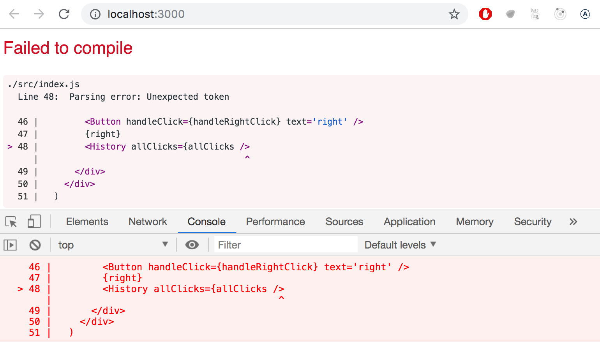
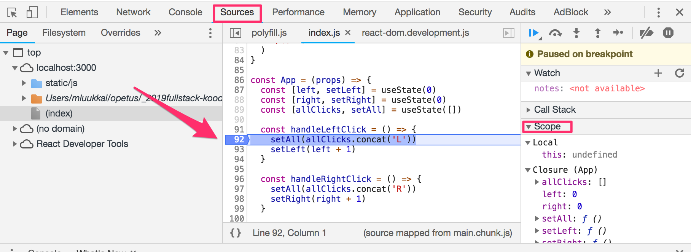
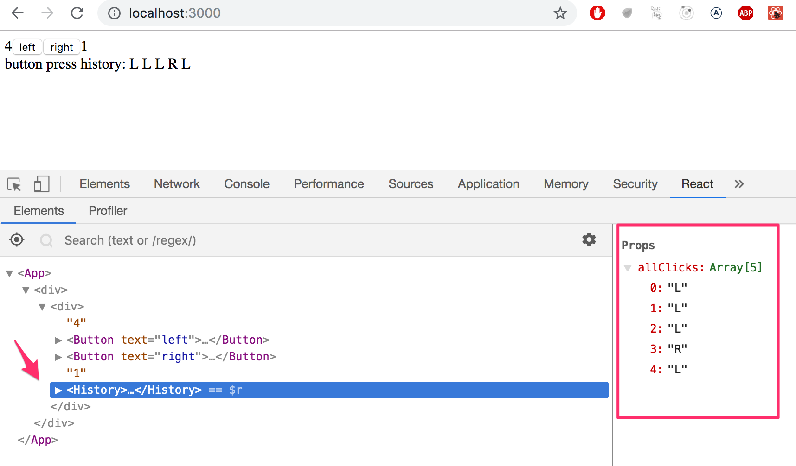
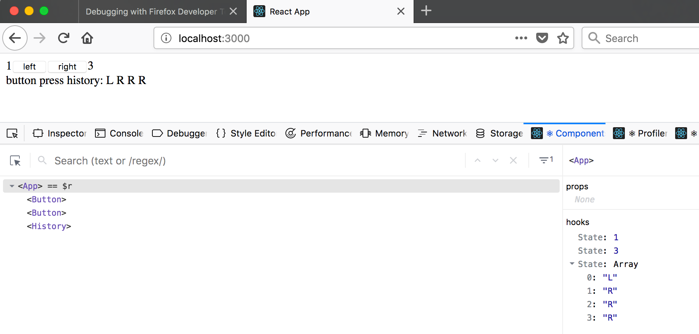
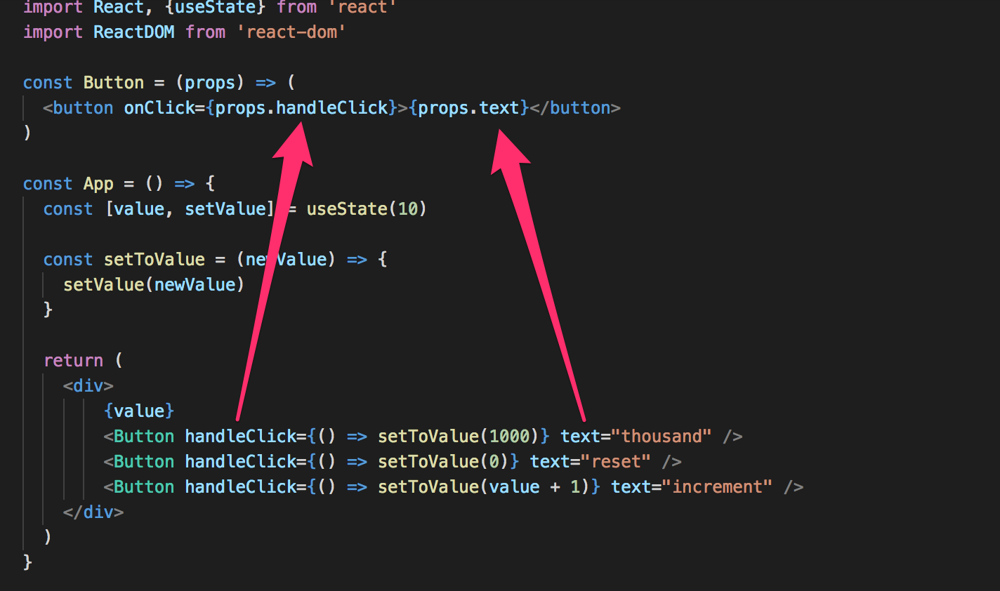
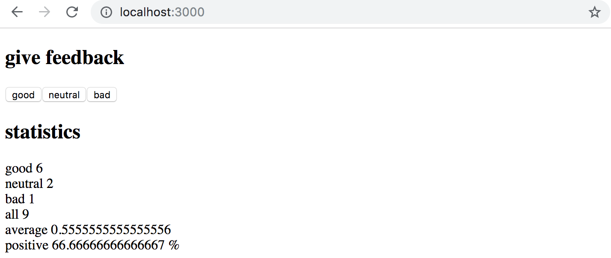
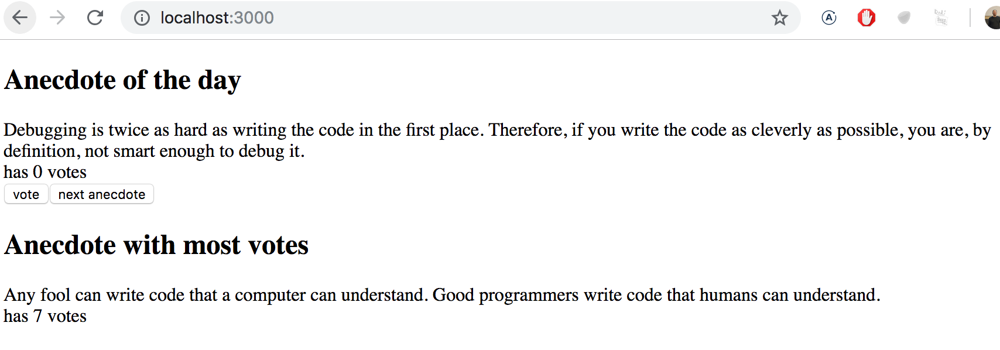

<div class="content">

### Monimutkaisempi tila

Edellisessä esimerkissä sovelluksen tila oli yksinkertainen, se koostui ainoastaan yhdestä kokonaisluvusta. Entä jos sovellus tarvitsee monimutkaisemman tilan?

Helpoin ja useimmiten paras tapa on luoda sovellukselle useita erillisiä tiloja tai tilan "osia" kutsumalla funktiota _useState_ useampaan kertaan.

Seuraavassa sovellukselle luodaan kaksi alkuarvon 0 saavaa tilaa _left_ ja _right_:

```js
const App = (props) => {
  const [left, setLeft] = useState(0)
  const [right, setRight] = useState(0)

  return (
    <div>
      <div>
        {left}
        <button onClick={() => setLeft(left + 1)}>
          left
        </button>
        <button onClick={() => setRight(right + 1)}>
          right
        </button>
        {right}
      </div>
    </div>
  )
}
```

Komponentti saa käyttöönsä tilan alustuksen yhteydessä funktiot _setLeft_ ja _setRight_ joiden avulla se voi päivittää tilan osia.

Komponentin tila tai yksittäinen tilan pala voi olla minkä tahansa tyyppinen. Voisimme toteuttaa saman toiminnallisuuden tallentamalla nappien <i>left</i> ja <i>right</i> painallukset yhteen olioon

```js
{
  left: 0,
  right: 0
}
```

sovellus muuttuisi seuraavasti:

```js
const App = (props) => {
  const [clicks, setClicks] = useState({
    left: 0, right: 0
  })

  const handleLeftClick = () => {
    const newClicks = { 
      left: clicks.left + 1, 
      right: clicks.right 
    }
    setClicks(newClicks)
  }

  const handleRightClick = () => {
    const newClicks = { 
      left: clicks.left, 
      right: clicks.right + 1 
    }
    setClicks(newClicks)
  }

  return (
    <div>
      <div>
        {clicks.left}
        <button onClick={handleLeftClick}>left</button>
        <button onClick={handleRightClick}>right</button>
        {clicks.right}
      </div>
    </div>
  )
}
```

Nyt komponentilla on siis ainoastaan yksi tila. Näppäinten painallusten yhteydessä on nyt huolehdittava <i>koko tilan</i> muutoksesta.

Tapahtumankäsittelijä vaikuttaa hieman sotkuiselta. Kun nappia <i>left</i> painetaan, suoritetaan seuraava funktio:

```js
const handleLeftClick = () => {
  const newClicks = { 
    left: clicks.left + 1, 
    right: clicks.right 
  }
  setClicks(newClicks)
}
```

uudeksi tilaksi siis aseteaan seuraava olio

```js
{
  left: clicks.left + 1,
  right: clicks.right
}
```

eli kentän <i>left</i> arvo on sama kuin alkuperäisen tilan kentän <i>left + 1</i> ja kentän <i>right</i> arvo on sama kuin alkuperäisen tilan kenttä <i>right</i>.

Uuden tilan määrittelevän olion modostaminen onnistuu hieman tyylikkäämmin hyödyntämällä kesällä 2018 kieleen tuotua [object spread](https://developer.mozilla.org/en-US/docs/Web/JavaScript/Reference/Operators/Spread_syntax) -syntaksia:

```js
const handleLeftClick = () => {
  const newClicks = { 
    ...clicks, 
    left: clicks.left + 1 
  }
  setClicks(newClicks)
}

const handleRightClick = () => {
  const newClicks = { 
    ...clicks, 
    right: clicks.right + 1 
  }
  setClicks(newClicks)
}
```

Merkintä vaikuttaa hieman erikoiselta. Käytännössä <em>{ ...clicks }</em> luo olion, jolla on kenttinään kopiot olion _clicks_ kenttien arvoista. Kun aaltosulkeisiin lisätään asioita, esim. <em>{ ...clicks, right: 1 }</em>, tulee uuden olion kenttä _right_ saamaan arvon 1.

Esimerkissämme siis

```js
{ ...clicks, right: clicks.right + 1 }
```

luo oliosta _clicks_ kopion, missä kentän _right_ arvoa kasvatetaan yhdellä.

Apumuuttujat ovat oikeastaan turhat, ja tapahtumankäsittelijät voidaan määritellä seuraavasti:

```js
const handleLeftClick = () =>
  setClicks({ ...clicks, left: clicks.left + 1 })

const handleRightClick = () =>
  setClicks({ ...clicks, right: clicks.right + 1 })
```

Lukijalle voi tässä vaiheessa herätä kysymys miksi emme hoitaneet tilan päivitystä seuraavalla tavalla

```js
const handleLeftClick = () => {
  clicks.left++
  setClicks(clicks)
}
```

Sovellus näyttää toimivan. Reactissa <i>ei kuitenkaan ole sallittua muuttaa tilaa suoraan</i>, sillä voi olla arvaamattomat seuraukset. Tilan muutos tulee aina tehdä asettamalla uudeksi tilaksi vanhan perusteella tehty kopio!

Kaiken tilan pitäminen yhdessä oliossa on tämän sovelluksen kannalta huono ratkaisu; etuja siinä ei juuri ole, mutta sovellus monimutkaistuu merkittävästi. Onkin ehdottomasti parempi ratkaisu tallettaa nappien klikkaukset erillisiin tilan paloihin.

On kuitenkin tilanteita, joissa jokin osa tilaa kannattaa pitää monimutkaisemman tietorakenteen sisällä. [Reactin dokumentaatiossa](https://reactjs.org/docs/hooks-faq.html#should-i-use-one-or-many-state-variables) on hieman ohjeistusta aiheeseen liityen.

### Taulukon käsittelyä

Tehdään sovellukseen vielä laajennus, lisätään sovelluksen tilaan taulukko _allClicks_ joka muistaa kaikki näppäimenpainallukset.

```js
const App = (props) => {
  const [left, setLeft] = useState(0)
  const [right, setRight] = useState(0)
  const [allClicks, setAll] = useState([]) // highlight-line

// highlight-start
  const handleLeftClick = () => {
    setAll(allClicks.concat('L'))
    setLeft(left + 1)
  }
// highlight-end  

// highlight-start
  const handleRightClick = () => {
    setAll(allClicks.concat('R'))
    setRight(right + 1)
  }
// highlight-end  

  return (
    <div>
      <div>
        {left}
        <button onClick={handleLeftClick}>left</button>
        <button onClick={handleRightClick}>right</button>
        {right}
        <p>{allClicks.join(' ')}</p> // highlight-line
      </div>
    </div>
  )
}
```

Kaikki klikkaukset siis talletetaan omaan tilan osaansa _allClicks_, joka alustetaan tyhjäksi taulukoksi

```js
const [allClicks, setAll] = useState([])
```

Kun esim. nappia <i>left</i> painetaan, lisätään tilan taulukkoon _allClicks_ kirjain <i>L</i>:

```js
const handleLeftClick = () => {
  setAll(allClicks.concat('L'))
  setLeft(left + 1)
}
```

Tilan osa _allClicks_ saa nyt arvokseen taulukon, missä on entisen taulukon alkiot ja <i>L</i>. Uuden alkion liittäminen on tehty metodilla [concat](https://developer.mozilla.org/en-US/docs/Web/JavaScript/Reference/Global_Objects/Array/concat), joka toimii siten, että se ei muuta olemassaolevaa taulukkoa vaan luo <i>uuden taulukon</i>, mihin uusi alkio on lisätty.

Kuten jo aiemmin mainittiin, Javascriptissa on myös mahdollista lisätä taulukkoon metodilla [push](https://developer.mozilla.org/en-US/docs/Web/JavaScript/Reference/Global_Objects/Array/push) ja sovellus näyttäisi tässä tilanteessa toimivan myös jos lisäys hoidettaisiin siten että _allClicks_-tilaa muuteaan pushaamalla siihen alkio ja sitten päivitetään tila:

```js
const handleLeftClick = () => {
  allClicks.push('L')
  setAll(allClicks)
  setLeft(left + 1)
}
```

Älä kuitenkaan tee näin. Kuten jo mainitsimme, React-komponentin tilaa, eli esimerkiksi muuttujaa _allClicks_ ei saa muuttaa. Vaikka tilan muuttaminen näyttääkin toimivan joissaikin tilanteissa, voi seurauksena olla hankalasti havaittavia ongelmia.

Katsotaan vielä tarkemmin, miten kaikkien painallusten historia renderöidään ruudulle:

```js
const App = (props) => {
  // ...

  return (
    <div>
      <div>
        {left}
        <button onClick={handleLeftClick}>left</button>
        <button onClick={handleRightClick}>right</button>
        {right}
        <p>{allClicks.join(' ')}</p> // highlight-line
      </div>
    </div>
  )
}
```

Taulukolle _allClicks_ kutsutaan metodia [join](https://developer.mozilla.org/en-US/docs/Web/JavaScript/Reference/Global_Objects/Array/join), joka muodostaa taulukosta merkkijonon, joka sisältää taulukon alkiot erotettuina parametrina olevalla merkillä, eli välilyönnillä.

### Ehdollinen renderöinti

Muutetaan sovellusta siten, että näppäilyhistorian renderöinnistä vastaa komponentti <i>History</i>:

```js
const History = (props) => {
  if (props.allClicks.length === 0) {
    return (
      <div>
        the app is used by pressing the buttons
      </div>
    )
  }

  return (
    <div>
      button press history: {props.allClicks.join(' ')}
    </div>
  )
}

const App = (props) => {
  // ...

  return (
    <div>
      <div>
        {left}
        <button onClick={handleLeftClick}>left</button>
        <button onClick={handleRightClick}>right</button>
        {right}
        <History allClicks={allClicks} /> // highlight-line
      </div>
    </div>
  )
}
```

Nyt komponentin toiminta riippuu siitä, onko näppäimiä jo painettu. Jos ei, eli taulukko <em>allClicks</em> on tyhjä, renderöi komponentti "käyttöohjeen" sisältävän divin.

```js
<div>the app is used by pressing the buttons</div>
```

ja muussa tapauksessa näppäilyhistorian:

```js
<div>
  button press history: {props.allClicks.join(' ')}
</div>
```

Komponentin <i>History</i> ulkoasun muodostamat React-elementit siis ovat erilaisia riippuen sovelluksen tilasta, eli komponentissa on <i>ehdollista renderöintiä</i>.

Reactissa on monia muitakin tapoja [ehdolliseen renderöintiin](https://reactjs.org/docs/conditional-rendering.html). Katsotaan niitä tarkemmin [seuraavassa osassa](/osa2).

Muutetaan vielä sovellusta siten, että se käyttää aiemmin määrittelemäämme komponenttia _Button_ painikkeiden muodostamiseen:

```js
const History = (props) => {
  if (props.allClicks.length === 0) {
    return (
      <div>
        the app is used by pressing the buttons
      </div>
    )
  }

  return (
    <div>
      button press history: {props.allClicks.join(' ')}
    </div>
  )
}

// highlight-start
const Button = ({ onClick, text }) => (
  <button onClick={onClick}>
    {text}
  </button>
)
// highlight-end

const App = (props) => {
  const [left, setLeft] = useState(0)
  const [right, setRight] = useState(0)
  const [allClicks, setAll] = useState([])

  const handleLeftClick = () => {
    setAll(allClicks.concat('L'))
    setLeft(left + 1)
  }

  const handleRightClick = () => {
    setAll(allClicks.concat('R'))
    setRight(right + 1)
  }

  return (
    <div>
      <div>
        {left}
        // highlight-start
        <Button onClick={handleLeftClick} text='left' />
        <Button onClick={handleRightClick} text='right' />
        // highlight-end
        {right}
        <History allClicks={allClicks} />
      </div>
    </div>
  )
}
```

### Vanha React

Tällä kurssilla käyttämämme tapa React-komponenttien tilan määrittelyyn, eli [state hook](https://reactjs.org/docs/hooks-state.html) on siis uutta Reactia ja käytettävissä versiosta [16.8.0](https://www.npmjs.com/package/react/v/16.8.0) lähtien. Ennen hookeja Javascript-funktioina määriteltyihin React-komponentteihin ei ollut mahdollista saada tilaa ollenkaan, tilaa edellyttävät komponentit oli pakko määritellä [Class](https://reactjs.org/docs/react-component.html)-komponentteina Javascriptin luokkasyntaksia hyödyntäen.

Olemme tällä kurssilla tehneet hieman radikaalinkin ratkaisun käyttää pelkästään hookeja ja näin ollen opetella heti alusta asti ohjelmoimaan "huomisen" Reactia. Luokkasyntaksin hallitseminen on kuitenkin sikäli tärkeää, että vaikka funktiona määriteltävät komponentit ovat Reactin tulevaisuus, on maailmassa miljardeja rivejä vanhaa Reactia, jota kenties sinäkin joudut jonain päivänä ylläpitämään. Dokumentaation ja internetistä löytyvien esimerkkien suhteen tilanne on sama, törmäät class-komponentteihin välittömästi.

Tutustummekin riittävällä tasolla class-komponentteihin hieman myöhemmin kurssilla.

### React-sovellusten debuggaus

Ohjelmistokehittäjän elämä koostuu pääosin debuggaamisesta (ja olemassaolevan koodin lukemisesta). Silloin tällöin syntyy toki muutama rivi uuttakin koodia, mutta suuri osa ajasta ihmetellään miksi joku on rikki tai miksi joku asia ylipäätään toimii. Hyvät debuggauskäytänteet ja työkalut ovatkin todella tärkeitä.

Onneksi React on debuggauksen suhteen jopa harvinaisen kehittäjäystävällinen kirjasto.

Muistutetaan vielä tärkeimmästä web-sovelluskehitykseen liittyvästä asiasta:

<h4>Web-sovelluskehityksen sääntö numero yksi</h4>

>  **Pidä selaimen developer-konsoli koko ajan auki.**
>
> Välilehdistä tulee olla auki nimenomaan <i>Console</i> jollei ole erityistä syytä käyttää jotain muuta välilehteä.

Pidä myös koodi ja web-sivu **koko ajan** molemmat yhtä aikaa näkyvillä.

Jos ja kun koodi ei käänny, eli selaimessa alkaa näkyä punaista



älä kirjota enää lisää koodia vaan selvitä ongelma **välittömästi**. Koodauksen historia ei tunne tilannetta, missä kääntymätön koodi alkaisi ihmeenomaisesti toimimaan kirjoittamalla suurta määrää lisää koodia, enkä usko että sellaista ihmettä nähdään tälläkään kurssilla.

Vanha kunnon printtaukseen perustuva debuggaus kannattaa aina. Eli jos esim. komponentissa

```js
const Button = ({ handleClick, text }) => (
  <button onClick={handleClick}>
    {text}
  </button>
)
```

olisi jotain ongelmia, kannattaa komponentista alkaa printtailla konsoliin. Pystyäksemme printtaamaan, tulee funktio muuttaa pitempään muotoon ja propsit kannattaa kenties vastaanottaa ilman destrukturointia:

```js
const Button = (props) => { 
  console.log(props) // highlight-line
  const { handleClick, text } = props
  return (
    <button onClick={handleClick}>
      {text}
    </button>
  )
}
```

näin selviää heti onko esim. joku propsia vastaava attribuutti nimetty väärin komponenttia käytettäessä.

**HUOM** kun käytät komentoa _console.log_ debuggaukseen, älä yhdistele asioita "javamaisesti" plussalla, eli sen sijaan että kirjoittaisit

```js
console.log('props value is' + props)
```

erottele tulostettavat asiat pilkulla:

```js
console.log('props value is', props)
```

Jos yhdistät merkkijonoon olion, tuloksena on suhteellisen hyödytön tulostusmuoto

```js
props value is [Object object]
```

kun taas pilkulla tulostettavat asiat erotellessa saat developer-konsoliin olion, jonka sisältöä on mahdollista tarkastella.

Konsoliin tulostus ei ole suinkaan ainoa keino debuggaamiseen. Koodin suorituksen voi pysäyttää Chromen developer konsolin <i>debuggeriin</i> kirjoittamalla mihin tahansa kohtaa koodia komennon [debugger](https://developer.mozilla.org/en-US/docs/Web/JavaScript/Reference/Statements/debugger).

Koodi pysähtyy kun suoritus etenee sellaiseen pisteeseen, missä komento _debugger_ suoritetaan:


Menemällä välilehdelle <i>Console</i> on helppo tutkia muuttujien tilaa:


Kun bugi selviää, voi komennon _debugger_ poistaa ja uudelleenladata sivun.

Debuggerissa on mahdollista suorittaa koodia tarvittaessa rivi riviltä <i>Sources</i>-välilehden oikealta laidalta.

Debuggeriin pääsee myös ilman komentoa _debugger_, lisäämällä <i>Sources</i>-välilehdellä sopiviin kohtiin koodia <i>breakpointeja</i>. Komponentin muuttujien arvojen tarkkailu on mahdollista _Scope_-osassa:



Chromeen kannattaa ehdottomasti asentaa [React developer tools](https://chrome.google.com/webstore/detail/react-developer-tools/fmkadmapgofadopljbjfkapdkoienihi) -lisäosa, joka tuo konsoliin uuden tabin _React_:



Uuden konsolitabin avulla voidaan tarkkailla sovelluksen React-elementtejä ja niiden tilaa ja propseja.

React developer tools ei osaa toistaiseksi näyttää hookeilla muodostettua tilaa kovin hyvin.


Komponentin tila on määritelty seuraavasti:

```js
const [left, setLeft] = useState(0)
const [right, setRight] = useState(0)
const [allClicks, setAll] = useState([])
```

Dev tools näyttää hookien tilan siinä järjestyksessä kun ne on määritelty koodissa. Hookien _left_ ja _right_ tila näkyy hyvin, mutta valitettavasti dev tools ei tässä vaiheessa osaa näyttää taulukkotyyppistä hookia _allClicks_ kunnolla.

Dev toolsin hookien toteutusta käsitellään [tässä issuessa](https://github.com/facebook/react-devtools/issues/1215).

Dev toolsin hookeja tukevasta versiosta on jo tehty epävirallinen [beta-julkaisu](https://github.com/bvaughn/react-devtools-experimental). En saanut itse Chrome-versiota toimimaan, mutta Firefox-versio toimii ja näyttää hookatun taulukkomuotoisen tilan hyvin



### Hookien säännöt

Jotta hookeilla muodostettu sovelluksen tila toimisi oikein, on hookeja käytettävä tiettyjä [rajoituksia](https://reactjs.org/docs/hooks-rules.html) noudattaen.

Funktiota _useState_ (eikä seuraavassa osassa esiteltävää funktiota _useEffect_) <i>ei saa kutsua</i> loopissa, ehtolausekkeiden sisältä tai muista kun komponentin määrittelevästä funktioista. Tämä takaa sen, että hookeja kutsutaan aina samassa järjestyksessä, jos näin ei ole, sovellus toimii miten sattuu.

Hookeja siis kuuluu kutsua ainoastaan React-komponentin määrittelevän funktion rungosta:

```js
const App = (props) => {
  // nämä ovat ok
  const [age, setAge] = useState(0)
  const [name, setName] = useState('Juha Tauriainen')

  if ( age > 10 ) {
    // ei näin!
    const [foobar, setFoobar] = useState(null)
  }

  for ( let i = 0; i < age; i++ ) {
    // eikä näin!
    const [rightWay, setRightWay] = useState(false)
  }

  const notGood = () => {
    // eikä myöskään näin
    const [x, setX] = useState(-1000)
  }

  return (
    //...
  )
}
```

### Tapahtumankäsittely revisited

Edellisen vuoden kurssin perusteella tapahtumankäsittely on osoittautunut monelle haastavaksi.

Tarkastellaan asiaa vielä uudelleen.

Oletetaan, että käytössä on äärimmäisen yksinkertainen sovellus:

```js
const App = (props) => {
  const [value, setValue] = useState(10)

  return (
    <div>
      {value}
      <button>reset to zero</button>
    </div>
  )
}

ReactDOM.render(
  <App />, 
  document.getElementById('root')
)
```

Haluamme, että napin avulla tilan tallettava muuttuja _value_ saadaan nollattua.

Jotta saamme napin reagoimaan, on sille lisättävä <i>tapahtumankäsittelijä</i>.

Tapahtumankäsittelijän tulee aina olla <i>funktio</i> tai viite funktioon. Jos tapahtumankäsittelijän paikalle yritetään laittaa jotain muuta, ei nappi toimi.

Jos esim. antaisimme tapahtumankäsittelijäksi merkkijonon:

```js
<button onClick={'crap...'}>button</button>
```

React varoittaa asiasta konsolissa

```js
index.js:2178 Warning: Expected `onClick` listener to be a function, instead got a value of `string` type.
    in button (at index.js:20)
    in div (at index.js:18)
    in App (at index.js:27)
```

myös seuraavanlainen yritys olisi tuhoon tuomittu

```js
<button onClick={value + 1}>button</button>
```

nyt tapahtumankäsittelijäksi on yritetty laittaa _value + 1_ mikä tarkoittaa laskuoperaation tulosta. React varoittaa tästäkin konsolissa

```js
index.js:2178 Warning: Expected `onClick` listener to be a function, instead got a value of `number` type.
```

Myöskään seuraava ei toimi

```js
<button onClick={value = 0}>button</button>
```

taaskaan tapahtumankäsittelijänä ei ole funktio vaan sijoitusoperaatio. Konsoliin tulee valitus. Tämä tapa on myös toisella tavalla väärin. Tilan muuttaminen ei onnistu suoraan tilan arvon tallentavaa muuttujaa muuttamalla.

Entä seuraava:

```js
<button onClick={console.log('clicked the button')}>
  button
</button>
```

konsoliin tulostuu kertaalleen <i>clicked the button</i>, mutta nappia painellessa ei tapahdu mitään. Miksi tämä ei toimi vaikka tapahtumankäsittelijänä on nyt funktio _console.log_?

Ongelma on nyt siinä, että tapahtumankäsittelijänä on <i>funktion kutsu</i>, eli varsinaiseksi tapahtumankäsittelijäksi tulee funktion kutsun paluuarvo, joka on tässä tapauksessa määrittelemätön arvo <i>undefined</i>.

Funktiokutsu _console.log('clicked the button')_ suoritetaan siinä vaiheessa kun komponentti renderöidään, ja tämän takia konsoliin tulee tulostus kertalleen.

Myös seuraava yritys on virheellinen

```js
<button onClick={setValue(0)}>button</button>
```

jälleen olemme yrittäneet laittaa tapahtumankäsittelijäksi funktiokutsun. Ei toimi. Tämä yritys aiheuttaa myös toisen ongelman. Kun komponenttia renderöidään, suoritetaan tapahtumankäsittelijänä oleva funktiokutsu _setValue(0)_ joka taas saa aikaan komponentin uudelleenrenderöinnin. Ja uudelleenrenderöinnin yhteydessä funktiota kutsutaan uudelleen käynnistäen jälleen uusi uudelleenrenderöinti, ja joudutaan päättymättömään rekursioon.

Jos haluamme suorittaa tietyn funktiokutsun tapahtuvan nappia painettaessa, toimii seuraava

```js
<button onClick={() => console.log('clicked the button')}>
  button
</button>
```

Nyt tapahtumankäsittelijä on nuolisyntaksilla määritelty funktio _() => console.log('clicked the button')_. Kun komponentti renderöidään, ei suoriteta mitään, ainoastaan talletetaan funktioviite tapahtumankäsittelijäksi. Itse funktion suoritus tapahtuu vasta napin painallusten yhteydessä.

Saamme myös nollauksen toimimaan samalla tekniikalla

```js
<button onClick={() => setValue(0)}>button</button>
```

eli nyt tapahtumankäsittelijä on funktio _() => setValue(0)_.

Tapahtumakäsittelijäfunktioiden määrittely suoraan napin määrittelyn yhteydessä ei välttämättä ole paras mahdollinen idea.

Usein tapahtumankäsittelijä määritelläänkin jossain muualla. Seuraavassa määritellään funktio ja sijoitetaan se muuttujaan _handleClick_ komponentin rungossa:

```js
const App = (props) => {
  const [value, setValue] = useState(10)

  const handleClick = () =>
    console.log('clicked the button')

  return (
    <div>
      {value}
      <button onClick={handleClick}>button</button>
    </div>
  )
}
```

Muuttujassa _handleClick_ on nyt talletettuna viite itse funktioon. Viite annetaan napin määrittelyn yhteydessä attribuutin <i>onClick</i>:

```js
<button onClick={handleClick}>button</button>
```

Tapahtumankäsittelijäfunktio voi luonnollisesti koostua useista komennoista, tällöin käytetään nuolifunktion aaltosulullista muotoa:

```js
const App = (props) => {
  const [value, setValue] = useState(10)

  // highlight-start
  const handleClick = () => {
    console.log('clicked the button')
    setValue(0)
  }
   // highlight-end

  return (
    <div>
      {value}
      <button onClick={handleClick}>button</button>
    </div>
  )
}
```

Mennään lopuksi <i>funktion palauttavaan funktioon</i>. Kuten aiemmin jo mainittiin, et tarvitse ainakaan tämän osan, et kenties koko kurssin tehtävissä funktiota palauttavia funktioita, joten voit melko huoletta hypätä seuraavan ohi jos asia tuntuu nyt hankalalta.

Muutetaan koodia seuraavasti

```js
const App = (props) => {
  const [value, setValue] = useState(10)

  // highlight-start
  const hello = () => {
    const handler = () => console.log('hello world')

    return handler
  }
  // highlight-end

  return (
    <div>
      {value}
      <button onClick={hello()}>button</button>
    </div>
  )
}
```

Koodi näyttää hankalalta mutta se ihme kyllä toimii.

Tapahtumankäsittelijäksi on nyt "rekisteröity" funktiokutsu:

```js
<button onClick={hello()}>button</button>
```

Aiemmin varoteltiin, että tapahtumankäsittelijä ei saa olla funktiokutsu vaan sen on oltava funktio tai viite funktioon. Miksi funktiokutsu kuitenkin toimii nyt?

Kun komponenttia renderöidään suoritetaan seuraava funktio:

```js
const hello = () => {
  const handler = () => console.log('hello world')

  return handler
}
```

funktion <i>paluuarvona</i> on nyt toinen, muuttujaan _handler_ määritelty funktio.

eli kun react renderöi seuraavan rivin

```js
<button onClick={hello()}>button</button>
```

sijoittaa se onClick-käsittelijäksi funktiokutsun _hello()_ paluuarvon. Eli oleellisesti ottaen rivi "muuttuu" seuraavaksi

```js
<button onClick={() => console.log('hello world')}>
  button
</button>
```

koska funktio _hello_ palautti funktion, on tapahtumankäsittelijä nyt funktio.

Mitä järkeä tässä konseptissa on?

Muutetaan koodia hiukan:

```js
const App = (props) => {
  const [value, setValue] = useState(10)

  // highlight-start
  const hello = (who) => {
    const handler = () => {
      console.log('hello', who)
    }

    return handler
  }
  // highlight-end  

  return (
    <div>
      {value}
  // highlight-start      
      <button onClick={hello('world')}>button</button>
      <button onClick={hello('react')}>button</button>
      <button onClick={hello('function')}>button</button>
  // highlight-end      
    </div>
  )
}
```

Nyt meillä on kolme nappia joiden tapahtumankäsittelijät määritellään parametrin saavan funktion _button_ avulla.

Ensimmäinen nappi määritellään seuraavasti

```js
<button onClick={hello('world')}>button</button>
```

Tapahtumankäsittelijä siis saadaan <i>suorittamalla</i> funktiokutsu _hello('world')_. Funktiokutsu palauttaa funktion

```js
() => {
  console.log('hello', 'world')
}
```

Toinen nappi määritellään seuraavasti

```js
<button onClick={hello('react')}>button</button>
```

Tapahtumankäsittelijän määrittelevä funktiokutsu _hello('react')_ palauttaa

```js
() => {
  console.log('hello', 'react')
}
```

eli molemmat napit saavat oman, yksilöllisen tapahtumankäsittelijänsä.

Funktioita palauttavia funktioita voikin hyödyntää määrittelemään geneeristä toiminnallisuutta, jota voi tarkentaa parametrien avulla. Tapahtumankäsittelijöitä luovan funktion _hello_ voikin ajatella olevan eräänlainen tehdas, jota voi pyytää valmistamaan sopivia tervehtimiseen tarkoitettuja tapahtumankäsittelijäfunktioita.

Käyttämämme määrittelytapa

```js
const hello = (who) => {
  const handler = () => {
    console.log('hello', who)
  }

  return handler
}
```

on hieman verboosi. Eliminoidaan apumuuttuja, ja määritellään palautettava funktio suoraan returnin yhteydessä:

```js
const hello = (who) => {
  return () => {
    console.log('hello', who)
  }
}
```

ja koska funktio _hello_ sisältää ainoastaan yhden komennon, eli returnin, voidaan käyttää aaltosulutonta muotoa

```js
const hello = (who) =>
  () => {
    console.log('hello', who)
  }
```

ja tuodaan vielä "kaikki nuolet" samalle riville

```js
const hello = (who) => () => {
  console.log('hello', who)
}
```

Voimme käyttää samaa kikkaa myös muodostamaan tapahtumankäsittelijöitä, jotka asettavat komponentin tilalle halutun arvon. Muutetaan koodi muotoon:

```js
render() {
  const setToValue = (newValue) => () => {
    setValue(newValue)
  }

  return (
    <div>
      {value}
      <button onClick={setToValue(1000)}>thousand</button>
      <button onClick={setToValue(0)}>reset</button>
      <button onClick={setToValue(value + 1)}>increment</button>
    </div>
  )
}
```

Kun komponentti renderöidään, ja tehdään nappia <i>thousand</i>

```js
<button onClick={setToValue(1000)}>thousand</button>
```

tulee tapahtumankäsittelijäksi funktiokutsun _setToValue(1000)_ paluuarvo eli seuraava funktio

```js
() => {
    setValue(1000)
}
```

Kasvatusnapin generoima rivi on seuraava

```js
<button onClick={setToValue(value + 1)}>increment</button>
```

Tapahtumankäsittelijän muodostaa funktiokutsu _setToValue(value + 1)_, joka saa parametrikseen tilan tallettavan muuttujan _value_ nykyisen arvon kasvatettuna yhdellä. Jos _value_ olisi 10, tulisi tapahtumankäsittelijäksi funktio

```js
() => {
  setValue(11)
}
```

Funktioita palauttavia funktioita ei tässäkään tapauksessa olisi ollut pakko käyttää. Muutetaan tilan päivittämisestä huolehtiva funktio _setToValue_ normaaliksi funktioksi:

```js
const App = (props) => {
  const [value, setValue] = useState(10)

  const setToValue = (newValue) => {
    setValue(newValue)
  }

  return (
    <div>
      {value}
      <button onClick={() => setToValue(1000)}>
        thousand
      </button>
      <button onClick={() => setToValue(0)}>
        reset
      </button>
      <button onClick={() => setToValue(value + 1)}>
        increment
      </button>
    </div>
  )
}
```

Voimme nyt määritellä tapahtumankäsittelijän funktioksi, joka kutsuu funktiota _setToValue_ sopivalla parametrilla, esim. nollaamisen tapahtumankäsittelijä:

```js
<button onClick={() => setToValue(0)}>reset</button>
```

On aikalailla makuasia käyttääkö tapahtumankäsittelijänä funktioita palauttavia funktioita vai nuolifunktioita.

### Tapahtumankäsittelijän vieminen alikomponenttiin

Eriytetään vielä painike omaksi komponentikseen

```js
const Button = (props) => (
  <button onClick={props.handleClick}>
    {props.text}
  </button>
)
```

Komponentti saa siis propsina _handleClick_ tapahtumankäsittelijän ja propsina _text_ merkkijonon, jonka se renderöi painikkeen tekstiksi.

Komponentin <i>Button</i> käyttö on helppoa, on toki pidettävä huolta siitä, että komponentille annettavat propsit on nimetty niin kuin komponentti olettaa:



### Älä määrittele komponenttia komponentin sisällä

Eriytetään vielä sovelluksestamme luvun näyttäminen omaan komponenttiin <i>Display</i>.

Muutetaan ohjelmaa seuraavasti, eli määritelläänkin uusi komponentti <i>App</i>-komponentin sisällä:

```js
// tämä on oikea paikka määritellä komponentti!
const Button = (props) => (
  <button onClick={props.handleClick}>
    {props.text}
  </button>
)

const App = props => {
  const [value, setValue] = useState(10)

  const setToValue = newValue => {
    setValue(newValue)
  }

  // älä määrittele komponenttia täällä!
  const Display = props => <div>{props.value}</div> // highlight-line

  return (
    <div>
      <Display value={value} />
      <Button handleClick={() => setToValue(1000)} text="thousand" />
      <Button handleClick={() => setToValue(0)} text="reset" />
      <Button handleClick={() => setToValue(value + 1)} text="increment" />
    </div>
  )
}
```

Kaikki näyttää toimivan. Mutta **älä tee koskaan näin!**, eli määrittele komponenttia toisen komponentin sisällä. Tapa on hyödytön ja johtaa useissa tilanteissa ikäviin ongelmiin. Siirretäänkin komponentin <i>Display</i> määrittely oikeaan paikkaan, eli komponentin <i>App</i> määrittelevän funktion ulkopuolelle:

```js
const Display = props => <div>{props.value}</div>

const Button = (props) => (
  <button onClick={props.handleClick}>
    {props.text}
  </button>
)

const App = props => {
  const [value, setValue] = useState(10)

  const setToValue = newValue => {
    setValue(newValue)
  }

  return (
    <div>
      <Display value={value} />
      <Button handleClick={() => setToValue(1000)} text="thousand" />
      <Button handleClick={() => setToValue(0)} text="reset" />
      <Button handleClick={() => setToValue(value + 1)} text="increment" />
    </div>
  )
}
```

### Hyödyllistä materiaalia

Internetissä on todella paljon Reactiin liittyvää materiaalia. Tällä hetkellä ongelman muodostaa kuitenkin se, että käytämme kurssilla niin uutta Reactia, että suurin osa internetistä löytyvästä tavarasta on meidän kannaltamme vanhentunutta.

Seuraavassa muutamia linkkejä:

- Reactin [docs](https://reactjs.org/docs/hello-world.html) kannattaa ehdottomasti käydä jossain vaiheessa läpi, ei välttämättä kaikkea nyt, osa on ajankohtaista vasta kurssin myöhemmissä osissa ja kaikki Class-komponentteihin liittyvä on kurssin kannalta epärelevanttia
- Reactin sivuilla oleva [tutoriaali](https://reactjs.org/tutorial/tutorial.html) sen sijaan on aika huono
- [Egghead.io](https://egghead.io):n kursseista [Start learning React](https://egghead.io/courses/start-learning-react) on laadukas, ja hieman uudempi [The Beginner's guide to React](https://egghead.io/courses/the-beginner-s-guide-to-reactjs) on myös kohtuullisen hyvä; molemmat sisältävät myös asioita jotka tulevat tällä kurssilla vasta myöhemmissä osissa. Molemmissa toki se ongelma, että ne käyttävät Class-komponentteja

</div>

<div class="tasks">
  <h3>Tehtäviä</h3>

Tehtävät palautetaan GitHubin kautta ja merkitsemällä tehdyt tehtävät [palautussovellukseen](https://studies.cs.helsinki.fi/fullstackopen2019/).

Tehtävät palautetaan **yksi osa kerrallaan**. Kun olet palauttanut osan tehtävät, et voi enää palauttaa saman osan tekemättä jättämiäsi tehtäviä.

<i>Samaa ohjelmaa kehittelevissä tehtäväsarjoissa ohjelman lopullisen version palauttaminen riittää, voit toki halutessasi tehdä commitin jokaisen tehtävän jälkeisestä tilanteesta, mutta se ei ole välttämätöntä.</i>

**VAROITUS** create-react-app tekee projektista automaattisesti git-repositorion, ellei sovellusta luoda jo olemassaolevan repositorion sisälle. Todennäköisesti **et halua** että projektista tulee repositorio, joten suorita projektin juuressa komento _rm -rf .git_.

**React ei toimi...** käyttäessäsi tilan tuovaa hookia <i>useState</i>, saatat törmätä seuraavaan virheilmoitukseen:


Syynä tälle on se, että <i>et ole asentanut</i> riittävän uutta Reactia kuten [osan 1 alussa](/osa1/reactin_alkeet) neuvottiin.

Joissain tilanteissa saatat myös joutua antamaan komennon

``` 
rm -rf node_modules/ && npm i
```

  <h4> 1.6: unicafe step1</h4>

Monien firmojen tapaan nykyään myös [Unicafe](https://www.unicafe.fi/#/9/4) kerää asiakaspalautetta. Tee Unicafelle verkossa toimiva palautesovellus. Vastausvaihtoehtoja olkoon vain kolme: <i>hyvä</i>, <i>neutraali</i> ja <i>huono</i>.

Sovelluksen tulee näyttää jokaisen palautteen lukumäärä. Sovellus voi näyttää esim. seuraavalta:


Huomaa, että sovelluksen tarvitsee toimia vain yhden selaimen käyttökerran ajan, esim. kun selain refreshataan, tilastot saavat hävitä.

Voit tehdä koko sovelluksen tiedostoon <i>index.js</i>. Tiedoston sisältö voi olla aluksi seuraava

```js
import React, { useState } from 'react'
import ReactDOM from 'react-dom'

const App = () => {
  // tallenna napit omaan tilaansa
  const [good, setGood] = useState(0)
  const [neutral, setNeutral] = useState(0)
  const [bad, setBad] = useState(0)

  return (
    <div>
      code here
    </div>
  )
}

ReactDOM.render(<App />, 
  document.getElementById('root')
)
```

<h4>1.7: unicafe step2</h4>

Laajenna sovellusta siten, että se näyttää palautteista enemmän statistiikkaa: yhteenlasketun määrän, keskiarvon (hyvän arvo 1, neutraalin 0, huonon -1) ja sen kuinka monta prosenttia palautteista on ollut positiivisia:



<h4>1.8: unicafe step3</h4>

Refaktoroi sovelluksesi siten, että tilastojen näyttäminen on eriytetty oman komponentin <i>Statistics</i> vastuulle. Sovelluksen tila säilyy edelleen juurikomponentissa <i>App</i>.

Muista, että komponentteja ei saa määritellä toisen komponentin sisällä:

```js
// oikea paikka komponentin määrittelyyn
const Statistics = (props) => {
  // ...
}

const App = () => {
  const [good, setGood] = useState(0)
  const [neutral, setNeutral] = useState(0)
  const [bad, setBad] = useState(0)

  // EI NÄIN!!! eli älä määrittele komponenttia 
  // toisen komponentin sisällä!
  const Statistics = (props) => {
    // ...
  }

  return (
    // ...
  )
}
```

<h4>1.9: unicafe step4</h4>

Muuta sovellusta siten, että numeeriset tilastot näytetään ainoastaan jos palautteita on jo annettu:


<h4>1.10: unicafe step5</h4>

Jatketaan sovelluksen refaktorointia. Eriytä seuraavat <i>kaksi</i> komponenttia

- <i>Button</i> vastaa yksittäistä palautteenantonappia
- <i>Statistic</i> huolehtii tilastorivien, esim. keskiarvon näyttämisestä

Tarkennuksena: komponentti <i>Statistic</i> näyttää aina yhden tilastorivin, joten sovellus käyttää montaa komponenttia kaikkien tilastorivien renderöintiin 

```js
const Statistics = (props) => {
  /// ...
  return(
    <div>
      <Statistic text="good" value ={...} />
      <Statistic text="neutral" value ={...} />
      <Statistic text="bad" value ={...} />
      // ...
    </div>
  )
}

```

Sovelluksen tila säilytetään edelleen juurikomponentissa <i>App</i>.

<h4>1.11*: unicafe step6</h4>

Toteuta tilastojen näyttäminen HTML:n [taulukkona](https://developer.mozilla.org/en-US/docs/Learn/HTML/Tables/Basics) siten, että saat sovelluksesi näyttämään suunnilleen seuraavanlaiselta:


Muista pitää konsoli koko ajan auki. Jos saat konsoliin seuraavan warningin:


tee tarvittavat toimenpiteet jotta saat warningin katoamaan. Googlaa tarvittaessa virheilmoituksella.

**Huolehdi nyt ja jatkossa, että konsolissa ei näy mitään warningeja!**

<h4>1.12*: anekdootit step1</h4>

Ohjelmistotuotannossa tunnetaan lukematon määrä [anekdootteja](http://www.comp.nus.edu.sg/~damithch/pages/SE-quotes.htm) eli pieniä "onelinereita", jotka kiteyttävät alan ikuisia totuuksia.

Laajenna seuraavaa sovellusta siten, että siihen tulee nappi, jota painamalla sovellus näyttää <i>satunnaisen</i> ohjelmistotuotantoon liittyvän anekdootin:

```js
import React, { useState } from 'react'
import ReactDOM from 'react-dom'

const App = (props) => {
  const [selected, setSelected] = useState(0)

  return (
    <div>
      {props.anecdotes[selected]}
    </div>
  )
}

const anecdotes = [
  'If it hurts, do it more often',
  'Adding manpower to a late software project makes it later!',
  'The first 90 percent of the code accounts for the first 90 percent of the development time...The remaining 10 percent of the code accounts for the other 90 percent of the development time.',
  'Any fool can write code that a computer can understand. Good programmers write code that humans can understand.',
  'Premature optimization is the root of all evil.',
  'Debugging is twice as hard as writing the code in the first place. Therefore, if you write the code as cleverly as possible, you are, by definition, not smart enough to debug it.'
]

ReactDOM.render(
  <App anecdotes={anecdotes} />,
  document.getElementById('root')
)
```

Google kertoo, miten voit generoida Javascriptilla sopivia satunnaisia lukuja. Muista, että voit testata esim. satunnaislukujen generointia konsolissa.

Sovellus voi näyttää esim. seuraavalta:


**VAROITUS** create-react-app tekee projektista automaattisesti git-repositorion, ellei sovellusta luoda jo olemassaolevan repositorion sisälle. Todennäköisesti **et halua** että projektista tulee repositorio, joten suorita projektin juuressa komento _rm -rf .git_.

<h4>1.13*: anekdootit step2</h4>

Laajenna sovellusta siten, että näytettävää anekdoottia on mahdollista äänestää:


**Huom:** jos päätät tallettaa kunkin anekdootin äänet komponentin tilassa olevan olion kenttiin tai taulukkoon, saatat tarvita päivittäessäsi tilaa oikeaoppisesti olion tai taulukon <i>kopioimista</i>.

Olio voidaan kopioida esim. seuraavasti:

```js
const points = { 0: 1, 1: 3, 2: 4, 3: 2 }

const copy = { ...points }
// kasvatetaan olion kentän 2 arvoa yhdellä
copy[2] += 1     
```

ja taulukko esim. seuraavasti:

```js
const points = [1, 4, 6, 3]

const copy = [...points]
// kasvatetaan taulukon paikan 2 arvoa yhdellä
copy[2] += 1     
```

Yksinkertaisempi ratkaisu lienee nyt taulukon käyttö. Googlaamalla löydät paljon vihjeitä sille, miten kannattaa luoda halutun mittainen taulukko, joka on täytetty nollilla esim. [tämän](https://stackoverflow.com/questions/20222501/how-to-create-a-zero-filled-javascript-array-of-arbitrary-length/22209781).

<h4>1.14*: anekdootit step3</h4>

Ja sitten vielä lopullinen versio, joka näyttää eniten ääniä saaneen anekdootin:



Jos suurimman äänimäärän saaneita anekdootteja on useita, riittää että niistä näytetään yksi.

Tämä oli osan viimeinen tehtävä ja on aika pushata koodi githubiin sekä merkata tehdyt tehtävät [palautussovellukseen](https://studies.cs.helsinki.fi/fullstackopen2019).

</div>
