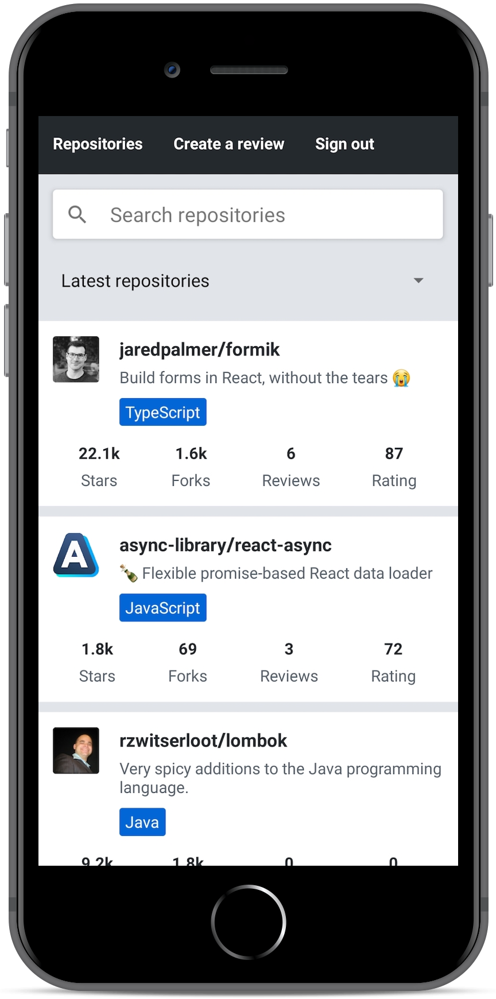
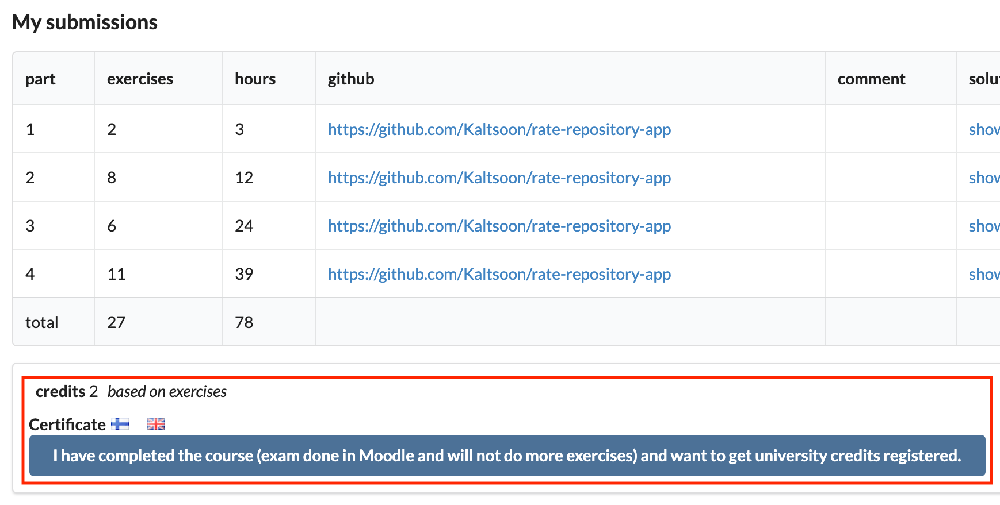
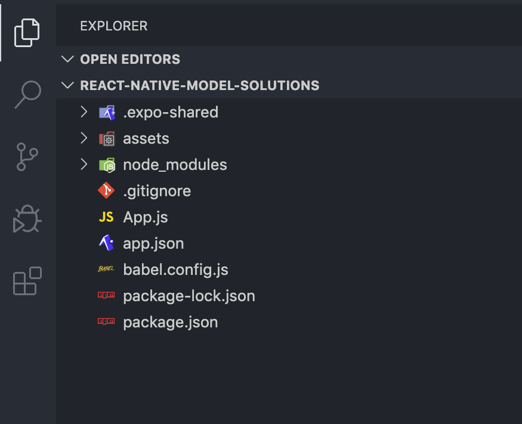
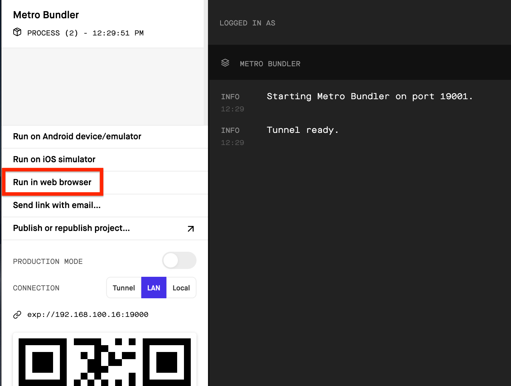
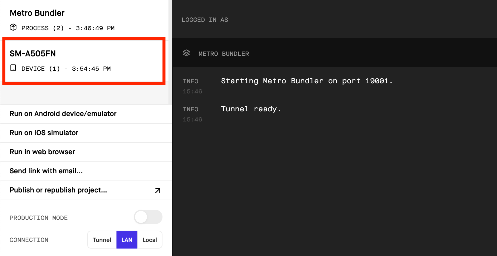
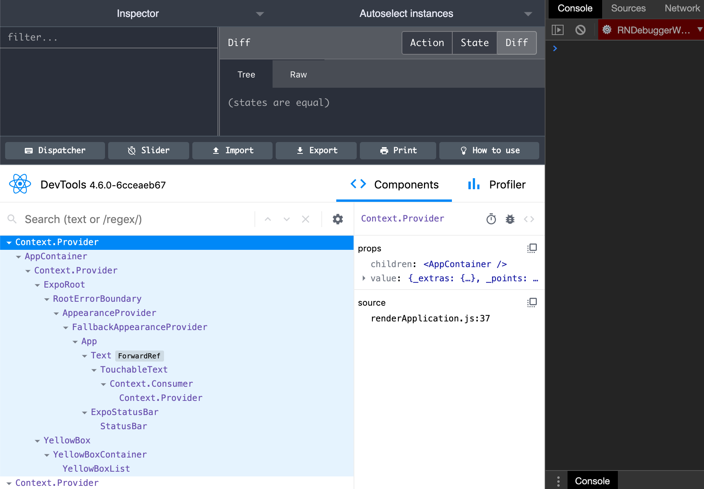

<div class="content">

Traditionally, developing native iOS and Android applications has required the developer to use platform-specific programming languages and development environments. For iOS development, this means using Objective C or Swift and for Android development using JVM based languages such as Java, Scala or Kotlin. Releasing an application for both these platforms technically requires to develop two separate applications with different programming languages. This requires lots of development resources.

One of the popular approaches to unify the platform-specific development has been to utilize the browser as the rendering engine. [Cordova](https://cordova.apache.org/) is one of the most popular platforms for building cross-platform applications. It allows developing multi-platform applications using standard web technologies - HTML5, CSS3, and JavaScript. However, Cordova applications are running within a embedded browser window in the user's device. That is why these applications can not achieve the performance nor the look-and-feel of native applications that utilize actual native user interface components.

[React Native](https://reactnative.dev/) is a framework for developing native Android and iOS applications using JavaScript and React. It provides a set of cross-platform components that behind the scenes utilize the platform's native components. Using React Native allows us to bring all the familiar features of React such as JSX, components, props, state, and hooks into native application development. On top of that we are able to utilize many familiar libraries in React ecosystem such as [react-redux](https://react-redux.js.org/), [react-apollo](https://github.com/apollographql/react-apollo), [react-router](https://reacttraining.com/react-router/core/guides/quick-start) and many more.

The speed of development and gentle learning curve for developers familiar with React is one of the most important benefits of React Native. Here's a motivational quote from Coinbase's article [Onboarding thousands of users with React Native](https://blog.coinbase.com/onboarding-thousands-of-users-with-react-native-361219066df4) on the benefits of React Native:

> If we were to reduce the benefits of React Native to a single word, it would be “velocity”. On average, our team was able to onboard engineers in less time, share more code (which we expect will lead to future productivity boosts), and ultimately deliver features faster than if we had taken a purely native approach.

### About this part

During this part, we will learn how to build an actual React Native application from bottom up. We will learn concepts such as what are React Native's core components, how to create beautiful user interfaces, how to communicate with a server and how to test a React Native application.

We will be developing an application for rating [GitHub](https://github.com/) repositories. Our application will have features such as, sorting and filtering reviewed repositories, registering a user, logging in and creating a review for a repository. The back end for the application will be provided for us so that we can solely focus on the React Native development. The final version of our application will look something like this:



All the exercises in this part have to be submitted into <i>a single GitHub repository</i> which will eventually contain the entire source code of your application. There will be model solutions available for each section of this part which you can use to fill in incomplete submissions. This part is structured based on the idea that you develop your application as you progress in the material. So <i>do not</i> wait until the exercises to start the development. Instead, develop your application in the same pace as the material progresses.

This part will heavily rely on concepts covered in the previous parts. Before starting this part you will need basic knowledge of JavaScript, React and GraphQL. Deep knowledge of server-side development is not required and all the server-side code is provided for you. However, we will be making network requests from your React Native applications, for example, using GraphQL queries. The recommended parts to complete before this part are [part 1](/en/part1), [part 2](/en/part2), [part 5](/en/part5), [part 7](/en/part7) and [part 8](/en/part8).

### Submitting exercises and earning credits

Exercises are submitted via the [submissions system](https://studies.cs.helsinki.fi/stats/courses/fs-react-native-2020) just like in the previous parts. Note that, exercises in this part are submitted <i>to a different course instance</i> than in parts 0-9. The parts 1-4 in the submission system refer to the sections a-d in this part. This means that you will be submitting exercises a single section at a time starting with this section, "Introduction to React Native", which is part 1 in the submission system.

During this part you will earn credits based on the number of exercises you complete. Completing <i>at least 25 exercises</i> in this part will earn you <i>2 credits</i>. Once you have completed the exercises and want to get the credits, let us know through the exercise submission system that you have completed the course:



Note that the "exam done in Moodle" note refers to the [Full Stack Open course's exam](https://fullstackopen.com/en/part0/general_info#sign-up-for-the-exam), which <i>has to be completed</i> before you can earn credits from this part.

**Note** that you need a registration to the corresponding course part for getting the credits registered, see [here](/en/part0/general_info#parts-and-completion) for more information.

You can download the certificate for completing this part by clicking one of the flag icons. The flag icon corresponds to the certificate's language. Note that you must have completed at least one credit worth of exercises before you can download the certificate.

### Initializing the application

To get started with our application we need to set up our development environment. We have learned from previous parts that there are useful tools for setting up React applications quickly such as Create React App. Luckily React Native has these kinds of tools as well.

For the development of our application, we will be using [Expo](https://docs.expo.io/versions/latest/). Expo is a platform that eases the setup, development, building, and deployment of React Native applications. Let's get started with Expo by installing the <i>expo-cli</i> command-line interface:

```shell
npm install --global expo-cli
```

Next, we can initialize our project in a <i>rate-repository-app</i> directory by running the following command:

```shell
expo init rate-repository-app --template expo-template-blank@sdk-44 --npm
```

Note, that the <em>@sdk-44</em> sets the project's <i>Expo SDK version to 44</i>, which supports <i>React Native version 0.64</i>. Using other Expo SDK version might cause you trouble while following this material. Also, Expo has few limitations when compared to plain React Native CLI, more on them [here](https://docs.expo.io/introduction/why-not-expo/). However, these limitations have no effect on the application implemented in the material.

Now that our application has been initialized, open the created <i>rate-repository-app</i> directory with an editor such as [Visual Studio Code](https://code.visualstudio.com/). The structure should be more or less the following:



We might spot some familiar files and directories such as <i>package.json</i> and <i>node_modules</i>. On top of those, the most relevant files are <i>app.json</i> file which contains Expo related configuration and <i>App.js</i> which is the root component of our application. <i>Do not</i> rename or move the <i>App.js</i> file because by default Expo imports it to [register the root component](https://docs.expo.io/versions/latest/sdk/register-root-component/).

Let's have look at <i>scripts</i> section of the <i>package.json</i> file which has the following scripts:

```javascript
{
  // ...
  "scripts": {
    "start": "expo start",
    "android": "expo start --android",
    "ios": "expo start --ios",
    "web": "expo start --web",
    "eject": "expo eject"
  },
  // ...
}
```

Running the script <em>npm start</em> starts the [Metro bundler](https://facebook.github.io/metro/) which is a JavaScript bundler for React Native. It can be described as the [Webpack](https://webpack.js.org/) of the React Native ecosystem. In addition to the Metro bundler, <i>Expo development tools</i> should be open in a browser window at [http://localhost:19002](http://localhost:19002). Expo development tools are a useful set of tools for viewing the application logs and starting the application in an emulator or in Expo's mobile application. We will get to emulators and Expo's mobile application soon, but first, let's start our application in a web browser by clicking the <i>Run in web browser</i> link:



After clicking the link we should soon see the text defined in the <i>App.js</i> file in a browser window. Open the <i>App.js</i> file with an editor and make a small change to the text in the <em>Text</em> component. After saving the file you should be able to see that the changes you have made into the code are visible in the browser window.

### Setting up the development environment

We have had the first glance of our application using the Expo's browser view. Although the browser view is quite usable, it is still a quite poor simulation of the native environment. Let's have a look at the alternatives we have regarding the development environment.

Android and iOS devices such as tablets and phones can be emulated in computers using specific <i>emulators</i>. This is very useful for developing native applications. macOS users can use both Android and iOS emulators with their computers. Users of other operating systems such as Linux or Windows have to settle for Android emulators. Next, depending on your operating system follow one of these instructions on setting up an emulator:

- [Set up Android emulator with Android Studio](https://docs.expo.dev/workflow/android-studio-emulator/) (any operating system)
- [Set up iOS simulator with Xcode](https://docs.expo.dev/workflow/ios-simulator/) (macOS operating system)

After you have set up the emulator and it is running, start the Expo development tools as we did before, by running <em>npm start</em>. Depending on the emulator you are running either click the <i>Run on Android device/emulator</i> or <i>Run on iOS simulator</i> link. After clicking the link, Expo should connect to the emulator and you should eventually see the application in your emulator. Be patient, this might take a while.

In addition to emulators, there is one extremely useful way to develop React Native applications with Expo, the Expo mobile app. With the Expo mobile app you can preview your application using your actual mobile device, which provides a bit more concrete development experience compared to emulators. To get started, install the Expo mobile app by following the instructions in the [Expo's documentation](https://docs.expo.io/get-started/installation/#2-expo-go-app-for-ios-and). Note that the Expo mobile app can only open your application if your mobile device is connected to <i>the same local network</i> (e.g. connected to the same Wi-Fi network) as the computer you are using for development.

When the Expo mobile app has finished installing, open it up. Next, if the Expo development tools is not already running, start it by running <em>npm start</em>. In the bottom left corner of the development tools, you should be able to see a QR code. Within the Expo mobile app, press <i>Scan QR Code</i> and scan the QR code displayed in the development tools. The Expo mobile app should start building the JavaScript bundle and after it is finished you should be able to see your application. Now, every time you want to reopen your application in the Expo mobile app, you should be able to access the application without scanning the QR code by pressing it in the <i>Recently opened</i> list in the <i>Projects</i> view.

</div>

<div class="tasks">

### Exercise 10.1

#### Exercise 10.1: initializing the application

Initialize your application with Expo command-line interface and set up the development environment either using an emulator or Expo's mobile app. It is recommended to try both and find out which development environment is the most suitable for you. The name of the application is not that relevant. You can, for example, go with <i>rate-repository-app</i>.

To submit this exercise and all the future exercises you need to [create a new GitHub repository](https://github.com/new). The name of the repository can be for example the name of the application you initialized with <em>expo init</em>. If you decide to create a private repository, add GitHub user [Kaltsoon](https://github.com/Kaltsoon) as a [repository collaborator](https://docs.github.com/en/github/setting-up-and-managing-your-github-user-account/inviting-collaborators-to-a-personal-repository). The collaborator status is only used for verifying your submissions.

Now that the repository is created, run <em>git init</em> within your application's root directory to make sure that the directory is initialized as a Git repository. Next, to add the created repository as the remote run <em>git remote add origin git@github.com:<YOUR_GITHUB_USERNAME>/<NAME_OF_YOUR_REPOSITORY>.git</em> (remember to replace the placeholder values in the command). Finally, just commit and push your changes into the repository and you are all done.

</div>

<div class="content">

### ESLint

Now that we are somewhat familiar with the development environment let's enhance our development experience even further by configuring a linter. We will be using [ESLint](https://eslint.org/) which is already familiar to us from the previous parts. Let's get started by installing the dependencies:

```shell
npm install --save-dev eslint @babel/eslint-parser eslint-plugin-react eslint-plugin-react-native
```

Next, let's add the ESLint configuration into a <i>.eslintrc</i> file into the <i>rate-repository-app</i> directory with the following content:

```javascript
{
  "plugins": ["react", "react-native"],
  "settings": {
    "react": {
      "version": "detect"
    }
  },
  "extends": ["eslint:recommended", "plugin:react/recommended"],
  "parser": "@babel/eslint-parser",
  "env": {
    "react-native/react-native": true
  },
  "rules": {
    "react/prop-types": "off",
    "react/react-in-jsx-scope": "off"
  }
}
```

And finally, let's add a <em>lint</em> script to the <i>package.json</i> file to check the linting rules in specific files:

```javascript
{
  // ...
  "scripts": {
    "start": "expo start",
    "android": "expo start --android",
    "ios": "expo start --ios",
    "web": "expo start --web",
    "eject": "expo eject",
    "lint": "eslint ./src/**/*.{js,jsx} App.js --no-error-on-unmatched-pattern" // highlight-line
  },
  // ...
}
```

Now we can check that the linting rules are obeyed in JavaScript files in the <i>src</i> directory and in the <i>App.js</i> file by running <em>npm run lint</em>. We will be adding our future code to the <i>src</i> directory but because we haven't added any files there yet, we need the <eM>no-error-on-unmatched-pattern</em> flag. Also if possible integrate ESLint with your editor. If you are using Visual Studio Code you can do that by, going to the extensions section and checking that the ESLint extension is installed and enabled:


The provided ESLint configuration contains only the basis for the configuration. Feel free to improve the configuration and add new plugins if you feel like it.

</div>

<div class="tasks">

### Exercise 10.2

#### Exercise 10.2: setting up the ESLint

Set up ESLint in your project so that you can perform linter checks by running <em>npm run lint</em>. To get most of linting it is also recommended to integrate ESLint with your editor.

This was the last exercise in this section. It's time to push your code to GitHub and mark all of your finished exercises to the [exercise submission system](https://studies.cs.helsinki.fi/stats/courses/fs-react-native-2020). Note that exercises in this section should be submitted to the part 1 in the exercise submission system.
</div>

<div class="content">

### Viewing logs

Expo development tools can be used to display the log messages of the running application. Error and warning level messages are also visible in the emulator and the mobile app interface. Error messages will pop out as a red overlay whereas warning messages can be expanded by pressing the yellow alert dialog at the bottom of the screen. For debugging purposes, we can use the familiar <em>console.log</em> method to write debugging messages to the log.

Let's try this in practice. Start the Expo development tools by running <em>npm start</em> and open the application with either emulator or the mobile app. When the application is running you should be able to see your connected devices under the "Metro Bundler" in the top left corner of the developments tools:



Click on the device to open its logs. Next, open the <i>App.js</i> file and add a <em>console.log</em> message to the <em>App</em> component. After saving the file, you should be able to see your message in the logs.

### Using the debugger

**NB:** You might face the following error while trying to use React Native Debugger: <i>Uncaught Error: Cannot add node "1" because a node with that id is already in the Store</i>. There's an [issue](https://github.com/jhen0409/react-native-debugger/issues/668) related to this problem in the React Native Debugger's repository which might contain ways to fix it. Nevertheless, don't get stuck trying to fix this problem if it turns out to be difficult. Instead, move on with the material.
  
Inspecting messages logged from the code with the <em>console.log</em> method can be handy, but sometimes finding bugs or understanding how the application works require us to see the bigger picture. We might, for example, be interested in what is the state and the props of a certain component, or what is the response of a certain network request. In the previous parts, we have used the browser's developer tools for this kind of debugging. [React Native Debugger](https://docs.expo.io/workflow/debugging/#react-native-debugger) is a tool that offers a similar set of debugging features for React Native applications.

Let's get started by installing React Native Debugger with the help of the [installation instructions](https://github.com/jhen0409/react-native-debugger#installation). If you are unsure which installion method to choose, downloading a pre-built binary from the [release page](https://github.com/jhen0409/react-native-debugger/releases) is perhaps the easiest option. In the release page, find the latest release which supports React Native version 0.64 and download the binary suitable for your operating sytem (for example <i>.dmg</i> file for macOS and <i>.exe</i> file for Windows) under the "Assets" section. Once the installation is complete, start the React Native Debugger, open a new debugger window (shortcuts: <em>Command+T</em> on macOS, <em>Ctrl+T</em> on Linux/Windows) and set the React Native packager port to <em>19000</em>.

Next, we need to start our application and connect to the debugger. Start the application by running <em>npm start</em>. Once the application is running, open it with either an emulator or the Expo mobile app. Inside the emulator or the Expo mobile app, open the developer menu by following the [instructions](https://docs.expo.io/workflow/debugging/#developer-menu) in the Expo's documentation. From the developer menu, select <i>Debug remote JS</i> to connect to the debugger. Now, you should be able to see the application's component tree in the debugger:



You can use the debugger to inspect the component's state and props as well as <i>change</i> them. Try finding the <em>Text</em> component rendered by the <em>App</em> component using the debugger. You can either use the search or go through the component tree. Once you have found the <em>Text</em> component in the tree, click it, and change the value of the <em>children</em> prop. The change should be automatically visible in the application's preview.

For more useful React Native application debugging tools, head out to the Expo's [debugging documentation](https://docs.expo.io/workflow/debugging).

</div>
