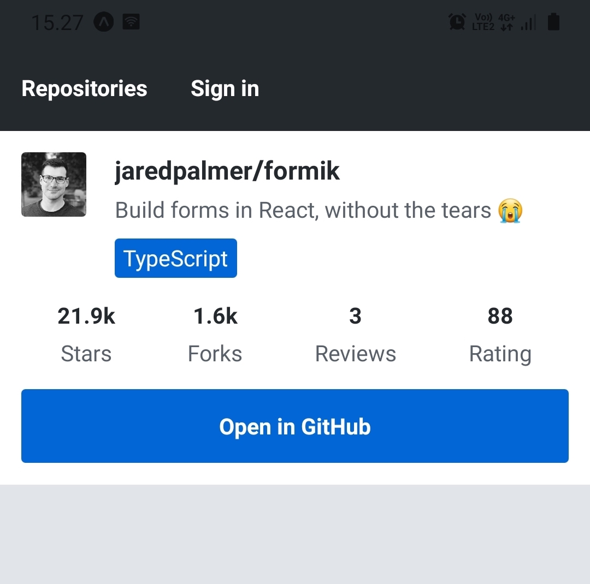
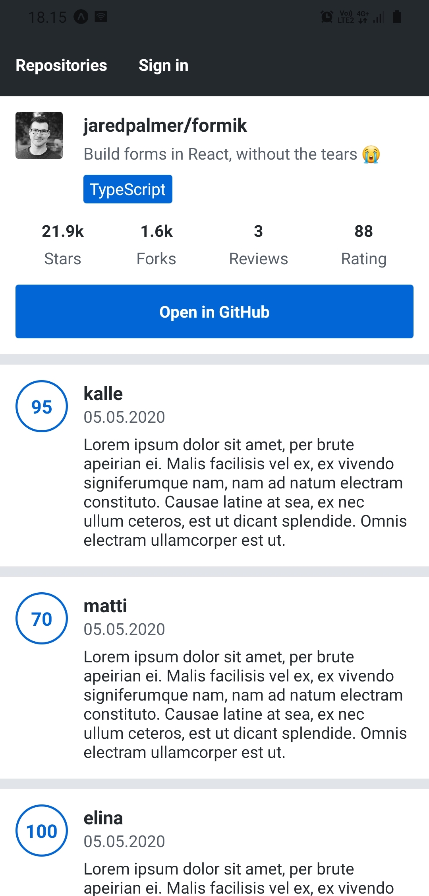
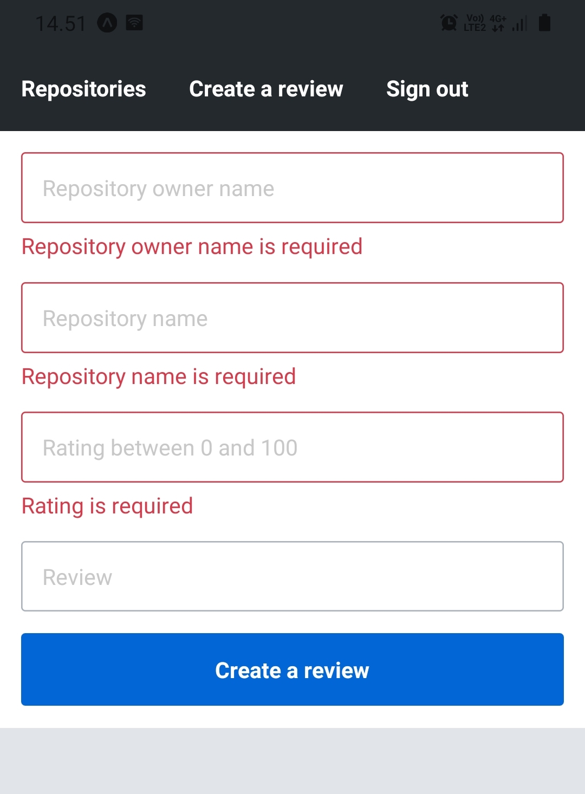
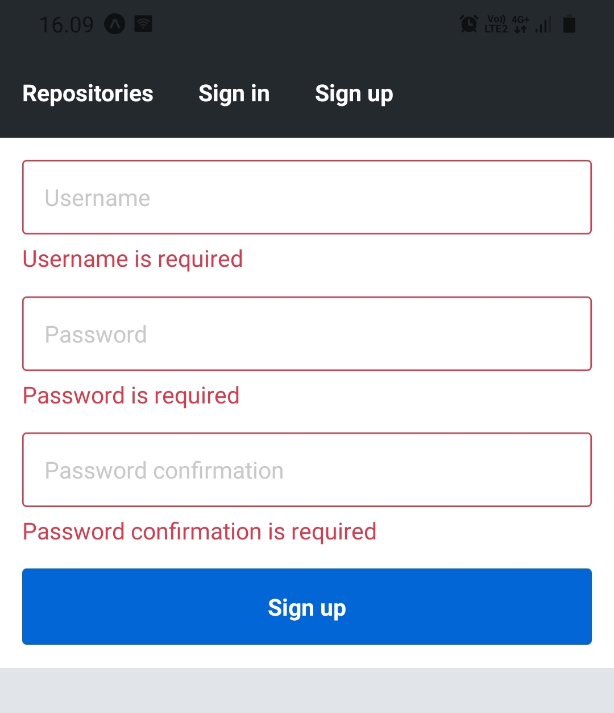
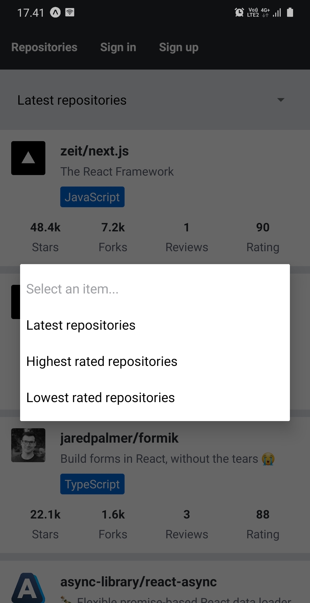
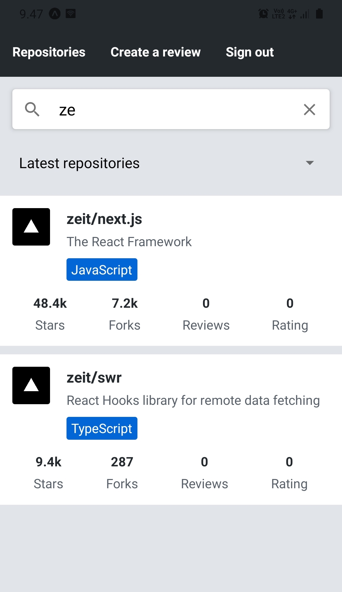
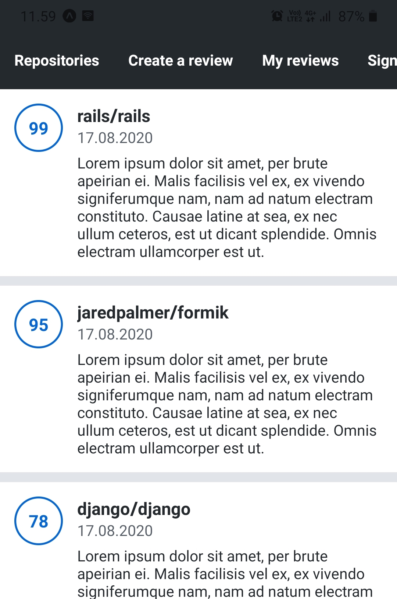
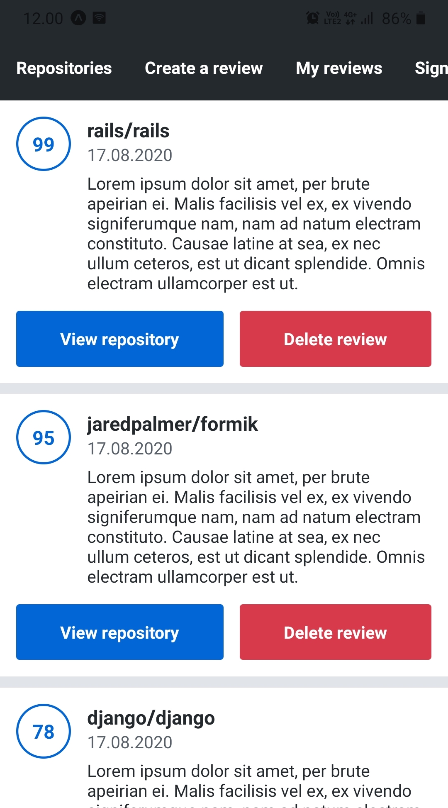

<div class="content">

<!-- Now that we have established a good foundation for our project, it is time to start expanding it. In this section you can put to use all the React Native knowledge you have gained so far. Along with expanding our application we will cover some new areas, such as testing, and additional resources. -->
现在我们已经为我们的项目搭建了不错的基础设施，是时候开始扩展它了。在这一节你会将之前所学到的所有React Native 知识融汇在一起。除了扩展我们的应用，我们还会接触一些新的领域，比如测试，以及一些额外的资源。

### Testing React Native applications
测试React Native 应用

<!-- To start testing code of any kind, the first thing we need is a testing framework, which we can use to run a set of test cases and inspect their results. For testing a JavaScript application, [Jest](https://jestjs.io/) is a popular candidate for such testing framework. For testing an Expo based React Native application with Jest, Expo provides a set of Jest configuration in a form of [jest-expo](https://github.com/expo/expo/tree/master/packages/jest-expo) preset. In order to use ESLint in the Jest's test files, we also need the [eslint-plugin-jest](https://www.npmjs.com/package/eslint-plugin-jest) plugin for ESLint. Let's get started by installing the packages: -->
在开始着手测试之前，我们要了解的第一个议题就是测试框架，测试框架让我们能够用来跑一系列的测试用例，并检查它们的结果。在测试JavaScript 应用来说，测试框架[Jest](https://jestjs.io/) 是一个广泛使用的备选项。利用Jest 来测试基于React Native 的Expo 应用，Expo 在 [jest-expo](https://github.com/expo/expo/tree/master/packages/jest-expo) 预先设置中提供了一系列Jest 配置，为了在Jest的测试文件中使用ESLint ， 我们还需要[eslint-plugin-jest](https://www.npmjs.com/package/eslint-plugin-jest) 插件来启用ESLint。 让我们开始安装这些包吧：

```shell
npm install --save-dev jest jest-expo eslint-plugin-jest
```

<!-- To use the jest-expo preset in Jest, we need to add the following Jest configuration to the <i>package.json</i> file along with the <i>test</i> script: -->
为了用Jest 使用 jest-expo  预先配置， 我们需要在  <i>package.json</i> 文件中的Jest 配置里加上如下内容，以及 <i>test</i> 脚本。

```javascript
{
  // ...
  "scripts": {
    // other scripts...
    "test": "jest" // highlight-line
  },
  // highlight-start
  "jest": {
    "preset": "jest-expo",
    "transform": {
      "^.+\\.jsx?$": "babel-jest"
    },
    "transformIgnorePatterns": [
      "node_modules/(?!(jest-)?react-native|react-clone-referenced-element|@react-native-community|expo(nent)?|@expo(nent)?/.*|react-navigation|@react-navigation/.*|@unimodules/.*|unimodules|sentry-expo|native-base|@sentry/.*|react-router-native)"
    ]
  },
  // highlight-end
  // ...
}
```

<!-- The <em>transform</em> option tells Jest to transform <i>.js</i> and <i>.jsx</i> files with the [Babel](https://babeljs.io/) compiler. The <em>transformIgnorePatterns</em> option is for ignoring certain directories in the <i>node_modules</i> directory while transforming files. This Jest configuration is almost identical to the one proposed in the Expo's [documentation](https://docs.expo.io/guides/testing-with-jest/). -->

<em>transform</em> 选项告诉Jest 将<i>.js</i> 和 <i>.jsx</i> 文件利用 [Babel](https://babeljs.io/) 编译器来编译。<em>transformIgnorePatterns</em> 选项用来在转换文件时忽略特定的文件夹。Jest 配置与Expo 的 [documentation](https://docs.expo.io/guides/testing-with-jest/) 中建议的配置基本一致。

<!-- To use the eslint-plugin-jest plugin in ESLint, we need to include it in the plugins and extensions array in the <i>.eslintrc</i> file: -->
为了在ESLint 中使用 eslint-plugin-jest 插件，我们需要将它引入到 <i>.eslintrc</i>  文件的插件与扩展数组中。

```javascript
{
  "plugins": ["react", "jest"],
  "extends": ["eslint:recommended", "plugin:react/recommended", "plugin:jest/recommended"], // highlight-line
  "parser": "babel-eslint",
  "env": {
    "browser": true
  },
  "rules": {
    "react/prop-types": "off"
  }
}
```

<!-- To see that the setup is working, create a directory <i>\_\_tests\_\_</i> in the <i>src</i> directory and in the created directory create a file <i>example.js</i>. In that file, add this simple test: -->
为了检查安装是否生效，在 <i>src</i> 文件夹中创建一个  <i>\_\_tests\_\_</i> 目录，并在文件夹中创建一个 <i>example.js</i>  文件。在文件中添加一些简单的测试：

```javascript
describe('Example', () => {
  it('works', () => {
    expect(1).toBe(1);
  });
});
```

<!-- Now, let's run our example test by running <em>npm test</em>. The command's output should indicate that the test located in the <i>src/\_\_tests\_\_/example.js</i> file is passed. -->
现在让我们通过运行  <em>npm test</em> 脚本来启动我们的测试例子。命令的输出说明了位于 <i>src/\_\_tests\_\_/example.js</i> 的测试已经通过了。

### Organizing tests
组织测试文件

<!-- Organizing test files in a single <i>\_\_tests\_\_</i> directory is one approach in organizing the tests. When choosing this approach, it is recommended to put the test files in their corresponding subdirectories just like the code itself. This means that for example tests related to components are in the <i>components</i> directory, tests related to utilities are in the <i>utils</i> directory, and so on. This will result in the following structure: -->
将所有的测试文件放到单一的 <i>\_\_tests\_\_</i> 文件夹中是组织测试文件的一种方法。如果选择了这种方法，建议将相关的测试文件放到对应的子目录中，我们之前的代码组织就是这样的。也就是说测试文件与  <i>components</i>  文件夹是一一对应的，测试相关的工具文件放到 <i>utils</i>  文件夹下。最终的代码组织结构如下：

```
src/
  __tests__/
    components/
      AppBar.js
      RepositoryList.js
      ...
    utils/
      authStorage.js
      ...
    ...
```

<!-- Another approach is to organize the tests near the implementation. This means that for example, the test file containing tests for the <em>AppBar</em> component is in the same directory as the component's code. This will result in the following structure: -->
另一种组织测试文件的方法是让测试文件靠近实现文件。也就是说，比如包含  <em>AppBar</em>  组件的测试文件与组件文件位于相同的文件夹。最终的代码组织如下：

```
src/
  components/
    AppBar/
      AppBar.test.jsx
      index.jsx
    ...
  ...
```

<!-- In this example, the component's code is in the <i>index.jsx</i> file and the test in the <i>AppBar.test.jsx</i> file. Note that in order to Jest finding your test files you either have to put them into a <i>\_\_tests\_\_</i> directory, use the <i>.test</i> or <i>.spec</i> suffix, or [manually configure](https://jestjs.io/docs/en/configuration#testmatch-arraystring) the global patterns. -->

在这个例子中，组件的实现代码位于  <i>index.jsx</i>  文件，测试代码位于 <i>AppBar.test.jsx</i> 文件。注意为了让Jest 发现你的测试文件，你需要将它们放到 <i>\_\_tests\_\_</i> 文件夹中，使用  <i>.test</i> 或者 <i>.spec</i>后缀，或者 [手工配置](https://jestjs.io/docs/en/configuration#testmatch-arraystring)全局配置。

### Testing components
测试组件

<!-- Now that we have managed to set up Jest and run a very simple test, it is time to find out how to test components. As we know, testing components requires a way to serialize a component's render output and simulate firing different kind of events, such as pressing a button. For these purposes, there is the [Testing Library](https://testing-library.com/docs/intro) family, which provides libraries for testing user interface components in different platforms. All of these libraries share similar API for testing user interface components in a user-centric way. -->

现在我们已经搭建起了Jest 并跑了一个简单的测试，是时候探究如何测试组件了。我们知道，测试组件需要一种方法来将组件渲染出去并模拟触发不同的事件，例如说按一个按钮。为了这些目的，可以选择一个 [Testing Library](https://testing-library.com/docs/intro)  库集合，提供了测试不同平台组件的一系列测试库。所有的库都采用共享类似的API来测试用户的接口组件，完全是面向用户的。

<!-- In [part 5](/en/part5/testing_react_apps) we got familiar with one of these libraries, the [React Testing Library](https://testing-library.com/docs/react-testing-library/intro). Unfortunately, this library is only suitable for testing React web applications. Luckily, there exists a React Native counterpart for this library, which is the [React Native Testing Library](https://callstack.github.io/react-native-testing-library/). This is the library we will be using while testing our React Native application's components. The good news is, that these libraries share a very similar API, so there aren't too many new concepts to learn. In addition to the React Native Testing Library, we need a set of React Native specific Jest matchers such as <em>toHaveTextContent</em> and <em>toHaveProp</em>. These matchers are provided by the [jest-native](https://github.com/testing-library/jest-native) library. Before getting into the details, let's install these packages: -->
在[part 5](/zh/part5/测试_react_应用) 中我们熟悉了他们中的一员， [React Testing Library](https://testing-library.com/docs/react-testing-library/intro) 。 不行的是，这个库仅仅对于测试React web应用是合适的。幸运的是，这个库有一个React Native版的兄弟，那就是[React Native Testing Library](https://callstack.github.io/react-native-testing-library/) 。这个库可以用来测试React Native 应用的组件。好消息是，这些库共享类似的API，所以没有很多新的概念需要了解。除了React Native Testing Library ， 我们需要一系列React Native 特定的Jest 适配器，例如<em>toHaveTextContent</em> 和  <em>toHaveProp</em> 。 这些适配器是由[jest-native](https://github.com/testing-library/jest-native) 库提供的。在深入细节以前，让我们来安装这些库吧：

```shell
npm install --save-dev @testing-library/react-native @testing-library/jest-native
```

<!-- To be able to use these matchers we need to extend the Jest's <em>expect</em> object. This can be done by using a global setup file. Create a file <i>setupTests.js</i> in the root directory of your project, that is, the same directory where the <i>package.json</i> file is located. In that file add the following line: -->
为了使用这些适配器我们需要扩展 <em>expect</em> 对象。可以通过全局安装配置文件实现。在项目的根目录创建一个<i>setupTests.js</i>  文件，也就是，与<i>package.json</i> 文件存在于相同的目录，在文件中我们添加如下内容：

```javascript
import '@testing-library/jest-native/extend-expect';
```

<!-- Next, configure this file as a setup file in the Jest's configuration in the <i>package.json</i> file (note that the <em><rootDir></em> in the path is intentional and there is no need to replace it): -->
接下来，在 <i>package.json</i>  文件中作为安装文件在Jest 的配置中配置这个文件（注意，路径中的 <em>\<rootDir></em>  是内置的，无需替换掉）

```javascript
{
  // ...
  "jest": {
    "preset": "jest-expo",
    "transform": {
      "^.+\\.jsx?$": "babel-jest"
    },
    "transformIgnorePatterns": [
      "node_modules/(?!(jest-)?react-native|react-clone-referenced-element|@react-native-community|expo(nent)?|@expo(nent)?/.*|react-navigation|@react-navigation/.*|@unimodules/.*|unimodules|sentry-expo|native-base|@sentry/.*|react-router-native)"
    ],
    "setupFilesAfterEnv": ["<rootDir>/setupTests.js"] // highlight-line
  }
  // ...
}
```

<!-- The main concepts of the React Native Testing Library are the [queries](https://callstack.github.io/react-native-testing-library/docs/api-queries) and [firing events](https://callstack.github.io/react-native-testing-library/docs/api#fireevent). Queries are used to extract a set of nodes from the component that is rendered using the [render](https://callstack.github.io/react-native-testing-library/docs/api#render) function. Queries are useful in tests where we except for example some text, such as the name of a repository, to be present in the rendered component. To get hold of specific nodes easily, you can tag nodes with the <em>testID</em> prop, and query it with the [getByTestId](https://callstack.github.io/react-native-testing-library/docs/api-queries#bytestid) function. Every React Native core component accepts the <em>testID</em> prop. Here is an example of how to use the queries: -->

React Native 测试库的核心概念就是 [查询 queries](https://callstack.github.io/react-native-testing-library/docs/api-queries) 和[触发事件 firing events](https://callstack.github.io/react-native-testing-library/docs/api#fireevent)。 查询用来从组件中抽取一系列node， 利用[render](https://callstack.github.io/react-native-testing-library/docs/api#render) 函数来渲染。查询在一些场景中是非常有用的，比如说我们想要一些文本，比如说仓库的名称，存在于渲染出的组件中。为了简单地获取特定的节点，你可以利用 <em>testID</em> 属性来标注节点，并通过 [getByTestId](https://callstack.github.io/react-native-testing-library/docs/api-queries#bytestid)  函数来查询到这个节点。每一个React Native 的核心模块都接受 <em>testID</em> 属性。下面是一个使用查询的例子：

```javascript
import React from 'react';
import { Text, View } from 'react-native';
import { render } from '@testing-library/react-native';

const Greeting = ({ name }) => {
  return (
    <View>
      {/* This node is tagged with the testID prop */}
      <Text testID="greetingText">Hello {name}!</Text>
    </View>
  );
};

describe('Greeting', () => {
  it('renders a greeting message based on the name prop', () => {
    const { debug, getByTestId } = render(<Greeting name="Kalle" />);

    debug();

    expect(getByTestId('greetingText')).toHaveTextContent('Hello Kalle!');
  });
});
```

<!-- The <em>render</em> function returns the queries and additional helpers, such as the <em>debug</em> function. The [debug](https://callstack.github.io/react-native-testing-library/docs/api#debug) function prints the rendered React tree in a user-friendly format. Use it if you are unsure what the React tree rendered by the <em>render</em> function looks like. We acquire the <em>Text</em> node tagged with the <em>testID</em> prop by using the <em>getByTestId</em> function. For all available queries, check the React Native Testing Library's [documentation](https://callstack.github.io/react-native-testing-library/docs/api-queries). The <em>toHaveTextContent</em> matcher is used to assert that the node's textual content is correct. The full list of available React Native specific matchers can be found in the [documentation](https://github.com/testing-library/jest-native#matchers) of the jest-native library. Jest's [documentation](https://jestjs.io/docs/en/expect) contains every universal Jest matcher. -->

 <em>render</em> 函数返回查询及额外的工具函数，比如  <em>debug</em>  函数。 [debug](https://callstack.github.io/react-native-testing-library/docs/api#debug) 函数用于将渲染的React 树以一种友好的方式展示出来。如果你不确定  <em>render</em>  函数渲染出的React 树长什么样，可以使用这个函数。我们通过使用 <em>getByTestId</em> 函数来获取带  <em>testID</em> 属性标签的 <em>Text</em> 节点。对所有的查询来说，可以查阅React Native 测试库的 [documentation](https://callstack.github.io/react-native-testing-library/docs/api-queries) 。<em>toHaveTextContent</em> 适配器用来断言节点的文本内容是正确的。React Native 的完整适配器列表可以查阅jest-native 库的 [documentation](https://github.com/testing-library/jest-native#matchers) 。Jest's 的[documentation](https://jestjs.io/docs/en/expect)  包含了每一个通用的Jest 适配器。

<!-- The second very important React Native Testing Library concept is firing events. We can fire an event in a provided node by using the [fireEvent](https://callstack.github.io/react-native-testing-library/docs/api#fireevent) object's methods. This is useful for example typing text into a text field or pressing a button. Here is an example of how to test submitting a simple form: -->

第二个十分重要的React Native 测试库中的概念就是触发事件。我们可以通过使用[fireEvent](https://callstack.github.io/react-native-testing-library/docs/api#fireevent)  对象方法来在给定的节点中触发事件。这在类似我们键入文本到文本框中，或者点击一个按钮十分有用。下面是一个如何测试提交表单的例子：

```javascript
import React, { useState } from 'react';
import { Text, TextInput, Pressable, View } from 'react-native';
import { render, fireEvent } from '@testing-library/react-native';

const Form = ({ onSubmit }) => {
  const [username, setUsername] = useState('');
  const [password, setPassword] = useState('');

  const handleSubmit = () => {
    onSubmit({ username, password });
  };

  return (
    <View>
      <View>
        <TextInput
          value={username}
          onChangeText={(text) => setUsername(text)}
          placeholder="Username"
          testID="usernameField"
        />
      </View>
      <View>
        <TextInput
          value={password}
          onChangeText={(text) => setPassword(text)}
          placeholder="Password"
          testID="passwordField"
        />
      </View>
      <View>
        <Pressable onPress={handleSubmit} testID="submitButton">
          <Text>Submit</Text>
        </Pressable>
      </View>
    </View>
  );
};

describe('Form', () => {
  it('calls function provided by onSubmit prop after pressing the submit button', () => {
    const onSubmit = jest.fn();
    const { getByTestId } = render(<Form onSubmit={onSubmit} />);

    fireEvent.changeText(getByTestId('usernameField'), 'kalle');
    fireEvent.changeText(getByTestId('passwordField'), 'password');
    fireEvent.press(getByTestId('submitButton'));

    expect(onSubmit).toHaveBeenCalledTimes(1);

    // onSubmit.mock.calls[0][0] contains the first argument of the first call
    expect(onSubmit.mock.calls[0][0]).toEqual({
      username: 'kalle',
      password: 'password',
    });
  });
});
```

<!-- In this test, we want to test that after filling the form's fields using the <em>fireEvent.changeText</em> method and pressing the submit button using the <em>fireEvent.press</em> method, the <em>onSubmit</em> callback function is called correctly. To inspect whether the <em>onSubmit</em> function is called and with which arguments, we can use a [mock function](https://jestjs.io/docs/en/mock-function-api). Mock functions are functions with preprogrammed behavior such as a specific return value. In addition, we can create expectations for the mock functions such as "expect the mock function to have been called once". The full list of available expectations can be found in the Jest's [expect documentation](https://jestjs.io/docs/en/expect). -->

在这个测试中，我们希望使用  <em>fireEvent.changeText</em> 方法测试填充完表单，然后利用 <em>fireEvent.press</em>  方法点击提交按钮， <em>onSubmit</em>  的回调函数是否执行正确。为了检查  <em>onSubmit</em>  函数通过什么参数进行了调用，我们可以使用  [mock function](https://jestjs.io/docs/en/mock-function-api) 。Mock 函数是预编程好的行为，比如说返回一个固定的值。此外，我们可以为mock 函数创建预期比如“预期mock 函数已经被调用了一次”。完整的预期列表可以查阅Jest 的[expect documentation](https://jestjs.io/docs/en/expect)。

<!-- Before heading further into the world of testing React Native applications, play around with these examples by adding a test file in the <i>\_\_tests\_\_</i> directory we created earlier. -->
在继续深入测试React Native 应用之前，尝试一些这些列子，在之前创建的 <i>\_\_tests\_\_</i> 文件夹中创建一个test 文件。

### Handling dependencies in tests
处理测试的依赖

<!-- Components in the previous examples are quite easy to test because they are more or less <i>pure</i>. Pure components don't depend on <i>side effects</i> such as network requests or using some native API such as the AsyncStorage. The <em>Form</em> component is much less pure than the <em>Greeting</em> component because its state changes can be counted as a side effect. Nevertheless, testing it isn't too difficult. -->
之前例子的组件测试起来十分简单，因为他们或多或少都比较 <i>单纯</i>。 纯函数并不依赖什么 <i>副作用</i>，比如说网络请求，或者使用一些原生的API，例如 。 <em>Form</em> 组件就没有 <em>Greeting</em>  组件单纯，因为其内部的状态会作为副作用计算出来。不管怎么说，测试起来并不困难。

<!-- Next, let's have a look at a strategy for testing components with side effects. Let's pick the <em>RepositoryList</em> component from our application as an example. At the moment the component has one side effect, which is a GraphQL query for fetching the reviewed repositories. The current implementation of the <em>RepositoryList</em> component looks something like this: -->
下面，让我们看一下包含副作用的组件如何测试。我们选择我们应用的<em>RepositoryList</em> 组件来作为例子。当前该组件包含一个副作用，就是利用GraphQL查询来获取查看列表。当前的<em>RepositoryList</em> 组件实现看起来如下：

```javascript
const RepositoryList = () => {
  const { repositories } = useRepositories();

  const repositoryNodes = repositories
    ? repositories.edges.map((edge) => edge.node)
    : [];

  return (
    <FlatList
      data={repositoryNodes}
      // ...
    />
  );
};

export default RepositoryList;
```

<!-- The only side effect is the use of the <em>useRepositories</em> hook, which sends a GraphQL query. There are a few ways to test this component. One way is to mock the Apollo Client's responses as instructed in the Apollo Client's [documentation](https://www.apollographql.com/docs/react/development-testing/testing/). A more simple way is to assume that the <em>useRepositories</em> hook works as intended (preferably through testing it) and extract the components "pure" code into another component, such as the <em>RepositoryListContainer</em> component: -->

唯一的副作用是使用  <em>useRepositories</em>  hook，发送了一个 GraphQL 查询。有一些方法来测试这个组件。一种是模拟Apollo Client 的返回，参考 Apollo Client 的  [documentation](https://www.apollographql.com/docs/react/development-testing/testing/) 。一个更简单的方法是假定 <em>useRepositories</em> hook 如期运行（对测试更友好）并且将“单纯”的代码提取到另一个组件中，例如  <em>RepositoryListContainer</em>  组件：

```javascript
export const RepositoryListContainer = ({ repositories }) => {
  const repositoryNodes = repositories
    ? repositories.edges.map((edge) => edge.node)
    : [];

  return (
    <FlatList
      data={repositoryNodes}
      // ...
    />
  );
};

const RepositoryList = () => {
  const { repositories } = useRepositories();

  return <RepositoryListContainer repositories={repositories} />;
};

export default RepositoryList;
```

<!-- Now, the <em>RepositoryList</em> component contains only the side effects and its implementation is quite simple. We can test the <em>RepositoryListContainer</em> component by providing it with paginated repository data through the <em>repositories</em> prop and checking that the rendered content has the correct information. This can be achieved by tagging the required <em>RepositoryItem</em> component's nodes with <em>testID</em> props. -->

现在，  <em>RepositoryList</em>组件只包含副作用，它的实现也十分简明了。我们可以通过给<em>RepositoryListContainer</em>  组件提供分页的仓库数据，传递<em>repositories</em>  属性，并测试组件能够渲染出正确的信息。可以通过给需要的  <em>RepositoryItem</em> 组件节点用<em>testID</em> 属性打上标签。

</div>

<div class="tasks">

### Exercises 10.17. - 10.18.

#### Exercise 10.17: testing the reviewed repositories list

Implement a test that ensures that the <em>RepositoryListContainer</em> component renders repository's name, description, language, forks count, stargazers count, rating average, and review count correctly. Remember that you can use the [toHaveTextContent](https://github.com/testing-library/jest-native#tohavetextcontent) matcher to check whether a node has certain textual content. You can use the [getAllByTestId](https://callstack.github.io/react-native-testing-library/docs/api-queries#getallby) query to get all nodes with a certain <em>testID</em> prop as an array. If you are unsure what is being rendered, use the [debug](https://callstack.github.io/react-native-testing-library/docs/api#debug) function to see the serialized rendering result.

实现一个测试能确保 <em>RepositoryListContainer</em> 组件渲染正确的仓库的名称、描述、语言、fork数量、star 数量、投票平均分以及查看数量。记住你可以使用 [toHaveTextContent](https://github.com/testing-library/jest-native#tohavetextcontent) 适配器来检查一个节点是否包含特定的文本内容。你可以使用 [getAllByTestId](https://callstack.github.io/react-native-testing-library/docs/api-queries#getallby) 查询来获得所有的节点，利用 <em>testID</em> 属性获得一个数组。如果不确定渲染了什么，使用 [debug](https://callstack.github.io/react-native-testing-library/docs/api#debug) 函数来查看序列化的渲染结果。

Use this as a base for your test:
用如下代码作为测试的基石：

```javascript
describe('RepositoryList', () => {
  describe('RepositoryListContainer', () => {
    it('renders repository information correctly', () => {
      const repositories = {
        totalCount: 8,
        pageInfo: {
          hasNextPage: true,
          endCursor:
            'WyJhc3luYy1saWJyYXJ5LnJlYWN0LWFzeW5jIiwxNTg4NjU2NzUwMDc2XQ==',
          startCursor: 'WyJqYXJlZHBhbG1lci5mb3JtaWsiLDE1ODg2NjAzNTAwNzZd',
        },
        edges: [
          {
            node: {
              id: 'jaredpalmer.formik',
              fullName: 'jaredpalmer/formik',
              description: 'Build forms in React, without the tears',
              language: 'TypeScript',
              forksCount: 1619,
              stargazersCount: 21856,
              ratingAverage: 88,
              reviewCount: 3,
              ownerAvatarUrl:
                'https://avatars2.githubusercontent.com/u/4060187?v=4',
            },
            cursor: 'WyJqYXJlZHBhbG1lci5mb3JtaWsiLDE1ODg2NjAzNTAwNzZd',
          },
          {
            node: {
              id: 'async-library.react-async',
              fullName: 'async-library/react-async',
              description: 'Flexible promise-based React data loader',
              language: 'JavaScript',
              forksCount: 69,
              stargazersCount: 1760,
              ratingAverage: 72,
              reviewCount: 3,
              ownerAvatarUrl:
                'https://avatars1.githubusercontent.com/u/54310907?v=4',
            },
            cursor:
              'WyJhc3luYy1saWJyYXJ5LnJlYWN0LWFzeW5jIiwxNTg4NjU2NzUwMDc2XQ==',
          },
        ],
      };

      // Add your test code here
    });
  });
});
```

<!-- You can put the test file where you please. However, it is recommended to follow one of the ways of organizing test files introduced earlier. Use the <em>repositories</em> variable as the repository data for the test. There should be no need to alter the variable's value. Note that the repository data contains two repositories, which means that you need to check that both repositories' information is present. -->
你可以按自己喜欢的方式放置你的测试文件。但是，建议按照我们之前建议的几种组织测试代码的方式来组织。使用 <em>repositories</em>  变量作为测试的仓库数据。应该没有必要去改变变量的值。注意仓库数据包含两个仓库，也就是说你需要检查这两个仓库的信息都是存在的。

#### Exercise 10.18: testing the sign in form
测试登录表单

<!-- Implement a test that ensures that filling the sign in form's username and password fields and pressing the submit button <i>will call</i> the <em>onSubmit</em> handler with <i>correct arguments</i>. The <i>first argument</i> of the handler should be an object representing the form's values. You can ignore the other arguments of the function. Remember that the [fireEvent](https://callstack.github.io/react-native-testing-library/docs/api#fireevent) methods can be used for triggering events and a [mock function](https://jestjs.io/docs/en/mock-function-api) for checking whether the <em>onSubmit</em> handler is called or not. -->

实现一个测试来确保在登录表单的用户名和密码字段填充后点击提交按钮 <i>会调用</i> <em>onSubmit</em>   处理器，并且使用了 <i>正确的参数</i>。处理器的 <i>第一个参数</i>应当是一个对象，代表了表单中的值。你可以忽略函数中的其他参数。记住  [fireEvent](https://callstack.github.io/react-native-testing-library/docs/api#fireevent) 方法可以用来触发事件，而 [mock function](https://jestjs.io/docs/en/mock-function-api) 函数可以用来检查 处理器是否被调用了。

<!-- You don't have to test any Apollo Client or AsyncStorage related code which is in the <em>useSignIn</em> hook. As in the previous exercise, extract the pure code into its own component and test it in the test. -->
你不必测试任何Apollo 客户端或者异步存储相关的代码，它们都存在于 <em>useSignIn</em> hook中。如之前练习所述，将纯代码从它组件中抽离出来并在测试中测试。

<!-- Note that Formik's form submissions are <i>asynchronous</i> so expecting the <em>onSubmit</em> function to be called immediately after pressing the submit button won't work. You can get around this issue by making the test function an async function using the <em>async</em> keyword and using the React Native Testing Library's [waitFor](https://callstack.github.io/react-native-testing-library/docs/api#waitfor) helper function. The <em>waitFor</em> function can be used to wait for expectations to pass. If the expectations don't pass within a certain period, the function will throw an error. Here is a rough example of how to use it: -->

注意Formik 的表单提交是 <i>异步的</i>，所以期望点击提交按钮后立即触发 <em>onSubmit</em>  函数调用是不现实的。你可以使用  <em>async</em> 关键字来将测试函数定义为异步的，这会用到React Native 测试框架的 [waitFor](https://callstack.github.io/react-native-testing-library/docs/api#waitfor) 工具函数。 <em>waitFor</em> 函数能用来等待预期的结果。如果预期结果在某个时间段内没有出现，函数会抛错。下面是一个大概的例子：


```javascript
import React from 'react';
import { render, fireEvent, waitFor } from '@testing-library/react-native';
// ...

describe('SignIn', () => {
  describe('SignInContainer', () => {
    it('calls onSubmit function with correct arguments when a valid form is submitted', async () => {
      // render the SignInContainer component, fill the text inputs and press the submit button

      await waitFor(() => {
        // expect the onSubmit function to have been called once and with a correct first argument
      });
    });
  });
});
```

<!-- You might face the following warning messages: <em>Warning: An update to Formik inside a test was not wrapped in act(...)</em>. This happens because <em>fireEvent</em> method calls cause asynchronous calls in Formik's internal logic. You can get rid of these messages by wrapping each of the <em>fireEvent</em> method calls with the [act](https://www.native-testing-library.com/docs/next/api-main#act) function like this: -->
你可能会遇到下述警告信息 <em>Warning: An update to Formik inside a test was not wrapped in act(...)</em> 。当 <em>fireEvent</em> 方法调用产生了一个Formik内部逻辑的异步调用时，就会产生这个警告。你可以通过 [act](https://www.native-testing-library.com/docs/next/api-main#act) 函数封装所有的 <em>fireEvent</em> 方法调用，警告信息就消失了。

```javascript
await act(async () => {
  // call the fireEvent method here
});
```

</div>

<div class="content">

### Extending our application
扩展我们的应用

<!-- It is time to put everything we have learned so far to good use and start extending our application. Our application still lacks a few important features such as reviewing a repository and registering a user. The upcoming exercises will focus on these essential features. -->
是时候将我们所学的东西放到一起来扩展我们的应用了。我们的应用仍然缺少一些重要的特性，比如说查看某个仓库或者注册一个用户。接下来的练习会聚焦于这些重要的功能。

</div>

<div class="tasks">

### Exercises 10.19. - 10.24.

#### Exercise 10.19: the single repository view


<!-- Implement a view for a single repository, which contains the same repository information as in the reviewed repositories list but also a button for opening the repository in GitHub. It would be a good idea to reuse the <em>RepositoryItem</em> component used in the <em>RepositoryList</em> component and display the GitHub repository button for example based on a boolean prop. -->

为单一仓库实现一个视图，包含与仓库列表相同的仓库信息，但需要一个按钮来在GitHub中打开。最好能在  <em>RepositoryList</em> 组件中重用 <em>RepositoryItem</em>  组件，并利用一个boolean属性控制 Github 仓库按钮的展现。

<!-- The repository's URL is in the <em>url</em> field of the <em>Repository</em> type in the GraphQL schema. You can fetch a single repository from the Apollo server with the <em>repository</em> query. The query has a single argument, which is the id of the repository. Here's a simple example of the <em>repository</em> query: -->
仓库的URL位于GraphQL schema中 <em>Repository</em> 类型的  <em>url</em> 字段。你可以利用  <em>repository</em> 查询从Apollo 服务器获取一个仓库。查询包含一个单一的参数，就是仓库的id。以下是一个简单的 <em>repository</em> 查询。

```javascript
{
  repository(id: "jaredpalmer.formik") {
    id
    fullName
    url
  }
}
```

<!-- As always, test your queries in the GraphQL playground first before using them in your application. If you are unsure about the GraphQL schema or what are the available queries, open either the <i>docs</i> or <i>schema</i> tab in the GraphQL playground. If you have trouble using the id as a variable in the query, take a moment to study the Apollo Client's [documentation](https://www.apollographql.com/docs/react/data/queries/) on queries. -->

像之前那样，在应用中使用之前在GraphQL playground中先测试你的查询。如果不确定GraphQL 的schema 或者不知道有什么可用的查询，可以打开GraphQL playground的 <i>docs</i> 或者  <i>schema</i> tab页。如果你使用id作为查询的变量，花点时间阅读一下Apollo Client 的  [documentation](https://www.apollographql.com/docs/react/data/queries/) ，关于查询的章节。

<!-- To learn how to open a URL in a browser, read the Expo's [Linking API documentation](https://docs.expo.io/workflow/linking/). You will need this feature while implementing the button for opening the repository in GitHub. -->
学习如何在浏览器中打开一个URL，阅读Expo的  [Linking API documentation](https://docs.expo.io/workflow/linking/) 。你需要在实现在Github中打开仓库的功能中用到这个特性。

<!-- The view should have its own route. It would be a good idea to define the repository's id in the route's path as a path parameter, which you can access by using the [useParams](https://reacttraining.com/react-router/native/api/Hooks/useparams) hook. The user should be able to access the view by pressing a repository in the reviewed repositories list. You can achieve this by for example wrapping the <em>RepositoryItem</em> with a [TouchableOpacity](https://reactnative.dev/docs/touchableopacity) component in the <em>RepositoryList</em> component and using <em>history.push</em> method to change the route in an <em>onPress</em> event handler. You can access the <em>history</em> object with the [useHistory](https://reacttraining.com/react-router/native/api/Hooks/usehistory) hook. -->
视图应当都含有自己的路由。最好将仓库的ID作为路径参数放到路由中，你可以通过使用 [useParams](https://reacttraining.com/react-router/native/api/Hooks/useparams) hook 来访问路由参数。用户应当能够通过点击仓库列表中的仓库访问视图。你可以在  <em>RepositoryList</em> 组件中通过利用 [Pressable](https://reactnative.dev/docs/pressable) 组件包装一下 <em>RepositoryItem</em> 组件，并使用  <em>history.push</em>  方法在 <em>onPress</em>  事件处理中改变路由。你可以利用 [useHistory](https://reacttraining.com/react-router/native/api/Hooks/usehistory) hook访问  <em>history</em> 对象。

<!-- The final version of the single repository view should look something like this: -->
单个仓库视图的最终版本应当看起来如下：



#### Exercise 10.20: repository's review list

<!-- Now that we have a view for a single repository, let's display repository's reviews there. Repository's reviews are in the <em>reviews</em> field of the <em>Repository</em> type in the GraphQL schema. <em>reviews</em> is a similar paginated list as in the <em>repositories</em> query. Here's an example of getting reviews of a repository: -->
现在我们有了一个单独的仓库，让我们展示仓库的评论吧。仓库的评论位于GraphQL schema的 <em>Repository</em> 类型的 <em>reviews</em> 字段中。 <em>reviews</em> 是个和 <em>repositories</em>  查询类似的分页列表。如下是一个获取仓库评论信息的例子：

```javascript
{
  repository(id: "jaredpalmer.formik") {
    id
    fullName
    reviews {
      edges {
        node {
          id
          text
          rating
          createdAt
          user {
            id
            username
          }
        }
      }
    }
  }
}
```

<!-- Review's <em>text</em> field contains the textual review, <em>rating</em> field a numeric rating between 0 and 100, and <em>createdAt</em> the date when the review was created. Review's <em>user</em> field contains the reviewer's information, which is of type <em>User</em>. -->
评论的  <em>text</em>  字段包含着文本评论，数值类型的 <em>rating</em>  字段，位于0-100之间，以及 <em>createdAt</em>  表示评论创建的时间。评论的 <em>user</em> 字段包含评论者的信息，type类型为  <em>User</em>。

<!-- We want to display reviews as a scrollable list, which makes [FlatList](https://reactnative.dev/docs/flatlist) a suitable component for the job. To display the previous exercise's repository's information at the top of the list, you can use the <em>FlatList</em> components [ListHeaderComponent](https://reactnative.dev/docs/flatlist#listheadercomponent) prop. You can use the [ItemSeparatorComponent](https://reactnative.dev/docs/flatlist#itemseparatorcomponent) to add some space between the items like in the <em>RepositoryList</em> component. Here's an example of the structure: -->
我们想要将评论展示成可以滚动的列表， [FlatList](https://reactnative.dev/docs/flatlist)  就是一个合适的组件。为了展示之前的练习中的仓库信息在列表的头部，你可以使用 <em>FlatList</em> 组件的 [ListHeaderComponent](https://reactnative.dev/docs/flatlist#listheadercomponent) 属性。你可以使用 [ItemSeparatorComponent](https://reactnative.dev/docs/flatlist#itemseparatorcomponent)  在元素间增加一些空间，例如 <em>RepositoryList</em> 组件。下面是一个该结构的例子：

```javascript
const RepositoryInfo = ({ repository }) => {
  // Repository's information implemented in the previous exercise
};

const ReviewItem = ({ review }) => {
  // Single review item
};

const SingleRepository = () => {
  // ...

  return (
    <FlatList
      data={reviews}
      renderItem={({ item }) => <ReviewItem review={item} />}
      keyExtractor={({ id }) => id}
      ListHeaderComponent={() => <RepositoryInfo repository={repository} />}
      // ...
    />
  );
};

export default SingleRepository;
```

<!-- The final version of the repository's reviews list should look something like this: -->
最终版本的仓库评论列表应当如下图所示：



<!-- The date under the reviewer's username is the creation date of the review, which is in the <em>createdAt</em> field of the <em>Review</em> type. The date format should be user-friendly such as <i>date.month.year</i>. You can for example install the [date-fns](https://date-fns.org/) library and use the [format](https://date-fns.org/v2.13.0/docs/format) function for formatting the creation date. -->
评论用户下面的数据是评论的创建时间，位于  <em>Review</em>  类型的  <em>createdAt</em> 字段。日期格式应当是可读的，例如 <i>date.month.year</i> 。 你可以安装例如 [date-fns](https://date-fns.org/)  类库，并使用 [format](https://date-fns.org/v2.13.0/docs/format)  函数来格式化日期。

<!-- The round shape of the rating's container can be achieved with the <em>borderRadius</em> style property. You can make it round by fixing the container's <em>width</em> and <em>height</em> style property and setting the border-radius as <em>width / 2</em>. -->
投票容器的圆形可以通过 <em>borderRadius</em> 样式属性来实现。你可以通过修改容器的 <em>width</em> 和   <em>height</em> 样式属性和  border-radius 属性设置为 <em>width / 2</em> 来实现

#### Exercise 10.21: the review form

<!-- Implement a form for creating a review using Formik. The form should have four fields: repository owner's GitHub username (for example "jaredpalmer"), repository's name (for example "formik"), a numeric rating, and a textual review. Validate the fields using Yup schema so that it contains the following validations: -->

利用Formik 实现一个创建评论的表单。表单应当包含以下四个字段：仓库拥有者的Github用户名（例如"jaredpalmer"）， 仓库的名称（例如"formik"），数字类型的投票，以及文字类型的评论。验证表单利用Yup schema，所以应当包含以下验证：

<!-- - Repository owner's username is a required string
- Repository's name is a required string
- Rating is a required number between 0 and 100
- Review is a optional string -->

- 仓库的拥有者用户名是必填字符串
- 仓库的名称是必填的字符串
- 投票是0-100的必填数值
- 评论是可选的字符串

<!-- Explore Yup's [documentation](https://github.com/jquense/yup#yup) to find suitable validators. Use sensible error messages with the validators. The validation message can be defined as the validator method's <em>message</em> argument. You can make the review field expand to multiple lines by using <em>TextInput</em> component's [multiline](https://reactnative.dev/docs/textinput#multiline) prop. -->

阅览Yup的[documentation](https://github.com/jquense/yup#yup) ，找到合适的验证器。利用显眼的错误信息搭配验证器使用。验证信息可以定义为验证方法的 <em>message</em> 入参。你可以使用 <em>TextInput</em> 组件的 [multiline](https://reactnative.dev/docs/textinput#multiline) 属性来将评论字段扩展成多行。

<!-- You can create a review using the <em>createReview</em> mutation. Check this mutation's arguments in the _docs_ tab in the GraphQL playground. You can use the [useMutation](https://www.apollographql.com/docs/react/api/react-hooks/#usemutation) hook to send a mutation to the Apollo Server. -->

你可以利用  <em>createReview</em>  变化来创建一个评论。在GraphQL playground 的 _docs_  tab页检查变化的入参。你可以使用 [useMutation](https://www.apollographql.com/docs/react/api/react/hooks/#usemutation)  hook来发送变化到Apollo Server。

<!-- After a successful <em>createReview</em> mutation, redirect the user to the repository's view you implemented in the previous exercise. This can be done with the <em>history.push</em> method after you have obtained the history object using the [useHistory](https://reacttraining.com/react-router/native/api/Hooks/usehistory) hook. The created review has a <em>repositoryId</em> field which you can use to construct the route's path. -->
在成功地创建了  <em>createReview</em>  变化之后，重定向用户到仓库视图，我们之前的练习实现过它。可以在使用  [useHistory](https://reacttraining.com/react-router/native/api/Hooks/usehistory)  hook 获得history 对象后，通过 <em>history.push</em> 方法来实现这个功能。创建好的评论有一个 <em>repositoryId</em> 字段，可以用来创建route路径。

<!-- To prevent getting cached data with the <em>repository</em> query in the single repository view, use the _cache-and-network_ [fetch policy](https://www.apollographql.com/docs/react/api/react-apollo/#optionsfetchpolicy) in the query. It can be used with the <em>useQuery</em> hook like this: -->
为了防止在单个仓库视图在 查询中获取到了缓存的数据，在查询中使用_cache-and-network_ [获取策略 fetch policy](https://www.apollographql.com/docs/react/data/queries/#configuring-fetch-logic)  ， 它可以在 <em>useQuery</em> hook中如下使用：

```javascript
useQuery(GET_REPOSITORY, {
  fetchPolicy: 'cache-and-network',
  // Other options
});
```

<!-- Note that only <i>an existing public GitHub repository</i> can be reviewed and a user can review the same repository <i>only once</i>. You don't have to handle these error cases, but the error payload includes specific codes and messages for these errors. You can try out your implementation by reviewing one of your own public repositories or any other public repository. -->

注意只有 <i>已经存在公开的Github 仓库</i> 才能够被评论，而且一个用户只能评论 <i>一次</i>。 你不必处理这些错误的场景，但是错误返回应当包含特定的错误码和错误信息。你可以通过尝试评论你自己的一个公开仓库或其他的仓库来验证自己的实现。

<!-- The review form should be accessible through the app bar. Create a tab to the app bar with a label "Create a review". This tab should only be visible to users who have signed in. You will also need to define a route for the review form. -->
评论表单应当可以通过app 工具栏能访问到。创建一个tab到app 工具栏中，名叫  "Create a review" 。这个tab页应当仅能在用户登录后看到。你还需要为评论表单创建一个路由。

<!-- The final version of the review form should look something like this: -->
评论表单最终的形态应该如下所示：



<!-- This screenshot has been taken after invalid form submission to present what the form should look like in an invalid state. -->
这个截图展示了在提交了非法的表单所应当展示的样子。

#### Exercise 10.22: the sign up form
注册表单

<!-- Implement a sign up form for registering a user using Formik. The form should have three fields: username, password, and password confirmation. Validate the form using Yup schema so that it contains the following validations: -->

实现一个注册表单来让用户使用Formik 来注册。表单应当包含三个字段：用户名，密码以及密码确认。验证表单使用Yup schema，因此包含以下验证逻辑：

<!-- - Username is a required string with a length between 1 and 30
- Password is a required string with a length between 5 and 50
- Password confirmation matches the password -->

- 用户名是必填的字符串，长度在1-30之间
- 密码是必填的字符串，长度在5-50之间
- 密码确认必须与密码相同

<!-- The password confirmation field's validation can be a bit tricky, but it can be done for example by using the [oneOf](https://github.com/jquense/yup#mixedoneofarrayofvalues-arrayany-message-string--function-schema-alias-equals) and [ref](https://github.com/jquense/yup#yuprefpath-string-options--contextprefix-string--ref) methods like suggested in [this issue](https://github.com/jaredpalmer/formik/issues/90#issuecomment-354873201). -->

密码确认的字段验证有一点tricky，但可以使用例如 [oneOf](https://github.com/jquense/yup#mixedoneofarrayofvalues-arrayany-message-string--function-schema-alias-equals) 和 [ref](https://github.com/jquense/yup#yuprefpath-string-options--contextprefix-string--ref) 方法，正如推荐的这个 [this issue](https://github.com/jaredpalmer/formik/issues/90#issuecomment-354873201) 所描述的那样。

<!-- You can create a new user by using the <em>createUser</em> mutation. Find out how this mutation work by exploring the documentation in the GraphQL playground. After a successful <em>createUser</em> mutation, sign the created user in by using the <em>useSignIn</em> hook as we did in the sign in the form. After the user has been signed in, redirect the user to the reviewed repositories list view. -->
你可以使用  <em>createUser</em> 变化来创建一个新用户。探究这个变化是如何工作的，可以在GraphQL playground 的文档中探索到。在一次成功的  <em>createUser</em> 变化之后，利用 <em>useSignIn</em> hook 来登录这个新创建的用户。用户登录后，将用户重定向到评论的仓库列表视图。

<!-- The user should be able to access the sign-up form through the app bar by pressing a "Sign up" tab. This tab should only be visible to users that aren't signed in. -->
用户应当能通过app 工具栏的  "Sign up" tab页来访问注册表单。而这个tab页仅能让未登录的用户看到。

<!-- The final version of the sign up form should look something like this: -->
注册表单最终应当如下图所示：



<!-- This screenshot has been taken after invalid form submission to present what the form should look like in an invalid state. -->
这个截图展示了在提交了非法的表单所应当展示的样子。

#### Exercise 10.23: sorting the reviewed repositories list
排序评论的仓库列表

<!-- At the moment repositories in the reviewed repositories list are ordered by the date of repository's first review. Implement a feature that allows users to select the principle, which is used to order the repositories. The available ordering principles should be: -->
当前的已评论仓库列表中的仓库是按照仓库首次评论的日期排序的。实现一个功能来允许用户选择主要的排序字段。可选的排序策略应当是：

<!-- - Latest repositories. The repository with the latest first review is on the top of the list. This is the current behavior and should be the default principle.
- Highest rated repositories. The repository with the <i>highest</i> average rating is on the top of the list.
- Lowest rated repositories. The repository with the <i>lowest</i> average rating is on the top of the list. -->

- 最新的仓库。拥有最新评论的仓库位于最顶部。这是当前的排序规则，应当为默认策略。
- 最高票的仓库。拥有 <i>最高</i> 平均投票的仓库位于最顶部。
- 最低票的仓库。又有 <i>最低</i> 平均投票的仓库位于最顶部。

<!-- The <em>repositories</em> query used to fetch the reviewed repositories has an argument called <em>orderBy</em>, which you can use to define the ordering principle. The argument has two allowed values: <em>CREATED_AT</em> (order by the date of repository's first review) and <em>RATING_AVERAGE</em>, (order by the repository's average rating). The query also has an argument called <em>orderDirection</em> which can be used to change the order direction. The argument has two allowed values: <em>ASC</em> (ascending, smallest value first) and <em>DESC</em> (descending, biggest value first). -->

 用来获取已评论仓库的 <em>repositories</em> 查询有一个参数叫 <em>orderBy</em> ，你可以用来定义排序策略。该参数有两个值：  <em>CREATED_AT</em> （通过仓库首次评论的日期排序） 和  <em>RATING_AVERAGE</em>（按照仓库的平均得票数来排序）。查询同样有一个叫  <em>orderDirection</em>  的参数，可以用来改变排序方向。该参数有两个允许的值：<em>ASC</em> （升序，最小的在最前面） 和  <em>DESC</em> （降序，最大的在最前面）。

<!-- The selected ordering principle state can be maintained for example using the React's [useState](https://reactjs.org/docs/hooks-reference.html#usestate) hook. The variables used in the <em>repositories</em> query can be given to the <em>useRepositories</em> hook as an argument. -->
排序的策略可以利用 [useState](https://reactjs.org/docs/hooks-reference.html#usestate) hook保存在React 的state中，<em>repositories</em>  查询中的变量可以给 <em>useRepositories</em>  hook作为一个参数。

<!-- You can use for example [react-native-picker](https://www.npmjs.com/package/react-native-picker-select) library, or [React Native Paper](https://callstack.github.io/react-native-paper/) library's [Menu](https://callstack.github.io/react-native-paper/menu.html) component to implement the ordering principle's selection. You can use the <em>FlatList</em> component's [ListHeaderComponent](https://reactnative.dev/docs/flatlist#listheadercomponent) prop to provide the list with a header containing the selection component. -->

你可以使用类似  [@react-native-picker/picker](https://docs.expo.io/versions/latest/sdk/picker/)  类库，或者 [React Native Paper](https://callstack.github.io/react-native-paper/)  类库的  [Menu](https://callstack.github.io/react-native-paper/menu.html)组件来实现排序策略的选择，你可以使用 <em>FlatList</em> 组件的  [ListHeaderComponent](https://reactnative.dev/docs/flatlist#listheadercomponent) 属性来提供给列表一个表头，并包含选择的组件。

<!-- The final version of the feature, depending on the selection component in use, should look something like this: -->
该功能的最终版本，取决于使用的选择组件，应当按如下所示：



#### Exercise 10.24: filtering the reviewed repositories list
过滤已评论的仓库列表

<!-- The Apollo Server allows filtering repositories using the repository's name or the owner's username. This can be done using the <em>searchKeyword</em> argument in the <em>repositories</em> query. Here's an example of how to use the argument in a query: -->

Apollo 服务器允许使用仓库名或者仓库所有者名称过滤仓库。可以通过使用  <em>repositories</em> 查询的 <em>searchKeyword</em> 参数来实现。以下是如何使用这个参数的样例：

```javascript
{
  repositories(searchKeyword: "ze") {
    edges {
      node {
        id
        fullName
      }
    }
  }
}
```

<!-- Implement a feature for filtering the reviewed repositories list based on a keyword. Users should be able to type in a keyword into a text input and the list should be filtered as the user types. You can use a simple <em>TextInput</em> component or something a bit fancier such as React Native Paper's [Searchbar](https://callstack.github.io/react-native-paper/searchbar.html) component as the text input. Put the text input component in the <em>FlatList</em> component's header. -->
实现一个过滤已查看仓库列表的功能基于关键字。用户应当能够键入文本框关键词，查询列表应当随着用户的输入而变化。你可以使用简单的  <em>TextInput</em> 组件或时髦点的类似 React Native Paper的 [Searchbar](https://callstack.github.io/react-native-paper/searchbar.html)  组件，作为文本框。将文本输入组件放到  <em>FlatList</em> 组件的头部：

<!-- To avoid a multitude of unnecessary requests while the user types the keyword fast, only pick the latest input after a short delay. This technique is often referred to as [debouncing](https://lodash.com/docs/4.17.15#debounce). [use-debounce](https://www.npmjs.com/package/use-debounce) library is a handy hook for debouncing a state variable. Use it with a sensible delay time, such as 500 milliseconds. Store the text input's value by using the <em>useState</em> hook and the pass the debounced value to the query as the value of the <em>searchKeyword</em> argument. -->

为了避免在用户键入关键字时发送大量无关的请求，只在用户键入最新输入后短暂延迟后再获取。这种技术通常要参考[debouncing](https://lodash.com/docs/4.17.15#debounce)  。 [use-debounce](https://www.npmjs.com/package/use-debounce) 库是一个现成的hook 来反弹状态变量。可以在一个可感知的延迟后使用它，比如说500毫秒。使用 <em>useState</em>  hook 来存储文本框输入值，并将反弹值作为 <em>searchKeyword</em>  变量传递给查询。

<!-- You probably face an issue that the text input component loses focus after each keystroke. This is because the content provided by the <em>ListHeaderComponent</em> prop is constantly unmounted. This can be fixed by turning the component rendering the <em>FlatList</em> component into a class component and defining the header's render function as a class property like this: -->

你可能会面临一个问题，就是在每次输入后文本输入框都会失去焦点。这是因为通过 属性提供的内容并不是持续挂载的。可以通过如下方式修改，将渲染 <em>FlatList</em> 组件成类组件并将header 的render函数作为类属性定义，类似：

```javascript
export class RepositoryListContainer extends React.Component {
  renderHeader = () => {
    // this.props contains the component's props
    const props = this.props;
    // ...
    return (
      <RepositoryListHeader
      // ...
      />
    );
  };

  render() {
    return (
      <FlatList
        // ...
        ListHeaderComponent={this.renderHeader}
      />
    );
  }
}
```

<!-- The final version of the filtering feature should look something like this: -->
过滤功能的最终版本应当如下所示：



</div>

<div class="content">

### Cursor-based pagination
基于指针的分页

<!-- When an API returns an ordered list of items from some collection, it usually returns a subset of the whole set of items to reduce the required bandwidth and to decrease the memory usage of the client applications. The desired subset of items can be parameterized so that the client can request for example the first twenty items on the list after some index. This technique is commonly referred to as <i>pagination</i>. When items can be requested after a certain item defined by a <i>cursor</i>, we are talking about <i>cursor-based pagination</i>. -->

当API从某个集合中返回一个排序列表，通常会返回一个完整集合的子集来减轻带宽的压力，以及减少客户端内存的使用。理想的自集是能够参数化的，比如说在某些索引上获取前20条记录。这通常会涉及  <i>pagination</i> 技术。当获取结果是使用指针从某个特定结果获得的，我们就称之为 <i>基于指针的分页</i>。

<!-- So cursor is just a serialized presentation of an item in an ordered list. Let's have a look at the paginated repositories returned by the <em>repositories</em> query using the following query: -->

指针就是排序列表中某个结果序列位置的展示。让我们看一下 <em>repositories</em>  查询返回的分页结果：

```javascript
{
  repositories(first: 2) {
    totalCount
    edges {
      node {
        id
        fullName
        createdAt
      }
      cursor
    }
    pageInfo {
      endCursor
      startCursor
      hasNextPage
    }
  }
}
```

<!-- The <em>first</em> argument tells the API to return only the first two repositories. Here's an example of a result of the query: -->

<em>第一个</em>参数告诉API只返回前两条记录。如下是一个查询结果的例子：

```javascript
{
  "data": {
    "repositories": {
      "totalCount": 10,
      "edges": [
        {
          "node": {
            "id": "zeit.next.js",
            "fullName": "zeit/next.js",
            "createdAt": "2020-05-15T11:59:57.557Z"
          },
          "cursor": "WyJ6ZWl0Lm5leHQuanMiLDE1ODk1NDM5OTc1NTdd"
        },
        {
          "node": {
            "id": "zeit.swr",
            "fullName": "zeit/swr",
            "createdAt": "2020-05-15T11:58:53.867Z"
          },
          "cursor": "WyJ6ZWl0LnN3ciIsMTU4OTU0MzkzMzg2N10="
        }
      ],
      "pageInfo": {
        "endCursor": "WyJ6ZWl0LnN3ciIsMTU4OTU0MzkzMzg2N10=",
        "startCursor": "WyJ6ZWl0Lm5leHQuanMiLDE1ODk1NDM5OTc1NTdd",
        "hasNextPage": true
      }
    }
  }
}
```

<!-- The format of the result object and the arguments are based on the [Relay's GraphQL Cursor Connections Specification](https://relay.dev/graphql/connections.htm), which has become a quite common pagination specification and has been widely adopted for example in the [GitHub's GraphQL API](https://docs.github.com/en/graphql).  -->

结果对象的格式以及参数遵循了[Relay's GraphQL Cursor Connections Specification](https://relay.dev/graphql/connections.htm) ，它已经成为了一个通用的分页规范了，并且已经广泛地应用到例如[GitHub's GraphQL API](https://docs.github.com/en/graphql) 中了。

<!-- In the result object, we have the <em>edges</em> array containing items with <em>node</em> and <em>cursor</em> attributes. As we know, the <em>node</em> contains the repository itself. The <em>cursor</em> on the other is a Base64 encoded representation of the node. It contains the repository's id and date of repository's creation as a timestamp. This is the information we need to point to the item when they are ordered by the creation time of the repository. The <em>pageInfo</em> contains information such as the cursor of the first and the last item in the array. -->

在结果对象中，我们有  <em>edges</em> 数组，包含了拥有 <em>node</em>  和 <em>cursor</em>  属性的条目。我们知道，  <em>node</em> 包含了仓库本身。 <em>cursor</em> 另一方面来说是节点的 Base64 编码表示。包含了仓库的id 和仓库创建的日期。这些信息是我们需要在按创建时间排序下需要指向的信息。 <em>pageInfo</em>  包含了例如数组中第一个和最后一个的指针信息。

<!-- Let's say that we want to get the next set of items <i>after</i> the last item of the current set, which is the "zeit/swr" repository. We can set the <em>after</em> argument of the query as the value of the <em>endCursor</em> like this: -->

如果我们想要获取当前结果 <i>之后的</i> 几个结果， 也就是  "zeit/swr" 仓库。我们可以设置查询的 <em>after</em> 参数作为 <em>endCursor</em> 的值：

```javascript
{
  repositories(first: 2, after: "WyJ6ZWl0LnN3ciIsMTU4OTU0MzkzMzg2N10=") {
    totalCount
    edges {
      node {
        id
        fullName
        createdAt
      }
      cursor
    }
    pageInfo {
      endCursor
      startCursor
      hasNextPage
    }
  }
}
```

<!-- Now that we have the next two items and we can keep on doing this until the <em>hasNextPage</em> has the value <em>false</em>, meaning that we have reached the end of the list. To dig deeper into cursor-based pagination, read Shopify's article [Pagination with Relative Cursors](https://engineering.shopify.com/blogs/engineering/pagination-relative-cursors). It provides great details on the implementation itself and the benefits over the traditional index-based pagination. -->

现在我们获得了接下来的两条数据，我们可以接着做相同的操作，直到 <em>hasNextPage</em> 的值为 <em>false</em> ，那样就是说我们已经查询到了列表的结尾。关于基于指针的分页，更深入的探讨可以阅读Shopify的文章 [Pagination with Relative Cursors](https://engineering.shopify.com/blogs/engineering/pagination-relative-cursors) 。它提供了关于这个技术实现不错的细节描述，以及它比传统分页技术的优势。

### Infinite scrolling
无限地滚动

<!-- Vertically scrollable lists in mobile and desktop applications are commonly implemented using a technique called <i>infinite scrolling</i>. The principle of infinite scrolling is quite simple: -->

手机和桌面应用中列表的垂直滚动是一个常见的技术实现，叫做 <i>无限滚动</i>。 无限滚动的定义十分简单：

<!-- - Fetch the initial set of items
- When the user reaches the last item, fetch the next set of items after the last item -->

- 获取结果的初始集合
- 当用户滚动到了最后的结果，再获取接下来的几条结果

<!-- The second step is repeated until the user gets tired of scrolling or some scrolling limit is exceeded. The name "infinite scrolling" refers to the way the list seems to be infinite - the user can just keep on scrolling and new items keep on appearing on the list. -->

第二步会重复，直到用户滚动累了或者达到了滚动条数的限制。“无限滚动” 的名字就是这些列表看起来是无限的——用户可以持续地往下滚动，新的条目就会不断出现。

<!-- Let's have a look at how this works in practice using the Apollo Client's <em>useQuery</em> hook. Apollo Client has a great [documentation](https://www.apollographql.com/docs/react/data/pagination/#cursor-based) on implementing the cursor-based pagination. Let's implement infinite scrolling for the reviewed repositories list as an example. -->

让我们来看一下这个功能是如何使用Apollo 客户端的 hook实现的。Apollo 客户端有一个不错的  [documentation](https://www.apollographql.com/docs/react/data/pagination/#cursor-based) ，是关于基于指针的分页技术的实现的。让我们为评论的仓库列表实现以下无限滚动功能。

<!-- First, we need to know when the user has reached the end of the list. Luckily, the <em>FlatList</em> component has a prop [onEndReached](https://reactnative.dev/docs/flatlist#onendreached), which will call the provided function once the user has scrolled to the last item on the list. You can change how early the <em>onEndReach</em> callback is called using the [onEndReachedThreshold](https://reactnative.dev/docs/flatlist#onendreachedthreshold) prop. Alter the <em>RepositoryList</em> component's <em>FlatList</em> component so that it calls a function once the end of the list is reached: -->

首先，我们需要知道用户什么时候浏览到了列表的结尾。幸运的是， <em>FlatList</em>  组件有一个 [onEndReached](https://reactnative.dev/docs/flatlist#onendreached) 属性，当用户滚动到列表结尾时，就会触发所提供的函数。你可以利用  [onEndReachedThreshold](https://reactnative.dev/docs/flatlist#onendreachedthreshold) 属性控制提前多久触发 <em>onEndReach</em> 回调。修改 <em>RepositoryList</em> 组件的 <em>FlatList</em>  组件，使之能在列表滚到末尾时触发函数。

```javascript
export const RepositoryListContainer = ({
  repositories,
  onEndReach,
  /* ... */,
}) => {
  const repositoryNodes = repositories
    ? repositories.edges.map((edge) => edge.node)
    : [];

  return (
    <FlatList
      data={repositoryNodes}
      // ...
      onEndReached={onEndReach}
      onEndReachedThreshold={0.5}
    />
  );
};

const RepositoryList = () => {
  // ...

  const { repositories } = useRepositories(/* ... */);

  const onEndReach = () => {
    console.log('You have reached the end of the list');
  };

  return (
    <RepositoryListContainer
      repositories={repositories}
      onEndReach={onEndReach}
      // ...
    />
  );
};

export default RepositoryList;
```

<!-- Try scrolling to the end of the reviewed repositories list and you should the message in the logs. -->
尝试滚动到评论仓库列表的末尾，你应当能在日志中看到信息。

<!-- Next, we need to fetch more repositories once the end of the list is reached. This can be achieved using the [fetchMore](https://www.apollographql.com/docs/react/data/pagination/#cursor-based) function provided by the <em>useQuery</em> hook. To describe Apollo Client, how to merge the existing repositories in the cache with the next set of repositories, we can use a [field policy](https://www.apollographql.com/docs/react/caching/cache-field-behavior/). In general, field policies can be used to customize the cache behavior during read and write operations with [read](https://www.apollographql.com/docs/react/caching/cache-field-behavior/#the-read-function) and [merge](https://www.apollographql.com/docs/react/caching/cache-field-behavior/#the-merge-function) functions.  -->
接下来一旦到达列表尾部我们需要fetch 更多的仓库。可以使用 <em>useQuery</em> 提供的 [fetchMore](https://www.apollographql.com/docs/react/data/pagination/#cursor-based) 来实现。 为了描述Apollo Client， 如何将已经存在的仓库merge 到 下一组仓库的缓存中，我们可以使用[field policy](https://www.apollographql.com/docs/react/caching/cache-field-behavior/) 。 一般来说， field 策略可以在使用 [read](https://www.apollographql.com/docs/react/caching/cache-field-behavior/#the-read-function) 和 [merge](https://www.apollographql.com/docs/react/caching/cache-field-behavior/#the-merge-function) 读写操时作用在自定义缓存行为上。

<!-- Let's add a field policy for the <em>repositories</em> query in the <i>apolloClient.js</i> file: -->
让我们为 <i>apolloClient.js</i>  文件的  <em>repositories</em> 查询增加一个field 策略

```javascript
import { ApolloClient, InMemoryCache, createHttpLink } from '@apollo/client';
import { setContext } from '@apollo/client/link/context';
import Constants from 'expo-constants';
import { relayStylePagination } from '@apollo/client/utilities'; // highlight-line

const { apolloUri } = Constants.manifest.extra;

const httpLink = createHttpLink({
  uri: apolloUri,
});

// highlight-start
const cache = new InMemoryCache({
  typePolicies: {
    Query: {
      fields: {
        repositories: relayStylePagination(),
      },
    },
  },
});
// highlight-end

const createApolloClient = (authStorage) => {
  const authLink = setContext(async (_, { headers }) => {
    try {
      const accessToken = await authStorage.getAccessToken();

      return {
        headers: {
          ...headers,
          authorization: accessToken ? `Bearer ${accessToken}` : '',
        },
      };
    } catch (e) {
      console.log(e);

      return {
        headers,
      };
    }
  });

  return new ApolloClient({
    link: authLink.concat(httpLink),
    cache, // highlight-line
  });
};

export default createApolloClient;
```

As mentioned earlier, the format of the pagination's result object and the arguments are based on the Relay's pagination specification. Luckily, Apollo Client provides a predefined field policy, `relayStylePagination`, which can be used in this case.
如上所如，分页结果对象的格式遵循了 Relay的分写规范。幸运的是， Apollo Client 提供了预定义的filed 策略， `relayStylePagination`， 可以用在这个案例中。

<!-- Next, we need to fetch more repositories once the end of the list is reached. This can be achieved using the [fetchMore](https://www.apollographql.com/docs/react/data/pagination/#cursor-based) function provided by the <em>useQuery</em> hook. Let's alter the <em>useRepositories</em> hook so that it returns a decorated <em>fetchMore</em> function, which calls the actual <em>fetchMore</em> function with the <em>endCursor</em> and updates the query correctly with the fetched data: -->

<!-- Next, let's alter the <em>useRepositories</em> hook so that it returns a decorated <em>fetchMore</em> function, which calls the actual <em>fetchMore</em> function with appropriate	arguments so that we can fetch the next set of repositories: -->
接下来，我们把 <em>useRepositories</em>  hook 改成 修饰好的  <em>fetchMore</em> 函数，它真正调用的是  <em>fetchMore</em> 函数，通过合适的参数我们可以获取下一组仓库。
<!-- 接下来，我们需要在列表滚动到末尾时获取更多的仓库。可以使用 <em>useQuery</em> hook提供的 [fetchMore](https://www.apollographql.com/docs/react/data/pagination/#cursor-based)  函数来实现。让我们改变  <em>useRepositories</em> hook 这样它能够返回一个包装的 <em>fetchMore</em>  函数，他会调利用 <em>endCursor</em> 调用真正的 <em>fetchMore</em> 函数，并利用获取到的数据正确地更新查询。 -->

```javascript
const useRepositories = (variables) => {
  const { data, loading, fetchMore, ...result } = useQuery(GET_REPOSITORIES, {
    variables,
    // ...
  });

  const handleFetchMore = () => {
    const canFetchMore = !loading && data?.repositories.pageInfo.hasNextPage;

    if (!canFetchMore) {
      return;
    }

    fetchMore({
      variables: {
        after: data.repositories.pageInfo.endCursor,
        ...variables,
      },
    });
  };

  return {
    repositories: data?.repositories,
    fetchMore: handleFetchMore,
    loading,
    ...result,
  };
};
```


<!-- Make sure you have the <em>pageInfo</em> and the <em>cursor</em> fields in your <em>repositories</em> query as described in the pagination examples. You will also need to include the <em>after</em> and <em>first</em> arguments for the query. -->

确保你的  <em>repositories</em> 查询中有 <em>pageInfo</em> 和 <em>cursor</em> 字段，我们在分页的例子中讲到过。你同样会需要 <em>after</em> 和 <em>first</em> 参数来进行查询

<!-- The <em>handleFetchMore</em> function will call the Apollo Client's <em>fetchMore</em> function if there are more items to fetch, which is determined by the <em>hasNextPage</em> property. We also want to prevent fetching more items if fetching is already in process. In this case, <em>loading</em> will be <em>true</em>. In the <em>fetchMore</em> function we are providing the query with an <em>after</em> variable, which receives the latest <em>endCursor</em> value. In the <em>updateQuery</em> we will merge the previous edges with the fetched edges and update the query so that the <em>pageInfo</em> contains the latest information. In the <em>updateQuery</em> we will merge the previous edges with the fetched edges and update the query so that the <em>pageInfo</em> contains the latest information.
 -->

如果还有更多的结果可以获取，  <em>handleFetchMore</em>函数会调用Apollo 客户端的 <em>fetchMore</em>  函数， 这是由 <em>hasNextPage</em> 属性决定的。我们同样会在获取进行的过程中组织更多的结果获取。在这个例子中  <em>loading</em> 会为 <em>true</em> 。在  <em>fetchMore</em>  函数中，我们提供了一个包含 <em>after</em> 变量的查询，它会接受最新的<em>endCursor</em> 值。在 <em>updateQuery</em> 中我们会利用获取到的edge合并之前的edge，并更新查询结果，这样  <em>pageInfo</em> 就包含了最新的信息了。在<em>updateQuery</em>  中，我们会将之前的edge 与获取到的 edge 合并在一起并更新查询，这样 <em>pageInfo</em>  就包含了最新的信息。

The final step is to call the <em>fetchMore</em> function in the <em>onEndReach</em> handler:
最后一步就是调用  <em>onEndReach</em>  处理器的  <em>fetchMore</em>  函数了：

```javascript
const RepositoryList = () => {
  // ...

  const { repositories, fetchMore } = useRepositories({
    first: 8,
    // ...
  });

  const onEndReach = () => {
    fetchMore();
  };

  return (
    <RepositoryListContainer
      repositories={repositories}
      onEndReach={onEndReach}
      // ...
    />
  );
};

export default RepositoryList;
```

<!-- Use a relatively small <em>first</em> argument value such as 8 while trying out the infinite scrolling. This way you don't need to review too many repositories. You might face an issue that the <em>onEndReach</em> handler is called immediately after the view is loaded. This is most likely because the list contains so few repositories that the end of the list is reached immediately. You can get around this issue by increasing the value of <em>first</em> argument. Once you are confident that the infinite scrolling is working, feel free to use a larger value for the <em>first</em> argument. -->

使用一个相对较小的 <em>first</em> 参数，比如说8 来尝试无限滚动功能。这样你就不用查看过多的仓库。你可能面临一个问题，就是 <em>onEndReach</em> 处理器会在视图加载后被立即调用。这通常是因为结果列表包含一点仓库，因此列表的结尾很快就达到了。你可以通过增加 <em>first</em> 参数的值来解决下这个问题。一旦你确信无限滚动运转正常了，就可以使用一个大点的 <em>first</em> 参数值。

</div>

<div class="tasks">

### Exercises 10.25.-10.27.

#### Exercise 10.25: infinite scrolling for the repository's reviews list

<!-- Implement infinite scrolling for the repository's reviews list. The <em>Repository</em> type's <em>reviews</em> field has the <em>first</em> and <em>after</em> arguments similar to the <em>repositories</em> query. <em>ReviewConnection</em> type also has the <em>pageInfo</em> field just like the <em>RepositoryConnection</em> type. -->

为我们仓库的评论列表实现一个无限滚动功能。 <em>Repository</em> 类型的 <em>reviews</em> 字段有  <em>first</em>  和 <em>after</em>  参数，类似于  <em>repositories</em> 查询。  <em>ReviewConnection</em> 类型还含有 <em>pageInfo</em> 字段，与 <em>RepositoryConnection</em> 类型类似。

<!-- Here's an example query: -->
以下是一个样例查询：

```javascript
{
  repository(id: "jaredpalmer.formik") {
    id
    fullName
    reviews(first: 2, after: "WyIxYjEwZTRkOC01N2VlLTRkMDAtODg4Ni1lNGEwNDlkN2ZmOGYuamFyZWRwYWxtZXIuZm9ybWlrIiwxNTg4NjU2NzUwMDgwXQ==") {
      totalCount
      edges {
        node {
          id
          text
          rating
          createdAt
          repositoryId
          user {
            id
            username
          }
        }
        cursor
      }
      pageInfo {
        endCursor
        startCursor
        hasNextPage
      }
    }
  }
}
```

The cache's field policy can be similar as with the <em>repositories</em> query:
缓存的field 策略可以与 <em>repositories</em> 查询相似：
```javascript
const cache = new InMemoryCache({
  typePolicies: {
    Query: {
      fields: {
        repositories: relayStylePagination(),
      },
    },
    // highlight-start
    Repository: {
      fields: {
        reviews: relayStylePagination(),
      },
    },
    // highlight-end
  },
});
```

<!-- As with the reviewed repositories list, use a relatively small <em>first</em> argument value while you are trying out the infinite scrolling. You might need to create a few new users and use them to create a few new reviews to make the reviews list long enough to scroll. Set the value of the <em>first</em> argument high enough so that the <em>onEndReach</em> handler isn't called immediately after the view is loaded, but low enough so that you can see that more reviews are fetched once you reach the end of the list. Once everything is working as intended you can use a larger value for the <em>first</em> argument. -->
如我们在评论仓库列表中所做的，使用一个相对较小 <em>first</em>  参数来尝试无限滚动功能。你可能需要创建一些新用户，并使用它们来新建一些新的评论，来让评论列表尽量长一些。参数<em>first</em> 设置 一些， 这样  <em>onEndReach</em> 函数就不会在视图加载后立即被调用了，值只要能满足你滚到底部就获取更多的列表就可以了。如果一切如预期运转良好，就可以使用一个大点的 <em>first</em> 参数值了。

#### Exercise 10.26: the user's reviews view
用户的评论视图

<!-- Implement a feature which allows user to see their reviews. Once signed in, the user should be able to access this view by pressing a "My reviews" tab in the app bar. Implementing an infinite scrolling for the review list is _optional_ in this exercise. Here is what the review list view should roughly look like: -->

实现允许用户看到自己评论的功能。一旦登录，用户就能够通过点击app工具栏的 "My reviews" tab页来访问这个视图。为该页面实现无限滚动的功能是该练习的 _可选项_ 。评论列表的最终形态大体上看起来应该像这样：



<!-- Remember that you can fetch the authorized user from the Apollo Server with the <em>authorizedUser</em> query. This query returns a <em>User</em> type, which has a field <em>reviews</em>. If you have already implemented a reusable <em>authorizedUser</em> query in your code, you can customize this query to fetch the <em>reviews</em> field conditionally. This can be done using GraphQL's [include](https://graphql.org/learn/queries/#directives) directive. -->

记住你可以通过Apollo Servers的  <em>authorizedUser</em> 查询来获取授权用户。这个查询会返回一个 <em>User</em> 的类型，有一个 <em>reviews</em> 字段。如果你已经实现了可复用的 <em>authorizedUser</em> 查询代码，你可以定制化这个查询，来按条件获取 <em>reviews</em> 字段。这个可以通过GraphQL 的 [include](https://graphql.org/learn/queries/#directives) 指令完成。

<!-- Let's say that the current query is implemented roughly in the following manner: -->
当前的查询可以大体上实现为如下形式：

```javascript
const GET_AUTHORIZED_USER = gql`
  query {
    authorizedUser {
      # user fields...
    }
  }
`;
```

<!-- You can provide the query with an <em>includeReviews</em> argument an use that with the <em>include</em> directive: -->
你可以在使用 <em>include</em> 指令时提供一个  <em>includeReviews</em> 查询参数，

```javascript
const GET_AUTHORIZED_USER = gql`
  query getAuthorizedUser($includeReviews: Boolean = false) {
    authorizedUser {
      # user fields...
      reviews @include(if: $includeReviews) {
        edges {
          node {
            # review fields...
          }
          cursor
        }
        pageInfo {
          # page info fields...
        }
      }
    }
  }
`;
```

<!-- The <em>includeReviews</em> argument has a default value of <em>false</em>, because we don't want to cause additional server overhead unless we explicitly want to fetch authorize user's reviews. The principle of the <em>include</em> directive is quite simple: if the value of the <em>if</em> argument is <em>true</em>, include the field, otherwise omit it. -->
 <em>includeReviews</em> 参数有一个默认值，为  <em>false</em> 。因为我们不想导致额外的服务端开销， 除非我们的确需要额外获取认证用户的评论 。 <em>include</em> 指令的含义十分简单： 如果  <em>if</em> 参数的值为 <em>true</em> ， 就包含这个字段，否则就剔除。

#### Exercise 10.27: review actions
评论管理

<!-- Now that user can see their reviews, let's add some actions to the reviews. Under each review on the review list, there should be two buttons. One button is for viewing the review's repository. Pressing this button should take the user to the single repository review implemented in the previous exercise. The other button is for deleting the review. Pressing this button should delete the review. Here is what the actions should roughly look like: -->
现在用户可以看到自己的评论了，让我们增加一些对评论的操作。在每一个评论列表的评论中，应当有两个按钮。一个是查看评论的仓库。点击这个按钮可以将用户带到该仓库中，可以复习我们之前实现的练习。另一个按钮是删除评论。点击这个按钮可以删除评论。最终应当看起来如下：



<!-- Pressing the delete button should be followed by a confirmation alert. If the user confirms the deletion, the review is deleted. Otherwise, the deletion is discarded. You can implement the confirmation using the [Alert](https://reactnative.dev/docs/alert) module. Note that calling the <em>Alert.alert</em> method won't open any window in Expo web preview. Use either Expo mobile app or an emulator to see the what the alert window looks like. -->

点击删除按钮应当跟着一个确认提示。如果用户确认删除，评论就删掉了。否则删除就被取消了。你可以利用  [Alert](https://reactnative.dev/docs/alert) 模块实现这个确认框。注意调用<em>Alert.alert</em> 方法并不会打开任何Expo web预览窗口。使用Expo 移动App或者模拟器来看测试提示框的样子。

<!-- Here is the confirmation alert that should pop out once the user presses the delete button: -->
在用户点击删除按钮时，应当弹出一个确认提示：


<!-- You can delete a review using the <em>deleteReview</em> mutation. This mutation has a single argument, which is the id of the review to be deleted. After the mutation has been performed, the easiest way to update the review list's query is to call the [refetch](https://www.apollographql.com/docs/react/data/queries/#refetching) function.  -->

你可以使用 <em>deleteReview</em>  变化来删除一个评论。这个变化有一个入参 也就是待删除的评论id。在变化执行后，最简单的更新评论列表查询的方式就是调用 [refetch](https://www.apollographql.com/docs/react/data/queries/#refetching) 函数。

<!-- This was the last exercise of this part of the course. It's time to push your code to GitHub and mark all of your finished exercises to the [exercise submission system](https://studies.cs.helsinki.fi/stats/courses/fullstackopen). -->
这是本章练习的最后一部分。是时候将你的代码推送到Github 并在[练习提交系统](https://studies.cs.helsinki.fi/stats/courses/fullstackopen) 中完成你的练习了。

</div>

<div class="content">

### Additional resources
更多的资源

<!-- As we are getting closer to the end of this part, let's take a moment to look at some additional React Native related resources. [Awesome React Native](https://github.com/jondot/awesome-react-native) is an extremely encompassing curated list of React Native resources such as libraries, tutorials, and articles. Because the list is exhaustively long, let's have a closer look at few of its highlights -->

我们马上就要结束本章的学习了，让我们花点时间看一些React Native 相关的额外资源。[Awesome React Native](https://github.com/jondot/awesome-react-native) 是一个非常集中的React Native的资源列表，比如类库、教程和文章。但这个列表也太长了，让我们看一些其中的重点内容。

#### React Native Paper

<!-- > Paper is a collection of customizable and production-ready components for React Native, following Google’s Material Design guidelines. -->

> Paper 是一个自定义的生产就绪的React Native组件库， 遵循了Google 的 Material 设计规范。

<!-- [React Native Paper](https://callstack.github.io/react-native-paper/) is for React Native what [Material-UI](https://material-ui.com/) is for React web applications. It offers a wide range of high-quality UI components and support for [custom themes](https://callstack.github.io/react-native-paper/theming.html). [Setting up](https://callstack.github.io/react-native-paper/getting-started.html) React Native Paper for Expo based React Native applications is quite simple, which makes it possible to use it in the upcoming exercises if want to give it a go. -->

[React Native Paper](https://callstack.github.io/react-native-paper/)  是React Native 版本的 [Material-UI](https://material-ui.com/) （Material-UI是React Web应用使用的）。 它提供了一系列高质量的UI组件，支持 。 为基于React Native 的Expo [安装](https://callstack.github.io/react-native-paper/getting-started.html)  React Native Paper 十分简单，如果你想要尝试一下可以在接下来的练习中使用一下。

#### Styled-components

<!-- > Utilising tagged template literals (a recent addition to JavaScript) and the power of CSS, styled-components allows you to write actual CSS code to style your components. It also removes the mapping between components and styles – using components as a low-level styling construct could not be easier! -->

> 利用标签模版（JavaScrtipt 的新特性）以及CSS的力量， styled-components 允许你将真实的CSS代码来样式化你的组件。它同时消除了组件和样式的映射——可以利用组件作为使用底层的样式重构，这再简单不过了。

<!-- [Styled-components](https://styled-components.com/) is a library for styling React components using [CSS-in-JS](https://en.wikipedia.org/wiki/CSS-in-JS) technique. In React Native we are already used to defining component's styles as a JavaScript object, so CSS-in-JS not so uncharted territory. However, the approach of styled-components is quite different from using the <em>StyleSheet.create</em> method and the <em>style</em> prop. -->

[Styled-components](https://styled-components.com/)是一个利用 [CSS-in-JS](https://en.wikipedia.org/wiki/CSS-in-JS)  技术样式化React 组件的技术。在React Native 中我们已经将组件的样式定义为了一个JS对象，CSS-in-JS 并不是无人区，相反，这种  styled-components  方法与在 <em>style</em> 属性中使用 <em>StyleSheet.create</em> 方法十分不同。

<!-- In styled-components component's styles are defined with the component using a feature called [tagged template literal](https://developer.mozilla.org/en-US/docs/Web/JavaScript/Reference/Template_literals#Tagged_templates) or a plain JavaScript object. Styled-components makes it possible to define new style properties for component based on its props _at runtime_. This brings many possibilities, such as seamlessly switching between a light and a dark theme. It also has a full [theming support](https://styled-components.com/docs/advanced#theming). Here is an example of creating a <em>Text</em> component with style variations based on props: -->

在 styled-components 中组件的样式定义为使用所谓 [tagged template literal](https://developer.mozilla.org/en-US/docs/Web/JavaScript/Reference/Template_literals#Tagged_templates) 技术或者普通的JavaScript 对象。 Styled-components 能够 _在运行时_ 为组件定义新的样式属性。这带来了许多可能性，例如无缝切换明暗主题，它还包含一整套 [theming support](https://styled-components.com/docs/advanced#theming) 。 如下是基于属性，利用样式变量创建一个 <em>Text</em> 组件

```javascript
import React from 'react';
import styled from 'styled-components/native';
import { css } from 'styled-components';

const FancyText = styled.Text`
  color: grey;
  font-size: 14px;

  ${({ isBlue }) =>
    isBlue &&
    css`
      color: blue;
    `}

  ${({ isBig }) =>
    isBig &&
    css`
      font-size: 24px;
      font-weight: 700;
    `}
`;

const Main = () => {
  return (
    <>
      <FancyText>Simple text</FancyText>
      <FancyText isBlue>Blue text</FancyText>
      <FancyText isBig>Big text</FancyText>
      <FancyText isBig isBlue>
        Big blue text
      </FancyText>
    </>
  );
};
```

<!-- Because styled-components processes the style definitions, it is possible to use CSS-like snake case syntax with the property names and units in property values. However, units don't have any effect because property values are internally unitless. For more information on styled-components, head out to the [documentation](https://styled-components.com/docs). -->

由于  styled-components 处理样式定义，可以使用 类似CSS的 snake 样式的语法来在属性值中定义名称和单位。但是单位并不会生效，因为属性值内部是无单位的。更多的关于  styled-components 信息，可以查看它的 [documentation](https://styled-components.com/docs)。

#### React-spring

<!-- > react-spring is a spring-physics based animation library that should cover most of your UI related animation needs. It gives you tools flexible enough to confidently cast your ideas into moving interfaces. -->

> react-spring 是一个基于 spring-physics 的动画库，应该会涵盖大多数UI相关的动画。它是一个工具，能够灵活地将你的创意实现成动画接口。

<!-- [React-spring](https://www.react-spring.io/) is a library that provides a clean [hook API](https://www.react-spring.io/docs/hooks/basics) for animating React Native components. -->

[React-spring](https://www.react-spring.io/) 是一个库，提供了简明的 [hook API](https://www.react-spring.io/docs/hooks/basics) 来实现React Native 组件的动画效果。

#### React Navigation

<!-- > Routing and navigation for your React Native apps -->
> 路由与定位你的React Native 应用

<!-- [React Navigation](https://reactnavigation.org/) is a routing library for React Native. It shares some similarities with the React Router library we have been using during this and earlier parts. However, unlike React Router, React Navigation offers more native features such as native gestures and animations to transition between views. -->

[React Navigation](https://reactnavigation.org/) 是一个React Native 的路由类库。它与我们之前讲到的React Router 库共享类似的功能，但是，与React Router 不同， React Router提供了更多的原生的功能，比如原生的动作与视图切换动画。

### Closing words
结束语

<!-- That's it, our application is ready. Good job! We have learned many new concepts during our journey such as setting up our React Native application using Expo, using React Native's core components and adding style to them, communicating with the server, and testing React Native applications. The final piece of the puzzle would be to deploy the application to the Apple iTunes Store and Google Play Store. -->

好啦，我们的应用已经就绪了。干得漂亮！在我们的旅程中我们已经学习了许多新的概念，比如利用Expo 搭建React Native 应用， 使用React Native 的核心组件并向其添加样式，与服务端通信，测试React  Native 应用等。最后一片拼图就是将我们的应用部署到Apple App Store 和 Google Play Store了。

<!-- Deploying the application in entirely <i>optional</i> and it isn't quite trivial, because you also need to fork and deploy the [rate-repository-api](https://github.com/fullstack-hy2020/rate-repository-api). For the React Native application itself, you first need to create either iOS or Android builds by following Expo's [documentation](https://docs.expo.io/distribution/building-standalone-apps/). Then you can upload these builds to either Apple iTunes Store or Google Play Store. Expo has a [documentation](https://docs.expo.io/distribution/uploading-apps/) for this as well. -->

部署应用是完全 <i>可选的</i>， 并不是十分繁琐，因为你需要fork 和部署 [rate-repository-api](https://github.com/fullstack-hy2020/rate-repository-api) 。对React Native 应用本身来说，你首先需要创建一个iOS或者Android 构建，可以参考Expo 的 [documentation](https://docs.expo.io/distribution/building-standalone-apps/) 。然后你可以将这些构建上传到Apple App Store 或者 Google Play Store。 Expo 也有一个 [documentation](https://docs.expo.io/distribution/uploading-apps/) 来介绍。

</div>
