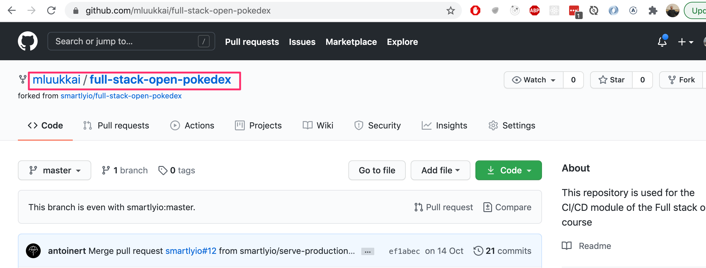
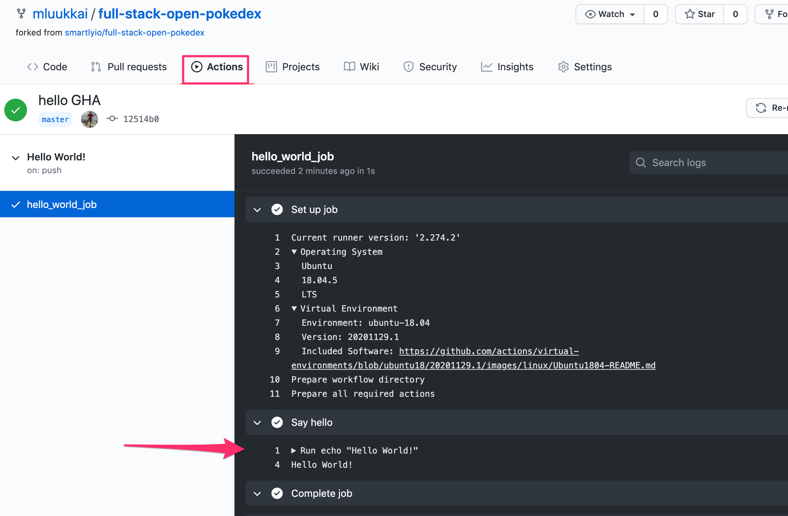
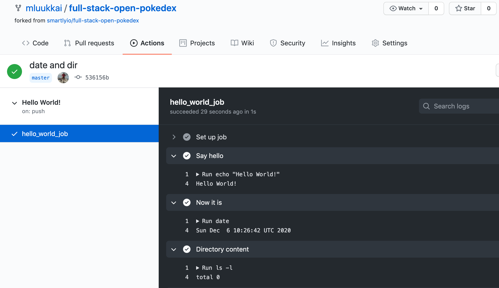
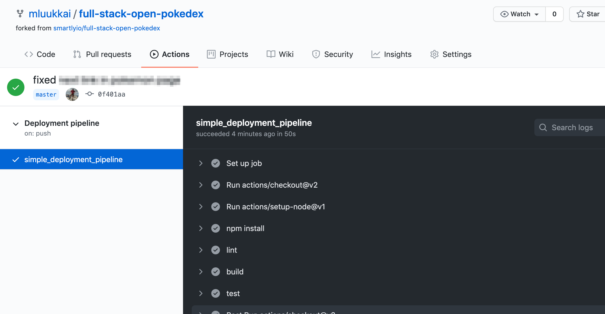

<div class="content">

Before we start playing with GitHub Actions, let's have a look at what they are and how do they work.

GitHub Actions work on a basis of [workflows](https://docs.github.com/en/free-pro-team@latest/actions/learn-github-actions/introduction-to-github-actions#workflows). A workflow is a series of [jobs](https://docs.github.com/en/free-pro-team@latest/actions/learn-github-actions/introduction-to-github-actions#jobs) that are run when a certain triggering [event](https://docs.github.com/en/free-pro-team@latest/actions/learn-github-actions/introduction-to-github-actions#events) happens. The jobs that are run then themselves contain instructions for what GitHub Actions should do.

A typical execution of a workflow looks like this:

- Triggering event happens (for example, there is a push to the main branch).
- The workflow with that trigger is executed.
- Cleanup

### Basic needs

In general, to have CI operate on a repository, we need a few things:

- A repository (obviously)
- Some definition of what the CI needs to do:
  This can be in the form of a specific file inside the repository or it can be defined in the CI system
- The CI needs to be aware that the repository (and the file within it) exist
- The CI needs to be able to access the repository
- The CI needs permissions to perform the actions it is supposed to be able to do:
  For example, if the CI needs to be able to deploy to a production environment, it needs <i>credentials</i> for that environment.

That's the traditional model at least, we'll see in a minute how GitHub Actions short-circuit some of these steps or rather make it such that you don't have to worry about them!

GitHub Actions have a great advantage over self-hosted solutions: the repository is hosted with the CI provider. In other words, Github provides both the repository and the CI platform. This means that if we've enabled actions for a repository, GitHub is already aware of the fact that we have workflows defined and what those definitions look like.

</div>

<div class="tasks">

### Exercise 11.2.

In most exercises of this part, we are building a CI/CD pipeline for a small project found in [this example project repository](https://github.com/smartlyio/fullstackopen-cicd).

Note that the code <i>might not work</i> with node version 15. If you happen to have that version, and the project does not even start, please downgrade to 14 or you are on your own. 
#### 11.2 The example project

The first thing you'll want to do is to fork the example repository under your name. What it essentially does is it creates a copy of the repository under your GitHub user profile for your use. 

To fork the repository, you can click on the Fork button in the top-right area of the repository view next to the Star button:


Once you've clicked on the Fork button, GitHub will start the creation of a new repository called <code>{github_username}/full-stack-open-pokedex</code>.

Once the process has been finished, you should be redirected to your brand new repository:



Clone the project now to your machine. As always, when starting with a new code, the most obvious place to look first is the file <code>package.json</code> 

Try now the following:
- install dependencies (by running <code>npm install</code>)
- start the code in development mode
- run tests
- lint the code 

You might notice that project contains some broken tests and linting errors. **Just leave them as they are for now.** We will get around those later in the exercises.

As you might remember from [part 3](/en/part3/deploying_app_to_internet#frontend-production-build), the React code <i>should not</i> be run in development mode once it is deployed in production. Try now the following
- create a production <i>build</i> of the project
- run the production version locally

Also for these two tasks, there are ready-made npm scripts in the project!

Study the structure of the project for a while. As you notice both the frontend and the backend code is now [in the same repository](/en/part7/class_components_miscellaneous#frontend-and-backend-in-the-same-repository). In earlier parts of the course we had a separate repository for both, but having those in the same repository makes things much simpler when setting up a CI environment. 

In contrast to most projects in this course, the frontend code <i>does not use</i> create-react-app, but it has a relatively simple [webpack](/en/part7/webpack) configuration that takes care of creating the development environment and creating the production bundle.

</div>

<div class="content">

### Getting started with workflows

The core component of creating CI/CD pipelines with GitHub Actions is something called a [Workflow](https://docs.github.com/en/free-pro-team@latest/actions/learn-github-actions/introduction-to-github-actions#workflows). Workflows are process flows that you can set up in your repository to run automated tasks such as building, testing, linting, releasing, and deploying to name a few! The hierarchy of a workflow looks as follows:

Workflow

- Job
  - Step
  - Step
- Job
  - Step

Each workflow must specify at least one [Job](https://docs.github.com/en/free-pro-team@latest/actions/learn-github-actions/introduction-to-github-actions#jobs), which contains a set of [Steps](https://docs.github.com/en/free-pro-team@latest/actions/learn-github-actions/introduction-to-github-actions#steps) to perform individual tasks. The jobs will be run in parallel and the steps in each job will be executed sequentially. 

Steps can vary from running a custom command to using pre-defined actions, thus the name GitHub Actions. You can create [customized actions](https://docs.github.com/en/free-pro-team@latest/actions/creating-actions) or use any actions published by the community, which are plenty, but let's get back to that later!

For GitHub to recognize your workflows, they must be specified in <code>.github/workflows</code> folder in your repository. Each Workflow is its own separate file which needs to be configured using the <code>YAML</code> data-serialization language.

YAML is a recursive acronym for "YAML Ain't Markup Language". As the name might hint its goal is to be human-readable and it is commonly used for configuration files. You will notice below that it is indeed very easy to understand!

Notice that indentations are important in YAML. You can learn more about the syntax [here](https://docs.ansible.com/ansible/latest/reference_appendices/YAMLSyntax.html).

A basic workflow contains three elements in a YAML document. These three elements are:

- name: Yep, you guessed it, the name of the workflow
- (on) triggers: The events that trigger the workflow to be executed
- jobs: The separate jobs that the workflow will execute (a basic workflow might contain only one job).

A simple workflow definition looks like this:

```yml
name: Hello World!

on:
  push:
    branches:
      - master

jobs:
  hello_world_job:
    runs-on: ubuntu-18.04
    steps:
      - name: Say hello
        run: |
          echo "Hello World!"
```

In this example, the trigger is a push to the main branch, which in our project is called <i>master</i>. (Your main branch could be called <i>main</i> or <i>master</i>).  There is one job named <i>hello\_world\_job</i>, it will be run in a virtual environment with Ubuntu 18.04. The job has just one step named "Say hello", which will run the <code>echo "Hello World!"</code> command in the shell.

So you may ask, when does GitHub trigger a workflow to be started? There are plenty of [options](https://docs.github.com/en/free-pro-team@latest/actions/reference/events-that-trigger-workflows) to choose from, but generally speaking, you can configure a workflow to start once:

- An <i>event on GitHub</i> occurs such as when someone pushes a commit to a repository or when an issue or pull request is created
- A <i>scheduled event</i>, that is specified using the [cron]( https://en.wikipedia.org/wiki/Cron)-syntax, happens
- An <i>external event</i> occurs, for example, a command is performed in an external application such as [Slack](https://slack.com/) messaging app

To learn more about which events can be used to trigger workflows, please refer to GitHub Action's [documentation](https://docs.github.com/en/free-pro-team@latest/actions/reference/events-that-trigger-workflows).


</div>

<div class="tasks">

### Exercises 11.3-11.4.

To tie this all together, let us now get Github Actions up and running in the example project!

#### 11.3 Hello world!

Create a new Workflow which outputs "Hello World!" to the user. For the setup, you should create the directory <code>.github/workflows</code> and a file <code>hello.yml</code> to your repository.

To see what your GitHub Action workflow has done, you can navigate to the **Actions** tab in GitHub where you should see the workflows in your repository and the steps they implement. The output of your Hello World workflow should look something like this with a properly configured workflow.



You should see the "Hello World!" message as an output. If that's the case then you have successfully gone through all the necessary steps. You have your first GitHub Actions workflow active! 

Note that GitHub Actions also gives you information what is the exact environment (operating system, and it's [setup](https://github.com/actions/virtual-environments/blob/ubuntu18/20201129.1/images/linux/Ubuntu1804-README.md)) where your workflow is run. This is important since if something surprising happens, it makes debugging so much easier if you can reproduce all the steps in your machine!

#### 11.4 Date and directory contents

Extend the workflow with steps that print the date and current directory content in long format. 

Both of these are easy steps, and just running commands [date](https://man7.org/linux/man-pages/man1/date.1.html) and [ls](https://man7.org/linux/man-pages/man1/ls.1.html) will do the trick.

Your workflow should now look like this



As the output of command <code>ls -l</code> shows, by default, the virtual environment that runs our workflow <i>does not</i> have any code!

</div>

<div class="content">

### Setting up lint, test and build steps  

After completing the first exercises, you should have a simple but pretty useless workflow set up. Let's make our workflow do something useful.

Let's implement a Github Action that will lint the code. If the checks don't pass, Github Actions will show a red status. 

At start, the workflow that we will save to file <code>pipeline.yml</code> looks like this:

```js
name: Deployment pipeline

on:
  push:
    branches:
      - master

jobs:
```

Before we can run a command to lint the code, we have to perform a couple of actions to set up the environment of the job.

#### Setting up the environment

Setting up the environment is an important task while configuring a pipeline. We're going to use an <code>ubuntu-18.04</code> virtual environment because this is the version of Ubuntu we're going to be running in production. 

It is important to replicate the same environment in CI as in production as closely as possible, to avoid situations where the same code works differently in CI and production, which would effectively defeat the purpose of using CI.

Next, we list the steps in the "build" job that the CI would need to perform. As we noticed in the last exercise, by default the virtual environment does not have any code in it, so we need to <i>checkout the code</i> from the repository. 

This an easy step:

```js
name: Deployment pipeline

on:
  push:
    branches:
      - master

jobs:
  simple_deployment_pipeline: // highlight-line
    runs-on: ubuntu-18.04 // highlight-line
    steps: // highlight-line
      - uses: actions/checkout@v2  // highlight-line
```

The [uses](https://docs.github.com/en/free-pro-team@latest/actions/reference/workflow-syntax-for-github-actions#jobsjob_idstepsuses) keyword tells the workflow to run a specific <i>action</i>. An action is a reusable piece of code, like a function. Actions can be defined in your repository in a separate file or you can use the ones available in public repositories. 

Here we're using a public action [actions/checkout](https://github.com/actions/checkout) and we specify a version (<code>@v2</code>) to avoid potential breaking changes if the action gets updated. The <code>checkout</code> action does what the name implies: it checkouts the project source code from git.

Secondly, as the application is written in JavaSript, Node.js must be set up to be able to utilize the commands that are specified in <code>package.json</code>. To set up Node.js, [actions/setup-node](https://github.com/actions/setup-node) action can be used. Version <code>12.x</code> is selected because it is the version the application is using in the production environment.

```js
# name and trigger not shown anymore...

jobs:
  simple_deployment_pipeline:
    runs-on: ubuntu-18.04
    steps:
      - uses: actions/checkout@v2
      - uses: actions/setup-node@v1 // highlight-line
        with: // highlight-line
          node-version: '12.x' // highlight-line
```

As we can see, the [with](https://docs.github.com/en/free-pro-team@latest/actions/reference/workflow-syntax-for-github-actions#jobsjob_idstepswith) keyword is used to give a "parameter" to the action. Here the parameter specifies the version of Node.js we want to use.


Lastly, the dependencies of the application must be installed. Just like on your own machine we execute <code>npm install</code>. The steps in the job should now look something like

```js
jobs:
  simple_deployment_pipeline:
    runs-on: ubuntu-18.04
    steps:
      - uses: actions/checkout@v2
      - uses: actions/setup-node@v1
        with:
          node-version: '12.x'
      - name: npm install  // highlight-line
        run: npm install  // highlight-line
```

Now the environment should be completely ready for the job to run actual important tasks in!

#### Lint

After the environment has been set up we can run all the scripts from <code>package.json</code> like we would on our own machine. To lint the code all you have to do is add a step to run the <code>npm run eslint</code> command.

```js
jobs:
  simple_deployment_pipeline:
    runs-on: ubuntu-18.04
    steps:
      - uses: actions/checkout@v2
      - uses: actions/setup-node@v1
        with:
          node-version: '12.x'
      - name: npm install 
        run: npm install  
      - name: lint  // highlight-line
        run: npm run eslint // highlight-line
```

</div>

<div class="tasks">

### Exercises 11.5.-11.9.

#### 11.5 Linting workflow

Implement or <i>copy-paste</i> the "Lint" workflow and commit it to the repository. Use a new <i>yml</i> file for this workflow, you may call it e.g. <i>pipeline.yml</i>.

Push your code and navigate to "Actions" tab and click on your newly created workflow on the left. You should see that the workflow run has failed:


#### 11.6 Fix the code

There are some issues with the code that you will need to fix. Open up the workflow logs and investigate what is wrong.

A couple of hints. One of the errors is best to be fixed by specifying proper <i>env</i> for linting, see [here](/en/part3/validation_and_es_lint#lint) how it can be done . One of the complaints concerning <code>console.log</code> statement could be taken care of by simply silencing the rule for that specific line. Ask google how to do it.

Make the necessary changes to the source code so that the lint workflow passes. Once you commit new code the workflow will run again and you will see updated output where all is green again:


#### 11.7 Building and testing

Let's expand on the previous workflow that currently does the linting of the code. Edit the workflow and similarly to the lint command add commands for build and test. After this step outcome should look like this


As you might have guessed, there are some problems in code...

#### 11.8 Back to green

Investigate which test fails and fix the issue in the code (do not change the tests).

Once you have fixed all the issues and the Pokedex is bug-free, the workflow run will succeed and show green!



#### 11.9 Simple end to end -tests

The current set of tests use [jest](https://jestjs.io/) to ensure that the React components work as intended. This is exactly the same thing that is done in section [Testing React apps](/en/part5/testing_react_apps) of part 5. 

Testing components in isolation is quite useful but that still does not ensure that the system as a whole works as we wish. To have more confidence about this, let us write a couple of really simple end to end -tests with the [Cypress](https://www.cypress.io/) library simillarly what we do in section [End to end testing](/en/part5/end_to_end_testing) of part 5. 

So, setup cypress (you'll find [here](/en/part5/end_to_end_testing/) all info you need) and use this test at first:

```js
describe('Pokedex', function() {
  it('front page can be opened', function() {
    cy.visit('http://localhost:5000')
    cy.contains('ivysaur')
    cy.contains('Pokémon and Pokémon character names are trademarks of Nintendo.')
  })
})
```

Define a npm script <code>test:e2e</code> for running the e2e tests from the command line.

**Note** do not include the word <i>spec</i> in the cypress test file name, that would cause also jest to run it, and it might cause problems. 

**Another thing to note** is that despite the page renders the Pokemon names by starting with a capital letter, the names are actually written with lower case letters in the source, so it is <code>ivysaur</code> instead of <code>Ivysaur</code>!

Ensure that the test passes locally. Remember that the cypress tests _assume that the application is up and running_ when you run the test! If you have forgotten the details (that happened to me too!), please see [part 5](/en/part5/end_to_end_testing) how to get up and running with cypress.

Once the end to end test works in your machine, include it in the GitHub Action workflow. By far the easiest way to do that is to use the ready-made action [cypress-io/github-action](https://github.com/cypress-io/github-action). The step that suits us is the following:

```js
- name: e2e tests
  uses: cypress-io/github-action@v2
  with:
    command: npm run test:e2e
    start: npm run start-prod
    wait-on: http://localhost:5000
```

Three options are used. [command](https://github.com/cypress-io/github-action#custom-test-command) specifies how to run cypress tests. [start](https://github.com/cypress-io/github-action#start-server) gives npm script that starts the server and [wait-on](https://github.com/cypress-io/github-action#wait-on) says that before the tests are run, the server should have started in url <http://localhost:5000>.

Once you are sure that the pipeline works, write another test that ensures that one can navigate from the main page to the page of a particular Pokemon, e.g. <i>ivysaur</i>. The test does not need to be a complex one, just check that when you navigate a link, the page has some right content, such as the string <i>chlorophyll</i> in the case of <i>ivysaur</i>.

**Note** that you should not try <i>bulbasaur</i>, for some reason the page of that particular Pokemon does not work properly...

The end result should be something like this


End to end -tests are nice since they give us confidence that software works from the end user's perspective. The price we have to pay is the slower feedback time. Now executing the whole workflow takes quite much longer.

</div>
