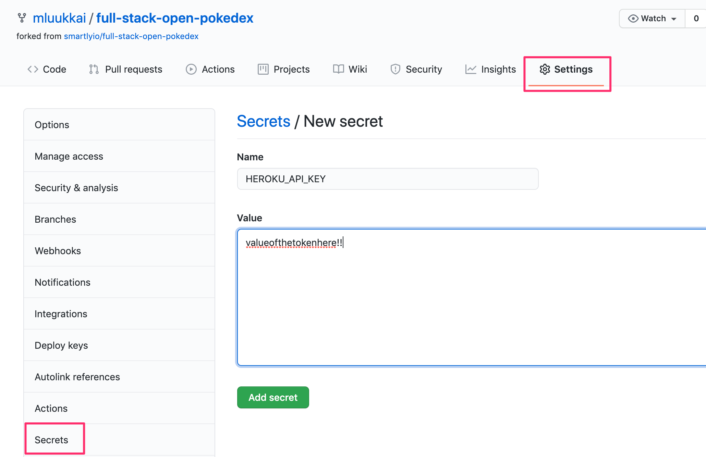
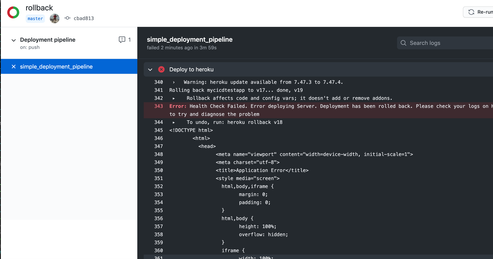

<div class="content">

Having written a nice application it's time to think about how we're going to deploy it to the use of real users. 

In [part 3](/en/part3/deploying_app_to_internet) of this course, we did this by simply <i>pushing the git repository</i> to the servers of the cloud provider [Heroku](https://www.heroku.com/home). It is pretty simple at least compared to many other type of hosting setups but still contains risks: nothing prevents us from accidently pushing broken code to production.

In this part, we're going to look at the principles of making a deployment safely and some of the principles of deploying software on both a small and large scale. 

### Principles
We'd like to define some rules about how our deployment process should work but before that, we have to look at some constraints of reality.

One on phrasing of Murphy's Law holds that:
  "Anything that can go wrong will go wrong."

It's important to remember this when we plan out our deployment system. Some of the things we'll need to consider could include:
 - What if my PC crashes or hangs during deployment?
 - I'm connected to the server I'm deploying to over the internet, what happens if my internet connection dies?
 - What happens if any specific instruction in my deployment script/system fails?
 - What happens if, for whatever reason, my software doesn't work as expected on the server I'm deploying to? Can I roll back to a previous version?
 - What happens if a user requests something from our software just before we do a deployment (we didn't have time to send a response to the user)?

These are just a small selection of what can go wrong during a deployment, or rather, things that we should plan for. Regardless of what happens, our deployment system should **never** leave our software in a broken state. We should also always know (or be easily able to find out) what state a deployment is in.

Another important rule to remember when it comes to deployments (and CI in general) is:
  "Silent failures are **very** bad!"

This doesn't mean that failures need to be shown to the users of the software, it means we need to be aware if anything goes wrong. If we are aware of a problem, we can fix it, if the deployment system doesn't give any errors but fails, we may end up in a state where we believe we have fixed a critical bug but the deployment failed, leaving the bug in our production environment and us unaware of the situation.

Defining definitive rules/requirements for a deployment system is difficult, let's try anyway:
 - Our deployment system should be able to fail gracefully at **any** step of the deployment.
 - Our deployment system should **never** leave our software in a broken state.
 - Our deployment system should let us know when a failure has happened. It's more important to notify about failure than about success.
 - Our deployment system should be allow us to roll back to a previous deployment. Preferrably this roll back should be easier to do (and less prone to failure) than a full deployment.
 - Our deployment system should handle the situation where a user makes a request just before/during a deployment.
 - Our deployment system should make sure that the software we are deploying meets the requirements we have set for this (e.g. don't deploy if tests haven't been run).

Let's define some things we **want** in this hypothetical deployment system too:
 - We would like it to be fast
 - We'd like to have no downtime during the deployment (this is distinct from the requirement we have for handling user requests just before/during the deployment).

</div>

<div class="tasks">

### Exercises 11.10-12.

Prior to these exercises, you should ensure you have set up an app in your Heroku environment simillarly that we did in [part 3](/en/part3/deploying_app_to_internet#application-to-the-internet). However now we don not push the code to Heroku ourselves, we let the Gihub Action workflow do that for us!

Ensure now that you have [Heroku CLI](https://devcenter.heroku.com/articles/heroku-cli#download-and-install) installed and login to Heroku using the CLI with <code>heroku login</code>

Create a new app in Heroku using the  CLI: <code>heroku create --region eu {your_app_name}</code>, pick a [region](https://devcenter.heroku.com/articles/regions) close to your own location!

Generate an API token for your Heroku profile using <code>heroku authorizations:create</code>, and save the credentials to a local file but <i>**do not push those to GitHub**</i>!

You'll the <i>token</i> for your deployment workflow. See more information at <https://devcenter.heroku.com/articles/platform-api-quickstart>.

#### 11.10 Deploying your application to Heroku

Extend the workflow with a step to deploy your application to Heroku.

<i>**Hint**: try using a ready-made heroku deploy action that has been developed by the community. For example https://github.com/AkhileshNS/heroku-deploy.</i>

You need the autorization <i>token</i> for the deployment. The proper way to pass it's value to GitHub Actions is to use repository secrets:



Now the workflow can access the token value as follows:

```
${{secrets.HEROKU_API_KEY}}
```

If all goes well, your workflow log should look a bit like this:


You can then try the app with browser, but most likely you run to a problem. If we read carefully [the section 'Application to the Internet' in part 3](/en/part3/deploying_app_to_internet#application-to-the-internet) we notice that Heroku assumes that reposity has a file called <i>Procfile</i> that tells Heroku how to start the application. 

So, add a proper Procfile and ensure that the application starts properly. 

**Remember** that it is always essential to have keep on eye what is happening in server logs when playing around with product depolyments, so use <code>heroku logs</code> early and use it often. No, use it all the time!

#### 11.11 Health check

Before moving on let us expand pipeline with one more step, a check that ensures that the application is up and running after the deployment. 

Actually a separate workflow step is not needed, since the 
[deploy-to-heroku](https://github.com/marketplace/actions/deploy-to-heroku) contains on option that takes care of it.

Add to the backend a simple endpoint for doing a application health check. You may eg. copy this code:

```js
app.get('/health', (req, res) => {
  res.send('ok')
})
```

It might also be good idea to have a dummy endpoint in the app that makes it possible to do code changes and to ensure that the deployed version has really changed:

```js
app.get('/version', (req, res) => {
  res.send('1') // change this string to ensure a new version deployed
})
```

Look now from the [documentation](https://github.com/marketplace/actions/deploy-to-heroku) how to include the health check to the deployment step. Use the created endpoint for the healtcheck url, you most likely need also the <i>checkstring</i> option to get the check working.

Ensure that Actions notices if a deployment breaks yor applicaton. You may simulate this by writing a wrong startup command to Procfile:


Before moving to next exercise, fix your deployment and ensure that the application works again as intended.

#### 11.12. Rollback

If the deplyment results to a broken application, the best thing to do is to <i>rollback</i> to previous release. Luckyly Heroku makes this pretty easy. Every deployment to Heroku results a [release](https://blog.heroku.com/releases-and-rollbacks#releases). You can see your application's releases with the command <i>$ heroku releases</i>:

```js
$ heroku releases
=== cicdtest222 Releases - Current: v29
v29  Deploy 7fff7150  mluukkai@iki.fi  2020/12/05 18:22:32 +0200
v28  Deploy 764c37d4  mluukkai@iki.fi  2020/12/05 18:09:04 +0200
v27  Deploy 1467d514  mluukkai@iki.fi  2020/12/05 16:28:52 +0200
v26  Deploy ec0ea68b  mluukkai@iki.fi  2020/12/05 15:39:31 +0200
v25  Deploy a8a88aff  mluukkai@iki.fi  2020/12/05 15:34:55 +0200
v24  Deploy d0f3ae58  mluukkai@iki.fi  2020/12/05 15:31:45 +0200
v23  Deploy a348f651  mluukkai@iki.fi  2020/12/05 15:28:19 +0200
v22  Deploy 254d24d4  mluukkai@iki.fi  2020/12/05 14:27:33 +0200
v21  Deploy 950f5403  mluukkai@iki.fi  2020/12/05 14:24:44 +0200
v20  Deploy 9d51da28  mluukkai@iki.fi  2020/12/05 14:22:20 +0200
```

One can quickly do a [rollback](https://blog.heroku.com/releases-and-rollbacks#rollbacks) to a release with just a single command. What is even better is that action [deploy-to-heroku](https://github.com/marketplace/actions/deploy-to-heroku) can take care of that for us!

So read again the [documentation](https://github.com/marketplace/actions/deploy-to-heroku)  and modify the workflow to prevent a broken deployment alltogether. You can again simulate a broken deployment with breaking the Procfile:



Ensure that the application stays still operational despite a broken deployment. 

Note that despite the automatic rollback operation, the build fails and when this happens in real life it is <i> essential</i> to find what caused the problem and fix it quick. As usual, the best place to start finding out the cause of the problem is to study Heroku logs:


</div>
