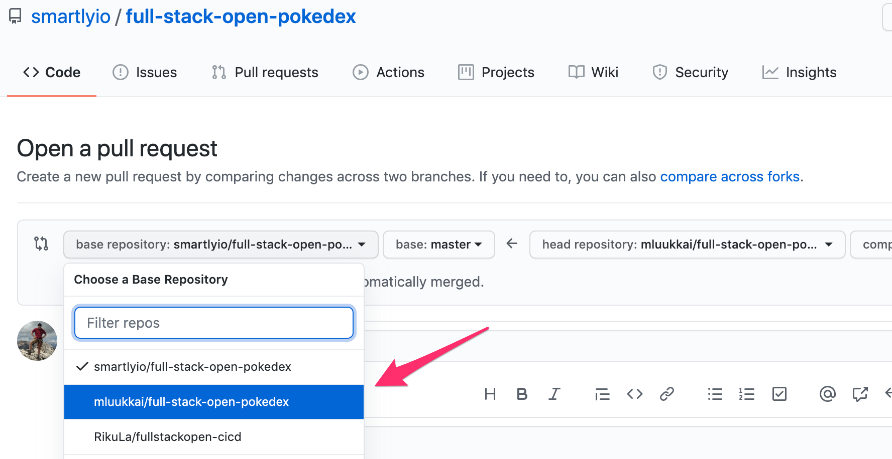
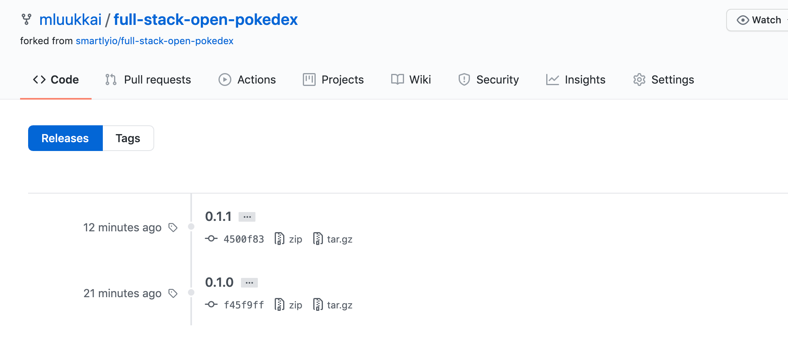
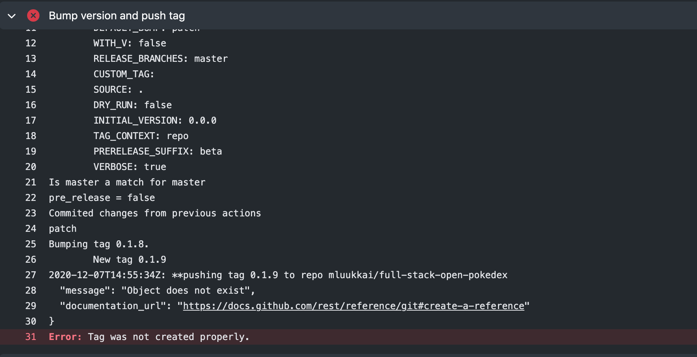
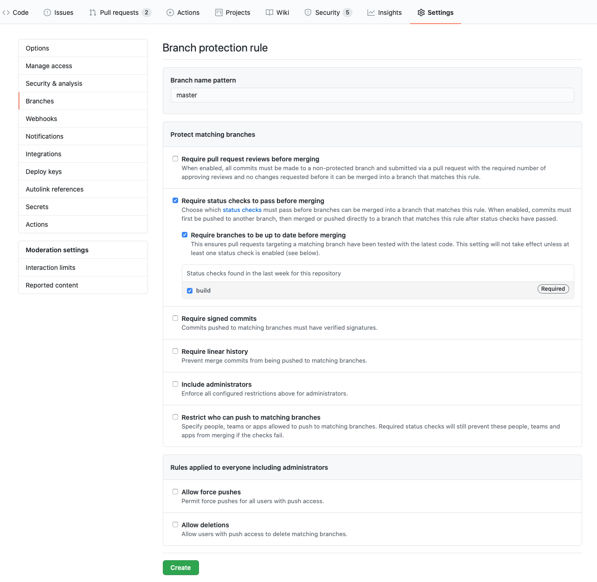

<div class="content">

Su rama principal del código siempre debe permanecer <i>verde</i>. Ser ecológico significa que todos los pasos de su canal de compilación deben completarse con éxito: el proyecto debe compilarse correctamente, las pruebas deben ejecutarse sin errores y el linter no debe tener nada de qué quejarse, etc.

¿Porque es esto importante? Es probable que implementes tu código en producción específicamente desde tu rama principal. Cualquier falla en la rama principal significaría que las nuevas funciones no se pueden implementar en producción hasta que se resuelva el problema. A veces, descubrirá un error desagradable en la producción que no fue detectado por la canalización de CI/CD. En estos casos, desea poder revertir el entorno de producción a un commit anterior de forma segura.

Entonces, ¿cómo mantienes verde tu rama principal? Evite realizar cambios directamente en la rama principal. En su lugar, confirme su código en una rama basada en la versión más reciente posible de la rama principal. Una vez que crea que la rama está lista para fusionarse con el master, crea una solicitud de extracción de GitHub (también conocida como <abbr title="Pull Request">PR</abbr>).

### Trabajar con Pull Request

Las solicitudes de extracción son una parte fundamental del proceso de colaboración cuando se trabaja en cualquier proyecto de software con al menos dos colaboradores. Al realizar cambios en un proyecto, comprueba una nueva rama localmente, realiza y confirma tus cambios, envía la rama al repositorio remoto (en nuestro caso, a GitHub) y crea una pull request para que alguien revise tus cambios antes de que puedan fusionarse en la rama master.

Hay varias razones por las que usar pull request y hacer que al menos otra persona revise el código es siempre una buena idea.

- Incluso un desarrollador experimentado a menudo puede pasar por alto algunos problemas en su código: todos conocemos el efecto de visión de túnel.
- Un revisor puede tener una perspectiva diferente y ofrecer un punto de vista diferente.
- Después de leer los cambios, al menos otro desarrollador estará familiarizado con los cambios que ha realizado.
- El uso de PR le permite ejecutar automáticamente todas las tareas en su canal de CI antes de que el código llegue a la rama principal. Las acciones de GitHub proporcionan un disparador para pull request.

Puede configurar su repositorio de GitHub de tal manera que las pull request no se puedan fusionar hasta que se aprueben.


Para abrir una nueva pull request, abra su fork en GitHub y haga clic en el boton verde "Compare & pull request" en la parte superior. Se le presentará el formulario donde puede completar la descripción de la pull request.


La interfaz de solicitud de extracción de GitHub presenta una descripción y la interfaz de discusión. En la parte inferior, muestra todas las comprobaciones de CI (en nuestro caso, cada una de nuestras acciones de Github) que están configuradas para ejecutarse para cada PR y los estados de estas comprobaciones. ¡Un tablero verde es lo que buscas! Puede hacer clic en Detalles de cada verificación para ver los detalles y ejecutar registros.

Todos los flujos de trabajo que vimos hasta ahora fueron activados por confirmaciones en la rama master. Para que el flujo de trabajo se ejecute para cada solicitud de extracción, tendríamos que actualizar la parte desencadenante del flujo de trabajo. Usamos el disparador "pull_request" para la rama "master" y limitamos el disparador a los eventos "abiertos" y "sincronizados". Básicamente, esto significa que el flujo de trabajo se ejecutará cuando se abra o actualice un PR en el master.

Así que cambiemos los eventos que [activan](https://docs.github.com/en/free-pro-team@latest/actions/reference/events-that-trigger-workflows) del flujo de trabajo de la siguiente manera:

```js
on:
  push:
    branches:
      - master
  pull_request: // highlight-line
    branches: [master] // highlight-line
    types: [opened, synchronize] // highlight-line
```

Pronto haremos que sea imposible hacer push del código directamente a master, pero mientras tanto, sigamos ejecutando el flujo de trabajo también para todos los push directos posibles a master.

</div>

<div class="tasks">

### Ejercicios 11.14-11.15.

Nuestro flujo de trabajo está haciendo un buen trabajo para garantizar una buena calidad del código, pero dado que se ejecuta en commits a master, ¡detecta los problemas demasiado tarde!

#### 11.14 Pull request

Actualice el activador del flujo de trabajo existente como se sugirió anteriormente para que se ejecute en nuevas pull request para master.

Cree una nueva rama, haga commit a sus cambios y abra una pull request para master.

Si no ha trabajado con ramas antes, consulte [por ejemplo, este tutorial](https://www.atlassian.com/git/tutorials/using-branches) para empezar.

Tenga en cuenta que cuando abra la pull request, asegúrese de seleccionar aquí su <i>propio</i> repositorio como el <i>repositorio base</i> de destino. Por defecto, la selección es el repositorio original por smartly y **no quieres** hacer eso:



En la pestaña "Conversation" de la pull request, debería ver sus últimos commits y el estado amarillo de las comprobaciones en curso:


Una vez que las comprobaciones se hayan ejecutado, el estado debe cambiar a verde. Asegúrese de que todos los controles pasen.

#### 11.15 ejecutar el paso de implementación solo para la rama master

Todo se ve bien, pero en realidad hay un problema bastante serio con el flujo de trabajo actual. Todos los pasos, incluida la implementación, se ejecutan también para pull request. ¡Esto seguramente es algo que no queremos!

Afortunadamente, ¡hay una solución fácil para el problema! Podemos agregar una condición [if](https://docs.github.com/en/free-pro-team@latest/actions/reference/workflow-syntax-for-github-actions#jobsjob_idif) al paso de implementación, lo que garantiza que el paso se ejecute solo cuando el código se fusiona o se envía al master.

El flujo de trabajo [context](https://docs.github.com/en/free-pro-team@latest/actions/reference/context-and-expression-syntax-for-github-actions#contexts) proporciona varios tipos de información sobre el código en el que se ejecuta el flujo de trabajo.

La información relevante se encuentra en [github context](https://docs.github.com/en/free-pro-team@latest/actions/reference/context-and-expression-syntax-for-github-actions#github-context), el campo <i>event_name</i> indica cuál es el "nombre" del evento que desencadenó el flujo de trabajo. Cuando se fusiona una solicitud de extracción, el nombre del evento es de alguna manera paradójicamente <i>push</i>, el mismo evento que ocurre cuando se envía el código al repositorio. Por lo tanto, obtenemos el comportamiento deseado agregando la siguiente condición al paso que implementa el código:

```js
if: ${{ github.event_name == 'push' }}
```

Haga push de más código en su rama, y asegúrese de que el paso de implementación <i>ya no se ejecute</i>. Luego, combine la rama con la maestra y asegúrese de que se lleve a cabo la implementación.

</div>

<div class="content">

### Control de versiones

El propósito más importante del control de versiones es identificar de forma única el software que estamos ejecutando y el código asociado con él.

El pedido de versiones también es un dato importante. Por ejemplo, si la versión actual ha roto la funcionalidad crítica y necesitamos identificar la <i>versión anterior</i> del software para poder revertir la versión a un estado estable.

#### Control de versiones semántico y control de versiones hash

La forma en que se versiona una aplicación a veces se denomina estrategia de control de versiones. Veremos y compararemos dos de esas estrategias.

El primero es [control de versiones semántico](https://semver.org/), donde una versión tiene el formato <code>{major}.{minor}.{patch}</code>. Por ejemplo, si la versión es <code>1.2.3</code>, tiene <code>1</code> como versión principal, <code>2</code> es la versión secundaria y <code>3</code> es la versión del parche.

En general, los cambios que corrigen la funcionalidad sin cambiar el funcionamiento de la aplicación desde el exterior son cambios de <code>parche</code>, los cambios que realizan pequeños cambios en la funcionalidad (como se ve desde el exterior) son cambios <code>menores</code> y cambios que cambian por completo la aplicación (o cambios importantes de funcionalidad) son cambios <code>principales</code>. Las definiciones de cada uno de estos términos pueden variar de un proyecto a otro.

Por ejemplo, las bibliotecas npm siguen el control de versiones semántico. En el momento de escribir este texto (7 de diciembre de 2020), la versión más reciente de React es [17.0.1](https://reactjs.org/versions/), por lo que la versión principal es la 17, que es bastante reciente y se acaba de subir un parche, la versión secundaria sigue siendo 0.

<i>Control de versiones Hash</i> (también conocido como control de versiones SHA) es bastante diferente. El "número" de versión en el control de versiones hash es un hash (que parece una cadena aleatoria) derivado del contenido del repositorio y los cambios introducidos en esta confirmación. En git, esto ya está hecho por usted como el hash de confirmación que es único para cualquier conjunto de cambios.

El control de versiones hash casi siempre se usa junto con la automatización. Es una molestia (y propenso a errores) copiar números de versión de 32 caracteres para asegurarse de que todo se implemente correctamente.

#### Pero, ¿a qué apunta la versión?

Determinar qué código hay en una versión determinada es importante y la forma en que se logra nuevamente es bastante diferente entre el control de versiones semántico y hash. En el control de versiones de hash (al menos en git) es tan simple como buscar el commit basada en el hash. Esto nos permitirá saber exactamente qué código se implementa con qué versión.

Es un poco más complicado cuando se utilizan versiones semánticas y hay varias formas de abordar el problema. Estos se reducen a tres enfoques posibles: algo en el código mismo, algo en el repositorio o metadatos del repositorio, algo completamente fuera del repositorio.

Si bien no cubriremos la última opción en la lista (ya que es un agujero de conejo por sí solo), vale la pena mencionar que esto puede ser tan simple como una hoja de cálculo que enumera la Versión Semántica y el commit al que apunta.

Para los dos enfoques basados ​​en repositorios, el enfoque con algo en el código generalmente se reduce a un número de versión en un archivo y el enfoque de repositorio/metadatos generalmente se basa en [etiquetas](https://www.atlassian.com/git/tutorials/inspecting-a-repository/git-tag) o (en el caso de GitHub) versiones. En el caso de etiquetas o lanzamientos, esto es relativamente simple, la etiqueta o lanzamiento apunta a un commit, el código en ese commit es el código en el lanzamiento.

#### Orden de versión

En el control de versiones semántico, incluso si tenemos cambios de versión de diferentes tipos (mayor, menor o parche), es bastante fácil poner las versiones en orden: 1.3.7 viene antes de 2.0.0 que a su vez viene antes de 2.1.5 que viene antes 2.2.0. Aún se necesita una lista de lanzamientos (convenientemente proporcionada por un administrador de paquetes o GitHub) para saber cuál es la última versión, pero es más fácil mirar esa lista y discutirla: Es más fácil decir "Necesitamos volver a 3.2.4" que intentar comunicar un hash en persona.

Eso no quiere decir que los hash sean inconvenientes: si sabe qué commit causó el problema en particular, es bastante fácil mirar hacia atrás en un historial de git y obtener el hash de la confirmación anterior. Pero si tiene dos hashes, diga <code>d052aa41edfb4a7671c974c5901f4abe1c2db071</code> y <code>12c6f6738a18154cb1cef7cf0607a681f72eaff3</code>, realmente no puede decir qué se convirtió en algo más temprano en el historial, usted necesita algo más, como el git log que revela el orden.

#### Comparación de los dos métodos

Ya hemos mencionado algunas de las ventajas y desventajas de los dos métodos de control de versiones discutidos anteriormente, pero tal vez sea útil abordar dónde probablemente se usarían cada uno.

El control de versiones semántico funciona bien cuando se implementan servicios en los que el número de versión podría ser significativo o podría ser examinado. Como ejemplo, piense en las bibliotecas de Javascript que está utilizando. Si está usando la versión 3.4.6 de una biblioteca en particular, y hay una actualización disponible para 3.4.8, si la biblioteca usa versiones semánticas, podría (con suerte) asumir con seguridad que está bien para actualizar sin romper nada. Si la versión pasa a la 4.0.1, tal vez no sea una actualización tan segura.

El control de versiones hash es muy útil cuando la mayoría de las confirmaciones se integran en artefactos (por ejemplo, binarios ejecutables o imágenes de Docker) que se cargan o almacenan. Por ejemplo, si sus pruebas requieren construir su paquete en un artefacto, cargarlo en un servidor y ejecutar pruebas en él, sería conveniente tener versiones de hash, ya que evitaría accidentes.

Como ejemplo, piense que está trabajando en la versión 3.2.2 y tiene una prueba fallida, arregla la falla y hace push del commit, pero mientras trabaja en su rama, no va a actualizar el número de versión. Sin el control de versiones hash, es posible que el nombre del artefacto no cambie. Si hay un error al cargar el artefacto, tal vez las pruebas se ejecuten nuevamente con el artefacto más antiguo (ya que todavía está allí y tiene el mismo nombre) y obtenga resultados de prueba incorrectos. Si el artefacto está versionado con el hash, entonces el número de versión _debe_ cambiar en cada confirmación y esto significa que si la carga falla, habrá un error ya que el artefacto que le dijo a las pruebas que se ejecutaran nuevamente no existe.

Tener un error cuando algo sale mal es casi siempre preferible a tener un problema ignorado silenciosamente en CI.

#### Lo mejor de ambos mundos

De la comparación anterior, parecería que las versiones semánticas tienen sentido para lanzar software, mientras que las versiones basadas en hash (o nombres de artefactos) tienen más sentido durante el desarrollo. Esto no necesariamente causa un conflicto.

Piénselo de esta manera: el control de versiones se reduce a una técnica que apunta a un commit específico y dice "Le daremos un nombre a este punto, su nombre será 3.5.5". Nada nos impide también referirnos a la misma confirmación por su hash.

Hay una trampa. Discutimos al principio de esta parte que siempre debemos saber exactamente qué está sucediendo con nuestro código, por ejemplo, debemos estar seguros de haber probado el código que queremos implementar. Tener dos convenciones de versiones (o nombres) paralelas puede hacer que esto sea un poco más difícil.

Por ejemplo, cuando tenemos un proyecto que usa compilaciones de artefactos basados ​​en hash para realizar pruebas, siempre es posible rastrear el resultado de cada compilación, lint y prueba hasta un commit específico y los desarrolladores saben en qué estado se encuentra su código. Esto es todo automatizado y transparente para los desarrolladores. Nunca necesitan ser conscientes del hecho de que el sistema de CI está usando el hash de commit debajo para nombrar los artefactos de construcción y prueba. Cuando los desarrolladores fusionan su código a master, nuevamente el CI se hace cargo. Esta vez, compilará y probará todo el código y le dará un número de versión semántica de una sola vez. Adjunta el número de versión al commit relevante con una etiqueta git.

En el caso anterior, el software que lanzamos se prueba porque el sistema CI se asegura de que las pruebas se ejecuten en el código que está a punto de etiquetar. No sería incorrecto decir que el proyecto utiliza versiones semánticas y simplemente ignorar que el sistema de CI prueba las ramas/PRs de desarrolladores individuales con un sistema de nombres basado en hash. Hacemos esto porque la versión que nos importa (la que se publica) tiene una versión semántica.

</div>

<div class="tasks">

### Ejercicios 11.16-11.17.

Extendamos nuestro flujo de trabajo para que aumente (bump) automáticamente la versión cuando una pull request se fusiona en master y [etiquete](https://www.atlassian.com/git/tutorials/inspecting-a-repository/git-tag) el lanzamiento con el número de versión. Usaremos una acción de código abierto desarrollada por un tercero: [anothrNick/github-tag-action](https://github.com/anothrNick/github-tag-action).

#### 11.16 Adición de control de versiones

Extendiremos nuestro flujo de trabajo con un paso:

```js
- name: Bump version and push tag
  uses: anothrNick/github-tag-action@1.33.0
  env:
    GITHUB_TOKEN: ${{ secrets.GITHUB_TOKEN }}
```

Pasamos una variable de entorno <code>secrets.GITHUB\_TOKEN</code> a la acción. Como es una acción de terceros, necesita el token para la autenticación en su repositorio. Puede leer más [aquí](https://docs.github.com/en/actions/configuring-and-managing-workflows/authenticating-with-the-github_token) sobre la autenticación en Acciones de GitHub.

La acción [anothrNick/github-tag-action](https://github.com/anothrNick/github-tag-action) puede aceptar múltiples variables de entorno. Estas variables modifican la forma en que la acción etiqueta sus lanzamientos. Puede consultarlos en el [README](https://github.com/anothrNick/github-tag-action) y ver qué se adapta a sus necesidades.

Como puede ver en la documentación de forma predeterminada, sus versiones recibirán un aumento _menor_, lo que significa que se incrementará el número del medio.

Modifique la configuración anterior para que cada nueva versión sea por defecto un _batch_ bump en el número de versión, de modo que por defecto, el último número sea incrementado.

Recuerde que solo queremos subir la versión cuando el cambio ocurre en la rama master. Por lo tanto, agregue una condición <code>if</code> similar para evitar cambios de versión en la pull request como se hizo en el [Ejercicio 11.15](/en/part11/keep_green#ejercicios-11-14-15)
para evitar la implementación en la pull request de eventos relegados.

¡Complete el flujo de trabajo y pruébelo!

Si no está seguro de la configuración, puede establecer <code>DRY_RUN</code> en <code>true</code>, lo que hará que la acción muestre el siguiente número de versión sin crear ni etiquetar la versión.

Una vez que el flujo de trabajo se ejecuta correctamente, el repositorio menciona que hay algunas <i>etiquetas</i>:


Y al hacer clic en él, puede ver todas las etiquetas (que es el mecanismo de git para marcar un lanzamiento) enumeradas:



**Nota:** Terminé teniendo este error en la acción de etiquetado:



Una forma rápida (pero quizás un poco sucia) de resolver el problema era verificar el repositorio una vez más justo antes del paso de etiquetado:
```js
  - uses: actions/checkout@v2 // highlight-line
  - name: Bump version and push tag
    uses: anothrNick/github-tag-action@1.33.0
    env:
      GITHUB_TOKEN: ${{ secrets.GITHUB_TOKEN }}
```

Una mejor opción sería quizás otro trabajo que se encargue del etiquetado.

#### 11.17 Omitir una confirmación para etiquetado e implementación

En general, cuanto más a menudo implemente el master en producción, mejor. Sin embargo, a veces puede haber algunas razones válidas para omitir un commit en particular o una solicitud de extracción combinada para ser etiquetado y lanzado a producción.

Modifique su configuración para que si un mensaje de confirmación en una solicitud de extracción contiene _#skip_, el merge no se implementará en producción y no se etiquetará con un número de versión.

**Sugerencias:**

La forma más fácil de implementar esto es alterar las condiciones [if](https://docs.github.com/en/free-pro-team@latest/actions/reference/workflow-syntax-for-github-actions#jobsjob_idstepsif) de los pasos relevantes. De manera similar al [ejercicio 11-5](/en/part11/keep_green#ejercicios-11-14-15), puede obtener la información relevante del [github context](https://docs.github.com/en/free-pro-team@latest/actions/reference/context-and-expression-syntax-for-github-actions#github-context) del flujo de trabajo.

Es posible que tome esto como un punto de partida:

```js
name: Testing stuff

on:
  push:
    branches:
      - master

jobs:
  a_test_job:
    runs-on: ubuntu-18.04
    steps:
      - uses: actions/checkout@v2
      - name: gihub context
        env:
          GITHUB_CONTEXT: ${{ toJson(github) }}
        run: echo "$GITHUB_CONTEXT"
      - name: commits
        env:
          COMMITS: ${{ toJson(github.event.commits) }}
        run: echo "$COMMITS"
      - name: commit messages
        env:
          COMMIT_MESSAGES: ${{ toJson(github.event.commits.*.message) }}
        run: echo "$COMMIT_MESSAGES"
```

Mira lo que obtiene impreso en el registro de flujo de trabajo!

Tenga en cuenta que puede acceder a los commits y a los mensajes de commits <i>solo al hacer push o merge con el master</i>, por lo que para las pull request, <code>github.event.commits</code> está vacío. De todos modos, no es necesario, ya que queremos omitir el paso por completo para las pull request.

Lo más probable es que necesite funciones [contains](https://docs.github.com/en/free-pro-team@latest/actions/reference/context-and-expression-syntax-for-github-actions#contains) y [join](https://docs.github.com/en/free-pro-team@latest/actions/reference/context-and-expression-syntax-for-github-actions#join) para su condición if.

Desarrollar flujos de trabajo no es fácil y, con frecuencia, la única opción es la prueba y el error. En realidad, podría ser aconsejable tener un repositorio separado para obtener la configuración correcta y, cuando esté lista, copiar las configuraciones correctas en el repositorio real.

También sería posible instalar una herramienta como [act](https://github.com/nektos/act) que hace posible ejecutar sus flujos de trabajo localmente. En caso de que termine con casos de uso más involucrados, por ejemplo, creando sus [propias acciones personalizadas](https://docs.github.com/en/free-pro-team@latest/actions/creating-actions) pasando por el la carga de configurar una herramienta como act probablemente valga la pena.

</div>

<div class="content">

### Una nota sobre el uso de acciones de terceros

Cuando utilice una acción de terceros como <i>github-tag-action</i>, podría ser una buena idea especificar la versión utilizada con hash en lugar de utilizar un número de versión. La razón de esto es que el número de versión, que se implementa con una etiqueta git, en principio, se puede <i>mover</i>. ¡Así que la versión 1.33.0 de hoy podría ser un código diferente al de la version 1.33.0 de la próxima semana!

Sin embargo, el código en commit con un particular no cambia bajo ninguna circunstancia, por lo que si queremos estar 100% seguros sobre el código que usamos, lo más seguro es usar el hash.

La versión [1.33.0](https://github.com/anothrNick/github-tag-action/releases) de la acción corresponde a la confirmación con el hash <code>9eca2b69f9e2c24be7decccd0f15fdb1ea5906598</code>, por lo que es posible que deseemos cambiar nuestro configuración de la siguiente manera:

```js
    - name: Bump version and push tag
      uses: anothrNick/github-tag-action@9eca2b69f9e2c24be7decccd0f15fdb1ea5906598  // highlight-line
      env:
        GITHUB_TOKEN: ${{ secrets.GITHUB_TOKEN }}
```

Cuando usamos acciones proporcionadas por GitHub confiamos en que no se metan con las etiquetas de versión y que prueben a fondo su código.

En el caso de acciones de terceros, el código puede terminar con errores o incluso malicioso. Incluso cuando el autor del código de fuente abierta no tiene la intención de hacer algo malo, podría terminar dejando sus credenciales en una nota adhesiva en un café, y luego quién sabe qué podría suceder.

Al señalar el hash de un commit específico, podemos estar seguros de que el código que usamos al ejecutar el flujo de trabajo no cambiará porque cambiar el commit subyacente y su contenido también cambiaría el hash.

### Mantener master protegido

GitHub te permite configurar ramas protegidas. Es importante proteger su rama más importante que nunca debe romperse: master. En la configuración del repositorio, puede elegir entre varios niveles de protección. No repasaremos todas las opciones de protección, puede obtener más información sobre ellas en la documentación de GitHub. Exigir la aprobación de la pull request cuando se fusiona con el master es una de las opciones que mencionamos anteriormente.

Desde el punto de vista de CI, la protección más importante es requerir que se aprueben las verificaciones de estado antes de que un PR pueda fusionarse con el master. Esto significa que si ha configurado acciones de GitHub para que se ejecuten, por ejemplo, tareas de linting y pruebas, hasta que todos los errores de lint se corrijan y todas las pruebas pasen, el PR no se puede fusionar. Debido a que usted es el administrador de su repositorio, verá una opción para anular la restricción. Sin embargo, los no administradores no tendrán esta opción.


Para configurar la protección para su rama master, navegue a "Settings" del repositorio en el menú superior dentro del repositorio. En el menú del lado izquierdo, seleccione "Branches". Haga clic en el botón "Add rule" junto a "Branch protection rules". Escriba un patrón de nombre de rama ("master" funcionará bien) y seleccione la protección que desea configurar. Al menos "Require status checks to pass before merging" ("Requerir que se aprueben las verificaciones de estado antes de fusionar") es necesario para que pueda utilizar completamente el poder de las acciones de GitHub. Debajo, también debe marcar 
"Require branches to be up to date before merging" ("Requerir que las sucursales estén actualizadas antes de fusionarse") y seleccionar todas las verificaciones de estado que deben aprobarse antes de que un PR pueda fusionarse.



</div>

<div class="tasks">

### Ejercicio 11.

Agregue protección a su rama master.

Debe protegerlo para:

- Requerir que se aprueben todas las pull request antes de fusionar
- Requerir que todas las verificaciones de estado pasen antes de fusionar

No marque todavía <i>Incluir administradores</i>. Si lo hace, necesita que otra persona revise sus pull request para que se publique el código.

</div>
