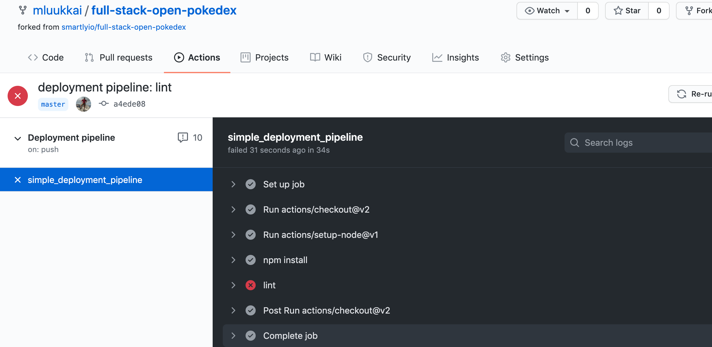
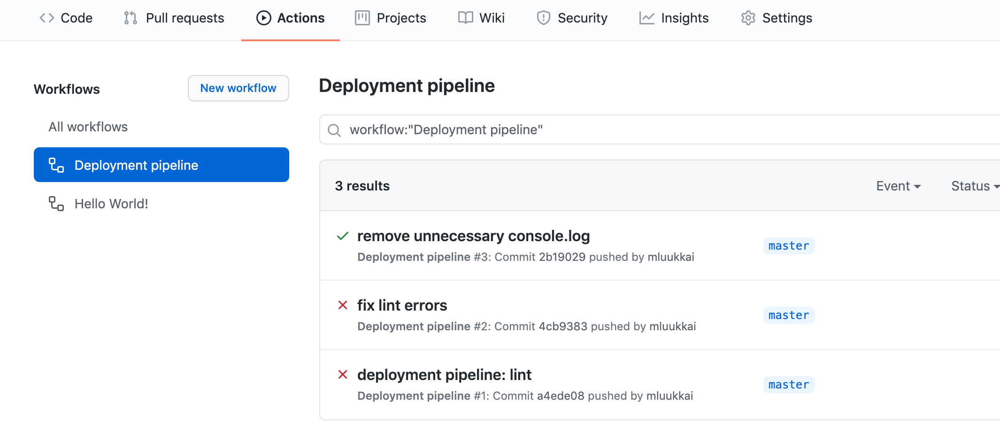
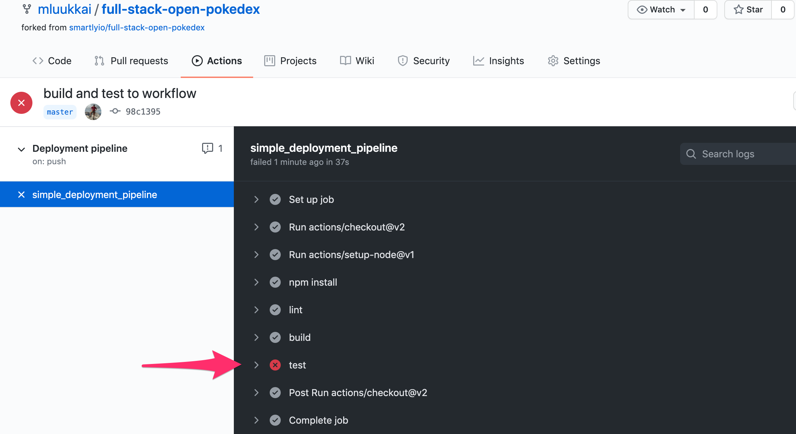
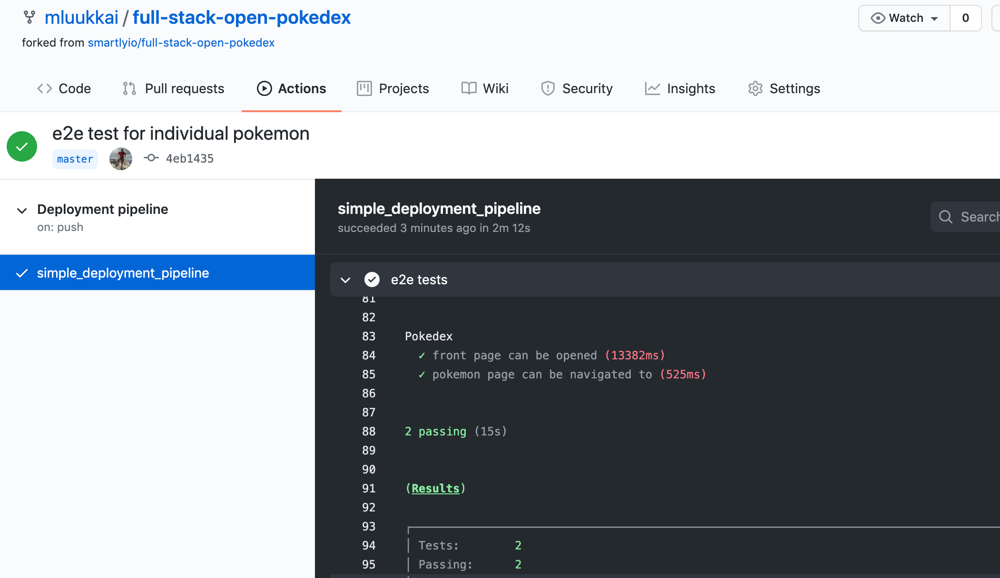

<div class="content">

<!-- Before we start playing with GitHub Actions, let's have a look at what they are and how do they work. -->
在我们开始使用 GitHub Actions 之前，让我们来看看它是什么以及它是如何工作的。

<!-- GitHub Actions work on a basis of [workflows](https://docs.github.com/en/free-pro-team@latest/actions/learn-github-actions/introduction-to-github-actions#workflows). A workflow is a series of [jobs](https://docs.github.com/en/free-pro-team@latest/actions/learn-github-actions/introduction-to-github-actions#jobs) that are run when a certain triggering [event](https://docs.github.com/en/free-pro-team@latest/actions/learn-github-actions/introduction-to-github-actions#events) happens. The jobs that are run then themselves contain instructions for what GitHub Actions should do. -->
GitHub Actions 在工作流[workflows](https://docs.github.com/en/free-pro-team@latest/actions/learn-github-actions/introduction-to-github-actions#workflows)的基础上工作。工作流是在某个触发事件[event](https://docs.github.com/en/free-pro-team@latest/actions/learn-github-actions/introduction-to-github-actions#events)发生时运行的一系列作业[jobs](https://docs.github.com/en/free-pro-team@latest/actions/learn-github-actions/introduction-to-github-actions#jobs)。运行的作业本身包含了 GitHub Actions 应该做什么的指令。

<!-- A typical execution of a workflow looks like this: -->
工作流的典型执行是这样的:

<!-- - Triggering event happens (for example, there is a push to master branch).
- The workflow with that trigger is executed.
- Cleanup -->
- 触发事件发生(例如，有一个push 到 master 的分支)。
- 执行带有该触发器的工作流。
- 清理

### Basic needs
基本需求

<!-- In general, to have CI operate on a repository, we need a few things: -->
一般来说，要让 CI 在一个仓库上运行，我们需要以下几点:

<!-- - A repository (obviously)
- Some definition of what the CI needs to do:
  This can be in the form of a specific file inside the repository or it can be defined in the CI system
- The CI needs to be aware that the repository (and the file within it) exist
- The CI needs to be able to access the repository
- The CI needs permissions to perform the actions it is supposed to be able to do:
  For example, if the CI needs to be able to deploy to a production environment, it needs <i>credentials</i> for that environment. -->

- 代码仓库(显然)
- CI 需要做什么的一些定义:
  可以是代码仓库中特定文件的形式，也可以在 CI 系统中定义
- CI 需要知道代码库(及其中的文件)的存在
- CI 需要能够访问代码库
- CI 需要它能够执行的行动权限:
  例如，如果 CI 需要能够部署到生产环境，则需要该环境的<i>凭证</i>。


<!-- That's the traditional model at least, we'll see in a minute how GitHub Actions short-circuit some of these steps or rather make it such that you don't have to worry about them! -->
这是传统的模式，我们马上就会看到 GitHub Actions 是如何缩短这些步骤的，或者更确切地说，是如何让你不必关心它们的！

<!-- GitHub Actions have a great advantage over self-hosted solutions: the repository is hosted with the CI provider. In other words, Github provides both the repository and the CI platform. This means that if we've enabled actions for a repository, GitHub is already aware of the fact that we have workflows defined and what those definitions look like. -->

GitHub Actions 比自我托管的解决方案有很大的优势: 代码库托管在 CI 提供程序中。换句话说，Github 既提供了代码库，也提供了 CI 平台。这意味着如果我们已经为一个代码库启用了操作，那么 GitHub 已经意识到我们已经定义了工作流以及这些定义是什么样的。


</div>

<div class="tasks">

### Exercise 11.2.

<!-- In most exercises of this part, we are building a CI/CD pipeline for a small project found in [this example project repository](https://github.com/smartlyio/fullstackopen-cicd). -->
在本部分的大多数练习中，我们将为[这个示例项目代码库](https://github.com/smartlyio/fullstackopen-cicd)中的一个小项目构建 CI/CD 管道。


<!-- Note that the code <i>might not work</i> with node version 15. If you happen to have that version, and the project does not even start, please downgrade to 14 or you are on your own.  -->
请注意，该代码可能不适用于版本为15的node。如果你碰巧有那个版本，而且项目还没开始，请自行降级到14。

#### 11.2 the example project

<!-- The first thing you'll want to do is to fork the example repository under your name. What it essentially does is it creates a copy of the repository under your GitHub user profile for your use.  -->
您要做的第一件事情是在您的名字下fork 示例代码库。它实际上做的是在你的 GitHub 用户配置文件下创建一个代码库的副本供你使用。


<!-- To fork the repository, you can click on the Fork button in the top-right area of the repository view next to the Star button: -->
要fork 代码库，您可以单击代码库视图右上角 Star 按钮旁边的 Fork 按钮:


<!-- Once you've clicked on the Fork button, GitHub will start the creation of a new repository called <code>{github_username}/full-stack-open-pokedex</code>. -->
点击 Fork 按钮后，GitHub 将开始创建一个名为<code>{github_username}/full-stack-open-pokedex</code>的新代码库。

<!-- Once the process has been finished, you should be redirected to your brand new repository: -->
一旦这个过程完成，你应该被重定向到你的新仓库:


<!-- Clone the project now to your machine. As always, when starting with a new code, the most obvious place to look first is the file <code>package.json</code>  -->
现在将该项目克隆到您的机器上。和往常一样，当开始一段新代码时，最明显的首选位置是文件 <code>package.json</code>


<!-- Try now the following: -->
现在按照下面的方法:
<!-- - install dependencies (by running <code>npm install</code>)
- start the code in development mode
- run tests
- lint the code  -->
- 安装依赖项(运行<code>npm install</code>)
- 以开发模式启动代码
- 运行测试
- 格式化代码

<!-- You might notice that project contains some broken tests and linting errors. **Just leave them as they are for now.** We will get around those later in the exercises. -->
您可能会注意到，该项目包含一些失败的测试和格式错误。现在就让它们**保持原样吧**。我们将在稍后的练习中讨论这些问题。


<!-- As you might remember from [part 3](/en/part3/deploying_app_to_internet#frontend-production-build), the React code <i>should not</i> be run in development mode once it is deployed in production. Try now the following -->
您可能还记得[第3章](/en/part3/deploying_app_to_internet#frontend-production-build)，React 代码一旦部署到生产环境中，就<i>不应该</i>在开发模式下运行。现在试试下面的方法

<!-- - create a production <i>build</i> of the project
- run the production version locally -->
- <i>build</i>项目的生产版本
- 在本地运行生产版本


<!-- Also for these two tasks, there are ready-made npm scripts in the project! -->
对于这两个任务，项目中还有现成的 npm 脚本！


<!-- Study the structure of the project for a while. As you notice both the frontend and the backend code is now [in the same repository](/en/part7/class_components_miscellaneous#frontend-and-backend-in-the-same-repository). In earlier parts of the course we had a separate repository for both, but having those in the same repository makes things much simpler when setting up a CI environment.  -->
研究一下项目的结构。正如您注意到的那样，前端和后端代码现在都在[同一个代码库中](/zh/part7/class_components_miscellaneous#frontend-and-backend-in-the-same-repository)。在本课程的前面章节，我们为两者都建立了一个单独的代码库，但是在建立一个 CI 环境时，将它们放在同一个代码库中会使事情变得简单得多。

<!-- In contrast to most projects in this course, the frontend code <i>does not use</i> create-react-app, but it has a relatively simple [webpack](/en/part7/webpack) configuration that takes care of creating the development environment and creating the production bundle. -->
与本课程中的大多数项目不同，前端代码不使用 create-react-app，但是它有一个相对简单的 [webpack](/zh/part7/webpack) 配置，用于创建开发环境和创建生产包。

<!-- **One more thing:** in exercise [11-19](/en/part11/expanding_further#exercise-11-19) you will need a <i>Slack webhook URL</i>. If you do not have it already it is better to ask it right away by email matti.luukkainen@helsinki.fi or in course [Telegram](https://t.me/fullstackcourse), ping @mluukkai -->
<!-- 还有一件事: 在练习[11-19](/zh/part11/expanding_further#exercise-11-19)你需要一个 <i>Slack webhook URL</i>。最好是通过电子邮件 matti.luukkainen@helsinhelsinki.fi 或者是 [Telegram](https://t.me/fullstackcourse)中@mluukkai 来询问 -->

</div>

<div class="content">

### Getting started with workflows
开始学习工作流

<!-- The core component of creating CI/CD pipelines with GitHub Actions is something called a [Workflow](https://docs.github.com/en/free-pro-team@latest/actions/learn-github-actions/introduction-to-github-actions#workflows). Workflows are process flows that you can set up in your repository to run automated tasks such as building, testing, linting, releasing, and deploying to name a few! The hierarchy of a workflow looks as follows: -->
使用 GitHub Actions 创建 CI/CD 管道的核心组件叫做工作流(Workflow)。工作流是流程流，您可以在代码库中设置它来运行自动化的任务，比如构建、测试、代码检查、发布和部署等等！工作流程的层次结构如下:

<!-- Workflow -->
工作流

<!-- - Job
  - Step
  - Step
- Job
  - Step -->
- 工作
  - 步骤
  - 步骤
- 工作  
  - 步骤


<!-- Each workflow must specify at least one [Job](https://docs.github.com/en/free-pro-team@latest/actions/learn-github-actions/introduction-to-github-actions#jobs), which contains a set of [Steps](https://docs.github.com/en/free-pro-team@latest/actions/learn-github-actions/introduction-to-github-actions#steps) to perform individual tasks. The jobs will be run in parallel and the steps in each job will be executed sequentially.  -->
每个工作流必须指定至少一个作业[Job](https://docs.github.com/en/free-pro-team@latest/actions/learn-github-actions/introduction-to-github-actions#jobs)，其中包含执行单个任务的一组步骤[Steps](https://docs.github.com/en/free-pro-team@latest/actions/learn-github-actions/introduction-to-github-actions#steps)。作业将并行运行，每个作业中的步骤将按顺序执行。


<!-- Steps can vary from running a custom command to using pre-defined actions, thus the name GitHub Actions. You can create [customized actions](https://docs.github.com/en/free-pro-team@latest/actions/creating-actions) or use any actions published by the community, which are plenty, but let's get back to that later! -->
步骤可以从运行自定义命令到使用预定义的操作不等，因此名为 GitHub Actions。您可以创建自定义操作[customized actions](https://docs.github.com/en/free-pro-team@latest/actions/creating-actions)或使用社区发布的任何操作，这些操作已经足够了，但是我们稍后再回到这个问题！


<!-- For GitHub to recognize your workflows, they must be specified in <code>.github/workflows</code> folder in your repository. Each Workflow is its own separate file which needs to be configured using the <code>YAML</code> data-serialization language. -->
要让 GitHub 识别您的工作流，必须在代码库中创建<code>.github/workflows</code> 文件夹。每个工作流都是它自己的独立文件，需要使用 <code>YAML</code> 这种数据序列化语言来配置它。


<!-- YAML is a recursive acronym for "YAML Ain't Markup Language". As the name might hint its goal is to be human-readable and it is commonly used for configuration files. You will notice below that it is indeed very easy to understand! -->
YAML 是“YAML Ain't Markup Language”的递归缩写。正如其名称暗示的那样，它的目标是人类可读性，通常用于配置文件。你会在下面注意到，它确实很容易理解！

<!-- Notice that indentations are important in YAML. You can learn more about the syntax [here](https://docs.ansible.com/ansible/latest/reference_appendices/YAMLSyntax.html). -->
注意，在 YAML 中缩进是很重要的。您可以在[这里](https://docs.ansible.com/ansible/latest/reference_appendices/YAMLSyntax.html)了解更多关于语法的信息。

<!-- A basic workflow contains three elements in a YAML document. These three elements are: -->
基本工作流在 YAML 文档中包含三个元素，这三个元素是:


<!-- - name: Yep, you guessed it, the name of the workflow
- (on) triggers: The events that trigger the workflow to be executed
- jobs: The separate jobs that the workflow will execute (a basic workflow might contain only one job). -->
- 名称: 是的，你猜对了，工作流的名称
- (on) triggers: 触发要执行工作流的事件
- 作业: 工作流将执行的单独作业(基本工作流可能只包含一个作业)。


<!-- A simple workflow definition looks like this: -->
一个简单的工作流定义如下:

```yml
name: Hello World!

on:
  push:
    branches:
      - master

jobs:
  hello_world_job:
    runs-on: ubuntu-18.04
    steps:
      - name: Say hello
        run: |
          echo "Hello World!"
```

<!-- In this example, the trigger is a push to the master branch. There is one job named <i>hello\_world\_job</i>, it will be run in a virtual environment with Ubuntu 18.04. The job has just one step named "Say hello", which will run the <code>echo "Hello World!"</code> command in the shell. -->

在这个示例中，触发器是master分支的push。有一个工作叫 <i>hello\_world\_job</i>，它将在 Ubuntu 18.04的虚拟环境中运行。这个作业只有一个名为“ Say Hello”的步骤，它将在shell中运行 <code>echo "Hello World!"</code> 命令。

<!-- So you may ask, when does GitHub trigger a workflow to be started? There are plenty of [options](https://docs.github.com/en/free-pro-team@latest/actions/reference/events-that-trigger-workflows) to choose from, but generally speaking, you can configure a workflow to start once: -->
所以你可能会问，GitHub 什么时候触发工作流启动？有很多选项可供[选择](https://docs.github.com/en/free-pro-team@latest/actions/reference/events-that-trigger-workflows) ，但是一般来说，你可以配置一个工作流来启动一次:


<!-- - An <i>event on GitHub</i> occurs such as when someone pushes a commit to a repository or when an issue or pull request is created -->
<!-- - A <i>scheduled event</i>, that is specified using the [cron]( https://en.wikipedia.org/wiki/Cron)-syntax, happens -->
<!-- - An <i>external event</i> occurs, for example, a command is performed in an external application such as [Slack](https://slack.com/) messaging app -->

- GitHub 上会发生一些<i>事件</i>，比如有人向代码库push了一个提交，或者创建了一个issue或者PR
- 使用 [cron]( https://en.wikipedia.org/wiki/Cron) 语法指定的计划事件发生
- 发生<i>外部事件</i>，例如，在外部应用程序(如 Slack 消息应用程序)中执行命令


<!-- To learn more about which events can be used to trigger workflows, please refer to GitHub Action's [documentation](https://docs.github.com/en/free-pro-team@latest/actions/reference/events-that-trigger-workflows). -->
要了解哪些事件可以用来触发工作流，请参考 GitHub Action 的文档[documentation](https://docs.github.com/en/free-pro-team@latest/actions/reference/events-that-trigger-workflows)。

</div>

<div class="tasks">

### Exercises 11.3-11.4.

<!-- To tie this all together, let us now get Github Actions up and running in the example project! -->
为了将所有这些联系在一起，现在让我们在示例项目中启动并运行 Github Actions！

#### 11.3 Hello world!

<!-- Create a new Workflow which outputs "Hello World!" to the user. For the setup, you should create the directory <code>.github/workflows</code> and a file <code>hello.yml</code> to your repository. -->
创建一个输出“ Hello World! ”的新工作流。关于设置，您应该创建<code>.github/workflows</code> 目录和一个 <code>hello.yml</code>  文件到您的代码库。

<!-- To see what your GitHub Action workflow has done, you can navigate to the **Actions** tab in GitHub where you should see the workflows in your repository and the steps they implement. The output of your Hello World workflow should look something like this with a properly configured workflow. -->
要查看你的 GitHub Action 工作流做了什么，你可以导航到 GitHub 的 **Actions** 选项卡，在那里你可以看到你仓库中的工作流以及它们实现的步骤。Hello World 工作流的输出应该类似于这样，并配置了正确的工作流。


<!-- You should see the "Hello World!" message as an output. If that's the case then you have successfully gone through all the necessary steps. You have your first GitHub Actions workflow active!  -->
您应该看到“ Hello World! ”消息作为输出。如果是这样的话，那么你已经成功地完成了所有必要的步骤。你的第一个 GitHub 动作工作流是运转正常的！

<!-- Note that GitHub Actions also gives you information what is the exact environment (operating system, and it's [setup](https://github.com/actions/virtual-environments/blob/ubuntu18/20201129.1/images/linux/Ubuntu1804-README.md)) where your workflow is run. This is important since if something surprising happens, it makes debugging so much easier if you can reproduce all the steps in your machine! -->
注意，GitHub Actions 还向您提供了运行工作流的确切环境(操作系统及其设置[setup](https://github.com/actions/virtual-environments/blob/ubuntu18/20201129.1/images/linux/Ubuntu1804-README.md))的信息。这一点非常重要，因为如果发生了意料之外的事情，如果能够在机器中重复所有步骤，那么调试就会变得非常容易！


#### 11.4 date and directory contents
日期和目录内容

<!-- Extend the workflow with steps that print the date and current directory content in long format.  -->
使用长格式打印日期和工作目录内容的步骤扩展工作流。

<!-- Both of these are easy steps, and just running commands [date](https://man7.org/linux/man-pages/man1/date.1.html) and [ls](https://man7.org/linux/man-pages/man1/ls.1.html) will do the trick. -->
这两个步骤都很简单，只需运行命令  [date](https://man7.org/linux/man-pages/man1/date.1.html) 和 [ls](https://man7.org/linux/man-pages/man1/ls.1.html) 即可。


<!-- Your workflow should now look like this -->
您的工作流现在应该是这样的


<!-- As the output of command <code>ls -l</code> shows, by default, the virtual environment that runs our workflow <i>does not</i> have any code! -->
如命令 <code>ls -l</code> 的输出所示，默认情况下，运行我们的工作流的虚拟环境无需任何代码！
</div>

<div class="content">

### Setting up lint, test and build steps  
设置 lint、测试和构建步骤

<!-- After completing the first exercises, you should have a simple but pretty useless workflow set up. Let's make our workflow do something useful. -->
在完成第一个练习之后，您应该建立了一个简单但相当无用的工作流程。让我们让我们的工作流做些有用的事情。

<!-- Let's implement a Github Action that will lint the code. If the checks don't pass, Github Actions will show a red status.  -->
让我们实现一个 Github Action，它将检查代码。如果检查没有通过，Github Actions 将显示一个红色状态。


<!-- At start, the workflow that we will save to file <code>pipeline.yml</code> looks like this: -->
一开始，我们将保存到文件 <code>pipeline.yml</code> 的工作流程如下:

```js
name: Deployment pipeline

on:
  push:
    branches:
      - master

jobs:
```

<!-- Before we can run a command to lint the code, we have to perform a couple of actions to set up the environment of the job. -->
在我们可以运行命令来检查代码之前，我们必须执行几个操作来设置作业的环境。

#### Setting up the environment
搭建环境

<!-- Setting up the environment is an important task while configuring a pipeline. We're going to use an <code>ubuntu-18.04</code> virtual environment because this is the version of Ubuntu we're going to be running in production.  -->
设置环境是配置工作流时的一项重要任务。我们将使用一个 <code>ubuntu-18.04</code>虚拟环境，因为这是我们将在生产环境中运行的 Ubuntu 版本。

<!-- It is important to replicate the same environment in CI as in production as closely as possible, to avoid situations where the same code works differently in CI and production, which would effectively defeat the purpose of using CI. -->
重要的是在 CI 中尽可能复制与生产相同的环境，以避免出现同一代码在 CI 和生产中工作方式不同的情况，这将极大破坏使用 CI 的目的。

<!-- Next, we list the steps in the "build" job that the CI would need to perform. As we noticed in the last exercise, by default the virtual environment does not have any code in it, so we need to <i>checkout the code</i> from the repository.  -->
接下来，我们列出 CI 需要执行的“构建”作业中的步骤。正如我们在上一个练习中注意到的，默认情况下，虚拟环境中没有任何代码，因此我们需要从代码库中<i>检出代码</i>。

<!-- This an easy step: -->
这是一个简单的步骤:

```js
name: Deployment pipeline

on:
  push:
    branches:
      - master

jobs:
  simple_deployment_pipeline: // highlight-line
    runs-on: ubuntu-18.04 // highlight-line
    steps: // highlight-line
      - uses: actions/checkout@v2  // highlight-line
```

<!-- The [uses](https://docs.github.com/en/free-pro-team@latest/actions/reference/workflow-syntax-for-github-actions#jobsjob_idstepsuses) keyword tells the workflow to run a specific <i>action</i>. An action is a reusable piece of code, like a function. Actions can be defined in your repository in a separate file or you can use the ones available in public repositories.  -->
[uses](https://docs.github.com/en/free-pro-team@latest/actions/reference/workflow-syntax-for-github-actions#jobsjob_idstepsuses) 关键字告诉工作流程运行特定的<i>操作</i>。操作是一段可重用的代码，就像函数一样。可以在代码库中的单独文件中定义操作，也可以使用公共代码库中可用的操作。

<!-- Here we're using a public action [actions/checkout](https://github.com/actions/checkout) and we specify a version (<code>@v2</code>) to avoid potential breaking changes if the action gets updated. The <code>checkout</code> action does what the name implies: it checkouts the project source code from git. -->
在这里，我们使用一个公共动作[actions/checkout](https://github.com/actions/checkout) ，并指定一个版本(<code>@v2</code>) ，以避免动作更新时可能发生的中断更改。<code>checkout</code> 操作实现了它的名字所暗示的功能: 它从 git 签出项目源代码。


<!-- Secondly, as the application is written in JavaSript, Node.js must be set up to be able to utilize the commands that are specified in <code>package.json</code>. To set up Node.js, [actions/setup-node](https://github.com/actions/setup-node) action can be used. Version <code>12.x</code> is selected because it is the version the application is using in the production environment. -->
第二步，由于应用程序是用 JavaSript 编写的，Node.js 必须能够使用 <code>package.json</code> 中指定的命令。要设置 Node.js，可以使用[actions/setup-node](https://github.com/actions/setup-node) action。选择<code>12.x 版本</code> 是因为它是应用程序在生产环境中使用的版本。


```js
# name and trigger not shown anymore...

jobs:
  simple_deployment_pipeline:
    runs-on: ubuntu-18.04
    steps:
      - uses: actions/checkout@v2
      - uses: actions/setup-node@v1 // highlight-line
        with: // highlight-line
          node-version: '12.x' // highlight-line
```

<!-- As we can see, the [with](https://docs.github.com/en/free-pro-team@latest/actions/reference/workflow-syntax-for-github-actions#jobsjob_idstepswith) keyword is used to give a "parameter" to the action. Here the parameter specifies the version of Node.js we want to use. -->
正如我们所看到的，[with](https://docs.github.com/en/free-pro-team@latest/actions/reference/workflow-syntax-for-github-actions#jobsjob_idstepswith) 关键字用于为动作提供一个“参数”。这里的参数指定了我们想要使用的 Node.js 版本。


<!-- Lastly, the dependencies of the application must be installed. Just like on your own machine we execute <code>npm install</code>. The steps in the job should now look something like -->
最后，必须安装应用程序的依赖项。就像我们在您自己的机器上执行 <code>npm install</code>一样。这项工作的步骤现在应该看起来如下：


```js
jobs:
  simple_deployment_pipeline:
    runs-on: ubuntu-18.04
    steps:
      - uses: actions/checkout@v2
      - uses: actions/setup-node@v1
        with:
          node-version: '12.x'
      - name: npm install  // highlight-line
        run: npm install  // highlight-line
```

<!-- Now the environment should be completely ready for the job to run actual important tasks in! -->
现在环境应该已经完全准备好了，可以在其中运行实际的重要任务了！

#### Lint
代码检查

<!-- After the environment has been set up we can run all the scripts from <code>package.json</code> like we would on our own machine. To lint the code all you have to do is add a step to run the <code>npm run eslint</code> command. -->
在环境设置好之后，我们可以像在自己的机器上那样运行<code>package.json</code> 中的所有脚本。要代码检查，只需要添加一个步骤来运行 <code>npm run eslint</code> 命令。


```js
jobs:
  simple_deployment_pipeline:
    runs-on: ubuntu-18.04
    steps:
      - uses: actions/checkout@v2
      - uses: actions/setup-node@v1
        with:
          node-version: '12.x'
      - name: npm install 
        run: npm install  
      - name: lint  // highlight-line
        run: npm run eslint // highlight-line
```

</div>

<div class="tasks">

### Exercises 11.5.-11.9.

#### 11.5 Linting workflow

<!-- Implement or <i>copy-paste</i> the "Lint" workflow and commit it to the repository. Use a new <i>yml</i> file for this workflow, you may call it e.g. <i>pipeline.yml</i>. -->
实现或<i>复制粘贴</i>“Lint”工作流并将其提交到代码库。对这个工作流使用一个新的 <i>yml</i> 文件，你可以称之为 <i>pipeline.yml</i>。


<!-- Push your code and navigate to "Actions" tab and click on your newly created workflow on the left. You should see that the workflow run has failed: -->
push您的代码并导航到“Actions”标签，然后点击左侧新创建的工作流。您应该看到工作流运行失败:



#### 11.6 Fix the code
修复代码

<!-- There are some issues with the code that you will need to fix. Open up the workflow logs and investigate what is wrong. -->
您需要修复代码中的一些问题。打开工作流日志，调查问题所在。

<!-- A couple of hints. One of the errors is best to be fixed by specifying proper <i>env</i> for linting, see [here](/en/part3/validation_and_es_lint#lint) how it can be done . One of the complaints concerning <code>console.log</code> statement could be taken care of by simply silencing the rule for that specific line. Ask google how to do it. -->
有一些提示。其中一个错误最好通过为 linting 指定适当的<i>env</i> 来修复，看看[这里](/zh/part3/validation_and_es_lint#lint)是如何做的。关于<code>console.log</code> 语句的一个抱怨可以通过简单地沉默该特定行的规则来解决。可以问问 google 如何做到这一点。

<!-- Make the necessary changes to the source code so that the lint workflow passes. Once you commit new code the workflow will run again and you will see updated output where all is green again: -->
对源代码进行必要的更改，以便通过 lint 工作流。一旦你提交了新的代码，工作流程将再次运行，你会看到更新的输出，其中所有又是绿色的:



#### 11.7 Building and testing
构建和测试

<!-- Let's expand on the previous workflow that currently does the linting of the code. Edit the workflow and similarly to the lint command add commands for build and test. After this step outcome should look like this -->
让我们扩展一下当前执行代码检查的前一个工作流。编辑工作流类似于 lint 命令 add 命令的生成和测试命令。这一步之后的结果应该是这样的



<!-- As you might have guessed, there are some problems in code... -->
正如您可能已经猜到的，代码中存在一些问题..。

#### 11.8 Back to green
返回绿色

<!-- Investigate which test fails and fix the issue in the code (do not change the tests). -->
调查哪个测试失败并修复代码中的问题(不要更改测试)。

<!-- Once you have fixed all the issues and the Pokedex is bug-free, the workflow run will succeed and show green! -->
一旦你解决了所有的问题并且 Pokedex 没有 bug，工作流将会成功运行并且显示绿色！


#### 11.9 Simple end to end -tests
简单的端到端测试

<!-- The current set of tests use [jest](https://jestjs.io/) to ensure that the React components work as intended. This is exactly the same thing that is done in section [Testing React apps](/en/part5/testing_react_apps) of part 5.  -->
当前的测试集使用 [jest](https://jestjs.io/) 来确保 React 组件按预期的方式工作。这和第5章[测试 React 应用](/zh/part5/testing_react_apps)一模一样。

<!-- Testing components in isolation is quite useful but that still does not ensure that the system as a whole works as we wish. To have more confidence about this, let us write a couple of really simple end to end -tests with the [Cypress](https://www.cypress.io/) library simillarly what we do in section [End to end -testing](/en/part5/end_to_end_testing) of part 5.  -->
隔离测试组件是非常有用的，但是这仍然不能确保系统作为一个整体按照我们希望的那样工作。为了对此有更多的信心，让我们用 [Cypress](https://www.cypress.io/) 库简单地编写几个非常简单的端到端测试，就像我们在第5部分的 [End-To-End 测试](/zh/part5/end_to_end_testing)一样。


<!-- So, setup cypress (you'll find [here](/en/part5/end_to_end_testing/) all info you need) and use this test at first: -->
因此，设置 cypress (你可以在[这里](/zh/part5/end_to_end_testing/)找到所有你需要的信息) ，并首先使用这个测试:

```js
describe('Pokedex', function() {
  it('front page can be opened', function() {
    cy.visit('http://localhost:5000')
    cy.contains('ivysaur')
    cy.contains('Pokémon and Pokémon character names are trademarks of Nintendo.')
  })
})
```

<!-- Define a npm script <code>test:e2e</code> for running the e2e tests from the command line. -->
定义一个 npm 脚本 <code>test:e2e</code> 用于从命令行运行 e2e 测试。

<!-- **Note** do not include the word <i>spec</i> in the cypress test file name, that would cause also jest to run it, and it might cause problems.  -->
**请注意**，在cypress测试文件名中不要包含 <i>spec</i> 这个词，否则也会导致jest运行它，并且可能会导致问题。


<!-- **Another thing to note** is that despite the page renders the Pokemon names by starting with a capital letter, the names are actually written with lower case letters in the source, so it is <code>ivysaur</code> instead of <code>Ivysaur</code>! -->
另外需要注意的是，尽管这个页面以大写字母开头呈现了口袋妖怪的名字，但是这些名字实际上是以小写字母书写的，所以它是<code>ivysaur</code>而不是<code>Ivysaur</code>！

<!-- Ensure that the test passes locally. Remember that the cypress tests _assume that the application is up and running_ when you run the test! If you have forgotten the details (that happened to me too!), please see [part 5](/en/part5/end_to_end_testing) how to get up and running with cypress. -->
确保测试在本地通过。请记住，cypress 测试 _假定在运行测试时应用程序已经启动并正在运行_ ！如果你已经忘记了细节(这也发生在我身上!)，请参阅 [第5章](/zh/part5/end_to_end_testing) 如何使用 cypress。

<!-- Once the end to end test works in your machine, include it in the GitHub Action workflow. By far the easiest way to do that is to use the ready-made action [cypress-io/github-action](https://github.com/cypress-io/github-action). The step that suits us is the following: -->
一旦端到端测试在你的机器上运行，将其包含在 GitHub Action 工作流中。到目前为止，最简单的方法是使用现成的[cypress-io/github-action](https://github.com/cypress-io/github-action)。适合我们的步骤如下:


```js
- name: e2e tests
  uses: cypress-io/github-action@v2
  with:
    command: npm run test:e2e
    start: npm run start-prod
    wait-on: http://localhost:5000
```

<!-- Three options are used. [command](https://github.com/cypress-io/github-action#custom-test-command) specifies how to run cypress tests. [start](https://github.com/cypress-io/github-action#start-server) gives npm script that starts the server and [wait-on](https://github.com/cypress-io/github-action#wait-on) says that before the tests are run, the server should have started in url <http://localhost:5000>. -->
我们使用了三种选项。[command](https://github.com/cypress-io/github-action#custom-test-command)指定如何运行 cypress 测试。[start](https://github.com/cypress-io/github-action#start-server)  提供的 npm 脚本启动服务器，[wait-on](https://github.com/cypress-io/github-action#wait-on)说在测试运行之前，服务器应该在 url <http://localhost:5000> 中启动。


<!-- Once you are sure that the pipeline works, write another test that ensures that one can navigate from the main page to the page of a particular Pokemon, e.g. <i>ivysaur</i>. The test does not need to be a complex one, just check that when you navigate a link, the page has some right content, such as the string <i>chlorophyll</i> in the case of <i>ivysaur</i>. -->
一旦确定工作流工作正常，编写另一个测试，确保可以从主页导航到特定的 Pokemon 页面，例如 <i>ivysaur</i>。这个测试不需要很复杂，只需要检查当你浏览一个链接时，页面有一些正确的内容，比如 <i>ivysaur</i> 中的 <i>chlorophyll</i> 字符串。

<!-- **Note** that you should not try <i>bulbasaur</i>, for some reason the page of that particular Pokemon does not work properly... -->
请注意，您不应该尝试 <i>bulbasaur</i>，由于某些原因，该特定的口袋妖怪网页不能正常工作..

<!-- The end result should be something like this -->
最终的结果应该是这样的



<!-- End to end -tests are nice since they give us confidence that software works from the end user's perspective. The price we have to pay is the slower feedback time. Now executing the whole workflow takes quite much longer. -->
端到端测试很好，因为它们让我们相信软件是从最终用户的角度工作的。我们必须付出的代价是反馈时间变慢。现在执行整个工作流需要更长的时间。

</div>