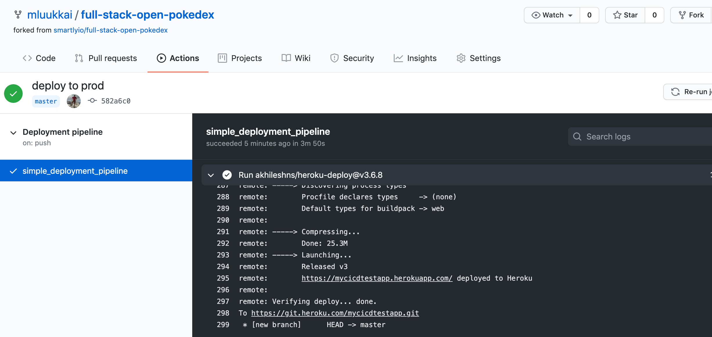
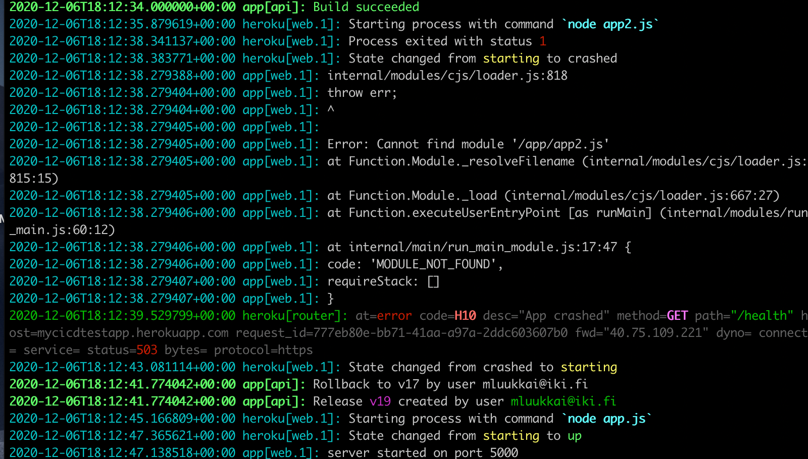

<div class="content">

Having written a nice application it's time to think about how we're going to deploy it to the use of real users. 
编写了一个漂亮的应用程序之后，现在是时候考虑如何将其部署到真实用户的使用中了。

In [part 3](/en/part3/deploying_app_to_internet) of this course, we did this by simply <i>pushing the git repository</i> to the servers of the cloud provider [Heroku](https://www.heroku.com/home). It is pretty simple to release software in Heroku at least compared to many other types of hosting setups but it still contains risks: nothing prevents us from accidentally pushing broken code to production.
在本课程的 [第3章节](/en/part3/deploying_app_to_internet)中，我们通过将 git 代码库推送到云提供商  [Heroku](https://www.heroku.com/home) 的服务器来实现这一点。在 Heroku 发布软件是相当简单的，至少与其他类型的托管设置相比是这样的，但是它仍然存在风险: 没有什么可以阻止我们粗心把坏掉的代码推向生产环境。


Next, we're going to look at the principles of making a deployment safely and some of the principles of deploying software on both a small and large scale. 
接下来，我们将研究安全部署的原则，以及在小规模和大规模上部署软件的一些原则。

### Anything that can go wrong...
任何事情都可能出错...

We'd like to define some rules about how our deployment process should work but before that, we have to look at some constraints of reality.
我们想要定义一些关于我们的部署过程应该如何工作的规则，但在此之前，我们必须考虑一些现实的约束。

One on the phrasing of Murphy's Law holds that:
  "Anything that can go wrong will go wrong."
关于墨菲定律，有一种说法是:
“任何可能出错的事情都会出错。”

It's important to remember this when we plan out our deployment system. Some of the things we'll need to consider could include:
在计划部署系统时，记住这一点很重要。我们需要考虑的事情包括:

 - What if my PC crashes or hangs during deployment?
 - I'm connected to the server and deploying over the internet, what happens if my internet connection dies?
 - What happens if any specific instruction in my deployment script/system fails?
 - What happens if, for whatever reason, my software doesn't work as expected on the server I'm deploying to? Can I roll back to a previous version?
 - What happens if a user does an HTTP request to our software just before we do deployment (we didn't have time to send a response to the user)?

- 如果我的电脑在部署期间崩溃或挂起怎么办？
- 我已经连接到服务器并通过互联网部署了，如果我的互联网连接中断了怎么办？
- 如果部署脚本/系统中的任何特定指令失败，会发生什么情况？
- 如果出于某种原因，我的软件在我要部署的服务器上不能正常工作会发生什么？我可以回滚到以前的版本吗？
- 如果用户在部署之前对我们的软件发出 HTTP 请求(我们没有时间向用户发送响应) ，会发生什么情况？


These are just a small selection of what can go wrong during a deployment, or rather, things that we should plan for. Regardless of what happens, our deployment system should **never** leave our software in a broken state. We should also always know (or be easily able to find out) what state a deployment is in.
这些只是部署过程中可能出错的一小部分，或者更确切地说，是我们应该计划的一些事情。无论发生什么情况，我们的部署系统都**不应该**让我们的软件处于崩溃状态。我们还应该总是知道(或者很容易找到)部署处于什么状态。

Another important rule to remember when it comes to deployments (and CI in general) is:
  "Silent failures are **very** bad!"
当涉及到部署(以及一般的 CI)时，另一个需要记住的重要规则是:
“无声的失败是**非常**糟糕的! ”

This doesn't mean that failures need to be shown to the users of the software, it means we need to be aware if anything goes wrong. If we are aware of a problem, we can fix it, if the deployment system doesn't give any errors but fails, we may end up in a state where we believe we have fixed a critical bug but the deployment failed, leaving the bug in our production environment and us unaware of the situation.
这并不意味着故障需要显示给软件的用户，而是意味着我们需要知道是否有任何错误。如果我们意识到一个问题，我们可以修复它，如果部署系统没有提供任何错误，但是失败了，我们可能最终处于这样一种状态，我们认为我们已经修复了一个关键的错误，但是部署失败了，使得我们的生产环境中包含了bug，而我们没有意识到这种情况。


### What does a good deployment system do?
一个好的部署系统能做什么？

Defining definitive rules or requirements for a deployment system is difficult, let's try anyway:
为部署系统定义明确的规则或需求是困难的，不管怎样，让我们尝试一下:

 - Our deployment system should be able to fail gracefully at **any** step of the deployment.
 - Our deployment system should **never** leave our software in a broken state.
 - Our deployment system should let us know when a failure has happened. It's more important to notify about failure than about success.
 - Our deployment system should allow us to roll back to a previous deployment
   - Preferably this rollback should be easier to do and less prone to failure than a full deployment
   - Of course, the best option would be an automatic rollback in case of deployment failures
 - Our deployment system should handle the situation where a user makes an HTTP request just before/during a deployment.
 - Our deployment system should make sure that the software we are deploying meets the requirements we have set for this (e.g. don't deploy if tests haven't been run).
- 我们的部署系统应该能够在部署的**任何**步骤中优雅地失败。
- 我们的部署系统**绝不**应该让我们的软件处于崩溃状态。
- 我们的部署系统应该让我们知道什么时候发生故障。通知失败比通知成功更重要。
- 我们的部署系统应该允许我们回滚到以前的部署
- 与全面部署相比，这种回滚最好更容易做，更不容易失败
- 当然，最好的选择是在部署失败时自动回滚
- 我们的部署系统应该处理用户在部署之前/期间发出 HTTP 请求的情况。
- 我们的部署系统应该确保我们正在部署的软件符合我们为此设置的要求(例如，如果没有运行测试，就不要部署)。


Let's define some things we **want** in this hypothetical deployment system too:
让我们在这个假设的部署系统中定义一些我们**想要**的东西:

 - We would like it to be fast
 - We'd like to have no downtime during the deployment (this is distinct from the requirement we have for handling user requests just before/during the deployment).
 - 我们希望能快点
- 我们希望在部署期间没有停机时间(这与我们在部署之前/部署期间处理用户请求的要求不同)。


</div>

<div class="tasks">

### Exercises 11.10-11.12.

Before going to the below exercises, you should setup your application in Heroku environment like the one we did in [part 3](/en/part3/deploying_app_to_internet#application-to-the-internet).

在进行下面的练习之前，你应该像我们在[第3章](/zh/part3/deploying_app_to_internet#application-to-the-internet)所做的那样在 Heroku 环境中设置你的应用程序。


In contrast to part 3 now we <i>do not push the code</i> to Heroku ourselves, we let the Github Actions workflow do that for us!
与第3章相比，现在我们<i>不会自己将代码推送到 Heroku</i>，而是让 Github 的 action 工作流为我们完成这个任务！


Ensure now that you have [Heroku CLI](https://devcenter.heroku.com/articles/heroku-cli#download-and-install) installed and login to Heroku using the CLI with <code>heroku login</code>.
确保现在已经安装了  [Heroku CLI](https://devcenter.heroku.com/articles/heroku-cli#download-and-install)，并使用 <code>heroku login</code> 的 CLI 登录到 Heroku。

Create a new app in Heroku using the  CLI: <code>heroku create --region eu {your\_app\_name}</code>, pick a [region](https://devcenter.heroku.com/articles/regions) close to your own location!
使用 CLI: <code>heroku create --region eu {your\_app\_name}</code> 在 Heroku 创建一个新的应用程序，选择一个靠近你定位的地区！

Generate an API token for your Heroku profile using command <code>heroku authorizations:create</code>, and save the credentials to a local file but <i>**do not push those to GitHub**</i>!
使用 <code>heroku authorizations:create</code> 命令为您的 Heroku 配置文件生成一个 API 令牌，并将凭证保存到本地文件中，但是<i>不要将这些文件推送到 GitHub</i>！

You'll need the token soon for your deployment workflow. See more information at about Heroku tokens [here](https://devcenter.heroku.com/articles/platform-api-quickstart).
您很快就会需要这个令牌用于您的部署工作流程。关于Heroku 令牌的更多信息参考[这里](https://devcenter.heroku.com/articles/platform-api-quickstart)

#### 11.10 Deploying your application to Heroku
将应用程序部署到 Heroku

Extend the workflow with a step to deploy your application to Heroku.
通过将应用程序部署到 Heroku 的步骤扩展工作流。

The below assumes that you use the ready-made Heroku deploy action [AkhileshNS/heroku-deploy](https://github.com/AkhileshNS/heroku-deploy) that has been developed by the community.
下面假设您使用社区开发的现成的 Heroku 部署操作 [AkhileshNS/heroku-deploy](https://github.com/AkhileshNS/heroku-deploy)。

You need the autorization token that you just created for the deployment. The proper way to pass it's value to GitHub Actions is to use repository secrets:
您需要刚刚为部署创建的自动化标记。将它的值传递给 GitHub Actions 的正确方法是使用代码库 secrets:


Now the workflow can access the token value as follows:
现在工作流可以如下方式访问令牌值:

```
${{secrets.HEROKU_API_KEY}}
```

If all goes well, your workflow log should look a bit like this:
如果一切顺利，你的工作流日志应该是这样的:




You can then try the app with a browser, but most likely you run into a problem. If we read carefully [the section 'Application to the Internet' in part 3](/en/part3/deploying_app_to_internet#application-to-the-internet) we notice that Heroku assumes that the repository has a file called <i>Procfile</i> that tells Heroku how to start the application. 
然后你可以用浏览器试用这个应用程序，但是很可能你会遇到一个问题。如果我们仔细阅读第3章节中的‘[应用程序到互联网](/zh/part3/deploying_app_to_internet#application-to-the-internet) ’一节，我们会注意到 Heroku 假设代码库中有一个名为 <i>Procfile</i> 的文件，它告诉 Heroku 如何启动应用程序。

So, add a proper Procfile and ensure that the application starts properly. 
因此，添加适当的 Procfile 并确保应用程序正常启动。

**Remember** that it is always essential to keep an eye on what is happening in server logs when playing around with product deployments, so use <code>heroku logs</code> early and use it often. No, use it all the time!
**请记住**，在使用产品部署时，始终关注服务器日志中发生的情况是非常重要的，因此尽早使用<code>heroku logs</code> 并经常使用它。不，一直用吧！

#### 11.11 Health check
健康检查

Before moving on let us expand the workflow with one more step, a check that ensures that the application is up and running after the deployment. 
在继续之前，让我们再扩展一步工作流，这是一个确保应用程序在部署之后启动并运行的检查。

Actually a separate workflow step is not needed, since the action
[deploy-to-heroku](https://github.com/marketplace/actions/deploy-to-heroku) contains an option that takes care of it.
实际上，不需要单独的工作流步骤，因为操作[deploy-to-heroku](https://github.com/marketplace/actions/deploy-to-heroku) 包含一个选项，可以解决这个问题。

Add a simple endpoint for doing an application health check to the backend. You may e.g. copy this code:
在后端添加一个简单的端点用于进行应用程序的健康检查:


```js
app.get('/health', (req, res) => {
  res.send('ok')
})
```

It might also be a good idea to have a dummy endpoint in the app that makes it possible to do some code changes and to ensure that the deployed version has really changed:
在应用程序中设置一个虚拟端点也许是个不错的主意，这样可以进行一些代码修改，并确保部署的版本真的发生了改变:

```js
app.get('/version', (req, res) => {
  res.send('1') // change this string to ensure a new version deployed
})
```

Look now from the [documentation](https://github.com/marketplace/actions/deploy-to-heroku) how to include the health check in the deployment step. Use the created endpoint for the health check url. You most likely need also the <i>checkstring</i> option to get the check working.
现在从[文档](https://github.com/marketplace/actions/deploy-to-heroku)中了解如何在部署步骤中包含健康检查。使用为健康检查 url 创建的端点。您很可能还需要检查字符串选项来使检查工作。


Ensure that Actions notices if a deployment breaks your application. You may simulate this e.g. by writing a wrong startup command to Procfile:
如果部署中断了应用程序，请确保 Actions 会发现。你可以模拟这种情况，比如在 Procfile 中写错启动命令:


Before moving to next exercise, fix your deployment and ensure that the application works again as intended.
在进入下一个练习之前，修复您的部署，并确保应用程序再次按预期的方式工作。


#### 11.12. Rollback
回滚

If the deployment results in a broken application, the best thing to do is to <i>roll back</i> to the previous release. Luckily Heroku makes this pretty easy. Every deployment to Heroku results in a [release](https://blog.heroku.com/releases-and-rollbacks#releases). You can see your application's releases with the command <code>heroku releases</code>:
如果部署导致应用程序崩溃，最好的办法是<i>回滚</i>到前一个版本。幸运的是，Heroku 很容易做到这一点。在 Heroku 的每一次部署都会导致一次发布[release](https://blog.heroku.com/releases-and-rollbacks#releases)。你可以通过 heroku 发布的命令看到你的应用程序的发布:


```js
$ heroku releases
=== cicdtest222 Releases - Current: v29
v29  Deploy 7fff7150  mluukkai@iki.fi  2020/12/05 18:22:32 +0200
v28  Deploy 764c37d4  mluukkai@iki.fi  2020/12/05 18:09:04 +0200
v27  Deploy 1467d514  mluukkai@iki.fi  2020/12/05 16:28:52 +0200
v26  Deploy ec0ea68b  mluukkai@iki.fi  2020/12/05 15:39:31 +0200
v25  Deploy a8a88aff  mluukkai@iki.fi  2020/12/05 15:34:55 +0200
v24  Deploy d0f3ae58  mluukkai@iki.fi  2020/12/05 15:31:45 +0200
v23  Deploy a348f651  mluukkai@iki.fi  2020/12/05 15:28:19 +0200
v22  Deploy 254d24d4  mluukkai@iki.fi  2020/12/05 14:27:33 +0200
v21  Deploy 950f5403  mluukkai@iki.fi  2020/12/05 14:24:44 +0200
v20  Deploy 9d51da28  mluukkai@iki.fi  2020/12/05 14:22:20 +0200
```

One can quickly do a [rollback](https://blog.heroku.com/releases-and-rollbacks#rollbacks) to a release with just a single command from commandline. 
只需从命令行中执行一个命令，就可以快速地回滚[rollback](https://blog.heroku.com/releases-and-rollbacks#rollbacks)到发布版本。

What is even better, is that the action [deploy-to-heroku](https://github.com/marketplace/actions/deploy-to-heroku) can take care of the rollback for us!
更好的是，action [deploy-to-heroku](https://github.com/marketplace/actions/deploy-to-heroku) 可以为我们解决回滚问题！


So read again the [documentation](https://github.com/marketplace/actions/deploy-to-heroku) and modify the workflow to prevent a broken deployment altogether. You can again simulate a broken deployment with breaking the Procfile:
因此，请再次阅读[文档](https://github.com/marketplace/actions/deploy-to-heroku) 并修改工作流以防止部署中断。您可以再次通过破坏 Procfile 来模拟破坏的部署:


Ensure that the application stays still operational despite a broken deployment. 
确保应用程序在部署中断的情况下仍然可以运行。

Note that despite the automatic rollback operation, the build fails and when this happens in real life it is <i> essential</i> to find what caused the problem and fix it quickly. As usual, the best place to start finding out the cause of the problem is to study Heroku logs:
请注意，尽管有自动回滚操作，构建还是会失败，在现实生活中发生这种情况时，<i>必须</i>找出问题的原因并迅速修复它。像往常一样，找出问题原因的最佳途径是研究 Heroku 日志:



</div>