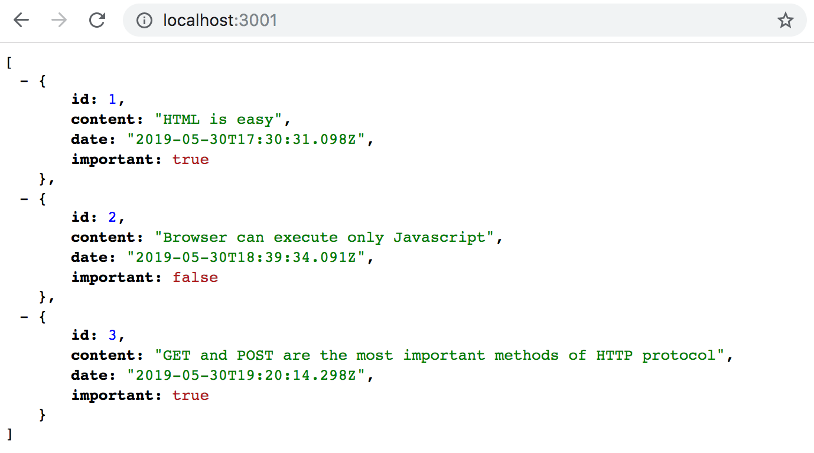
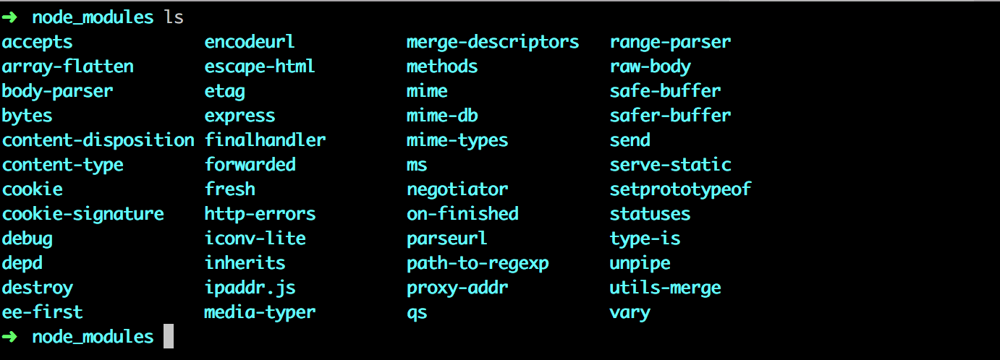
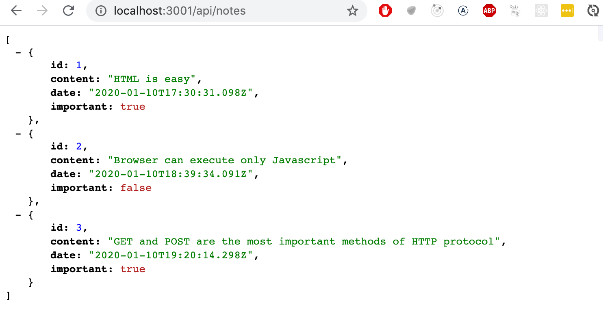
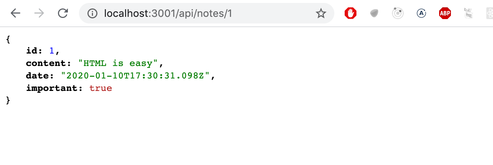
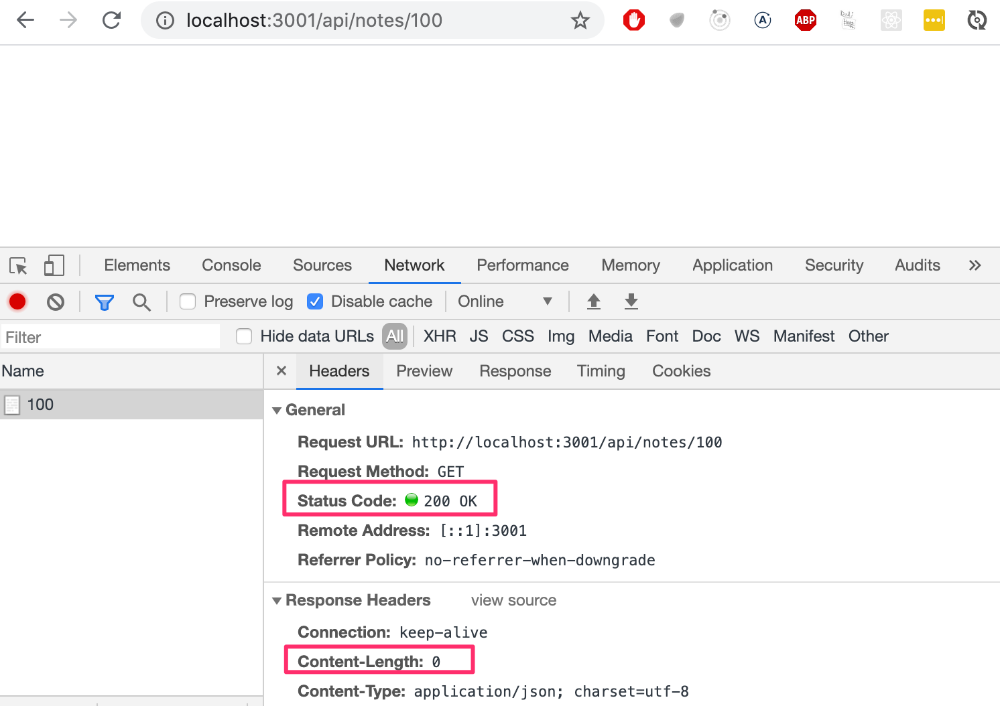
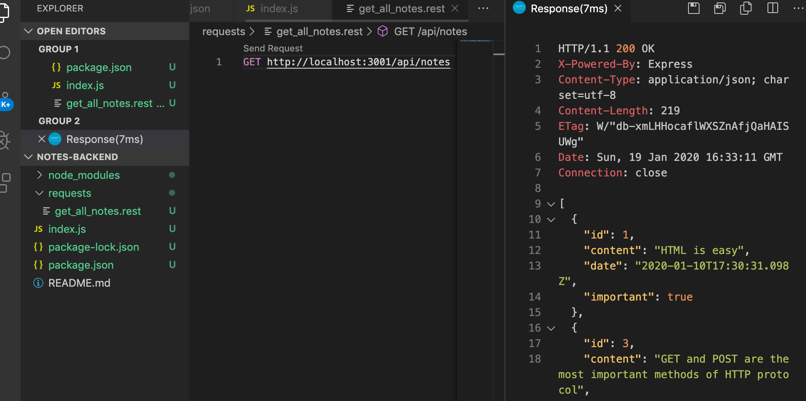
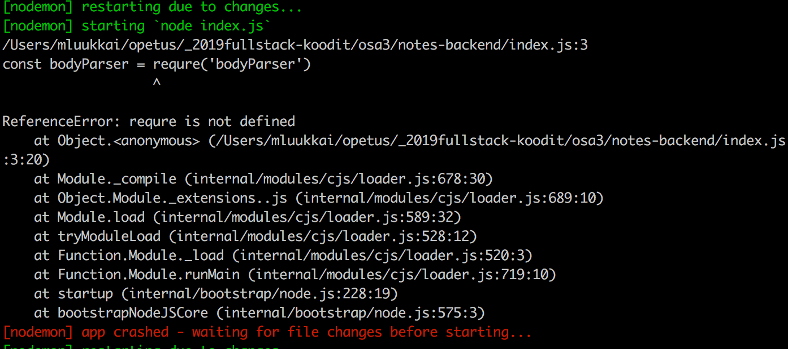
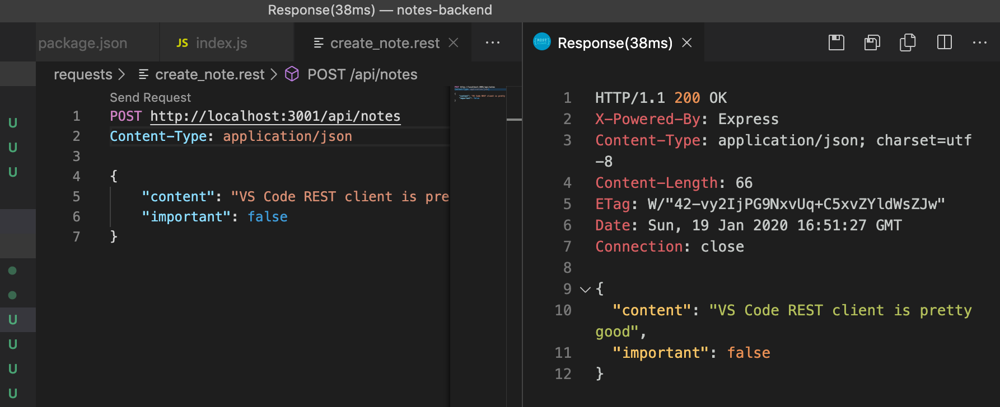
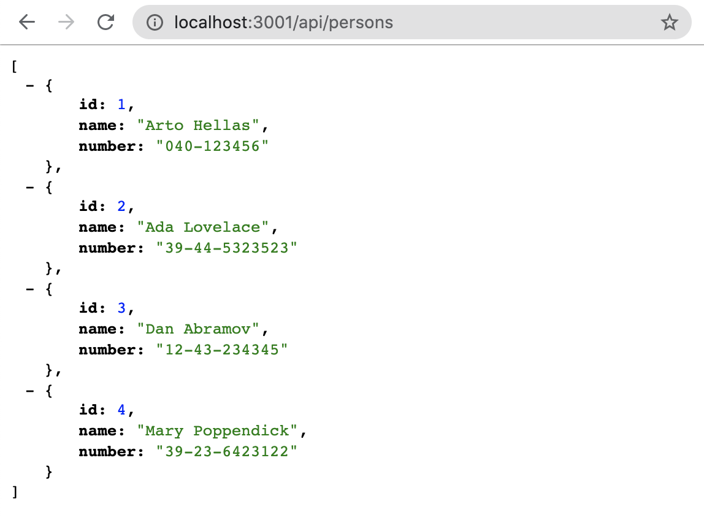

<div class="content">


Dans cette partie, nous nous concentrons sur le backend, c'est-à-dire l'implémentation des fonctionnalités côté serveur.


Nous construirons notre backend à base de [NodeJS](https://nodejs.org/en/), qui est un environnement d'exécution basé sur JavaScript et le moteur [Chrome V8](https://developers.google.com/v8/) de Google.


Ce matériel de cours a été écrit avec la version <i>16.13.2</i> de Node.js. Veuillez vous assurer que votre version de Node est au moins aussi récente que la version utilisée dans le matériel (vous pouvez vérifier la version en exécutant _node -v_ dans la ligne de commande).


Comme mentionné dans la [partie 1](/fr/part1/java_script), les navigateurs ne supportent pas encore les dernières fonctionnalités de JavaScript, et c'est pourquoi le code s'exécutant dans le navigateur doit être <i>transpilé</i> avec par exemple [babel](https://babeljs.io/). La situation avec JavaScript s'exécutant dans le backend est différente. La dernière version de Node supporte une grande majorité des dernières fonctionnalités de JavaScript, nous pouvons donc utiliser les dernières fonctionnalités sans avoir à transpiler notre code.


Notre objectif est d'implémenter un backend qui fonctionnera avec l'application notes de la [partie 2](/fr/part2/). Cependant, commençons par les bases en implémentant une application classique "hello world".


**Notons** que les applications et exercices de cette partie ne sont pas tous des applications React, et nous n'utiliserons pas l'utilitaire <i>create-react-app</i> pour initialiser le projet de cette application.


Nous avions déjà mentionné [npm](/fr/part2/getting_data_from_server#npm) dans la partie 2, qui est un outil utilisé pour gérer les paquets JavaScript. En fait, npm est issu de l'écosystème Node.


Naviguons vers un répertoire approprié et créons un nouveau modèle pour notre application avec la commande _npm init_. Nous répondrons aux questions présentées par l'utilitaire, et le résultat sera un fichier <i>package.json</i> généré automatiquement à la racine du projet qui contient des informations sur le projet.

```json
{ 
  "name": "backend",
  "version": "0.0.1",
  "description": "",
  "main": "index.js",
  "scripts": {
    "test": "echo \"Error: no test specified\" && exit 1"
  },
  "author": "Matti Luukkainen",
  "license": "MIT"
}
```


Ce fichier définit, par exemple, que le point d'entrée de l'application est le fichier <i>index.js</i>.

Faisons un petit changement à l'objet <i>scripts</i> :


```bash
{
  // ...
  "scripts": {
    "start": "node index.js", // highlight-line
    "test": "echo \"Error: no test specified\" && exit 1"
  },
  // ...
}
```


Ensuite, créons la première version de notre application en ajoutant un fichier <i>index.js</i> à la racine du projet avec le code suivant :

```js
console.log('hello world')
```


Nous pouvons exécuter le programme directement avec Node depuis la ligne de commande :

```bash
node index.js
```


Ou nous pouvons l'exécuter en tant que [script npm](https://docs.npmjs.com/misc/scripts) :

```bash
npm start
```


Le <i>start</i> npm script fonctionne parce que nous l'avons défini dans le fichier <i>package.json</i> :

```bash
{
  // ...
  "scripts": {
    "start": "node index.js",
    "test": "echo \"Error: no test specified\" && exit 1"
  },
  // ...
}
```


Même si l'exécution du projet fonctionne lorsqu'il est lancé en appelant _node index.js_ depuis la ligne de commande, il est habituel pour les projets npm d'exécuter de telles tâches sous forme de scripts npm.


Par défaut le fichier <i>package.json</i> définit également un autre script npm couramment utilisé appelé <i>npm test</i>. Comme notre projet n'a pas encore de bibliothèque de test, la commande _npm test_ exécute simplement la commande suivante :

```bash
echo "Error: no test specified" && exit 1
```


### Simple serveur web


Transformons l'application en serveur web en modifiant les fichiers _index.js_ comme suit :

```js
const http = require('http')

const app = http.createServer((request, response) => {
  response.writeHead(200, { 'Content-Type': 'text/plain' })
  response.end('Hello World')
})

const PORT = 3001
app.listen(PORT)
console.log(`Server running on port ${PORT}`)
```

Une fois l'application lancée, le message suivant est imprimé dans la console :

```bash
Server running on port 3001
```

Nous pouvons ouvrir notre humble application dans le navigateur en visitant l'adresse <http://localhost:3001>:


En fait, le serveur fonctionne de la même manière, quelle que soit la dernière partie de l'URL. Aussi, l'adresse <http://localhost:3001/foo/bar> affichera le même contenu.


**NB** si le port 3001 est déjà utilisé par une autre application, le démarrage du serveur donnera lieu au message d'erreur suivant :

```bash
➜  hello npm start

> hello@1.0.0 start /Users/mluukkai/opetus/_2019fullstack-code/part3/hello
> node index.js

Server running on port 3001
events.js:167
      throw er; // Unhandled 'error' event
      ^

Error: listen EADDRINUSE :::3001
    at Server.setupListenHandle [as _listen2] (net.js:1330:14)
    at listenInCluster (net.js:1378:12)
```


Vous avez deux options. Soit vous fermez l'application en utilisant le port 3001 (le serveur json dans la dernière partie du matériel utilisait le port 3001), soit vous utilisez un port différent pour cette application.

Regardons de plus près la première ligne du code :

```js
const http = require('http')
```

Dans la première ligne, l'application importe le module [web server](https://nodejs.org/docs/latest-v8.x/api/http.html) intégré de Node. C'est pratiquement ce que nous avons déjà fait dans notre code côté navigateur, mais avec une syntaxe légèrement différente :

```js
import http from 'http'
```

De nos jours, le code qui s'exécute dans le navigateur utilise des modules ES6. Les modules sont définis avec un [export](https://developer.mozilla.org/en-US/docs/Web/JavaScript/Reference/Statements/export) et utilisés avec un [import](https://developer.mozilla.org/en-US/docs/Web/JavaScript/Reference/Statements/import).

Toutefois, Node.js utilise des modules dits [CommonJS](https://en.wikipedia.org/wiki/CommonJS). La raison en est que l'écosystème Node avait besoin de modules bien avant que JavaScript ne les prenne en charge dans la spécification du langage. Node supporte maintenant aussi l'utilisation des modules ES6, mais puisque le support n'est pas encore [tout à fait parfait](https://nodejs.org/api/esm.html#modules-ecmascript-modules), nous nous en tiendrons aux modules CommonJS.

Les modules CommonJS fonctionnent presque exactement comme les modules ES6, du moins en ce qui concerne nos besoins dans ce cours.

La partie suivante de notre code ressemble à ceci :

```js
const app = http.createServer((request, response) => {
  response.writeHead(200, { 'Content-Type': 'text/plain' })
  response.end('Hello World')
})
```

Le code utilise la méthode _createServer_ de [http](https://nodejs.org/docs/latest-v8.x/api/http.html) pour créer un nouveau serveur web. Un <i>gestionnaire d'événements</i> est enregistré sur le serveur qui est appelé <i>à chaque fois</i> qu'une requête HTTP est faite à l'adresse du serveur http://localhost:3001.


La requête reçoit une réponse avec le code d'état 200, avec le header <i>Content-Type</i> défini comme <i>text/plain</i>, et le contenu du site à renvoyer défini comme <i>Hello World</i>.


Les dernières lignes lient le serveur http assigné à la variable _app_, pour écouter les requêtes HTTP envoyées au port 3001 :

```js
const PORT = 3001
app.listen(PORT)
console.log(`Server running on port ${PORT}`)
```


L'objectif principal du serveur backend dans ce cours est d'offrir des données brutes au format JSON au frontend. Pour cette raison, modifions immédiatement notre serveur pour qu'il renvoie une liste de notes codées en dur au format JSON :

```js
const http = require('http')

// highlight-start
let notes = [
  {
    id: 1,
    content: "HTML is easy",
    date: "2022-05-30T17:30:31.098Z",
    important: true
  },
  {
    id: 2,
    content: "Browser can execute only Javascript",
    date: "2022-05-30T18:39:34.091Z",
    important: false
  },
  {
    id: 3,
    content: "GET and POST are the most important methods of HTTP protocol",
    date: "2022-05-30T19:20:14.298Z",
    important: true
  }
]

const app = http.createServer((request, response) => {
  response.writeHead(200, { 'Content-Type': 'application/json' })
  response.end(JSON.stringify(notes))
})
// highlight-end

const PORT = 3001
app.listen(PORT)
console.log(`Server running on port ${PORT}`)
```

Redémarrons le serveur (vous pouvez arrêter le serveur en appuyant sur _Ctrl+C_ dans la console) et rafraîchissons le navigateur.

La valeur <i>application/json</i> dans le header <i>Content-Type</i> informe le récepteur que les données sont au format JSON. Le tableau  _notes_ est transformé en JSON avec la méthode <em>JSON.stringify(notes)<em>.

Lorsque nous ouvrons le navigateur, le format affiché est exactement le même que dans la [partie 2](/fr/part2/getting_data_from_server/) où nous avons utilisé [json-server](https://github.com/typicode/json-server) pour servir la liste des notes :



### Express

Il est possible d'implémenter notre code serveur directement avec le serveur web intégré de Node [http](https://nodejs.org/docs/latest-v8.x/api/http.html). Cependant, c'est lourd, surtout lorsque la taille de l'application augmente.

De nombreuses bibliothèques ont été développées pour faciliter le développement côté serveur avec Node, en offrant une interface plus agréable pour travailler avec le module http intégré. Ces bibliothèques visent à fournir une meilleure abstraction pour les cas d'utilisation généraux dont nous avons habituellement besoin pour construire un serveur dorsal. La bibliothèque la plus populaire à cet effet est de loin [express](http://expressjs.com).

Utilisons express en le définissant comme une dépendance du projet avec la commande :

```bash
npm install express
```

La dépendance est également ajoutée à notre fichier <i>package.json</i> :

```json
{
  // ...
  "dependencies": {
    "express": "^4.17.2"
  }
}

```


Le code source de la dépendance est installé dans le répertoire <i>node\_modules</i> situé à la racine du projet. En plus d'express, vous pouvez trouver une grande quantité d'autres dépendances dans ce répertoire :




Ce sont en fait les dépendances de la bibliothèque express, et les dépendances de toutes ses dépendances, et ainsi de suite. On les appelle les [dépendances transitives](https://lexi-lambda.github.io/blog/2016/08/24/understanding-the-npm-dependency-model/) de notre projet.


La version 4.17.2. d'express a été installée dans notre projet. Que signifie le caret devant le numéro de version dans <i>package.json</i> ?

```json
"express": "^4.17.2"
```


Le modèle de versioning utilisé dans npm est appelé [versioning sémantique](https://docs.npmjs.com/getting-started/semantic-versioning).


Le caret devant <i>^4.17.2</i> signifie que si et quand les dépendances d'un projet sont mises à jour, la version d'express qui est installée sera au moins <i>4.17.2</i>. Cependant, la version installée d'express peut aussi avoir un numéro de <i>patch</i> plus grand (le dernier chiffre), ou un numéro <i>mineur</i> plus grand (le chiffre du milieu). La version majeure de la bibliothèque indiquée par le premier numéro <i>majeur</i> doit être la même.


Nous pouvons mettre à jour les dépendances du projet avec la commande :

```bash
npm update
```

De même, si nous commençons à travailler sur le projet sur un autre ordinateur, nous pouvons installer toutes les dépendances à jour du projet définies dans <i>package.json</i> avec la commande :

```bash
npm install
```

Si le numéro <i>majeur</i> d'une dépendance ne change pas, alors les versions plus récentes devraient être [rétrocompatibles](https://en.wikipedia.org/wiki/Backward_compatibility). Cela signifie que si notre application venait à utiliser la version 4.99.175 d'express dans le futur, alors tout le code implémenté dans cette partie devrait continuer à fonctionner sans apporter de modifications au code. En revanche, la future version 5.0.0. d'express [pourrait contenir](https://expressjs.com/en/guide/migrating-5.html) des modifications qui feraient que notre application ne fonctionnerait plus.

### Web et express

Revenons à notre application et apportons les modifications suivantes :

```js
const express = require('express')
const app = express()

let notes = [
  ...
]

app.get('/', (request, response) => {
  response.send('<h1>Hello World!</h1>')
})

app.get('/api/notes', (request, response) => {
  response.json(notes)
})

const PORT = 3001
app.listen(PORT, () => {
  console.log(`Server running on port ${PORT}`)
})
```


Afin de mettre en service la nouvelle version de notre application, nous devons redémarrer l'application.


The application did not change a whole lot. Dès le début de notre code, nous importons _express_, qui est cette fois une <i>fonction</i> utilisée pour créer une application express stockée dans la variable _app_ :

```js
const express = require('express')
const app = express()
```


Ensuite, nous définissons deux <i>routes</i> vers l'application. La première définit un gestionnaire d'événements qui est utilisé pour traiter les requêtes HTTP GET faites à la racine <i>/</i> de l'application :

```js
app.get('/', (request, response) => {
  response.send('<h1>Hello World!</h1>')
})
```


La fonction de gestion d'événement accepte deux paramètres. Le premier paramètre [request](http://expressjs.com/en/4x/api.html#req) contient toutes les informations de la demande HTTP, et le second paramètre [response](http://expressjs.com/en/4x/api.html#res) est utilisé pour définir la réponse à la demande.


Dans notre code, on répond à la requête en utilisant la méthode [send](http://expressjs.com/en/4x/api.html#res.send) de l'objet _response_. L'appel de la méthode fait que le serveur répond à la requête HTTP en envoyant une réponse contenant la chaîne de caractères <code>\<h1>Hello World!\</h1></code> qui a été passée à la méthode _send_. Comme le paramètre est une chaîne de caractères, express définit automatiquement la valeur du header <i>Content-Type</i> comme étant <i>text/html</i>. Le code d'état de la réponse a la valeur 200 par défaut.


Nous pouvons le vérifier à partir de l'onglet <i>Network</i> dans les outils de développement :


La deuxième route définit un gestionnaire d'événements qui gère les requêtes HTTP GET effectuées sur le chemin <i>notes</i> de l'application :

```js
app.get('/api/notes', (request, response) => {
  response.json(notes)
})
```


La requête est traitée avec la méthode [json](http://expressjs.com/en/4x/api.html#res.json) de l'objet _réponse_. L'appel de cette méthode enverra le tableau __notes__ qui lui a été transmis sous la forme d'une chaîne de caractères formatée en JSON. Express définit automatiquement le header <i>Content-Type</i> avec la valeur appropriée de <i>application/json</i>.



Ensuite, jetons un coup d'œil rapide aux données envoyées au format JSON.

Dans la version précédente où nous utilisions uniquement Node, nous devions transformer les données au format JSON avec la méthode _JSON.stringify_ :

```js
response.end(JSON.stringify(notes))
```


Avec express, ce n'est plus nécessaire, car cette transformation se fait automatiquement.


Il convient de noter que [JSON](https://en.wikipedia.org/wiki/JSON) est une chaîne de caractères, et non un objet JavaScript comme la valeur attribuée à _notes_.


L'expérience présentée ci-dessous illustre cela :


L'expérience ci-dessus a été réalisée dans l'application interactive [node-repl](https://nodejs.org/docs/latest-v8.x/api/repl.html). Vous pouvez lancer le node-repl interactif en tapant _node_ dans la ligne de commande. Le repl est particulièrement utile pour tester le fonctionnement des commandes pendant que vous écrivez le code de l'application. Je le recommande vivement !

### nodemon

Si nous apportons des modifications au code de l'application, nous devons redémarrer l'application afin de voir les changements. Nous redémarrons l'application en l'arrêtant d'abord en tapant _Ctrl+C_ puis en la redémarrant. Comparé au flux de travail pratique de React, où le navigateur se recharge automatiquement après que les changements ont été effectués, cela semble légèrement encombrant.

La solution à ce problème est [nodemon](https://github.com/remy/nodemon) :

> <i>nodemon surveillera les fichiers du répertoire dans lequel nodemon a été lancé, et si un fichier change, nodemon redémarrera automatiquement votre application node.</i>


Installons nodemon en le définissant comme une <i>dépendance de développement</i> avec la commande :

```bash
npm install --save-dev nodemon
```

Le contenu de <i>package.json</i> a également changé :

```json
{
  //...
  "dependencies": {
    "express": "^4.17.2",
  },
  "devDependencies": {
    "nodemon": "^2.0.15"
  }
}
```


Si vous avez accidentellement utilisé la mauvaise commande et que la dépendance nodemon a été ajoutée sous "dependencies" au lieu de "devDependencies", modifiez manuellement le contenu de <i>package.json<i/> pour qu'il corresponde à ce qui est indiqué ci-dessus.


Par dépendances de développement, nous entendons les outils qui ne sont nécessaires que pendant le développement de l'application, par exemple pour les tests ou le redémarrage automatique de l'application, comme <i>nodemon</i>.


Ces dépendances de développement ne sont pas nécessaires lorsque l'application est exécutée en mode production sur le serveur de production (par exemple Heroku).


Nous pouvons démarrer notre application avec <i>nodemon</i> comme ceci :

```bash
node_modules/.bin/nodemon index.js
```


Les modifications apportées au code de l'application entraînent désormais le redémarrage automatique du serveur. Il est intéressant de noter que même si le serveur backend redémarre automatiquement, le navigateur doit toujours être rafraîchi manuellement. En effet, contrairement à ce qui se passe lorsque l'on travaille en React, nous ne disposons pas de la fonctionnalité de [rechargement à chaud](https://gaearon.github.io/react-hot-loader/getstarted/) nécessaire pour recharger automatiquement le navigateur.


La commande est longue et assez désagréable, aussi définissons-nous un <i>npm script</i> dédié pour elle dans le fichier <i>package.json</i> :

```bash
{
  // ..
  "scripts": {
    "start": "node index.js",
    "dev": "nodemon index.js",  // highlight-line
    "test": "echo \"Error: no test specified\" && exit 1"
  },
  // ..
}
```


Dans le script, il n'est pas nécessaire de spécifier le chemin <i>node\_modules/.bin/nodemon</i> vers nodemon, car _npm_ sait automatiquement rechercher le fichier dans ce répertoire.


Nous pouvons maintenant démarrer le serveur en mode développement avec la commande :

```bash
npm run dev
```


Contrairement aux scripts <i>start</i> et <i>test</i> , nous devons également ajouter <i>run</i> à la commande.


### REST


Développons notre application afin qu'elle fournisse la même API HTTP RESTful que [json-server](https://github.com/typicode/json-server#routes).


Le transfert d'état représentationnel, alias REST, a été présenté en 2000 dans la [dissertation](https://www.ics.uci.edu/~fielding/pubs/dissertation/rest_arch_style.htm) de Roy Fielding. REST est un style architectural destiné à la création d'applications web évolutives.


Nous n'allons pas creuser la définition de REST de Fielding ni passer du temps à réfléchir à ce qui est ou n'est pas RESTful. Nous allons plutôt adopter une [vision plus étroite](https://en.wikipedia.org/wiki/Representational_state_transfer#Applied_to_web_services) en nous intéressant uniquement à la manière dont les API RESTful sont généralement comprises dans les applications web. En fait, la définition originale de REST n'est même pas limitée aux applications web.


Nous avons mentionné dans la [partie précédente](/fr/part2/altering_data_in_server#rest) que les choses singulières, comme les notes dans le cas de notre application, sont appelées <i>ressources</i> dans la pensée RESTful. Chaque ressource a une URL associée qui est l'adresse unique de la ressource.


Une convention consiste à créer l'adresse unique des ressources en combinant le nom du type de ressource avec l'identifiant unique de la ressource.


Supposons que l'URL racine de notre service est  <i>www.example.com/api</i>.


Si nous définissons le type de ressource de note comme étant <i>notes</i>, alors l'adresse d'une ressource de note avec l'identifiant 10, a l'adresse unique suivante <i>www.example.com/api/notes/10</i>.


L'URL de la collection complète de toutes les ressources de notes est <i>www.example.com/api/notes</i>.


Nous pouvons exécuter différentes opérations sur les ressources. L'opération à exécuter est définie par les <i>verbes</i> HTTP :

| URL                   | verbe  | fonctionnalité                                                                |
| --------------------- |--------|-------------------------------------------------------------------------------|
| notes/10              | GET    | récupère une seule ressource                                                  |
| notes                 | GET    | récupère toutes les ressources de la collection                               |
| notes                 | POST   | crée une nouvelle ressource basée sur les données de la requête               |
| notes/10              | DELETE | supprime la ressource identifiée                                              |
| notes/10              | PUT    | remplace l'ensemble de la ressource identifiée par les données de la requête  |
| notes/10              | PATCH  | remplace une partie de la ressource identifiée par les données de la requête  |
|                       |        |                                                                               |


C'est ainsi que nous parvenons à définir grossièrement ce que REST appelle une [interface uniforme](https://en.wikipedia.org/wiki/Representational_state_transfer#Architectural_constraints), c'est-à-dire une méthode cohérente de définition des interfaces qui permet aux systèmes de coopérer.


Cette façon d'interpréter REST relève du [deuxième niveau de maturité RESTful](https://martinfowler.com/articles/richardsonMaturityModel.html) du modèle de maturité de Richardson. Selon la définition fournie par Roy Fielding, nous n'avons pas réellement défini une [API REST](http://roy.gbiv.com/untangled/2008/rest-apis-must-be-hypertext-driven). En fait, une grande majorité des prétendues API "REST" dans le monde ne répondent pas aux critères initiaux de Fielding décrits dans sa thèse.


À certains endroits (voir par exemple [Richardson, Ruby : RESTful Web Services](http://shop.oreilly.com/product/9780596529260.do)), vous verrez que notre modèle d'API [CRUD](https://en.wikipedia.org/wiki/Create,_read,_update_and_delete) simple est désigné comme un exemple d'[architecture orientée ressources](https://en.wikipedia.org/wiki/Resource-oriented_architecture) au lieu de REST. Nous éviterons de nous perdre dans des discussions sur la sémantique et retournerons plutôt travailler sur notre application.


### Récupération d'une seule ressource


Développons notre application de manière à ce qu'elle offre une interface REST pour opérer sur des notes individuelles. Tout d'abord, créons une [route](http://expressjs.com/en/guide/routing.html) pour récupérer une seule ressource.


L'adresse unique que nous utiliserons pour une note individuelle est de la forme <i>notes/10</i>, où le nombre à la fin fait référence au numéro d'identification unique de la note.


Nous pouvons définir des [paramètres](http://expressjs.com/en/guide/routing.html#route-parameters) pour les routes dans express en utilisant la syntaxe des deux points :

```js
app.get('/api/notes/:id', (request, response) => {
  const id = request.params.id
  const note = notes.find(note => note.id === id)
  response.json(note)
})
```


Maintenant, <code>app.get('/api/notes/:id', ...)</code> traitera toutes les requêtes HTTP GET qui sont de la forme <i>/api/notes/SOMETHING</i>, où <i>SOMETHING</i> est une chaîne arbitraire.


Le paramètre <i>id</i> dans la route d'une demande, est accessible par l'objet [request](http://expressjs.com/en/api.html#req) :

```js
const id = request.params.id
```

La méthode _find_ des tableaux, désormais bien connue, est utilisée pour trouver la note dont l'identifiant correspond au paramètre. La note est ensuite renvoyée à l'expéditeur de la demande.


Lorsque nous testons notre application en allant sur <http://localhost:3001/api/notes/1> dans notre navigateur, nous remarquons qu'elle ne semble pas fonctionner, car le navigateur affiche une page vide. Ce n'est pas une surprise pour nous, développeurs de logiciels, et il est temps de déboguer.


Adding _console.log_ commands into our code is a time-proven trick:

```js
app.get('/api/notes/:id', (request, response) => {
  const id = request.params.id
  console.log(id)
  const note = notes.find(note => note.id === id)
  console.log(note)
  response.json(note)
})
```


Lorsque nous visitons à nouveau <http://localhost:3001/api/notes/1> dans le navigateur, la console qui est le terminal dans ce cas, affichera ce qui suit :


Le paramètre id de la route est transmis à notre application mais la méthode _find_ ne trouve pas de note correspondante.


Pour approfondir notre enquête, nous ajoutons également un journal de la console à l'intérieur de la fonction de comparaison passée à la fonction _find_. Pour ce faire, nous devons nous débarrasser de la syntaxe de la fonction flèche compacte <em>note => note.id === id</em>, et utiliser la syntaxe avec une déclaration de retour explicite:

```js
app.get('/api/notes/:id', (request, response) => {
  const id = request.params.id
  const note = notes.find(note => {
    console.log(note.id, typeof note.id, id, typeof id, note.id === id)
    return note.id === id
  })
  console.log(note)
  response.json(note)
})
```


Lorsque nous visitons à nouveau l'URL dans le navigateur, chaque appel à la fonction de comparaison imprime quelques éléments différents dans la console. La sortie de la console est la suivante :

<pre>
1 'number' '1' 'string' false
2 'number' '1' 'string' false
3 'number' '1' 'string' false
</pre>


La cause du bogue devient claire. La variable _id_ contient une chaîne de caractères '1', alors que les identifiants des notes sont des entiers. En JavaScript, la comparaison "triple equals" === considère que toutes les valeurs de types différents ne sont pas égales par défaut, ce qui signifie que 1 n'est pas '1'.


Résolvons le problème en transformant le paramètre id, qui est une chaîne de charactères, en un [nombre](https://developer.mozilla.org/en-US/docs/Web/JavaScript/Reference/Global_Objects/Number):

```js
app.get('/api/notes/:id', (request, response) => {
  const id = Number(request.params.id) // highlight-line
  const note = notes.find(note => note.id === id)
  response.json(note)
})
```


Maintenant, la récupération d'une ressource individuelle fonctionne.




Cependant, il y a un autre problème avec notre application.


Si nous recherchons une note avec un id qui n'existe pas, le serveur répond avec :




Le code d'état HTTP renvoyé est 200, ce qui signifie que la réponse a réussi. Aucune donnée n'est renvoyée avec la réponse, puisque la valeur du header <i>content-length</i> est 0, ce qui peut être vérifié à partir du navigateur.


La raison de ce comportement est que la variable _note_ prend la valeur _undefined_ si aucune note correspondante n'est trouvée. La situation doit être mieux gérée sur le serveur. Si aucune note n'est trouvée, le serveur devrait répondre avec le code d'état [404 not found](https://www.rfc-editor.org/rfc/rfc9110.html#name-404-not-found) au lieu de 200.


Faisons la modification suivante à notre code :

```js
app.get('/api/notes/:id', (request, response) => {
  const id = Number(request.params.id)
  const note = notes.find(note => note.id === id)
  
  // highlight-start
  if (note) {
    response.json(note)
  } else {
    response.status(404).end()
  }
  // highlight-end
})
```


Comme aucune donnée n'est jointe à la réponse, nous utilisons la méthode [status](http://expressjs.com/en/4x/api.html#res.status) pour définir l'état et la méthode [end](http://expressjs.com/en/4x/api.html#res.end) pour répondre à la demande sans envoyer de données.


La condition if exploite le fait que tous les objets JavaScript sont [truthy](https://developer.mozilla.org/en-US/docs/Glossary/Truthy), ce qui signifie qu'ils sont évalués à true dans une opération de comparaison. Cependant, _undefined_ est [falsy](https://developer.mozilla.org/en-US/docs/Glossary/Falsy), ce qui signifie qu'il sera évalué comme faux.


Notre application fonctionne et envoie le code d'état d'erreur si aucune note n'est trouvée. Cependant, l'application ne renvoie rien à montrer à l'utilisateur, comme le font normalement les applications Web lorsque nous visitons une page qui n'existe pas. Nous n'avons pas besoin d'afficher quoi que ce soit dans le navigateur, car les API REST sont des interfaces destinées à une utilisation programmatique, et le code d'état d'erreur est tout ce dont nous avons besoin.

De toute façon, il est possible de donner un indice sur la raison de l'envoi de l'erreur 404 en [remplaçant le message par défaut NOT FOUND](https://stackoverflow.com/questions/14154337/how-to-send-a-custom-http-status-message-in-node-express/36507614#36507614).


### Suppression des ressources


Ensuite, nous allons implémenter une route pour la suppression des ressources. La suppression se fait par une requête HTTP DELETE vers l'url de la ressource :

```js
app.delete('/api/notes/:id', (request, response) => {
  const id = Number(request.params.id)
  notes = notes.filter(note => note.id !== id)

  response.status(204).end()
})
```

Si la suppression de la ressource est réussie, c'est-à-dire que la note existe et qu'elle est supprimée, nous répondons à la demande avec le code d'état [204 no content](https://www.rfc-editor.org/rfc/rfc9110.html#name-204-no-content) et ne renvoyons aucune donnée avec la réponse.


Il n'y a pas de consensus sur le code d'état à renvoyer à une demande DELETE si la ressource n'existe pas. En réalité, les deux seules options sont 204 et 404. Pour des raisons de simplicité, notre application répondra par 204 dans les deux cas.

### Postman

Alors comment tester l'opération de suppression ? Les requêtes HTTP GET sont faciles à réaliser à partir du navigateur. Nous pourrions écrire du JavaScript pour tester la suppression, mais écrire du code de test n'est pas toujours la meilleure solution dans toutes les situations.

De nombreux outils existent pour faciliter le test des backends. L'un d'entre eux est le programme en ligne de commande [curl](https://curl.haxx.se). Cependant, au lieu de curl, nous allons utiliser [Postman](https://www.postman.com) pour tester l'application.

Installons le client de bureau Postman [depuis ici](https://www.postman.com/downloads/) et essayons-le :


L'utilisation de Postman est assez simple dans cette situation. Il suffit de définir l'url et de sélectionner le type de requête correct (DELETE).

Le serveur backend semble répondre correctement. En faisant une demande HTTP GET à <http://localhost:3001/api/notes> nous voyons que la note avec l'id 2 n'est plus dans la liste, ce qui indique que la suppression a réussi.

Comme les notes de l'application ne sont sauvegardées qu'en mémoire, la liste des notes reviendra à son état initial lorsque nous redémarrerons l'application.

### Le client REST de Visual Studio Code

Si vous utilisez Visual Studio Code, vous pouvez utiliser le plugin VS Code [REST client](https://marketplace.visualstudio.com/items?itemName=humao.rest-client) à la place de Postman.

Une fois le plugin installé, son utilisation est très simple. Nous créons un répertoire à la racine de l'application nommé <i>requests</i>. Nous enregistrons toutes les requêtes du client REST dans le répertoire sous forme de fichiers qui se terminent par l'extension <i>.rest</i>.

Créons un nouveau fichier <i>get\_all\_notes.rest</i> et définissons la requête qui récupère toutes les notes.


En cliquant sur le texte <i>Envoyer la demande</i>, le client REST exécutera la demande HTTP et la réponse du serveur est ouverte dans l'éditeur.



### Le client HTTP de WebStorm

Si vous utilisez *IntelliJ WebStorm* à la place, vous pouvez utiliser une procédure similaire avec son client HTTP intégré. Créez un nouveau fichier avec l'extension `.rest` et l'éditeur vous affichera des options pour créer et exécuter vos requêtes. Vous pouvez en savoir plus en suivant [ce guide](https://www.jetbrains.com/help/webstorm/http-client-in-product-code-editor.html).

### Réception des données

Ensuite, rendons possible l'ajout de nouvelles notes sur le serveur. L'ajout d'une note se fait par une requête HTTP POST à l'adresse http://localhost:3001/api/notes, et par l'envoi de toutes les informations relatives à la nouvelle note dans la requête [body](https://www.w3.org/Protocols/rfc2616/rfc2616-sec7.html#sec7) au format JSON.

Afin d'accéder facilement aux données, nous avons besoin de l'aide de l'express [json-parser](https://expressjs.com/en/api.html) qui est utilisé avec la commande _app.use(express.json())_.

Activons le json-parser et implémentons un gestionnaire initial pour traiter les requêtes HTTP POST :

```js
const express = require('express')
const app = express()

app.use(express.json())  // highlight-line

//...

// highlight-start
app.post('/api/notes', (request, response) => {
  const note = request.body
  console.log(note)

  response.json(note)
})
// highlight-end
```


La fonction de gestion d'événement peut accéder aux données de la propriété <i>body</i>  de l'objet _request_.

Sans le json-parser, la propriété <i>body</i> serait indéfinie. Le json-parser fonctionne de telle sorte qu'il prend les données JSON d'une demande, les transforme en un objet JavaScript et les attache ensuite à la propriété <i>body</i> de l'objet _request_ avant que le gestionnaire de route ne soit appelé.

Pour l'instant, l'application ne fait rien avec les données reçues, à part les imprimer sur la console et les renvoyer dans la réponse.

Avant d'implémenter le reste de la logique applicative, vérifions avec Postman que les données sont effectivement reçues par le serveur. En plus de définir l'URL et le type de requête dans Postman, nous devons également définir les données envoyées dans le <i>body</i>:


L'application imprime les données que nous avons envoyées dans la requête à la console :


**NB** <i>Gardez le terminal exécutant l'application visible à tout moment</i> lorsque vous travaillez sur le backend. Grâce à Nodemon, toute modification apportée au code redémarre l'application. Si vous prêtez attention à la console, vous serez immédiatement en mesure de repérer les erreurs qui se produisent dans l'application :



De même, il est utile de consulter la console pour s'assurer que le backend se comporte comme nous l'attendons dans différentes situations, comme lorsque nous envoyons des données avec une requête HTTP POST. Naturellement, c'est une bonne idée d'ajouter beaucoup de commandes <em>console.log</em> au code pendant que l'application est encore en cours de développement.

Une cause potentielle de problèmes est un header <i>Content-Type</i> incorrectement défini dans les requêtes. Cela peut se produire avec Postman si le type de corps n'est pas défini correctement :


Le header <i>Content-Type</i> est défini comme <i>text/plain</i> :


Le serveur semble ne recevoir qu'un objet vide :


Le serveur ne sera pas en mesure d'analyser correctement les données sans la valeur correcte dans le header. Il n'essaiera même pas de deviner le format des données, car il y a une [quantité massive](https://developer.mozilla.org/en-US/docs/Web/HTTP/Basics_of_HTTP/MIME_types) de <i>Content-Types</i> potentiels.

Si vous utilisez VS Code, alors vous devez installer le client REST du chapitre précédent <i>maintenant, si ce n'est pas déjà</i>. La requête POST peut être envoyée avec le client REST comme ceci :



Nous avons créé un nouveau fichier <i>create\_note.rest</i> pour la requête. La requête est formatée selon les [instructions de la documentation](https://github.com/Huachao/vscode-restclient/blob/master/README.md#usage).

L'un des avantages du client REST par rapport à Postman est que les demandes sont facilement disponibles à la racine du dépôt du projet et qu'elles peuvent être distribuées à tous les membres de l'équipe de développement. Vous pouvez également ajouter plusieurs demandes dans le même fichier en utilisant les séparateurs `###` :

```
GET http://localhost:3001/api/notes/

###
POST http://localhost:3001/api/notes/ HTTP/1.1
content-type: application/json

{
    "name": "sample",
    "time": "Wed, 21 Oct 2015 18:27:50 GMT"
}
```

Postman permet également aux utilisateurs de sauvegarder leurs demandes, mais la situation peut devenir assez chaotique, surtout lorsque vous travaillez sur plusieurs projets sans lien entre eux.

> **Remarque importante**
>
> Parfois, lors d'un débogage, vous pouvez vouloir savoir quels en-têtes ont été définis dans la requête HTTP.Une façon d'y parvenir est d'utiliser la méthode [get](http://expressjs.com/en/4x/api.html#req.get) de l'objet _request_, qui peut être utilisée pour obtenir la valeur d'un seul header. L'objet _request_ possède également la propriété <i>headers</i>, qui contient tous les en-têtes d'une requête spécifique.
>

> Des problèmes peuvent survenir avec le client VS REST si vous ajoutez accidentellement une ligne vide entre la ligne supérieure et la ligne spécifiant les en-têtes HTTP. Dans cette situation, le client REST interprète cela comme signifiant que tous les en-têtes sont laissés vides, ce qui conduit le serveur backend à ne pas savoir que les données qu'il a reçues sont au format JSON.>
>

Vous pourrez repérer ce header <i>Content-Type</i> manquant si, à un moment donné dans votre code, vous imprimez tous les headers de la requête avec la commande _console.log(request.headers)_.


Revenons à l'application. Une fois que nous savons que l'application reçoit correctement les données, il est temps de finaliser le traitement de la requête :

```js
app.post('/api/notes', (request, response) => {
  const maxId = notes.length > 0
    ? Math.max(...notes.map(n => n.id)) 
    : 0

  const note = request.body
  note.id = maxId + 1

  notes = notes.concat(note)

  response.json(note)
})
```


Nous avons besoin d'un identifiant unique pour la note. Tout d'abord, nous trouvons le plus grand numéro d'identifiant dans la liste actuelle et nous l'attribuons à la variable _maxId_. L'identifiant de la nouvelle note est alors défini comme _maxId + 1_. Cette méthode n'est en fait pas recommandée, mais nous nous en accommoderons pour l'instant car nous la remplacerons bien assez tôt.


La version actuelle présente toujours le problème que la requête HTTP POST peut être utilisée pour ajouter des objets avec des propriétés arbitraires. Améliorons l'application en définissant que la propriété <i>content</i> ne peut pas être vide. Les propriétés <i>important</i> et <i>date</i> auront des valeurs par défaut. Toutes les autres propriétés sont rejetées:

```js
const generateId = () => {
  const maxId = notes.length > 0
    ? Math.max(...notes.map(n => n.id))
    : 0
  return maxId + 1
}

app.post('/api/notes', (request, response) => {
  const body = request.body

  if (!body.content) {
    return response.status(400).json({ 
      error: 'content missing' 
    })
  }

  const note = {
    content: body.content,
    important: body.important || false,
    date: new Date(),
    id: generateId(),
  }

  notes = notes.concat(note)

  response.json(note)
})
```


La logique de génération du nouveau numéro d'identification des notes a été extraite dans une fonction _generateId_ distincte.


Si les données reçues ne contiennent pas de valeur pour la propriété <i>content</i>, le serveur répondra à la demande avec le code d'état [400 bad request](https://www.rfc-editor.org/rfc/rfc9110.html#name-400-bad-request) :

```js
if (!body.content) {
  return response.status(400).json({ 
    error: 'content missing' 
  })
}
```


Notez que l'appel de return est crucial, car sinon le code s'exécutera jusqu'à la fin et la note malformée sera enregistrée dans l'application.


Si la propriété content a une valeur, la note sera basée sur les données reçues. Comme mentionné précédemment, il est préférable de générer les horodatages sur le serveur plutôt que dans le navigateur, car nous ne pouvons pas être sûrs que la machine hôte qui exécute le navigateur a son horloge correctement réglée. La génération de la propriété <i>date</i> est maintenant effectuée par le serveur.


Si la propriété <i>important</i> est manquante, la valeur par défaut sera <i>false</i>. La valeur par défaut est actuellement générée d'une manière assez étrange :

```js
important: body.important || false,
```


Si les données enregistrées dans la variable _body_ possèdent la propriété <i>important</i>, l'expression sera évaluée à sa valeur. Si la propriété n'existe pas, alors l'expression sera évaluée à false qui est défini sur le côté droit des lignes verticales.


>Pour être exact, lorsque la propriété <i>important</i>  est <i>false</i>, alors l'expression <em>body.important || false</em> retournera en fait le <i>false</i> de la partie droite...


Vous pouvez trouver le code de notre application actuelle dans son intégralité dans la branche <i>part3-1</i> de [ce dépôt GitHub](https://github.com/fullstack-hy2020/part3-notes-backend/tree/part3-1).


Le code pour l'état actuel de l'application est spécifiquement dans la branche [part3-1](https://github.com/fullstack-hy2020/part3-notes-backend/tree/part3-1).


Si vous clonez le projet, exécutez la commande _npm install_ avant de lancer l'application avec _npm start_ ou _npm run dev_.


Une dernière chose avant de passer aux exercices. La fonction permettant de générer les IDs ressemble actuellement à ceci :

```js
const generateId = () => {
  const maxId = notes.length > 0
    ? Math.max(...notes.map(n => n.id))
    : 0
  return maxId + 1
}
```


Le corps de la fonction contient une ligne qui semble un peu intrigante :

```js
Math.max(...notes.map(n => n.id))
```

Que se passe-t-il exactement dans cette ligne de code ? <em>notes.map(n => n.id)</em>  crée un nouveau tableau qui contient tous les ids des notes. [Math.max](https://developer.mozilla.org/en-US/docs/Web/JavaScript/Reference/Global_Objects/Math/max) renvoie la valeur maximale des nombres qui lui sont passés. Cependant, <em>notes.map(n => n.id)</em> est un <i>tableau</i> et ne peut donc pas être donné directement comme paramètre à _Math.max_. Le tableau peut être transformé en nombres individuels en utilisant la syntaxe d'étalement "trois points" [spread](https://developer.mozilla.org/en-US/docs/Web/JavaScript/Reference/Operators/Spread_syntax) <em>...</em>.

</div>

<div class="tasks">


### Exercises 3.1.-3.6.

**NB:** Il est recommandé de faire tous les exercices de cette partie dans un nouveau dépôt git dédié, et de placer votre code source à la racine du dépôt. Sinon, vous rencontrerez des problèmes dans l'exercice 3.10.


**NB:** Comme il ne s'agit pas d'un projet frontend et que nous ne travaillons pas avec React, l'application <strong> n'est pas créée</strong>  avec create-react-app. Vous initialisez ce projet avec la commande <em>npm init</em> qui a été démontrée plus tôt dans cette partie du matériel.


**Forte recommandation:** Lorsque vous travaillez sur du code backend, gardez toujours un œil sur ce qui se passe dans le terminal qui exécute votre application.


#### 3.1: Backend du répertoire téléphonique étape 1


Mettez en œuvre une application Node qui renvoie une liste codée en dur d'entrées de répertoire téléphonique à partir de l'adresse <http://localhost:3001/api/persons>.


Données:
  
```js
[
    { 
      "id": 1,
      "name": "Arto Hellas", 
      "number": "040-123456"
    },
    { 
      "id": 2,
      "name": "Ada Lovelace", 
      "number": "39-44-5323523"
    },
    { 
      "id": 3,
      "name": "Dan Abramov", 
      "number": "12-43-234345"
    },
    { 
      "id": 4,
      "name": "Mary Poppendieck", 
      "number": "39-23-6423122"
    }
]
```

Sortie dans le navigateur après une requête GET:
  


Notez que la barre oblique dans la route <i>api/persons</i> n'est pas un caractère spécial, et est comme n'importe quel autre caractère dans la chaîne de caractères.

L'application doit être lancée avec la commande _npm start_.

L'application doit également proposer une commande _npm run dev_ qui exécutera l'application et redémarrera le serveur chaque fois que des modifications seront apportées et enregistrées dans un fichier du code source.
 
#### 3.2: Backend du répertoire téléphonique étape 2

Mettez en place une page à l'adresse <http://localhost:3001/info> qui ressemble à peu près à ceci :


La page doit indiquer l'heure de réception de la demande et le nombre d'entrées présentes dans le répertoire au moment du traitement de la requête.

#### 3.3: Backend du répertoire téléphonique étape 3


Implémenter la fonctionnalité permettant d'afficher les informations d'une seule entrée du répertoire. L'url pour obtenir les données pour une personne avec l'id 5 devrait être <http://localhost:3001/api/persons/5>.

Si une entrée pour l'id donné n'est pas trouvée, le serveur doit répondre avec le code d'état approprié.

#### 3.4: Backend du répertoire téléphonique étape 4


Implémentez une fonctionnalité permettant de supprimer une seule entrée de répertoire en effectuant une requête HTTP DELETE vers l'URL unique de cette entrée de répertoire.


Testez que votre fonctionnalité fonctionne avec Postman ou le client REST de Visual Studio Code.


#### 3.5: Backend du répertoire téléphonique étape 5


Développez le backend pour que de nouvelles entrées de répertoire puissent être ajoutées en effectuant des requêtes HTTP POST à l'adresse <http://localhost:3001/api/persons>.


Générez un nouvel identifiant pour l'entrée du répertoire téléphonique avec la fonction [Math.random](https://developer.mozilla.org/en-US/docs/Web/JavaScript/Reference/Global_Objects/Math/random). Utilisez un intervalle suffisamment grand pour vos valeurs aléatoires afin que la probabilité de créer des ids en double soit faible.


#### 3.6: Backend du répertoire téléphonique étape 6


Mettre en œuvre la gestion des erreurs pour la création de nouvelles entrées. La demande n'est pas autorisée à aboutir, si :
- Le nom ou le numéro est manquant
- Le nom existe déjà dans le répertoire.


Répondez aux demandes de ce type avec le code d'état approprié, et renvoyez également des informations expliquant la raison de l'erreur, par exemple :

```js
{ error: 'name must be unique' }
```

</div>

<div class="content">


### À propos des types de requêtes HTTP

[La norme HTTP](https://www.rfc-editor.org/rfc/rfc9110.html#name-common-method-properties) parle de deux propriétés liées aux types de demande, la **sécurité** et l'**idempotence**.

La demande HTTP GET doit être <i>sécurisée</i> :

> <i>En particulier, la convention a été établie que les méthodes GET et HEAD NE DOIVENT PAS avoir la signification de prendre une action autre que la récupération. Ces méthodes doivent être considérées comme "sûres".</i>


La sécurité signifie que l'exécution de la requête ne doit pas provoquer d'<i>effets secondaires</i> sur le serveur. Par effets secondaires, nous entendons que l'état de la base de données ne doit pas changer à la suite de la demande et que la réponse ne doit renvoyer que des données qui existent déjà sur le serveur.


Rien ne peut garantir qu'une requête GET est réellement <i>sûre</i>. Il s'agit en fait d'une simple recommandation définie dans la norme HTTP. En adhérant aux principes RESTful dans notre API, les requêtes GET sont en fait toujours utilisées de manière à être <i>sûres</i>.


La norme HTTP définit également le type de requête [HEAD](https://www.rfc-editor.org/rfc/rfc9110.html#name-head), qui devrait être sûr. En pratique, HEAD devrait fonctionner exactement comme GET, mais il ne renvoie rien d'autre que le code d'état et les en-têtes de réponse. Le corps de la réponse ne sera pas renvoyé lorsque vous faites une demande HEAD.


Toutes les requêtes HTTP, sauf POST, doivent être <i>idempotentes</i> :

> <i>Les méthodes peuvent également avoir la propriété d'"idempotence" en ce sens que (hormis les problèmes d'erreur ou d'expiration) les effets secondaires de N > 0 demandes identiques sont les mêmes que pour une seule demande. Les méthodes GET, HEAD, PUT et DELETE partagent cette propriété.</i>


Cela signifie que si une demande ne génère pas d'effets secondaires, le résultat devrait être le même, quel que soit le nombre de fois où la demande est envoyée.


Si nous effectuons une requête HTTP PUT vers l'url <i>/api/notes/10</i>  et que nous envoyons avec cette requête les données <em>{ content: "no side effects!", important: true }</em>, le résultat est le même, quel que soit le nombre de fois où la demande est envoyée


Comme pour la <i>sécurité</i> de la requête GET, l'<i>idempotence</i> n'est également qu'une recommandation de la norme HTTP et ne peut être garantie simplement sur la base du type de requête. However, when our API adheres to RESTful principles, then GET, HEAD, PUT, and DELETE requests are used in such a way that they are idempotent.


POST est le seul type de requête HTTP qui n'est ni <i>sûr</i> ni <i>idempotent</i>. Si nous envoyons 5 requêtes HTTP POST différentes à <i>/api/notes</i> avec un corps de <em>{content: "many same", important: true}</em>, les 5 notes qui en résultent sur le serveur auront toutes le même contenu.


### Middleware

Le [json-parser](https://expressjs.com/en/api.html) d'express que nous avons utilisé précédemment est un [middleware](http://expressjs.com/en/guide/using-middleware.html).


Les Middleware sont des fonctions qui peuvent être utilisées pour traiter les objets _requête_ et _réponse_.

Le json-parser que nous avons utilisé précédemment prend les données brutes des requêtes qui sont stockées dans l'objet _request_, les analyse en un objet JavaScript et les assigne à l'objet _request_ en tant que nouvelle propriété <i>body</i>.


En pratique, vous pouvez utiliser plusieurs intergiciels en même temps. Lorsque vous en avez plusieurs, ils sont exécutés un par un dans l'ordre où ils ont été pris en compte dans express.


Implémentons notre propre middleware qui imprime des informations sur chaque requête envoyée au serveur.


Le middleware est une fonction qui reçoit trois paramètres :

```js
const requestLogger = (request, response, next) => {
  console.log('Method:', request.method)
  console.log('Path:  ', request.path)
  console.log('Body:  ', request.body)
  console.log('---')
  next()
}
```

À la fin du corps de la fonction, la fonction _next_ qui a été passée en paramètre est appelée. La fonction _next_ cède le contrôle à l'intergiciel suivant.

Les intergiciels sont utilisés de la manière suivante :

```js
app.use(requestLogger)
```

Les fonctions middleware sont appelées dans l'ordre où elles sont prises en charge par la méthode _use_ de l'objet serveur express.Notez que json-parser est pris en compte avant le middleware _requestLogger_, car sinon <i>request.body</i> ne sera pas initialisé lorsque le logger sera exécuté !


Les fonctions middleware doivent être prises en compte avant les routes si nous voulons qu'elles soient exécutées avant que les gestionnaires d'événements de la route soient appelés. Il existe également des situations où nous voulons définir des fonctions middleware après les routes. En pratique, cela signifie que nous définissons des fonctions middleware qui ne sont appelées que si aucune route ne traite la requête HTTP.


Ajoutons le middleware suivant après nos routes, qui est utilisé pour attraper les requêtes faites vers des routes inexistantes. Pour ces requêtes, l'intergiciel renverra un message d'erreur au format JSON.

```js
const unknownEndpoint = (request, response) => {
  response.status(404).send({ error: 'unknown endpoint' })
}

app.use(unknownEndpoint)
```


Vous pouvez trouver le code de notre application actuelle dans son intégralité dans la branche <i>part3-2</i> de [ce dépôt GitHub](https://github.com/fullstack-hy2020/part3-notes-backend/tree/part3-2).

</div>

<div class="tasks">

### Exercices 3.7.-3.8.

#### 3.7: Backend du répertoire téléphonique étape 7

Ajoutez le middleware [morgan](https://github.com/expressjs/morgan) à votre application pour la journalisation. Configurez-le pour qu'il consigne les messages sur votre console en selon la <i>petite</i> configuration.

La documentation de Morgan n'est pas la meilleure, et vous devrez peut-être passer un certain temps à comprendre comment le configurer correctement. Cependant, la plupart des documentations dans le monde tombent dans la même catégorie, il est donc bon d'apprendre à déchiffrer et à interpréter une documentation cryptique dans tous les cas.


Morgan est installé comme toutes les autres bibliothèques avec la commande _npm install_. La mise en service de Morgan se fait de la même manière que la configuration de tout autre middleware en utilisant la commande _app.use_.


#### 3.8*: Backend du répertoire téléphonique step8


Configurez morgan pour qu'il affiche également les données envoyées dans les requêtes HTTP POST :


Notez que l'enregistrement de données, même dans la console, peut être dangereux car il peut contenir des données sensibles et violer la législation locale sur la confidentialité (par exemple, le GDPR dans l'UE) ou les normes commerciales. Dans cet exercice, vous n'avez pas à vous soucier des problèmes de confidentialité, mais en pratique, essayez de ne pas enregistrer de données sensibles.

Cet exercice peut être assez difficile, même si la solution ne nécessite pas beaucoup de code.


Cet exercice peut être réalisé de plusieurs manières différentes. L'une des solutions possibles utilise ces deux techniques :
- [créer de nouveaux tokens](https://github.com/expressjs/morgan#creating-new-tokens)
- [JSON.stringify](https://developer.mozilla.org/en-US/docs/Web/JavaScript/Reference/Global_Objects/JSON/stringify)

</div>
