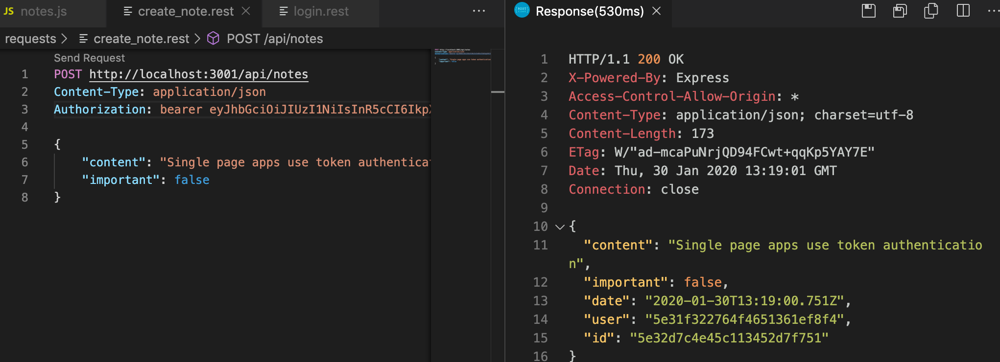
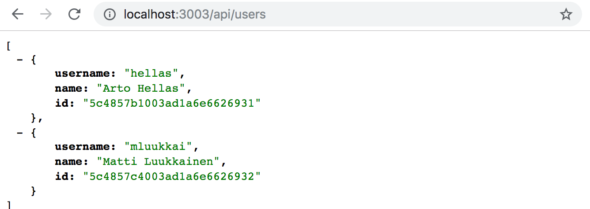
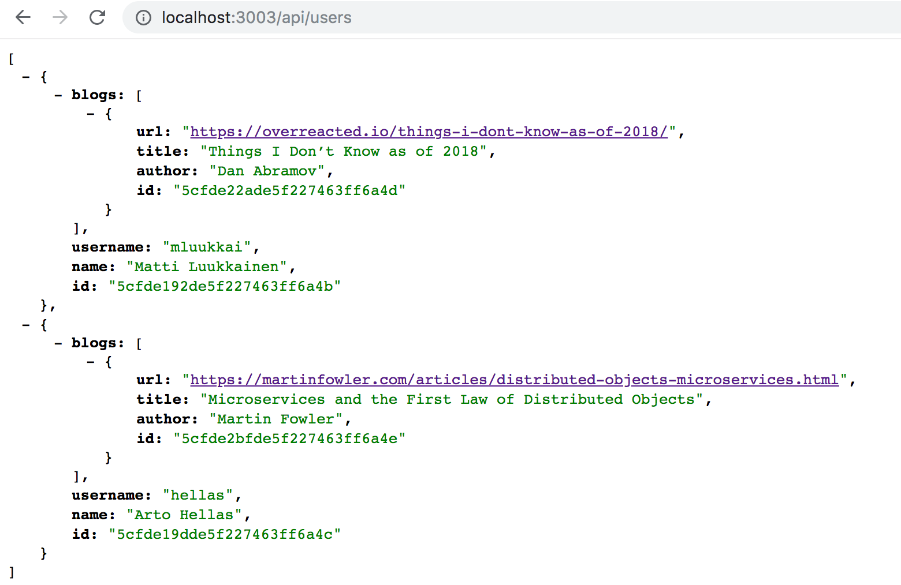

<div class="content">

Käyttäjien tulee pystyä kirjautumaan sovellukseemme ja muistiinpanot pitää automaattisesti liittää kirjautuneen käyttäjän tekemiksi.

Toteutamme nyt backendiin tuen [token-perustaiselle](https://scotch.io/tutorials/the-ins-and-outs-of-token-based-authentication#toc-how-token-based-works) autentikoinnille.

Token-autentikaation periaatetta kuvaa seuraava sekvenssikaavio:


- Alussa käyttäjä kirjautuu Reactilla toteutettua kirjautumislomaketta käyttäen
  - lisäämme kirjautumislomakkeen frontendiin [osassa 5](/osa5)
- Tämän seurauksena selaimen React-koodi lähettää käyttäjätunnuksen ja salasanan HTTP POST -pyynnöllä palvelimen osoitteeseen <i>/api/login</i>
- Jos käyttäjätunnus ja salasana ovat oikein, generoi palvelin <i>tokenin</i>, joka yksilöi jollain tavalla kirjautumisen tehneen käyttäjän
  - token on digitaalisesti allekirjoitettu, joten sen väärentäminen on (kryptografisesti) mahdotonta
- Backend vastaa selaimelle onnistumisesta kertovalla statuskoodilla ja palauttaa tokenin vastauksen mukana
- Selain tallentaa tokenin esimerkiksi React-sovelluksen tilaan
- Kun käyttäjä luo uuden muistiinpanon (tai tekee jonkin operaation, joka edellyttää tunnistautumista), lähettää React-koodi tokenin pyynnön mukana palvelimelle
- Palvelin tunnistaa pyynnön tekijän tokenin perusteella

Tehdään ensin kirjautumistoiminto. Asennetaan [jsonwebtoken](https://github.com/auth0/node-jsonwebtoken)-kirjasto, jonka avulla koodimme pystyy generoimaan [JSON web token](https://jwt.io/) -muotoisia tokeneja.

```bash
npm install jsonwebtoken
```

Tehdään kirjautumisesta vastaava koodi tiedostoon _controllers/login.js_

```js
const jwt = require('jsonwebtoken')
const bcrypt = require('bcrypt')
const loginRouter = require('express').Router()
const User = require('../models/user')

loginRouter.post('/', async (request, response) => {
  const { username, password } = request.body

  const user = await User.findOne({ username })
  const passwordCorrect = user === null
    ? false
    : await bcrypt.compare(password, user.passwordHash)

  if (!(user && passwordCorrect)) {
    return response.status(401).json({
      error: 'invalid username or password'
    })
  }

  const userForToken = {
    username: user.username,
    id: user._id,
  }

  const token = jwt.sign(userForToken, process.env.SECRET)

  response
    .status(200)
    .send({ token, username: user.username, name: user.name })
})

module.exports = loginRouter
```

Koodi aloittaa etsimällä pyynnön mukana olevaa <i>usernamea</i> vastaavan käyttäjän tietokannasta. Seuraavaksi katsotaan onko pyynnön mukana oleva <i>password</i> oikea. Koska tietokantaan ei ole talletettu salasanaa, vaan salasanasta laskettu <i>hash</i>, tehdään vertailu metodilla _bcrypt.compare_:

```js
await bcrypt.compare(body.password, user.passwordHash)
```

Jos käyttäjää ei ole olemassa tai salasana on väärä, vastataan kyselyyn statuskoodilla [401 unauthorized](https://www.w3.org/Protocols/rfc2616/rfc2616-sec10.html#sec10.4.2) ja kerrotaan syy vastauksen bodyssä.

Jos salasana on oikein, luodaan metodin _jwt.sign_ avulla token, joka sisältää digitaalisesti allekirjoitetussa muodossa käyttäjätunnuksen ja käyttäjän id:

```js
const userForToken = {
  username: user.username,
  id: user._id,
}

const token = jwt.sign(userForToken, process.env.SECRET)
```

Token on digitaalisesti allekirjoitettu käyttämällä <i>salaisuutena</i> ympäristömuuttujassa <i>SECRET</i> olevaa merkkijonoa. Digitaalinen allekirjoitus varmistaa sen, että ainoastaan salaisuuden tuntevilla on mahdollisuus generoida validi token. Ympäristömuuttujalle pitää muistaa asettaa arvo tiedostoon <i>.env</i>.

Onnistuneeseen pyyntöön vastataan statuskoodilla <i>200 ok</i> ja generoitu token sekä kirjautuneen käyttäjän käyttäjätunnus ja nimi lähetetään vastauksen bodyssä pyynnön tekijälle.

Kirjautumisesta huolehtiva koodi on vielä liitettävä sovellukseen lisäämällä tiedostoon <i>app.js</i> muiden routejen käyttöönoton yhteyteen

```js
const loginRouter = require('./controllers/login')

//...

app.use('/api/login', loginRouter)
```

Kokeillaan kirjautumista, käytetään VS Coden REST-clientiä:


Kirjautuminen ei kuitenkaan toimi, konsoli näyttää seuraavalta:

```bash
(node:32911) UnhandledPromiseRejectionWarning: Error: secretOrPrivateKey must have a value
    at Object.module.exports [as sign] (/Users/mluukkai/opetus/_2019fullstack-koodit/osa3/notes-backend/node_modules/jsonwebtoken/sign.js:101:20)
    at loginRouter.post (/Users/mluukkai/opetus/_2019fullstack-koodit/osa3/notes-backend/controllers/login.js:26:21)
(node:32911) UnhandledPromiseRejectionWarning: Unhandled promise rejection. This error originated either by throwing inside of an async function without a catch block, or by rejecting a promise which was not handled with .catch(). (rejection id: 2)
```

Ongelman aiheuttaa komento _jwt.sign(userForToken, process.env.SECRET)_ sillä ympäristömuuttujalle <i>SECRET</i> on unohtunut määritellä arvo. Kun arvo (joka saa olla mikä tahansa merkkijono) määritellään tiedostoon <i>.env</i>, alkaa kirjautuminen toimia.

Onnistunut kirjautuminen palauttaa kirjautuneen käyttäjän tiedot ja tokenin:


Virheellisellä käyttäjätunnuksella tai salasanalla kirjautuessa annetaan asianmukaisella statuskoodilla varustettu virheilmoitus


### Muistiinpanojen luominen vain kirjautuneille

Muutetaan vielä muistiinpanojen luomista siten, että luominen onnistuu ainoastaan jos luomista vastaavan pyynnön mukana on validi token. Muistiinpano talletetaan tokenin identifioiman käyttäjän tekemien muistiinpanojen listaan.

Tapoja tokenin välittämiseen selaimesta backendiin on useita. Käytämme ratkaisussamme [Authorization](https://developer.mozilla.org/en-US/docs/Web/HTTP/Headers/Authorization)-headeria. Tokenin lisäksi headerin avulla kerrotaan mistä [autentikointiskeemasta](https://developer.mozilla.org/en-US/docs/Web/HTTP/Authentication#Authentication_schemes) on kyse. Tämä voi olla tarpeen, jos palvelin tarjoaa useita eri tapoja autentikointiin. Skeeman ilmaiseminen kertoo näissä tapauksissa palvelimelle, miten mukana olevat kredentiaalit tulee tulkita.
Meidän käyttöömme sopii <i>Bearer</i>-skeema.

Käytännössä tämä tarkoittaa, että jos token on esimerkiksi merkkijono <i>eyJhbGciOiJIUzI1NiIsInR5c2VybmFtZSI6Im1sdXVra2FpIiwiaW</i>, laitetaan pyynnöissä headerin Authorization arvoksi merkkijono

<pre>
Bearer eyJhbGciOiJIUzI1NiIsInR5c2VybmFtZSI6Im1sdXVra2FpIiwiaW
</pre>

Muistiinpanojen luominen muuttuu seuraavasti:

```js
const jwt = require('jsonwebtoken') //highlight-line

// ...
  //highlight-start
const getTokenFrom = request => {
  const authorization = request.get('authorization')
  if (authorization && authorization.toLowerCase().startsWith('bearer ')) {
    return authorization.substring(7)
  }
  return null
}
  //highlight-end

notesRouter.post('/', async (request, response) => {
  const body = request.body
//highlight-start
  const token = getTokenFrom(request)

  const decodedToken = jwt.verify(token, process.env.SECRET)
  if (!token || !decodedToken.id) {
    return response.status(401).json({ error: 'token missing or invalid' })
  }

  const user = await User.findById(decodedToken.id)
//highlight-end

  const note = new Note({
    content: body.content,
    important: body.important === undefined ? false : body.important,
    date: new Date(),
    user: user._id
  })

  const savedNote = await note.save()
  user.notes = user.notes.concat(savedNote._id)
  await user.save()

  response.json(savedNote.toJSON())
})
```

Apufunktio _getTokenFrom_ eristää tokenin headerista <i>authorization</i>. Tokenin oikeellisuus varmistetaan metodilla _jwt.verify_. Metodi myös dekoodaa tokenin, eli palauttaa olion, jonka perusteella token on laadittu:

```js
const decodedToken = jwt.verify(token, process.env.SECRET)
```

Tokenista dekoodatun olion sisällä on kentät <i>username</i> ja <i>id</i> eli se kertoo palvelimelle kuka pyynnön on tehnyt.

Jos tokenia ei ole tai tokenista dekoodattu olio ei sisällä käyttäjän identiteettiä (eli _decodedToken.id_ ei ole määritelty), palautetaan virheestä kertova statuskoodi [401 unauthorized](https://www.w3.org/Protocols/rfc2616/rfc2616-sec10.html#sec10.4.2) ja kerrotaan syy vastauksen bodyssä:

```js
if (!token || !decodedToken.id) {
  return response.status(401).json({
    error: 'token missing or invalid'
  })
}
```

Kun pyynnön tekijän identiteetti on selvillä, jatkuu suoritus entiseen tapaan.

Uuden muistiinpanon luominen onnistuu nyt postmanilla jos <i>authorization</i>-headerille asetetaan oikeanlainen arvo, eli merkkijono <i>bearer eyJhbGciOiJIUzI1NiIsInR5cCI6IkpXVCJ</i>, missä loppuosa on <i>login</i>-operaation palauttama token.

Postmanilla luominen näyttää seuraavalta


ja Visual Studio Coden REST clientillä



### Poikkeusten käsittely

Tokenin verifiointi voi myös aiheuttaa poikkeuksen <i>JsonWebTokenError</i>. Jos esim. poistetaan tokenista pari merkkiä, ja yritetään luoda muistiinpano, tapahtuu seuraavasti

```bash
JsonWebTokenError: invalid signature
    at /Users/mluukkai/opetus/_2019fullstack-koodit/osa3/notes-backend/node_modules/jsonwebtoken/verify.js:126:19
    at getSecret (/Users/mluukkai/opetus/_2019fullstack-koodit/osa3/notes-backend/node_modules/jsonwebtoken/verify.js:80:14)
    at Object.module.exports [as verify] (/Users/mluukkai/opetus/_2019fullstack-koodit/osa3/notes-backend/node_modules/jsonwebtoken/verify.js:84:10)
    at notesRouter.post (/Users/mluukkai/opetus/_2019fullstack-koodit/osa3/notes-backend/controllers/notes.js:40:30)
```

Syynä tokenin dekoodaamisen aiheuttamalle virheelle on monia. Token voi olla viallinen, kuten esimerkissämme, väärennetty tai eliniältään vanhentunut. Laajennetaan virheidenkäsittelymiddlewarea huomioimaan tokenin dekoodaamisen aiheuttamat virheet

```js
const unknownEndpoint = (request, response) => {
  response.status(404).send({ error: 'unknown endpoint' })
}

const errorHandler = (error, request, response, next) => {
  if (error.name === 'CastError') {
    return response.status(400).send({
      error: 'malformatted id'
    })
  } else if (error.name === 'ValidationError') {
    return response.status(400).json({
      error: error.message 
    })
  } else if (error.name === 'JsonWebTokenError') {  // highlight-line
    return response.status(401).json({ // highlight-line
      error: 'invalid token' // highlight-line
    }) // highlight-line
  }

  logger.error(error.message)

  next(error)
}
```

Sovelluksen tämänhetkinen koodi on kokonaisuudessaan [githubissa](https://github.com/fullstack-hy2020/part3-notes-backend/tree/part4-9), branchissä <i>part4-9</i>.

Jos sovelluksessa on useampia rajapintoja jotka vaativat kirjautumisen, kannattaa JWT:n validointi eriyttää omaksi middlewarekseen, tai käyttää jotain jo olemassa olevaa kirjastoa kuten [express-jwt](https://github.com/auth0/express-jwt).


### Token-perustaisen kirjautumisen ongelmat

Token-kirjautuminen on helppo toteuttaa, mutta se sisältää yhden ongelman. Kun API:n asiakas, esim. webselaimessa toimiva React-sovellus saa tokenin, luottaa API tämän jälkeen tokeniin sokeasti. Entä jos tokenin haltijalta tulisi poistaa käyttöoikeus? 

Ratkaisuja tähän on kaksi. Yksinkertaisempi on asettaa tokenille voimassaoloaika:

```js
loginRouter.post('/', async (request, response) => {
  const { username, password } = request.body

  const user = await User.findOne({ username })
  const passwordCorrect = user === null
    ? false
    : await bcrypt.compare(password, user.passwordHash)

  if (!(user && passwordCorrect)) {
    return response.status(401).json({
      error: 'invalid username or password'
    })
  }

  const userForToken = {
    username: user.username,
    id: user._id,
  }

  // token expires in 60*60 seconds, that is, in one hour
  // highlight-start
  const token = jwt.sign(
    userForToken, 
    process.env.SECRET,
    { expiresIn: 60*60 }
  )
  // highlight-end

  response
    .status(200)
    .send({ token, username: user.username, name: user.name })
})
```

Kun tokenin voimassaoloaika päättyy, on asiakassovelluksen hankittava uusi token esim. pakottamalla käyttäjä kirjaantumaan uudelleen sovellukseen. 

Virheenkäsittelijämiddleware tulee laajentaa siten, että se antaa vanhentuneen tokenin tapauksessa asianmukaisen virheilmoituksen:

```js
const errorHandler = (error, request, response, next) => {
  logger.error(error.message)

  if (error.name === 'CastError') {
    return response.status(400).send({ error: 'malformatted id' })
  } else if (error.name === 'ValidationError') {
    return response.status(400).json({ error: error.message })
  } else if (error.name === 'JsonWebTokenError') {
    return response.status(401).json({
      error: 'invalid token'
    })
  // highlight-start  
  } else if (error.name === 'TokenExpiredError') {
    return response.status(401).json({
      error: 'token expired'
    })
  }
  // highlight-end

  next(error)
}
```

Mitä lyhemmäksi tokenin voimassaolo asetetaan, sitä turvallisempi ratkaisu on. Eli jos token päätyy vääriin käsiin, tai käyttäjän pääsy järjestelmään tulee estää, on token käytettävissä ainoastaan rajallisen ajan. Toisaalta tokenin lyhyt voimassaolo aiheuttaa vaivaa API:n käyttäjälle. Kirjaantuminen pitää tehdä useammin.

Toinen ratkaisu on tallettaa API:ssa tietokantaan tieto jokaisesta asiakkaalle myönnetystä tokenista, ja tarkastaa jokaisen API-pyynnön yhteydessä onko käyttöoikeus edelleen voimassa. Tällöin tokenin voimassaolo voidaan tarvittaessa poistaa välittömästi. Tällaista ratkaisua kutsutaan usein <i>palvelinpuolen sessioksi</i> (engl. server side session).

Tämän ratkaisun negatiivinen puoli on sen backendiin lisäämä monimutkaisuus sekä hienoinen vaikutus suorituskykyyn. Jos tokenin voimassaolo joudutaan tarkastamaan tietokannasta, on se hitaampaa kuin tokenista itsestään tarkastettava voimassaolo. Usein tokeneita vastaava sessio, eli tieto tokenia vastaavasta käyttäjästä, talletetaankin esim. avain-arvo-periaattella toimivaan [Redis](https://redis.io/)-tietokantaan, joka on toiminnallisuudeltaan esim MongoDB:tä tai relaatiotietokantoja rajoittuneempi, mutta toimii tietynlaisissa käyttöskenaarioissa todella nopeasti.

Käytettäessä palvelinpuolen sessioita, token ei useinkaan sisällä jwt-tokenien tapaan mitään tietoa käyttäjästä (esim. käyttäjätunnusta), sen sijaan token on ainoastaan satunnainen merkkijono, jota vastaava käyttäjä haetaan palvelimella sessiot tallettavasta tietokannasta. On myös yleistä, että palvelinpuolen sessiota käytettäessä tieto käyttäjän identiteetistä välitetään Authorization-headerin sijaan evästeiden (engl. cookie) välityksellä. 

### Loppuhuomioita

Koodissa on tapahtunut paljon muutoksia ja matkan varrella on tapahtunut tyypillinen kiivaasti etenevän ohjelmistoprojektin ilmiö: suuri osa testeistä on hajonnut. Koska kurssin tämä osa on jo muutenkin täynnä uutta asiaa, jätämme testien korjailun vapaaehtoiseksi harjoitustehtäväksi.

Käyttäjätunnuksia, salasanoja ja tokenautentikaatiota hyödyntäviä sovelluksia tulee aina käyttää salatun [HTTPS](https://en.wikipedia.org/wiki/HTTPS)-yhteyden yli. Voimme käyttää sovelluksissamme Noden [HTTP](https://nodejs.org/docs/latest-v8.x/api/http.html)-serverin sijaan [HTTPS](https://nodejs.org/api/https.html)-serveriä (se vaatii lisää konfiguraatiota). Toisaalta koska sovelluksemme tuotantoversio on Herokussa, sovelluksemme pysyy käyttäjien kannalta suojattuna sen ansiosta, että Heroku reitittää kaiken liikenteen selaimen ja Herokun palvelimien välillä HTTPS:n yli.

Toteutamme kirjautumisen frontendin puolelle kurssin [seuraavassa osassa](/osa5).

</div>

<div class="tasks">

### Tehtävät 4.15.-4.23.

Seuraavien tehtävien myötä Blogilistalle luodaan käyttäjienhallinnan perusteet. Varminta on seurata melko tarkkaan osan 4 luvusta [Käyttäjien hallinta](/osa4/kayttajien_hallinta) ja [Token-perustainen kirjautuminen](/osa4/token_perustainen_kirjautuminen) etenevää tarinaa. Toki luovuus on sallittua.

**Varoitus vielä kerran:** jos huomaat kirjoittavasi sekaisin async/awaitia ja _then_-kutsuja, on 99% varmaa, että teet jotain väärin. Käytä siis jompaa kumpaa tapaa, älä missään tapauksessa "varalta" molempia.

#### 4.15: blogilistan laajennus, step3

Tee sovellukseen mahdollisuus luoda käyttäjiä tekemällä HTTP POST -pyyntö osoitteeseen <i>api/users</i>. Käyttäjillä on <i>käyttäjätunnus, salasana ja nimi</i>.

Älä talleta tietokantaan salasanoja selväkielisenä vaan käytä osan 4 luvun [Käyttäjien luominen](/osa4/kayttajien_hallinta#kayttajien-luominen) tapaan <i>bcrypt</i>-kirjastoa.

**HUOM** joillain windows-käyttäjillä on ollut ongelmia <i>bcryptin</i> kanssa. Jos törmäät ongelmiin, poista kirjasto komennolla

```bash
npm uninstall bcrypt
```

ja asenna sen sijaan [bcryptjs](https://www.npmjs.com/package/bcryptjs)

Tee järjestelmään myös mahdollisuus katsoa kaikkien käyttäjien tiedot sopivalla HTTP-pyynnöllä.

Käyttäjien lista voi näyttää esim. seuraavalta:



#### 4.16*: blogilistan laajennus, step4

Laajenna käyttäjätunnusten luomista siten, että käyttäjätunnuksen sekä salasanan tulee olla olemassa ja vähintään 3 merkkiä pitkiä. Käyttäjätunnuksen on oltava järjestelmässä uniikki.

Luomisoperaation tulee palauttaa sopiva statuskoodi ja jonkinlainen virheilmoitus, jos yritetään luoda epävalidi käyttäjä.

**HUOM** älä testaa salasanaan liittyviä ehtoja Mongoosen validointien avulla, se ei ole hyvä idea, sillä backendin vastaanottama salasana ja kantaan tallennettu salasanan tiiviste eivät ole sama asia. Salasanan oikeellisuus kannattaa testata kontrollerissa samoin kun teimme [osassa 3](/osa3/validointi_ja_es_lint) ennen validointien käyttöönottoa.

Tee myös testit, jotka varmistavat, että virheellisiä käyttäjiä ei luoda, ja että virheellisen käyttäjän luomisoperaatioon vastaus on järkevä statuskoodin ja virheilmoituksen osalta.

#### 4.17: blogilistan laajennus, step5

Laajenna blogia siten, että blogiin tulee tieto sen lisänneestä käyttäjästä.

Muokkaa blogien lisäystä osan 4 luvun [populate](/osa4/kayttajien_hallinta#populate) tapaan siten, että blogin lisäämisen yhteydessä määritellään blogin lisääjäksi <i>joku</i> järjestelmän tietokannassa olevista käyttäjistä (esim. ensimmäisenä löytyvä). Tässä vaiheessa ei ole väliä kuka käyttäjistä määritellään lisääväksi. Toiminnallisuus viimeistellään tehtävässä 4.19.

Muokkaa kaikkien blogien listausta siten, että blogien yhteydessä näytetään lisääjän tiedot:


ja käyttäjien listausta siten että käyttäjien lisäämät blogit ovat näkyvillä



#### 4.18: blogilistan laajennus, step6

Toteuta osan 4 luvun [Token-perustainen kirjautuminen](/osa4/token_perustainen_kirjautuminen) tapaan järjestelmään token-perustainen autentikointi.

#### 4.19: blogilistan laajennus, step7

Muuta blogien lisäämistä siten, että se on mahdollista vain, jos lisäyksen tekevässä HTTP POST -pyynnössä on mukana validi token. Tokenin haltija määritellään blogin lisääjäksi.

#### 4.20*: blogilistan laajennus, step8

Osan 4 [esimerkissä](/osa4/token_perustainen_kirjautuminen#muistiinpanojen-luominen-vain-kirjautuneille) token otetaan headereista apufunktion _getTokenFrom_ avulla.

Jos käytit samaa ratkaisua, refaktoroi tokenin erottaminen [middlewareksi](/osa3/node_js_ja_express#middlewaret), joka ottaa tokenin <i>Authorization</i>-headerista ja sijoittaa sen <i>request</i>-olion kenttään <i>token</i>.

Eli kun rekisteröit middlewaren ennen routeja tiedostossa <i>app.js</i>

```js
app.use(middleware.tokenExtractor)
```

pääsevät routet tokeniin käsiksi suoraan viittaamalla _request.token_:

```js
blogsRouter.post('/', async (request, response) => {
  // ..
  const decodedToken = jwt.verify(request.token, process.env.SECRET)
  // ..
})
```

Muista, että normaali  [middleware](/osa3/node_js_ja_express#middlewaret) on funktio, jolla on kolme parametria, ja joka kutsuu lopuksi parametrina next olevaa funktiota:

```js
const tokenExtractor = (request, response, next) => {
  // tokenin ekstraktoiva koodi

  next()
}
```

#### 4.21*: blogilistan laajennus, step9

Muuta blogin poistavaa operaatiota siten, että poisto onnistuu ainoastaan jos poisto-operaation tekijä (eli se kenen token on pyynnön mukana) on sama kuin blogin lisääjä.

Jos poistoa yritetään ilman tokenia tai väärän käyttäjän toimesta, tulee operaation palauttaa asiaan kuuluva statuskoodi.

Huomaa, että jos haet blogin tietokannasta

```js
const blog = await Blog.findById(...)
```

ei kenttä <i>blog.user</i> ole tyypiltään merkkijono vaan <i>object</i>. Eli jos haluat verrata kannasta haetun olion id:tä merkkijonomuodossa olevaan id:hen, ei normaali vertailu toimi. Kannasta haettu id tulee muuttaa vertailua varten merkkijonoksi:

```js
if ( blog.user.toString() === userid.toString() ) ...
```

<!---
note left of kayttaja
  käyttäjä täyttää kirjautumislomakkeelle
  käyttäjätunnuksen ja salasanan
end note
kayttaja -> selain: painetaan login-nappia

selain -> backend: HTTP POST /api/login {username, password}
note left of backend
  backend generoi käyttäjän identifioivan TOKENin
end note
backend -> selain: TOKEN palautetaan vastauksen bodyssä
note left of selain
  selain tallettaa TOKENin
end note
note left of kayttaja
  käyttäjä luo uden muistiinpanon
end note
kayttaja -> selain: painetaan create note -nappia
selain -> backend: HTTP POST /api/notes {content} headereissa TOKEN
note left of backend
  backend tunnistaa TOKENin perusteella kuka käyttää kyseessä
end note

backend -> selain: 201 created

kayttaja -> kayttaja:
-->


#### 4.22*:  blogilistan laajennus, step10

Sekä uuden blogin luonnin että blogin poistamisen yhteydessä on selvitettävä operaation tekevän käyttäjän identiteetti. Tätä auttaa jo tehtävässä 4.20 tehty middleware _tokenExtractor_. Tästä huolimatta <i>post</i>- ja <i>delete</i>-käsittelijöissä tulee vielä selvittää tokenia vastaava käyttäjä.

Tee nyt uusi middleware _userExtractor_, joka selvittää pyyntöön liittyvän käyttäjän ja sijoittaa sen request-olioon. Eli kun rekisteröit middlewaren ennen routeja tiedostossa <i>app.js</i>

```js
app.use(middleware.userExtractor)
```

pääsevät routet käyttäjään käsiksi suoraan viittaamalla _request.user_:


```js
blogsRouter.post('/', async (request, response) => {
  // get user from request object
  const user = request.user
  // ..
})

blogsRouter.delete('/:id', async (request, response) => {
  // get user from request object
  const user = request.user
  // ..
})
```

Huomaa, että on mahdollista rekisteröidä middleware suoritettavaksi vain osassa tapauksista. Eli sen sijaan, että _userExtractor_-middlewarea käytettäisiin aina

```js
// use the middleware in all routes
app.use(userExtractor) // highlight-line

app.use('/api/blogs', blogsRouter)  
app.use('/api/users', usersRouter)
app.use('/api/login', loginRouter)
```

voidaan määritellä, että se suoritetaan ainoastaan polun <i>/api/blogs</i> routeissa: 

```js
// use the middleware only in /api/blogs routes
app.use('/api/blogs', userExtractor, blogsRouter) // highlight-line
app.use('/api/users', usersRouter)
app.use('/api/login', loginRouter)
```

Tämä siis tapahtuu ketjuttamalla useampi middleware funktion <i>use</i> parametriksi. Middlewareja voitaisiin samaan tapaan rekisteröidä myös ainoastaan yksittäisten routejen yhteyteen:

```js
router.post('/', userExtractor, async (request, response) => {
  // ...
}
```

#### 4.23*: blogilistan laajennus, step11

Token-kirjautumisen lisääminen valitettavasti hajotti blogien lisäämiseen liittyvät testit. Korjaa testit. Tee myös testi, joka varmistaa että uuden blogin lisäys ei onnistu, ja pyyntö palauttaa oikean statuskoodin <i>401 Unauthorized</i> jos pyynnön mukana ei ole tokenia.

Tarvitset luultavasti [tätä](https://github.com/visionmedia/supertest/issues/398) tietoa tehtävää tehdessä.

Tämä oli osan viimeinen tehtävä ja on aika pushata koodi GitHubiin sekä merkata tehdyt tehtävät [palautussovellukseen](https://studies.cs.helsinki.fi/stats/courses/fullstackopen).

</div>
