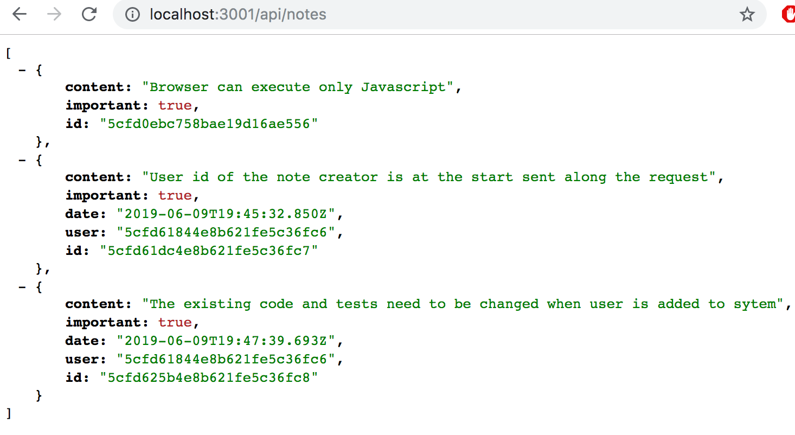
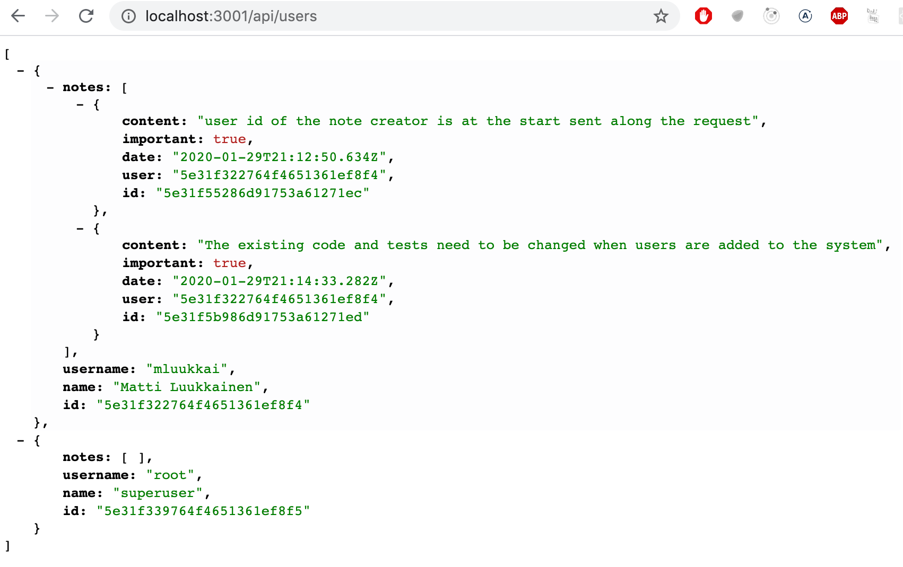
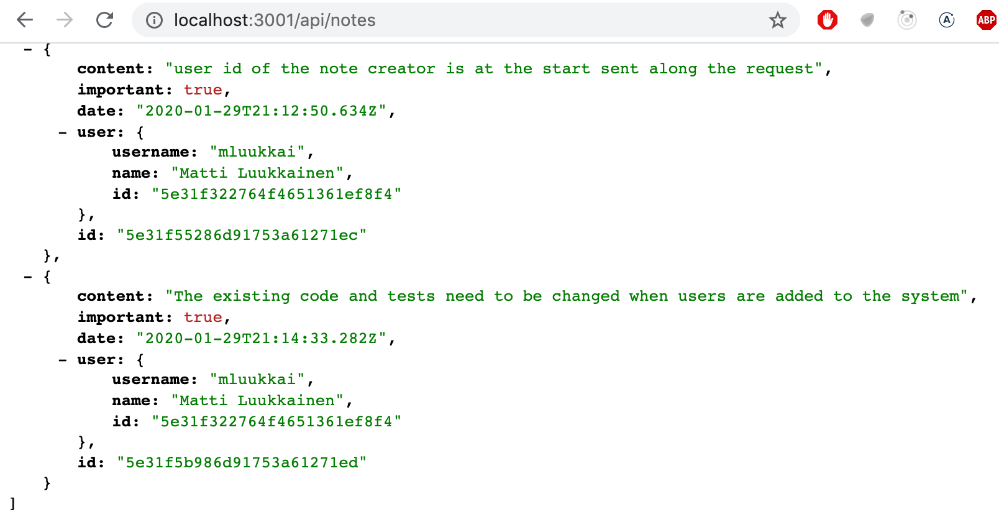

<div class="content">


<!-- We want to add user authentication and authorization to our application. Users should be stored in the database and every note should be linked to the user who created it. Deleting and editing a note should only be allowed for the user who created it.-->
 我们想在我们的应用中加入用户认证和授权。用户应该存储在数据库中，每个笔记应该与创建它的用户相联系。删除和编辑一个笔记应该只允许创建它的用户使用。


<!-- Let's start by adding information about users to the database. There is a one-to-many relationship between the user (<i>User</i>) and notes (<i>Note</i>):-->
 让我们先把用户的信息添加到数据库中。在用户（<i>User</i>）和笔记（<i>Note</i>）之间有一个一对多的关系。


<!-- If we were working with a relational database the implementation would be straightforward. Both resources would have their separate database tables, and the id of the user who created a note would be stored in the notes table as a foreign key.-->
 如果我们使用的是关系型数据库，实现起来就很简单了。这两种资源都有各自独立的数据库表，而创建笔记的用户的ID将作为外键存储在笔记表中。


<!-- When working with document databases the situation is a bit different, as there are many different ways of modeling the situation.-->
当使用文档数据库时，情况就有点不同了，因为有许多不同的建模方式。


<!-- The existing solution saves every note in the <i>notes collection</i> in the database. If we do not want to change this existing collection, then the natural choice is to save users in their own collection,  <i>users</i> for example.-->
 现有的解决方案将每个笔记保存在数据库的<i>笔记集合</i>中。如果我们不想改变这个现有的集合，那么自然的选择是将用户保存在他们自己的集合中，例如<i>users</i>。


<!-- Like with all document databases, we can use object id's in Mongo to reference documents in other collections. This is similar to using foreign keys in relational databases.-->
 和所有的文档数据库一样，我们可以在Mongo中使用对象ID's来引用其他集合中的文档。这类似于在关系型数据库中使用外键。


<!-- Traditionally document databases like Mongo do not support  <i>join queries</i> that are available in relational databases,  used for aggregating data from multiple tables. However starting from version 3.2. Mongo has supported [lookup aggregation queries](https://docs.mongodb.com/manual/reference/operator/aggregation/lookup/). We will not be taking a look at this functionality in this course.-->
 传统上，像Mongo这样的文档数据库不支持关系型数据库中的<i>join查询</i>，这些查询用于聚合多个表的数据。但是从3.2版本开始。Mongo已经支持[查找聚合查询](https://docs.mongodb.com/manual/reference/operator/aggregation/lookup/)。在本课程中，我们将不看这个功能。


<!-- If we need a functionality similar to join queries, we will implement it in our application code by making multiple queries. In certain situations Mongoose can take care of joining and aggregating data, which gives the appearance of a join query. However, even in these situations Mongoose makes multiple queries to the database in the background.-->
 如果我们需要类似于连接查询的功能，我们将在我们的应用代码中通过进行多次查询来实现它。在某些情况下，Mongoose可以负责连接和聚合数据，这给人以连接查询的感觉。然而，即使在这些情况下，Mongoose也会在后台对数据库进行多次查询。


### References across collections


<!-- If we were using a relational database the note would contain a <i>reference key</i> to the user who created it. In document databases we can do the same thing.-->
 如果我们使用的是关系型数据库，笔记会包含一个<i>参考键</i>，指向创建它的用户。在文档数据库中，我们可以做同样的事情。


<!-- Let's assume that the <i>users</i> collection contains two users:-->
 我们假设<i>users</i>集合包含两个用户。

```js
[
  {
    username: 'mluukkai',
    _id: 123456,
  },
  {
    username: 'hellas',
    _id: 141414,
  },
];
```


<!-- The <i>notes</i> collection contains three notes that all have a <i>user</i> field that references a user in the <i>users</i> collection:-->
 <i>notes</i>集合包含三个笔记，它们都有一个<i>user</i>字段，引用<i>users</i>集合中的一个用户。

```js
[
  {
    content: 'HTML is easy',
    important: false,
    _id: 221212,
    user: 123456,
  },
  {
    content: 'The most important operations of HTTP protocol are GET and POST',
    important: true,
    _id: 221255,
    user: 123456,
  },
  {
    content: 'A proper dinosaur codes with Java',
    important: false,
    _id: 221244,
    user: 141414,
  },
]
```


<!-- Document databases do not demand the foreign key to be stored in the note resources, it could <i>also</i> be stored in the users collection, or even both:-->
 文档数据库并不要求外键存储在笔记资源中，它可以<i>也</i>存储在用户集合中，甚至可以同时存储。

```js
[
  {
    username: 'mluukkai',
    _id: 123456,
    notes: [221212, 221255],
  },
  {
    username: 'hellas',
    _id: 141414,
    notes: [221244],
  },
]
```


<!-- Since users can have many notes, the related ids are stored in an array in the <i>notes</i> field.-->
 由于用户可以有很多笔记，相关的ID被存储在<i>notes</i>字段的数组中。


<!-- Document databases also offer a radically different way of organizing the data: In some situations it might be beneficial to nest the entire notes array as a part of the documents in the users collection:-->
 文档数据库也提供了一种完全不同的组织数据的方式。在某些情况下，将整个笔记数组嵌套为用户集合中的文档的一部分可能是有益的。

```js
[
  {
    username: 'mluukkai',
    _id: 123456,
    notes: [
      {
        content: 'HTML is easy',
        important: false,
      },
      {
        content: 'The most important operations of HTTP protocol are GET and POST',
        important: true,
      },
    ],
  },
  {
    username: 'hellas',
    _id: 141414,
    notes: [
      {
        content:
          'A proper dinosaur codes with Java',
        important: false,
      },
    ],
  },
]
```


<!-- In this schema notes would be tightly nested under users and the database would not generate ids for them.-->
 在这种模式下，笔记将被紧密地嵌套在用户之下，数据库不会为它们生成ID。


<!-- The structure and schema of the database is not as self-evident as it was with relational databases. The chosen schema must be one which supports the use cases of the application the best. This is not a simple design decision to make, as all use cases of the applications are not known when the design decision is made.-->
 数据库的结构和模式并不像关系型数据库那样不言自明。所选择的模式必须是最能支持应用的用例的模式。这不是一个简单的设计决策，因为在做出设计决策时，应用的所有用例都是未知的。

<!-- Paradoxically, schema-less databases like Mongo require developers to make far more radical design decisions about data organization at the beginning of the project than relational databases with schemas. On average, relational databases offer a more-or-less suitable way of organizing data for many applications.-->
 矛盾的是，像Mongo这样的无模式数据库要求开发者在项目开始时对数据组织做出比有模式的关系数据库更激进的设计决定。平均来说，关系型数据库为许多应用提供了一种或多或少合适的数据组织方式。

### Mongoose schema for users

<!-- In this case, we make the decision to store the ids of the notes created by the user in the user document. Let's define the model for representing a user in the <i>models/user.js</i> file:-->
 在这种情况下，我们决定将用户创建的笔记的ID存储在用户文档中。让我们在<i>models/user.js</i>文件中定义代表一个用户的模型。

```js
const mongoose = require('mongoose')

const userSchema = new mongoose.Schema({
  username: String,
  name: String,
  passwordHash: String,
  notes: [
    {
      type: mongoose.Schema.Types.ObjectId,
      ref: 'Note'
    }
  ],
})

userSchema.set('toJSON', {
  transform: (document, returnedObject) => {
    returnedObject.id = returnedObject._id.toString()
    delete returnedObject._id
    delete returnedObject.__v
    // the passwordHash should not be revealed
    delete returnedObject.passwordHash
  }
})

const User = mongoose.model('User', userSchema)

module.exports = User
```

<!-- The ids of the notes are stored within the user document as an array of Mongo ids. The definition is as follows:-->
 笔记的id以Mongo id数组的形式存储在用户文档中。其定义如下。

```js
{
  type: mongoose.Schema.Types.ObjectId,
  ref: 'Note'
}
```

<!-- The type of the field is <i>ObjectId</i> that references <i>note</i>-style documents. Mongo does not inherently know that this is a field that references notes, the syntax is purely related to and defined by Mongoose.-->
该字段的类型是<i>ObjectId</i>，引用<i>note</i>式文档。Mongo本身并不知道这是一个引用笔记的字段，这个语法纯粹是与Mongoose有关，并由Mongoose定义。

<!-- Let's expand the schema of the note defined in the <i>models/note.js</i> file so that the note contains information about the user who created it:-->
 让我们扩展<i>models/note.js</i>文件中定义的笔记模式，使笔记包含创建它的用户的信息。

```js
const noteSchema = new mongoose.Schema({
  content: {
    type: String,
    required: true,
    minlength: 5
  },
  date: Date,
  important: Boolean,
  // highlight-start
  user: {
    type: mongoose.Schema.Types.ObjectId,
    ref: 'User'
  }
  // highlight-end
})
```

<!-- In stark contrast to the conventions of relational databases, <i>references are now stored in both documents</i>: the note references the user who created it, and the user has an array of references to all of the notes created by them.-->
 与关系型数据库的惯例形成鲜明对比的是，<i>引用现在被存储在两个文件中</i>：笔记引用了创建它的用户，而用户有一个数组，引用了他们创建的所有笔记。

### Creating users

<!-- Let's implement a route for creating new users. Users have a unique <i>username</i>, a <i>name</i> and something called a <i>passwordHash</i>. The password hash is the output of a [one-way hash function](https://en.wikipedia.org/wiki/Cryptographic_hash_function) applied to the user's password. It is never wise to store unencrypted plain text passwords in the database!-->
 让我们实现一个创建新用户的路线。用户有一个唯一的<i>用户名</i>、<i>名字</i>和一个叫做<i>密码哈希</i>的东西。密码散列是应用于用户密码的[单向散列函数](https://en.wikipedia.org/wiki/Cryptographic_hash_function)的输出。在数据库中存储未加密的纯文本密码是不明智的!

<!-- Let's install the [bcrypt](https://github.com/kelektiv/node.bcrypt.js) package for generating the password hashes:-->
 让我们安装[bcrypt](https://github.com/kelektiv/node.bcrypt.js)软件包来生成密码散列。

```bash
npm install bcrypt
```

<!-- Creating new users happens in compliance with the RESTful conventions discussed in [part 3](/en/part3/node_js_and_express#rest), by making an HTTP POST request to the <i>users</i> path.-->
 创建新的用户是按照[第三章节](/en/part3/node_js_and_express#rest)中讨论的RESTful惯例进行的，通过向<i>users</i>路径发出HTTP POST请求。

<!-- Let's define a separate <i>router</i> for dealing with users in a new <i>controllers/users.js</i> file. Let's take the router into use in our application in the <i>app.js</i> file, so that it handles requests made to the <i>/api/users</i> url:-->
 让我们在一个新的<i>controllers/users.js</i>文件中定义一个单独的<i>router</i>来处理用户。让我们在<i>app.js</i>文件中的应用中使用这个路由器，这样它就可以处理向<i>/api/users</i>网址发出的请求。

```js
const usersRouter = require('./controllers/users')

// ...

app.use('/api/users', usersRouter)
```

<!-- The contents of the file that defines the router are as follows:-->
 定义路由器的文件的内容如下。

```js
const bcrypt = require('bcrypt')
const usersRouter = require('express').Router()
const User = require('../models/user')

usersRouter.post('/', async (request, response) => {
  const { username, name, password } = request.body

  const saltRounds = 10
  const passwordHash = await bcrypt.hash(password, saltRounds)

  const user = new User({
    username,
    name,
    passwordHash,
  })

  const savedUser = await user.save()

  response.status(201).json(savedUser)
})

module.exports = usersRouter
```

<!-- The password sent in the request is <i>not</i> stored in the database. We store the <i>hash</i> of the password that is generated with the _bcrypt.hash_ function.-->
 请求中发送的密码<i>不</i>存储在数据库中。我们存储的是用_bcrypt.hash_函数生成的密码的<i>hash</i>。

<!-- The fundamentals of [storing passwords](https://codahale.com/how-to-safely-store-a-password/) are outside the scope of this course material. We will not discuss what the magic number 10 assigned to the [saltRounds](https://github.com/kelektiv/node.bcrypt.js/#a-note-on-rounds) variable means, but you can read more about it in the linked material.-->
 [存储密码](https://codahale.com/how-to-safely-store-a-password/)的基本原理不在本课程材料的范围之内。我们不会讨论分配给[saltRounds](https://github.com/kelektiv/node.bcrypt.js/#a-note-on-rounds)变量的神奇数字10是什么意思，但你可以在链接材料中读到更多关于它的信息。

<!-- Our current code does not contain any error handling or input validation for verifying that the username and password are in the desired format.-->
 我们目前的代码不包含任何错误处理或输入验证，以验证用户名和密码是否符合所需的格式。

<!-- The new feature can and should initially be tested manually with a tool like Postman. However testing things manually will quickly become too cumbersome, especially once we implement functionality that enforces usernames to be unique.-->
 这个新功能最初可以而且应该用像Postman这样的工具来手动测试。然而，手动测试很快就会变得非常麻烦，尤其是当我们实现了强制要求用户名是唯一的功能。

<!-- It takes much less effort to write automated tests, and it will make the development of our application much easier.-->
 编写自动化测试需要更少的努力，它将使我们的应用的开发更加容易。

<!-- Our initial tests could look like this:-->
 我们最初的测试可以是这样的。

```js
const bcrypt = require('bcrypt')
const User = require('../models/user')

//...

describe('when there is initially one user in db', () => {
  beforeEach(async () => {
    await User.deleteMany({})

    const passwordHash = await bcrypt.hash('sekret', 10)
    const user = new User({ username: 'root', passwordHash })

    await user.save()
  })

  test('creation succeeds with a fresh username', async () => {
    const usersAtStart = await helper.usersInDb()

    const newUser = {
      username: 'mluukkai',
      name: 'Matti Luukkainen',
      password: 'salainen',
    }

    await api
      .post('/api/users')
      .send(newUser)
      .expect(201)
      .expect('Content-Type', /application\/json/)

    const usersAtEnd = await helper.usersInDb()
    expect(usersAtEnd).toHaveLength(usersAtStart.length + 1)

    const usernames = usersAtEnd.map(u => u.username)
    expect(usernames).toContain(newUser.username)
  })
})
```

<!-- The tests use the <i>usersInDb()</i> helper function that we implemented in the <i>tests/test_helper.js</i> file. The function is used to help us verify the state of the database after a user is created:-->
 测试使用我们在<i>tests/test_helper.js</i>文件中实现的<i>usersInDb()</i>辅助函数。该函数用于帮助我们在创建用户后验证数据库的状态。

```js
const User = require('../models/user')

// ...

const usersInDb = async () => {
  const users = await User.find({})
  return users.map(u => u.toJSON())
}

module.exports = {
  initialNotes,
  nonExistingId,
  notesInDb,
  usersInDb,
}
```


<!-- The <i>beforeEach</i> block adds a user with the username <i>root</i> to the database. We can write a new test that verifies that a new user with the same username can not be created:-->
 <i>beforeEach</i>块将一个用户名为<i>root</i>的用户添加到数据库中。我们可以写一个新的测试，验证是否可以创建一个相同用户名的新用户。

```js
describe('when there is initially one user in db', () => {
  // ...

  test('creation fails with proper statuscode and message if username already taken', async () => {
    const usersAtStart = await helper.usersInDb()

    const newUser = {
      username: 'root',
      name: 'Superuser',
      password: 'salainen',
    }

    const result = await api
      .post('/api/users')
      .send(newUser)
      .expect(400)
      .expect('Content-Type', /application\/json/)

    expect(result.body.error).toContain('username must be unique')

    const usersAtEnd = await helper.usersInDb()
    expect(usersAtEnd).toEqual(usersAtStart)
  })
})
```

<!-- The test case obviously will not pass at this point. We are essentially practicing [test-driven development (TDD)](https://en.wikipedia.org/wiki/Test-driven_development), where tests for new functionality are written before the functionality is implemented.-->
 在这一点上，测试案例显然不会通过。我们基本上是在实践[测试驱动开发(TDD)](https://en.wikipedia.org/wiki/Test-driven_development)，即在功能实现之前编写新功能的测试。

<!-- Mongoose does not have a built-in validator for checking the uniqueness of a field. In principle we could find a ready-made solution for this from the [mongoose-unique-validator](https://www.npmjs.com/package/mongoose-unique-validator) npm package but unfortunately at the time of writing (24th Jan 2022)-->
 Mongoose没有一个内置的验证器来检查字段的唯一性。原则上，我们可以从[mongoose-unique-validator](https://www.npmjs.com/package/mongoose-unique-validator)npm包中找到一个现成的解决方案，但不幸的是，在写作时（2022年1月24日）
<!-- mongoose-unique-validator does not work with Mongoose version 6.x, so we have to implement the uniqueness check by ourselves in the controller:-->
 mongoose-unique-validator不适用于Mongoose 6.x版本，所以我们必须自己在控制器中实现唯一性检查。

```js
usersRouter.post('/', async (request, response) => {
  const { username, name, password } = request.body

// highlight-start
  const existingUser = await User.findOne({ username })
  if (existingUser) {
    return response.status(400).json({
      error: 'username must be unique'
    })
  }
  // highlight-end

  const saltRounds = 10
  const passwordHash = await bcrypt.hash(password, saltRounds)

  const user = new User({
    username,
    name,
    passwordHash,
  })

  const savedUser = await user.save()

  response.status(201).json(savedUser)
})
```

<!-- We could also implement other validations into the user creation. We could check that the username is long enough, that the username only consists of permitted characters, or that the password is strong enough. Implementing these functionalities is left as an optional exercise.-->
 我们还可以在创建用户时实现其他验证。我们可以检查用户名是否足够长，用户名是否只由允许的字符组成，或者密码是否足够强大。实现这些功能是一个可选的练习。


<!-- Before we move onward, let's add an initial implementation of a route handler that returns all of the users in the database:-->
 在我们继续前进之前，让我们添加一个路由处理程序的初始实现，以返回数据库中所有的用户。

```js
usersRouter.get('/', async (request, response) => {
  const users = await User.find({})
  response.json(users)
})
```

<!-- For making new users in a production or development environment, you may send a POST request to ```/api/users/``` via Postman or REST Client in the following format:-->
 在生产或开发环境中创建新用户，你可以通过Postman或REST客户端向```/api/users/```发送一个POST请求，格式如下。
```js
{
    "username": "root",
    "name": "Superuser",
    "password": "salainen"
}

```

<!-- The list looks like this:-->
 列表如下所示：


<!-- You can find the code for our current application in its entirety in the <i>part4-7</i> branch of [this github repository](https://github.com/fullstack-hy2020/part3-notes-backend/tree/part4-7).-->
 你可以在[这个github仓库](https://github.com/fullstack-hy2020/part3-notes-backend/tree/part4-7)的<i>part4-7</i>分支中找到我们当前应用的全部代码。

### Creating a new note

<!-- The code for creating a new note has to be updated so that the note is assigned to the user who created it.-->
 创建新笔记的代码需要更新，以便将笔记分配给创建它的用户。

<!-- Let's expand our current implementation, so that the information about the user who created a note is sent in the <i>userId</i> field of the request body:-->
 让我们扩展我们目前的实现，以便在请求体的<i>userId</i>字段中发送关于创建笔记的用户的信息。

```js
const User = require('../models/user') //highlight-line

//...

notesRouter.post('/', async (request, response, next) => {
  const body = request.body

  const user = await User.findById(body.userId) //highlight-line

  const note = new Note({
    content: body.content,
    important: body.important === undefined ? false : body.important,
    date: new Date(),
    user: user._id //highlight-line
  })

  const savedNote = await note.save()
  user.notes = user.notes.concat(savedNote._id) //highlight-line
  await user.save()  //highlight-line

  response.json(savedNote)
})
```

<!-- It's worth noting that the <i>user</i> object also changes. The <i>id</i> of the note is stored in the <i>notes</i> field:-->
 值得注意的是，<i>user</i>对象也会改变。注释的<i>id</i>被保存在<i>notes</i>字段中。

```js
const user = await User.findById(body.userId)

// ...

user.notes = user.notes.concat(savedNote._id)
await user.save()
```

<!-- Let's try to create a new note-->
 让我们试着创建一个新的笔记


<!-- The operation appears to work. Let's add one more note and then visit the route for fetching all users:-->
 该操作似乎是有效的。让我们再添加一个笔记，然后访问获取所有用户的路径。


<!-- We can see that the user has two notes.-->
 我们可以看到，该用户有两个笔记。

<!-- Likewise, the ids of the users who created the notes can be seen when we visit the route for fetching all notes:-->
 同样地，当我们访问获取所有笔记的路线时，可以看到创建笔记的用户的ID。



### Populate

<!-- We would like our API to work in such a way, that when an HTTP GET request is made to the <i>/api/users</i> route, the user objects would also contain the contents of the user's notes, and not just their id. In a relational database, this functionality would be implemented with a <i>join query</i>.-->
 我们希望我们的API能够以这样的方式工作，即当HTTP GET请求被发送到<i>/api/users</i>路由时，用户对象也将包含用户的笔记内容，而不仅仅是他们的ID。在一个关系型数据库中，这个功能将通过一个<i>连接查询</i>来实现。

<!-- As previously mentioned, document databases do not properly support join queries between collections, but the Mongoose library can do some of these joins for us. Mongoose accomplishes the join by doing multiple queries, which is different from join queries in relational databases which are <i>transactional</i>, meaning that the state of the database does not change during the time that the query is made. With join queries in Mongoose, nothing can guarantee that the state between the collections being joined is consistent, meaning that if we make a query that joins the user and notes collections, the state of the collections may change during the query.-->
 如前所述，文档数据库并不正确支持集合之间的连接查询，但Mongoose库可以为我们做一些这样的连接。Mongoose通过做多个查询来完成连接，这与关系数据库中的连接查询不同，关系数据库是<i>交易性的</i>，意味着数据库的状态在查询期间不会改变。在Mongoose的连接查询中，没有任何东西可以保证被连接的集合之间的状态是一致的，这意味着如果我们做一个连接用户和笔记集合的查询，集合的状态可能在查询过程中发生变化。


<!-- The Mongoose join is done with the [populate](http://mongoosejs.com/docs/populate.html) method. Let's update the route that returns all users first:-->
 Mongoose的连接是通过[populate](http://mongoosejs.com/docs/populate.html)方法完成的。让我们先更新返回所有用户的路线。

```js
usersRouter.get('/', async (request, response) => {
  const users = await User  // highlight-line
    .find({}).populate('notes') // highlight-line

  response.json(users)
})
```


<!-- The [populate](http://mongoosejs.com/docs/populate.html) method is chained after the <i>find</i> method making the initial query. The parameter given to the populate method defines that the <i>ids</i> referencing <i>note</i> objects in the <i>notes</i> field of the <i>user</i> document will be replaced by the referenced <i>note</i> documents.-->
 [populate](http://mongoosejs.com/docs/populate.html)方法是在进行初始查询的<i>find</i>方法之后连锁进行的。给予populate方法的参数定义了<i>ids</i>引用<i>note</i>对象在<i>user</i>文档的<i>notes</i>字段将被引用的<i>note</i>文档替换。

<!-- The result is almost exactly what we wanted:-->
结果几乎正是我们想要的。



<!-- We can use the populate parameter for choosing the fields we want to include from the documents. The selection of fields is done with the Mongo [syntax](https://docs.mongodb.com/manual/tutorial/project-fields-from-query-results/#return-the-specified-fields-and-the-id-field-only):-->
 我们可以使用populate参数来选择我们想从文档中包含的字段。字段的选择是通过Mongo的[语法](https://docs.mongodb.com/manual/tutorial/project-fields-from-query-results/#return-the-specified-fields-and-the-id-field-only)完成的。

```js
usersRouter.get('/', async (request, response) => {
  const users = await User
    .find({}).populate('notes', { content: 1, date: 1 })

  response.json(users)
});
```

<!-- The result is now exactly like we want it to be:-->
 现在的结果就像我们希望的那样。


<!-- Let's also add a suitable population of user information to notes:-->
 让我们也在笔记中添加一个合适的用户信息群。

```js
notesRouter.get('/', async (request, response) => {
  const notes = await Note
    .find({}).populate('user', { username: 1, name: 1 })

  response.json(notes)
});
```


<!-- Now the user's information is added to the <i>user</i> field of note objects.-->
 现在用户的信息被添加到笔记对象的<i>user</i>字段中。




<!-- It's important to understand that the database does not actually know that the ids stored in the <i>user</i> field of notes reference documents in the user collection.-->
 重要的是要理解，数据库实际上不知道存储在笔记的<i>user</i>字段中的id是指用户集合中的文档。

<!-- The functionality of the <i>populate</i> method of Mongoose is based on the fact that we have defined "types" to the references in the Mongoose schema with the <i>ref</i> option:-->
 Mongoose的<i>populate</i>方法的功能是基于我们用<i>ref</i>选项为Mongoose模式中的引用定义了 "类型"。

```js
const noteSchema = new mongoose.Schema({
  content: {
    type: String,
    required: true,
    minlength: 5
  },
  date: Date,
  important: Boolean,
  user: {
    type: mongoose.Schema.Types.ObjectId,
    ref: 'User'
  }
})
```

<!-- You can find the code for our current application in its entirety in the <i>part4-8</i> branch of [this github repository](https://github.com/fullstack-hy2020/part3-notes-backend/tree/part4-8).-->
 你可以在[这个github仓库](https://github.com/fullstack-hy2020/part3-notes-backend/tree/part4-8)的<i>part4-8</i>分支中找到我们当前应用的全部代码。

</div>
