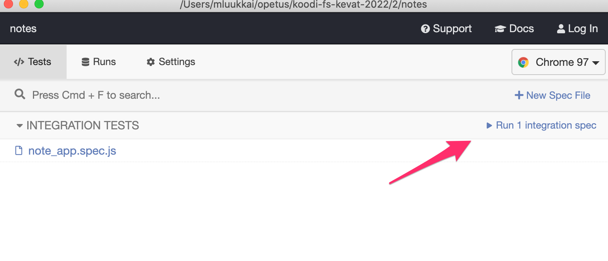
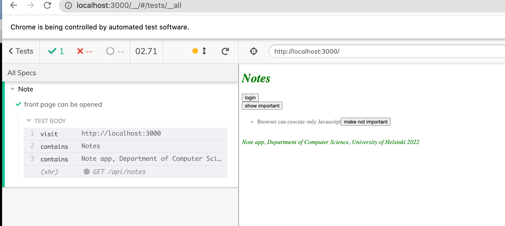
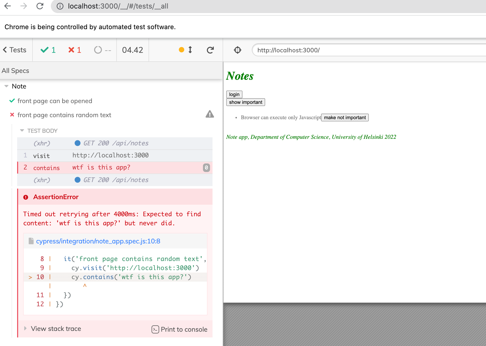
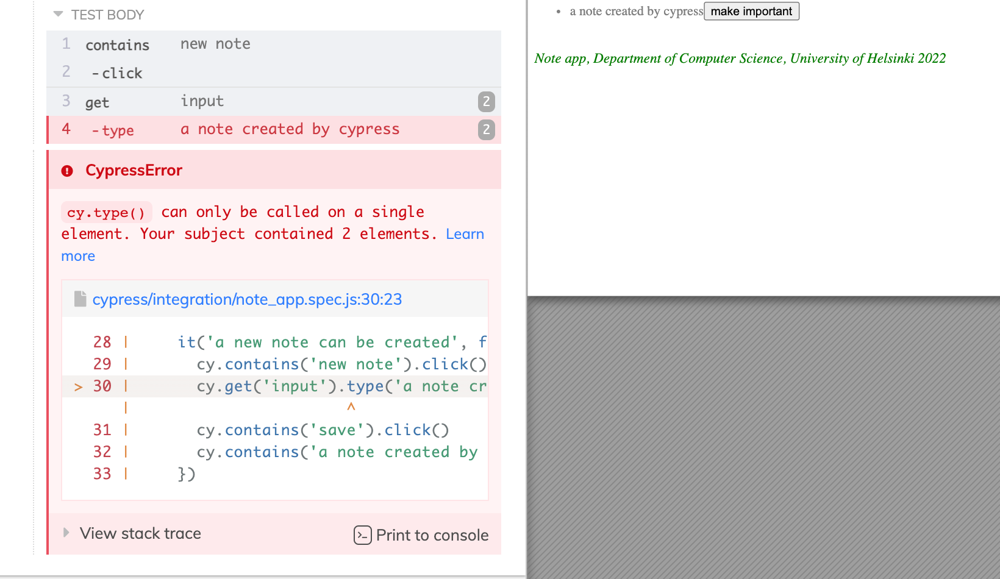
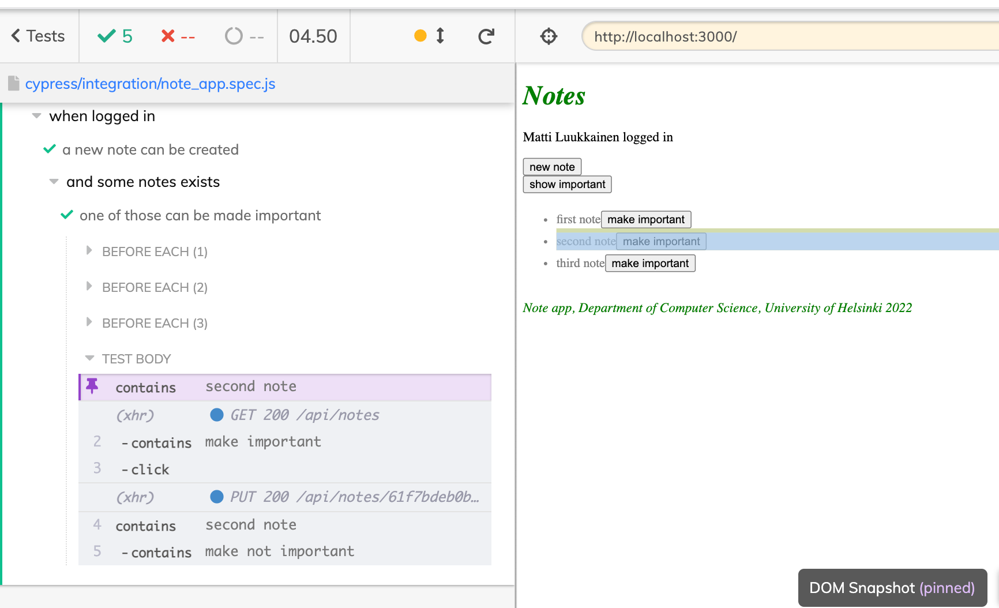
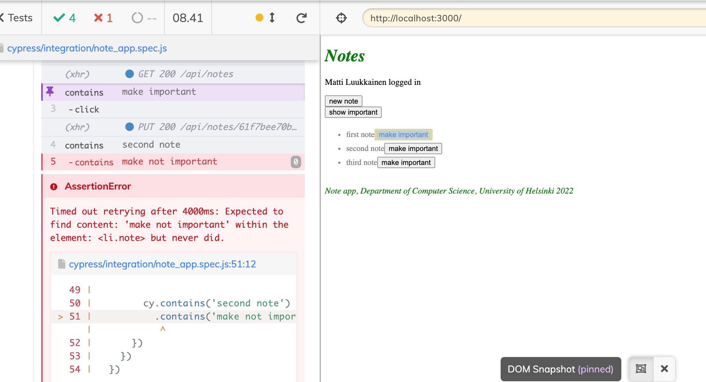
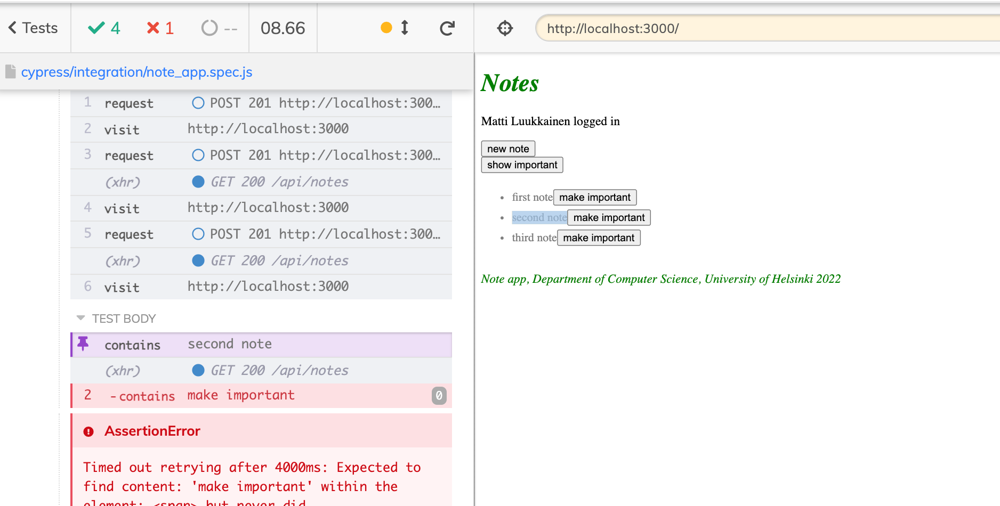
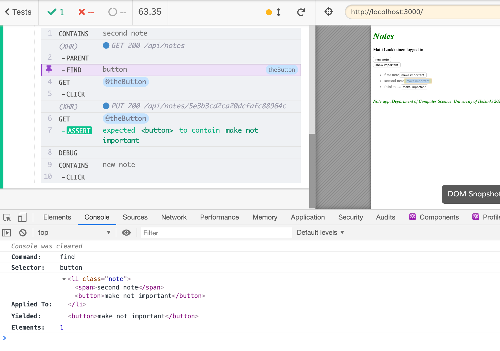
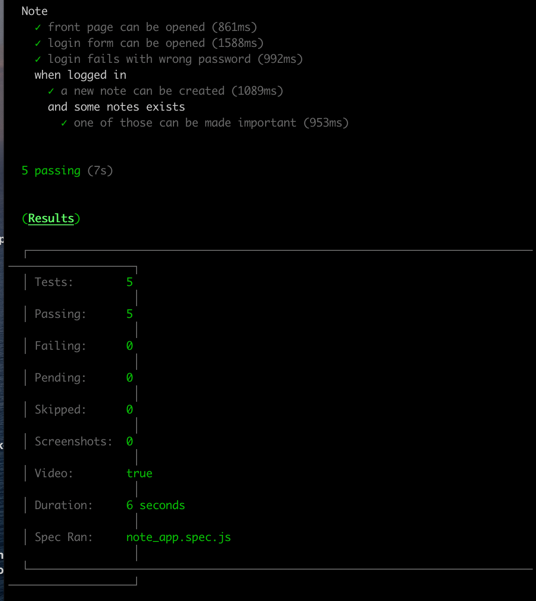

<div class="content">

Olemme tehneet backendille sitä apin tasolla kokonaisuutena testaavia integraatiotestejä ja frontendille yksittäisiä komponentteja testaavia yksikkötestejä. 

Katsotaan nyt erästä tapaa tehdä [järjestelmää kokonaisuutena](https://en.wikipedia.org/wiki/System_testing) tutkivia <i>End to End (E2E) -testejä</i>.

Web-sovellusten E2E-testaus tapahtuu käyttäen selainta jonkin kirjaston avulla. Ratkaisuja on tarjolla useita, esimerkiksi [Selenium](http://www.seleniumhq.org/), joka mahdollistaa testien automatisoinnin lähes millä tahansa selaimella. Toinen vaihtoehto on käyttää ns. [headless browseria](https://en.wikipedia.org/wiki/Headless_browser) eli selainta, jolla ei ole ollenkaan graafista käyttöliittymää. Esim. Chromea on mahdollista suorittaa Headless-moodissa.

E2E testit ovat potentiaalisesti kaikkein hyödyllisin testikategoria, sillä ne tutkivat järjestelmää saman rajapinnan kautta kuin todelliset käyttäjät.

E2E-testeihin liittyy myös ikäviä puolia. Niiden konfigurointi on haastavampaa kuin yksikkö- ja integraatiotestien. E2E-testit ovat tyypillisesti myös melko hitaita ja isommassa ohjelmistossa niiden suoritusaika voi helposti nousta minuutteihin, tai jopa tunteihin. Tämä on ikävää sovelluskehityksen kannalta, sillä sovellusta koodatessa on erittäin hyödyllistä pystyä suorittamaan testejä mahdollisimman usein koodin [regressioiden](https://en.wikipedia.org/wiki/Regression_testing) varalta. 

Ongelmana on  usein myös se, että käyttöliittymän kautta tehtävät testit saattavat olla epäluotettavia eli englanniksi [flaky](https://hackernoon.com/flaky-tests-a-war-that-never-ends-9aa32fdef359), osa testeistä menee välillä läpi ja välillä ei, vaikka koodissa ei muuttuisi mikään.

### Cypress

[Cypress](https://www.cypress.io/)-niminen E2E-testaukseen soveltuva kirjasto on kasvattanut nopeasti suosiotaan viimeisen reilun vuoden aikana. Cypress on poikkeuksellisen helppokäyttöinen, kaikenlaisen säätämisen ja tunkkaamisen määrä esim. Seleniumin käyttöön verrattuna on lähes olematon. Cypressin toimintaperiaate poikkeaa radikaalisti useimmista E2E-testaukseen sopivista kirjastoista, sillä Cypress-testit ajetaan kokonaisuudessaan selaimen sisällä. Muissa lähestymistavoissa testit suoritetaan Node-prosessissa, joka on yhteydessä selaimeen  ohjelmointirajapintojen kautta.

Tehdään tämän osan lopuksi muutamia end to end -testejä muistiinpanosovellukselle. 

Aloitetaan asentamalla Cypress <i>frontendin</i> kehitysaikaiseksi riippuvuudeksi

```js
npm install --save-dev cypress
```

ja määritellään npm-skripti käynnistämistä varten.

```js
{
  // ...
  "scripts": {
    "start": "react-scripts start",
    "build": "react-scripts build",
    "test": "react-scripts test",
    "eject": "react-scripts eject",
    "eslint": "eslint .",
    "cypress:open": "cypress open"  // highlight-line
  },
  // ...
}
```

Toisin kuin esim. frontendin yksikkötestit, Cypress-testit voidaan sijoittaa joko frontendin tai backendin repositorioon, tai vaikka kokonaan omaan repositorioonsa. 

Cypress-testit olettavat että testattava järjestelmä on käynnissä kun testit suoritetaan, eli toisin kuin esim. backendin integraatiotestit, Cypress-testit <i>eivät käynnistä</i> testattavaa järjestelmää testauksen yhteydessä.

Tehdään <i>backendille</i> npm-skripti, jonka avulla se saadaan käynnistettyä testausmoodissa, eli siten, että <i>NODE\_ENV</i> saa arvon <i>test</i>.

```js
{
  // ...
  "scripts": {
    "start": "cross-env NODE_ENV=production node index.js",
    "dev": "cross-env NODE_ENV=development nodemon index.js",
    "build:ui": "rm -rf build && cd ../../../2/luento/notes && npm run build && cp -r build ../../../3/luento/notes-backend",
    "deploy": "git push heroku master",
    "deploy:full": "npm run build:ui && git add . && git commit -m uibuild && git push && npm run deploy",
    "logs:prod": "heroku logs --tail",
    "lint": "eslint .",
    "test": "cross-env NODE_ENV=test jest --verbose --runInBand",
    "start:test": "cross-env NODE_ENV=test node index.js" // highlight-line
  },
  // ...
}
```

Kun backend ja frontend ovat käynnissä, voidaan käynnistää Cypress komennolla

```js
npm run cypress:open
```

Ensimmäisen käynnistyksen yhteydessä sovellukselle syntyy hakemisto <i>cypress</i>, jonka alihakemistoon <i>integration</i> on tarkoitus sijoittaa testit. Cypress luo valmiiksi joukon esimerkkitestejä kyseiseen hakemistoon. Poistetaan esimerkit ja luodaan ensimmäinen oma testi tiedostoon <i>note\_app.spec.js</i>:

```js
describe('Note ', function() {
  it('front page can be opened', function() {
    cy.visit('http://localhost:3000')
    cy.contains('Notes')
    cy.contains('Note app, Department of Computer Science, University of Helsinki 2022')
  })
})
```

Testin suoritus käynnistetään avautuneesta ikkunasta:



**HUOM**: saatat joutua käynnistämään Cypressin uudelleen sen jälkeen kun poistat esimerkkitestit.

Testin suoritus avaa selaimen ja näyttää miten sovellus käyttäytyy testin edetessä:



Testi näyttää rakenteeltaan melko tutulta. <i>describe</i>-lohkoja käytetään samaan tapaan kuin Jestissä ryhmittelemään yksittäisiä testitapauksia, jotka on määritelty <i>it</i>-metodin avulla. Nämä osat Cypress on lainannut sisäisesti käyttämältään [Mocha](https://mochajs.org/)-testikirjastolta.  

[cy.visit](https://docs.cypress.io/api/commands/visit.html) ja [cy.contains](https://docs.cypress.io/api/commands/contains.html) taas ovat Cypressin komentoja, joiden merkitys on aika ilmeinen. [cy.visit](https://docs.cypress.io/api/commands/visit.html) avaa testin käyttämään selaimeen parametrina määritellyn osoitteen ja [cy.contains](https://docs.cypress.io/api/commands/contains.html) etsii sivun sisältä parametrina annetun tekstin. 

Olisimme voineet määritellä testin myös käyttäen nuolifunktioita

```js
describe('Note app', () => { // highlight-line
  it('front page can be opened', () => { // highlight-line
    cy.visit('http://localhost:3000')
    cy.contains('Notes')
    cy.contains('Note app, Department of Computer Science, University of Helsinki 2022')
  })
})
```

Mochan dokumentaatio kuitenkin [suosittelee](https://mochajs.org/#arrow-functions) että nuolifunktioita ei käytetä, ne saattavat aiheuttaa ongelmia joissain tilanteissa.

HUOM: tässä materiaalissa suoritetaan Cypress-testejä pääasiassa graafisen test runnerin kautta. Testit on luonnollisesti mahdollista suorittaa myös [komentoriviltä](https://docs.cypress.io/guides/guides/command-line.html), komennolla <em>cypress run</em>, joka kannattaa halutessa lisätä npm-skriptiksi.

Jos komento <i>cy.contains</i> ei löydä sivulta etsimäänsä tekstiä, testi ei mene läpi. Eli jos laajennamme testiä seuraavasti

```js
describe('Note app', function() {
  it('front page can be opened',  function() {
    cy.visit('http://localhost:3000')
    cy.contains('Notes')
    cy.contains('Note app, Department of Computer Science, University of Helsinki 2022')
  })

// highlight-start
  it('front page contains random text', function() {
    cy.visit('http://localhost:3000')
    cy.contains('wtf is this app?')
  })
// highlight-end
})
```

havaitsee Cypress ongelman



Poistetaan virheeseen johtanut testi koodista.

### Lomakkeelle kirjoittaminen

Laajennetaan testejä siten, että testi yrittää kirjautua sovellukseen. Oletetaan että backendin tietokantaan on tallennettu käyttäjä, jonka käyttäjätunnus on <i>mluukkai</i> ja salasana <i>salainen</i>. 

Aloitetaan kirjautumislomakkeen avaamisella.

```js
describe('Note app',  function() {
  // ...

  it('login form can be opened', function() {
    cy.visit('http://localhost:3000')
    cy.contains('login').click()
  })
})
```

Testi hakee ensin napin sen tekstin perusteella ja klikkaa nappia komennolla [cy.click](https://docs.cypress.io/api/commands/click.html#Syntax).

Koska molemmat testit aloittavat samalla tavalla, eli avaamalla sivun <i>http://localhost:3000</i>, kannattaa yhteinen osa eristää ennen jokaista testiä suoritettavaan <i>beforeEach</i>-lohkoon:

```js
describe('Note app', function() {
  // highlight-start
  beforeEach(function() {
    cy.visit('http://localhost:3000')
  })
  // highlight-end

  it('front page can be opened', function() {
    cy.contains('Notes')
    cy.contains('Note app, Department of Computer Science, University of Helsinki 2022')
  })

  it('login form can be opened', function() {
    cy.contains('login').click()
  })
})
```

Ilmoittautumislomake sisältää kaksi <i>input</i>-kenttää, joihin testin tulisi kirjoittaa.

Komento [cy.get](https://docs.cypress.io/api/commands/get.html#Syntax) mahdollistaa elementtien etsimisen CSS-selektorien avulla.

Voimme hakea lomakkeen ensimmäisen ja viimeisen input-kentän ja kirjoittaa niihin komennolla [cy.type](https://docs.cypress.io/api/commands/type.html#Syntax) seuraavasti:

```js
it('user can login', function () {
  cy.contains('login').click()
  cy.get('input:first').type('mluukkai')
  cy.get('input:last').type('salainen')
})  
```

Testi toimii mutta on kuitenkin sikäli ongelmallinen, että jos sovellukseen tulee jossain vaiheessa lisää input-kenttiä, testi saattaa hajota, sillä se luottaa tarvitsemiensa kenttien olevan sivulla ensimmäisenä ja viimeisenä.

Parempi ratkaisu on määritellä kentille yksilöivät <i>id</i>-attribuutit ja hakea kentät testeissä niiden perusteella. Eli laajennetaan kirjautumislomaketta seuraavasti

```js
const LoginForm = ({ ... }) => {
  return (
    <div>
      <h2>Login</h2>
      <form onSubmit={handleSubmit}>
        <div>
          username
          <input
            id='username'  // highlight-line
            value={username}
            onChange={handleUsernameChange}
          />
        </div>
        <div>
          password
          <input
            id='password' // highlight-line
            type="password"
            value={password}
            onChange={handlePasswordChange}
          />
        </div>
        <button id="login-button" type="submit"> // highlight-line
          login
        </button>
      </form>
    </div>
  )
}
```

Myös lomakkeen napille on lisätty id, jonka perusteella se voidaan hakea testissä.

Testi muuttuu muotoon

```js
describe('Note app',  function() {
  // ..
  it('user can log in', function() {
    cy.contains('login').click()
    cy.get('#username').type('mluukkai')  // highlight-line    
    cy.get('#password').type('salainen')  // highlight-line
    cy.get('#login-button').click()  // highlight-line

    cy.contains('Matti Luukkainen logged in') // highlight-line
  })
})
```

Viimeinen rivi varmistaa, että kirjautuminen on onnistunut. 

Huomaa, että CSS:n [id-selektori](https://developer.mozilla.org/en-US/docs/Web/CSS/ID_selectors) on risuaita, eli jos koodista etsitään elementtiä, jolla on id <i>username</i> on sitä vastaava CSS-selektori <i>#username</i>.

### Muutama huomio

Testissä klikataan ensin kirjaantumislomakkeen avaavaa nappia seuraavasti

```js
cy.contains('login').click()
```

Kun lomake on täytetty, lähetetään lomake klikkaamalla nappia

```js
cy.get('#login-button').click()
```

Molemmissa napeissa on sama teksti <i>login</i>, mutta kyseessä on kaksi erillistä nappia. Molemmat napit ovat itse asiassa koko ajan sovelluksen DOM:issa, mutta niistä vain yksi kerrallaan on näkyvissä, sillä toiselle on lisätty tyylimääre <i>display: none</i>. 

Jos haemme nappia tekstin perusteella, palauttaa komento [cy.contains](https://docs.cypress.io/api/commands/contains.html#Syntax) aina napeista ensimmäisen, eli lomakkeen avaavan napin. Näin tapahtuu siis vaikka nappi ei olisikaan näkyvillä. Tämän takia lomakkeen lähettävään nappiin on lisätty id <i>login-button</i>, jonka perusteella testi pääsee nappiin käsiksi.

Huomaamme, että testeissä käytetty muuttuja _cy_ aiheuttaa ikävän ESlint-virheen


Siitä päästään eroon asentamalla [eslint-plugin-cypress](https://github.com/cypress-io/eslint-plugin-cypress) kehitysaikaiseksi riippuvuudeksi

```js
npm install eslint-plugin-cypress --save-dev
```

ja laajentamalla tiedostossa <i>.eslintrc.js</i> olevaa konfiguraatiota seuraavasti: 

```js
module.exports = {
    "env": {
        "browser": true,
        "es6": true,
        "jest/globals": true,
        "cypress/globals": true // highlight-line
    },
    "extends": [ 
      // ...
    ],
    "parserOptions": {
      // ...
    },
    "plugins": [
        "react", "jest", "cypress" // highlight-line
    ],
    "rules": {
      // ...
    }
}
```

### Muistiinpanojen luomisen testaus

Luodaan seuraavaksi testi, joka lisää sovellukseen uuden muistiinpanon:

```js
describe('Note app', function() {
  // ..
  // highlight-start
  describe('when logged in', function() {
    beforeEach(function() {
      cy.contains('login').click()
      cy.get('#username').type('mluukkai')
      cy.get('#password').type('salainen')
      cy.get('#login-button').click()
    })
    // highlight-end

    // highlight-start
    it('a new note can be created', function() {
      cy.contains('new note').click()
      cy.get('input').type('a note created by cypress')
      cy.contains('save').click()

      cy.contains('a note created by cypress')
    })
  })
  // highlight-end
})
```

Testi on määritelty omana <i>describe</i>-lohkonaan. Muistiinpanon luominen edellyttää että käyttäjä on kirjaantuneena, ja kirjautuminen hoidetaan <i>beforeEach</i>-lohkossa. 

Testi luottaa siihen, että uutta muistiinpanoa luotaessa sivulla on ainoastaan yksi input-kenttä, eli se hakee kentän seuraavasti

```js
cy.get('input')
```

Jos kenttiä olisi useampia, testi hajoaisi



Tämän takia olisi jälleen parempi lisätä lomakkeen kentälle <i>id</i> ja hakea kenttä testissä id:n perusteella.

Testien rakenne näyttää seuraavalta:

```js
describe('Note app', function() {
  // ...

  it('user can log in', function() {
    cy.contains('login').click()
    cy.get('#username').type('mluukkai')
    cy.get('#password').type('salainen')
    cy.get('#login-button').click()

    cy.contains('Matti Luukkainen logged in')
  })

  describe('when logged in', function() {
    beforeEach(function() {
      cy.contains('login').click()
      cy.get('#username').type('mluukkai')
      cy.get('#password').type('salainen')
      cy.get('#login-button').click()
    })

    it('a new note can be created', function() {
      // ...
    })
  })
})
```

Cypress suorittaa testit siinä järjestyksessä, missä ne ovat testikoodissa. Eli ensin suoritetaan testi <i>user can log in</i>, missä käyttäjä kirjautuu sovellukseen, ja tämän jälkeen suoritetaan testi <i>a new note can be created</i>, jonka <i>beforeEach</i>-lohkossa myös suoritetaan kirjautuminen. Miksi näin tehdään, eikö käyttäjä jo ole kirjaantuneena aiemman testin ansiosta? Ei, sillä <i>jokaisen</i> testin suoritus alkaa selaimen kannalta "nollatilanteesta", kaikki edellisten testien selaimen tilaan tekemät muutokset nollaantuvat.

### Tietokannan tilan kontrollointi

Jos testatessa on tarvetta muokata palvelimen tietokantaa, muuttuu tilanne heti haastavammaksi. Ideaalitilanteessa testauksen tulee aina lähteä liikkeelle palvelimen tietokannan suhteen samasta alkutilanteesta, jotta testeistä saadaan luotettavia ja helposti toistettavia.

Kuten yksikkö- integraatiotesteissä, on myös E2E-testeissä paras ratkaisu nollata tietokanta ja mahdollisesti alustaa se sopivasti aina ennen testien suorittamista. E2E-testauksessa lisähaasteen tuo se, että testeistä ei ole mahdollista päästä suoraan käsiksi tietokantaan.

Ratkaistaan ongelma luomalla backendiin testejä varten API-endpoint, jonka avulla testit voivat tarvittaessa nollata kannan. Tehdään testejä varten oma <i>router</i>

```js
const router = require('express').Router()
const Note = require('../models/note')
const User = require('../models/user')

router.post('/reset', async (request, response) => {
  await Note.deleteMany({})
  await User.deleteMany({})

  response.status(204).end()
})

module.exports = router
```

ja lisätään se backendiin ainoastaan <i>jos sovellusta suoritetaan test-moodissa</i>:

```js
// ...

app.use('/api/login', loginRouter)
app.use('/api/users', usersRouter)
app.use('/api/notes', notesRouter)

// highlight-start
if (process.env.NODE_ENV === 'test') {
  const testingRouter = require('./controllers/testing')
  app.use('/api/testing', testingRouter)
}
// highlight-end

app.use(middleware.unknownEndpoint)
app.use(middleware.errorHandler)

module.exports = app
```

eli lisäyksen jälkeen HTTP POST -operaatio backendin endpointiin <i>/api/testing/reset</i> tyhjentää tietokannan.

Backendin testejä varten muokattu koodi on kokonaisuudessaan [GitHubissa](https://github.com/fullstack-hy2020/part3-notes-backend/tree/part5-1), branchissä <i>part5-1</i>.

Muutetaan nyt testien <i>beforeEach</i>-alustuslohkoa siten, että se nollaa palvelimen tietokannan aina ennen testien suorittamista.

Tällä hetkellä sovelluksen käyttöliittymän kautta ei ole mahdollista luoda käyttäjiä, luodaankin testien alustuksessa testikäyttäjä suoraan backendiin.

```js
describe('Note app', function() {
   beforeEach(function() {
    // highlight-start
    cy.request('POST', 'http://localhost:3001/api/testing/reset')
    const user = {
      name: 'Matti Luukkainen',
      username: 'mluukkai',
      password: 'salainen'
    }
    cy.request('POST', 'http://localhost:3001/api/users/', user) 
    // highlight-end
    cy.visit('http://localhost:3000')
  })
  
  it('front page can be opened', function() {
    // ...
  })

  it('user can login', function() {
    // ...
  })

  describe('when logged in', function() {
    // ...
  })
})
```

Testi tekee alustuksen aikana HTTP-pyyntöjä backendiin komennolla [cy.request](https://docs.cypress.io/api/commands/request.html). 

Toisin kuin aiemmin, nyt testaus alkaa nyt myös backendin suhteen aina hallitusti samasta tilanteesta, eli tietokannassa on yksi käyttäjä ja ei yhtään muistiinpanoa.

Tehdään vielä testi, joka tarkastaa että muistiinpanojen tärkeyttä voi muuttaa.  Muutetaan ensin sovelluksen frontendia siten, että uusi muistiinpano on oletusarvoisesti epätärkeä, eli kenttä <i>important</i> saa arvon <i>false</i>:

```js
const NoteForm = ({ createNote }) => {
  // ...

  const addNote = (event) => {
    event.preventDefault()
    createNote({
      content: newNote,
      important: false // highlight-line
    })

    setNewNote('')
  }
  // ...
} 
```

On useita eri tapoja testata asia. Seuraavassa etsitään ensin muistiinpano ja klikataan sen nappia <i>make important</i>. Tämän jälkeen tarkistetaan että muistiinpano sisältää napin <i>make not important</i>.

```js
describe('Note app', function() {
  // ...

  describe('when logged in', function() {
    // ...

    describe('and a note exists', function () {
      beforeEach(function () {
        cy.contains('new note').click()
        cy.get('input').type('another note cypress')
        cy.contains('save').click()
      })

      it('it can be made important', function () {
        cy.contains('another note cypress')
          .contains('make important')
          .click()

        cy.contains('another note cypress')
          .contains('make not important')
      })
    })
  })
})
```

Ensimmäinen komento etsii ensin komponentin, missä on teksti <i>another note cypress</i> ja sen sisältä painikkeen <i>make important</i> ja klikkaa sitä. 

Toinen komento varmistaa, että saman napin teksti on vaihtunut muotoon <i>make not important</i>.

Testit ja frontendin tämänhetkinen koodi on kokonaisuudessaan [GitHubissa](https://github.com/fullstack-hy2020/part2-notes/tree/part5-9), branchissa <i>part5-9</i>.

### Epäonnistuneen kirjautumisen testi

Tehdään nyt testi joka varmistaa, että kirjautumisyritys epäonnistuu jos salasana on väärä.

Cypress suorittaa oletusarvoisesti aina kaikki testit, ja testien määrän kasvaessa se alkaa olla aikaavievää. Uutta testiä kehitellessä tai rikkinäistä testiä debugatessa voidaan määritellä testi komennon <i>it</i> sijaan komennolla <i>it.only</i>, jolloin Cypress suorittaa ainoastaan sen testin. Kun testi on valmiina, voidaan <i>only</i> poistaa.

Testin ensimmäinen versio näyttää seuraavalta:

```js
describe('Note app', function() {
  // ...

  it.only('login fails with wrong password', function() {
    cy.contains('login').click()
    cy.get('#username').type('mluukkai')
    cy.get('#password').type('wrong')
    cy.get('#login-button').click()

    cy.contains('wrong credentials')
  })

  // ...
)}
```

Testi siis varmistaa komennon [cy.contains](https://docs.cypress.io/api/commands/contains.html#Syntax) avulla, että sovellus tulostaa virheilmoituksen.

Sovellus renderöi virheilmoituksen CSS-luokan <i>error</i> sisältävään elementtiin:

```js
const Notification = ({ message }) => {
  if (message === null) {
    return null
  }

  return (
    <div className="error"> // highlight-line
      {message}
    </div>
  )
}
```

Voisimmekin tarkentaa testiä varmistamaan, että virheilmoitus tulostuu nimenomaan oikeaan paikkaan, eli CSS-luokan <i>error</i> sisältävään elementtiin:


```js
it('login fails with wrong password', function() {
  // ...

  cy.get('.error').contains('wrong credentials') // highlight-line
})
```

Eli ensin etsitään komennolla [cy.get](https://docs.cypress.io/api/commands/get.html#Syntax) CSS-luokan <i>error</i> sisältävä komponentti ja sen jälkeen varmistetaan että virheilmoitus löytyy sen sisältä. Huomaa, että [luokan CSS-selektori](https://developer.mozilla.org/en-US/docs/Web/CSS/Class_selectors) alkaa pisteellä, eli luokan <i>error</i> selektori on <i>.error</i>.

Voisimme tehdä saman myös käyttäen [should](https://docs.cypress.io/api/commands/should.html)-syntaksia:

```js
it('login fails with wrong password', function() {
  // ...

  cy.get('.error').should('contain', 'wrong credentials') // highlight-line
})
```

Shouldin käyttö on jonkin verran "hankalampaa" kuin komennon <i>contains</i>, mutta se mahdollistaa huomattavasti monipuolisemmat testit kuin pelkän tekstisisällön perusteella toimiva <i>contains</i>. 

Lista yleisimmistä shouldin kanssa käytettävistä assertioista on [täällä](https://docs.cypress.io/guides/references/assertions.html#Common-Assertions).

Voimme esim. varmistaa, että virheilmoituksen väri on punainen, ja että sen ympärillä on border:

```js
it('login fails with wrong password', function() {
  // ...

  cy.get('.error').should('contain', 'wrong credentials') 
  cy.get('.error').should('have.css', 'color', 'rgb(255, 0, 0)')
  cy.get('.error').should('have.css', 'border-style', 'solid')
})
```

Värit on määriteltävä Cypressille [rgb](https://rgbcolorcode.com/color/red)-koodeina.

Koska kaikki tarkastukset kohdistuvat samaan komennolla [cy.get](https://docs.cypress.io/api/commands/get.html#Syntax) haettuun elementtiin, ne voidaan ketjuttaa komennon [and](https://docs.cypress.io/api/commands/and.html) avulla:

```js
it('login fails with wrong password', function() {
  // ...

  cy.get('.error')
    .should('contain', 'wrong credentials')
    .and('have.css', 'color', 'rgb(255, 0, 0)')
    .and('have.css', 'border-style', 'solid')
})
```
Viimeistellään testi vielä siten, että se varmistaa myös, että sovellus ei renderöi onnistuneesta kirjautumista kuvaavaa tekstiä <i>'Matti Luukkainen logged in'</i>:

```js
it('login fails with wrong password', function() {
  cy.contains('login').click()
  cy.get('#username').type('mluukkai')
  cy.get('#password').type('wrong')
  cy.get('#login-button').click()

  cy.get('.error')
    .should('contain', 'wrong credentials')
    .and('have.css', 'color', 'rgb(255, 0, 0)')
    .and('have.css', 'border-style', 'solid')

  cy.get('html').should('not.contain', 'Matti Luukkainen logged in') // highlight-line
})
```

Komentoa <i>should</i> käytetään aina ketjutettuna komennon <i>get</i> (tai muun vastaavan ketjutettavissa olevan komennon) perään. Testissä käytetty <i>cy.get('html')</i> tarkoittaa käytännössä koko sovelluksen näkyvillä olevaa sisältöä.

### Operaatioiden tekeminen käyttöliittymän "ohi"

Sovelluksemme testit näyttävät tällä hetkellä seuraavalta:

```js 
describe('Note app', function() {
  it('user can login', function() {
    cy.contains('login').click()
    cy.get('#username').type('mluukkai')
    cy.get('#password').type('salainen')
    cy.get('#login-button').click()

    cy.contains('Matti Luukkainen logged in')
  })

  it('login fails with wrong password', function() {
    // ...
  })

  describe('when logged in', function() {
    beforeEach(function() {
      cy.contains('login').click()
      cy.get('#username').type('mluukkai')
      cy.get('#password').type('salainen')
      cy.get('#login-button').click()
    })

    it('a new note can be created', function() {
      // ... 
    })
   
  })
})
```

Ensin siis testataan kirjautumistoimintoa. Tämän jälkeen omassa describe-lohkossa on joukko testejä, jotka olettavat että käyttäjä on kirjaantuneena, kirjaantuminen hoidetaan alustuksen tekevän <i>beforeEach</i>-lohkon sisällä. 

Kuten aiemmin jo todettiin, jokainen testi suoritetaan alkutilasta, eli vaikka testi on koodissa alempana, se ei aloita samasta tilasta mihin ylempänä koodissa olevat testit ovat jääneet!  

Cypressin dokumentaatio neuvoo meitä seuraavasti: [Fully test the login flow – but only once!](https://docs.cypress.io/guides/getting-started/testing-your-app.html#Logging-in). Eli sen sijaan että tekisimme <i>beforeEach</i>-lohkossa kirjaantumisen lomaketta käyttäen, suosittelee Cypress että kirjaantuminen tehdään [UI:n ohi](https://docs.cypress.io/guides/getting-started/testing-your-app.html#Bypassing-your-UI), tekemällä suoraan backendiin kirjaantumista vastaava HTTP-operaatio. Syynä tälle on se, että suoraan backendiin tehtynä kirjautuminen on huomattavasti nopeampi kuin lomakkeen täyttämällä. 

Tilanteemme on hieman monimutkaisempi kuin Cypressin dokumentaation esimerkissä, sillä kirjautumisen yhteydessä sovelluksemme tallettaa kirjautuneen käyttäjän tiedot localStorageen. Sekin toki onnistuu. Koodi on seuraavassa

```js 
describe('when logged in', function() {
  beforeEach(function() {
    // highlight-start
    cy.request('POST', 'http://localhost:3001/api/login', {
      username: 'mluukkai', password: 'salainen'
    }).then(response => {
      localStorage.setItem('loggedNoteappUser', JSON.stringify(response.body))
      cy.visit('http://localhost:3000')
    })
    // highlight-end
  })

  it('a new note can be created', function() {
    // ...
  })

  // ...
})
```

Komennon [cy.request](https://docs.cypress.io/api/commands/request.html) tulokseen päästään käsiksi _then_-metodin avulla sillä sisäiseltä toteutukseltaan <i>cy.request</i> kuten muutkin Cypressin komennot ovat [eräänlaisia promiseja](https://docs.cypress.io/guides/core-concepts/introduction-to-cypress.html#Commands-Are-Promises). Käsittelijäfunktio tallettaa kirjautuneen käyttäjän tiedot localStorageen ja lataa sivun uudelleen. Tämän jälkeen käyttäjä on kirjautuneena sovellukseen samalla tavalla kuin jos kirjautuminen olisi tapahtunut kirjautumislomakkeen täyttämällä.

Jos ja kun sovellukselle kirjoitetaan lisää testejä, joudutaan kirjautumisen hoitavaa koodia soveltamaan useassa paikassa. Koodi kannattaakin eristää itse määritellyksi [komennoksi](https://docs.cypress.io/api/cypress-api/custom-commands.html).

Komennot määritellään tiedostoon <i>cypress/support/commands.js</i>. Kirjautumisen tekevä komento näyttää seuraavalta:

```js 
Cypress.Commands.add('login', ({ username, password }) => {
  cy.request('POST', 'http://localhost:3001/api/login', {
    username, password
  }).then(({ body }) => {
    localStorage.setItem('loggedNoteappUser', JSON.stringify(body))
    cy.visit('http://localhost:3000')
  })
})
```

Komennon käyttö on helppoa, testi yksinkertaistuu ja selkeytyy:

```js 
describe('when logged in', function() {
  beforeEach(function() {
    // highlight-start
    cy.login({ username: 'mluukkai', password: 'salainen' })
    // highlight-end
  })

  it('a new note can be created', function() {
    // ...
  })

  // ...
})
```

Sama koskee oikeastaan myös uuden muistiinpanon luomista. Sitä varten on olemassa testi, joka luo muistiinpanon lomakkeen avulla. Myös muistiinpanon tärkeyden muuttamista testaavan testin <i>beforeEach</i>-alustuslohkossa luodaan muistiinpano lomakkeen avulla: 

```js
describe('Note app', function() {
  // ...

  describe('when logged in', function() {
    it('a new note can be created', function() {
      cy.contains('new note').click()
      cy.get('input').type('a note created by cypress')
      cy.contains('save').click()

      cy.contains('a note created by cypress')
    })

    describe('and a note exists', function () {
      beforeEach(function () {
        cy.contains('new note').click()
        cy.get('input').type('another note cypress')
        cy.contains('save').click()
      })

      it('it can be made important', function () {
        // ...
      })
    })
  })
})
```

Eristetään myös muistiinpanon lisääminen omaksi komennoksi, joka tekee lisäämisen suoraan HTTP POST:lla:

```js
Cypress.Commands.add('createNote', ({ content, important }) => {
  cy.request({
    url: 'http://localhost:3001/api/notes',
    method: 'POST',
    body: { content, important },
    headers: {
      'Authorization': `bearer ${JSON.parse(localStorage.getItem('loggedNoteappUser')).token}`
    }
  })

  cy.visit('http://localhost:3000')
})
```

Komennon suoritus edellyttää, että käyttäjä on kirjaantuneena sovelluksessa ja käyttäjän tiedot talletettuna sovelluksen localStorageen.

Testin alustuslohko yksinkertaistuu seuraavasti:

```js
describe('Note app', function() {
  // ...

  describe('when logged in', function() {
    it('a new note can be created', function() {
      // ...
    })

    describe('and a note exists', function () {
      beforeEach(function () {
        // highlight-start
        cy.createNote({
          content: 'another note cypress',
          important: false
        })
        // highlight-end
      })

      it('it can be made important', function () {
        // ...
      })
    })
  })
})
```

Testit ja frontendin koodi on kokonaisuudessaan [GitHubissa](https://github.com/fullstack-hy2020/part2-notes/tree/part5-10), branchissa <i>part5-10</i>.

### Muistiinpanon tärkeyden muutos

Tarkastellaan vielä aiemmin tekemäämme testiä, joka varmistaa että muistiinpanon tärkeyttä on mahdollista muuttaa. Muutetaan testin alustuslohkoa siten, että se luo yhden sijaan kolme muistiinpanoa:

```js
describe('when logged in', function() {
  describe('and several notes exist', function () {
    beforeEach(function () {
      // highlight-start
      cy.createNote({ content: 'first note', important: false })
      cy.createNote({ content: 'second note', important: false })
      cy.createNote({ content: 'third note', important: false })
      // highlight-end
    })

    it('one of those can be made important', function () {
      cy.contains('second note')
        .contains('make important')
        .click()

      cy.contains('second note')
        .contains('make not important')
    })
  })
})
```

Miten komento [cy.contains](https://docs.cypress.io/api/commands/contains.html) tarkalleen ottaen toimii?

Kun klikkaamme komentoa _cy.contains('second note')_ Cypressin [test runnerista](https://docs.cypress.io/guides/core-concepts/test-runner.html) nähdään, että komento löytää elementin, jonka sisällä on teksti <i>second note</i>:



Klikkaamalla seuraavaa riviä _.contains('make important')_, nähdään että löydetään nimenomaan 
<i>second note</i>:a vastaava tärkeyden muutoksen tekevä nappi:

![Klikatessa vasemmalla olevasta testisteppien listasta komentoa, korostuu oikealle valintaa vastaava nappi]](../../images/5/35x.png)

Peräkkäin ketjutettuna toisena oleva <i>contains</i>-komento siis <i>jatkaa</i> hakua ensimmäisen komennon löytämän komponentin sisältä.

Jos emme ketjuttaisi komentoja, eli olisimme kirjoittaneet 

```js
cy.contains('second note')
cy.contains('make important').click()
```

tulos olisi ollut aivan erilainen, toinen rivi painaisi väärän muistiinpanon nappia: 



Testejä tehdessä kannattaa siis ehdottomasti varmistaa test runnerista, että testit etsivät niitä elementtejä, joita niiden on tarkoitus tutkia!

Muutetaan komponenttia _Note_ siten, että muistiinpanon teksti renderöitään <i>span</i>-komponentin sisälle

```js
const Note = ({ note, toggleImportance }) => {
  const label = note.important
    ? 'make not important' : 'make important'

  return (
    <li className='note'>
      <span>{note.content}</span> // highlight-line
      <button onClick={toggleImportance}>{label}</button>
    </li>
  )
}
```

Testit hajoavat! Kuten test runner paljastaa, komento _cy.contains('second note')_ palauttaakin nyt ainoastaan tekstin sisältävän komponentin, ja nappi on sen ulkopuolella:



Eräs tapa korjata ongelma on seuraavassa:

```js
it('other of those can be made important', function () {
  cy.contains('second note').parent().find('button').click()
  cy.contains('second note').parent().find('button')
    .should('contain', 'make not important')
})
```

Ensimmäisellä rivillä etsitään komennon [parent](https://docs.cypress.io/api/commands/parent.htm) tekstin <i>second note</i> sisältävän elementin vanhemman alla oleva nappi ja painetaan sitä. Toinen rivi varmistaa, että napin teksti muuttuu.

Huomaa, että napin etsimiseen käytetään komentoa [find](https://docs.cypress.io/api/commands/find.html#Syntax). Komento [cy.get](https://docs.cypress.io/api/commands/get.html) ei sovellu tähän tilanteeseen, sillä se etsii elementtejä aina <i>koko</i> sivulta ja palauttaisi nyt kaikki sovelluksen viisi nappia.

Testissä on ikävästi copypastea, rivien alku eli napin etsivä koodi on sama. 
Tälläisissä tilanteissa on mahdollista hyödyntää komentoa [as](https://docs.cypress.io/api/commands/as.html): 

```js
it('other of those can be made important', function () {
  cy.contains('second note').parent().find('button').as('theButton')
  cy.get('@theButton').click()
  cy.get('@theButton').should('contain', 'make not important')
})
```

Nyt ensimmäinen rivi etsii oikean napin, ja tallentaa sen komennon <i>as</i> avulla nimellä <i>theButton</i>. Seuraavat rivit pääsevät nimettyyn elementtiin käsiksi komennolla <i>cy.get('@theButton')</i>.

### Testien suoritus ja debuggaaminen

Vielä osan lopuksi muutamia huomioita Cypressin toimintaperiaatteesta sekä testien debuggaamisesta.

Cypressissä testien kirjoitusasu antaa vaikutelman, että testit ovat normaalia JavaScript-koodia, ja että voisimme esim. yrittää seuraavaa:

```js
const button = cy.contains('login')
button.click()
debugger() 
cy.contains('logout').click()
```

Näin kirjoitettu koodi ei kuitenkaan toimi. Kun Cypress suorittaa testin, se lisää jokaisen _cy_-komennon suoritusjonoon. Kun testimetodin koodi on suoritettu loppuun, suorittaa Cypress yksi kerrallaan suoritusjonoon lisätyt _cy_-komennot.

Cypressin komennot palauttavat aina _undefined_, eli yllä olevassa koodissa komento _button.click()_ aiheuttaisi virheen ja yritys käynnistää debuggeri ei pysäyttäisi koodia Cypress-komentojen suorituksen välissä, vaan jo ennen kuin yhtään Cypress-komentoa olisi suoritettu.

Cypress-komennot ovat <i>promisen kaltaisia</i>, joten jos niiden palauttamia arvoja halutaan käsitellä, se tulee tehdä komennon [then](https://docs.cypress.io/api/commands/then.html) avulla. Esim. seuraava testi tulostaisi sovelluksen <i>kaikkien</i> nappien lukumäärän ja klikkaisi napeista ensimmäistä:

```js
it('then example', function() {
  cy.get('button').then( buttons => {
    console.log('number of buttons', buttons.length)
    cy.wrap(buttons[0]).click()
  })
})
```

Myös testien suorituksen pysäyttäminen debuggeriin on [mahdollista](https://docs.cypress.io/api/commands/debug.html). Debuggeri käynnistyy vain jos Cypress test runnerin developer konsoli on auki. 

Developer konsoli on monin tavoin hyödyllinen testejä debugatessa. Network-tabilla näkyvät testattavan sovelluksen tekemät HTTP-pyynnöt, ja console-välilehti kertoo testin komentoihin liittyviä tietoja:



Olemme toistaiseksi suorittaneet Cypress-testejä ainoastaan graafisen test runnerin kautta. Testit on luonnollisesti mahdollista suorittaa myös [komentoriviltä](https://docs.cypress.io/guides/guides/command-line.html). Lisätään vielä sovellukselle npm-skripti tätä tarkoitusta varten

```js
  "scripts": {
    "start": "react-scripts start",
    "build": "react-scripts build",
    "test": "react-scripts test",
    "eject": "react-scripts eject",
    "eslint": "eslint .",
    "cypress:open": "cypress open",
    "test:e2e": "cypress run" // highlight-line
  },
```

Nyt siis voimme suorittaa Cypress-testit komentoriviltä komennolla <i>npm run test:e2e</i>



Huomaa, että testien suorituksesta tallentuu video hakemistoon <i>cypress/videos/</i>, hakemisto lienee syytä gitignoroida.

Testien ja frontendin koodin lopullinen versio on kokonaisuudessaan [GitHubissa](https://github.com/fullstack-hy2020/part2-notes/tree/part5-11), branchissa <i>part5-11</i>.

</div>

<div class="tasks">

### Tehtävät 5.17.-5.22.

Tehdään osan lopuksi muutamia E2E-testejä blogisovellukseen. Ylläolevan materiaalin pitäisi riittää ainakin suurimmaksi osaksi tehtävien tekemiseen. Cypressin [dokumentaatiota](https://docs.cypress.io/guides/overview/why-cypress.html#In-a-nutshell) kannattaa ehdottomasti myös lueskella, kyseessä on ehkä paras dokumentaatio, mitä olen koskaan open source -projektissa nähnyt. 

Erityisesti kannattaa lukea luku [Introduction to Cypress](https://docs.cypress.io/guides/core-concepts/introduction-to-cypress.html#Cypress-Can-Be-Simple-Sometimes), joka toteaa

> <i>This is the single most important guide for understanding how to test with Cypress. Read it. Understand it.</i>

#### 5.17: blogilistan end to end -testit, step1

Konfiguroi Cypress projektiisi. Tee testi, joka varmistaa, että sovellus näyttää oletusarvoisesti kirjautumislomakkeen.

Testin rungon tulee olla seuraavanlainen

```js 
describe('Blog app', function() {
  beforeEach(function() {
    cy.request('POST', 'http://localhost:3003/api/testing/reset')
    cy.visit('http://localhost:3000')
  })

  it('Login form is shown', function() {
    // ...
  })
})
```

Testin <i>beforeEach</i>-alustuslohkon tulee nollata tietokannan tilanne esim. 
[materiaalissa](/osa5/end_to_end_testaus#tietokannan-tilan-kontrollointi) näytetyllä tavalla.

#### 5.18: blogilistan end to end -testit, step2

Tee testit kirjautumiselle, testaa sekä onnistunut että epäonnistunut kirjautuminen.
Luo testejä varten käyttäjä <i>beforeEach</i>-lohkossa. 

Testien runko laajenee seuraavasti

```js 
describe('Blog app', function() {
  beforeEach(function() {
    cy.request('POST', 'http://localhost:3003/api/testing/reset')
    // create here a user to backend
    cy.visit('http://localhost:3000')
  })

  it('Login form is shown', function() {
    // ...
  })

  describe('Login',function() {
    it('succeeds with correct credentials', function() {
      // ...
    })

    it('fails with wrong credentials', function() {
      // ...
    })
  })
})
```

<i>Vapaaehtoinen bonustehtävä:</i> varmista, että epäonnistuneeseen kirjautumiseen liittyvä notifikaatio näytetään punaisella. 

#### 5.19: blogilistan end to end -testit, step3

Tee testi, joka varmistaa, että kirjaantunut käyttäjä pystyy luomaan blogin. Testin runko voi näyttää seuraavalta

```js 
describe('Blog app', function() {
  // ...

  describe('When logged in', function() {
    beforeEach(function() {
      // log in user here
    })

    it('A blog can be created', function() {
      // ...
    })
  })

})
```

Testin tulee varmistaa, että luotu blogi tulee näkyville blogien listalle.

#### 5.20: blogilistan end to end -testit, step4

Tee testi, joka varmistaa, että blogia voi likettää.

#### 5.21: blogilistan end to end -testit, step5

Tee testi, joka varmistaa, että blogin lisännyt käyttäjä voi poistaa blogin.

<i>Vapaaehtoinen bonustehtävä:</i> varmista myös että poisto ei onnistu muilta kuin blogin lisänneeltä käyttäjältä.

#### 5.22: blogilistan end to end -testit, step6

Tee testi, joka varmistaa, että blogit järjestetään likejen mukaiseen järjestykseen, eniten likejä saanut blogi ensin.

Tämä tehtävä on edellisiä huomattavasti haastavampi. Eräs ratkaisutapa on lisätä tietty luokka elementille, joka sisältää blogin sisällön ja käyttää [eq](https://docs.cypress.io/api/commands/eq#Syntax)-metodia tietyssä indeksissä olevan elementin hakemiseen:
  
```js
cy.get('.blog').eq(0).should('contain', 'The title with the most likes')
cy.get('.blog').eq(1).should('contain', 'The title with the second most likes')
``` 
  
Saatat törmätä tässä tehtävässä ongelmaan jos klikkaat monta kertaa peräkkäin <i>like</i>-nappia. Saattaa olla, että näin tehdessä liketykset tehdään samalle oliolle, eli cypress ei "ehdi" välissä päivittää sovelluksen tilaa. Eräs tapa korjata ongelma on odottaa jokaisen klikkauksen jälkeen että likejen lukumäärä päivittyy ja tehdä uusi liketys vasta tämän jälkeen.

Tämä oli osan viimeinen tehtävä ja on aika pushata koodi githubiin sekä merkata tehdyt tehtävät [palautussovellukseen](https://studies.cs.helsinki.fi/stats/courses/fullstackopen).

</div>
