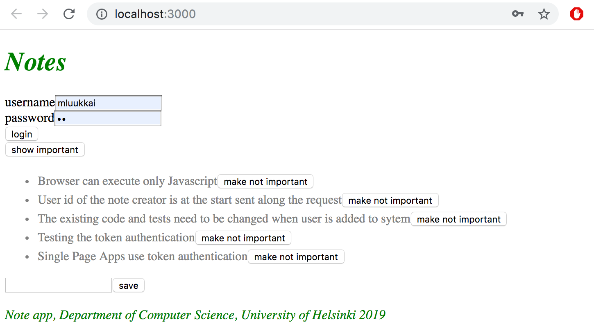
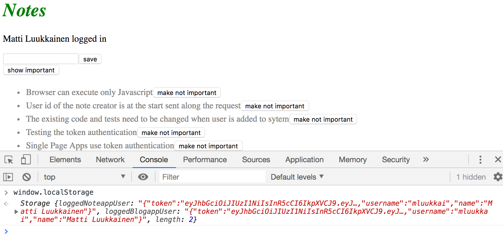
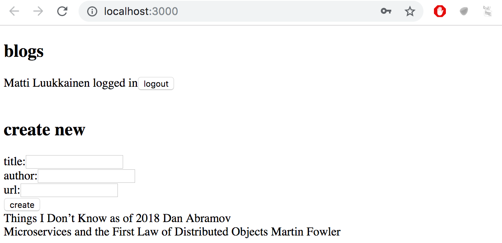
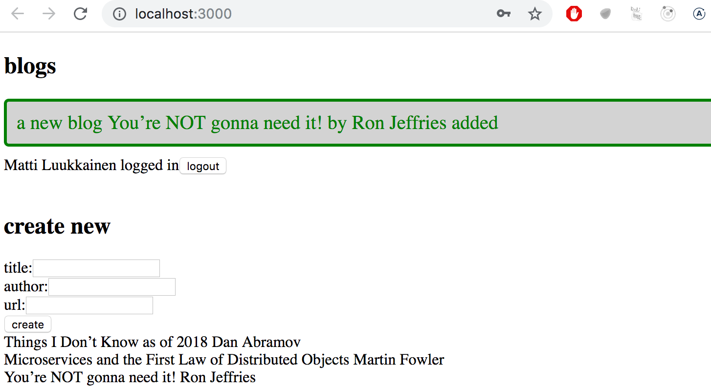
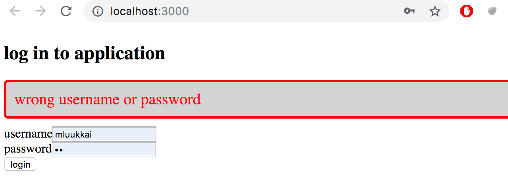

<div class="content">


In the last two parts, we have mainly concentrated on the backend, and the frontend does not yet support the user management we implemented to the backend in part 4.
在后两部分中，我们主要集中在后端，前端还不支持我们在第4章节中实现的后端用户管理。


At the moment the frontend shows existing notes, and lets users change the state of a note from important to not important and vice versa. New notes cannot be added anymore because of the changes made to the backend in part 4: the backend now expects that a token verifying a user's identity is sent with the new note. 
目前前端显示现有的便笺，并允许用户将便笺的状态从重要变为不重要，反之亦然。 由于在第4章节中对后端进行了更改，因此不能再添加新的便笺: 后端现在希望随新便笺一起发送一个验证用户身份的令牌。


We'll now implement a part of the required user management functionality to the frontend. Let's begin with user login. Throughout this part we will assume that new users will not be added from the frontend. 
现在，我们将在前端实现所需的用户管理功能的一部分。 让我们从用户登录开始。 在这一部分中，我们将假设不会从前端添加新用户。


A login form has now been added to the top of the page. The form for adding new notes has also been moved to the top of the list of notes. 
登录表单现在已经添加到页面顶部。 添加新便笺的表单也被移到了便笺列表的顶部。




The code of the <i>App</i> component now looks as follows: 
I App / i 组件的代码现在如下:

```js
const App = () => {
  const [notes, setNotes] = useState([]) 
  const [newNote, setNewNote] = useState('')
  const [showAll, setShowAll] = useState(true)
  const [errorMessage, setErrorMessage] = useState(null)
  // highlight-start
  const [username, setUsername] = useState('') 
  const [password, setPassword] = useState('') 
// highlight-end

  useEffect(() => {
    noteService
      .getAll().then(initialNotes => {
        setNotes(initialNotes)
      })
  }, [])

  // ...

// highlight-start
  const handleLogin = (event) => {
    event.preventDefault()
    console.log('logging in with', username, password)
  }
  // highlight-end

  return (
    <div>
      <h1>Notes</h1>

      <Notification message={errorMessage} />

      <h2>Login</h2>

      // highlight-start
      <form onSubmit={handleLogin}>
        <div>
          username
            <input
            type="text"
            value={username}
            name="Username"
            onChange={({ target }) => setUsername(target.value)}
          />
        </div>
        <div>
          password
            <input
            type="password"
            value={password}
            name="Password"
            onChange={({ target }) => setPassword(target.value)}
          />
        </div>
        <button type="submit">login</button>
      </form>
    // highlight-end

      // ...
    </div>
  )
}

export default App
```


Current application code can be found on [Github](https://github.com/fullstack-hy2020/part2-notes/tree/part5-1), branch <i>part5-1</i>.
当前的应用代码可以在[ Github ]( https://Github.com/fullstack-hy2020/part2-notes/tree/part5-1) ，branch<i>part5-1</i> 上找到。


The login form is handled the same way we handled forms in 
登录表单的处理方式与
[part 2](/en/part2/forms). The app state has fields for  <i>username</i> and <i>password</i> to store the data from the form. The form fields have event handlers, which sychronize changes in the field to the state of the <i>App</i> component. The event handlers are simple: An object is given to them as a parameter, and they destructure the field <i>target</i> from the object and save its value to the state.
[第2章节](/zh/part2)。 应用状态有用于<i>username</i> 和<i>password</i> 的字段，用于存储表单中的数据。 表单字段具有事件处理程序，这些事件处理程序将字段中的更改同步到<i>App</i> 组件的状态。 事件处理程序非常简单: 将一个对象作为参数提供给它们，它们从对象中重构字段<i>target</i>，并将其值保存为状态。

```js
({ target }) => setUsername(target.value)
```


The method _handleLogin_, which is  responsible for sending the form, does not yet do anything. 
负责发送表单的 handleLogin 方法尚未执行任何操作。


Logging in is done by sending an HTTP POST request to server address <i>api/login</i>. Let's separate the code responsible for this request to its own module, to file <i>services/login.js</i>.
登录是通过向服务器地址<i>api / login</i> 发送 HTTP POST 请求来完成的。 让我们将负责此请求的代码分离到它自己的模块中，以便将<i>services / login 文件归档。 Js</i>.


We'll use <i>async/await</i> syntax instead of promises for the HTTP request: 
对于 HTTP 请求，我们将使用<i>async / await</i> 语法而不是 promises:

```js
import axios from 'axios'
const baseUrl = '/api/login'

const login = async credentials => {
  const response = await axios.post(baseUrl, credentials)
  return response.data
}

export default { login }
```


The method for handling the login can be implemented as follows: 
处理登录的方法可以实现如下:

```js
import loginService from './services/login' 

const App = () => {
  // ...
  const [username, setUsername] = useState('') 
  const [password, setPassword] = useState('') 
// highlight-start
  const [user, setUser] = useState(null)
// highlight-end

  const handleLogin = async (event) => {
    event.preventDefault()
    try {
      const user = await loginService.login({
        username, password,
      })

      setUser(user)
      setUsername('')
      setPassword('')
    } catch (exception) {
      setErrorMessage('Wrong credentials')
      setTimeout(() => {
        setErrorMessage(null)
      }, 5000)
    }
  }

  // ...
}
```


If the login is successful, the form fields are emptied <i>and</i> the server response (including a <i>token</i> and the user details) is saved to the <i>user</i> field of the application's state.
如果登录成功，表单字段将清空 i，服务器响应(包括<i>token</i> 和用户详细信息)将保存到应用状态的<i>user</i> 字段。


If the login fails, or running the function _loginService.login_ results in an error, the user is notified. 
如果登录失败，或者运行 loginService.login 函数导致错误，则会通知用户。


User is not notified about a successful login in any way. Let's modify the application to show the login form only <i>if the user is not logged in</i> so _user === null_. The form for adding new notes is shown only if <i>user is logged in</i>, so <i>user</i> contains the user details. 
不会以任何方式通知用户成功登录。 让我们修改应用，只有在用户没有登录 /<i>所以用户 null 时才显示登录表单 i。 只有当 i user 登录</i> 时才会显示添加新便笺的表单，因此<i>user</i> 包含用户详细信息。


Let's add two helper functions to the <i>App</i> component for generating the forms: 
让我们在<i>App</i> 组件中添加两个 helper 函数来生成表单:

```js
const App = () => {
  // ...

  const loginForm = () => (
    <form onSubmit={handleLogin}>
      <div>
        username
          <input
          type="text"
          value={username}
          name="Username"
          onChange={({ target }) => setUsername(target.value)}
        />
      </div>
      <div>
        password
          <input
          type="password"
          value={password}
          name="Password"
          onChange={({ target }) => setPassword(target.value)}
        />
      </div>
      <button type="submit">login</button>
    </form>      
  )

  const noteForm = () => (
    <form onSubmit={addNote}>
      <input
        value={newNote}
        onChange={handleNoteChange}
      />
      <button type="submit">save</button>
    </form>  
  )

  return (
    // ...
  )
}
```


and conditionally render them:
有条件地提供给他们:

```js
const App = () => {
  // ...

  const loginForm = () => (
    // ...
  )

  const noteForm = () => (
    // ...
  )

  return (
    <div>
      <h1>Notes</h1>

      <Notification message={errorMessage} />

      {user === null && loginForm()} // highlight-line
      {user !== null && noteForm()} // highlight-line

      <div>
        <button onClick={() => setShowAll(!showAll)}>
          show {showAll ? 'important' : 'all'}
        </button>
      </div>
      <ul>
        {notesToShow.map((note, i) => 
          <Note
            key={i}
            note={note} 
            toggleImportance={() => toggleImportanceOf(note.id)}
          />
        )}
      </ul>

      <Footer />
    </div>
  )
}
```

A slightly odd looking, but commonly used [React trick](https://reactjs.org/docs/conditional-rendering.html#inline-if-with-logical--operator) is used to render the forms conditionally: 
一个看起来有点奇怪，但是常用的[ React trick ]( https://reactjs.org/docs/conditional-rendering.html#inline-if-with-logical--operator )被用来有条件地渲染表单:

```js
{
  user === null && loginForm()
}
```


If the first statement evaluates false, or is [falsy](https://developer.mozilla.org/en-US/docs/Glossary/Falsy), the second statement ( generating the form ) is not executed at all. 
如果第一个语句计算为 false，或者是[ falsy ]( https://developer.mozilla.org/en-us/docs/glossary/falsy ) ，那么根本不执行第二个语句(生成表单)。

We can make this even more straightforward by using the [conditional operator](https://developer.mozilla.org/en-US/docs/Web/JavaScript/Reference/Operators/Conditional_Operator):
我们可以通过使用条件运算符 https://developer.mozilla.org/en-us/docs/web/javascript/reference/operators/conditional_operator 来使这个问题变得更加简单:

```js
return (
  <div>
    <h1>Notes</h1>

    <Notification message={errorMessage}/>

    {user === null ?
      loginForm() :
      noteForm()
    }

    <h2>Notes</h2>

    // ...

  </div>
)
```


If _user === null_ is [truthy](https://developer.mozilla.org/en-US/docs/Glossary/Truthy), _loginForm()_ is executed. If not, _noteForm()_.
如果用户 null 为[ truthy ]( https://developer.mozilla.org/en-us/docs/glossary/truthy ) ，将执行 loginForm ()。


Let's do one more modification. If user is logged in, their name is shown on the screen: 
让我们再做一个修改，如果用户登录，他们的名字会显示在屏幕上:

```js
return (
  <div>
    <h1>Notes</h1>

    <Notification message={errorMessage} />

    {user === null ?
      loginForm() :
      <div>
        <p>{user.name} logged in</p>
        {noteForm()}
      </div>
    }

    <h2>Notes</h2>

    // ...

  </div>
)
```


The solution looks a bit ugly, but we'll leave it for now. 
这个解决方案看起来有点丑陋，但是我们暂时不讨论它。


Our main component <i>App</i> is at the moment way too large. The changes we did now are a clear sign that the forms should be refactored into their own components. However, we will leave that for an optional excercise. 
我们的主要组件<i>App</i> 目前太大了。 我们现在所做的更改是一个明确的信号，表单应该重构到它们自己的组件中。 但是，我们将把它留给一个可选的练习。


Current application code can be found on [Github](https://github.com/fullstack-hy2020/part2-notes/tree/part5-2), branch <i>part5-2</i>.
当前的应用代码可以在[ Github ]( https://Github.com/fullstack-hy2020/part2-notes/tree/part5-2) ，branch<i>part5-2</i> 上找到。

### Creating new notes
创造新的便笺

The token returned with a successful login is saved to the application state <i>user</i> field <i>token</i>:
成功登录后返回的令牌保存为 application state<i>user</i> field<i>token</i>:

```js
const handleLogin = async (event) => {
  event.preventDefault()
  try {
    const user = await loginService.login({
      username, password,
    })

    setUser(user) // highlight-line
    setUsername('')
    setPassword('')
  } catch (exception) {
    // ...
  }
}
```

Let's fix creating new notes to work with the backend. This means adding the token of the logged in user to the Authorization header of the HTTP request. 
让我们修复创建新的便笺来使用后端的问题。 这意味着将登录用户的令牌添加到 HTTP 请求的 Authorization 头。


The <i>noteService</i> module changes like so: 
I noteService / i 模块的变化如下:

```js
import axios from 'axios'
const baseUrl = '/api/notes'

let token = null // highlight-line

// highlight-start
const setToken = newToken => {
  token = `bearer ${newToken}`
}
// highlight-end

const getAll = () => {
  const request = axios.get(baseUrl)
  return request.then(response => response.data)
}

const create = async newObject => {
  // highlight-start
  const config = {
    headers: { Authorization: token },
  }
// highlight-end

  const response = await axios.post(baseUrl, newObject, config) // highlight-line
  return response.data
}

const update = (id, newObject) => {
  const request = axios.put(`${ baseUrl } /${id}`, newObject)
  return request.then(response => response.data)
}

export default { getAll, create, update, setToken } // highlight-line
```


The noteService module contains a private variable _token_. Its value can be changed with a function _setToken_, which is exported by the module. _create_, now with async/await syntax, sets the token to the <i>Authorization</i> header. The header is given to axios as the third parameter of the <i>post</i> method. 
Noteservice 模块包含一个私有变量 token。 它的值可以通过一个函数 setToken 进行更改，该函数由模块导出。 Create，现在使用 async / await 语法，将标记设置为<i>Authorization</i> 头。 头部给出了公理作为<i>post</i> 方法的第三个参数。


The event handler responsible for log in must be changed to call the method <code>noteService.setToken(user.token)</code> with a successful log in: 
必须更改负责登录的事件处理程序，以调用成功登录的方法代码 noteService.setToken (user.token) / 代码:

```js
const handleLogin = async (event) => {
  event.preventDefault()
  try {
    const user = await loginService.login({
      username, password,
    })

    noteService.setToken(user.token) // highlight-line
    setUser(user)
    setUsername('')
    setPassword('')
  } catch (exception) {
    // ...
  }
}
```


And now adding new notes works again!
现在添加新的便笺又有用了！

### Saving the token to browsers local storage
# # # 将令牌保存到浏览器本地存储


Our application has a flaw: When the page is rerendered, information of the user's login dissappears. This also slows down development. For example when we test creating new notes, we have to login again every single time. 
我们的应用有一个缺陷: 当页面重新运行时，用户的登录信息就会消失。 这也减缓了开发速度。 例如，当我们测试创建新便笺时，我们每次都必须重新登录。


This problem is easily solved by saving the login details to [local storage](https://developer.mozilla.org/en-US/docs/Web/API/Storage). Local Storage is a [key-value](https://en.wikipedia.org/wiki/Key-value_database) database in the browser. 
这个问题很容易解决，只需要将登录信息保存到[本地存储](本地 https://developer.mozilla.org/en-us/docs/web/api/storage )。 本地存储是浏览器中的一个[键值]( https://en.wikipedia.org/wiki/key-value_database )数据库。


It is very easy to use. A <i>value</i> corresponding to a certain <i>key</i> is saved to the database with method [setItem](https://developer.mozilla.org/en-US/docs/Web/API/Storage/setItem). For example: 
它非常容易使用。 对应于某个<i>键</i> 的<i>value</i> 通过方法[ setItem ]( https://developer.mozilla.org/en-us/docs/web/api/storage/setItem )保存到数据库中。 例如:

```js
window.localStorage.setItem('name', 'juha tauriainen')
```


saves the string given as the second parameter as the value of key <i>name</i>. 
将作为第二个参数给定的字符串保存为 key<i>name</i> 的值。


The value of a key can be found with method [getItem](https://developer.mozilla.org/en-US/docs/Web/API/Storage/getItem):
密钥的值可以通过方法[ getItem ]( https://developer.mozilla.org/en-us/docs/web/api/storage/getItem )找到:

```js
window.localStorage.getItem('name')
```


and [removeItem](https://developer.mozilla.org/en-US/docs/Web/API/Storage/removeItem) removes a key. 
和[ removeItem ]( https://developer.mozilla.org/en-us/docs/web/api/storage/removeItem )移除一个密钥。


Values in the storage stay even when the page is rerendered. The storage is [origin](https://developer.mozilla.org/en-US/docs/Glossary/Origin)-specific so each web application has its own storage. 
即使页重新运行，存储中的值也会保持不变。 存储是[ origin ]( https://developer.mozilla.org/en-us/docs/glossary/origin )特定的，因此每个 web 应用都有自己的存储空间。


Let's extend our application so that it saves the details of a logged in user to the local storage. 
让我们扩展应用，以便将登录用户的详细信息保存到本地存储中。


Values saved to the storage are [DOMstrings](https://developer.mozilla.org/en-US/docs/Web/API/DOMString), so we cannot save a JavaScript object as is. The object has to be first parsed to JSON with the method _JSON.stringify_. Correspondigly, when a JSON object is read from the local storage, it has to be parsed back to JavaScript with _JSON.parse_.
保存到存储中的值是[ DOMstrings ]( https://developer.mozilla.org/en-us/docs/web/api/domstring ) ，因此我们不能保存 JavaScript 对象。 必须首先使用 JSON.stringify 方法将对象解析为 JSON。 相应地，当从本地存储读取 JSON 对象时，必须使用 JSON.parse 将其解析回 JavaScript。


Changes to the login method are as follows: 
登录方法的更改如下:

```js
  const handleLogin = async (event) => {
    event.preventDefault()
    try {
      const user = await loginService.login({
        username, password,
      })

      // highlight-start
      window.localStorage.setItem(
        'loggedNoteappUser', JSON.stringify(user)
      ) 
      // highlight-end
      noteService.setToken(user.token)
      setUser(user)
      setUsername('')
      setPassword('')
    } catch (exception) {
      // ...
    }
  }
```


The details of a logged in user are now saved to the local storage, and they can be viewed on the console: 
登录用户的详细信息现在保存到本地存储中，可以在控制台上查看:




We still have to modify our application so that when we enter the page, the application checks if user details of a logged in user can already be found from the local storage. If they can, the details are saved to the state of the application and to <i>noteService</i>.
我们仍然需要修改我们的应用，以便当我们进入页面时，应用检查是否已经在本地存储中找到登录用户的用户详细信息。 如果可以，详细信息将保存到应用的状态和<i>noteService</i>。


The right way to do this is with an [effect hook](https://reactjs.org/docs/hooks-effect.html): A mechanism we first encountered in [part 2](/en/part2/getting_data_from_server#effect-hooks), and used to fetch notes from the server to the frontend. 
正确的方法是使用[ effect hook ]( https://reactjs.org/docs/hooks-effect.html ) : 这是我们在[ part 2]中第一次遇到的机制(/ en / part2 / 从服务器 # effect-hooks 获取数据) ，用于从服务器向前端获取便笺。


We can have multiple effect hooks, so let's create a second one to handle the first loading of the page:
我们可以有多个效果钩子，所以让我们创建第二个来处理页面的第一次加载:

```js
const App = () => {
  const [notes, setNotes] = useState([]) 
  const [newNote, setNewNote] = useState('')
  const [showAll, setShowAll] = useState(true)
  const [errorMessage, setErrorMessage] = useState(null)
  const [username, setUsername] = useState('') 
  const [password, setPassword] = useState('') 
  const [user, setUser] = useState(null) 

  useEffect(() => {
    noteService
      .getAll().then(initialNotes => {
        setNotes(initialNotes)
      })
  }, [])

  // highlight-start
  useEffect(() => {
    const loggedUserJSON = window.localStorage.getItem('loggedNoteappUser')
    if (loggedUserJSON) {
      const user = JSON.parse(loggedUserJSON)
      setUser(user)
      noteService.setToken(user.token)
    }
  }, [])
  // highlight-end

  // ...
}
```


The empty array as the parameter of the effect ensures that the effect is executed only when the component is rendered [for the first time](https://reactjs.org/docs/hooks-reference.html#conditionally-firing-an-effect).
作为效果参数的空数组确保只有当组件[第一次]渲染时才执行效果( https://reactjs.org/docs/hooks-reference.html#conditionally-firing-an-effect )。


Now a user stays logged in to the application forever. We should probably add a <i>logout</i> functionality which removes the login details from the local storage. We will however leave it for an exercise. 
现在，一个用户将永远保持对应用的登录。 我们可能应该添加一个<i>logout</i> 功能，从本地存储中删除登录详细信息。 然而，我们将把它留给一个练习。


It's possible to log out a user using the console, and that is enough for now. 
使用控制台注销用户是可行的，这就足够了。
You can log out with the command:
您可以使用如下命令注销:

```js
window.localStorage.removeItem('loggedNoteappUser')
```
or with the command which empties localstorage completely: 
或者完全清空本地存储的命令:

```js
window.localStorage.clear()
```


Current application code can be found on [Github](https://github.com/fullstack-hy2020/part2-notes/tree/part5-3), branch <i>part5-3</i>.
当前的应用代码可以在[ Github ]( https://Github.com/fullstack-hy2020/part2-notes/tree/part5-3) ，branch<i>part5-3</i> 上找到。

</div>


<div class="tasks">


### Exercises 5.1.-5.4.
练习5.1- 5.4。


We will now create a frontend for the bloglist backend we created in the last part. You can use [this application](https://github.com/fullstack-hy2020/bloglist-frontend) from GitHub as the base of your solution. The application expects your backend to be running on port 3001. 
现在我们将为上一部分创建的博客列表后端创建一个前端。 你可以使用 GitHub 上的[ this application ]( https://GitHub.com/fullstack-hy2020/bloglist-frontend 应用)作为你的解决方案的基础。 应用期望您的后端在端口3001上运行。

It is enough to submit your finished solution. You can do a commit after each exercise, but that is not necessary. 
只要提交完成的解决方案就足够了。 您可以在每次练习之后进行提交，但这是不必要的。

The first few exercises revise everything we have learned about React so far. They can be challenging, especially if your backend is incomplete. 
开始的几次练习修改了我们已经学到的关于React的所有知识。 他们可以是具有挑战性的，特别是如果你的后端是不完整的。
It might be best to use the backend from model answers of part 4. 
最好使用第4章节模型答案的后端。


While doing the exercises, remember all of the debugging methods we have talked about, especially keeping an eye on the console. 
在做这些练习时，请记住我们讨论过的所有调试方法，尤其要密切关注控制台。


**Warning:** If you notice you are mixing async/await and _then_ commands, its 99.9%  certain you are doing something wrong. Use either or, never both. 
**警告: **如果你注意到你正在混合 async / await 命令，它的99.9% 肯定你正在做错误的事情。 要么使用，要么使用，不要两者都使用。

#### 5.1: bloglist frontend, 步骤1
5.1: bloglist frontend，步骤1


Clone the application from [Github](https://github.com/fullstack-hy2020/bloglist-frontend) with the command: 
使用如下命令从[ Github ]( https://Github.com/fullstack-hy2020/bloglist-frontend 文件)克隆应用:

```bash
git clone https://github.com/fullstack-hy2020/bloglist-frontend
```


<i>remove the git configuration of the cloned application</i>
我删除了克隆应用 / i 的 git 配置

```bash
cd bloglist-frontend   // go to cloned repository
rm -rf .git
```


The application is started the usual way, but you have to install its dependencies first: 
应用以通常的方式启动，但是你必须先安装它的依赖项:

```bash
npm install
npm start
```


Implement login functionality to the frontend. The token returned with a successful login is saved to the application's state <i>user</i>.
在前端实现登录功能。成功登录后返回的令牌保存到应用的状态<i>user</i>。


If a user is not logged in, <i>only</i> the login form is visible. 
如果一个用户没有登录，那么登录表单中的 i / i 就是可见的。


If user is logged in, the name of the user and a list of blogs is shown. 
如果用户登录，则显示用户名和博客列表。


User details of the logged in user do not have to be saved to the local storage yet. 
登录用户的用户详细信息不必保存到本地存储中。


**NB** You can implement the conditional rendering of the login form like this for example: 
你可以像这样实现登录表单的条件渲染，例如:

```js
  if (user === null) {
    return (
      <div>
        <h2>Log in to application</h2>
        <form>
          //...
        </form>
      </div>
    )
  }

  return (
    <div>
      <h2>blogs</h2>
      {blogs.map(blog =>
        <Blog key={blog.id} blog={blog} />
      )}
    </div>
  )
}
```

#### 5.2: bloglist frontend, 步骤2
5.2: bloglist frontend，步骤2


Make the login 'permanent' by using the local storage. Also implement a way to log out. 
使用本地存储使登录成为永久性的。同时实现一种注销的方法。


Ensure the browser does not remember the details of the user after logging out. 
确保浏览器在注销后不会记住用户的详细信息。

#### 5.3: bloglist frontend, 步骤3
5.3: bloglist frontend，步骤3


Expand your application to allow  a logged in user to add new blogs: 
展开你的应用，允许登录用户添加新的博客:




#### 5.4*: bloglist frontend, 步骤4
5.4 * : bloglist frontend，步骤4

Implement notifications which inform the user about successful and unsuccessful operations at the top of the page. For example, when a new blog is added, the following notification can be shown: 
在页面顶部实现通知，告知用户成功和不成功的操作。 例如，当添加一个新博客时，可以显示如下通知:




Failed login can show the following notification: 
登录失败可显示如下通知:




The notifications must be visible for a few seconds. It is not compulsory to add colors. 
通知必须可见几秒钟，添加颜色不是强制性的。

</div>

