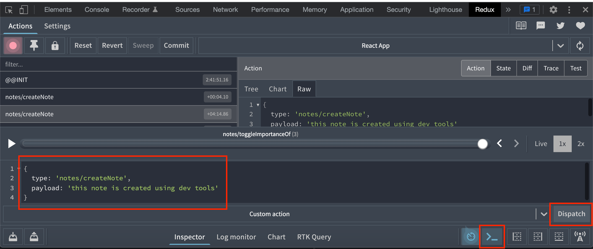
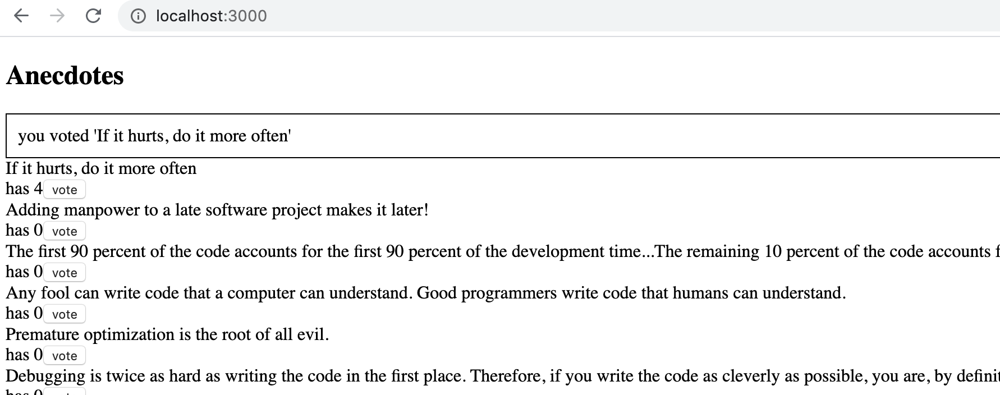
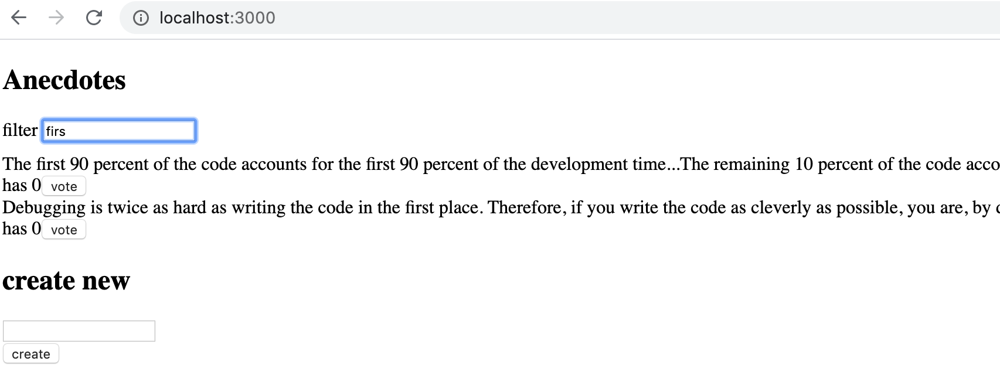

<div class="content">

Jatketaan muistiinpanosovelluksen yksinkertaistetun [redux-version](/osa6/flux_arkkitehtuuri_ja_redux#redux-muistiinpanot) laajentamista.

Sovelluskehitystä helpottaaksemme laajennetaan reduceria siten, että storelle määritellään alkutila, jossa on pari muistiinpanoa:

```js
const initialState = [
  {
    content: 'reducer defines how redux store works',
    important: true,
    id: 1,
  },
  {
    content: 'state of store can contain any data',
    important: false,
    id: 2,
  },
]

const noteReducer = (state = initialState, action) => {
  // ...
}

// ...
export default noteReducer
```

### Monimutkaisempi tila storessa

Toteutetaan sovellukseen näytettävien muistiinpanojen filtteröinti, jonka avulla näytettäviä muistiinpanoja voidaan rajata. Filtterin toteutus tapahtuu [radiobuttoneiden](https://developer.mozilla.org/en-US/docs/Web/HTML/Element/input/radio) avulla:


Aloitetaan todella suoraviivaisella toteutuksella:

```js
import React from 'react'
import NewNote from './components/NewNote'
import Notes from './components/Notes'

const App = () => {
//highlight-start
  const filterSelected = (value) => {
    console.log(value)
  }
//highlight-end

  return (
    <div>
      <NewNote />
        //highlight-start
      <div>
        all          <input type="radio" name="filter"
          onChange={() => filterSelected('ALL')} />
        important    <input type="radio" name="filter"
          onChange={() => filterSelected('IMPORTANT')} />
        nonimportant <input type="radio" name="filter"
          onChange={() => filterSelected('NONIMPORTANT')} />
      </div>
      //highlight-end
      <Notes />
    </div>
  )
}
```

Koska painikkeiden attribuutin <i>name</i> arvo on kaikilla sama, muodostavat ne <i>nappiryhmän</i>, joista ainoastaan yksi voi olla kerrallaan valittuna.

Napeille on määritelty muutoksenkäsittelijä, joka tällä hetkellä ainoastaan tulostaa painettua nappia vastaavan merkkijonon konsoliin.

Päätämme toteuttaa filtteröinnin siten, että talletamme muistiinpanojen lisäksi sovelluksen storeen myös <i>filtterin arvon</i>. Eli muutoksen jälkeen storessa olevan tilan tulisi näyttää seuraavalta:

```js
{
  notes: [
    { content: 'reducer defines how redux store works', important: true, id: 1},
    { content: 'state of store can contain any data', important: false, id: 2}
  ],
  filter: 'IMPORTANT'
}
```

Tällä hetkellähän tilassa on ainoastaan muistiinpanot sisältävä taulukko. Uudessa ratkaisussa tilalla on siis kaksi avainta, <i>notes</i> jonka arvona muistiinpanot ovat sekä <i>filter</i>, jonka arvona on merkkijono joka kertoo mitkä muistiinpanoista tulisi näyttää ruudulla.

### Yhdistetyt reducerit

Voisimme periaatteessa muokata jo olemassaolevaa reduceria ottamaan huomioon muuttuneen tilanteen. Parempi ratkaisu on kuitenkin määritellä tässä tilanteessa uusi, filtterin arvosta huolehtiva reduceri:

```js
const filterReducer = (state = 'ALL', action) => {
  switch (action.type) {
    case 'SET_FILTER':
      return action.filter
    default:
      return state
  }
}
```

Filtterin arvon asettavat actionit ovat siis muotoa

```js
{
  type: 'SET_FILTER',
  filter: 'IMPORTANT'
}
```

Määritellään samalla myös sopiva _action creator_ -funktio. Sijoitetaan koodi moduuliin <i>src/reducers/filterReducer.js</i>:

```js
const filterReducer = (state = 'ALL', action) => {
  // ...
}

export const filterChange = filter => {
  return {
    type: 'SET_FILTER',
    filter,
  }
}

export default filterReducer
```

Saamme nyt muodostettua varsinaisen reducerin yhdistämällä kaksi olemassaolevaa reduceria funktion [combineReducers](https://redux.js.org/api-reference/combinereducers) avulla.

Määritellään yhdistetty reduceri tiedostossa <i>index.js</i>:

```js
import React from 'react'
import ReactDOM from 'react-dom'
import { createStore, combineReducers } from 'redux' // highlight-line
import { Provider } from 'react-redux' 
import App from './App'

import noteReducer from './reducers/noteReducer'
import filterReducer from './reducers/filterReducer' // highlight-line

 // highlight-start
const reducer = combineReducers({
  notes: noteReducer,
  filter: filterReducer
})
 // highlight-end

const store = createStore(reducer)

console.log(store.getState())

ReactDOM.render(
  <Provider store={store}>
    <App />
  </Provider>,
  <div />,
  document.getElementById('root')
)
```

Koska sovelluksemme hajoaa tässä vaiheessa täysin, komponentin <i>App</i> sijasta renderöidään tyhjä <i>div</i>-elementti.

Konsoliin tulostuu storen tila:


eli store on juuri siinä muodossa missä haluammekin sen olevan!

Tarkastellaan vielä yhdistetyn reducerin luomista

```js
const reducer = combineReducers({
  notes: noteReducer,
  filter: filterReducer,
})
```

Näin tehdyn reducerin määrittelemän storen tila on olio, jossa on kaksi kenttää, <i>notes</i> ja <i>filter</i>. Tilan kentän <i>notes</i> arvon määrittelee <i>noteReducer</i>, jonka ei tarvitse välittää mitään tilan muista kentistä. Vastaavasti <i>filter</i> kentän käsittely tapahtuu <i>filterReducer</i>:in avulla.

Ennen muun koodin muutoksia, kokeillaan vielä konsolista, miten actionit muuttavat yhdistetyn reducerin muodostamaa staten tilaa. Lisätään seuraavat tiedostoon <i>index.js</i>:

```js
import { createNote } from './reducers/noteReducer'
import { filterChange } from './reducers/filterReducer'
//...
store.subscribe(() => console.log(store.getState()))
store.dispatch(filterChange('IMPORTANT'))
store.dispatch(createNote('combineReducers forms one reduces from many simple reducers'))
```

Kun simuloimme näin filtterin tilan muutosta ja muistiinpanon luomista Konsoliin tulostuu storen tila jokaisen muutoksen jälkeen:


Jo tässä vaiheessa kannattaa laittaa mieleen eräs tärkeä detalji. Jos lisäämme <i>molempien reducerien alkuun</i> konsoliin tulostuksen:

```js
const filterReducer = (state = 'ALL', action) => {
  console.log('ACTION: ', action)
  // ...
}
```

Näyttää konsolin perusteella siltä, että jokainen action kahdentuu:


Onko koodissa bugi? Ei. Yhdistetty reducer toimii siten, että jokainen <i>action</i> käsitellään <i>kaikissa</i> yhdistetyn reducerin osissa. Usein tietystä actionista on kiinnostunut vain yksi reduceri, on kuitenkin tilanteita, joissa useampi reduceri muuttaa hallitsemaansa staten tilaa jonkin actionin seurauksena.

### Filtteröinnin viimeistely

Viimeistellään nyt sovellus käyttämään yhdistettyä reduceria, eli palautetaan tiedostossa <i>index.js</i> suoritettava renderöinti muotoon

```js
ReactDOM.render(
  <Provider store={store}>
    <App />
  </Provider>,
  document.getElementById('root')
)
```

Korjataan sitten bugi, joka johtuu siitä, että koodi olettaa storen tilan olevan mustiinpanot tallettava taulukko:


Korjaus on helppo. Koska muistiinpanot ovat nyt storen kentässä <i>notes</i>, riittää pieni muutos selektorifunktioon:

```js
const Notes = () => {
  const dispatch = useDispatch()
  const notes = useSelector(state => state.notes) // highlight-line

  return(
    <ul>
      {notes.map(note =>
        <Note
          key={note.id}
          note={note}
          handleClick={() => 
            dispatch(toggleImportanceOf(note.id))
          }
        />
      )}
    </ul>
  )
}
```

Aiemminhan selektorifunktio palautti koko storen tilan:

```js
const notes = useSelector(state => state)
```

Nyt siis palautetaan tilasta ainoastaan sen kenttä <i>notes</i>

```js
const notes = useSelector(state => state.notes)
```

Eriytetään näkyvyyden säätelyfiltteri omaksi, tiedostoon sijoitettavaksi <i>src/components/VisibilityFilter.js</i> komponentiksi:

```js
import React from 'react'
import { filterChange } from '../reducers/filterReducer'
import { useDispatch } from 'react-redux'

const VisibilityFilter = (props) => {
  const dispatch = useDispatch()

  return (
    <div>
      all    
      <input 
        type="radio" 
        name="filter" 
        onChange={() => dispatch(filterChange('ALL'))}
      />
      important   
      <input
        type="radio"
        name="filter"
        onChange={() => dispatch(filterChange('IMPORTANT'))}
      />
      nonimportant 
      <input
        type="radio"
        name="filter"
        onChange={() => dispatch(filterChange('NONIMPORTANT'))}
      />
    </div>
  )
}

export default VisibilityFilter
```

Toteutus on suoraviivainen, radiobuttonin klikkaaminen muuttaa storen kentän <i>filter</i> tilaa.

Komponentti <i>App</i> yksinkertaisuu nyt seuraavasti:

```js
import React from 'react'
import Notes from './components/Notes'
import NewNote from './components/NewNote'
import VisibilityFilter from './components/VisibilityFilter'

const App = () => {
  return (
    <div>
      <NewNote />
      <VisibilityFilter />
      <Notes />
    </div>
  )
}

export default App
```

Muutetaan vielä komponentin <i>Notes</i> ottamaan huomioon filtteri

```js
const Notes = () => {
  const dispatch = useDispatch()
  // highlight-start
  const notes = useSelector(state => {
    if ( state.filter === 'ALL' ) {
      return state.notes
    }
    return state.filter  === 'IMPORTANT' 
      ? state.notes.filter(note => note.important)
      : state.notes.filter(note => !note.important)
  })
  // highlight-end

  return(
    <ul>
      {notes.map(note =>
        <Note
          key={note.id}
          note={note}
          handleClick={() => 
            dispatch(toggleImportanceOf(note.id))
          }
        />
      )}
    </ul>
  )
```

Muutos kohdistuu siis ainoastaan selektorifunktioon, joka oli aiemmin muotoa

```js
useSelector(state => state.notes)
```

Yksinkertaistetaan vielä selektoria destrukturoimalla parametrina olevasta tilasta sen kentät erilleen:

```js
const notes = useSelector(({ filter, notes }) => {
  if ( filter === 'ALL' ) {
    return notes
  }
  return filter  === 'IMPORTANT' 
    ? notes.filter(note => note.important)
    : notes.filter(note => !note.important)
})
```

Sovelluksessa on vielä pieni kauneusvirhe, vaikka oletusarvosesti filtterin arvo on <i>ALL</i>, eli näytetään kaikki muistiinpanot, ei vastaava radiobutton ole valittuna. Ongelma on luonnollisestikin mahdollista korjata, mutta koska kyseessä on ikävä, mutta harmiton feature, jätämme korjauksen myöhemmäksi.

### Redux DevTools

Chromeen on asennettavissa [Redux DevTools](https://chrome.google.com/webstore/detail/redux-devtools/lmhkpmbekcpmknklioeibfkpmmfibljd?hl=fi), jonka avulla Redux-storen tilaa ja sitä muuttavia actioneja on mahdollisuus seurata selaimen konsolista.

Selaimen lisäosan lisäksi debugatessa tarvitaan kirjastoa [redux-devtools-extension](https://www.npmjs.com/package/redux-devtools-extension). Asennetaan se komennolla

```js
npm install --save-dev redux-devtools-extension
```

Storen luomistapaa täytyy hieman muuttaa, että kirjasto saadaan käyttöön:

```js
// ...
import { createStore, combineReducers } from 'redux'
import { composeWithDevTools } from 'redux-devtools-extension' // highlight-line

import noteReducer from './reducers/noteReducer'
import filterReducer from './reducers/filterReducer'

const reducer = combineReducers({
  notes: noteReducer,
  filter: filterReducer
})

const store = createStore(
  reducer,
  // highlight-start
  composeWithDevTools()
  // highlight-end
)

export default store
```

Kun nyt avaat konsolin, välilehti <i>redux</i> näyttää seuraavalta:


Kunkin actionin storen tilaan aiheuttamaa muutosta on helppo tarkastella


Konsolin avulla on myös mahdollista dispatchata actioneja storeen




Sovelluksen tämänhetkinen koodi on [githubissa](https://github.com/fullstack-hy2020/redux-notes/tree/part6-2) branchissa </i>part6-2</i>.

</div>

<div class="tasks">

### Tehtävät 6.9.-6.12.

Jatketaan tehtävässä 6.3 aloitetun reduxia käyttävän anekdoottisovelluksen parissa.

#### 6.9 anekdootit, step7

Ota sovelluksessasi käyttöön React dev tools. Siirrä Redux-storen määrittely omaan tiedostoon <i>store.js</i>.

#### 6.10 anekdootit, step8

Sovelluksessa on valmiina komponentin <i>Notification</i> runko:

```js
import React from 'react'

const Notification = () => {
  const style = {
    border: 'solid',
    padding: 10,
    borderWidth: 1
  }
  return (
    <div style={style}>
      render here notification...
    </div>
  )
}

export default Notification
```

Laajenna komponenttia siten, että se renderöi redux-storeen talletetun viestin, eli renderöitävä komponentti muuttuu muotoon:

```js
import React from 'react'
import { useSelector } from 'react-redux' // highlight-line

const Notification = () => {
  const notification = useSelector(/*s omething here */) // highlight-line
  const style = {
    border: 'solid',
    padding: 10,
    borderWidth: 1
  }
  return (
    <div style={style}>
      {notification} // highlight-line
    </div>
  )
}
```

Joudut siis muuttamaan/laajentamaan sovelluksen olemassaolevaa reduceria. Tee toiminnallisuutta varten oma reduceri ja siirry käyttämään sovelluksessa yhdistettyä reduceria tämän osan materiaalin tapaan.

Tässä vaiheessa sovelluksen ei vielä tarvitse osata käyttää <i>Notification</i> komponenttia järkevällä tavalla, riittää että sovellus toimii ja näyttää <i>notificationReducerin</i> alkuarvoksi asettaman viestin.

#### 6.11 paremmat anekdootit, step9

Laajenna sovellusta siten, että se näyttää <i>Notification</i>-komponentin avulla viiden sekunnin ajan, kun sovelluksessa äänestetään tai luodaan uusia anekdootteja:



Notifikaation asettamista ja poistamista varten kannattaa toteuttaa [action creatorit](https://redux.js.org/basics/actions#action-creators).

#### 6.12* paremmat anekdootit, step10

Toteuta sovellukseen näytettävien muistiinpanojen filtteröiminen



Säilytä filtterin tila redux storessa, eli käytännössä kannattaa jälleen luoda uusi reduceri ja action creatorit.

Tee filtterin ruudulla näyttämistä varten komponentti <i>Filter</i>. Voit ottaa sen pohjaksi seuraavan

```js
import React from 'react'

const Filter = () => {
  const handleChange = (event) => {
    // input-kentän arvo muuttujassa event.target.value
  }
  const style = {
    marginBottom: 10
  }

  return (
    <div style={style}>
      filter <input onChange={handleChange} />
    </div>
  )
}

export default Filter
```

</div>
