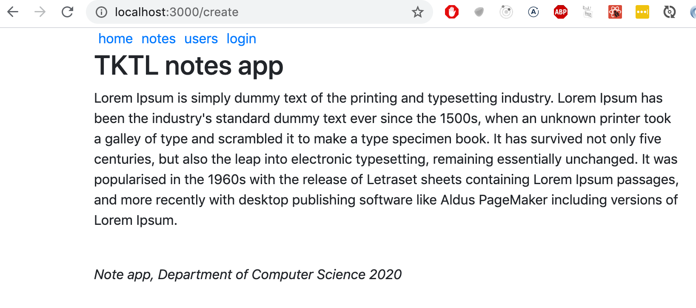
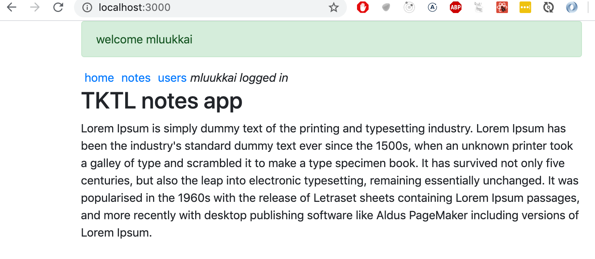
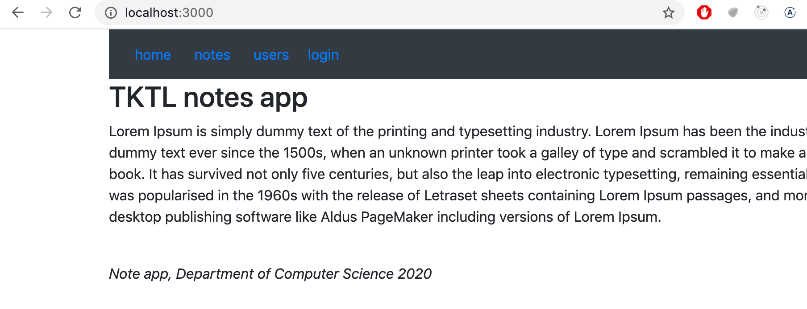
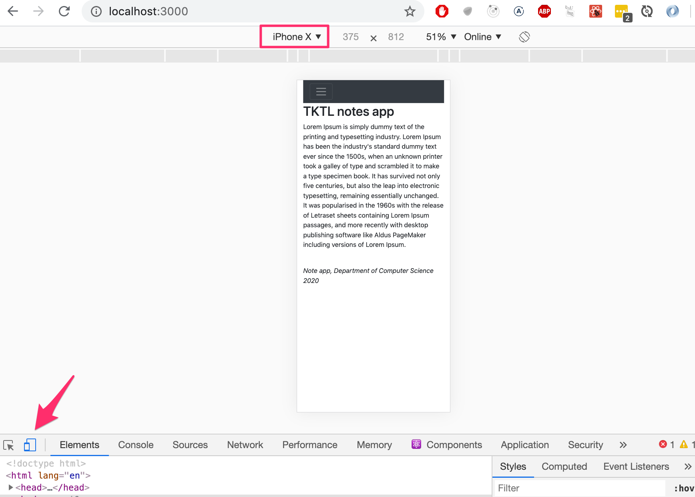

<div class="content">

In part 2 we examined two different ways of adding styles to our application: the old-school [single CSS](/en/part2/adding_styles_to_react_app) file and [inline-styles](/en/part2/adding_styles_to_react_app#inline-styles). In this part we will take a look at a few other ways. 

### Ready-made UI libraries

One approach to defining styles for an application is to use a ready-made "UI framework".

One of the first widely popular UI frameworks was the [Bootstrap](https://getbootstrap.com/) toolkit created by Twitter, that may still be the most popular framework. Recently there has been an explosion in the number of new UI frameworks that have entered the arena. In fact, the selection is so vast that there is little hope of creating an exhaustive list of options.

Many UI frameworks provide developers of web applications with ready-made themes and "components" like buttons, menus, and tables. We write components in quotes, because in this context we are not talking about React components. Usually UI frameworks are used by including the CSS stylesheets and JavaScript code of the framework in the application.

There are many UI frameworks that have React-friendly versions, where the framework's "components" have been transformed into React components. There are a few different React versions of Bootstrap like [reactstrap](http://reactstrap.github.io/) and [react-bootstrap](https://react-bootstrap.github.io/).

Next we will take a closer look at two UI frameworks, Bootstrap and [MaterialUI](https://material-ui.com/). We will use both frameworks to add similar styles to the application we made in the [React-router](/en/part7/react_router) section of the course material.

### React Bootstrap

Let's start by taking a look at Bootstrap with the help of the [react-bootstrap](https://react-bootstrap.github.io/) package.

Let's install the package with the command:

```bash
npm install react-bootstrap
```

Then let's add a link for loading the CSS stylesheet for Bootstrap inside of the <i>head</i> tag in the <i>public/index.html</i> file of the application:

```js
<head>
  <link
    rel="stylesheet"
    href="https://maxcdn.bootstrapcdn.com/bootstrap/4.3.1/css/bootstrap.min.css"
    integrity="sha384-ggOyR0iXCbMQv3Xipma34MD+dH/1fQ784/j6cY/iJTQUOhcWr7x9JvoRxT2MZw1T"
    crossorigin="anonymous"
  />
  // ...
</head>
```
When we reload the application, we notice that it already looks a bit more stylish:


In Bootstrap, all of the contents of the application are typically rendered inside of a [container](https://getbootstrap.com/docs/4.1/layout/overview/#containers). In practice this is accomplished by giving the root _div_ element of the application the  _container_ class attribute:

```js
const App = () => {
  // ...

  return (
    <div className="container"> // highlight-line
      // ...
    </div>
  )
}
```


We notice that this already has an effect on the appearance of the application. The content is no longer as close to the edges of the browser as it was earlier:




Next, let's make some changes to the <i>Notes</i> component, so that it renders the list of notes as a [table](https://getbootstrap.com/docs/4.1/content/tables/). React Bootstrap provides a built-in [Table](https://react-bootstrap.github.io/components/table/) component for this purpose, so there is no need to define CSS classes separately.

```js
const Notes = (props) => (
  <div>
    <h2>Notes</h2>
    <Table striped> // highlight-line
      <tbody>
        {props.notes.map(note =>
          <tr key={note.id}>
            <td>
              <Link to={`/notes/${note.id}`}>
                {note.content}
              </Link>
            </td>
            <td>
              {note.user}
            </td>
          </tr>
        )}
      </tbody>
    </Table>
  </div>
)
```

The appearance of the application is quite stylish:


Notice that the React Bootstrap components have to be imported separately from the library as shown below:

```js
import { Table } from 'react-bootstrap'
```

#### Forms

Let's improve the form in the <i>Login</i> view with the help of Bootstrap [forms](https://getbootstrap.com/docs/4.1/components/forms/).

React Bootstrap provides built-in [components](https://react-bootstrap.github.io/components/forms/) for creating forms (although the documentation for them is slightly lacking):

```js
let Login = (props) => {
  // ...
  return (
    <div>
      <h2>login</h2>
      <Form onSubmit={onSubmit}>
        <Form.Group>
          <Form.Label>username:</Form.Label>
          <Form.Control
            type="text"
            name="username"
          />
          <Form.Label>password:</Form.Label>
          <Form.Control
            type="password"
          />
          <Button variant="primary" type="submit">
            login
          </Button>
        </Form.Group>
      </Form>
    </div>
)}
```

The number of components we need to import increases:

```js
import { Table, Form, Button } from 'react-bootstrap'
```

After switching over to the Bootstrap form, our improved application looks like this:


#### Notification

Now that the login form is in better shape, let's take a look at improving our application's notifications:



Let's add a message for the notification when a user logs in to the application. We will store it in the _message_ variable in the <i>App</i> component's state:

```js
const App = () => {
  const [notes, setNotes] = useState([
    // ...
  ])

  const [user, setUser] = useState(null)
  const [message, setMessage] = useState(null) // highlight-line

  const login = (user) => {
    setUser(user)
    // highlight-start
    setMessage(`welcome ${user}`)
    setTimeout(() => {
      setMessage(null)
    }, 10000)
    // highlight-end
  }
  // ...
}
```


We will render the message as a Bootstrap [Alert](https://getbootstrap.com/docs/4.1/components/alerts/) component. Once again, the React Bootstrap library provides us with a matching [React component](https://react-bootstrap.github.io/components/alerts/): 

```js
<div className="container">
// highlight-start
  {(message &&
    <Alert variant="success">
      {message}
    </Alert>
  )}
// highlight-end
  // ...
</div>
```

#### Navigation structure

Lastly, let's alter the application's navigation menu to use Bootstrap's [Navbar](https://getbootstrap.com/docs/4.1/components/navbar/) component. The React Bootstrap library provides us with [matching built-in components](https://react-bootstrap.github.io/components/navbar/#navbars-mobile-friendly). Through trial and error, we end up with a working solution in spite of the cryptic documentation:

```js
<Navbar collapseOnSelect expand="lg" bg="dark" variant="dark">
  <Navbar.Toggle aria-controls="responsive-navbar-nav" />
  <Navbar.Collapse id="responsive-navbar-nav">
    <Nav className="mr-auto">
      <Nav.Link href="#" as="span">
        <Link style={padding} to="/">home</Link>
      </Nav.Link>
      <Nav.Link href="#" as="span">
        <Link style={padding} to="/notes">notes</Link>
      </Nav.Link>
      <Nav.Link href="#" as="span">
        <Link style={padding} to="/users">users</Link>
      </Nav.Link>
      <Nav.Link href="#" as="span">
        {user
          ? <em style={padding}>{user} logged in</em>
          : <Link style={padding} to="/login">login</Link>
        }
    </Nav.Link>
    </Nav>
  </Navbar.Collapse>
</Navbar>
```

The resulting layout has a very clean and pleasing appearance:




If the viewport of the browser is narrowed, we notice that the menu "collapses" and it can be expanded by clicking the "hamburger" button:


Bootstrap and a large majority of existing UI frameworks produce [responsive](https://en.wikipedia.org/wiki/Responsive_web_design) designs, meaning that the resulting applications render well on a variety of different screen sizes.

Chrome developer tools makes it possible to simulate using our application in the browser of different mobile clients:



You can find the complete code for the application [here](https://github.com/fullstack-hy/misc/blob/master/notes-bootstrap.js).

### Material UI

As our second example we will look into the [MaterialUI](https://material-ui.com/) React library, which implements the [Material design](https://material.io/) visual language developed by Google.

Install the library with the command

```bash
npm install @material-ui/core
```

Then add the following line to the <i>head</i> tag in the <i>public/index.html</i> file. The line loads Google's font Roboto.

```js
<head>
  <link rel="stylesheet" href="https://fonts.googleapis.com/css?family=Roboto:300,400,500,700&display=swap" />
  // ...
</head>
```

<!-- Tehdään nyt MaterialUI:n avulla koodiin suunilleen samat muutokset, mitä teimme bootstarpilla. -->
Now let's use MaterialUI to do the same modifications to the code we did earlier with bootstrap.

<!-- Renderöidään koko sovelluksen sisältö komponentin [Container](https://material-ui.com/components/container/) sisälle: -->
Render the contents of the whole application within a [Container](https://material-ui.com/components/container/):

```js
import Container from '@material-ui/core/Container'

const App = () => {
  // ...
  return (
    <Container>
      // ...
    </Container>
  )
}
```

<!-- Aloitetaan komponentista <i>Notes</i> ja renderöidään muistiinpanojen lista [taulukkona](https://material-ui.com/components/tables/#simple-table): -->
Let's start with the <i>Notes</i> component. We'll render the list of notes as a [table](https://material-ui.com/components/tables/#simple-table):

```js
const Notes = ({notes}) => (
  <div>
    <h2>Notes</h2>

    <TableContainer component={Paper}>
      <Table>
        <TableBody>
          {notes.map(note => (
            <TableRow key={note.id}>
              <TableCell>
                <Link to={`/notes/${note.id}`}>{note.content}</Link>
              </TableCell>
              <TableCell>
                {note.name}
              </TableCell>
            </TableRow>
          ))}
        </TableBody>
      </Table>
    </TableContainer>
  </div>
)
```

<!-- Taulukko näyttää seuraavalta: -->
The table looks like so:


<!-- Hienoinen ikävä piirre Material UI:ssa on se, että jokainen komponentti on importattava erikseen, muistiinpanojen sivun import-lista on aika pitkä: -->
One less pleasant feature of Material UI is, that each component has to be imported separately. The import list for the notes page is quite long:

```js
import {
  Container,
  Table,
  TableBody,
  TableCell,
  TableContainer,
  TableRow,
  Paper,
} from '@material-ui/core'
```

#### Form

<!-- Parannellaan seuraavaksi näkymän <i>Login</i> kirjautumislomaketta käyttäen komponentteja [TextField](https://material-ui.com/components/text-fields/) ja [Button](https://material-ui.com/api/button/): -->
Next let's make the login form in the <i>Login</i> view better using the [TextField](https://material-ui.com/components/text-fields/) and [Button](https://material-ui.com/api/button/) components:

```js 
const Login = (props) => {
  const history = useHistory()

  const onSubmit = (event) => {
    event.preventDefault()
    props.onLogin('mluukkai')
    history.push('/')
  }

  return (
    <div>
      <h2>login</h2>
      <form onSubmit={onSubmit}>
        <div>
          <TextField label="username" />
        </div>
        <div>
          <TextField  label="password" type='password' />
        </div>
        <div>
          <Button variant="contained" color="primary" type="submit">
            login
          </Button>
        </div>
      </form>
    </div>
  )
}
```

<!-- Lopputulos on: -->
The end result is:


<!-- Bootstrapiin verrattuna pieni ero on nyt se, että MaterialUI ei tarjoa erillistä komponenttia itse lomakkeelle, lomake tehdään normaaliin tapaan HTML:n [form](https://developer.mozilla.org/en-US/docs/Web/HTML/Element/form)-elementtinä. -->
MaterialUI, unlike Bootstrap, does not provide a component for the form itself. The form here is an ordinary HTML [form](https://developer.mozilla.org/en-US/docs/Web/HTML/Element/form) element.

<!-- Lomakkeen käyttämät komponentit on luonnollisesti importattava koodissa.  -->
Remember to import all the components used in the form.

#### Notification

<!-- Kirjautumisen jälkeisen notifikaation näyttämiseen sopii komponenetti Alert](https://material-ui.com/components/alert/), joka on lähes samanlainen kuin bootstrapin vastaava komponentti:  -->
The notification displayed on log in can be done using the [Alert](https://material-ui.com/components/alert/) component, which is quite similiar to bootstrap's equivalent component:

```js
<div>
// highlight-start
  {(message &&
    <Alert severity="success">
      {message}
    </Alert>
  )}
// highlight-end
</div>
```

<!-- Alert-komponentti ei ole vielä mukana MaterialUI:n core-pakkauksessa, ja komponentin sisältävä pakkaus [lab](https://material-ui.com/components/about-the-lab/) tulee asentaa sovellukseen: -->
The Alert component is not yet included in the MaterialUI core package, so we have to install the [lab](https://material-ui.com/components/about-the-lab/) package to use it:

```bash
npm install @material-ui/lab
```

<!-- Komponentti importataan seuraavasti -->
Then we can import the component like so

```js 
import { Alert } from '@material-ui/lab'
```

<!-- Alert on ulkoasultaan tyylikäs: -->
Alert is quite stylish:


#### Navigation structure

<!-- Navigaatiorakenne toteutetaan komponentin [AppBar](https://material-ui.com/components/app-bar/) avulla -->
We can implement navigation using the [AppBar](https://material-ui.com/components/app-bar/) component.

<!-- Jos sovelletaan suoraan dokumentaation esimerkkiä   -->
If we use the example code from the documentation

```js
<AppBar position="static">
  <Toolbar>
    <IconButton edge="start" color="inherit" aria-label="menu">
    </IconButton>
    <Button color="inherit">
      <Link to="/">home</Link>
    </Button>
    <Button color="inherit">
      <Link to="/notes">notes</Link>
    </Button>
    <Button color="inherit">
      <Link to="/users">users</Link>
    </Button>  
    <Button color="inherit">
      {user
        ? <em>{user} logged in</em>
        : <Link to="/login">login</Link>
      }
    </Button>                
  </Toolbar>
</AppBar>
```

<!-- saadaan kyllä toimiva ratkaisu, mutta sen ulkonäkö ei ole paras mahdollinen -->
we do get working navigation, but it could look better


<!-- Lueskelemalla [dokumentaatiota](https://material-ui.com/guides/composition/#routing-libraries), löytyy parempi tapa eli [component props](https://material-ui.com/guides/composition/#component-prop), jonka avulla voidaan muuttaa se miten MaterialUI-komponentin juurielementti renderöityy. -->
We can find a better way from the [documentation](https://material-ui.com/guides/composition/#routing-libraries). We can use [component props](https://material-ui.com/guides/composition/#component-prop) to define how the root element of a MaterialUI component is rendered.

<!-- Määrittelemällä -->
By defining

```js
<Button color="inherit" component={Link} to="/">
  home
</Button>
```

<!-- renderöidään komponentti _Button_, siten että sen juurikomponenttina onkin react-redux-kirjaston komponentti _Link_, jolle siirtyy polun kertova props _to_.   -->
the _Button_ component is rendered so, that its root component is react-router-dom _Link_ which receives its path as prop field _to_.

<!-- Navigaatiopalkin koodi kokonaisuudessaan on seuraava -->
The code for the navigation bar is the following

```js
<AppBar position="static">
  <Toolbar>
    <Button color="inherit" component={Link} to="/">
      home
    </Button>
    <Button color="inherit" component={Link} to="/notes">
      notes
    </Button>
    <Button color="inherit" component={Link} to="/users">
      users
    </Button>   
    {user
      ? <em>{user} logged in</em>
      : <Button color="inherit" component={Link} to="/login">
          login
        </Button>
    }                              
  </Toolbar>
</AppBar>
```

and it looks like we want it to


The code of the application can be found from [here](https://github.com/fullstack-hy/misc/blob/master/notes-materialui.js).

### Closing thoughts

The difference between react-bootstrap and MaterialUI is not big. It's up to you which one you find better looking. 
I myself have not used MaterialUI a lot, but my first impressions are positive. Its documentation is a bit better than react-bootstrap's. 
According to https://www.npmtrends.com/ which tracks the popularity of different npm-libraries MaterialUI passed react-bootstrap in popularity at the end of 2018:


In the two previous examples, we used the UI frameworks with the help of React-integration libraries.

Instead of using the [React Bootstrap](https://react-bootstrap.github.io/) library, we could have just as well used Bootstrap directly by defining CSS classes to our application's HTML elements. Instead of defining the table with the <i>Table</i> component:

```js
<Table striped>
  // ...
</Table>
```

We could have used a regular HTML <i>table</i> and added the required CSS class:

```js
<table className="table striped">
  // ...
</table>
```

The benefit of using the React Bootstrap library is not that evident from this example.

In addition to making the frontend code more compact and readable, another benefit of using React UI framework libraries is that they include the JavaScript that is needed to make specific components work. Some Bootstrap components require a few unpleasant [JavaScript dependencies](https://getbootstrap.com/docs/4.1/getting-started/introduction/#js) that we would prefer not to include in our React applications.

Some potential downsides to using UI frameworks through integration libraries instead of using them "directly", are that integration libraries may have unstable API's and poor documentation. The situation with [Semantic UI React](https://react.semantic-ui.com) is a lot better than with many other UI frameworks, as it is an official React integration library.


There is also the question of whether or not UI framework libraries should be used in the first place. It is up to everyone to form their own opinion, but for people lacking knowledge in CSS and web design they are very useful tools.


### Other UI frameworks


Here are some other UI frameworks for your consideration. If you do not see your favorite UI framework in the list, please make a pull request to the course material.

- <https://bulma.io/>
- <https://ant.design/>
- <https://get.foundation/>
- <https://chakra-ui.com/>
- <https://tailwindcss.com/>
- <https://semantic-ui.com/>

### Styled components

There are also [other ways](https://blog.bitsrc.io/5-ways-to-style-react-components-in-2019-30f1ccc2b5b) of styling React applications that we have not yet taken a look at.


The [styled components](https://www.styled-components.com/) library offers an interesting approach for defining styles through [tagged template literals](https://developer.mozilla.org/en-US/docs/Web/JavaScript/Reference/Template_literals#tagged_templates) that were introduced in ES6.

Let's make a few changes to the styles of our application with the help of styled components. First, install the package with the command:

```bash
npm install styled-components
```

Then let's define two components with styles:

```js
import styled from 'styled-components'

const Button = styled.button`
  background: Bisque;
  font-size: 1em;
  margin: 1em;
  padding: 0.25em 1em;
  border: 2px solid Chocolate;
  border-radius: 3px;
`

const Input = styled.input`
  margin: 0.25em;
`
```

The code above creates styled versions of the <i>button</i> and <i>input</i> HTML elements and then assigns them to the <i>Button</i> and <i>Input</i> variables.

The syntax for defining the styles is quite interesting, as the CSS rules are defined inside of backticks.


The styled components that we defined work exactly like regular <i>button</i> and <i>input</i> elements, and they can be used the same way:

```js
const Login = (props) => {
  // ...
  return (
    <div>
      <h2>login</h2>
      <form onSubmit={onSubmit}>
        <div>
          username:
          <Input /> // highlight-line
        </div>
        <div>
          password:
          <Input type='password' /> // highlight-line
        </div>
        <Button type="submit" primary=''>login</Button> // highlight-line
      </form>
    </div>
  )
}
```

Let's create a few more components for styling that application, that are styled versions of <i>div</i> elements:

```js
const Page = styled.div`
  padding: 1em;
  background: papayawhip;
`

const Navigation = styled.div`
  background: BurlyWood;
  padding: 1em;
`

const Footer = styled.div`
  background: Chocolate;
  padding: 1em;
  margin-top: 1em;
`
```

Let's use the components in our application:

```js
const App = () => {
  // ...

  return (
    <Page> // highlight-line
      <Navigation> // highlight-line
        <Link style={padding} to="/">home</Link>
        <Link style={padding} to="/notes">notes</Link>
        <Link style={padding} to="/users">users</Link>
        {user
          ? <em>{user} logged in</em>
          : <Link style={padding} to="/login">login</Link>
        }
      </Navigation> // highlight-line

      <Switch>
        <Route path="/notes/:id">
          <Note note={note} />
        </Route>
        <Route path="/notes">
          <Notes notes={notes} />
        </Route>
        <Route path="/users">
          {user ? <Users /> : <Redirect to="/login" />}
        </Route>
        <Route path="/login">
          <Login onLogin={login} />
        </Route>
        <Route path="/">
          <Home />
        </Route>
      </Switch>
      
      <Footer> // highlight-line
        <em>Note app, Department of Computer Science 2021</em>
      </Footer> // highlight-line
    </Page> // highlight-line
  )
}
```

The appearance of the resulting application is shown below:


Styled components have seen a consistent growth in popularity in recent times, and quite a lot of people consider it to be the best way of defining styles to React applications.

</div>

<div class="tasks">

### Exercises


The exercises related to the topics presented here, can be found at the end of this course material section in the exercise set [for extending the blog list application](/en/part7/exercises_extending_the_bloglist).

</div>


