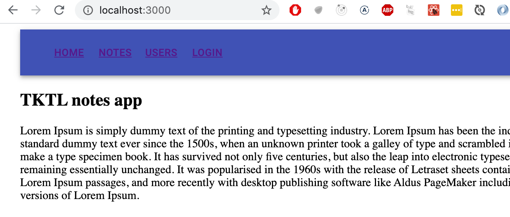
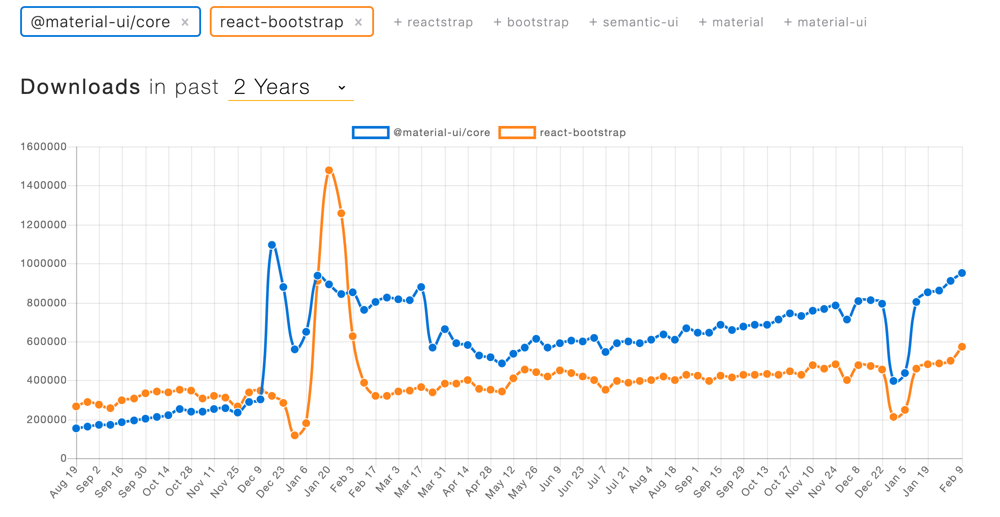

<div class="content">

Osassa 2 on jo katsottu kahta tapaa tyylien lisäämiseen eli vanhan koulukunnan [yksittäistä CSS](/osa2#tyylien-lisääminen)-tiedostoa, [inline-tyylejä](/osa2/tyylien_lisaaminen_react_sovellukseen#inline-tyylit). Katsotaan tässä osassa vielä muutamaa tapaa.

### Valmiit käyttöliittymätyylikirjastot

Eräs lähestymistapa sovelluksen tyylien määrittelyyn on valmiin "UI frameworkin", eli suomeksi ehkä käyttöliittymätyylikirjaston käyttö.

Ensimmäinen laajaa kuuluisuutta saanut UI framework oli Twitterin kehittämä [Bootstrap](https://getbootstrap.com/), joka lienee edelleen UI frameworkeista eniten käytetty. Viime aikoina UI frameworkeja on noussut kuin sieniä sateella. Valikoima on niin iso, ettei tässä kannata edes yrittää tehdä tyhjentävää listaa.

Monet UI-frameworkit sisältävät web-sovellusten käyttöön valmiiksi määriteltyjä teemoja sekä "komponentteja", kuten painikkeita, menuja, taulukkoja. Termi komponentti on edellä kirjotettu hipsuissa sillä kyse ei ole samasta asiasta kuin React-komponentti. Useimmiten UI-frameworkeja käytetään sisällyttämällä sovellukseen frameworkin määrittelemät CSS-tyylitiedostot sekä Javascript-koodi.

Monesta UI-frameworkista on tehty React-ystävällisiä versiota, joissa UI-frameworkin avulla määritellyistä "komponenteista" on tehty React-komponentteja. Esim. Bootstrapista on olemassa parikin React-versiota joista suosituin on [react-bootstrap](https://react-bootstrap.github.io/).

Katsotaan seuraavaksi kahta UI-framworkia bootstrapia ja [MaterialUI](https://material-ui.com/):ta. Lisätään molempien avulla samantapaiset tyylit luvun [React-router](/osa7/react_router) sovellukseen.

### react bootstrap

Aloitetaan bootstrapista, käytetään kirjastoa [react-bootstrap](https://react-bootstrap.github.io/).

Asennetaan kirjasto suorittamalla komento

```js
npm install --save react-bootstrap
```

Lisätään sitten sovelluksen tiedostoon <i>public/index.html</i> tagin <i>head</i> sisään bootstrapin css-määrittelyt lataava rivi:

```js
<head>
  <link
    rel="stylesheet"
    href="https://maxcdn.bootstrapcdn.com/bootstrap/4.3.1/css/bootstrap.min.css"
    integrity="sha384-ggOyR0iXCbMQv3Xipma34MD+dH/1fQ784/j6cY/iJTQUOhcWr7x9JvoRxT2MZw1T"
    crossorigin="anonymous"
  />
  // ...
</head>
```

Kun sovellus ladataan uudelleen, näyttää se jo aavistuksen tyylikkäämmältä:


Bootstrapissa koko sivun sisältö renderöidään yleensä [container](https://getbootstrap.com/docs/4.1/layout/overview/#containers):ina, eli käytännössä koko sovelluksen ympäröivä _div_-elementti merkitään luokalla _container_:

```js
const App = () => {
  // ...

  return (
    <div class="container"> // highlight-line
      // ...
    </div>
  )
}
```

Sovelluksen ulkoasu muuttuu siten, että sisältö ei ole enää yhtä kiinni selaimen reunoissa:


Muutetaan seuraavaksi komponenttia <i>Notes</i> siten, että se renderöi muistiinpanojen listan [taulukkona](https://getbootstrap.com/docs/4.1/content/tables/). React bootstrap tarjoaa valmiin komponentin [Table](https://react-bootstrap.github.io/components/table/), joten CSS-luokan käyttöön ei ole tarvetta.

```js
const Notes = (props) => (
  <div>
    <h2>Notes</h2>
    <Table striped> // highlight-line
      <tbody>
        {props.notes.map(note =>
          <tr key={note.id}>
            <td>
              <Link to={`/notes/${note.id}`}>
                {note.content}
              </Link>
            </td>
            <td>
              {note.user}
            </td>
          </tr>
        )}
      </tbody>
    </Table>
  </div>
)
```

Ulkoasu on varsin tyylikäs:


Huomaa, että koodissa käytettävät React bootstrapin komponentit täytyy importata, eli koodiin on lisättävä:

```js
import { Table } from 'react-bootstrap'
```

#### Lomake

Parannellaan seuraavaksi näkymän <i>Login</i> kirjautumislomaketta Bootstrapin [lomakkeiden](https://getbootstrap.com/docs/4.1/components/forms/) avulla.

React bootstrap tarjoaa valmiit [komponentit](https://react-bootstrap.github.io/components/forms/) myös lomakkeiden muodostamiseen (dokumentaatio tosin ei ole paras mahdollinen):

```js
let Login = (props) => {
  // ...
  return (
    <div>
      <h2>login</h2>
      <Form onSubmit={onSubmit}>
        <Form.Group>
          <Form.Label>username:</Form.Label>
          <Form.Control
            type="text"
            name="username"
          />
          <Form.Label>password:</Form.Label>
          <Form.Control
            type="password"
          />
          <Button variant="primary" type="submit">
            login
          </Button>
        </Form.Group>
      </Form>
    </div>
)}
```

Importoitavien komponenttien määrä kasvaa:

```js
import { Table, Form, Button } from 'react-bootstrap'
```

Lomake näyttää parantelun jälkeen seuraavalta:


#### Notifikaatio

Toteutetaan sovellukseen kirjautumisen jälkeinen <i>notifikaatio</i>:


Asetetaan notifikaatio kirjautumisen yhteydessä komponentin <i>App</i> tilan muuttujaan _message_:

```js
const App = () => {
  const [notes, setNotes] = useState([
    // ...
  ])

  const [user, setUser] = useState(null)
  const [message, setMessage] = useState(null) // highlight-line

  const login = (user) => {
    setUser(user)
    // highlight-start
    setMessage(`welcome ${user}`)
    setTimeout(() => {
      setMessage(null)
    }, 10000)
    // highlight-end
  }
  // ...
}
```

ja renderöidään viesti Bootstrapin [Alert](https://getbootstrap.com/docs/4.1/components/alerts/)-komponentin avulla. React bootstrap tarjoaa tähän jälleen valmiin [React-komponentin](https://react-bootstrap.github.io/components/alerts/):

```js
<div className="container">
// highlight-start
  {(message &&
    <Alert variant="success">
      {message}
    </Alert>
  )}
// highlight-end
  // ...
</div>
```

#### Navigaatiorakenne

Muutetaan vielä lopuksi sovelluksen navigaatiomenu käyttämään Bootstrapin [Navbaria](https://getbootstrap.com/docs/4.1/components/navbar/). Tähänkin React bootstrap tarjoaa [valmiit komponentit](https://react-bootstrap.github.io/components/navbar/#navbars-mobile-friendly), dokumentaatio on hieman kryptistä, mutta trial and error johtaa lopulta toimivaan ratkaisuun:

```js
<Navbar collapseOnSelect expand="lg" bg="dark" variant="dark">
  <Navbar.Toggle aria-controls="responsive-navbar-nav" />
  <Navbar.Collapse id="responsive-navbar-nav">
    <Nav className="mr-auto">
      <Nav.Link href="#" as="span">
        <Link style={padding} to="/">home</Link>
      </Nav.Link>
      <Nav.Link href="#" as="span">
        <Link style={padding} to="/notes">notes</Link>
      </Nav.Link>
      <Nav.Link href="#" as="span">
        <Link style={padding} to="/users">users</Link>
      </Nav.Link>
      <Nav.Link href="#" as="span">
        {user
          ? <em>{user} logged in</em>
          : <Link to="/login">login</Link>
        }
    </Nav.Link>
    </Nav>
  </Navbar.Collapse>
</Navbar>
```

Ulkoasu on varsin tyylikäs


Jos selaimen kokoa kaventaa, huomaamme että menu "kollapsoituu" ja sen saa näkyville vain klikkaamalla:


Bootstrap ja valtaosa tarjolla olevista UI-frameworkeista tuottavat [responsiivisia](https://en.wikipedia.org/wiki/Responsive_web_design) näkymiä, eli sellaisia jotka renderöityvät vähintään kohtuullisesti monen kokoisilla näytöillä.

Chromen developer-konsolin avulla on mahdollista simuloida sovelluksen käyttöä erilaisilla mobiilipäätteillä


Esimerkin sovelluksen koodi kokonaisuudessaan [täällä](https://github.com/fullstack-hy2020/misc/blob/master/notes-bootstrap.js)

### Material UI

Tarkastellaan toisena esimerkkinä Googlen kehittämän "muotokielen" [Material designin](https://material.io/) toteuttavaa React-kirjastoa [MaterialUI](https://material-ui.com/). 

Asennetaan kirjasto suorittamalla komento

```js
npm install --save @material-ui/core
```

Lisätään sitten sovelluksen tiedostoon <i>public/index.html</i> tagin <i>head</i> sisään bootstrapin css-määrittelyt lataava rivi:

```js
<head>
  <link rel="stylesheet" href="https://fonts.googleapis.com/css?family=Roboto:300,400,500,700&display=swap" />
  // ...
</head>
```

Tehdään nyt MaterialUI:n avulla koodiin suunnilleen samat muutokset, mitä teimme bootstrapilla.

Renderöidään koko sovelluksen sisältö komponentin [Container](https://material-ui.com/components/container/) sisälle:

```js
import Container from '@material-ui/core/Container'

const App = () => {
  // ...
  return (
    <Container>
      // ...
    </Container>
  )
}
```

Aloitetaan komponentista <i>Notes</i> ja renderöidään muistiinpanojen lista [taulukkona](https://material-ui.com/components/tables/#simple-table):

```js
const Notes = ({notes}) => (
  <div>
    <h2>Notes</h2>

    <TableContainer component={Paper}>
      <Table>
        <TableBody>
          {notes.map(note => (
            <TableRow key={note.id}>
              <TableCell>
                <Link to={`/notes/${note.id}`}>{note.content}</Link>
              </TableCell>
              <TableCell>
                {note.name}
              </TableCell>
            </TableRow>
          ))}
        </TableBody>
      </Table>
    </TableContainer>
  </div>
)
```

Taulukko näyttää seuraavalta:


Hienoinen ikävä piirre Material UI:ssa on se, että jokainen komponentti on importattava erikseen, muistiinpanojen sivun import-lista on aika pitkä:

```js
import {
  Container,
  Table,
  TableBody,
  TableCell,
  TableContainer,
  TableRow,
  Paper,
} from '@material-ui/core'
```

#### Lomake

Parannellaan seuraavaksi näkymän <i>Login</i> kirjautumislomaketta käyttäen komponentteja [TextField](https://material-ui.com/components/text-fields/) ja [Button](https://material-ui.com/api/button/):

```js 
const Login = (props) => {
  const history = useHistory()

  const onSubmit = (event) => {
    event.preventDefault()
    props.onLogin('mluukkai')
    history.push('/')
  }

  return (
    <div>
      <h2>login</h2>
      <form onSubmit={onSubmit}>
        <div>
          <TextField label="username" />
        </div>
        <div>
          <TextField  label="password" type='password' />
        </div>
        <div>
          <Button variant="contained" color="primary" type="submit">
            login
          </Button>
        </div>
      </form>
    </div>
  )
}
```

Lopputulos on:


Bootstrapiin verrattuna pieni ero on nyt se, että MaterialUI ei tarjoa erillistä komponenttia itse lomakkeelle, lomake tehdään normaaliin tapaan HTML:n [form](https://developer.mozilla.org/en-US/docs/Web/HTML/Element/form)-elementtinä.

Lomakkeen käyttämät komponentit on luonnollisesti importattava koodissa. 

#### Notifikaatio

Kirjautumisen jälkeisen notifikaation näyttämiseen sopii komponenetti [Alert](https://material-ui.com/components/alert/), joka on lähes samanlainen kuin bootstrapin vastaava komponentti: 

```js
<div>
// highlight-start
  {(message &&
    <Alert severity="success">
      {message}
    </Alert>
  )}
// highlight-end
</div>
```

Alert-komponentti ei ole vielä mukana MaterialUI:n core-pakkauksessa, ja komponentin sisältävä pakkaus [lab](https://material-ui.com/components/about-the-lab/) tulee asentaa sovellukseen:

```js 
npm install --save @material-ui/lab
```

Komponentti importataan seuraavasti

```js 
import { Alert } from '@material-ui/lab'
```

Alert on ulkoasultaan tyylikäs:


#### Navigaatiorakenne

Navigaatiorakenne toteutetaan komponentin [AppBar](https://material-ui.com/components/app-bar/) avulla

Jos sovelletaan suoraan dokumentaation esimerkkiä  

```js
<AppBar position="static">
  <Toolbar>
    <IconButton edge="start" color="inherit" aria-label="menu">
    </IconButton>
    <Button color="inherit">
      <Link to="/">home</Link>
    </Button>
    <Button color="inherit">
      <Link to="/notes">notes</Link>
    </Button>
    <Button color="inherit">
      <Link to="/users">users</Link>
    </Button>  
    <Button color="inherit">
      {user
        ? <em>{user} logged in</em>
        : <Link to="/login">login</Link>
      }
    </Button>                
  </Toolbar>
</AppBar>
```

saadaan kyllä toimiva ratkaisu, mutta sen ulkonäkö ei ole paras mahdollinen



Lueskelemalla [dokumentaatiota](https://material-ui.com/guides/composition/#routing-libraries), löytyy parempi tapa eli [component props](https://material-ui.com/guides/composition/#component-prop), jonka avulla voidaan muuttaa se miten MaterialUI-komponentin juurielementti renderöityy.

Määrittelemällä

```js
<Button color="inherit" component={Link} to="/">
  home
</Button>
```

renderöidään komponentti _Button_, siten että sen juurikomponenttina onkin react-redux-kirjaston komponentti _Link_, jolle siirtyy polun kertova props _to_.  

Navigaatiopalkin koodi kokonaisuudessaan on seuraava

```js
<AppBar position="static">
  <Toolbar>
    <Button color="inherit" component={Link} to="/">
      home
    </Button>
    <Button color="inherit" component={Link} to="/notes">
      notes
    </Button>
    <Button color="inherit" component={Link} to="/users">
      users
    </Button>   
    {user
      ? <em>{user} logged in</em>
      : <Button color="inherit" component={Link} to="/login">
          LINK
        </Button>
    }                              
  </Toolbar>
</AppBar>
```

ja lopputulos on haluamamme kaltainen


Esimerkin sovelluksen koodi kokonaisuudessaan [täällä](https://github.com/fullstack-hy2020/misc/blob/master/notes-materialui.js)

### Loppuhuomioita

Ero react-bootstrapin ja MaterialUI:n välillä ei ole suuri. On makuasia kummalla tuotettu ulkoasu on tyylikkäämpi. En ole itse käyttänut MaterialUI:ta kovin paljoa, mutta ensikosketus on positiivinen. Dokumentaatio vaikuttaa aavistuksen react-bootstrapin dokumentaatiota selkeämmältä. Eri npm-kirjastojen lautausmääriä vertailevan sivuston https://www.npmtrends.com/ mukaan MaterialUI ohitti react-boostrapin suosiossa vuoden 2018 loppupuolella:



Esimerkeissä käytettiin UI-frameworkeja niiden React-integraatiot tarjoavien kirjastojen kautta.

Sen sijaan että käytämme kirjastoa [react bootstrap](https://react-bootstrap.github.io/), olisimme voineet aivan yhtä hyvin käyttää [Bootstrapia](https://getbootstrap.com/) suoraan, liittämällä HTML-elementteihin CSS-luokkia. Eli sen sijaan että määrittelimme esim. taulukon komponentin <i>Table</i> avulla

```js
<Table striped>
  // ...
</Table>
```

olisimme voineet käyttää normaalia HTML:n taulukkoa <i>table</i> ja Bootstrapin [määrittelemää](https://getbootstrap.com/docs/4.4/content/tables/) CSS-luokkaa

```js
<table className="table striped">
  // ...
</table>
```

Taulukon määrittelyssä React bootstrapin tuoma etu ei ole suuri.

Tiiviimmän ja ehkä paremmin luettavissa olevan kirjoitusasun lisäksi toinen etu React-kirjastoina olevissa UI-frameworkeissa on se, että kirjastojen mahdollisesti käyttämä Javascript-koodi on sisällytetty React-komponentteihin. Esim. osa Bootstrapin komponenteista edellyttää toimiakseen muutamaakin ikävää [Javascript-riippuvuutta](https://getbootstrap.com/docs/4.1/getting-started/introduction/#js), joita emme mielellään halua React-sovelluksiin sisällyttää.

React-kirjastoina tarjottavien UI-frameworkkien ikävä puoli verrattuna frameworkin "suoraan käyttöön" on React-kirjastojen API:n mahdollinen epästabiilius ja osittain huono dokumentaatio. 

Kokonaan toinen kysymys on se kannattaako UI-frameworkkeja ylipäätän käyttää. Kukin muodostakoon oman mielipiteensä, mutta CSS:ää taitamattomalle ja puutteellisilla design-taidoilla varustetulle ne ovat varsin käyttökelpoisia työkaluja.

### Muita UI-frameworkeja

Luetellaan tässä kaikesta huolimatta muitakin UI-frameworkeja. Jos oma suosikkisi ei ole mukana, tee pull request

- <https://bulma.io/>
- <https://ant.design/>
- <https://get.foundation/>
- <https://chakra-ui.com/>
- <https://tailwindcss.com/>

### Styled components

Tapoja liittää tyylejä React-sovellukseen on jo näkemiämme lisäksi [muitakin](https://blog.bitsrc.io/5-ways-to-style-react-components-in-2019-30f1ccc2b5b).

Mielenkiintoisen näkökulman tyylien määrittelyyn tarjoaa ES6:n [tagged template literal](https://developer.mozilla.org/en-US/docs/Web/JavaScript/Reference/Template_literals) -syntaksia hyödyntävä [styled components](https://www.styled-components.com/) -kirjasto.

Asennetaan styled-components ja tehdään sen avulla esimerkkisovellukseemme muutama tyylillinen muutos. Tehdään ensin kaksi tyylimäärittelyitä käytettävää komponenttia:

```js
import styled from 'styled-components'

const Button = styled.button`
  background: Bisque;
  font-size: 1em;
  margin: 1em;
  padding: 0.25em 1em;
  border: 2px solid Chocolate;
  border-radius: 3px;
`

const Input = styled.input`
  margin: 0.25em;
`
```

Koodi luo HTML:n elementeistä <i>button</i> ja <i>input</i> tyyleillä rikastetut versiot ja sijoitetaan ne muuttujiin <i>Button</i> ja <i>Input</i>.

Tyylien määrittelyn syntaksi on varsin mielenkiintoinen, css-määrittelyt asetetaan backtick-hipsujen sisään.

Määritellyt komponentit toimivat kuten normaali <i>button</i> ja <i>input</i> ja sovelluksessa käytetään niitä  normaaliin tapaan:

```js
const Login = (props) => {
  // ...
  return (
    <div>
      <h2>login</h2>
      <form onSubmit={onSubmit}>
        <div>
          username:
          <Input /> // highlight-line
        </div>
        <div>
          password:
          <Input type='password' /> // highlight-line
        </div>
        <Button type="submit" primary=''>login</Button> // highlight-line
      </form>
    </div>
  )
}
```

Määritellään vielä seuraavat tyylien lisäämiseen tarkoitetut komponentit, jotka ovat kaikki rikastettuja versioita <i>div</i>-elementistä:

```js
const Page = styled.div`
  padding: 1em;
  background: papayawhip;
`

const Navigation = styled.div`
  background: BurlyWood;
  padding: 1em;
`

const Footer = styled.div`
  background: Chocolate;
  padding: 1em;
  margin-top: 1em;
`
```

Otetaan uudet komponentit käyttöön sovelluksessa:

```js
const App = () => {
  // ...

  return (
    <Page> // highlight-line
      <Navigation> // highlight-line
        <Link style={padding} to="/">home</Link>
        <Link style={padding} to="/notes">notes</Link>
        <Link style={padding} to="/users">users</Link>
        {user
          ? <em>{user} logged in</em>
          : <Link style={padding} to="/login">login</Link>
        }
      </Navigation> // highlight-line

      <Switch>
        <Route path="/notes/:id">
          <Note note={note} />
        </Route>
        <Route path="/notes">
          <Notes notes={notes} />
        </Route>
        <Route path="/users">
          {user ? <Users /> : <Redirect to="/login" />}
        </Route>
        <Route path="/login">
          <Login onLogin={login} />
        </Route>
        <Route path="/">
          <Home />
        </Route>
      </Switch>
      
      <Footer> // highlight-line
        <em>Note app, Department of Computer Science 2020</em>
      </Footer> // highlight-line
    </Page> // highlight-line
  )
}
```

Lopputulos on seuraavassa:


Styled components on nostanut tasaisesti suosiotaan viime aikoina ja tällä hetkellä näyttääkin, että se on melko monien mielestä paras tapa React-sovellusten tyylien määrittelyyn.

</div>

<div class="tasks">

### Tehtäviä

Tämän luvun asioihin liittyvät tehtävät ovat osan lopun [blogilistaa laajentavassa tehtäväsarjassa](/osa7/tehtavia_blogilistan_laajennus).

</div>
