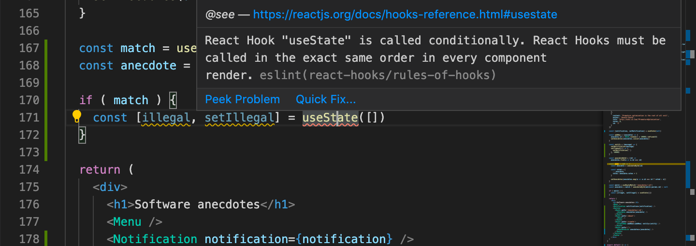
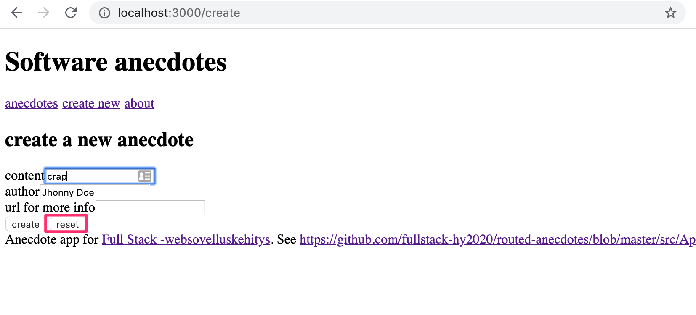
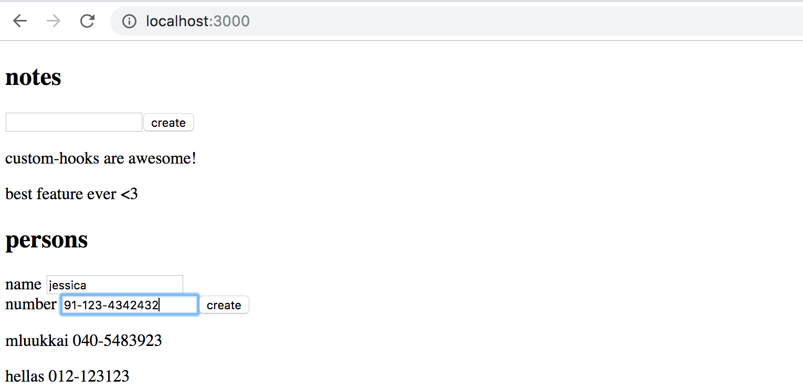

<div class="content">
Div class"content"

<!-- Kurssin seitsemännen osan tehtävät poikkeavat jossain määrin. Edellisessä ja tässä luvussa on normaaliin tapaan [luvun teoriaan liittyviä tehtäviä](/osa7/custom_hookit#tehtavat-7-4-7-6). -->
! -- kurssin seitsem nnen osen san 对 poikkeavat jossain m rin.edellisses ja t ss luvussa 对 normaaliin tapaan luvun teoriaan liittyvi tevi / osa7 / custom hookit # tehtavat-7-4-7-6. --
The exercises in this part are a bit different than the exercises in the previous parts. The exercises in the previous part and the exercises in this part [are about the theory presented in this part](/osa7/custom_hookit#tehtavat-7-4-7-6).
这一部分的练习与前几部分的练习有点不同。 前一部分的练习和这一部分的练习是关于这一部分提出的理论。

<!-- Tämän ja seuraavan luvun tehtävien lisäksi seitsemäs osa sisältää kertaavan ja soveltavan [tehtäväsarjan](/osa7/tehtavia_blogilistan_laajennus), jossa laajennetaan osissa 4 ja 5 tehtyä Bloglist-sovellusta. -->
——在这里输入译文在这里输入译文在这里输入译文在这里输入译文在这里输入译文在这里输入译文在这里输入译文在这里输入译文在这里输入译文在这里输入译文在这里输入译文在这里输入译文在这里输入译文在这里输入译文在这里输入译文在这里输入译文在这里输入译文在这里输入译文在这里输入译文
This part also contains a [series of exercises](/osa7/tehtavia_blogilistan_laajennus) in which we modify the Bloglist application from parts 4 and 5 to rehearse and apply the skills we have learned.
本部分还包含一系列练习(/ osa7 / tehtavia blogilistan laajennus) ，其中我们从第4部分和第5部分修改 Bloglist 应用程序，以排练和应用我们所学到的技能。

### Hooks
钩子

React offers 10 different [built-in hooks](https://reactjs.org/docs/hooks-reference.html), of which the most popular ones are the [useState](https://reactjs.org/docs/hooks-reference.html#usestate) and [useEffect](https://reactjs.org/docs/hooks-reference.html#useeffect) hooks, that we have already been using extensively.
React 提供了10种不同的内置钩子，其中最受欢迎的是我们已经广泛使用的[ useState ]( https://reactjs.org/docs/hooks-reference.html  https://reactjs.org/docs/hooks-reference.html#useState )和[ useEffect ]( https://reactjs.org/docs/hooks-reference.html#useEffect )钩子。

<!-- Käytimme [osassa 5](/osa5/props_children_ja_proptypet#ref-eli-viite-komponenttiin) hookia -->
! -- k ytimme osassa 5 / osa5 / proptypet children ja # ref-eli-viite-komponenttiin hookia -- 
<!-- [useImperativeHandle](https://reactjs.org/docs/hooks-reference.html#useimperativehandle), jonka avulla komponentin sisäinen funktio pystyttiin tarjoamaan näkyville komponentin ulkopuolelle. -->
! -- useimperativehandle https: / / reactjs. org / docs / hooks-reference. html # useimperativehandle，jonka avulla komponentin sis inen funktio pystytiin tarjoamaan n kyville komponentin ukopuolelle. ——
In [part 5](/osa5/props_children_ja_proptypet#ref-eli-viite-komponenttiin) we used the [useImperativeHandle](https://reactjs.org/docs/hooks-reference.html#useimperativehandle)-hook which allows for components to provide their functions to other components.
在[ part 5](/ osa5 / proptypet children ja # ref-eli-viite-komponenttiin)中，我们使用了[ useImperativeHandle ]( https://reactjs.org/docs/hooks-reference.html#useImperativeHandle )-hook，它允许组件为其他组件提供其功能。

<!-- Viimeisen vuoden aikana moni Reactin apukirjasto on ruvennut tarjoamaan hook-perustaisen rajapinnan. [Osassa 6](/osa6/flux_arkkitehtuuri_ja_redux#redux-storen-valittaminen-eri-komponenteille) -->
! -- viimeisen vuoden aikana moni reactin apukirjasto on ruvennut tarjoamaan hook-perustaisen rajapinnan.osassa 6 / osa6 / flux arkkitehtuuri ja redux # redux-storen-valittaminen-eri-komponenteille --
Within the last year many React libraries have begun to offer hook based apis. [In part 6](/osa6/flux_arkkitehtuuri_ja_redux#redux-storen-valittaminen-eri-komponenteille)
在过去的一年里，许多 React 库已经开始提供基于 hook 的 api
<!-- käytimme react-redux-kirjaston hookeja [useSelector](https://react-redux.js.org/api/hooks#useselector) ja [useDispatch](https://react-redux.js.org/api/hooks#usedispatch) välittämään redux-storen ja dispatch-funktion niitä tarvitseville komponenteille. Reduxin hook-perustainen api onkin huomattavasti helpompi käyttää kuin vanhempi, mutta edelleen käytössä oleva[connect](/osa6/connect)-api . -->
<！ - k ytimme redux-kirjaston hookeja [ useSelector ](useSelector) ja [ https://react-redux.js.org/api/hooks#useSelector ]( https://react-redux.js.org/api/hooks#useDispatch ) v litt m n redux-storen ja dispatch-funktion niit tarvitseville komponenteille. Reduxin hook-peruduen staen api onkin huomattavasti helppi k ytt kuin vanhempi，mutta edelleen k yt ss oleva [ connect ](/ osa6 / connect)-api.  -->
we used the [useSelector](https://react-redux.js.org/api/hooks#useselector) and [useDispatch](https://react-redux.js.org/api/hooks#usedispatch) hooks from the react-redux library to share our redux-store and dispatch function to our components. Redux's hook based api is a lot easier to use than its older, still available, [connect](/osa6/connect)-api.
我们使用 react-redux 库中的[ useSelector ]( https://react-redux.js.org/api/hooks#useSelector )和[ useDispatch ]( https://react-redux.js.org/api/hooks#useDispatch )钩子来共享我们对组件的 redux-store 和 dispatch 函数。 Redux 的基于钩子的 api 比旧的、仍然可用的[ connect ](/ osa6 / connect)-api 更易于使用。

<!-- Myös edellisessä [luvussa](/osa7/react_router/) käsitelyn [react-routerin](https://reacttraining.com/react-router/web/guides) api perustuu osin [hookeihin](https://reacttraining.com/react-router/web/api/Hooks), joiden avulla päästiin käsiksi routejen parametroituun osaan, sekä history-olioon, joka mahdollistaa selaimen osoiterivin manipuloinnin koodista. -->
<！ - my s edellissa [ luvussa ](/ osa7 / react router /) k sitelyn [ react-routerin ](react-routerin) api perustuu osin [ hookeihin ]( https://reacttraining.com/react-router/web/guides ) ，joiden avulla p stiin k parameder si routejen troituan，sek history-olioon，joka mahdollistaa selaimen osoiterivin kodista.  -->
[React-router's](https://reacttraining.com/react-router/web/guides) api we introduced in the [previous part](/osa7/react_router/) is also partially [hook](https://reacttraining.com/react-router/web/api/Hooks) based. Its hooks can be used to access url parameters and the history object, which allows for manipulating the browser url programmatically.
我们在[上一部分](/ osa7 / react router /)中介绍的[ React-router 的]( https://reacttraining.com/React-router/web/guides ) api 也部分基于[ hook ]( https://reacttraining.com/React-router/web/api/hooks )。 它的钩子可以用来访问 url 参数和历史对象，这允许以编程方式操作浏览器的 url。

As mentioned in [part 1](/en/part1/a_more_complex_state_debugging_react_apps#rules-of-hooks), hooks are not normal functions, and when using those we have to adhere to certain [rules or limitations](https://reactjs.org/docs/hooks-rules.html). Let's recap the rules of using hooks, copied verbatim from the official React documentation:
正如在[ part 1](/ en / part1 / a 更复杂的状态调试反应应用程序 # rules-of-hooks)中提到的，钩子不是正常的函数，在使用这些函数时，我们必须遵守某些[规则或限制]( https://reactjs.org/docs/hooks-rules.html )。 让我们回顾一下使用钩子的规则，一字不差地从官方的 React 文档中复制下来:

**Don’t call Hooks inside loops, conditions, or nested functions.** Instead, always use Hooks at the top level of your React function. 
* * 不要在循环、条件或嵌套函数中调用 Hooks。 * * 取而代之的是，始终在 React 函数的顶层使用 Hooks。

**Don’t call Hooks from regular JavaScript functions.** Instead, you can:
不要从常规的 JavaScript 函数中调用 Hooks:

- Call Hooks from React function components.
- 从 React 函数组件调用挂钩。
- Call Hooks from custom Hooks
- 从定制钩子调用钩子

There's an existing [ESlint](https://www.npmjs.com/package/eslint-plugin-react-hooks) rule that can be used to verify that the application uses hooks correctly. 
有一个现有的[ ESlint ]( https://www.npmjs.com/package/ESlint-plugin-react-hooks )规则可以用来验证应用程序是否正确地使用钩子。

Create-react-app has readily configured rule [eslint-plugin-react-hooks](https://www.npmjs.com/package/eslint-plugin-react-hooks) that complains if hooks are used in an illegal manner:
创建-反应-应用程序已经很容易配置规则[ eslint-plugin-react-hooks ]( https://www.npmjs.com/package/eslint-plugin-react-hooks ) ，如果钩子被非法使用就会抱怨:


! [](. . / . / images / 7 / 60ea.png)

### Custom hooks
定制钩子

React offers the option to create our own [custom](https://reactjs.org/docs/hooks-custom.html) hooks. According to React, the primary purpose of custom hooks is to facilitate the reuse of the logic used in components.
React 提供了创建我们自己的[自定义]( https://reactjs.org/docs/hooks-custom.html )钩子的选项。 根据 React，自定义挂钩的主要目的是促进组件中使用的逻辑的重用。

> <i>Building your own Hooks lets you extract component logic into reusable functions.</i>
I 构建自己的 hook 可以让您将组件逻辑提取到可重用的函数中


Custom hooks are regular JavaScript functions that can use any other hooks, as long as they adhere to the [rules of hooks](/en/part1/a_more_complex_state_debugging_react_apps#rules-of-hooks). Additionally, the name of custom hooks must start with the word _use_.
自定义钩子是常规的 JavaScript 函数，可以使用任何其他钩子，只要它们遵循[ hook 的规则](/ en / part1 / a 更复杂的状态调试反应应用 # rules-of-hooks)。 此外，自定义钩子的名称必须以单词 use 开头。


We implemented a counter application in [part 1](/en/part1/component_state_event_handlers#event-handling), that can have its value incremented, decremented, or reset. The code of the application is as follows:
我们在[ part 1](/ en / part1 / component state handlers # event-handling)中实现了一个计数器应用程序，它的值可以递增、递减或重置。 申请编号如下:

```js  
import React, { useState } from 'react'
const App = (props) => {
  const [counter, setCounter] = useState(0)

  return (
    <div>
      <div>{counter}</div>
      <button onClick={() => setCounter(counter + 1)}>
        plus
      </button>
      <button onClick={() => setCounter(counter - 1)}>
        minus
      </button>      
      <button onClick={() => setCounter(0)}>
        zero
      </button>
    </div>
  )
}
```

Let's extract the counter logic into its own custom hook. The code for the hook is as follows:
让我们将计数器逻辑提取到它自己的自定义钩子中，钩子的代码如下:

```js
const useCounter = () => {
  const [value, setValue] = useState(0)

  const increase = () => {
    setValue(value + 1)
  }

  const decrease = () => {
    setValue(value - 1)
  }

  const zero = () => {
    setValue(0)
  }

  return {
    value, 
    increase,
    decrease,
    zero
  }
}
```

Our custom hook uses the _useState_ hook internally to create its own state. The hook returns an object, the properties of which include the value of the counter as well as functions for manipulating the value.
我们的自定义钩子在内部使用 useState 钩子来创建自己的状态。 钩子返回一个对象，其属性包括计数器的值以及操作值的函数。


React components can use the hook as shown below:
反应组件可以使用如下所示的挂钩:

```js
const App = (props) => {
  const counter = useCounter()

  return (
    <div>
      <div>{counter.value}</div>
      <button onClick={counter.increase}>
        plus
      </button>
      <button onClick={counter.decrease}>
        minus
      </button>      
      <button onClick={counter.zero}>
        zero
      </button>
    </div>
  )
}
```


By doing this we can extract the state of the _App_ component and its manipulation entirely into the _useCounter_ hook. Managing the counter state and logic is now the responsibility of the custom hook.
通过这样做，我们可以将 App 组件的状态及其操作完全提取到 useCounter 钩子中。 管理计数器状态和逻辑现在是自定义钩子的责任。


The same hook could be <i>reused</i> in the application that was keeping track of the amount of clicks made to the left and right buttons:
同样的钩子可以在记录左右按钮点击次数的应用程序中重用 / i:

```js

const App = () => {
  const left = useCounter()
  const right = useCounter()

  return (
    <div>
      {left.value}
      <button onClick={left.increase}>
        left
      </button>
      <button onClick={right.increase}>
        right
      </button>
      {right.value}
    </div>
  )
}
```


The application creates <i>two</i> completely separate counters. The first one is assigned to the variable _left_ and the other to the variable _right_.
应用程序创建了两个完全独立的 i / i 计数器。 第一个分配给左边的变量，另一个分配给右边的变量。


Dealing with forms in React is somewhat tricky. The following application presents the user with a form that requests the user to input their name, birthday, and height:
在 React 中处理表单有点棘手。 下面的应用程序向用户提供一个表单，要求用户输入他们的姓名、生日和身高:

```js
const App = () => {
  const [name, setName] = useState('')
  const [born, setBorn] = useState('')
  const [height, setHeight] = useState('')

  return (
    <div>
      <form>
        name: 
        <input
          type='text'
          value={name}
          onChange={(event) => setName(event.target.value)} 
        /> 
        <br/> 
        birthdate:
        <input
          type='date'
          value={born}
          onChange={(event) => setBorn(event.target.value)}
        />
        <br /> 
        height:
        <input
          type='number'
          value={height}
          onChange={(event) => setHeight(event.target.value)}
        />
      </form>
      <div>
        {name} {born} {height} 
      </div>
    </div>
  )
}
```


Every field of the form has its own state. In order to keep the state of the form synchronized with the data provided by the user, we have to register an appropriate <i>onChange</i> handler for each of the <i>input</i> elements.
形体的每个字段都有自己的状态。 为了使表单的状态与用户提供的数据保持同步，我们必须为每个 i input / i 元素注册一个适当的 i onChange / i 处理程序。


Let's define our own custom _useField_ hook, that simplifies the state management of the form:
让我们定义我们自己的定制 useField hook，它简化了表单的状态管理:

```js
const useField = (type) => {
  const [value, setValue] = useState('')

  const onChange = (event) => {
    setValue(event.target.value)
  }

  return {
    type,
    value,
    onChange
  }
}
```


The hook function receives the type of the input field as a parameter. The function returns all of the attributes required by the <i>input</i>: its type, value and the onChange handler.
钩子函数接收输入字段的类型作为参数。 函数返回 i input / i 所需的所有属性: 它的类型、值和 onChange 处理程序。


The hook can be used in the following way:
钩子可以用以下方式使用:

```js
const App = () => {
  const name = useField('text')
  // ...

  return (
    <div>
      <form>
        <input
          type={name.type}
          value={name.value}
          onChange={name.onChange} 
        /> 
        // ...
      </form>
    </div>
  )
}
```


### Spread attributes
传播属性


We could simplify things a bit further. Since the _name_ object has exactly all of the attributes that the <i>input</i> element expects to receive as props, we can pass the props to the element using the [spread syntax](https://reactjs.org/docs/jsx-in-depth.html#spread-attributes) in the following way:
我们可以进一步简化事情。 因为 name 对象具有 i input / i 元素期望作为道具接收的所有属性，所以我们可以使用[ spread syntax ]( https://reactjs.org/docs/jsx-in-depth.html#spread-attributes )以下面的方式将道具传递给元素:

```js
<input {...name} /> 
```


As the [example](https://reactjs.org/docs/jsx-in-depth.html#spread-attributes) in the React documentation states, the following two ways of passing props to a component achieve the exact same result:
正如 React 文档中的[示例]( https://reactjs.org/docs/jsx-in-depth.html#spread-attributes )所述，以下两种方法为组件传递道具可以得到完全相同的结果:

```js
<Greeting firstName='Arto' lastName='Hellas' />

const person = {
  firstName: 'Arto',
  lastName: 'Hellas'
}

<Greeting {...person} />
```


The application gets simplified into the following format:
申请将简化为以下格式:

```js
const App = () => {
  const name = useField('text')
  const born = useField('date')
  const height = useField('number')

  return (
    <div>
      <form>
        name: 
        <input  {...name} /> 
        <br/> 
        birthdate:
        <input {...born} />
        <br /> 
        height:
        <input {...height} />
      </form>
      <div>
        {name.value} {born.value} {height.value}
      </div>
    </div>
  )
}
```


Dealing with forms is greatly simplified when the unpleasant nitty-gritty details related to synchronizing the state of the form is encapsulated inside of our custom hook.
当与同步表单状态有关的令人不快的细节被封装在自定义钩子中时，表单的处理就大大简化了。


Custom hooks are clearly not only a tool for reuse, they also provide a better way for dividing our code into smaller modular parts.
自定义钩子显然不仅是一种可重用的工具，它们还为将代码划分为更小的模块化部分提供了一种更好的方式。

### More about hooks
更多关于钩子

The internet is starting to fill up with more and more helpful material related to hooks. The following sources are worth checking out:
互联网上开始充斥着越来越多关于钩子的有用资料。 以下是值得一查的资料来源:

* [Awesome React Hooks Resouces](https://github.com/rehooks/awesome-react-hooks)
* [ Awesome React Hooks Resouces ]( https://github.com/rehooks/Awesome-React-Hooks )
* [Easy to understand React Hook recipes by Gabe Ragland](https://usehooks.com/)
* [易于理解的反应钩食谱由 Gabe Ragland 提供]( https://usehooks.com/ )
* [Why Do React Hooks Rely on Call Order?](https://overreacted.io/why-do-hooks-rely-on-call-order/)
* [为什么反应钩依赖于调用顺序? ]( https://overreacted.io/Why-Do-Hooks-Rely-on-Call-Order/ )

</div>
/ div

<div class="tasks">
Div 类”任务”


### Exercises 7.4.-7.8.
练习7.4-7.8。

We'll continue with the app from [exercises](/osa7/custom_hookit#tehtavat-7-4-7-6) of the chapter [react router](/en/part7/react_router). 
我们将继续使用[ exercises ](/ osa7 / custom hookit # tehtawat-7-4-7-6)中的应用程序[ react router ](/ en / part7 / react router)。

#### 7.4: anecdotes and hooks step1
7.4: 轶事和胡克斯第一步

Simplify the anecdote creation form of your application with the _useField_ custom hook we defined earlier.
使用我们前面定义的 usefeld 自定义钩子简化应用程序的轶事创建形式。

One natural place to save the custom hooks of your application is in the <i>/src/hooks/index.js</i> file.
保存应用程序的自定义钩子的一个自然位置是 i / src / hooks / index. js / i 文件。


If you use the [named export](https://developer.mozilla.org/en-US/docs/Web/JavaScript/Reference/Statements/export#Description) instead of the default export:
如果你使用[命名导出]( https://developer.mozilla.org/en-us/docs/web/javascript/reference/statements/export#description )代替默认导出:

```js
import { useState } from 'react'

export const useField = (type) => { // highlight-line
  const [value, setValue] = useState('')

  const onChange = (event) => {
    setValue(event.target.value)
  }

  return {
    type,
    value,
    onChange
  }
}

// modules can have several named exports
export const useAnotherHook = () => { // highlight-line
  // ...
}
```


Then [importing](https://developer.mozilla.org/en-US/docs/Web/JavaScript/Reference/Statements/import) happens in the following way:
然后[导入]( https://developer.mozilla.org/en-us/docs/web/javascript/reference/statements/import )以下面的方式发生:

```js
import  { useField } from './hooks'

const App = () => {
  // ...
  const username = useField('text')
  // ...
}
```


#### 7.5: anecdotes and hooks step2
7.5: 轶事和胡克斯第二步

Add a button to the form that you can use to clear all the input fields:
在表单中添加一个按钮，你可以用它来清除所有的输入框:


! [](. . / . / images / 7 / 61ea.png)

Expand the functionality of the <i>useField</i> hook so that it offers a new <i>reset</i> operation for clearing the field. 
扩展 i useField / i 钩子的功能，以便它提供一个新的 i reset / i 操作来清除字段。

Depending on your solution you may see the following warning in your console:
根据您的解决方案，您可能会在控制台中看到以下警告:


! [](. . / . / images / 7 / 62ea.png)

We will return to this warning in the next exercise.
我们将在下一个练习中回到这个警告。

#### 7.6: anecdotes and hooks step3
7.6: 轶事和胡克斯第三步

If your solution did not cause a warning to appear in the console you have already finished this exercise.
如果您的解决方案没有导致警告出现在控制台中，那么您已经完成了这个练习。

If you see the warning in the console, make the necessary changes to get rid of the `Invalid value for prop reset' on <input> tag` console warning. 
如果你在控制台中看到警告，做出必要的修改，去掉输入标签控制台警告上的‘支柱复位无效值’。

The reason for this warning is that after making the changes to your application, the following expression:
发出此警告的原因是，在对应用程序进行更改之后，下面的表达式:

```js
<input {...content}/>
```


Essentially, is the same as this:
从本质上来说，这是一样的:

```js
<input
  value={content.value} 
  type={content.type}
  onChange={content.onChange}
  reset={content.reset} // highlight-line
/>
```


The <i>input</i> element should not be given a <i>reset</i> attribute.
I input / i 元素不应该被赋予 i reset / i 属性。


One simple fix would be to not use the spread syntax and write all of the forms like this:
一个简单的解决方法是不使用 spread 语法，而是像这样写所有的表单:

```js
<input
  value={username.value} 
  type={username.type}
  onChange={username.onChange}
/>
```


If we were to do this we would lose much of the benefit provided by the <i>useField</i> hook. Instead, come up with a solution that fixes the issue, but is still easy to use with spread syntax.
如果我们这样做，我们将失去很多由 i useField / i 钩子提供的好处。 相反，要想出一个解决方案来修复这个问题，但仍然易于使用传播语法。

#### 7.7: country hook
7.7: country hook

<!-- Palataan hetkeksi tehtäväsarjan [2.12-14](/osa2/palvelimella_olevan_datan_hakeminen#tehtavat-2-11-2-14) tunnelmiin. -->
! -- palataan hetkeksi teht v sarjan 2.12-14 / osa2 / palvelimella olevan datan hakeminen # tehtawatvat-2-11-2-14 tunnelmiin. -- 
Let's return to the exercises [2.12-14](/osa2/palvelimella_olevan_datan_hakeminen#tehtavat-2-11-2-14).
让我们回到练习[2.12-14](/ osa2 / palvelimella olevan datan hakeminen # tehtawatat-2-11-2-14)。

<!-- Ota pohjaksi repositoriossa https://github.com/fullstack-hy2020/country-hook oleva koodi.  -->
! -- ota pohjaksi repositoriossa https: / / github. com / fullstack-hy2020 / country-hook oleva koodi. -- 
Use the code from https://github.com/fullstack-hy2020/country-hook as your starting point.
使用 https://github.com/fullstack-hy2020/country-hook 的代码作为你的起点。

<!-- Sovelluksen avulla on mahdollista hakea maiden tietoja https://restcountries.eu/ rajapinnasta. Jos maa löytyy, näytetään maan perustiedot -->
! —— sovelluksen avulla on mahdollista hakea makea maiden tietioja https: / / restcountries.eu / rajapinnathay.jos maa l ytyy，n ytet n maan perustiedot -- 
The application can be used to search for country details from the https://restcountries.eu/ interface. If country is found, the details of the country are displayed
该应用程序可以用来搜索国家的详细信息，从 https://restcountries.eu/ 的界面。 如果找到国家，则显示该国的详细信息


! [](. . / . / images / 7 / 69ea.png)

<!-- jos maata ei löydy, kerrotaan siitä käyttäjälle -->
! -- jos maata ei l ydy，kerrotaan siit k ytt j lle --
If country is not found, message is displayed to the user
如果找不到国家，则向用户显示消息


! [](. . / . / images / 7 / 70ea.png)

<!-- Sovellus on muuten valmiiksi toteutettu, mutta joudut tässä tehtävässä toteuttamaan custom hookin _useCountry_, jonka avulla haet hookin parametrina saaman nimisen maan tiedot. -->
! —— sovellus on muuten valmiiksi toteutettu，mutta joudutt t t t ss ss toteuttamaan custom hookin usecountry，jonka avulla haet hookin parameterina sanimisen maan tiedot ——
The application is otherwise complete, but in this exercise you have to implement a custom hook _useCountry_, which can be used to search for the details of the country given to the hook as a parameter.
除此之外，应用程序是完整的，但是在这个练习中，您必须实现一个自定义的 hook useCountry，它可以用来搜索作为参数提供给 hook 的国家的详细信息。

<!-- Maan tietojan hakeminen kannattaa hoitaa apin endpointin [full name](https://restcountries.eu/#api-endpoints-full-name) avulla, hookin sisällä olevassa _useEffect_-hookissa. -->
! -- maan tietojan hakeminen kannattaa hoitaa apin endpointin full name https: / / restcountries.eu / # api-endpoints-full-name avulla，hookin sis ll olevassa useeffect-hookissa. --
Use the api endpoint [full name](https://restcountries.eu/#api-endpoints-full-name) to fetch country details in a _useEffect_-hook within your custom hook.
使用 api 端点[全名]( https://restcountries.eu/#api-endpoints-full-name )在自定义钩子内的 useEffect-hook 中获取国家详细信息。

<!-- Huomaa, että tässä tehtävässä on oleellista hyödyntää useEffectin [toisena parametrina](https://reactjs.org/docs/hooks-reference.html#conditionally-firing-an-effect) olevaa taulukkoa sen kontrolloimiseen milloin efektifunktio kannattaa suorittaa.  -->
! —— huomaa，ett t t ss t t t t t t ss on oleellista hy dynt use effectin toisena parameterina https: / / reactjs. org / docs / hooks-reference. html # 条件放火-有效地控制住自己的欲望
Note, that in this exercise it is essential to use useEffect's [second parameter](https://reactjs.org/docs/hooks-reference.html#conditionally-firing-an-effect) array to control when the effect function is executed.
注意，在这个练习中，必须使用 useEffect 的[第二个参数]( https://reactjs.org/docs/hooks-reference.html#conditionally-firing-an-effect )数组来控制执行 effect 函数的时间。

#### 7.8: ultimate hooks
7.8: 终极钩子

The code of the application responsible for communicating with the backend of the note application of the previous parts looks like this:
负责与前面部分的笔记应用程序后端通信的应用程序代码如下:

```js
import axios from 'axios'
const baseUrl = '/api/notes'

let token = null

const setToken = newToken => {
  token = `bearer ${newToken}`
}

const getAll = () => {
  const request = axios.get(baseUrl)
  return request.then(response => response.data)
}

const create = async newObject => {
  const config = {
    headers: { Authorization: token },
  }

  const response = await axios.post(baseUrl, newObject, config)
  return response.data
}

const update = (id, newObject) => {
  const request = axios.put(`${ baseUrl } /${id}`, newObject)
  return request.then(response => response.data)
}

export default { getAll, create, update, setToken }
```

We notice that the code is in no way specific to the fact that our application deals with notes. Excluding the value of the _baseUrl_ variable, the same code could be reused in the blog post application for dealing with the communication with the backend.
我们注意到，代码并不是特定于我们的应用程序处理注释的事实。 排除 baseUrl 变量的值，可以在 blog post 应用程序中重用相同的代码来处理与后端的通信。

Extract the code for communicating with the backend into its own _useResource_ hook. It is sufficient to implement fetching all resources and creating a new resource.
将用于与后端通信的代码提取到它自己的 useResource 钩子中。 只要实现获取所有资源并创建新资源就足够了。

You can do the exercise for the project found in the https://github.com/fullstack-hy2020/ultimate-hooks repository. The <i>App</i> component for the project is the following:
你可以在 https://github.com/fullstack-hy2020/ultimate-hooks 储存库中找到这个项目做练习。 该项目的 i App / i 组件如下:

```js
const App = () => {
  const content = useField('text')
  const name = useField('text')
  const number = useField('text')

  const [notes, noteService] = useResource('http://localhost:3005/notes')
  const [persons, personService] = useResource('http://localhost:3005/persons')

  const handleNoteSubmit = (event) => {
    event.preventDefault()
    noteService.create({ content: content.value })
  }
 
  const handlePersonSubmit = (event) => {
    event.preventDefault()
    personService.create({ name: name.value, number: number.value})
  }

  return (
    <div>
      <h2>notes</h2>
      <form onSubmit={handleNoteSubmit}>
        <input {...content} />
        <button>create</button>
      </form>
      {notes.map(n => <p key={n.id}>{n.content}</p>)}

      <h2>persons</h2>
      <form onSubmit={handlePersonSubmit}>
        name <input {...name} /> <br/>
        number <input {...number} />
        <button>create</button>
      </form>
      {persons.map(n => <p key={n.id}>{n.name} {n.number}</p>)}
    </div>
  )
}
```

The _useResource_ custom hook returns an array of two items just like the state hooks. The first item of the array contains all of the individual resources and the second item of the array is an object that can be used for manipulating the resource collection, like creating new ones.
Useresource 自定义钩子返回一个包含两个项的数组，就像状态钩子一样。 数组的第一项包含所有单独的资源，数组的第二项是一个可用于操作资源集合(如创建新资源)的对象。

If you implement the hook correctly, it can be used for both notes and phone numbers (start the server with the _npm run server_ command at the port 3005).
如果正确地实现了钩子，它可以同时用于备注和电话号码(在端口3005使用 npm run server 命令启动服务器)。


! [](. . / . / images / 5 / 21e.png)

</div>

