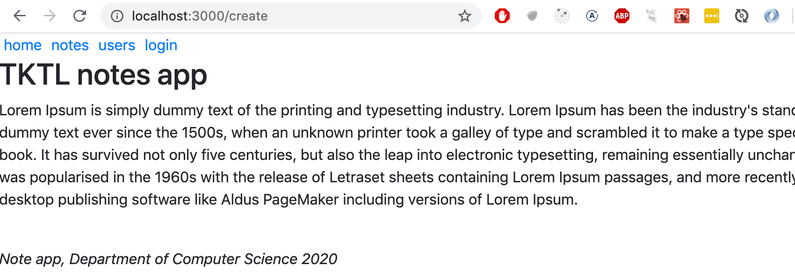
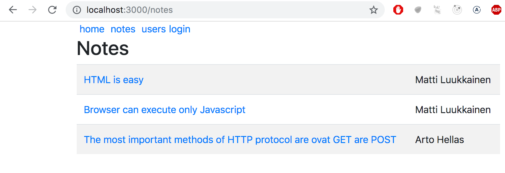
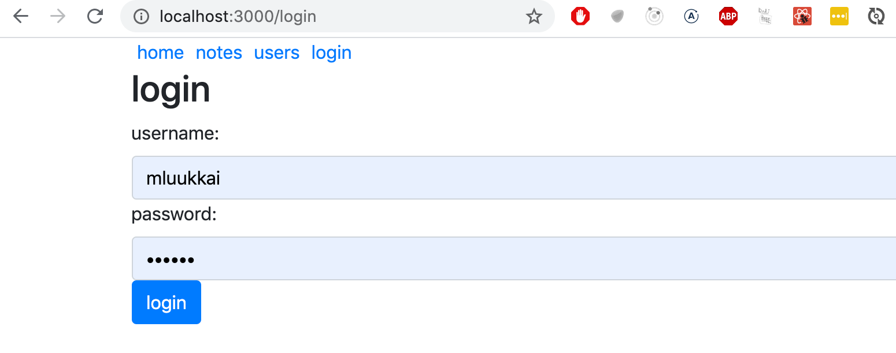
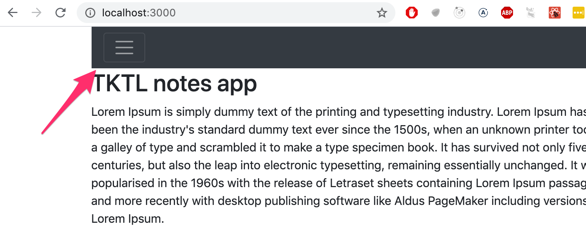
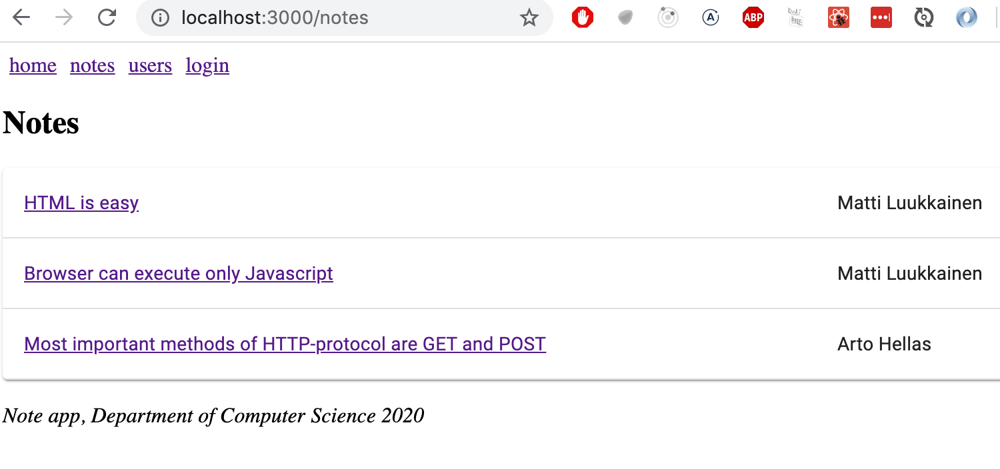
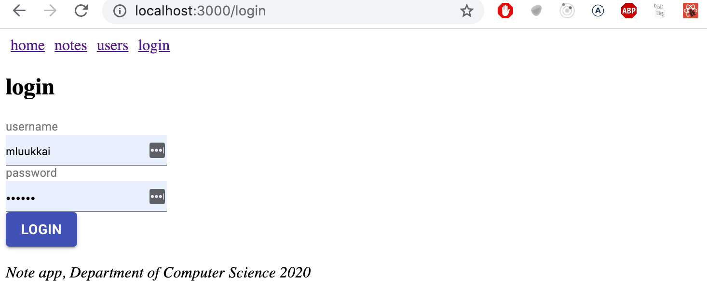
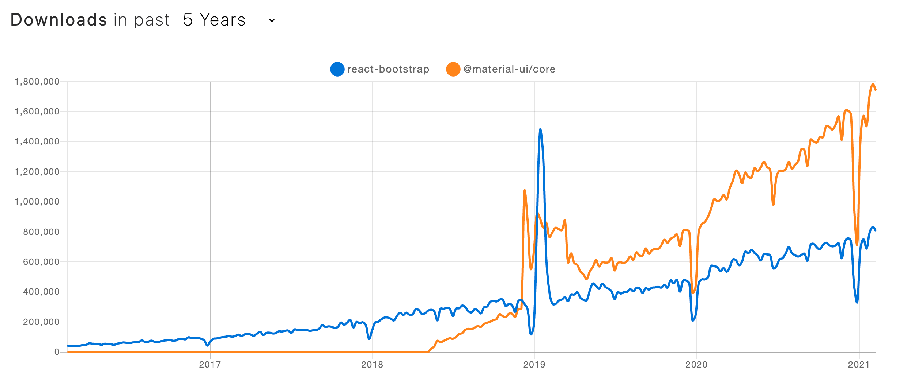

<div class="content">


<!-- In part 2 we examined two different ways of adding styles to our application: the old-school [single CSS](/zh/part2/给_react应用加点样式) file and [inline-styles](/zh/part2/给_react应用加点样式#inline-styles). In this part we will take a look at a few other ways.  -->
在第2章节中，我们研究了向应用添加样式的两种不同方式: 老式的[single CSS](/zh/part2/给_react应用加点样式)文件和[inline-styles](/zh/part2/给_react应用加点样式#inline-styles)。 在这一章节，我们将看看其他一些方法。

### Ready-made UI libraries 
【现成的 UI 库】
<!-- One approach to defining styles for an application is to use a ready-made "UI framework". -->
为应用定义样式的一种方法是使用现成的“ UI 框架”。

<!-- One of the first widely popular UI frameworks was the [Bootstrap](https://getbootstrap.com/) toolkit created by Twitter, that may still be the most popular framework. Recently there has been an explosion in the number of new UI frameworks that have entered the arena. In fact, the selection is so vast that there is little hope of creating an exhaustive list of options. -->
一个广泛流行的 UI 框架是由 Twitter 创建的[Bootstrap](https://getbootstrap.com/ 工具包) ，它可能仍然是最流行的框架。 最近，进入这个领域的新 UI 框架数量激增。 事实上，选择的范围是如此之广，以至于几乎没有希望创建一个详尽的选项清单。

<!-- Many UI frameworks provide developers of web applications with ready-made themes and "components" like buttons, menus, and tables. We write components in quotes, because in this context we are not talking about React components. Usually UI frameworks are used by including the CSS stylesheets and JavaScript code of the framework in the application. -->
许多 UI 框架为 web 应用开发人员提供现成的主题和“组件” ，如按钮、菜单和表格。 我们将组件写在引号中，因为在这里我们不讨论 React 组件。 通常，UI 框架是通过在应用中包含 CSS 样式表和框架的 JavaScript 代码来使用的。

<!-- There are many UI frameworks that have React-friendly versions, where the framework's "components" have been transformed into React components. There are a few different React versions of Bootstrap like [reactstrap](http://reactstrap.github.io/) and [react-bootstrap](https://react-bootstrap.github.io/). -->
有许多 UI 框架具有响应友好版本，其中框架的“组件”已经转换为 React 组件。 有几个不同的React Bootstrap版本，像[reactstrap](reactstrap)和[React-Bootstrap](reactstrap  https://React-Bootstrap.github.io/)。

<!-- Next we will take a closer look at two UI frameworks, Bootstrap and [MaterialUI](https://material-ui.com/). We will use both frameworks to add similar styles to the application we made in the [React-router](/zh/part7/react_router) section of the course material. -->
接下来我们将仔细研究两个 UI 框架，Bootstrap 和[MaterialUI](https://mui.com/)。 我们将使用这两个框架来为我们在课程教材的[React-router](/zh/part7/react_router) 部分中创建的应用添加类似的样式。

### React Bootstrap


<!-- Let's start by taking a look at Bootstrap with the help of the [react-bootstrap](https://react-bootstrap.github.io/) package. -->
让我们首先来看看以 [react-Bootstrap] (https://react-Bootstrap.github.io/) 包的形式封装的 Bootstrap。

<!-- Let's install the package with the command: -->
让我们用如下命令来安装这个包:

```bash
npm install react-bootstrap
```

<!-- Then let's add a link for loading the CSS stylesheet for Bootstrap inside of the <i>head</i> tag in the <i>public/index.html</i> file of the application: -->
然后，我们在应用的 <i>public/index.html</i>文件中的 <i>head</i> 标签内部添加一个链接，用于加载 Bootstrap 的 CSS 样式表:

```js
<head>
  <link
    rel="stylesheet"
    href="https://maxcdn.bootstrapcdn.com/bootstrap/4.3.1/css/bootstrap.min.css"
    integrity="sha384-9aIt2nRpC12Uk9gS9baDl411NQApFmC26EwAOH8WgZl5MYYxFfc+NcPb1dKGj7Sk"
    crossorigin="anonymous"
  />
  // ...
</head>
```
<!-- When we reload the application, we notice that it already looks a bit more stylish: -->
当我们重新加载应用时，我们注意到它已经看起来有点时髦了:



<!-- In Bootstrap, all of the contents of the application are typically rendered inside of a [container](https://getbootstrap.com/docs/4.1/layout/overview/#containers). In practice this is accomplished by giving the root _div_ element of the application the  _container_ class attribute: -->
在 Bootstrap 中，应用的所有内容通常都渲染在一个[容器](https://getbootstrap.com/docs/4.1/layout/overview/#containers)中。 实际上，这是通过给应用的根 div 元素 container class 属性来实现的:

```js
const App = () => {
  // ...

  return (
    <div className="container"> // highlight-line
      // ...
    </div>
  )
}
```

<!-- We notice that this already has an effect on the appearance of the application. The content is no longer as close to the edges of the browser as it was earlier: -->
我们注意到，这已经对应用的外观产生了影响。 内容不再像以前那样接近浏览器的边缘:


<!-- Next, let's make some changes to the <i>Notes</i> component, so that it renders the list of notes as a [table](https://getbootstrap.com/docs/4.1/content/tables/). React Bootstrap provides a built-in [Table](https://react-bootstrap.github.io/components/table/) component for this purpose, so there is no need to define CSS classes separately. -->
接下来，让我们对<i>Notes</i> 组件进行一些更改，以便它将便笺列表渲染为[table](https://getbootstrap.com/docs/4.1/content/tables/)。 React Bootstrap 为此提供了一个内置的[Table](https://React-Bootstrap.github.io/components/Table/)组件，因此不需要单独定义 CSS 类。

```js
const Notes = (props) => (
  <div>
    <h2>Notes</h2>
    <Table striped> // highlight-line
      <tbody>
        {props.notes.map(note =>
          <tr key={note.id}>
            <td>
              <Link to={`/notes/${note.id}`}>
                {note.content}
              </Link>
            </td>
            <td>
              {note.user}
            </td>
          </tr>
        )}
      </tbody>
    </Table>
  </div>
)
```

<!-- The appearance of the application is quite stylish: -->
这个应用的外观非常时髦:



<!-- Notice that the React Bootstrap components have to be imported separately from the library as shown below: -->
请注意 React Bootstrap 组件必须与库分开导入，如下所示:

```js
import { Table } from 'react-bootstrap'
```

#### Forms
【表单】
<!-- Let's improve the form in the <i>Login</i> view with the help of Bootstrap [forms](https://getbootstrap.com/docs/4.1/components/forms/). -->
让我们在 Bootstrap [forms](https://getbootstrap.com/docs/4.1/components/forms/)的帮助下改进<i>Login</i> 视图中的表单。

<!-- React Bootstrap provides built-in [components](https://react-bootstrap.github.io/forms/overview/) for creating forms (although the documentation for them is slightly lacking): -->
React Bootstrap 为创建表单提供了内置的[组件](https://react-bootstrap.github.io/forms/overview/)(尽管缺少相关的文档) : 

```js
let Login = (props) => {
  // ...
  return (
    <div>
      <h2>login</h2>
      <Form onSubmit={onSubmit}>
        <Form.Group>
          <Form.Label>username:</Form.Label>
          <Form.Control
            type="text"
            name="username"
          />
          <Form.Label>password:</Form.Label>
          <Form.Control
            type="password"
          />
          <Button variant="primary" type="submit">
            login
          </Button>
        </Form.Group>
      </Form>
    </div>
)}
```

<!-- The number of components we need to import increases: -->
我们需要导入的组件数量增加了:

```js
import { Table, Form, Button } from 'react-bootstrap'
```

<!-- After switching over to the Bootstrap form, our improved application looks like this: -->
切换到 Bootstrap 表单后，我们改进的应用如下:




#### Notification
<!-- Now that the login form is in better shape, let's take a look at improving our application's notifications: -->
现在登录表单已经更好了，让我们来看看如何改进应用的通知功能:


<!-- Let's add a message for the notification when a user logs in to the application. We will store it in the _message_ variable in the <i>App</i> component's state: -->
让我们在用户登录到应用时为通知添加一条消息。 我们将把它存储在<i>App</i> 组件状态的消息变量中:

```js
const App = () => {
  const [notes, setNotes] = useState([
    // ...
  ])

  const [user, setUser] = useState(null)
  const [message, setMessage] = useState(null) // highlight-line

  const login = (user) => {
    setUser(user)
    // highlight-start
    setMessage(`welcome ${user}`)
    setTimeout(() => {
      setMessage(null)
    }, 10000)
    // highlight-end
  }
  // ...
}
```

<!-- We will render the message as a Bootstrap [Alert](https://getbootstrap.com/docs/4.1/components/alerts/) component. Once again, the React Bootstrap library provides us with a matching [React component](https://react-bootstrap.github.io/components/alerts/):  -->
我们将把消息作为 Bootstrap [Alert](https://getbootstrap.com/docs/4.1/components/alerts/) 组件来渲染。 再一次，React Bootstrap 库为我们提供了一个匹配的[React component](https://react-bootstrap.github.io/components/alerts/) :

```js
<div className="container">
// highlight-start
  {(message &&
    <Alert variant="success">
      {message}
    </Alert>
  )}
// highlight-end
  // ...
</div>
```

#### Navigation structure
【导航结构】
<!-- Lastly, let's alter the application's navigation menu to use Bootstrap's [Navbar](https://getbootstrap.com/docs/4.1/components/navbar/) component. The React Bootstrap library provides us with [matching built-in components](https://react-bootstrap.github.io/components/navbar/#navbars-mobile-friendly). Through trial and error, we end up with a working solution in spite of the cryptic documentation: -->
最后，让我们改变应用的导航菜单，使用 Bootstrap 的[导航栏](https://getbootstrap.com/docs/4.1/components/Navbar/)组件。 React Bootstrap 库为我们提供了[匹配内置组件](https://React-Bootstrap.github.io/components/navbar/#navbars-mobile-friendly)。 通过反复试验，我们最终得到了一个可行的解决方案，尽管文档晦涩难懂:

```js
<Navbar collapseOnSelect expand="lg" bg="dark" variant="dark">
  <Navbar.Toggle aria-controls="responsive-navbar-nav" />
  <Navbar.Collapse id="responsive-navbar-nav">
    <Nav className="mr-auto">
      <Nav.Link href="#" as="span">
        <Link style={padding} to="/">home</Link>
      </Nav.Link>
      <Nav.Link href="#" as="span">
        <Link style={padding} to="/notes">notes</Link>
      </Nav.Link>
      <Nav.Link href="#" as="span">
        <Link style={padding} to="/users">users</Link>
      </Nav.Link>
      <Nav.Link href="#" as="span">
        {user
          ? <em style={padding}>{user} logged in</em>
          : <Link style={padding} to="/login">login</Link>
        }
    </Nav.Link>
    </Nav>
  </Navbar.Collapse>
</Navbar>
```

<!-- The resulting layout has a very clean and pleasing appearance: -->
最终的布局有一个非常干净和令人愉快的外观:


<!-- If the viewport of the browser is narrowed, we notice that the menu "collapses" and it can be expanded by clicking the "hamburger" button: -->
如果浏览器的视口变窄，我们会注意到菜单会“折叠” ，点击“汉堡包”按钮就可以展开:




<!-- Bootstrap and a large majority of existing UI frameworks produce [responsive](https://en.wikipedia.org/wiki/Responsive_web_design) designs, meaning that the resulting applications render well on a variety of different screen sizes. -->
Bootstrap 和大多数现有的 UI 框架产生[响应式](https://en.wikipedia.org/wiki/responsive_web_design)设计，这意味着产生的应用可以在各种不同的屏幕尺寸上渲染良好的效果。

<!-- Chrome developer tools makes it possible to simulate using our application in the browser of different mobile clients: -->
开发工具可以在不同移动客户端的浏览器中模拟使用我们的应用:


<!-- You can find the complete code for the application [here](https://github.com/fullstack-hy/misc/blob/master/notes-bootstrap.js). -->
你可以在这里找到应用的完整代码[点击这里](https://github.com/fullstack-hy/misc/blob/master/notes-bootstrap.js)。

### Material UI


<!-- As our second example we will look into the [MaterialUI](https://material-ui.com/) React library, which implements the [Material design](https://material.io/) visual language developed by Google. -->
作为我们的第二个例子，我们将研究[MaterialUI](https://mui.com/)React库，它实现了谷歌开发的[Material design](https://Material.io/)视觉语言。


<!-- Install the library with the command -->
使用如下命令安装库

```bash
npm install @mui/material @emotion/react @emotion/styled
```

<!-- Then add the following line to the <i>head</i> tag in the <i>public/index.html</i> file. The line loads bootstrap's css-definitions. -->
然后向 <i>public/index.html</i><i>文件中的 <i>head</i> 标签添加如下行。如下代码加载了Google的Roboto 字体。

```js
<head>
  <link rel="stylesheet" href="https://fonts.googleapis.com/css?family=Roboto:300,400,500,700&display=swap" />
  // ...
</head>
```


<!-- Now let's use MaterialUI to do the same modifications to the code we did earlier with bootstrap. -->
现在，让我们使用 MaterialUI 对前面使用 bootstrap 所做的代码进行相同的修改。


<!-- Render the contents of the whole application within a [Container](https://material-ui.com/components/container/): -->
在[Container](https://mui.com/material-ui/react-container/)内渲染整个应用的内容:

```js
import Container from '@mui/material/Container'

const App = () => {
  // ...
  return (
    <Container>
      // ...
    </Container>
  )
}
```


<!-- Let's start with the <i>Notes</i> component. We'll render the list of notes as a [table](https://material-ui.com/components/tables/#simple-table): -->
让我们从<i>Notes</i> 组件开始，我们将便笺列表渲染为一个[table](https://mui.com/material-ui/react-table/#simple-table) :

```js
const Notes = ({notes}) => (
  <div>
    <h2>Notes</h2>

    <TableContainer component={Paper}>
      <Table>
        <TableBody>
          {notes.map(note => (
            <TableRow key={note.id}>
              <TableCell>
                <Link to={`/notes/${note.id}`}>{note.content}</Link>
              </TableCell>
              <TableCell>
                {note.user}
              </TableCell>
            </TableRow>
          ))}
        </TableBody>
      </Table>
    </TableContainer>
  </div>
)
```


<!-- The table looks like so: -->
表格看起来是这样的:




<!-- One less pleasant feature of Material UI is, that each component has to be imported separately. The import list for the notes page is quite long: -->
Material UI 的一个不那么令人愉快的特性是，每个组件都必须单独导入。 便笺页面的导入列表非常长: 

```js
import {
  Container,
  Table,
  TableBody,
  TableCell,
  TableContainer,
  TableRow,
  Paper,
} from '@mui/material'
```

#### Form 表单


<!-- Next let's make the login form in the <i>Login</i> view better using the [TextField](https://material-ui.com/components/text-fields/) and [Button](https://material-ui.com/api/button/) components: -->
接下来让我们在<i>Login</i> 视图中更好地使用[TextField](https://mui.com/material-ui/react-text-field/)和[Button](https://mui.com/material-ui/api/button/)组件来创建登录表单:

```js 
const Login = (props) => {
  const history = useHistory()

  const onSubmit = (event) => {
    event.preventDefault()
    props.onLogin('mluukkai')
    history.push('/')
  }

  return (
    <div>
      <h2>login</h2>
      <form onSubmit={onSubmit}>
        <div>
          <TextField label="username" />
        </div>
        <div>
          <TextField  label="password" type='password' />
        </div>
        <div>
          <Button variant="contained" color="primary" type="submit">
            login
          </Button>
        </div>
      </form>
    </div>
  )
}
```


<!-- The end result is: -->
最终的结果是:




<!-- MaterialUI, unlike Bootstrap, does not provide a component for the form itself. The form here is an ordinary HTML [form](https://developer.mozilla.org/en-US/docs/Web/HTML/Element/form) element. -->
与 bootstrap 不同的是，MaterialUI 并不为表单本身提供组件。 这里的表单是一个普通的 HTML [form](https://developer.mozilla.org/zh-CN/docs/web/HTML/element/form)元素。


<!-- Remember to import all the components used in the form. -->
请记住导入表单中使用的所有组件。

#### Notification
<!-- The notification displayed on log in can be done using the [Alert](https://material-ui.com/components/alert/) component, which is quite similiar to bootstrap's equivalent component: -->
在登录中显示的通知可以通过使用[Alert](https://mui.com/material-ui/react-alert/)来完成，这个组件与 bootstrap 的等价组件非常相似:

```js
<div>
// highlight-start
  {(message &&
    <Alert severity="success">
      {message}
    </Alert>
  )}
// highlight-end
</div>
```

<!-- The Alert component is not yet included in the MaterialUI core package, so we have to install the [lab](https://material-ui.com/components/about-the-lab/) package to use it: -->

<!-- Then we can import the component like so -->
然后我们可以像这样导入组件

```js 
import { Alert } from '@mui/material'
```


<!-- Alert is quite stylish: -->
是相当时尚的:


#### Navigation structure
【导航结构】


<!-- We can implement navigation using the [AppBar](https://material-ui.com/components/app-bar/) component. -->
我们可以使用 [AppBar](https://mui.com/material-ui/react-app-bar/) 组件来实现导航。

<!-- If we use the example code from the documentation -->
如果我们使用文档中的示例代码

```js
<AppBar position="static">
  <Toolbar>
    <IconButton edge="start" color="inherit" aria-label="menu">
    </IconButton>
    <Button color="inherit">
      <Link to="/">home</Link>
    </Button>
    <Button color="inherit">
      <Link to="/notes">notes</Link>
    </Button>
    <Button color="inherit">
      <Link to="/users">users</Link>
    </Button>  
    <Button color="inherit">
      {user
        ? <em>{user} logged in</em>
        : <Link to="/login">login</Link>
      }
    </Button>                
  </Toolbar>
</AppBar>
```


<!-- we do get working navigation, but it could look better -->
我们的确有导航系统，但看起来更好


<!-- We can find a better way from the [documentation](https://material-ui.com/guides/composition/#routing-libraries). We can use [component props](https://material-ui.com/guides/composition/#component-prop) to define how the root element of a MaterialUI component is rendered. -->
我们可以从文档中[documentation](https://mui.com/material-ui/guides/composition/#routing-libraries)找到一个更好的 。 我们可以使用[component props](https://mui.com/material-ui/guides/composition/#component-prop)来定义 MaterialUI 组件的根元素是如何渲染的。


<!-- By defining -->
通过定义

```js
<Button color="inherit" component={Link} to="/">
  home
</Button>
```


<!-- the _Button_ component is rendered so that its root component is react-redux _Link_ which receives its path as prop field _to_. -->

_Button_ 组件被渲染，其根组件都是 react-redux 的 _Link_ ，其 _to_ 属性可以存放跳转的路径


<!-- The code for the navigation bar is the following -->
导航条的代码如下

```js
<AppBar position="static">
  <Toolbar>
    <Button color="inherit" component={Link} to="/">
      home
    </Button>
    <Button color="inherit" component={Link} to="/notes">
      notes
    </Button>
    <Button color="inherit" component={Link} to="/users">
      users
    </Button>   
    {user
      ? <em>{user} logged in</em>
      : <Button color="inherit" component={Link} to="/login">
          login
        </Button>
    }                              
  </Toolbar>
</AppBar>
```


<!-- and it looks like we want it to -->
看起来我们也希望如此


<!-- The code of the application can be found from [here](https://github.com/fullstack-hy/misc/blob/master/notes-materialui.js). -->
这个应用的代码可以在这里[here](https://github.com/fullstack-hy/misc/blob/master/notes-materialui.js)找到。

### Closing thoughts
【封闭的思想】

<!-- The difference between react-bootstrap and MaterialUI is not big. It's up to you which one you find better looking.  -->
React-bootstrap 和 MaterialUI 之间的区别并不大，这取决于你觉得哪个更好看。 
<!-- I myself have not used MaterialUI a lot, but my first impressions are positive. Its documentation is a bit better than react-bootstrap's.  -->
我自己并没有使用很多MaterialUI，但我的第一印象是积极的。 它的文档比起React-bootstrap的要好一点。
<!-- According to https://www.npmtrends.com/ which tracks the popularity of different npm-libraries MaterialUI passed react-bootstrap in popularity at the end of 2018: -->
<!-- The difference between react-bootstrap and MaterialUI is not big. It's up to you which one you find better looking.  I myself have not used MaterialUI a lot, but my first impressions are positive. Its documentation is a bit better than react-bootstrap's. According to https://www.npmtrends.com/ which tracks the popularity of different npm-libraries MaterialUI passed react-bootstrap in popularity at the end of 2018 and has since that widened the gap: -->

react-bootstrap 与 MaterialUI 的差别并不大。取决于你更喜欢那种样式。我自己使用MaterialUI比较少，但是我的第一印象是正面的。它的文档比react-bootstrap要好一些。根据追踪不同 npm 流行程度的 https://www.npmtrends.com/ 数据库, MaterialUI 在2018年底超过了 react-bootstrap，并且从那时起差距在拉大:



<!-- In the two previous examples, we used the UI frameworks with the help of React-integration libraries. -->
在前面的两个示例中，我们借助于 React-integration 库使用了 UI 框架。

<!-- Instead of using the [React Bootstrap](https://react-bootstrap.github.io/) library, we could have just as well used Bootstrap directly by defining CSS classes to our application's HTML elements. Instead of defining the table with the <i>Table</i> component: -->
与使用[React Bootstrap](https://React-Bootstrap.github.io/)库不同，我们可以直接使用 Bootstrap，方法是为应用的 HTML 元素定义 CSS 类。 不用<i>Table</i> 组件定义表:

```js
<Table striped>
  // ...
</Table>
```

<!-- We could have used a regular HTML <i>table</i> and added the required CSS class: -->
我们可以使用一个常规的 HTML<i>table</i> 并添加所需的 CSS 类:

```js
<table className="table striped">
  // ...
</table>
```

<!-- The benefit of using the React Bootstrap library is not that evident from this example. -->
从这个例子来看，使用 React Bootstrap 库的好处并不明显。

<!-- In addition to making the frontend code more compact and readable, another benefit of using React UI framework libraries is that they include the JavaScript that is needed to make specific components work. Some Bootstrap components require a few unpleasant [JavaScript dependencies](https://getbootstrap.com/docs/4.1/getting-started/introduction/#js) that we would prefer not to include in our React applications. -->
除了使前端代码更加紧凑和可读，使用 React UI 框架库的另一个好处是它们包含了使特定组件工作所需的 JavaScript。 一些 Bootstrap 组件需要一些讨厌的依赖项(JavaScript 依赖项 [JavaScript dependencies](https://getbootstrap.com/docs/4.1/getting-started/introduction/#js)) ，我们不希望在 React 应用中包含这些。

<!-- Some potential downsides to using UI frameworks through integration libraries instead of using them "directly", are that integration libraries may have unstable API's and poor documentation. The situation with [Semantic UI React](https://react.semantic-ui.com) is a lot better than with many other UI frameworks, as it is an official React integration library. -->
通过集成库而不是“直接”使用 UI 框架的一些潜在缺点是，集成库可能具有不稳定的 API 和糟糕的文档。 与其他 UI 框架相比，[Semantic UI React](https://React.Semantic-UI.com)的情况要好得多，因为它是一个官方的 React 集成库。

<!-- There is also the question of whether or not UI framework libraries should be used in the first place. It is up to everyone to form their own opinion, but for people lacking knowledge in CSS and web design they are very useful tools. -->
还有一个问题是，首先是否应该使用 UI 框架库。 这取决于每个人形成自己的意见，但对于缺乏 CSS 和网页设计知识的人来说，他们是非常有用的工具。


### Other UI frameworks
【其他 UI 框架】
<!-- Here are some other UI frameworks for your consideration. If you do not see your favorite UI framework in the list, please make a pull request to the course material. -->
这里有一些其他的 UI 框架供您考虑。 如果您没有在列表中看到您最喜欢的 UI 框架，请对课程材料提出PR。

- <https://bulma.io/>
- <https://ant.design/>
- <https://get.foundation/>
- <https://chakra-ui.com/>
- <https://tailwindcss.com/>
- <https://semantic-ui.com/>

### Styled components 
【样式组件】
<!-- There are also [other ways](https://blog.bitsrc.io/5-ways-to-style-react-components-in-2019-30f1ccc2b5b) of styling React applications that we have not yet taken a look at. -->
还有一些我们还[没有看过](https://blog.bitsrc.io/5-ways-to-style-react-components-in-2019-30f1ccc2b5b)的React 应用的样式。

<!-- The [styled components](https://www.styled-components.com/) library offers an interesting approach for defining styles through [tagged template literals](https://developer.mozilla.org/en-US/docs/Web/JavaScript/Reference/Template_literals#tagged_templates)) that were introduced in ES6. -->
[样式化组件](https://www.styled-components.com/)库提供了一种有趣的方法，可以通过在 ES6中引入的[带标记的模板文字](https://developer.mozilla.org/en-us/docs/web/javascript/reference/template_literals#tagged_templates))定义样式。

<!-- Let's make a few changes to the styles of our application with the help of styled components. First, let's define two components with styles: -->
让我们借助样式化组件对应用的样式进行一些更改。 首先，用如下命令安装包：

```bash
npm install styled-components
```

让我们用样式定义两个组件:

```js
import styled from 'styled-components'

const Button = styled.button`
  background: Bisque;
  font-size: 1em;
  margin: 1em;
  padding: 0.25em 1em;
  border: 2px solid Chocolate;
  border-radius: 3px;
`

const Input = styled.input`
  margin: 0.25em;
`
```

<!-- The code above creates styled versions of the <i>button</i> and <i>input</i> HTML elements and then assigns them to the <i>Button</i> and <i>Input</i> variables. -->
上面的代码创建了<i>Button</i> 和<i>Input</i> HTML 元素的样式版本，然后将它们赋值给<i>Button</i> 和<i>Input</i> 变量。

<!-- The syntax for defining the styles is quite interesting, as the CSS rules are defined inside of backticks. -->
定义样式的语法非常有趣，因为 CSS 规则是在backticks中定义的。

<!-- The styled components that we defined work exactly like regular <i>button</i> and <i>input</i> elements, and they can be used the same way: -->
我们定义的样式化组件与常规的<i>button</i> 和<i>input</i> 元素工作方式完全相同，它们可以以相同的方式使用:

```js
const Login = (props) => {
  // ...
  return (
    <div>
      <h2>login</h2>
      <form onSubmit={onSubmit}>
        <div>
          username:
          <Input /> // highlight-line
        </div>
        <div>
          password:
          <Input type='password' /> // highlight-line
        </div>
        <Button type="submit" primary=''>login</Button> // highlight-line
      </form>
    </div>
  )
}
```

<!-- Let's create a few more components for styling that application, that are styled versions of <i>div</i> elements: -->
让我们为这个应用创建一些样式化的组件，它们是<i>div</i> 元素的样式化版本:

```js
const Page = styled.div`
  padding: 1em;
  background: papayawhip;
`

const Navigation = styled.div`
  background: BurlyWood;
  padding: 1em;
`

const Footer = styled.div`
  background: Chocolate;
  padding: 1em;
  margin-top: 1em;
`
```

<!-- Let's use the components in our application: -->
让我们使用应用中的组件:

```js
const App = () => {
  // ...

  return (
    <Page> // highlight-line
      <Navigation> // highlight-line
        <Link style={padding} to="/">home</Link>
        <Link style={padding} to="/notes">notes</Link>
        <Link style={padding} to="/users">users</Link>
        {user
          ? <em>{user} logged in</em>
          : <Link style={padding} to="/login">login</Link>
        }
      </Navigation> // highlight-line

      <Switch>
        <Route path="/notes/:id">
          <Note note={note} />
        </Route>
        <Route path="/notes">
          <Notes notes={notes} />
        </Route>
        <Route path="/users">
          {user ? <Users /> : <Redirect to="/login" />}
        </Route>
        <Route path="/login">
          <Login onLogin={login} />
        </Route>
        <Route path="/">
          <Home />
        </Route>
      </Switch>
      
      <Footer> // highlight-line
        <em>Note app, Department of Computer Science 2021</em>
      </Footer> // highlight-line
    </Page> // highlight-line
  )
}
```

<!-- The appearance of the resulting application is shown below: -->
产生的应用的外观如下:


<!-- Styled components have seen a consistent growth in popularity in recent times, and quite a lot of people consider it to be the best way of defining styles to React applications. -->
样式化组件在最近一段时间内一直受到欢迎，很多人认为这是定义样式到 React 应用的最佳方式。

</div>


<div class="tasks">


### Exercises
练习


<!-- The exercises related to the topics presented here, can be found at the end of this course material section in the exercise set [for extending the blog list application](/zh/part7/练习：扩展你的博客列表). -->
与这里提到的议题相关的练习，可以在本课程材料部分的练习集[用于扩展博客列表应用](/zh/part7/练习：扩展你的博客列表)的最后找到。

</div>
