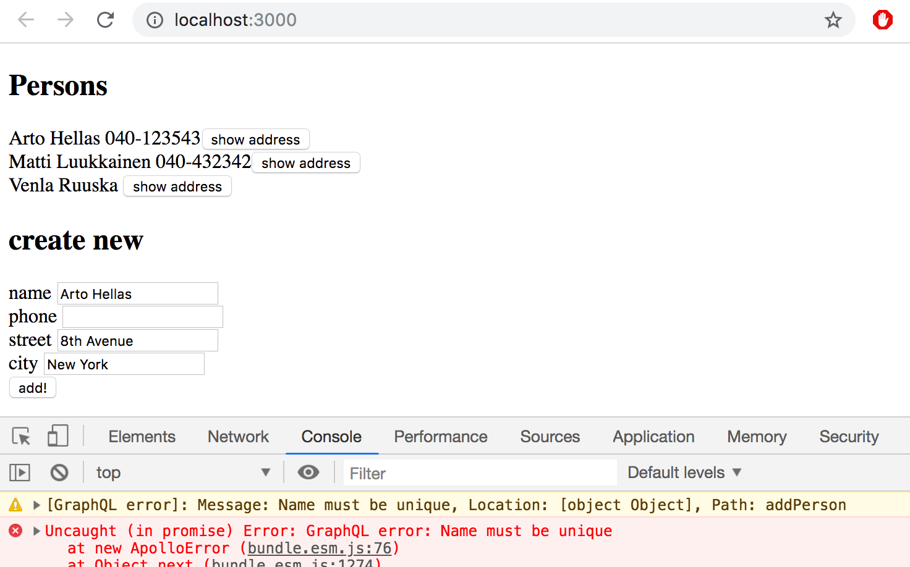
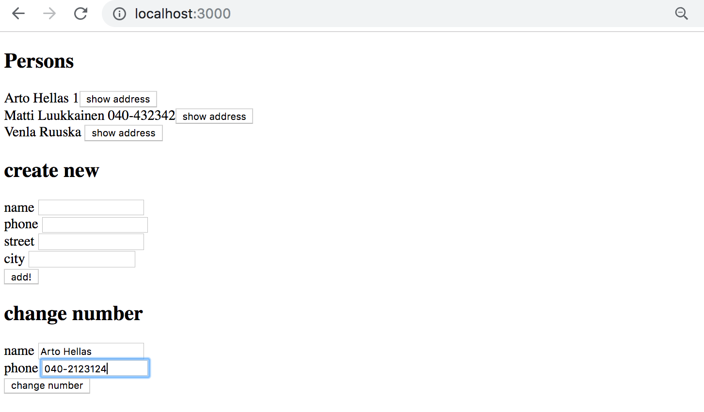
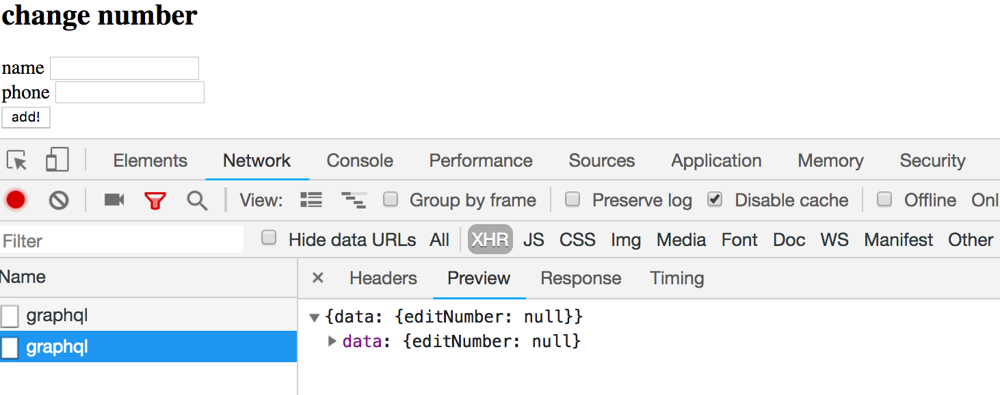
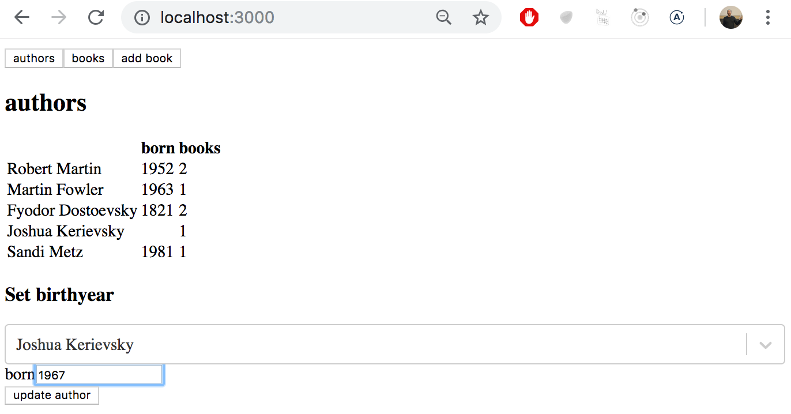

<div class="content">


We will next implement a React-app which uses the GraphQL server we created.

The current code of the server can be found from [github](https://github.com/fullstackopen-2019/graphql-phonebook-backend/tree/part8-3), branch <i>part8-3</i>.


In theory, we can use GraphQL with HTTP POST -requests. The following shows an example of this with Postman. 


The communication works by sending HTTP POST -requests to http://localhost:4000/graphql. The query itself is a string sent as the value of the key <i>query</i>.

We could take care of the communication between the React-app and GraphQl by using Axios. However most of the time it is not very sensible to do so. It is a better idea to use a higher order library capable of abstracting the unnecessary details of the communication. 

At the moment there are two good options: [Relay](https://facebook.github.io/relay/) by Facebook and [Apollo Client](https://www.apollographql.com/docs/react/). From these two Apollo is absolutely more popular, and we will also be using it. 

### Apollo client

Create a new React-app and install the dependencies required by [Apollo client](https://www.apollographql.com/docs/react/essentials/get-started.html#installation).

```js
npm install apollo-boost react-apollo graphql --save
```


We'll start with the following code for our application. 

```js
import React from 'react'
import ReactDOM from 'react-dom'

import ApolloClient, { gql } from 'apollo-boost'

const client = new ApolloClient({
  uri: 'http://localhost:4000/graphql'
})

const query = gql`
{
  allPersons  {
    name,
    phone,
    address {
      street,
      city
    }
    id
  }
}
`

client.query({ query })
  .then((response) => {
    console.log(response.data)
  })

const App = () => {
  return <div>
    test
  </div>
}

ReactDOM.render(<App />, document.getElementById('root'))
```


The beginning of the code creates a new [client](https://www.apollographql.com/docs/react/essentials/get-started.html#creating-client) - object, which is then used to send a query to the server: 

```js
client.query({ query })
  .then((response) => {
    console.log(response.data)
  })
```

The servers response is printed to the console: 


The application can communicate with a GraphQL server using the _client_ object. 
The client can be made accessible for all components of the application by wrapping the <i>App</i> component with [ApolloProvider](https://www.apollographql.com/docs/react/essentials/get-started.html#creating-provider).

```js
import React from 'react'
import ReactDOM from 'react-dom'
import App from './App' // highlight-line
import ApolloClient, { gql } from 'apollo-boost'
import { ApolloProvider } from 'react-apollo' // highlight-line

const client = new ApolloClient({
  uri: 'http://localhost:4000/graphql'
})

ReactDOM.render(
  // highlight-start
  <ApolloProvider client={client} >
    <App />
  </ApolloProvider>, 
  // highlight-end
  document.getElementById('root')
)
```

### Query-component


We are ready to implement the main view of the application, which shows a list of phone numbers. 


Apollo Client offers few alternative ways for making queries. At the moment (this part was translated 22.6.2019) the predominant way is to use a [Query](https://www.apollographql.com/docs/react/essentials/queries.html) component. 


The code for the component <i>App</i>, which makes the query, is as follows: 

```js
import React from 'react'
import { Query } from 'react-apollo'
import { gql } from 'apollo-boost'

const ALL_PERSONS = gql`
{
  allPersons  {
    name
    phone
    id
  }
}
`

const App = () => {
  return <Query query={ALL_PERSONS}>
    {(result) => { 
      if ( result.loading ) {
        return <div>loading...</div>
      }
      return (
        <div>
          {result.data.allPersons.map(p => p.name).join(', ')}
        </div>
      )
    }}
  </Query>
}

export default App
```


The code does seem a bit confusing. 
The core of the code is the component <i>Query</i>. The query to be made is in the variable <em>ALL\_PERSONS</em>. The query is given to the Query component as a parameter. Within the tags of the <i>Query</i> component is a function, which returns the actual JSX to be rendered. A parameter of the function, <i>results</i>, contains the result of the QraphQL query. 


The result, the object in parameter _results_, has multiple [fields](https://www.apollographql.com/docs/react/essentials/queries.html#render-prop).
The field <i>loading</i> has the value true, if there is no response to the query yet. In this case the code to be rendered is

```js
if ( result.loading ) {
  return <div>loading...</div>
}
```


When the result is ready, response to the query <i>allPersons</i> is taken from the field <i>data</i>, and the names in the phonebook are rendered to the screen.

```js
<div>
  {result.data.allPersons.map(p => p.name).join(', ')}
</div>
```


To clean the solution up a bit, let's separate rendering the list of persons into its own component <i>Persons</i>. The coponent <i>App</i> becomes:

```js
const App = () => {
  return (
    <Query query={ALL_PERSONS}>
      {(result) => <Persons result={result} />}
    </Query>
  )
}
```


So <i>App</i> sends the query results to the <i>Persons</i> component as props:

```js
const Persons = ({ result }) => {
  if (result.loading) {
    return <div>loading...</div>
  }

  const persons = result.data.allPersons 

  return (
    <div>
      <h2>Persons</h2>
      {persons.map(p =>
        <div key={p.name}>
          {p.name} {p.phone}
        </div>  
      )}
    </div>
  )
}
```

### Named queries and variables


Let's implement functionality for viewing the address details of a person. The <i>findPerson</i> query is well suited for this. 


The queries we did in the last chapter had the parameter hardcoded into the query:

```js
query {
  findPerson(name: "Arto Hellas") {
    phone 
    city 
    street
    id
  }
}
```


When we do queries programmatically, we must be able to give them parameters dynamically. 


GraphQL [variables](https://graphql.org/learn/queries/#variables) are well suited for this. To be able to use variables, we must also name our queries. 


```js
query findPersonByName($nameToSearch: String!) {
  findPerson(name: $nameToSearch) {
    name
    phone 
    address {
      street
      city
    }
  }
}
```


The name of the query is <i>findPersonByName</i>, and it is given a string <i>$nameToSearch</i> as a parameter. 


It is also possible to do queries with parameters with the GraphQL Playground. The parameters are given in <i>Query variables</i>:


The component we just used,<i>Query</i>, is not optimal for our purposes, because we would like to make the query only when a user wants to see the details of a person.  


One way would be to use the <i>query</i> method of the <i>client</i> object. 
All components of the application can access the query object via the [ApolloConsumer](https://www.apollographql.com/docs/react/essentials/queries.html#manual-query) component. 


Let's modify the <i>App</i> component to fetch a reference to the _query_ object via <i>ApolloConsumer</i>, and pass it on to the <i>Persons</i> component. 

```js
import { Query, ApolloConsumer } from 'react-apollo' // highlight-line

// ...

const App = () => {
  return (
    <ApolloConsumer>
      {(client => 
        <Query query={ALL_PERSONS}>
          {(result) => 
            <Persons result={result} client={client} /> 
          }
        </Query> 
      )}
    </ApolloConsumer>
  )
}
```


Changes to the <i>Persons</i> component are as follows:

```js
// highlight-start
const FIND_PERSON = gql`
  query findPersonByName($nameToSearch: String!) {
    findPerson(name: $nameToSearch) {
      name
      phone 
      id
      address {
        street
        city
      }
    }
  }
`
// highlight-end

const Persons = ({ result, client }) => {
// highlight-start
  const [person, setPerson] = useState(null)
// highlight-end

  if (result.loading) {
    return <div>loading...</div>
  }

// highlight-start
  const showPerson = async (name) => {
    const { data } = await client.query({
      query: FIND_PERSON,
      variables: { nameToSearch: name }
    })
    setPerson(data.findPerson)
  }
// highlight-end

// highlight-start
  if (person) {
    return(
      <div>
        <h2>{person.name}</h2>
        <div>{person.address.street} {person.address.city}</div>
        <div>{person.phone}</div>
        <button onClick={() => setPerson(null)}>close</button>
      </div>
    )
  }
// highlight-end

  return (
    <div>
      <h2>Persons</h2>
      {result.data.allPersons.map(p =>
        <div key={p.name}>
          {p.name} {p.phone}
          // highlight-start
          <button onClick={() => showPerson(p.name)} >
            show address
          </button> 
          // highlight-end
        </div>  
      )}
    </div>
  )
}
```


If the button next to persons details is pressed, the component makes a GraphQL query for the persons details and saves the response to the component state <i>person</i>:

```js
const showPerson = async (name) => {
  const { data } = await client.query({
    query: FIND_PERSON,
    variables: { nameToSearch: name }
  })

  setPerson(data.findPerson)
}
```


If the state _person_ has a value, instead of showing a list of all persons, only the details of one person are shown. 


The solution is not the neatest possible, but it is good enough for us. 


The current code of the application can be found from [github](https://github.com/fullstackopen-2019/graphql-phonebook-frontend/tree/part8-1) branch <i>part8-1</i>.

### Cache

When we do multiple queries for for example the address details of Arto Hellas, we notice something interesting: The query to the backend is done only the first time around. After this, despite of the same query being done again by the code, the query is not sent to the backend. 


Apollo client saves the responses of queries to [cache](https://www.apollographql.com/docs/react/advanced/caching.html). To optimize performance if the response to a query is already in the cache, the query is not sent to the server at all. 


It is possible to install [Apollo Client devtools](https://chrome.google.com/webstore/detail/apollo-client-developer-t/jdkknkkbebbapilgoeccciglkfbmbnfm/related) to Chrome to view the state of the cache. 


Data in the cache is organized by query. Because <i>Person</i> objects have an identifying field <i>id</i> which is type <i>ID</i>, if the same object is returned by multiple queries, Apollo is able to combine them into one. 
Because of this, doing <i>findPerson</i> queries for the address details of Arto Hellas has updated the address details also for the query <i>allPersons</i>.

### Mutation-component


Let's implement functionality for adding new persons. The [mutation](https://www.apollographql.com/docs/react/essentials/mutations.html#basic) component offers suitable tools for this. In the previous chapter we hardcoded the parameters for mutations. Now we need a version of the addPerson mutation which uses  [variables](https://graphql.org/learn/queries/#variables).

```js
const CREATE_PERSON = gql`
  mutation createPerson($name: String!, $street: String!, $city: String!, $phone: String) {
    addPerson(
      name: $name,
      street: $street,
      city: $city,
      phone: $phone
    ) {
      name
      phone
      id
      address {
        street
        city
      }
    }
  }
`
```


The <i>App</i> component changes like so: 

```js
const App = () => {
  return (
    <div>
      <ApolloConsumer>
        {(client) => 
          <Query query={ALL_PERSONS}>
            {(result) => 
              <Persons result={result} client={client} />
            }
          </Query> 
        }
      </ApolloConsumer>
      // highlight-start
      <h2>create new</h2>
      <Mutation mutation={CREATE_PERSON}>
        {(addPerson) =>
          <PersonForm
            addPerson={addPerson}
          />
        }
      </Mutation>
      // highlight-end
    </div>
  )
}
```


Within the tags of the <i>Mutation</i> component is a <i>function</i>, which returns a <i>PersonForm</i> component. The parameter <i>addPerson</i> is a function, which does the mutation.  


The component containing the form is nothing special. 

```js
const PersonForm = (props) => {
  const [name, setName] = useState('')
  const [phone, setPhone] = useState('')
  const [street, setStreet] = useState('')
  const [city, setCity] = useState('')

  const submit = async (e) => {
    e.preventDefault()
    await props.addPerson({
      variables: { name, phone, street, city }
    })

    setName('')
    setPhone('')
    setStreet('')
    setCity('')
  }

  return (
    <div>
      <form onSubmit={submit}>
        <div>
          name <input
            value={name}
            onChange={({ target }) => setName(target.value)}
          />
        </div>
        <div>
          phone <input
            value={phone}
            onChange={({ target }) => setPhone(target.value)}
          />
        </div>
        <div>
          street <input
            value={street}
            onChange={({ target }) => setStreet(target.value)}
          />
        </div>
        <div>
          city <input
            value={city}
            onChange={({ target }) => setCity(target.value)}
          />
        </div>
        <button type='submit'>add!</button>
      </form>
    </div>
  )
}
```


New persons are added just fine, but the screen is not updated. The reason being that Apollo Client cannot automatically update the cache of an application, so it still contains the state from before the mutation. 
We could update the screen by reloading the page, as the cache is emptied when the page is reloaded. However there must be a better way to do this. 

### Updating the cache

There are few different solutions for this. One way is to make the query for all persons [poll](https://www.apollographql.com/docs/react/essentials/queries.html#refetching) the server, or make the query repeatedly. 


The change is small. Let's set the query to poll every two seconds: 

```js
const App = () => {
  return (
    <div>
      <ApolloConsumer>
        {(client) => 
          <Query query={ALL_PERSONS} pollInterval={2000}> // highlight-line
            {(result) =>
              <Persons result={result} client={client} />
            }
          </Query> 
        }
      </ApolloConsumer>

      <h2>create new</h2>
      <Mutation mutation={createPerson} >
        {(addPerson) =>
          <PersonForm
            addPerson={addPerson}
          />
        }
      </Mutation>
    </div>
  )
}
```


The solution is simple, and every time a user adds a new person, it appears immediately on the screens of all users. 

The bad side of the solution is all the pointless web traffic. 

Another easy way to synchronize the cache is to declare, that the <i>ALL_PERSONS</i> query should be done again when a new person is added. This can be done with the [refetchQueries](https://www.apollographql.com/docs/react/essentials/mutations.html#props) props of the <i>Mutation</i> component:

```js
const App = () => {
  return (
    <div>
      <ApolloConsumer>
        {(client) => 
          <Query query={allPersons}>
            {(result) =>
              <Persons result={result} client={client} 
            />}
          </Query> 
        }
      </ApolloConsumer>

      <h2>create new</h2>
      <Mutation
        mutation={CREATE_PERSON} 
        refetchQueries={[{ query: ALL_PERSONS }]}  // highlight-line
      >
        {(addPerson) =>
          <PersonForm
            addPerson={addPerson}
          />
        }
      </Mutation>
    </div>
  )
}
```


The pros and cons of this solution are almost opposite of the previous one. There is no extra web traffic, because queries are not done just in case.  However if one user now updates the state of the server, the changes do not show to other users immediately. 


There are other ways to update the cache. More about those later in this part. 


**NB** Apollo Client devtools seems to have some bugs. At some point it stops updating the state of the cache. If you encounter this issue, open the application in a new tab. 


The current code of the application can be found from [github](https://github.com/fullstackopen-2019/graphql-phonebook-frontend/tree/part8-2) branch <i>part8-2</i>.

### Handling mutation error messages


If we try to create an invalid person, it results in an error. 




The error should be handled. One way to do this is to reqister a errorhandler to the mutation using the [onError](https://www.apollographql.com/docs/react/essentials/mutations.html#props) props. 

```js
const App = () => {
  // highlight-start
  const [errorMessage, setErrorMessage] = useState(null)

  const handleError = (error) => {
    setErrorMessage(error.graphQLErrors[0].message)
    setTimeout(() => {
      setErrorMessage(null)
    }, 10000)
  }
  // highlight-end

  return (
    <div>
    // highlight-start
      {errorMessage&&
        <div style={{color: 'red'}}>
          {errorMessage}
        </div>
      }
      // highlight-end
      <ApolloConsumer>
        // ...
      </ApolloConsumer>

      <h2>create new</h2>
      <Mutation
        mutation={createPerson} 
        refetchQueries={[{ query: allPersons }]}
        onError={handleError} // highlight-line
      >
        {(addPerson) =>
          <PersonForm
            addPerson={addPerson}
          />
        }
      </Mutation>
    </div>
  )
}
```


Now the user is informed about an error with a simple norification. 


The current code of the application can be found from [github](https://github.com/fullstackopen-2019/graphql-phonebook-frontend/tree/part8-3) branch <i>part8-3</i>.

### Updating a phonenumber

Let's add the possibility to change the phonenumbers of persons to our application. The solutions is almost identical to the one we used for adding new persons. 

Again, the mutation requires parameters.

```js
const EDIT_NUMBER = gql`
mutation editNumber($name: String!, $phone: String!) {
  editNumber(name: $name, phone: $phone)  {
    name
    phone
    address {
      street
      city
    }
    id
  }
}
`
```


Let's add this to the <i>App</i>-component:

```js

const App = () => {
  // ...
  return (
    <div>
      {errorMessage && ... }
      <ApolloConsumer>
        // ...
      </ApolloConsumer>
      
      <h2>create new</h2>
      <Mutation mutation={CREATE_PERSON}>
        // ...
      </Mutation>

      // highlight-start
      <h2>change number</h2>
      <Mutation
        mutation={EDIT_NUMBER}
      >
        {(editNumber) =>
          <PhoneForm
            editNumber={editNumber}
          />
        }
      </Mutation>   
      // highlight-end    
    </div>
  )
}
```


<i>PhoneForm</i>, the component executing the mutation, is straightforward. It asks for the name of a person using a form, and calls _editNumber_, the function doing the mutation:

```js
const PhoneForm = (props) => {
  const [name, setName] = useState('')
  const [phone, setPhone] = useState('')

  const submit = async (e) => {
    e.preventDefault()

    await props.editNumber({
      variables: { name, phone }
    })

    setName('')
    setPhone('')
  }

  return (
    <div>
      <form onSubmit={submit}>
        <div>
          name <input
            value={name}
            onChange={({ target }) => setName(target.value)}
          />
        </div>
        <div>
          phone <input
            value={phone}
            onChange={({ target }) => setPhone(target.value)}
          />
        </div>
        <button type='submit'>change number</button>
      </form>
    </div>
  )
}
```


It looks bleak, but it works: 




When a number is changed, surprisingly the list of names and numbers rendered by the component <i>Persons</i> is also automatically updated. 
This is due to two factors. First, because persons have identifying field type <i>ID</i>, the person is updated in the cache when the update operation is done. The second reason for the automatic update of the view is, that the data returned by a query done with the <i>Query</i> component notices the changes in the cache and updates itself automatically. 
This is true only for the objects originally returned by the query, not for completely new objects added to the cache, which would be returned from a query done again. 


If we try to change the phonenumber of a nonexisting name, nothing seems to happen. The reason for this is, that if a person corresponding to the name cannot be found, the response to the query is <i>null</i>:




The current code of the application can be found from [github](https://github.com/fullstackopen-2019/graphql-phonebook-frontend/tree/part8-4) branch <i>part8-4</i>

### Apollo Client and the applications state


In our example, management of the applications state has mostly become the responsibility of Apollo Client. This is quite typical solution for GraphQL-applications. 
Our example uses the state of the React components only to manage the state of a form and to show error notifications. When using GraphQL it can be, that there are no more justifiable reasons to move the management of the applications state to Redux at all. 


When necessary Apollo enables saving the applictions local state to [Apollo cache](https://www.apollographql.com/docs/react/essentials/local-state.html).

### Render props


GraphQLs components <i>Query</i>, <i>Mutation</i> and <i>ApolloConsumer</i> follow the so called [render props](https://reactjs.org/docs/render-props.html) principle. A component following this principle is given, as props or as a child between its tags (which technically is also a props), a <i>function</i> which defines how the component is rendered. With the render props -principle it is possible to move data or functionreferences to the component responsible for rendering. 


The Render props -principle has been quite popular. For example [react router](/en/part7/react_router) we used in part 7 uses it.  Using the component <i>Route</i> of the React router it is defined what the application renders when the browser is in a certain url. 
The following defines, that if the url is <i>/notes</i>, the component <i>Notes</i> is rendered, and if the url is for example <i>/notes/10</i>, a <i>Note</i> component which has been given id 10 as a parameter is rendered. 

```js
<Router>
  <div>
    // ...
    <Route exact path='/notes' render={() => 
      <Notes notes={notes} />
    } />    
    <Route exact path='/notes/:id' render={({ match }) =>
      <Note note={noteById(match.params.id)} />
    } />
  </div>
</Router>
```


The component corresponding to the urls have been defined as render props. It is possible to pass on information to rendered component with the render props -function. For example the page of a single note gets the note corresponding to its url as props. 


I myself am not a huge fan of render props. In connection to React router they suffice, but especially in connection to GraphQL using them feels really bad. 


In our example we must, regrettably, wrap the <i>Persons</i> component to two render props -components: 

```js
<ApolloConsumer>
  {(client) => 
    <Query query={allPersons}>
      {(result) => <Persons result={result} client={client} />}
    </Query> 
  }
</ApolloConsumer>
```

Within a few weeks we can however expect some changes, and an API for using queries and mutations with [hooks](https://github.com/apollographql/react-apollo/pull/2892) will be added to Apollo.

More generally the trend is to replace the need for render props with hooks. 


### Apollo with hooks

There is already [a beta release](https://www.npmjs.com/package/react-apollo/v/3.0.0-beta.2) available for Apollo Client 3.0. that has the hook support. Let us try it out.

```js
npm install --save react-apollo@3.0.0-beta.2
```

There is currently (22.6.2019) no documentation how to use Apollo hooks, [this blog](https://moonhighway.com/apollo-hooks) is one of the rare examples fonud by google.

A small change is needed to _index.js_ after the new version is installed:

```js
import React from 'react'
import ReactDOM from 'react-dom'
import ApolloClient from 'apollo-boost'
import { ApolloProvider } from "@apollo/react-hooks" // highlight-line

import App from './App'

const client = new ApolloClient({
  uri: 'http://localhost:4000/graphql'
})

ReactDOM.render(
  <ApolloProvider client={client} >
    <App />
  </ApolloProvider>, 
  document.getElementById('root')
)
```

Let's change the <i>Persons</i> component so, that is uses the _useApolloClient_-hook.

```js
import React,  { useState } from 'react'
import { gql } from 'apollo-boost'
import { useApolloClient } from '@apollo/react-hooks' // highlight-line

// ...

const Persons = ({ result }) => { // highlight-line
  const client = useApolloClient() // highlight-line
  // ...
}
```

The <i>App</i> component is simplified, as we can remove the render props -component <i>ApolloConsumer</i>:

```js
const App = () => {

  return(
    <div>
      {errorMessage &&
        <div style={{ color: 'red' }}>
          {errorMessage}
        </div>
      }
      // highlight-start
      <Query query={ALL_PERSONS}>
        {(result) => <Persons result={result} />}
      </Query> 
      // highlight-end
      // ...
    </div>
  )
}
```

Let's get rid of the <i>Query</i> -component with the _useQuery_ hook. The <i>App</i> becomes simpler still: 

```js
import { useQuery } from '@apollo/react-hooks' // highlight-line

const App = () => {
  const persons = useQuery(ALL_PERSONS) // highlight-line

  // ...

  return (
    <div>
      {errorMessage &&
        <div style={{ color: 'red' }}>
          {errorMessage}
        </div>
      }

      <Persons result={persons} /> // highlight-line

      <Mutation
        mutation={createPerson} 
        refetchQueries={[{ query: allPersons }]}
        onError={handleError}
      >
        {(addPerson) =>
          <PersonForm
            addPerson={addPerson}
          />
        }
      </Mutation>
      // ...
    </div>
  )
}
```


We can replace the <i>Mutation</i> -components with the _useMutation_ hook. 
The final form of the <i>App</i> -component is as follows: 

```js
import { useQuery, useMutation } from '@apollo/react-hooks' // highlight-line

const App = () => {
  const result = useQuery(ALL_PERSONS)

  const [errorMessage, setErrorMessage] = useState(null)

  const handleError = (error) => {
    // ...
  }

  // highlight-start
  const [addPerson] = useMutation(CREATE_PERSON, {
    onError: handleError,
    refetchQueries: [{ query: ALL_PERSONS }]
  })
  // highlight-end

  // highlight-start
  const [editNumber] = useMutation(EDIT_NUMBER)
  // highlight-end

  return (
    <div>
      {errorMessage &&
        <div style={{ color: 'red' }}>
          {errorMessage}
        </div>
      }
      <Persons result={result} />

      <h2>create new</h2>
      <PersonForm addPerson={addPerson} /> // highlight-line

      <h2>change number</h2>
      <PhoneForm editNumber={editNumber} /> // highlight-line  
    </div>
  )
}
```

Note that the hook _useMutation_ returns an array. The first value in that array is a function that we can use to trigger the mutation.  The second value of this array is an object that will give you the <i>loading</i> and <i> error</i>  state of the mutation, but we are currently not using those fields.

The final result is really so much cleaner than the mess using the render props -components. We can join Ryan Florence in the opinion he stated in React Conf 2018 [90% Cleaner React With Hooks](https://www.youtube.com/watch?v=wXLf18DsV-I). 

The code of the application which uses hooks can be found from [github](https://github.com/fullstackopen-2019/graphql-phonebook-frontend/tree/part8-5) branch <i>part8-5</i>.

</div>

<div class="tasks">

### Exercises


Through these exercises we'll implement a frontend for the GraphQL-library. 

Take [this project](https://github.com/fullstackopen-2019/library-frontend) for a start of your application. 

You can implement your application either using the render prop -components <i>Query</i> and <i>Mutation</i> of the Apollo Client, or using the hooks provided by Apollo client 3.0 beta version. 

#### 8.8: Authors view

Implement a Authors view, so show the details of all authors on a page i.e as follows: 


#### 8.9: Books view


Implement a Books view, so show on a page all other details of all books except their genres. 


#### 8.10: Adding a book


Implmement a possibility to add new books to your application. The functionality can look like this: 


Make sure, that the Authors and Books views are kept up to date after a new book is added. 

#### 8.11: Authors birthyear


Implement a possibility to set authors birthyear. You can create a new view for setting the birth year, or place it on the Authors view: 


make sure, that the Authors view is kept up to date after setting a birth year. 

#### 8.12: Authors birthyear advanced


Change the birthyear form so, that a birthyear can be set only for an existing author. Use [select-tag](https://reactjs.org/docs/forms.html#the-select-tag), [react-select](https://github.com/JedWatson/react-select) library or some other mechanism. 


A solution using the react-select -library looks as follows: 



</div>
