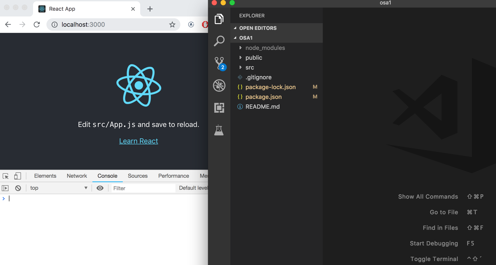
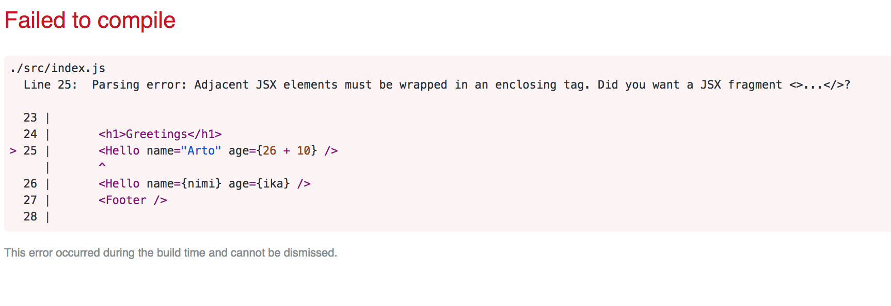

<div class="content">

Alamme nyt tutustua kurssin ehkä tärkeimpään teemaan, [React](https://reactjs.org/)-kirjastoon. Tehdään heti yksinkertainen React-sovellus ja tutustutaan samalla Reactin peruskäsitteistöön.

Ehdottomasti helpoin tapa päästä alkuun on [create-react-app](https://github.com/facebookincubator/create-react-app)-nimisen työkalun käyttö. _create-react-app_ on mahdollista asentaa omalle koneelle, mutta asennukseen ei ole tarvetta jos Noden mukana asentunut _npm_-työkalu on versioltaan vähintään _5.3_. Tällöin npm:n mukana asentuu komento _npx_, joka mahdollistaa create-react-app:in käytön asentamatta sitä erikseen. Npm:n version saa selville komennolla _npm -v_.

Luodaan sovellus nimeltään _osa1_ ja mennään sovelluksen sisältämään hakemistoon:

<pre>
$ npx create-react-app osa1
$ cd osa1
$ npm start
</pre>

Kaikki tässä (ja jatkossa) annettavat merkillä $alkavat komennot on kirjoitettu terminaaliin eli komentoriville. Merkkiä$ tule kirjoittaa, sillä se edustaa komentokehoitetta.

React on koko ajan aktiivisen kehityksen alla. Tämän vuoden ensimmäisen neljänneksen aikana Reactiin on tulossa erittäin merkittävä lisäys [hookit](https://reactjs.org/docs/hooks-intro.html) jotka tulevat vaikuttamaan merkittävästi siihen miten Reactia tullaan tulevaisuudessa käyttämään. Koska haluamme elää kehityksen eturintamassa käytämme kurssilla hookeja alusta asti.

Hookit eivät ole vielä Reactin uusimmassa virallisessa julkaisussa 0.16.7, mutta ne löytyvät hieman [erikoisesti numeroidusta](https://reactjs.org/blog/2018/12/19/react-v-16-7.html) julkaisusta 0.16.7-alpha.2

Saamme hookit käyttöön antamalla seuraavan komenon sovelluksen sisältävässä hakemistossa:

<pre>
npm install -s react@16.7.0-alpha.2 react-dom@16.7.0-alpha.2
</pre>

Joudumme siis ainakin alkuvuoden ajan antamaan aina edellisen komennon kun aloitamme uuden React-projektin.

Sovellus käynnistetään seuraavasti

<pre>
$ npm start
</pre>

Sovellus käynnistyy oletusarvoisesti localhostin porttiin 3000, eli osoitteeseen <http://localhost:3000>

Chromen pitäisi aueta automaattisesti. Avaa konsoli **välittömästi**. Avaa myös tekstieditori siten, että näet koodin ja web-sivun samaan aikaan ruudulla:



Sovelluksen koodi on hakemistossa _src_. Yksinkertaistetaan valmiina olevaa koodia siten, että tiedoston _index.js_ sisällöksi tulee:

```js
import React from 'react';
import ReactDOM from 'react-dom';

const App = () => (
  <div>
    <p>Hello world</p>
  </div>
);

ReactDOM.render(<App />, document.getElementById('root'));
```

Tiedostot _App.js_, _App.css_, _App.test.js_, _logo.svg_ ja _registerServiceWorker.js_ voi poistaa sillä niitä emme sovelluksessamme nyt tarvitse.

### Komponentti

Tiedosto _index.js_ määrittelee nyt React-[komponentin](https://reactjs.org/docs/components-and-props.html) nimeltään _App_ ja viimeisen rivin komento

```js
ReactDOM.render(<App />, document.getElementById('root'));
```

renderöi komponentin sisällön tiedoston _public/index.html_ määrittelemään _div_-elementtiin, jonka _id:n_ arvona on 'root'

Tiedosto _public/index.html_ on oleellisesti ottaen tyhjä, voit kokeilla lisätä sinne HTML:ää. Reactilla ohjelmoitaessa yleensä kuitenkin kaikki renderöitävä sisältö määritellään Reactin komponenttien avulla.

Tarkastellaan vielä tarkemmin komponentin määrittelevää koodia:

```js
const App = () => (
  <div>
    <p>Hello world</p>
  </div>
);
```

Kuten arvata saattaa, komponentti renderöityy _div_-tagina, jonka sisällä on _p_-tagin sisällä oleva teksti _Hello world_.

Teknisesti ottaen komponentti on määritelty Javascript-funktiona. Seuraava siis on funktio (joka ei saa yhtään parametria):

```js
() => (
  <div>
    <p>Hello world</p>
  </div>
);
```

joka sijoitetaan vakioarvoiseen muuttujaan _App_

```js
const App = ...
```

Javascriptissa on muutama tapa määritellä funktioita. Käytämme nyt Javascriptin hieman uudemman version [EcmaScript 6:n](http://es6-features.org/#Constants) eli ES6:n [nuolifunktiota](https://developer.mozilla.org/en-US/docs/Web/JavaScript/Reference/Functions/Arrow_functions) (arrow functions).

Koska funktio koostuu vain yhdestä lausekkeesta, on käytössämme lyhennysmerkintä, joka vastaa oikeasti seuraavaa koodia:

```js
const App = () => {
  return (
    <div>
      <p>Hello world</p>
    </div>
  );
};
```

eli funktio palauttaa sisältämänsä lausekkeen arvon.

Komponentin määrittelevä funktio voi sisältää mitä tahansa Javascript-koodia. Muuta komponenttisi seuraavaan muotoon ja katso mitä konsolissa tapahtuu:

```js
const App = () => {
  console.log('Hello from komponentti');
  return (
    <div>
      <p>Hello world</p>
    </div>
  );
};
```

Komponenttien sisällä on mahdollista renderöidä myös dynaamista sisältöä.

Muuta komponentti muotoon:

```js
const App = () => {
  const now = new Date();
  const a = 10;
  const b = 20;

  return (
    <div>
      <p>Hello world, it is {now.toString()}</p>
      <p>
        {a} plus {b} is {a + b}
      </p>
    </div>
  );
};
```

Aaltosulkeiden sisällä oleva Javascript-koodi evaluoidaan ja evaluoinnin tulos upotetaan määriteltyyn kohtaan komponentin tuottamaa HTML-koodia.

### JSX

Näyttää siltä, että React-komponentti palauttaa HTML-koodia. Näin ei kuitenkaan ole. React-komponenttien ulkoasu kirjoitetaan yleensä [JSX](https://reactjs.org/docs/introducing-jsx.html):ää käyttäen. Vaikka JSX näyttää HTML:ltä, kyseessä on kuitenkin tapa kirjoittaa Javascriptiä. React komponenttien palauttama JSX käännetään konepellin alla Javascriptiksi.

Käännösvaiheen jälkeen ohjelmamme näyttää seuraavalta:

```js
import React from 'react';
import ReactDOM from 'react-dom';

const App = () => {
  const now = new Date();
  const a = 10;
  const b = 20;
  return React.createElement(
    'div',
    null,
    React.createElement('p', null, 'Hello world, it is ', now.toString()),
    React.createElement('p', null, a, ' plus ', b, ' is ', a + b)
  );
};

ReactDOM.render(
  React.createElement(App, null),
  document.getElementById('root')
);
```

Käännöksen hoitaa [Babel](https://babeljs.io/repl/). Create-react-app:illa luoduissa projekteissa käännös on konfiguroitu tapahtumaan automaattisesti. Tulemme tutustumaan aiheeseen tarkemmin kurssin [osassa 7](/osa7).

Reactia olisi myös mahdollista kirjoittaa "suoraan Javascriptinä" käyttämättä JSX:ää. Kukaan täysijärkinen ei kuitenkaan niin tee.

Käytännössä JSX on melkein kuin HTML:ää sillä erotuksella, että mukaan voi upottaa helposti dynaamista sisältöä kirjoittamalla sopivaa Javascriptiä aaltosulkeiden sisälle. Idealtaan JSX on melko lähellä monia palvelimella käytettäviä templating-kieliä kuten Java Springin yhteydessä käytettävää thymeleafia.

JSX on "XML:n kaltainen", eli jokainen tagi tulee sulkea. Esimerkiksi rivinvaihto on tyhjä elementti, joka kirjoitetaan HTML:ssä tyypillisesti

```html
<br />
```

mutta JSX:ää kirjoittaessa tagi on pakko sulkea:

```html
<br />
```

## Monta komponenttia

Muutetaan sovellusta seuraavasti (yläreunan importit jätetään _esimerkeistä_ nyt ja jatkossa pois, niiden on kuitenkin oltava koodissa jotta ohjelma toimisi):

```js
const Hello = () => {
  return (
    <div>
      <p>Hello world</p>
    </div>
  );
};

const App = () => {
  return (
    <div>
      <h1>Greetings</h1>
      <Hello />
    </div>
  );
};

ReactDOM.render(<App />, document.getElementById('root'));
```

Olemme määritelleet uuden komponentin _Hello_, jota käytetään komponentista _App_. Komponenttia voidaan luonnollisesti käyttää monta kertaa:

```js
const App = () => {
  return (
    <div>
      <h1>Greetings</h1>
      <Hello />
      <Hello />
      <Hello />
    </div>
  );
};
```

Komponenttien tekeminen Reactissa on helppoa ja komponentteja yhdistelemällä monimutkaisempikin sovellus on mahdollista pitää kohtuullisesti ylläpidettävänä. Reactissa filosofiana onkin koostaa sovellus useista, pieneen asiaan keskittyvistä uudelleenkäytettävistä komponenteista.

## props: tiedonvälitys komponenttien välillä

Komponenteille on mahdollista välittää dataa [propsien](https://reactjs.org/docs/components-and-props.html) avulla.

Muutetaan komponenttia _Hello_ seuraavasti

```js
const Hello = props => {
  return (
    <div>
      <p>Hello {props.name}</p>
    </div>
  );
};
```

komponentin määrittelevällä funktiolla on nyt parametri _props_. Parametri saa arvokseen olion, jonka kenttinä ovat kaikki eri "propsit", jotka komponentin käyttäjä määrittelee.

Propsit määritellään seuraavasti:

```js
const App = () => {
  return (
    <div>
      <h1>Greetings</h1>
      <Hello name="Arto" />
      <Hello name="Pekka" />
    </div>
  );
};
```

Propseja voi olla mielivaltainen määrä ja niiden arvot voivat olla "kovakoodattuja" merkkijonoja tai Javascript-lausekkeiden tuloksia. Jos propsin arvo muodostetaan Javascriptillä, tulee se olla aaltosulkeissa.

Muutetaan koodia siten, että komponentti _Hello_ käyttää kahta propsia:

```js
const Hello = props => {
  return (
    <div>
      <p>
        Hello {props.name}, you are {props.age} years old
      </p>
    </div>
  );
};

const App = () => {
  const nimi = 'Pekka';
  const ika = 10;

  return (
    <div>
      <h1>Greetings</h1>
      <Hello name="Arto" age={26 + 10} />
      <Hello name={nimi} age={ika} />
    </div>
  );
};
```

Komponentti _App_ lähettää propseina muuttujan arvoja, summalausekkeen evaluoinnin tuloksen ja normaalin merkkijonon.

### Muutamia huomioita

React on konfiguroitu antamaan varsin hyviä virheilmoituksia. Kannattaa kuitenkin edetä ainakin alussa **todella pienin askelin** ja varmistaa, että jokainen muutos toimii halutulla tavalla.

**Konsolin tulee olla koko ajan auki**. Jos selain ilmoittaa virheestä, ei kannata kirjoittaa sokeasti lisää koodia ja toivoa ihmettä tapahtuvaksi, vaan tulee yrittää ymmärtää virheen syy ja esim. palata edelliseen toimivaan tilaan:


Kannattaa myös muistaa, että React-koodissakin on mahdollista ja kannattavaa lisätä koodin sekaan sopivia konsoliin tulostavia <code>console.log()</code>-komentoja. Tulemme hieman [myöhemmin](#react-sovellusten-debuggaus) tutustumaan muutamiin muihinkin tapoihin debugata Reactia.

Kannattaa pitää mielessä, että **React-komponenttien nimien tulee alkaa isolla kirjaimella**. Jos yrität määritellä komponentin seuraavasti:

```js
const footer = () => {
  return (
    <div>
      greeting app created by <a href="https://github.com/mluukkai">mluukkai</a>
    </div>
  );
};
```

ja ottaa se käyttöön

```js
const App = () => {
  return (
    <div>
      <h1>Greetings</h1>
      <Hello name="Arto" age={26 + 10} />
      <footer />
    </div>
  );
};
```

sivulle ei kuitenkaan ilmesty näkyviin Footer-komponentissa määriteltyä sisältöä, vaan React luo sivulle ainoastaan tyhjän _footer_-elementin. Jos muutat komponentin nimen alkamaan isolla kirjaimella, React luo sivulle _div_-elementin, joka määriteltiin Footer-komponentissa.

Kannattaa myös pitää mielessä, että React-komponentin sisällön tulee (yleensä) sisältää **yksi juurielementti**. Eli jos yrittäisimme määritellä komponentin _App_ ilman uloimmaista _div_-elementtiä:

```js
const App = () => {
  return (
    <h1>Greetings</h1>
    <Hello name="Arto" age={26 + 10} />
    <Footer />
  )
}
```

seurauksena on virheilmoitus:



Juurielementin käyttö ei ole ainoa toimiva vaihtoehto, myös _taulukollinen_ komponentteja on validi tapa:

```js
const App = () => {
  return [<h1>Greetings</h1>, <Hello name="Arto" age={26 + 10} />, <Footer />];
};
```

Määritellessä sovelluksen juurikomponenttia, tämä ei kuitenkaan ole järkevää ja näyttää koodissakin pahalta.

Juurielementin pakollinen käytöstä on se seuraus, että sovelluksen DOM-puuhun tulee "ylimääräisiä" div-elementtejä. Tämä on mahdollista välttää käyttämällä [fragmentteja](https://reactjs.org/docs/fragments.html#short-syntax), eli ympäröimällä komponentin palauttamat elementit tyhjällä elementillä:

```js
const App = () => {
  const name = 'Pekka';
  const ika = 10;

  return (
    <>
      <h1>Greetings</h1>
      <Hello name="Arto" age={26 + 10} />
      <Hello name={nimi} age={ika} />
      <Footer />
    </>
  );
};
```

Nyt käännös menee läpi ja Reactin generoimaan DOM:iin ei tule ylimääräistä div-elementtiä.

</div>

<div class="tasks">
  <h3>Tehtäviä </h3>

  <h4>1.1: jako komponenteiksi</h4>

<em>Tässä tehtävässä aloitettavaa ohjelmaa kehitellään eteenpäin muutamassa seuraavassa tehtävässä. Tässä ja kurssin aikana muissakin vastaantulevissa tehtäväsarjoissa ohjelman lopullisen version palauttaminen riittää, voit toki halutessasi tehdä commitin jokaisen tehtävän jälkeisestä tilanteesta, mutta se ei ole välttämätöntä.</em>

Luo create-react-app:illa uusi sovellus. Muuta <i>index.js</i> muotoon

```js
import React from 'react';
import ReactDOM from 'react-dom';

const App = () => {
  const course = 'Half Stack -sovelluskehitys';
  const part1 = 'Reactin perusteet';
  const exercises1 = 10;
  const part2 = 'Tiedonvälitys propseilla';
  const exercises2 = 7;
  const part3 = 'Komponenttien tila';
  const exercises3 = 14;

  return (
    <div>
      <h1>{course}</h1>
      <p>
        {part1} {exercises1}
      </p>
      <p>
        {part2} {exercises2}
      </p>
      <p>
        {part3} {exercises3}
      </p>
      <p>yhteensä {exercises1 + exercises2 + exercises3} tehtävää</p>
    </div>
  );
};

ReactDOM.render(<App />, document.getElementById('root'));
```

ja poista ylimääräiset tiedostot.

Koko sovellus on nyt ikävästi yhdessä komponentissa. Refaktoroi sovelluksen koodi siten, että se koostuu kolmesta komponentista <i>Header</i>, <i>Content</i> ja <i>Total</i>. Kaikki data pidetään edelleen komponentissa <i>App</i>, joka välittää tarpeelliset tiedot kullekin komponentille <i>props:ien</i> avulla. <i>Header</i> huolehtii kurssin nimen renderöimisestä, <i>Content</i> osista ja niiden tehtävämääristä ja <i>Total</i> tehtävien yhteismäärästä.

Komponentin <i>App</i> runko tulee olemaan suunnilleen seuraavanlainen:

```js
const App = () => {
  // const-määrittelyt

  return (
    <div>
      <Header course={course} />
      <Content ... />
      <Total ... />
    </div>
  )
}
```

<h4>1.2: lisää komponentteja</h4>

Refaktoroi vielä komponentti <i>Content</i> siten, että se ei itse renderöi yhdenkään osan nimeä eikä sen tehtävälukumäärää vaan ainoastaan kolme <i>Part</i>-nimistä komponenttia, joista kukin siis renderöi yhden osan nimen ja tehtävämäärän.

```js
const Content = ... {
  return (
    <div>
      <Part .../>
      <Part .../>
      <Part .../>
    </div>
  )
}
```

Sovelluksemme tiedonvälitys on tällä hetkellä todella alkukantaista, sillä se perustuu yksittäisiin muuttujiin. Tilanne paranee pian.

</div>
