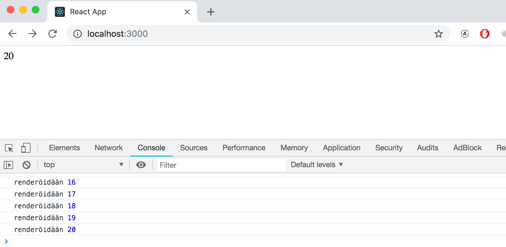
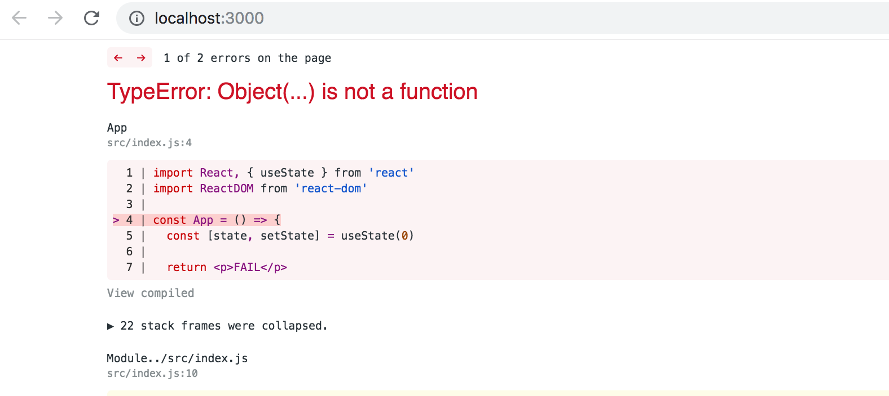
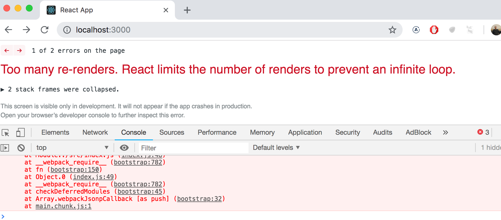

<div class="content">

Palataan jälleen Reactin pariin.

Sovelluksemme jäi seuraavaan tilaan

```js
const Hello = (props) => {
  return (
    <div>
      <p>
        Hello {props.name}, you are {props.age} years old
      </p>
    </div>
  )
}

const App = () => {
  const nimi = 'Pekka'
  const ika = 10

  return (
    <div>
      <h1>Greetings</h1>
      <Hello name="Arto" age={26 + 10} />
      <Hello name={nimi} age={ika} />
    </div>
  )
}
```

### Komponenttien apufunktiot

Laajennetaan komponenttia <i>Hello</i> siten, että se antaa arvion tervehdittävän henkilön syntymävuodesta:

```js
const Hello = (props) => {
  // highlight-start
  const bornYear = () => {
    const yearNow = new Date().getFullYear()
    return yearNow - props.age
  }
  // highlight-end

  return (
    <div>
      <p>
        Hello {props.name}, you are {props.age} years old
      </p>
      <p>So you were probably born {bornYear()}</p> // highlight-line
    </div>
  )
}
```

Syntymävuoden arvauksen tekevä logiikka on erotettu omaksi funktiokseen, jota kutsutaan komponentin renderöinnin yhteydessä.

Tervehdittävän henkilön ikää ei metodille tarvitse välittää parametrina, sillä funktio näkee sen sisältävälle komponentille välitettävät propsit.

Teknisesti ajatellen syntymävuoden selvittävä funktio on määritelty komponentin toiminnan määrittelevän funktion sisällä. Esim. Javalla ohjelmoitaessa metodien määrittely toisen metodin sisällä ei onnistu. Javascriptissa taas funktioiden sisällä määritellyt funktiot on hyvin yleisesti käytetty tekniikka.

### Destrukturointi

Ennen kuin siirrymme eteenpäin, tarkastellaan erästä pientä, mutta käyttökelpoista ES6:n mukanaan tuomaa uutta piirrettä Javascriptissä, eli muuttujaan sijoittamisen yhteydessä tapahtuvaa [destrukturointia](https://developer.mozilla.org/en-US/docs/Web/JavaScript/Reference/Operators/Destructuring_assignment).

Jouduimme äskeisessä koodissa viittaamaan propseina välitettyyn dataan hieman ikävästi muodossa _props.name_ ja _props.age_. Näistä _props.age_ pitää toistaa komponentissa kahteen kertaan.

Koska <i>props</i> on nyt olio

```js
props = {
  name: 'Arto Hellas',
  age: 35,
}
```

voimme suoraviivaistaa komponenttia siten, että sijoitamme kenttien arvot muuttujiin _name_ ja _age_, jonka jälkeen niitä on mahdollista käyttää koodissa suoraan:

```js
const Hello = (props) => {
  // highlight-start
  const name = props.name
  const age = props.age
  // highlight-end

  const bornYear = () => new Date().getFullYear() - age

  return (
    <div>
      <p>Hello {name}, you are {age} years old</p>
      <p>So you were probably born {bornYear()}</p>
    </div>
  )
}
```

Huomaa, että olemme myös hyödyntäneet nuolifunktion kompaktimpaa kirjoitustapaa metodin _bornYear_ määrittelyssä. Kuten aiemmin totesimme, jos nuolifunktio koostuu ainoastaan yhdestä komennosta, ei funktion runkoa tarvitse kirjoittaa aaltosulkeiden sisään ja funktio palauttaa ainoan komentonsa arvon.

Seuraavat ovat siis vaihtoehtoiset tavat määritellä sama funktio:

```js
const bornYear = () => new Date().getFullYear() - age

const bornYear = () => {
  return new Date().getFullYear() - age
}
```

Destrukturointi tekee apumuuttujien määrittelyn vielä helpommaksi, sen avulla voimme "kerätä" olion oliomuuttujien arvot suoraan omiin yksittäisiin muuttujiin:

```js
const Hello = (props) => {
    // highlight-start
  const { name, age } = props
    // highlight-end
  const bornYear = () => new Date().getFullYear() - age

  return (
    <div>
      <p>Hello {name}, you are {props.age} years old</p>
      <p>So you were probably born {bornYear()}</p>
    </div>
  )
}
```

Eli koska

```js
props = {
  name: 'Arto Hellas',
  age: 35,
}
```

saa <em>const { name, age } = props</em> aikaan sen, että muuttuja _name_ saa arvon 'Arto Hellas' ja muuttuja _age_ arvon 35.

Voimme viedä destrukturoinnin vielä askeleen verran pidemmälle

```js
const Hello = ({ name, age }) => { // highlight-line
  const bornYear = () => new Date().getFullYear() - age

  return (
    <div>
      <p>
        Hello {name}, you are {age} years old
      </p>
      <p>So you were probably born {bornYear()}</p>
    </div>
  )
}
```

Destrukturointi tehdään nyt suoraan sijoittamalla komponentin saamat propsit muuttujiin _name_ ja _age_.

Eli sensijaan että props-olio otettaisiin vastaan muuttujaan <i>props</i> ja sen kentät sijoitettaisiin tämän jälkeen muuttujiin _name_ ja _age_

```js
const Hello = (props) => {
  const { name, age } = props
```

sijoitamme destrukturoinnin avulla propsin kentät suoraan muuttujiin kun määrittelemme komponettifunktion saaman parametrin:

```js
const Hello = ({ name, age }) => {
```

### Sivun uudelleenrenderöinti

Toistaiseksi tekemämme sovellukset ovat olleet sellaisia, että kun niiden komponentit on kerran renderöity, niiden ulkoasua ei ole enää voinut muuttaa. Entä jos haluaisimme toteuttaa laskurin, jonka arvo kasvaa esim. ajan kuluessa tai nappien painallusten yhteydessä?

Aloitetaan seuraavasta rungosta:

```js
const App = (props) => {
  const {counter} = props
  return (
    <div>{counter}</div>
  )
}

let counter = 1

ReactDOM.render(
  <App counter={counter} />, 
  document.getElementById('root')
)
```

Sovelluksen juurikomponentille siis annetaan propsiksi laskuriin _counter_ arvo. Juurikomponentti renderöi arvon ruudulle. Entä laskurin arvon muuttuessa? Jos lisäämme ohjelmaan esim. komennon

```js
counter.value += 1
```

ei komponenttia kuitenkaan renderöidä uudelleen. Voimme saada komponentin uudelleenrenderöitymään kutsumalla uudelleen metodia _ReactDOM.render_, esim. seuraavasti

```js
const App = (props) => {
  const { counter } = props
  return (
    <div>{counter}</div>
  )
}

let counter = 1

const refresh = () => {
  ReactDOM.render(<App counter={counter} />, 
  document.getElementById('root'))
}

refresh()
counter += 1
refresh()
counter += 1
refresh()
```

Copypastea vähentämään on komponentin renderöinti kääritty funktioon _refresh_.

Nyt komponentti <i>renderöityy kolme kertaa</i>, saaden ensin arvon 1, sitten 2 ja lopulta 3. 1 ja 2 tosin ovat ruudulla niin vähän aikaa, että niitä ei ehdi havaita.

Hieman mielenkiintoisempaan toiminnallisuuteen pääsemme tekemällä renderöinnin ja laskurin kasvatuksen toistuvasti sekunnin välein käyttäen [SetInterval](https://developer.mozilla.org/en-US/docs/Web/API/WindowOrWorkerGlobalScope/setInterval):

```js
setInterval(() => {
  refresh()
  counter += 1
}, 1000)
```

_ReactDOM.render_-metodin toistuva kutsuminen ei kuitenkaan ole suositeltu tapa päivittää komponentteja. Tutustutaan seuraavaksi järkevämpään tapaan.

### Tilallinen komponentti

Tähänastiset komponenttimme ovat olleet siinä mielessä yksinkertaisia, että niillä ei ole ollut ollenkaan omaa tilaa, joka voisi muuttua komponentin elinaikana.

Määritellään nyt sovelluksemme komponentille <i>App</i> tila Reactin [state hookin](https://reactjs.org/docs/hooks-state.html) avulla.

Muutetaan ohjelmaa seuraavasti

```js
import React, { useState } from 'react' // highlight-line
import ReactDOM from 'react-dom'

const App = (props) => {
  const [ counter, setCounter ] = useState(0) // highlight-line

// highlight-start
  setTimeout(
    () => setCounter(counter + 1),
    1000
  )
  // highlight-end

  return (
    <div>{counter}</div>
  )
}

ReactDOM.render(
  <App />, 
  document.getElementById('root')
)
```

Sovellus importaa nyt heti ensimmäisellä rivillä _useState_-funktion:

```js
import React, { useState } from 'react'
```

Komponentin määrittelevä funktio alkaa metodikutsulla

```js
const [ counter, setCounter ] = useState(0)
```

Kutsu saa aikaan sen, että komponentille luodaan <i>tila</i>, joka saa alkuarvokseen nollan. Metodi palauttaa taulukon, jolla on kaksi alkiota. Alkiot otetaan taulukon destrukturointisyntaksilla talteen muuttujiin _counter_ ja _setCounter_.

Muuttuja _counter_ pitää sisällään <i>tilan arvon</i> joka on siis aluksi nolla. Muuttuja _setCounter_ taas on viite funktioon, jonka avulla <i>tilaa voidaan muuttaa</i>.

Sovellus määrittelee funktion [setTimeout](https://developer.mozilla.org/en-US/docs/Web/API/WindowOrWorkerGlobalScope/setTimeout) avulla, että tilan _counter_ arvoa kasvatetaan yhdellä sekunnin päästä:

```js
setTimeout(
  () => setCounter(counter + 1),
  1000
)
```

Kun tilaa muuttavaa funktiota _setCounter_ kutsutaan, <i>renderöi React komponentin uudelleen</i>, eli käytännössä suorittaa uudelleen komponentin määrittelevän koodin

```js
(props) => {
  const [ counter, setCounter ] = useState(0)

  setTimeout(
    () => setCounter(counter + 1),
    1000
  )

  return (
    <div>{counter}</div>
  )
}
```

kun koodi suoritetaan toista kertaa, funktion _useState_ kutsuminen palauttaa komponentin jo olemassaolevan tilan arvon, joka on nyt 1. Komponentin suoritus määrittelee jälleen laskuria kasvatettavaksi yhdellä sekunnin päästä ja renderöi ruudulle laskurin nykyisen arvon, joka on 1.

Sekunnin päästä siis suoritetaan funktion _setTimeout_ parametrina ollut koodi

```js
() => setCounter(counter + 1)
```

ja koska muuttujan _counter_ arvo on 1, on koodi oleellisesti sama kuin tilan _counter_ arvoon 2 asettava

```js
() => setCounter(2)
```

Ja tämä saa jälleen aikaan sen, että komponentti renderöidään uudelleen. Tilan arvo kasvaa sekunnin päästä yhdellä ja sama jatkuu niin kauan kun sovellus on toiminnassa.

Jos komponentti ei renderöidy vaikka sen omasta mielestä pitäisi, tai se renderöityy "väärään aikaan", debuggaamista auttaa joskus komponentin määrittelevään funktioon lisätty konsoliin tulostus. Esim. jos lisäämme koodiin seuraavan,

```js
const App = (props) => {
  const [ counter, setCounter ] = useState(0)

  setTimeout(
    () => setCounter(counter + 1),
    1000
  )

  console.log('renderöidään', counter) // highlight-line

  return (
    <div>{counter}</div>
  )
}
```

on konsolista helppo seurata metodin _render_ kutsuja:



### Kun React ei toimi...

Käyttäessäsi tilan tuovaa hookia <i>useState</i>, saatat törmätä seuraavaan virheilmoitukseen:



Syynä tälle on se, että <i>et ole asentanut</i> riittävän uutta Reactia kuten [osan 1 alussa](/osa1/reactin_alkeet) neuvottiin.

``` 
rm -rf node_modules/ && npm i
```

### Tapahtumankäsittely

Mainitsimme jo [osassa 0](/osa0) muutamaan kertaan <i>tapahtumankäsittelijät</i>, eli funktiot, jotka on rekisteröity kutsuttavaksi tiettyjen tapahtumien eli eventien yhteydessä. Esim. käyttäjän interaktio sivun elementtien kanssa aiheuttaa joukon erinäisiä tapahtumia.

Muutetaan sovellusta siten, että laskurin kasvaminen tapahtuukin käyttäjän painaessa [button](https://developer.mozilla.org/en-US/docs/Web/HTML/Element/button)-elementin avulla toteutettua nappia.

Button-elementit tukevat mm. [hiiritapahtumia](https://developer.mozilla.org/en-US/docs/Web/API/MouseEvent) (mouse events), joista yleisin on [click](https://developer.mozilla.org/en-US/docs/Web/Events/click).

Reactissa funktion rekisteröiminen tapahtumankäsittelijäksi tapahtumalle <i>click</i> [tapahtuu](https://reactjs.org/docs/handling-events.html) seuraavasti:

```js
const App = (props) => {
  const [ counter, setCounter ] = useState(0)

  // highlight-start
  const handleClick = () => {
    console.log('klicked')
  }
  // highlight-end

  return (
    <div>
      <div>{counter}</div>
      // highlight-start
      <button onClick={handleClick}>
        plus
      </button>
      // highlight-end
    </div>
  )
}
```

Eli laitetaan buttonin <i>onClick</i>-attribuutin arvoksi aaltosulkeissa oleva viite koodissa määriteltyyn funktioon _handleClick_.

Nyt jokainen napin <i>plus</i> painallus saa aikaan sen että funktiota _handleClick_ kutsutaan, eli klikatessa konsoliin tulostuu <i>clicked</i>.

Tapahtumankäsittelijäfunktio voidaan määritellä myös suoraan onClick-määrittelyn yhteydessä:

```js
const App = (props) => {
  const [ counter, setCounter ] = useState(0)

  return (
    <div>
      <div>{counter}</div>
      <button onClick={() => console.log('klicked')}> // highlight-line
        plus
      </button>
    </div>
  )
}
```

Muuttamalla tapahtumankäsittelijä seuraavaan muotoon

```js
<button onClick={() => setCounter(counter + 1)}>
  plus
</button>
```

saamme halutun toiminnallisuuden, eli tilan _counter_ arvo kasvaa yhdellä <i>ja</i> komponentti renderöityy uudelleen.

Lisätään sovellukseen myös nappi laskurin nollaamiseen:

```js
const App = (props) => {
  const [ counter, setCounter ] = useState(0)

  return (
    <div>
      <div>{counter}</div>
      <button onClick={() => setCounter(counter + 1)}>
        plus
      </button>
      // highlight-start
      <button onClick={() => setCounter(0)}> 
        zero
      </button>
      // highlight-end
    </div>
  )
}
```

Sovelluksemme on valmis!

Tapahtumankäsittelijöiden määrittely suoraan JSX-templatejen sisällä ei useimmiten ole kovin viisasta. Eriytetään vielä nappien tapahtumankäsittelijät omiksi komponentin sisäisiksi apufunktioikseen:

```js
const App = (props) => {
  const [ counter, setCounter ] = useState(0)

// highlight-start
  const increaseByOne = () =>
    setCounter(counter + 1)
  
  const setToZero = () =>
    setCounter(0)
  // highlight-end

  return (
    <div>
      <div>{counter}</div>
      <button onClick={increaseByOne}> // highlight-line
        plus
      </button>
      <button onClick={setToZero}> // highlight-line
        zero
      </button>
    </div>
  )
}
```

### Tapahtumankäsittelijä on funktio

Metodit _increaseByOne_ ja _setToZero_ toimivat melkein samalla tavalla, ne asettavat uuden arvon laskurille. Tehdään koodiin yksittäinen funktio, joka sopii molempiin käyttötarkoituksiin:

```js
const App = (props) => {
  const [ counter, setCounter ] = useState(0)

  const setToValue = (value) => setCounter(value) // highlight-line

  return (
    <div>
      <div>{counter}</div>
      <button onClick={setToValue(counter + 1)}> // highlight-line
        plus
      </button>
      <button onClick={setToValue(0)}> // highlight-line
        zero
      </button>
    </div>
  )
}

```

Huomaamme kuitenkin että muutos hajottaa sovelluksemme täysin:



Mistä on kyse? Tapahtumankäsittelijäksi on tarkoitus määritellä <i>viite funktioon</i>. Kun koodissa on

```js
<button onClick={setToValue(0)}>
```

tapahtumankäsittelijäksi tulee määriteltyä <i>funktiokutsu</i>. Sekin on monissa tilanteissa ok, mutta ei nyt, nimittäin kun React renderöi metodin, se suorittaa kutsun <em>setToValue(0)</em>. Kutsu aiheuttaa komponentin tilan päivittävän funktion _setCounter_ kutsumisen. Tämä taas aiheuttaa komponentin uudelleenrenderöitymisen. Ja sama toistuu uudelleen...

Tilanteeseen on kaksi ratkaisua. Ratkaisuista yksinkertaisempi on muuttaa tapahtumankäsittelyä seuraavasti

```js
const App = (props) => {
  const [ counter, setCounter ] = useState(0)

  const setToValue = (value) => setCounter(value)

  return (
    <div>
      <div>{counter}</div>
      <button onClick={() => setToValue(counter + 1)}> // highlight-line
        plus
      </button>
      <button onClick={() => setToValue(0)}> // highlight-line
        zero
      </button>
    </div>
  )
}
```

eli tapahtumankäsittelijä on määritelty <i>funktio</i>, joka kutsuu funktiota _setToValue_ sopivalla parametrilla:

```js
<button onClick={() => setToValue(counter + 1)}>
```

### Funktio joka palauttaa funktion

Toinen vaihtoehto on käyttää yleistä Javascriptin ja yleisemminkin funktionaalisen ohjelmoinnin kikkaa, eli määritellä <i>funktio joka palauttaa funktion</i>:

```js
const App = (props) => {
  const [ counter, setCounter ] = useState(0)

// highlight-start
  const setToValue = (value) => {
    return () => {
      setCounter(value)
    }
  }
// highlight-end  

  return (
    <div>
      <div>{counter}</div>
      <button onClick={setToValue(counter + 1)}> // highlight-line
        plus
      </button>
      <button onClick={setToValue(0)}> // highlight-line
        zero
      </button>
    </div>
  )
}
```

Jos et ole aiemmin törmännyt tekniikkaan, siihen totutteluun voi mennä tovi.

Olemme siis määritelleet tapahtumankäsittelijäfunktion _setToValue_ seuraavasti:

```js
const setToValue = (value) => {
  return () => {
    setCounter(value)
  }
}
```

Kun komponentissa määritellään tapahtumankäsittelijä kutsumalla <em>setCounter(0)</em> on lopputuloksena funktio

```js
() => {
  setCounter(0)
}
```

eli juuri oikeanlainen tilan nollaamisen aiheuttava funktio!

Plus-napin tapahtumankäsittelijä määritellään kutsumalla <em>setCounter(counter + 1)</em>. Kun komponentti renderöidään ensimmäisen kerran, _counter_ on saanut alkuarvon 0, eli plus-napin tapahtumankäsittelijäksi tulee funktiokutsun <em>setCounter(1)</em> tulos, eli funktio

```js
() => {
  setCounter(1)
}
```

Vastaavasti, kun laskurin tila on esim 41, tulee plus-napin tapahtumakuuntelijaksi

```js
() => {
  setCounter(42)
}
```

Tarkastellaan vielä hieman funktiota _setToValue_:

```js
const setToValue = (value) => {
  return () => {
    setCounter(value)
  }
}
```

Koska metodi itse sisältää ainoastaan yhden komennon, eli <i>returnin</i>, joka palauttaa funktion, voidaan hyödyntää nuolifunktion tiiviimpää muotoa:

```js
const setToValue = (value) => () => {
  setCounter(value)
}
```

Usein tälläisissä tilanteissa kaikki kirjoitetaan samalle riville, jolloin tuloksena on "kaksi nuolta sisältävä funktio":

```js
const setToValue = (value) => () => setCounter(value)
```

Kaksinuolisen funktion voi ajatella funktiona, jota lopullisen tuloksen saadakseen täytyy kutsua kaksi kertaa.

Ensimmäisellä kutsulla "konfiguroidaan" varsinainen funktio, sijoittamalla osalle parametreista arvo. Eli kutsu <em>setToValue(5)</em> sitoo muuttujaan _value_ arvon 5 ja funktiosta "jää jäljelle" seuraava funktio:

```js
() => setCounter(5)
```

Tässä näytetty tapa soveltaa funktioita palauttavia funktioita on oleellisesti sama asia mistä funktionaalisessa ohjelmoinnissa käytetään termiä [currying](http://www.datchley.name/currying-vs-partial-application/). Termi currying ei ole lähtöisin funktionaalisen ohjelmoinnin piiristä vaan sillä on juuret [syvällä matematiikassa](https://en.wikipedia.org/wiki/Currying).

Jo muutamaan kertaan mainittu termi <i>funktionaalinen ohjelmointi</i> ei ole välttämättä kaikille tässä vaiheessa tuttu. Asiaa avataan hiukan kurssin kuluessa, sillä React tukee ja osin edellyttää funktionaalisen tyylin käyttöä.

**HUOM:** muutos, missä korvasimme metodit _increaseByOne_ ja _setToZero_ metodilla _setToValue_ ei välttämättä ole järkevä, sillä erikoistuneemmat metodit ovat paremmin nimettyjä. Teimme muutoksen oikeastaan ainoastaan demonstroidaksemme _currying_-tekniikan soveltamista.

**HUOM2:** et välttämättä tarvitse tämän osan, etkä kenties kurssin muissakaan tehtävissä funktioita palauttavia funktioita, joten älä sekoita päätäsi asialla turhaan.

### Tilan vieminen alikomponenttiin

Reactissa suositaan pieniä komponentteja, joita on mahdollista uusiokäyttää monessa osissa sovellusta ja jopa useissa eri sovelluksissa. Refaktoroidaan koodiamme vielä siten, että yhden komponentin sijaan koostamme laskurin näytöstä ja kahdesta painikkeesta.

Tehdään ensin näytöstä vastaava komponentti <i>Display</i>.

Reactissa parhaana käytänteenä on sijoittaa tila [mahdollisimman ylös](https://reactjs.org/docs/lifting-state-up.html) komponenttihierarkiassa, mielellään sovelluksen juurikomponenttiin <i>App</i>.

Jätetään sovelluksen tila, eli laskimen arvo komponenttiin <i>App</i> ja välitetään tila <i>propsien</i> avulla komponentille <i>Display</i>:

```js
const Display = (props) => {
  return (
    <div>{props.counter}</div>
  )
}
```

Voimme hyödyntää aiemmin mainittua [destrukturointia](https://developer.mozilla.org/en-US/docs/Web/JavaScript/Reference/Operators/Destructuring_assignment) myös metodien parametreissa. Eli koska olemme kiinnostuneita <i>propsin</i> kentästä _counter_, on edellinen mahdollista yksinkertaistaa seuraavaan muotoon:

```js
const Display = ({ counter }) => {
  return (
    <div>{counter}</div>
  )
}
```

Koska komponentin määrittelevä metodi ei sisällä muuta kuin returnin, voimme ilmaista sen hyödyntäen nuolifunktioiden tiiviimpää ilmaisumuotoa

```js
const Display = ({ counter }) => <div>{counter}</div>
```

Komponentin käyttö on suoraviivaista, riittää että sille välitetään laskurin tila eli _counter_:

```js
const App = (props) => {
  const [counter, setCounter] = useState(0)
  const setToValue = (value) => setCounter(value)

  return (
    <div>
      <Display counter={counter}/> // highlight-line
      <button onClick={() => setToValue(counter + 1)}>
        plus
      </button>
      <button onClick={() => setToValue(0)}>
        zero
      </button>
    </div>
  )
}
```

Kaikki toimii edelleen. Kun nappeja painetaan ja <i>App</i> renderöityy uudelleen, renderöityvät myös kaikki sen alikomponentit, siis myös <i>Display</i> automaattisesti uudelleen.

Tehdään seuraavaksi napeille tarkoitettu komponentti <i>Button</i>. Napille on välitettävä propsien avulla tapahtumankäsittelijä sekä napin teksti:

```js
const Button = (props) => (
  <button onClick={props.handleClick}>
    {props.text}
  </button>
)
```

ja hyödynnetään taas destrukturointia ottamaan <i>props</i>:in tarpeelliset kentät suoraan:

```js
const Button = ({ handleClick, text }) => (
  <button onClick={handleClick}>
    {text}
  </button>
)
```

Komponentti <i>App</i> muuttuu nyt muotoon:

```js
const App = (props) => {
  const [ counter, setCounter ] = useState(0)
  const setToValue = (value) => setCounter(value)


  return (
    <div>
      <Display counter={counter}/>
      // highlight-start
      <Button
        handleClick={() => setToValue(counter + 1)}
        text='plus'
      />
      <Button
        handleClick={() => setToValue(0)}
        text='zero'
      />
      // highlight-end
    </div>
  )
}
```

Koska meillä on nyt uudelleenkäytettävä nappi, sovellukselle on lisätty uutena toiminnallisuutena nappi, jolla laskurin arvoa voi vähentää.

Tapahtumankäsittelijä välitetään napeille propsin _handleClick_ välityksellä. Propsin nimellä ei ole sinänsä merkitystä, mutta valinta ei ollut täysin sattumanvarainen, esim. Reactin [tutoriaali](https://reactjs.org/tutorial/tutorial.html) suosittelee tätä konventiota.

</div>
