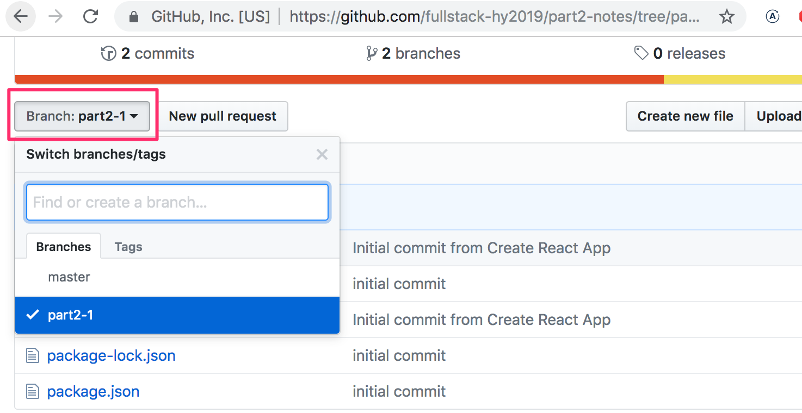
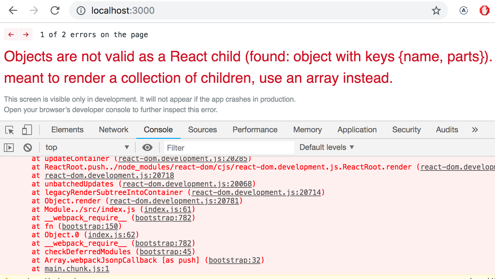
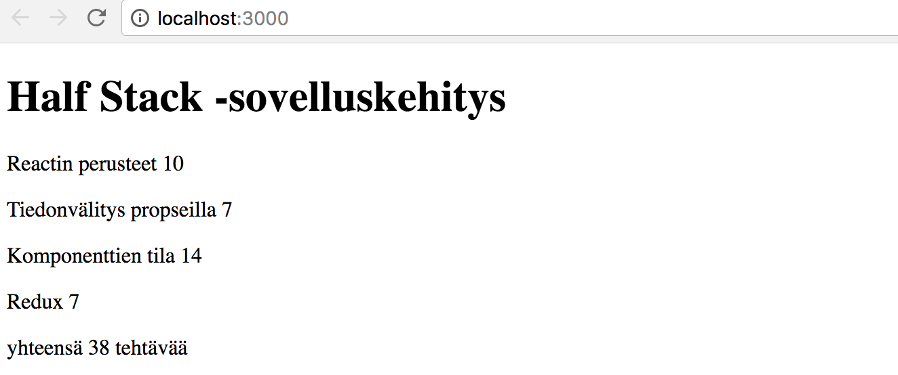

<div class="content">

Ennen kun menemme uuteen asiaan, nostetaan esiin muutama edellisen osan huomiota herättänyt seikka.

### console.log

**Mikä erottaa kokeneen ja kokemattoman Javascript-ohjelmoijan? Kokeneet käyttävät 10-100 kertaa enemmän console.logia**.

Paradoksaalista kyllä tämä näyttää olevan tilanne, vaikka kokematon ohjelmoija oikeastaan tarvitsisi console.logia (tai jotain muita debuggaustapoja) huomattavissa määrin kokenutta enemmän. 

Eli kun joku ei toimi, älä arvaile vaan logaa tai käytä jotain muita debuggauskeinoja.

**HUOM** kun käytät komentoa _console.log_ debuggaukseen, älä yhdistele asioita "javamaisesti" plussalla, eli sen sijaan että kirjoittaisit

```js
console.log('propsin arvo on' + props)
```

erottele tulostettavat asiat pilkulla:

```js
console.log('propsin arvo on', props)
```

Jos yhdistät merkkijonoon olion, tuloksena on suhteellisen hyödytön tulostusmuoto

```js
propsin arvo on [Object object]
```

kun taas pilkulla erotellessa saat tulostettavat asiat developer-konsoliin oliona, jonka sisältöä on mahdollista tarkastella.

### Tapahtumankäsittely revisited

Pajan ja telegrammin havaintojen perusteella tapahtumankäsittely on osoittautunut haastavaksi.

Osasan loppussa oleva kertaava osa [tapahtumankäsittely revisited](/osa1#tapahtumankäsittely-revisited) kannattaa käydä läpi jos osaaminen on vielä häilyvällä pohjalla.

### Visual Studio Coden snippetit

Visual studio codeen on helppo määritellä "snippettejä", eli Netbeansin "sout":in tapaisia oikoteitä yleisesti käytettyjen koodinpätkien generointiin. Ohje snippetien luomiseen [täällä](https://code.visualstudio.com/docs/editor/userdefinedsnippets#_creating-your-own-snippets)

VS Code -plugineina löytyy myös hyödyllisiä valmiiksi määriteltyjä snippettejä, esim.
[tämä](https://marketplace.visualstudio.com/items?itemName=xabikos.ReactSnippets)

Tärkein kaikista snippeteistä on komennon <code>console.log()</code> nopeasti ruudulle tekevä snippet, esim. <code>clog</code>, jonka voi määritellä seuraavasti:

```js
{
  "console.log": {
    "prefix": "clog",
    "body": [
      "console.log('$1')",
    ],
    "description": "Log output to console"
  }
}
```

## Taulukkojen käyttö Javascriptissä

Tästä osasta lähtien käytämme runsaasti Javascriptin [taulukkojen](https://developer.mozilla.org/en-US/docs/Web/JavaScript/Reference/Global_Objects/Array) funktionaalisia käsittelymetodeja, kuten _find_, _filter_ ja _map_. Periaate niissä on täysin sama kuin Java 8:sta tutuissa streameissa, joita on käytetty jo parin vuoden ajan Tietojenkäsittelytieteen osaston Ohjelmoinnin perusteissa ja jatkokurssilla sekä Ohjelmoinnin MOOC:issa.

Jos taulukon funktionaalinen käsittely tuntuu vielä vieraalta, kannattaa katsoa Youtubessa olevasta videosarjasta _Functional Programming in JavaScript_ ainakin kolme ensimmäistä osaa

- [Higher-order functions](https://www.youtube.com/watch?v=BMUiFMZr7vk&list=PL0zVEGEvSaeEd9hlmCXrk5yUyqUag-n84)
- [Map](https://www.youtube.com/watch?v=bCqtb-Z5YGQ&list=PL0zVEGEvSaeEd9hlmCXrk5yUyqUag-n84&index=2)
- [Reduce basics](https://www.youtube.com/watch?v=Wl98eZpkp-c&t=31s)

## Kokoelmien renderöiminen

Tehdään nyt Reactilla [osan 0](/osa0) alussa käytettyä esimerkkisovelluksen [Single page app -versiota](https://fullstack-exampleapp.herokuapp.com/spa) vastaavan sovelluksen 'frontend' eli selainpuolen sovelluslogiikka.

Aloitetaan seuraavasta:

```js
import React from 'react'
import ReactDOM from 'react-dom'

const notes = [
  {
    id: 1,
    content: 'HTML on helppoa',
    date: '2019-01-10T17:30:31.098Z',
    important: true
  },
  {
    id: 2,
    content: 'Selain pystyy suorittamaan vain javascriptiä',
    date: '2019-01-10T18:39:34.091Z',
    important: false
  },
  {
    id: 3,
    content: 'HTTP-protokollan tärkeimmät metodit ovat GET ja POST',
    date: '2019-01-10T19:20:14.298Z',
    important: true
  }
]

const App = (props) => {
  const { notes } = props

  return (
    <div>
      <h1>Muistiinpanot</h1>
      <ul>
        <li>{notes[0].content}</li>
        <li>{notes[1].content}</li>
        <li>{notes[2].content}</li>
      </ul>
    </div>
  )
}

ReactDOM.render(
  <App notes={notes} />,
  document.getElementById('root')
)
```

Jokaiseen muistiinpanoon on merkitty tekstuaalisen sisällön ja aikaleiman lisäksi myös _boolean_-arvo, joka kertoo onko muistiinpano luokiteltu tärkeäksi, sekä yksikäsitteinen tunniste _id_.

Koodin toiminta perustuu siihen, että taulukossa on tasan kolme muistiinpanoa, yksittäiset muistiinpanot renderöidään 'kovakoodatusti' viittaamalla suoraan taulukossa oleviin olioihin:

```js
<li>{note[1].content}</li>
```

Tämä ei tietenkään ole järkevää. Ratkaisu voidaan yleistää generoimalla taulukon perusteella joukko React-elementtejä käyttäen [map](https://developer.mozilla.org/en-US/docs/Web/JavaScript/Reference/Global_Objects/Array/map)-funktiota:

```js
notes.map(note => <li>{note.content}</li>)
```

nyt tuloksena on taulukko, jonka sisältö on joukko _li_-elementtejä

```js
[
  '<li>HTML on helppoa</li>',
  '<li>Selain pystyy suorittamaan vain javascriptiä</li>',
  '<li>HTTP-protokollan tärkeimmät metodit ovat GET ja POST</li>',
]
```

jotka voidaan sijoittaa _ul_-tagien sisälle:

```js
const App = (props) => {
  const { notes } = props

  return (
    <div>
      <h1>Muistiinpanot</h1>
// highlight-start
      <ul>
        {notes.map(note => <li>{note.content}</li>)}
      </ul>
// highlight-end      
    </div>
  )
}
```

Koska li-tagit generoiva koodi on Javascriptia, tulee se sijoittaa JSX-templatessa aaltosulkujen sisälle kaiken muun Javascript-koodin tapaan.

Usein vastaavissa tilanteissa dynaamisesti generoitava sisältö eristetään omaan metodiin, jota JSX-template kutsuu:

```js
const App = (props) => {
  const { notes } = props

// highlight-start
  const rows = () =>
    notes.map(note => <li>{note.content}</li>)
// highlight-end

  return (
    <div>
      <h1>Muistiinpanot</h1>
      <ul>
        {rows()} // highlight-line
      </ul>
    </div>
  )
}
```

### Key-attribuutti

Vaikka sovellus näyttää toimivan, tulee konsoliin ikävä varoitus


Kuten virheilmoituksen linkittämä [sivu](https://reactjs.org/docs/lists-and-keys.html#keys) kertoo, tulee taulukossa olevilla, eli käytännössä _map_-metodilla muodostetuilla elementeillä olla uniikki avain, eli attribuutti nimeltään _key_.

Lisätään avaimet:

```js
const App = (props) => {
  const { notes } = props

  const rows = () =>
    notes.map(note => <li key={note.id}>{note.content}</li>) // highlight-line

  return (
    <div>
      <h1>Muistiinpanot</h1>
      <ul>
        {rows()}
      </ul>
    </div>
  )
}
```

Virheilmoitus katoaa.

React käyttää taulukossa olevien elementtien key-kenttiä päätellessään miten sen tulee päivittää komponentin generoimaa näkymää silloin kun komponentti uudelleenrenderöidään. Lisää aiheesta [täällä](https://reactjs.org/docs/reconciliation.html#recursing-on-children).

### Map

Taulukoiden metodin [map](https://developer.mozilla.org/en-US/docs/Web/JavaScript/Reference/Global_Objects/Array/map) toiminnan sisäistäminen on jatkon kannalta äärimmäisen tärkeää.

Sovellus siis sisältää taulukon _notes_

```js
const notes = [
  {
    id: 1,
    content: 'HTML on helppoa',
    date: '2017-12-10T17:30:31.098Z',
    important: true,
  },
  {
    id: 2,
    content: 'Selain pystyy suorittamaan vain javascriptiä',
    date: '2017-12-10T18:39:34.091Z',
    important: false,
  },
  {
    id: 3,
    content: 'HTTP-protokollan tärkeimmät metodit ovat GET ja POST',
    date: '2017-12-10T19:20:14.298Z',
    important: true,
  },
]
```

Pysähdytään hetkeksi tarkastelemaan miten _map_ toimii.

Jos esim. tiedoston loppuun lisätään seuraava koodi

```js
const result = notes.map(note => note.id)
console.log(result)
```

tulostuu konsoliin _[1, 2, 3]_ eli _map_ muodostaa uuden taulukon, jonka jokainen alkio on saatu alkuperäisen taulukon _notes_ alkioista _mappaamalla_ komennon parametrina olevan funktion avulla.

Funktio on

```js
note => note.id
```

eli kompaktissa muodossa kirjoitettu nuolifunktio, joka on täydelliseltä kirjoitustavaltaan seuraava

```js
(note) => {
  return note.id
}
```

eli funktio saa parametrikseen muistiinpano-olion ja _palauttaa_ sen kentän _id_ arvon.

Muuttamalla komento muotoon

```js
const result = notes.map(note => note.content)
```

tuloksena on taulukko, joka koostuu muistiinpanojen sisällöistä.

Tämä on jo lähellä käyttämäämme React-koodia:

```js
notes.map(note => <li key={note.id}>{note.content}</li>)
```

joka muodostaa jokaista muistiinpano-olioa vastaavan _li_-tagin, jonka sisään tulee muistiinpanon sisältö.

Koska metodin _map_ parametrina olevan funktion

```js
note => <li key={note.id}>{note.content}</li>
```

käyttötarkoitus on näkymäelementtien muodostaminen, tulee muuttujan arvo renderöidä aaltosulkeiden sisällä. Kokeile mitä koodi tekee, jos poistat aaltosulkeet.

Aaltosulkeiden käyttö tulee varmaan aiheuttamaan alussa pientä päänvaivaa, mutta totut niihin pian. Reactin antama visuaalinen feedback on välitön.

Tarkastellaan vielä erästä bugien lähdettä. Lisää koodiin seuraava

```js
const result = notes.map(note => {note.content} )
console.log(result)
```

Tulostuu

```js
[undefined, undefined, undefined]
```

Missä on vika? Koodihan on ihan sama kun äsken toiminut koodi. Paitsi ei ihan. Metodin _map_ parametrina on nyt seuraava funktio

```js
note => {
  note.content
}
```

Koska funktio koostuu nyt _koodilohkosta_ on funktion paluuarvo määrittelemätön eli _undefined_. Nuolifunktiot siis palauttavat ainoan komentonsa arvon, ainoastaan jos nuolifunktio on määritelty kompaktissa muodossaan, ilman koodilohkoa:

```js
note => note.content
```

huomaa, että 'oneliner'-nuolifunktioissa kaikkea ei tarvitse eikä aina kannatakaan kirjoittaa samalle riville.

Parempi muotoilu ohjelmamme muistiinpanorivit tuottavalle apufunktiolle saattaakin olla seuraava useille riveille jaoteltu versio:

```js
const rows = () => notes.map(note =>
  <li key={note.id}>
    {note.content}
  </li>
)
```

Kyse on kuitenkin edelleen yhden komennon sisältävästä nuolifunktiosta, komento vain sattuu olemaan hieman monimutkaisempi.

### Antipattern: taulukon indeksit avaimina

Olisimme saaneet konsolissa olevan varoituksen katoamaan myös käyttämällä avaimina taulukon indeksejä. Indeksit selviävät käyttämällä map-metodissa myös toista parametria:

```js
notes.map((note, i) => ...)
```

näin kutsuttaessa _i_ saa arvokseen sen paikan indeksin taulukossa, missä _note_ sijaitsee.

Eli eräs virhettä aiheuttamaton tapa määritellä rivien generointi on

```js
const rows = () => notes.map((note, i) => 
  <li key={i}>
    {note.content}
  </li>
)
```

Tämä **ei kuitenkaan ole suositeltavaa** ja voi näennäisestä toimimisestaan aiheuttaa joissakin tilanteissa pahoja ongelmia. Lue lisää esim. [täältä](https://medium.com/@robinpokorny/index-as-a-key-is-an-anti-pattern-e0349aece318).

### Refaktorointia - moduulit

Siistitään koodia hiukan. Koska olemme kiinnostuneita ainoastaan propsien kentästä _notes_, otetaan se vastaan suoraan [destrukturointia](https://developer.mozilla.org/en-US/docs/Web/JavaScript/Reference/Operators/Destructuring_assignment) hyödyntäen:

```js
const App = ({ notes }) => { // highlight-line
  // ...

  return (
    <div>
      <h1>Muistiinpanot</h1>
      <ul>
        {rows()}
      </ul>
    </div>
  )
}
```

Erotetaan yksittäisen muistiinpanon esittäminen oman komponenttinsa _Note_ vastuulle:

```js
// highlight-start
const Note = ({ note }) => {
  return (
    <li>{note.content}</li>
  )
}
// highlight-end

const App = ({ notes }) => {
  const rows = () => notes.map(note =>
  // highlight-start
    <Note 
      key={note.id}
      note={note}
    />
    // highlight-end
  )

  return (
    <div>
      <h1>Muistiinpanot</h1>
      <ul>
        {rows()}
      </ul>
    </div>
  )
}
```

Huomaa, että _key_-attribuutti täytyy nyt määritellä _Note_-komponenteille, eikä _li_-tageille kuten ennen muutosta.

Koko React-sovellus on mahdollista määritellä samassa tiedostossa, mutta se ei luonnollisesti ole järkevää. Usein käytäntönä on määritellä yksittäiset komponentit omassa tiedostossaan _ES6-moduuleina_.

Koodissamme on käytetty koko ajan moduuleja. Tiedoston ensimmäiset rivit

```js
import Reactfrom 'react'
import ReactDOM from 'react-dom'
```

[importtaavat](https://developer.mozilla.org/en-US/docs/Web/JavaScript/Reference/Statements/import) eli ottavat käyttöönsä kaksi moduulia. Moduuli _react_ sijoitetaan muuttujaan _React_ ja _react-dom_ muuttujaan _ReactDOM_. 

Siirretään nyt komponentti _Note_ omaan moduuliinsa.

Pienissä sovelluksissa komponentit sijoitetaan yleensä _src_-hakemiston alle sijoitettavaan hakemistoon _components_. Konventiona on nimetä tiedosto komponentin mukaan. Tehdään nyt sovellukseen hakemisto _components_ ja sinne tiedosto _Note.js_ jonka sisältö on seuraava:

```js
import React from 'react'

const Note = ({ note }) => {
  return (
    <li>{note.content}</li>
  )
}

export default Note
```

Koska kyseessä on React-komponentti, tulee React importata komponentissa.

Moduulin viimeisenä rivinä [eksportataan](https://developer.mozilla.org/en-US/docs/Web/JavaScript/Reference/Statements/export) määritelty komponentti, eli muuttuja _Note_.

Nyt komponenttia käyttävä tiedosto _index.js_ voi [importata](https://developer.mozilla.org/en-US/docs/Web/JavaScript/Reference/Statements/import) moduulin:

```js
import React from 'react'
import ReactDOM from 'react-dom'
import Note from './components/Note' // highlight-line

const App = ({notes}) => {
  // ...
}
```

Moduulin eksporttaama komponentti on nyt käytettävissä muuttujassa _Note_ täysin samalla tavalla kuin aiemmin.

Huomaa, että itse määriteltyä komponenttia importatessa komponentin sijainti tulee ilmaista _suhteessa importtaavaan tiedostoon_:

```js
'./components/Note'
```

Piste alussa viittaa nykyiseen hakemistoon, eli kyseessä on nykyisen hakemiston alihakemisto _components_ ja sen sisällä tiedosto _Note.js_. Tiedoston päätteen voi jättää pois.

Koska myös <code>App</code> on komponentti, eristetään sekin omaan moduuliinsa. Koska kyseessä on sovelluksen juurikomponentti, sijoitetaan se suoraan hakemistoon _src_. Tiedoston sisältö on seuraava:

```js
import React from 'react'
import Note from './components/Note'

const App = ({ notes }) => {
  const rows = () => notes.map(note =>
    <Note
      key={note.id}
      note={note}
    />
  )

  return (
    <div>
      <h1>Muistiinpanot</h1>
      <ul>
        {rows()}
      </ul>
    </div>
  )
}

export default App // highlight-line
```

Tiedoston _index.js_ sisällöksi jää:

```js
import React from 'react'
import ReactDOM from 'react-dom'
import App from './App'  // highlight-line

const notes = [
  // ...
]

ReactDOM.render(
  <App notes={notes} />,
  document.getElementById('root')
)
```

Moduuleilla on paljon muutakin käyttöä kuin mahdollistaa komponenttien määritteleminen omissa tiedostoissaan, palaamme moduuleihin tarkemmin myöhemmin kurssilla.

Sovelluksen tämänhetkinen koodi on kokonaisuudessaan [githubissa](https://github.com/fullstack-hy2019/part2-notes/tree/part2-1)

Huomaa, että repositorion master-haarassa on myöhemmän vaiheen koodi, tämän hetken koodi on branchissa [part2-1](https://github.com/fullstack-hy2019/part2-notes/tree/part2-1):



Jos kloonaat projektin itsellesi, suorita komento _npm install_ ennen käynnistämistä eli komentoa _npm start_.

### Kun sovellus hajoaa...

Kun aloitat ohjelmoijan uraasi (ja allekirjoittaneella yhä edelleen 30 vuoden ohjelmointikokemuksella) melko usein käy niin ett ohjelma hajoaa aivan totaalisesti. Erityisen usien näin käy dynaamisesti tyypitetyillä kielillä kuten Javascript, missä kääntäjä ei tarkasta minkä tyyppisiä arvoja esim. funktioden parametreina ja paluuarvoina liikkuu.

Reactissa räjähdys näyttää esim. seuraavalta



Tilanteista pelastaa yleensä parhaiten <code>console.log</code>. Pala räjähdyksen aiheuttavaa koodia seuraavassa

```js
const Course = ({ course }) => (
  <div>
   <Header course={course} />
  </div>
)

const App = () => {
  const course = {
    // ...
  }

  return (
    <div>
      <Course course={course} />
    </div>
  )
}
```

Syy toimimattomuuteen alkaa selvitä lisäilemällä <code>console.log</code>-komentoja. Koska ensimmäinen renderöitävä asia on komponentti <code>App</code> voi jos sinne laittaa ensimmäisen tulostuksen. 

```js
const App = () => {
  const course = {
    // ...
  }

  console.log('App toimii...') // highlight-line

  return (
    // ..
  )
}
```

Konsoliin tulevan tulostuksen nähdäkseen on skrollattava pitkän punaisen virhematon yläpuolelle


Kun joku asia havaitaan toimivaksi, on aika logata syvemmältä. Jos komponentti on määritelty yksilausekkeista, eli returnitonta funktiota, on konsoliin tulostus haastavampaa:

```js
const Course = ({ course }) => (
  <div>
   <Header course={course} />
  </div>
)
```

komponentti on syytä muuttaa pidemmän kaavan mukaan määritellyksi:

```js
const Course = ({ course }) => { 
  console.log(course)
  return (
    <div>
    <Header course={course} />
    </div>
  )
}
```

Erittäin usein ongelma on siitä että propsien odotetaan olevan eri muodossa kuin ne todellisuudessa ovat ja destrukturointi epäonnistuu. Ongelma alkaa useimmiten ratketa kun poistetaan destrukturointi ja katsotaan mitä <code>props</code> oikeasti pitää sisällään:

```js
const Course = (props) => { // highlight-line
  console.log(props)  // highlight-line
  const { course } = props
  return (
    <div>
    <Header course={course} />
    </div>
  )
}
```

Ja jos ongelma ei vieläkään selviä, ei auta kuin jatkaa vianjäljitystä, eli kirjoittaa lisää console.logeja.

Lisäsin tämän luvun materiaaliin kun seuraavan tehtävän mallivastauksen koodi räjähti ihan totaalisesti (syynä väärässä muodossa ollut propsi) ja jouduin jälleen kerran debuggaamaan console.logaamalla.

</div>

<div class="tasks">

<h3>Tehtäviä</h3>
<h4>2.1: kurssien sisältö</h4>

Viimeistellään nyt tehtävien 1.1-1.5 kurssin sisältöjä renderöivän ohjelman koodi. Voit ottaa tarvittaessa pohjaksi mallivastauksen koodin.

**Huomaa, että jos kopioit projektin paikasta toiseen, saattaa olla tarpeen ensin tuhota hakemisto *node_modules* ja antaa sen jälkeen asentaa riippuvuudet uudelleen, eli komento _npm install_ ennen kuin saat kopioidun projektin käynnistettyä.** Lähtökohtaisesti toki kannattaa olla kokonaan kopioimatta tai laittamatta versionhallintaan hakemistoa *node_modules*.

Muutetaan komponenttia <code>App</code> seuraavasti:

```js
const App = () => {
  const course = {
    name: 'Half Stack -sovelluskehitys',
    parts: [
      {
        name: 'Reactin perusteet',
        exercises: 10,
        id: 1
      },
      {
        name: 'Tiedonvälitys propseilla',
        exercises: 7,
        id: 2
      },
      {
        name: 'Komponenttien tila',
        exercises: 14,
        id: 3
      }
    ]
  }

  return (
    <div>
      <Course course={course} />
    </div>
  )
}
```

Määrittele sovellukseen yksittäisen kurssin muotoilusta huolehtiva komponentti _Course_.

Sovelluksen komponenttirakenne voi olla esim. seuraava:

<pre>
App
  Course
    Header
    Content
      Part
      Part
      ...
</pre>

Eli komponentti _Course_ sisältää edellisessä osassa määritellyt komponentit, joiden vastuulle tulee kurssin nimen ja osien renderöinti.

Renderöityvä sivu voi näyttää esim. seuraavalta:


Tässä vaiheessa siis tehtävien yhteenlaskettua lukumäärää ei vielä tarvita.

Sovelluksen täytyy luonnollisesti toimia _riippumatta kurssissa olevien osien määrästä_, eli varmista että sovellus toimii jos lisäät tai poistat kurssin osia.

Varmista, että konsolissa ei näy mitään virheilmoituksia!

<h4>2.2: tehtävien määrä</h4>

Ilmoita myös kurssin yhteenlaskettu tehtävien lukumäärä:



<h4>2.3*: reduce</h4>

Jos et jo niin tehnyt, laske koodissasi tehtävien määrä taulukon metodilla [reduce](https://developer.mozilla.org/en-US/docs/Web/JavaScript/Reference/Global_Objects/Array/Reduce).

**Pro tip:** Kun koodisi joka näyttää esimerkisi seuraavalta 

```js
const total = parts.reduce( (s, p) => someMagicHere )
```

ei toimi, kannattaa taas kerran turvautua komentoon _console.log_, joka jälleen vaatii sen, että nuolifunktio muutetaan pidempään muotoonsa

```js
const total = parts.reduce( (s, p) => {
  console.log('what is happening', s, p)
  return someMagicHere 
})
```

**Pro tip2:** VS codeen on asennettavissa laajennus, ilmeisesti [tämä](https://marketplace.visualstudio.com/items?itemName=cmstead.jsrefactor), jonka avulla nuolifunktion lyhyen muodon voi muuttaa automaattisesti pidemmäksi muodoksi ja päinvastoin:


<h4>2.4: monta kurssia</h4>

Laajennetaan sovellusta siten, että kursseja voi olla _mielivaltainen määrä_:

```js
const App = () => {
  const courses = [
    {
      name: 'Half Stack -sovelluskehitys',
      id: 1,
      parts: [
        {
          name: 'Reactin perusteet',
          exercises: 10,
          id: 1
        },
        {
          name: 'Tiedonvälitys propseilla',
          exercises: 7,
          id: 2
        },
        {
          name: 'Komponenttien tila',
          exercises: 14,
          id: 3
        }
      ]
    },
    {
      name: 'Node.js',
      id: 2,
      parts: [
        {
          name: 'Routing',
          exercises: 2,
          id: 1
        },
        {
          name: 'Middlewaret',
          exercises: 7,
          id: 2
        }
      ]
    }
  ]

  return (
    <div>
      // ...
    </div>
  )
}
```

Sovelluksen ulkoasu voi olla esim seuraava:


<h4>2.5: erillinen moduuli</h4>

Määrittele komponentti _Course_ omana moduulinaan, jonka komponentti <code>App</code> importtaa. Voit sisällyttää kaikki kurssin alikomponentit samaan moduuliin.

</div>