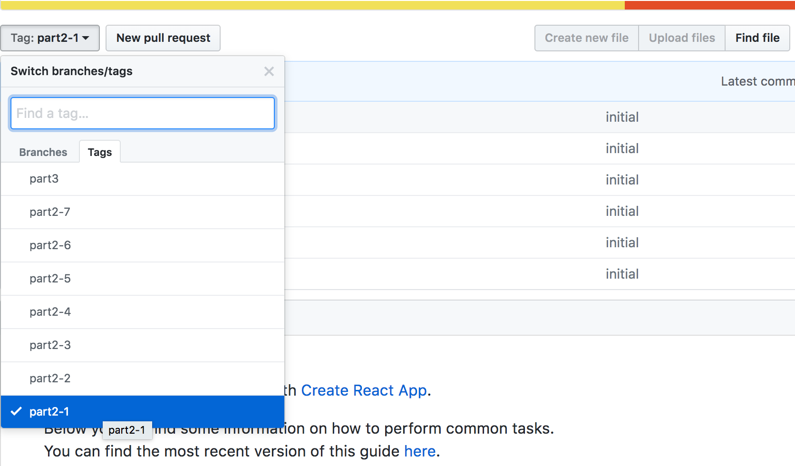
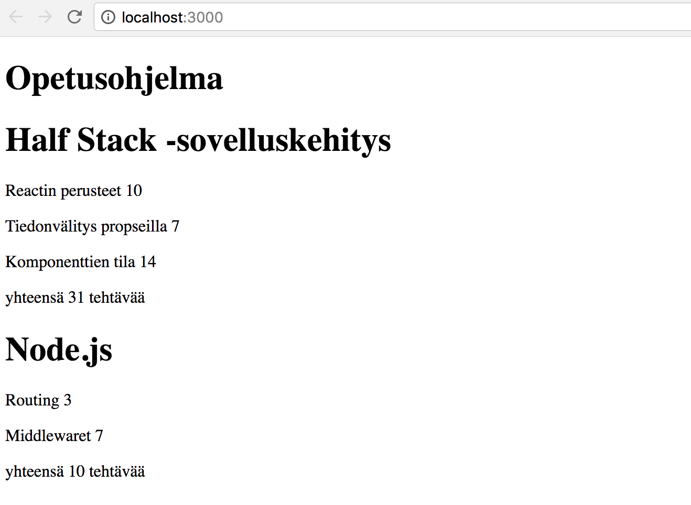

<div class="content">

Ennen osan varsinaista agendaa nostetaan esiin muutama tärkeä huomio.

### console.log

**Mikä erottaa kokeneen ja kokemattoman Javascript-ohjelmoijan? Kokeneet käyttävät 10-100 kertaa enemmän console.logia**.

Paradoksaalista kyllä tämä näyttää olevan tilanne, vaikka kokematon ohjelmoija oikeastaan tarvitsisi console.logia (tai jotain muita debuggaustapoja) huomattavissa määrin kokenutta enemmän. 

Eli kun joku ei toimi, älä arvaile vaan logaa tai käytä jotain muita debuggauskeinoja.

**HUOM** kun käytät komentoa _console.log_ debuggaukseen, älä yhdistele asioita "javamaisesti" plussalla, eli sen sijaan että kirjoittaisit

```js
console.log('propsin arvo on' + props)
```

erottele tulostettavat asiat pilkulla:

```js
console.log('propsin arvo on', props)
```

Jos yhdistät merkkijonoon olion, tuloksena on suhteellisen hyödytön tulostusmuoto

```bash
propsin arvo on [Object object]
```

kun taas pilkulla erotellessa saat tulostettavat asiat developer-konsoliin oliona, jonka sisältöä on mahdollista tarkastella.

### Tapahtumankäsittely revisited

Pajan ja telegrammin havaintojen perusteella tapahtumankäsittely on osoittautunut haastavaksi.

Osassa 1 on nyt uusi luku [tapahtumankäsittely revisited](/osa1#tapahtumankäsittely-revisited) joka käy aihepiiriä läpi.

### Visual Studio Coden snippetit

VS Codeen on helppo määritellä "snippettejä", eli Netbeansin "sout":in tapaisia oikoteitä yleisesti käytettyjen koodinpätkien generointiin. Ohje snippetien luomiseen [täällä](https://github.com/FullStack-HY/FullStack-Hy.github.io/blob/master/snippet_ohje.md)

VS Code -plugineina löytyy myös hyödyllisiä valmiiksi määriteltyjä snippettejä, esim.
[tämä](https://marketplace.visualstudio.com/items?itemName=xabikos.ReactSnippets)

## Taulukkojen käyttö Javascriptissä

Tästä osasta lähtien käytämme runsaasti Javascriptin [taulukkojen](https://developer.mozilla.org/en-US/docs/Web/JavaScript/Reference/Global_Objects/Array) funktionaalisia käsittelymetodeja, kuten _find_, _filter_ ja _map_. Periaate niissä on täysin sama kuin Java 8:sta tutuissa streameissa, joita on käytetty jo runsaan vuoden ajan laitoksen Ohjelmoinnin perusteissa ja jatkokurssilla.

Jos taulukon funktionaalinen käsittely tuntuu vielä vieraalta, kannattaa katsoa Youtubessa olevasta videosarjasta _Functional Programming in JavaScript_ ainakin kolme ensimmäistä osaa

- [Higher-order functions](https://www.youtube.com/watch?v=BMUiFMZr7vk&list=PL0zVEGEvSaeEd9hlmCXrk5yUyqUag-n84)
- [Map](https://www.youtube.com/watch?v=bCqtb-Z5YGQ&list=PL0zVEGEvSaeEd9hlmCXrk5yUyqUag-n84&index=2)
- [Reduce basics](https://www.youtube.com/watch?v=Wl98eZpkp-c&t=31s)

## Kokoelmien renderöiminen

Tehdään nyt Reactilla [ensimmäisen osan](/osa1) alussa käytettyä esimerkkisovelluksen [Single page app -versiota](https://fullstack-exampleapp.herokuapp.com/spa) vastaavan sovelluksen 'frontend' eli selainpuolen sovelluslogiikka.

Aloitetaan seuraavasta:

```react
import React from 'react'
import ReactDOM from 'react-dom'

const notes = [
  {
    id: 1,
    content: 'HTML on helppoa',
    date: '2017-12-10T17:30:31.098Z',
    important: true
  },
  {
    id: 2,
    content: 'Selain pystyy suorittamaan vain javascriptiä',
    date: '2017-12-10T18:39:34.091Z',
    important: false
  },
  {
    id: 3,
    content: 'HTTP-protokollan tärkeimmät metodit ovat GET ja POST',
    date: '2017-12-10T19:20:14.298Z',
    important: true
  }
]

const App = (props) => {
  const { notes } = props;

  return (
    <div>
      <h1>Muistiinpanot</h1>
      <ul>
        <li>{notes[0].content}</li>
        <li>{notes[1].content}</li>
        <li>{notes[2].content}</li>
      </ul>
    </div>
  )
}

ReactDOM.render(
  <App notes={notes} />,
  document.getElementById('root')
)
```

Jokaiseen muistiinpanoon on merkitty tekstuaalisen sisällön ja aikaleiman lisäksi myös _boolean_-arvo, joka kertoo onko muistiinpano luokiteltu tärkeäksi, sekä yksikäsitteinen tunniste _id_.

Koodin toiminta perustuu siihen, että taulukossa on tasan kolme muistiinpanoa, yksittäiset muistiinpanot renderöidään 'kovakoodatusti' viittaamalla suoraan taulukossa oleviin olioihin:

```html
<li>{note[1].content}</li>
```

Tämä ei tietenkään ole järkevää. Ratkaisu voidaan yleistää generoimalla taulukon perusteella joukko React-elementtejä käyttäen [map](https://developer.mozilla.org/en-US/docs/Web/JavaScript/Reference/Global_Objects/Array/map)-funktiota:

```bash
notes.map(note => <li>{note.content}</li>)
```

nyt tuloksena on taulukko, jonka sisältö on joukko _li_-elementtejä

```js
[
  '<li>HTML on helppoa</li>',
  '<li>Selain pystyy suorittamaan vain javascriptiä</li>',
  '<li>HTTP-protokollan tärkeimmät metodit ovat GET ja POST</li>',
];
```

jotka voidaan sijoittaa _ul_-tagien sisälle:

```react
const App = (props) => {
  const { notes } = props;

  return (
    <div>
      <h1>Muistiinpanot</h1>
      <ul>
        {notes.map(note => <li>{note.content}</li>)}
      </ul>
    </div>
  )
}
```

Koska li-tagit generoiva koodi on Javascriptia, tulee se sijoittaa JSX-templatessa aaltosulkujen sisälle kaiken muun Javascript-koodin tapaan.

Usein vastaavissa tilanteissa dynaamisesti generoitava sisältö eristetään omaan metodiin, jota JSX-template kutsuu:

```react
const App = (props) => {
  const { notes } = props;
  const rivit = () => notes.map(note => <li>{note.content}</li>)

  return (
    <div>
      <h1>Muistiinpanot</h1>
      <ul>
        {rivit()}
      </ul>
    </div>
  )
}
```

Vaikka sovellus näyttää toimivan, tulee konsoliin ikävä varoitus


Kuten virheilmoituksen linkittämä [sivu](https://reactjs.org/docs/lists-and-keys.html#keys) kertoo, tulee taulukossa olevilla, eli käytännössä _map_-metodilla muodostetuilla elementeillä olla uniikki avain, eli kenttä nimeltään _key_.

Lisätään avaimet:

```react
const App = (props) => {
  const { notes } = props;
  const rivit = () => notes.map(note => <li key={note.id}>{note.content}</li>)

  return (
    <div>
      <h1>Muistiinpanot</h1>
      <ul>
        {rivit()}
      </ul>
    </div>
  )
}
```

Virheilmoitus katoaa.

React käyttää taulukossa olevien elementtien key-kenttiä päätellessään miten sen tulee päivittää komponentin generoimaa näkymää silloin kun komponentti uudelleenrenderöidään. Lisää aiheesta [täällä](https://reactjs.org/docs/reconciliation.html#recursing-on-children).

### Map

Taulukoiden metodin [map](https://developer.mozilla.org/en-US/docs/Web/JavaScript/Reference/Global_Objects/Array/map) toiminnan sisäistäminen on jatkon kannalta äärimmäisen tärkeää.

Sovellus siis sisältää taulukon _notes_

```js
const notes = [
  {
    id: 1,
    content: 'HTML on helppoa',
    date: '2017-12-10T17:30:31.098Z',
    important: true,
  },
  {
    id: 2,
    content: 'Selain pystyy suorittamaan vain javascriptiä',
    date: '2017-12-10T18:39:34.091Z',
    important: false,
  },
  {
    id: 3,
    content: 'HTTP-protokollan tärkeimmät metodit ovat GET ja POST',
    date: '2017-12-10T19:20:14.298Z',
    important: true,
  },
];
```

Pysähdytään hetkeksi tarkastelemaan miten _map_ toimii.

Jos esim. tiedoston loppuun lisätään seuraava koodi

```js
const result = notes.map(note => note.id);
console.log(result);
```

tulostuu konsoliin _[1, 2, 3]_ eli _map_ muodostaa uuden taulukon, jonka jokainen alkio on saatu alkuperäisen taulukon _notes_ alkioista _mappaamalla_ komennon parametrina olevan funktion avulla.

Funktio on

```js
note => note.id;
```

eli kompaktissa muodossa kirjoitettu nuolifunktio, joka on täydelliseltä kirjoitustavaltaan seuraava

```js
note => {
  return note.id;
};
```

eli funktio saa parametrikseen muistiinpano-olion ja _palauttaa_ sen kentän _id_ arvon.

Muuttamalla komento muotoon

```js
const result = notes.map(note => note.content);
```

tuloksena on taulukko, joka koostuu muistiinpanojen sisällöistä.

Tämä on jo lähellä käyttämäämme React-koodia:

```bash
notes.map(note => <li key={note.id}>{note.content}</li>)
```

joka muodostaa jokaista muistiinpano-olioa vastaavan _li_-tagin, jonka sisään tulee muistiinpanon sisältö.

Koska metodin _map_ parametrina olevan funktion

```bash
note => <li key={note.id}>{note.content}</li>
```

käyttötarkoitus on näkymäelementtien muodostaminen, tulee muuttujan arvo renderöidä aaltosulkeiden sisällä. Kokeile mitä koodi tekee, jos poistat aaltosulkeet.

Aaltosulkeiden käyttö tulee varmaan aiheuttamaan alussa pientä päänvaivaa, mutta totut niihin pian. Reactin antama visuaalinen feedback on välitön.

Tarkastellaan vielä erästä bugien lähdettä. Lisää koodiin seuraava

```bash
const result = notes.map(note => {note.content} )
console.log(result)
```

Tulostuu

```bash
[undefined, undefined, undefined]
```

Missä on vika? Koodihan on ihan sama kun äsken toiminut koodi. Paitsi ei ihan. Metodin _map_ parametrina on nyt seuraava funktio

```js
note => {
  note.content;
};
```

Koska funktio koostuu nyt _koodilohkosta_ on funktion paluuarvo määrittelemätön eli _undefined_. Nuolifunktiot siis palauttavat ainoan komentonsa arvon, ainoastaan jos nuolifunktio on määritelty kompaktissa muodossaan, ilman koodilohkoa:

```js
note => note.content;
```

huomaa, että 'oneliner'-nuolifunktioissa kaikkea ei tarvitse eikä aina kannatakaan kirjoittaa samalle riville.

Parempi muotoilu ohjelmamme muistiinpanorivit tuottavalle apufunktiolle saattaakin olla seuraava useille riveille jaoteltu versio:

```bash
const rivit = () => notes.map(note =>
  <li key={note.id}>
    {note.content}
  </li>
)
```

Kyse on kuitenkin edelleen yhden komennon sisältävästä nuolifunktiosta, komento vain sattuu olemaan hieman monimutkaisempi.

### Antipattern: taulukon indeksit avaimina

Olisimme saaneet konsolissa olevan varoituksen katoamaan myös käyttämällä avaimina taulukon indeksejä. Indeksit selviävät käyttämällä map-metodissa myös toista parametria:

```js
notes.map((note, i) => ...)
```

näin kutsuttaessa _i_ saa arvokseen sen paikan indeksin taulukossa, missä _note_ sijaitsee.

Eli virheetön tapa määritellä rivien generointi on

```bash
const rivit = () => notes.map((note, i) => <li key={i}>{note.content}</li>)
```

Tämä **ei kuitenkaan ole suositeltavaa** ja voi näennäisestä toimimisestaan aiheuttaa joissakin tilanteissa pahoja ongelmia. Lue lisää esim. [täältä](https://medium.com/@robinpokorny/index-as-a-key-is-an-anti-pattern-e0349aece318).

### Refaktorointia - moduulit

Siistitään koodia hiukan. Koska olemme kiinnostuneita ainoastaan propsien kentästä _notes_, otetaan se vastaan suoraan [destrukturointia](https://developer.mozilla.org/en-US/docs/Web/JavaScript/Reference/Operators/Destructuring_assignment) hyödyntäen:

```react
const App = ({ notes }) => {
  // ...

  return (
    <div>
      <h1>Muistiinpanot</h1>
      <ul>
        {rivit()}
      </ul>
    </div>
  )
}
```

Erotetaan yksittäisen muistiinpanon esittäminen oman komponenttinsa _Note_ vastuulle:

```react
const Note = ({ note }) => {
  return (
    <li>{note.content}</li>
  )
}

const App = ({ notes }) => {
  return (
    <div>
      <h1>Muistiinpanot</h1>
      <ul>
        {notes.map(note=><Note key={note.id} note={note}/>)}
      </ul>
    </div>
  )
}
```

Huomaa, että _key_-attribuutti täytyy nyt määritellä _Note_-komponenteille, eikä _li_-tageille kuten ennen muutosta.

Koko React-sovellus on mahdollista määritellä samassa tiedostossa, mutta se ei luonnollisesti ole järkevää. Usein käytäntönä on määritellä yksittäiset komponentit omassa tiedostossaan _ES6-moduuleina_.

Koodissamme on käytetty koko ajan moduuleja. Tiedoston ensimmäiset rivit

```js
import React from 'react';
import ReactDOM from 'react-dom';
```

[importtaavat](https://developer.mozilla.org/en-US/docs/Web/JavaScript/Reference/Statements/import) eli ottavat käyttöönsä kaksi moduulia. Moduuli _react_ sijoitetaan muuttujaan _React_ ja _react-dom_ muuttujaan _ReactDOM_.

Siirretään nyt komponentti _Note_ omaan moduuliinsa.

Pienissä sovelluksissa komponentit sijoitetaan yleensä _src_-hakemiston alle sijoitettavaan hakemistoon _components_. Konventiona on nimetä tiedosto komponentin mukaan, eli tehdään hakemisto _components_ ja sinne tiedosto _Note.js_ jonka sisältö on seuraava:

```react
import React from 'react'

const Note = ({ note }) => {
  return (
    <li>{note.content}</li>
  )
}

export default Note
```

Koska kyseessä on React-komponentti, tulee React importata komponentissa.

Moduulin viimeisenä rivinä [eksportataan](https://developer.mozilla.org/en-US/docs/Web/JavaScript/Reference/Statements/export) määritelty komponentti, eli muuttuja _Note_.

Nyt komponenttia käyttävä tiedosto _index.js_ voi [importata](https://developer.mozilla.org/en-US/docs/Web/JavaScript/Reference/Statements/import) moduulin:

```react
import React from 'react'
import ReactDOM from 'react-dom'
import Note from './components/Note'
```

Moduulin eksporttaama komponentti on nyt käytettävissä muuttujassa _Note_ täysin samalla tavalla kuin aiemmin.

Huomaa, että itse määriteltyä komponenttia importatessa komponentin sijainti tulee ilmaista _suhteessa importtaavaan tiedostoon_:

```react
'./components/Note'
```

Piste alussa viittaa nykyiseen hakemistoon, eli kyseessä on nykyisen hakemiston alihakemisto _components_ ja sen sisällä tiedosto _Note.js_. Tiedoston päätteen voi jättää pois.

Koska myös _App_ on komponentti, eristetään sekin omaan moduuliinsa. Koska kyseessä on sovelluksen juurikomponentti, sijoitetaan se suoraan hakemistoon _src_. Tiedoston sisältö on seuraava:

```react
import React from 'react'
import Note from './components/Note'

const App = ({ notes }) => {
  return (
    <div>
      <h1>Muistiinpanot</h1>
      <ul>
        {notes.map(note => <Note key={note.id} note={note} />)}
      </ul>
    </div>
  )
}

export default App
```

Tiedoston _index.js_ sisällöksi jää:

```react
import React from 'react'
import ReactDOM from 'react-dom'
import App from './App'

const notes = [
  ...
]

ReactDOM.render(
  <App notes={notes} />,
  document.getElementById('root')
)
```

Moduuleilla on paljon muutakin käyttöä kuin mahdollistaa komponenttien määritteleminen omissa tiedostoissaan, palaamme moduuleihin tarkemmin myöhemmin kurssilla.

Sovelluksen tämänhetkinen koodi on kokonaisuudessaan [githubissa](https://github.com/FullStack-HY/part2-notes/tree/part2-1)

Huomaa, että repositorion master-haarassa on myöhemmän vaiheen koodi, tämän hetken koodi on tagissa [part2-1](https://github.com/FullStack-HY/part2-notes/tree/part2-1):



Jos kloonaat projektin itsellesi, suorita komento _npm install_ ennen käynnistämistä eli komentoa _npm start_.

### Tehtäviä kokoelmien renderöinnistä

</div>

<div class="tasks">

<h3>Tehtävät 2.1</h3>
<h4>kurssien sisältö</h4>

Viimeistellään nyt tehtävien 1.1-1.5 kurssin sisältöjä renderöivän ohjelman koodi. Voit ottaa tarvittaessa pohjaksi mallivastauksen koodin.

Muutetaan komponentti _App_ seuraavasti:

```react
const App = () => {
  const kurssi = {
    nimi: 'Half Stack -sovelluskehitys',
    osat: [
      {
        nimi: 'Reactin perusteet',
        tehtavia: 10,
        id: 1
      },
      {
        nimi: 'Tiedonvälitys propseilla',
        tehtavia: 7,
        id: 2
      },
      {
        nimi: 'Komponenttien tila',
        tehtavia: 14,
        id: 3
      }
    ]
  }

  return (
    <div>
      <Kurssi kurssi={kurssi} />
    </div>
  )
}
```

Määrittele sovellukseen yksittäisen kurssin muotoilusta huolehtiva komponentti _Kurssi_.

Sovelluksen komponenttirakenne voi olla esim. seuraava:

<pre>
App
  Kurssi
    Otsikko
    Sisalto
      Osa
      Osa
      ...
</pre>

ja renderöityvä sivu voi näyttää esim. seuraavalta:


Tässä vaiheessa siis tehtävien yhteenlaskettua lukumäärää ei vielä tarvita.

Sovelluksen täytyy luonnollisesti toimia _riippumatta kurssissa olevien osien määrästä_, eli varmista että sovellus toimii jos lisäät tai poistat kurssin osia.

Varmista, että konsolissa ei näy mitään virheilmoituksia!

<h3>Tehtävät 2.2</h3>
<h4>tehtävien määrä</h4>

Ilmoita myös kurssin yhteenlaskettu tehtävien lukumäärä:


<h3>Tehtävät 2.3*</h3>
<h4>reduce</h4>

Jos et jo niin tehnyt, laske koodissasi tehtävien määrä taulukon metodilla [reduce](https://developer.mozilla.org/en-US/docs/Web/JavaScript/Reference/Global_Objects/Array/Reduce).

<h3>Tehtävät 2.4</h3>
<h4>monta kurssia</h4>

Laajennetaan sovellusta siten, että kursseja voi olla _mielivaltainen määrä_:

```react
const App = () => {
  const kurssit = [
    {
      nimi: 'Half Stack -sovelluskehitys',
      id: 1,
      osat: [
        {
          nimi: 'Reactin perusteet',
          tehtavia: 10,
          id: 1
        },
        {
          nimi: 'Tiedonvälitys propseilla',
          tehtavia: 7,
          id: 2
        },
        {
          nimi: 'Komponenttien tila',
          tehtavia: 14,
          id: 3
        }
      ]
    },
    {
      nimi: 'Node.js',
      id: 2,
      osat: [
        {
          nimi: 'Routing',
          tehtavia: 3,
          id: 1
        },
        {
          nimi: 'Middlewaret',
          tehtavia: 7,
          id: 2
        }
      ]
    }
  ]

  return (
    <div>
      // ...
    </div>
  )
}
```

Sovelluksen ulkoasu voi olla esim seuraava:



<h3>Tehtävät 2.5</h3>
<h4>erillinen moduuli</h4>

Määrittele komponentti _Kurssi_ omana moduulinaan, jonka komponentti _App_ importtaa. Voit sisällyttää kaikki kurssin alikomponentit samaan moduuliin.

</div>

<div class="content">


</div>
