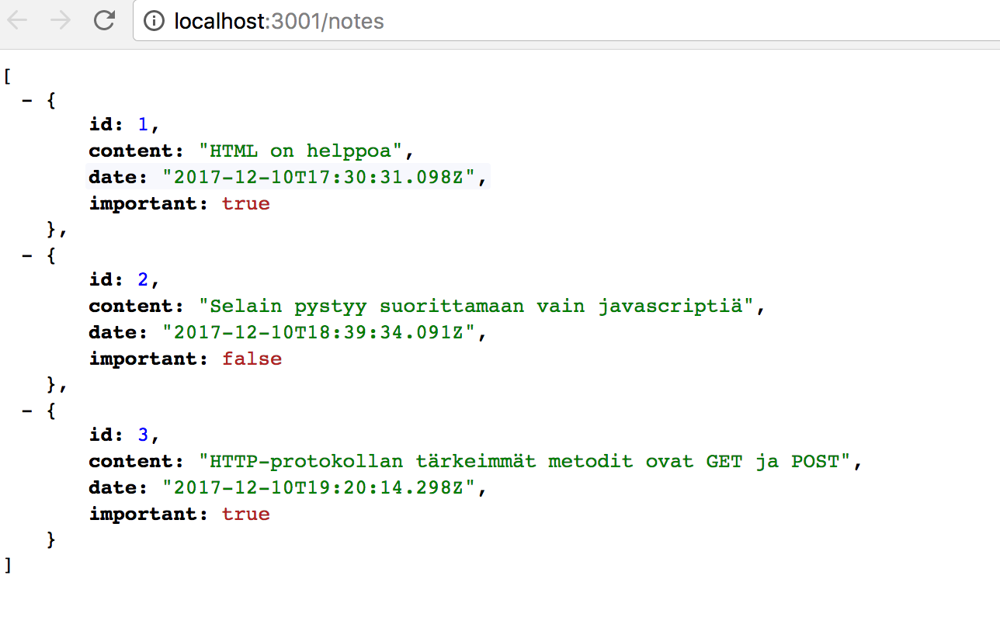
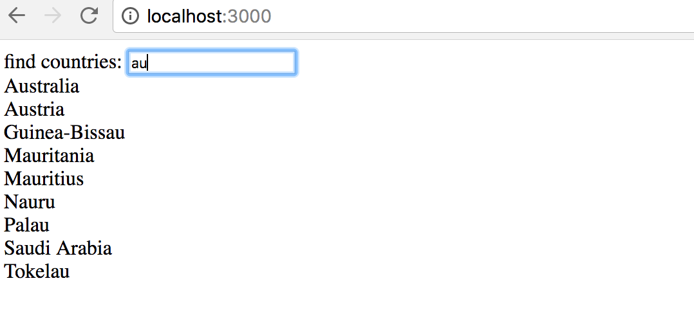
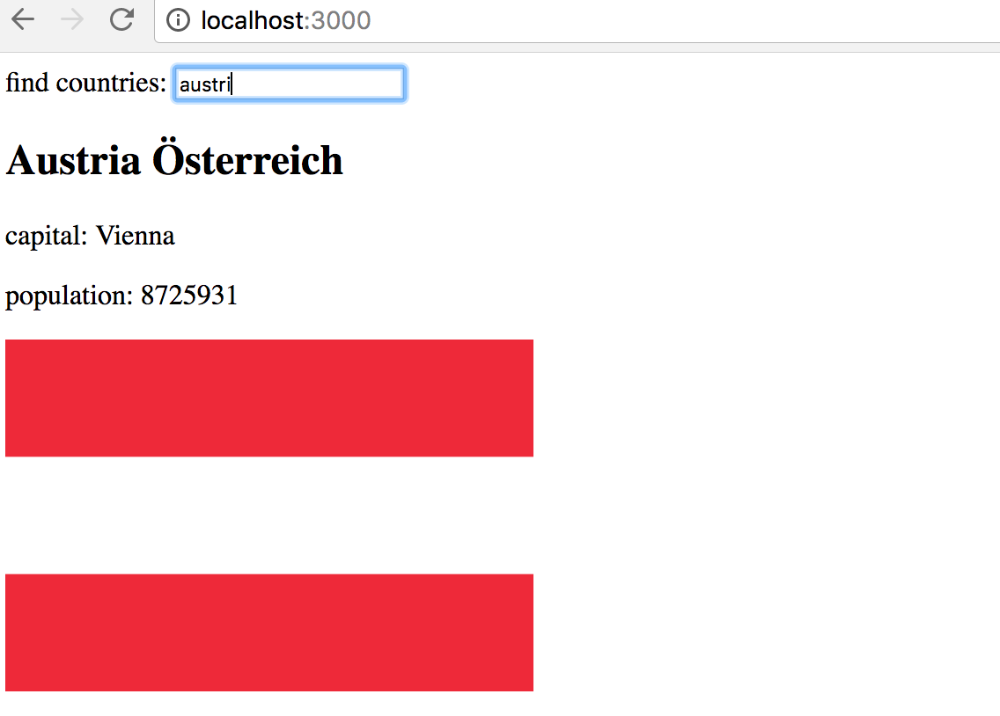

<div class="content">

## Datan haku palvelimelta

Olemme nyt viipyneet tovin keskittyen pelkkään "frontendiin", eli selainpuolen toiminnallisuuteen. Rupeamme itse toteuttamaan "backendin", eli palvelinpuolen toiminnallisuutta vasta kurssin kolmannessa osassa, mutta otamme nyt jo askeleen sinne suuntaan tutustumalla siihen miten selaimessa suoritettava koodi kommunikoi backendin kanssa.

Käytetään nyt palvelimena sovelluskehitykseen tarkoitettua [JSON Serveriä](https://github.com/typicode/json-server).

Tee projektin juurihakemistoon tiedosto _db.json_, jolla on seuraava sisältö:

```json
{
  "notes": [
    {
      "id": 1,
      "content": "HTML on helppoa",
      "date": "2017-12-10T17:30:31.098Z",
      "important": true
    },
    {
      "id": 2,
      "content": "Selain pystyy suorittamaan vain javascriptiä",
      "date": "2017-12-10T18:39:34.091Z",
      "important": false
    },
    {
      "id": 3,
      "content": "HTTP-protokollan tärkeimmät metodit ovat GET ja POST",
      "date": "2017-12-10T19:20:14.298Z",
      "important": true
    }
  ]
}
```

JSON server on mahdollista [asentaa](https://github.com/typicode/json-server#install) koneelle ns. globaalisti komennolla _npm install -g json-server_. Globaali asennus edellyttää kuitenkin pääkäyttäjän oikeuksia, eli se ei ole mahdollista laitoksen koneilla tai uusilla fuksiläppäreillä.

Globaali asennus ei kuitenkaan ole tarpeen, voimme käynnistää _json-serverin_ komennon _npx_ avulla:

```bash
npx json-server --port=3001 --watch db.json
```

Oletusarvoisesti _json-server_ käynnistyy porttiin 3000, mutta create-react-app:illa luodut projektit varaavat portin 3000, joten joudumme nyt määrittelemään json-server:ille vaihtoehtoisen portin 3001.

Mennään selaimella osoitteeseen <http://localhost:3001/notes>. Kuten huomaamme, _json-server_ tarjoaa osoitteessa tiedostoon tallentamamme muistiinpanot JSON-muodossa:



Ideana jatkossa onkin se, että muistiinpanot talletetaan palvelimelle, eli tässä vaiheessa _json-server_:ille. React-koodi lataa muistiinpanot palvelimelta ja renderöi ne ruudulle. Kun sovellukseen lisätään uusi muistiinpano, React-koodi lähettää sen myös palvelimelle, jotta uudet muistiinpanot jäävät pysyvästi "muistiin".

json-server tallettaa kaiken datan palvelimella sijaitsevaan tiedostoon _db.json_. Todellisuudessa data tullaan tallentamaan johonkin tietokantaan. json-server on kuitenkin käyttökelpoinen apuväline, joka mahdollistaa palvelinpuolen toiminnallisuuden käyttämisen kehitysvaiheessa ilman tarvetta itse ohjelmoida mitään.

Tutustumme palvelinpuolen toteuttamisen periaatteisiin tarkemmin kurssin [osassa 3](/osa3).

### Selain suoritusympäristönä

Ensimmäisenä tehtävänämme on siis hakea React-sovellukseen jo olemassaolevat mustiinpanot osoitteesta <http://localhost:3001/notes>.

Osan 0 [esimerkkiprojektissa](/osa0#selaimessa-suoritettava-sovelluslogiikka) nähtiin jo eräs tapa hakea Javascript-koodista palvelimella olevaa dataa. Esimerkin koodissa data haettiin [XMLHttpRequest](https://developer.mozilla.org/en-US/docs/Web/API/XMLHttpRequest)- eli XHR-olion avulla muodostetulla HTTP-pyynnöllä. Kyseessä on vuonna 1999 lanseerattu tekniikka, jota kaikki web-selaimet ovat jo pitkään tukeneet.

Nykyään XHR:ää ei kuitenkaan kannata käyttää ja selaimet tukevatkin jo laajasti [fetch](https://developer.mozilla.org/en-US/docs/Web/API/WindowOrWorkerGlobalScope/fetch)-metodia, joka perustuu XHR:n käyttämän tapahtumapohjaisen mallin sijaan ns. [promiseihin](https://developer.mozilla.org/en-US/docs/Web/JavaScript/Reference/Global_Objects/Promise).

Muistutuksena edellisestä osasta (oikeastaan tätä tapaa pitää lähinnä _muistaa olla käyttämättä_ ilman painavaa syytä), XHR:llä haettiin dataa seuraavasti

```js
const xhttp = new XMLHttpRequest();

xhttp.onreadystatechange = function() {
  if (this.readyState == 4 && this.status == 200) {
    const data = JSON.parse(this.responseText);
    // käsittele muuttujaan data sijoitettu kyselyn tulos
  }
};

xhttp.open('GET', '/data.json', true);
xhttp.send();
```

Heti alussa HTTP-pyyntöä vastaavalle _xhttp_-oliolle rekisteröidään _tapahtumankäsittelijä_, jota Javascript runtime kutsuu kun _xhttp_-olion tila muuttuu. Jos tilanmuutos tarkoittaa että pyynnön vastaus on saapunut, käsitellään data halutulla tavalla.

Huomionarvoista on se, että tapahtumankäsittelijän koodi on määritelty jo ennen kun itse pyyntö lähetetään palvelimelle. Tapahtumankäsittelijäfunktio tullaan kuitenkin suorittamaan vasta jossain myöhäisemmässä vaiheessa. Koodin suoritus ei siis etene synkronisesti "ylhäältä alas", vaan _asynkronisesti_, Javascript kutsuu sille rekisteröityä tapahtumankäsittelijäfunktiota jossain vaiheessa.

Esim. Java-ohjelmoinnista tuttu synkroninen tapa tehdä kyselyjä etenisi seuraavaan tapaan (huomaa että kyse ei ole oikeasti toimivasta Java-koodista):

```java
HTTPRequest request = new HTTPRequest()

String url = "https://fullstack-exampleapp.herokuapp.com/data.json";
List<Muistiinpano> muistiinpanot = request.get(url);

muistiinpanot.forEach(m => {
  System.out.println(m.content);
})
```

Javassa koodi etenee nyt rivi riviltä ja koodi pysähtyy odottamaan HTTP-pyynnön, eli komennon _request.get(...)_ valmistumista. Komennon palauttama data, eli muistiinpanot talletetaan muuttujaan ja dataa aletaan käsittelemään halutulla tavalla.

Javascript-enginet eli suoritusympäristöt kuitenkin noudattavat [asynkronista mallia](https://developer.mozilla.org/en-US/docs/Web/JavaScript/EventLoop), eli periaatteena on se, että kaikki [IO-operaatiot](https://en.wikipedia.org/wiki/Input/output) (poislukien muutama poikkeus) suoritetaan ei-blokkaavana, eli operaatioiden tulosta ei jäädä odottamaan vaan koodin suoritusta jatketaan heti eteenpäin.

Siinä vaiheessa kun operaatio valmistuu tai tarkemmin sanoen jonain valmistumisen jälkeisenä ajanhetkenä, kutsuu Javascript-engine operaatiolle rekisteröityjä tapahtumankäsittelijöitä.

Nykyisellään Javascript-moottorit ovat _yksisäikeisiä_ eli ne eivät voi suorittaa rinnakkaista koodia. Tämän takia on käytännössä pakko käyttää ei-blokkaavaa mallia IO-operaatioiden suorittamiseen, sillä muuten selain 'jäätyisi' siksi aikaa kun esim. palvelimelta haetaan dataa.

Javascript-moottoreiden yksisäikeisyydellä on myös sellainen seuraus, että jos koodin suoritus kestää erittäin pitkään, menee selain jumiin suorituksen ajaksi. Jos lisätään jonnekin kohtaa sovellustamme, esim. konstruktoriin seuraava koodi:

```js
setTimeout(() => {
  console.log('loop..');
  let i = 0;
  while (i < 50000000000) {
    i++;
  }
  console.log('end');
}, 5000);
```

Kaikki toimii 5 sekunnin ajan normaalisti. Kun _setTimeout_:in parametrina määritelty funktio suoritetaan, menee selaimen sivu jumiin pitkän loopin suorituksen ajaksi. Ainakaan Chromessa selaimen tabia ei pysty edes sulkemaan luupin suorituksen aikana.

Eli jotta selain säilyy _responsiivisena_, eli että se reagoi koko ajan riittävän nopeasti käyttäjän haluamiin toimenpiteisiin, koodin logiikan tulee olla sellainen, että yksittäinen laskenta ei saa kestää liian kauaa.

Aiheesta löytyy paljon lisämateriaalia internetistä, eräs varsin havainnollinen esitys aiheesta Philip Robertsin esitelmä [What the heck is the event loop anyway?](https://www.youtube.com/watch?v=8aGhZQkoFbQ)

Nykyään selaimissa on mahdollisuus suorittaa myös rinnakkaista koodia ns. [web workerien](https://developer.mozilla.org/en-US/docs/Web/API/Web_Workers_API/Using_web_workers) avulla. Yksittäisen selainikkunan koodin ns. event loopista huolehtii kuitenkin edelleen [vain yksi säie](https://medium.com/techtrument/multithreading-javascript-46156179cf9a).

## npm

Palaamme jälleen asiaan, eli datan hakemiseen palvelimelta.

Voisimme käyttää datan palvelimelta hakemiseen aiemmin mainittua promiseihin perustuvaa funktiota [fetch](https://developer.mozilla.org/en-US/docs/Web/API/WindowOrWorkerGlobalScope/fetch). Fetch on hyvä työkalu, se on standardoitu ja kaikkien modernien selaimien (poislukien IE) tukema.

Käytetään selaimen ja palvelimen väliseen kommunikaatioon kuitenkin [axios](https://github.com/axios/axios)-kirjastoa, joka toimii samaan tapaan kuin fetch, mutta on hieman mukavampikäyttöinen. Hyvä syy axios:in käytölle on myös se, että pääsemme tutustumaan siihen miten ulkopuolisia kirjastoja eli _npm-paketteja_ liitetään React-projektiin.

Nykyään lähes kaikki Javascript-projektit määritellään node "pakkausmanagerin" eli [npm](https://docs.npmjs.com/getting-started/what-is-npm):n avulla. Myös create-react-app:in avulla generoidut projektit ovat npm-muotoisia projekteja. Varma tuntomerkki siitä on projektin juuressa oleva tiedosto _package.json_:

```json
{
  "name": "osa2",
  "version": "0.1.0",
  "private": true,
  "dependencies": {
    "react": "^16.2.0",
    "react-dom": "^16.2.0",
    "react-scripts": "1.0.17"
  },
  "scripts": {
    "start": "react-scripts start",
    "build": "react-scripts build",
    "test": "react-scripts test --env=jsdom",
    "eject": "react-scripts eject"
  }
}
```

Tässä vaiheessa meitä kiinnostaa osa _dependencies_, joka määrittelee mitä _riippuvuuksia_ eli ulkoisia kirjastoja projektilla on.

Haluamme nyt käyttöömme axioksen. Voisimme määritellä kirjaston suoraan tiedostoon _package.json_, mutta on parempi asentaa se komentoriviltä

```bash
npm install axios --save
```

**Huomaa, että _npm_-komennot tulee antaa aina projektin juurihakemistossa**, eli siinä minkä sisältä tiedosto _package.json_ löytyy.

Nyt axios on mukana riippuvuuksien joukossa:

```json
{
  "dependencies": {
    "axios": "^0.17.1",
    "react": "^16.2.0",
    "react-dom": "^16.2.0",
    "react-scripts": "1.0.17"
  }
  /*...*/
}
```

Sen lisäksi, että komento _npm install_ lisäsi axiosin riippuvuuksien joukkoon, se myös _latasi_ kirjaston koodin. Koodi löytyy muiden riippuvuuksien tapaan projektin juuren hakemistosta _node_modules_, mikä kuten huomata saattaa sisältääkin runsaasti kaikenlaista.

Tehdään toinenkin pieni lisäys. Asennetaan myös _json-server_ projektin riippuvuudeksi komennolla

```bash
npm install json-server --save
```

ja lisätään tiedoston _package.json_ osaan _scripts_ rivi

```bash
"server": "json-server -p3001 db.json"
```

eli muutetaan se muotoon

```json
{
  /*...*/
  "scripts": {
    "start": "react-scripts start",
    "build": "react-scripts build",
    "test": "react-scripts test --env=jsdom",
    "eject": "react-scripts eject",
    "server": "json-server -p3001 db.json"
  }
}
```

Nyt voimme käynnistää (muista sammuttaa aiemmin käynnistämäsi!) json-serverin projektin hakemistosta mukavasti ilman tarvetta parametrien määrittelylle komennolla

```bash
npm run server
```

Tutustumme npm:n tarkemmin kurssin [kolmannessa osassa](/osa3).

### Axios ja promiset

Olemme nyt valmiina käyttämään axiosia. Jatkossa oletetaan että _json-server_ on käynnissä portissa 3001.

Kirjaston voi ottaa käyttöön samaan tapaan kuin esim. React otetaan käyttöön, eli sopivalla _import_-lauseella.

Lisätään seuraava tiedostoon _index.js_

```js
import axios from 'axios';

const promise = axios.get('http://localhost:3001/notes');
console.log(promise);

const promise2 = axios.get('http://localhost:3001/foobar');
console.log(promise2);
```

Konsoliin tulostuu seuraavaa


Axiosin metodi _get_ palauttaa [promisen](https://developer.mozilla.org/en-US/docs/Web/JavaScript/Guide/Using_promises).

Mozillan dokumentaatio sanoo promisesta seuraavaa:

> A Promise is an object representing the eventual completion or failure of an asynchronous operation.

Promise siis edustaa asynkronista operaatiota. Promise voi olla kolmessa eri tilassa:

- aluksi promise on _pending_, eli promisea vastaava asynkroninen operaatio ei ole vielä tapahtunut
- jos operaatio päättyy onnistuneesti, menee promise tilaan _fulfilled_, josta joskus käytetään nimitystä _resolved_
- kolmas mahdollinen tila on _rejected_, joka edustaa epäonnistunutta operaatiota

Esimerkkimme ensimmäinen promise on _fulfilled_, eli vastaa onnistunutta _axios.get('http://localhost:3001/notes')_ pyyntöä. Promiseista toinen taas on _rejected_, syy selviää konsolista, eli yritettiin tehdä HTTP GET -pyyntöä osoitteeseen, jota ei ole olemassa.

Jos ja kun haluamme tietoon promisea vastaavan operaation tuloksen, tulee promiselle rekisteröidä tapahtumankuuntelija. Tämä tapahtuu metodilla _then_:

```js
const promise = axios.get('http://localhost:3001/notes');

promise.then(response => {
  console.log(response);
});
```

Konsoliin tulostuu seuraavaa


Javascriptin suoritusympäristö kutsuu _then_-metodin avulla rekisteröityä takaisinkutsufunktiota antaen sille parametriksi olion _result_, joka sisältää kaiken oleellisen HTTP GET -pyynnön vastaukseen liittyvän, eli palautetun _datan_, _statuskoodin_ ja _headerit_.

Promise-olioa ei ole yleensä tarvetta tallettaa muuttujaan, ja onkin tapana ketjuttaa metodin _then_ kutsu suoraan axiosin metodin kutsun perään:

```js
axios.get('http://localhost:3001/notes').then(response => {
  const notes = response.data;
  console.log(notes);
});
```

Takaisinkutsufunktio ottaa nyt vastauksen sisällä olevan datan muuttujaan ja tulostaa muistiinpanot konsoliin.

Luettavampi tapa formatoida _ketjutettuja_ metodikutsuja on sijoittaa jokainen kutsu omalle rivilleen:

```js
axios.get('http://localhost:3001/notes').then(response => {
  const notes = response.data;
  console.log(notes);
});
```

näin jo nopea, ruudun vasempaan laitaan kohdistunut vilkaisu kertoo mistä on kyse.

Palvelimen palauttama data on pelkkää tekstiä, käytännössä yksi iso merkkijono. Asian voi todeta, esim. tekemällä HTTP-pyyntö komentoriviltä [curl](https://curl.haxx.se):illa


Axios-kirjasto osaa kuitenkin parsia datan Javascript-taulukoksi, sillä palvelin on kertonut headerin _content-type_ avulla että datan muoto on _application/json; charset=utf-8_ (ks ylempi kuva).

Voimme vihdoin siirtyä käyttämään sovelluksessamme palvelimelta haettavaa dataa.

Tehdään se aluksi "huonosti", eli lisätään sovellusta vastaavan komponentin _App_ renderöinti takaisinkutsufunktion sisälle muuttamalla _index.js_ seuraavaan muotoon:

```react
import ReactDOM from 'react-dom'
import React from 'react'
import App from './App'

import axios from 'axios'

axios.get('http://localhost:3001/notes').then(response => {
  const notes = response.data
  ReactDOM.render(
    <App notes={notes} />,
    document.getElementById('root')
  )
})
```

Joissain tilanteissa tämäkin tapa voisi olla ok, mutta se on hieman ongelmallinen ja päätetäänkin siirtää datan hakeminen komponenttiin _App_.

Ei ole kuitenkaan ihan selvää, mihin kohtaan komponentin koodia komento _axios.get_ olisi hyvä sijoittaa.

### Komponenttien lifecycle-metodit

Reactin luokkien avulla määritellyillä komponenteilla voidaan määritellä joukko [lifecycle](https://reactjs.org/docs/state-and-lifecycle.html#adding-lifecycle-methods-to-a-class)-metodeita, eli metodeita, joita React kutsuu tietyssä komponentin "elinkaaren" vaiheessa.

Yleinen tapa datan palvelimelta tapahtuvaan hakemiseen on suorittaa se metodissa [componentDidMount](https://reactjs.org/docs/react-component.html#componentdidmount). React kutsuu metodia sen jälkeen kun konstruktori on suoritettu ja _render_-metodi on suoritettu ensimmäistä kertaa.

Muutetaan sovellusta nyt seuraavasti.

Poistetaan datan hakeminen tiedostosta _index.js_:

```js
ReactDOM.render(<App />, document.getElementById('root'));
```

Komponentille _App_ ei ole enää tarvetta välittää dataa propseina.

Komponentti _App_ muuttuu seuraavasti:

```react
import React from 'react'
import axios from 'axios'

class App extends React.Component {
  constructor(props) {
    super(props)
    this.state = {
      notes: [],
      newNote: '',
      showAll: true
    }
    console.log('constructor')
  }

  componentDidMount() {
    console.log('did mount')
    axios
      .get('http://localhost:3001/notes')
      .then(response => {
        console.log('promise fulfilled')
        this.setState({ notes: response.data })
      })
  }

  render() {
    console.log('render')
    // ...
  }
}
```

Eli konstruktorissa asetetaan tilan _notes_ kentäksi tyhjä taulukko. Lifecycle-metodi _componentDidMount_ hakee datan axiosin avulla ja rekisteröi takaisinkutsufunktion, joka promisen valmistumisen (_fulfillment_) yhteydessä päivittää komponentin tilan asettamalla palvelimen palauttamat muistiinpanot tilan kentän _notes_ arvoksi.

Koodiin on myös lisätty muutama aputulostus, jotka auttavat hahmottamaan miten suoritus etenee.

Konsoliin tulostuu

<pre>
constructor
render
did mount
promise fulfilled
render
</pre>

Ensin siis suoritetaan konstruktori ja metodi _render_, ja sen jälkeen metodi _componentDidMount_. Tämän jälkeen kutsutaan kuitenkin vielä metodia _render_; miksi näin?

Metodissa _componentDidMount_ suoritetaan axiosin avulla HTTP GET -pyyntö ja samalla _rekisteröidään_ pyynnön palauttamalle promiselle tapahtumankäsittelijä:

```js
axios.get('http://localhost:3001/notes').then(response => {
  console.log('promise fulfilled');
  this.setState({ notes: response.data });
});
```

Tapahtumankäsittelijän koodia, eli then:in parametrina olevaa _funktiota_ ei siis suoriteta vielä tässä vaiheessa. Javascriptin runtime kutsuu sitä jossain vaiheessa sen jälkeen kun palvelin on vastannut HTTP GET -pyyntöön.

Kun kutsutaan metodia _render_ ensimmäistä kertaa (heti konstruktorin jälkeen) komponentti _App_ piirtyy ruudulle aluksi siten, että yhtään muistiinpanoa ei näytetä. Emme kuitenkaan ehdi huomaamaan asiaa, sillä palvelimen vastaus tulee pian, ja se taas saa aikaan tapahtumankäsittelijän suorituksen. Tapahtumankäsittelijä päivittää komponentin tilaa kutsumalla _setState_ ja tämä saa aikaan komponentin uudelleenrenderöinnin.

Mieti tarkasti äsken läpikäytyä tapahtumasarjaa, sen ymmärtäminen on erittäin tärkeää!

Huomaa, että olisimme voineet kirjoittaa koodin myös seuraavasti:

```js
const eventHandler = response => {
  console.log('promise fulfilled');
  this.setState({ notes: response.data });
};

const promise = axios.get('http://localhost:3001/notes');

promise.then(eventHandler);
```

Muuttujaan _eventHandler_ on sijoitettu viite funktioon. Axiosin metodin get palauttama promise on talletettu muuttujaan _promise_. Takaisinkutsun rekisteröinti tapahtuu antamalla promisen then-metodin parametrina muuttuja _eventHandler_, joka viittaa käsittelijäfunktioon.

React-komponenteilla on myös joukko muita [lifecycle-metodeja](https://reactjs.org/docs/react-component.html), palaamme niihin myöhemmin.

Kokeillaan mitä tapahtuu, jos muistiinpanojen tallettavaa kenttää _notes_ ei alusteta konstruktorissa:

```js
class App extends React.Component {
  constructor() {
    super();
    this.state = {
      //notes: [],
      newNote: '',
      showAll: true,
    };
  }

  // ...
}
```

Seurauksena on ongelmia:


Virheen aiheuttaa komento _notesToShow.map_ sillä muuttujan _notesToShow_ arvo ei ole määritelty ja näin ollen metodin _map_ kutsuminen on mahdotonta.

Muuttuja saa arvonsa metodin _render_ alkuosassa:

```
const notesToShow =
  this.state.showAll ?
    this.state.notes :
    this.state.notes.filter(note => note.important === true)
```

Koska metodia _render_ kutsutaan ensimmäisen kerran _ennen kuin palvelimelta haettava data saapuu_, ei tilan kentälle _notes_ ole asetettu mitään arvoa.

Tulet 100% varmuudella törmäämään kurssilla vastaavaan ongelmaan, eli _render_ metodissa on jollain tavalla aina varauduttava siihen, että ensimmäinen renderöitymiskerta tapahtuu ennen kuin palvelimelta haettava data on saapunut.

Palautetaan konstruktori ennalleen.

Sovelluksen tämän hetkinen koodi on kokonaisuudessaan [githubissa](https://github.com/FullStack-HY/part2-notes/tree/part2-4), tagissa _part2-4_.

</div>

<div class="tasks">

<h3>Tehtävät 2.11</h3>
<h4>puhelinluettelo osa 6</h4>

Talleta sovelluksen alkutila projektin juureen sijoitettavaan tiedostoon _db.json_:

```json
{
  "persons": [
    {
      "name": "Arto Hellas",
      "number": "040-123456",
      "id": 1
    },
    {
      "name": "Martti Tienari",
      "number": "040-123456",
      "id": 2
    },
    {
      "name": "Arto Järvinen",
      "number": "040-123456",
      "id": 3
    },
    {
      "name": "Lea Kutvonen",
      "number": "040-123456",
      "id": 4
    }
  ]
}
```

Käynnistä json-server porttiin 3001 ja varmista selaimella osoitteesta <http://localhost:3001/persons>, että palvelin palauttaa henkilölistan.

Jos saat virheilmoituksen:

```bash
events.js:182
      throw er; // Unhandled 'error' event
      ^

Error: listen EADDRINUSE 0.0.0.0:3001
    at Object._errnoException (util.js:1019:11)
    at _exceptionWithHostPort (util.js:1041:20)
```

on portti 3001 jo jonkin muun sovelluksen, esim. jo käynnissä olevan json-serverin käytössä. Sulje toinen sovellus tai jos se ei onnistu, vaihda porttia.

Muuta sovellusta siten, että datan alkutila haetaan _axios_-kirjaston avulla palvelimelta. Hoida datan hakeminen [lifecyclemetodissa](/osa2#komponenttien-lifecycle-metodit) _componentDidMount_.

<h3>Tehtävät 2.12*</h3>
<h4>maiden tiedot</h4>

Rajapinta [https://restcountries.eu](https://restcountries.eu) tarjoaa paljon eri maihin liittyvää tietoa koneluettavassa muodossa REST-apina.

Tee sovellus, jonka avulla voit tarkastella eri maiden tietoja. Sovelluksen kannattaa hakea tiedot endpointista [all](https://restcountries.eu/#api-endpoints-all).

Sovelluksen käyttöliittymä on yksinkertainen. Näytettävä maa haetaan kirjoittamalla hakuehto etsintäkenttään.

Jos ehdon täyttäviä maita on liikaa (yli 10), kehoitetaan tarkentamaan hakuehtoa:


Jos maita on alle kymmenen, mutta yli 1 näytetään hakuehdon täyttävät maat:



Kun ehdon täyttäviä maita on enää yksi, näytetään maan lippu sekä perustiedot:



**Huom:** riittää että sovelluksesi toimii suurimmalle osalle maista. Jotkut maat kuten _Sudan_ voivat tuottaa ongelmia, sillä maan nimi on toisen maan _South Sudan_ osa. Näistä corner caseista ei tarvitse välittää.

<h3>Tehtävät 2.13*</h3>
<h4>puhelinluettelo osa 4</h4>

**Älä juutu tähän tehtävään!**

Paranna edellisen tehtävän maasovellusta siten, että kun sivulla näkyy useiden maiden nimiä, riittää maan nimen klikkaaminen tarkentamaan haun siten, että klikatun maan tarkemmat tiedot saadaan näkyviin.

Huomaa, että saat "nimestä" klikattavan kiinnittämällä nimen sisältävään elementtiin, esim. diviin klikkaustenkuuntelijan:

```
<div onClick={...}>
  {country.name}
</div>
```

</div>
