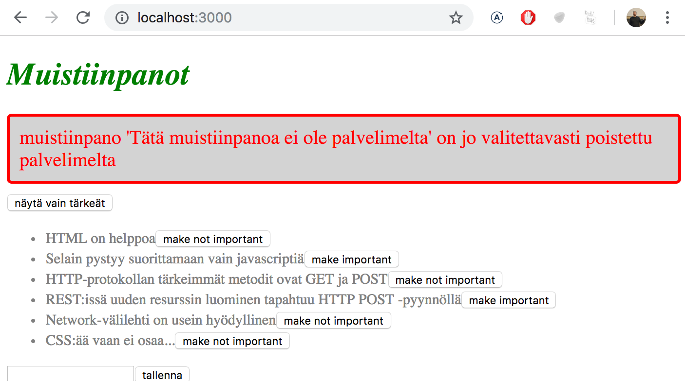
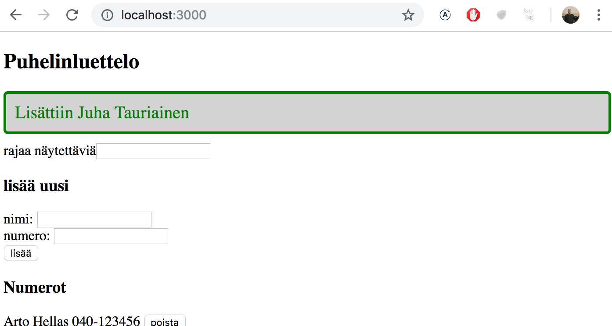
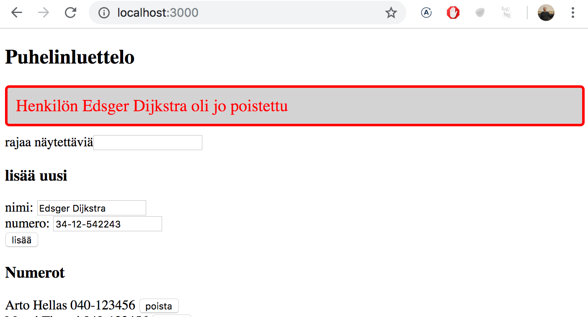

<div class="content">

Sovelluksemme ulkoasu on tällä hetkellä hyvin vaatimaton. Osaan 0 liittyvässä [tehtävässä 0.2](http://localhost:8000/osa0/web_sovelluksen_toimintaperiaatteita#tehtavia) oli tarkoitus tutustua Mozillan [CSS-tutoriaaliin](https://developer.mozilla.org/en-US/docs/Learn/Getting_started_with_the_web/CSS_basics).

Katsotaan vielä tämän osan lopussa nopeasti kahta tapaa liittää tyylejä React-sovellukseen. Tapoja on useita ja tulemme tarkastelemaan muita myöhemmin. Liitämme ensin CSS:n sovellukseemme vanhan kansan tapaan yksittäisenä, käsin eli ilman [esiprosessorien](https://developer.mozilla.org/en-US/docs/Glossary/CSS_preprocessor) apua kirjoitettuna tiedostona (tämä ei itseasiassa ole täysin totta, kuten myöhemmin tulemme huomaamaan).

Tehdään sovelluksen hakemistoon <i>src</i> tiedosto <i>index.css</i> ja liitetään se sovellukseen lisäämällä tiedostoon <i>index.js</i> seuraava import:

```js
import './index.css'
```

Lisätään seuraava sääntö tiedostoon <i>index.css</i>:

```css
h1 {
  color: green;
}
```

CSS-säännöt koostuvat valitsimesta, eli <i>selektorista</i> ja määrittelystä eli <i>deklaraatiosta</i>. Valitsin määrittelee, mihin elementteihin sääntö kohdistuu. Valitsimena on nyt <i>h1</i>, eli kaikki sovelluksessa käytetyt <i>h1</i>-otsikkotägit.

Määrittelyosa asettaa ominaisuuden _color_, eli fontin värin arvoksi vihreän, eli <i>green</i>.

Sääntö voi sisältää mielivaltaisen määrän määrittelyjä. Muutetaan edellistä siten, että tekstistä tulee kursivoitua, eli fontin tyyliksi asetetaan <i>italics</i>:

```css
h1 {
  color: green;
  font-style: italic;  // highlight-line
}
```

Erilaisia selektoreja eli tapoja valita tyylien kohde on [lukuisia](https://developer.mozilla.org/en-US/docs/Web/CSS/CSS_Selectors).

Jos haluamme kohdistaa tyylejä esim. jokaiseen muistiinpanoon, voisimme nyt käyttää selektoria <i>li</i>, sillä muistiinpanot ovat <i>li</i>-tagien sisällä:

```js
const Note = ({ note, toggleImportance }) => {
  const label = note.important 
    ? 'make not important' 
    : 'make important';

  return (
    <li>
      {note.content} 
      <button onClick={toggleImportance}>{label}</button>
    </li>
  )
}
```

lisätään tyylitiedostoon seuraava (koska osaamiseni tyylikkäiden web-sivujen tekemiseen on lähellä nollaa, nyt käytettävissä tyyleissä ei ole sinänsä mitään järkeä):

```css
li {
  color: grey;
  padding-top: 3px;
  font-size: 15px;
}
```

Tyylien kohdistaminen elementtityypin sijaan on kuitenkin hieman ongelmallista, jos sovelluksessa olisi myös muita  <i>li</i>-tageja, kaikki saisivat samat tyylit.

Jos haluamme kohdistaa tyylit nimenomaan muistiinpanoihin, on parempi käyttää [class selectoreja](https://developer.mozilla.org/en-US/docs/Web/CSS/Class_selectors).

Normaalissa HTML:ssä luokat määritellään elementtien attribuutin  <i>class</i> arvona:

```html
<li class="note">tekstiä</li>
```

Reactissa tulee kuitenkin classin sijaan käyttää attribuuttia [className](https://reactjs.org/docs/dom-elements.html#classname), eli muutetaan komponenttia <i>Note</i> seuraavasti:

```js
const Note = ({ note, toggleImportance }) => {
  const label = note.important 
    ? 'make not important' 
    : 'make important';

  return (
    <li className='note'> // highlight-line
      {note.content} 
      <button onClick={toggleImportance}>{label}</button>
    </li>
  )
}
```

Luokkaselektori määritellään syntaksilla _.classname_, eli:

```css
.note {
  color: grey;
  padding-top: 5px;
  font-size: 15px;
}
```

Jos nyt lisäät sovellukseen muita li-elementtejä, ne eivät saa muistiinpanoille määriteltyjä tyylejä.

### Parempi virheilmoitus

Toteutimme äsken olemassaolemattoman muistiinpanon tärkeyden muutokseen liittyvän virheilmoituksen <em>alert</em>-metodilla. Toteutetaan se nyt Reactilla omana komponenttinaan.

Komponentti on yksinkertainen:

```js
const Notification = ({ message }) => {
  if (message === null) {
    return null
  }

  return (
    <div className="error">
      {message}
    </div>
  )
}
```

Jos propsin <em>message</em> arvo on <em>null</em> ei renderöidä mitään, muussa tapauksessa renderöidään viesti div-elementtiin. Elementille on liitetty tyylien lisäämistä varten luokka <i>error</i>.

Lisätään komponentin <i>App</i> tilaan kenttä <i>error</i> virheviestiä varten, laitetaan kentälle heti jotain sisältöä, jotta pääsemme heti testaamaan komponenttia:

```js
const App = () => {
  const [notes, setNotes] = useState([]) 
  const [newNote, setNewNote] = useState('')
  const [showAll, setShowAll] = useState(true)
  const [errorMessage, setErrorMessage] = useState('virhe...') // highlight-line

  // ...

  return (
    <div>
      <h1>Muistiinpanot</h1>

      <Notification message={errorMessage} /> // highlight-line
      
      <div>
        <button onClick={() => setShowAll(!showAll)}>
          näytä {showAll ? 'vain tärkeät' : 'kaikki'}
        </button>
      </div>
      <ul>
        {rows()}
      </ul>

      <form onSubmit={addNote}>
        <input
          value={newNote}
          onChange={handleNoteChange}
        />
        <button type="submit">tallenna</button>
      </form>      
    </div>
  )
}
```

Lisätään sitten virheviestille sopiva tyyli:

```css
.error {
  color: red;
  background: lightgrey;
  font-size: 20px;
  border-style: solid;
  border-radius: 5px;
  padding: 10px;
  margin-bottom: 10px;
}
```

Nyt olemme valmiina lisäämään virheviestin logiikan. Muutetaan metodia <em>toggleImportanceOf</em> seuraavasti:

```js
  const toggleImportanceOf = id => {
    const note = notes.find(n => n.id === id)
    const changedNote = { ...note, important: !note.important }

    noteService
      .update(changedNote).then(returnedNote => {
        setNotes(notes.map(note => note.id !== id ? note : returnedNote))
      })
      .catch(error => {
        // highlight-start
        setErrorMessage(
          `muistiinpano '${note.content}' poistettu palvelimelta`
        )
        setTimeout(() => {
          setErrorMessage(null)
        }, 5000)
        // highlight-end
        setNotes(notes.filter(n => n.id !== id))
      })
  }
```

Eli virheen yhteydessä asetetaan tilaan <em>errorMessage</em> sopiva virheviesti. Samalla käynnistetään ajastin, joka asettaa 5 sekunnin kuluttua tilan <em>errorMessage</em>-kentän arvoksi <em>null</em>.

Lopputulos näyttää seuraavalta



Sovelluksen tämänhetkinen koodi on kokonaisuudessaan [githubissa](https://github.com/FullStack-HY/part2-notes/tree/part2-7), branchissa <i>part2-7</i>.

### Inline-tyylit

React mahdollistaa myös tyylien kirjoittamisen suoraan komponenttien koodin joukkoon niin sanoittuina [inline-tyyleinä](https://react-cn.github.io/react/tips/inline-styles.html).

Periaate inline-tyylien määrittelyssä on erittäin yksinkertainen. Mihin tahansa React-komponenttiin tai elementtiin voi liittää attribuutin [style](https://reactjs.org/docs/dom-elements.html#style), jolle annetaan arvoksi Javascript-oliona määritelty joukko CSS-sääntöjä.

CSS-säännöt määritellään JAvascriptin avulla hieman eri tavalla kuin normaaleissa CSS-tiedostoissa. Jos haluamme esimerkisi asettaa jollekin elementille vihreän, kursivoidun ja 16 pikselin korkuisen fontin, eli CSS-syntaksilla ilmaistuna

```css
{
  color: green;
  font-style: italic;
  font-size: 16px;
}
```

tulee tämä muotilla Reactin inline-tyylin määrittelevänä oliona seuraavasti

```js
 {
  color: 'green',
  fontStyle: 'italic',
  fontSize: 16
}
```

Jokainen CSS-sääntö on olion kenttä, joten ne erotetaan Javascript-syntaksin mukaan pilkuilla. Pikseleinä ilmaistut numeroarvot voidaan määritellä kokonaislukuina. Merkittävin ero normaaliin CSS:ään on väliviivan sisältämien CSS-ominaisuuksien kirjoittaminen camelCase-muodossa.

Voisimme nyt lisätä sovelluksemme "alapalkin", muodostavan komponentin <i>Footer</i>, ja määritellä sille inline-tyylit seuraavasti:

```js
const Footer = () => {
  const footerStyle = {
    color: 'green',
    fontStyle: 'italic',
    fontSize: 16
  }

  return (
    <div style={footerStyle}>
      <br />
      <em>Note app, Department of Computer Science 2019</em>
    </div> 
  )
}

const App = () => {
  // ...

  return (
    <div>
      <h1>Muistiinpanot</h1>

      <Notification message={errorMessage} />

      // ...  

      <Footer /> // highlight-line
    </div>
  )
}
```

Inline-tyyleillä on tiettyjä rajoituksia, esim. ns. pseudo-selektoreja ei ole mahdollisuutta käyttää (ainakaan helposti).

Inline-tyylit ja muutamat myöhemmin kurssilla katsomamme tavat lisätä tyylejä Reactiin ovat periaatteessa täysin vastoin vanhoja hyviä periaatteita, joiden mukaan Web-sovellusten ulkoasujen määrittely eli CSS tulee erottaa sisällön (HTML) ja toiminnallisuuden (Javascript) määrittelystä. Vanha koulukunta pyrkiikin siihen että sovelluksen CSS, HTML ja Javascript on kaikki kirjoitettu omiin tiedostoihinsa.

Itseasiassa Reactin filosofia on täysin päinvastainen. Koska CSS:n, HTML:n ja Javascriptin erottelu eri tiedostoihin ei ole kuitenkaan osoittautunut erityisen skaalautuvaksi ratkaisuksi suurissa järjestelmissä, on Reactissa periaatteena tehdä erottelu (eli jakaa sovelluksen koodi eri tiedostoihin) noudattaen sovelluksen loogisia toiminnallisia kokonaisuuksia.

Toiminnallisen kokonaisuuden strukturointiyksikkö on React-komponentti, joka määrittelee niin sisällön rakenteen kuvaavan HTML:n, toiminnan määrittelevät Javascript-funktiot kuin komponentin tyylinkin yhdessä paikassa, siten että komponenteista tulee mahdollisimman riippumattomia ja yleiskäyttöisiä.

</div>

<div class="tasks">

<h3>Tehtäviä</h3>

<h4>2.19: puhelinluettelo osa 11</h4>

Toteuta osan 2 esimerkin [parempi virheilmoitus](/osa2/tyylien_lisaaminen_react_sovellukseen#parempi-virheilmoitus) tyyliin ruudulla muutaman sekunnin näkyvä ilmoitus, joka kertoo onnistuneista operaatioista (henkilön lisäys ja poisto, sekä numeron muutos):



<h4>2.20*: puhelinluettelo osa 12</h4>

Avaa sovelluksesi kahteen selaimeen. **Jos poistat jonkun henkilön toisesta selaimesta 1** hieman ennen kun yrität <i>muuttaa henkilön numeroa</i> selaimesta 2, tapahtuu virhetilanne:


Korjaa ongelma osan 2 esimerkin [promise ja virheet](http://localhost:8000/osa2/palvelimella_olevan_datan_muokkaaminen#promise-ja-virheet) hengessä, mutta siten että 
 käyttäjälle ilmoitetaan operaation epäonnistumisesta. Onnistuneen ja epäonnistuneen operaation ilmoitusten tulee erota toisistaan: 



Tämä oli osan viimeinen tehtävä ja on aika pushata koodi githubiin merkata tehdyt tehtävät [palautussovellukseen](https://studies.cs.helsinki.fi/courses/#fullstack2019).

</div>
