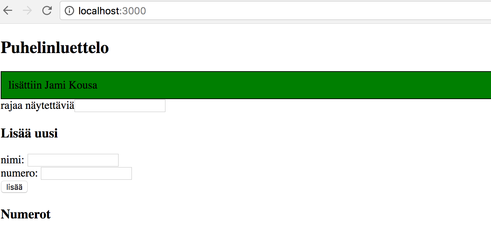
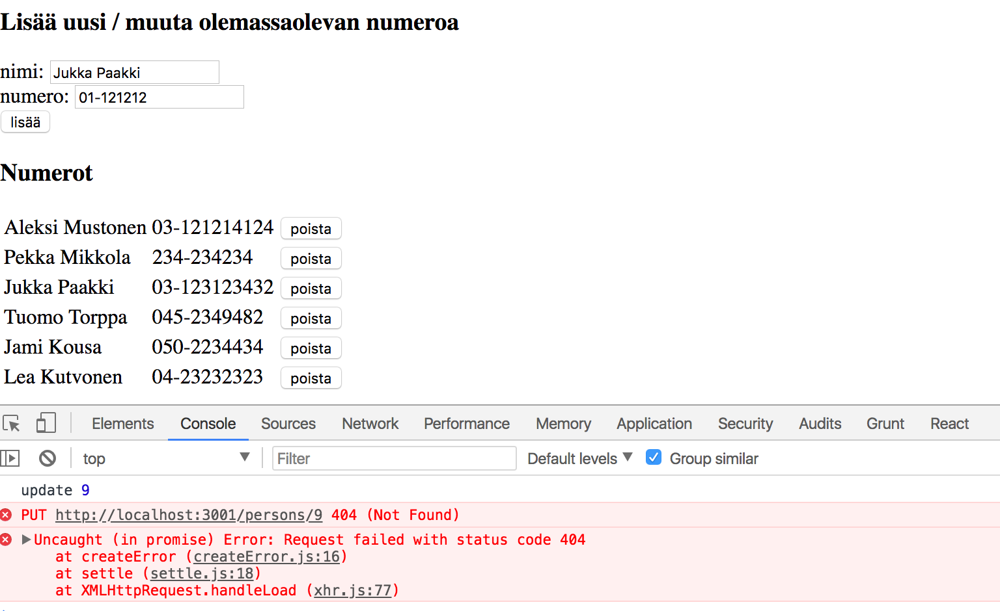

<div class="content">

## Tyylien lisääminen

Sovelluksemme ulkoasu on tällä hetkellä hyvin vaatimaton. Osaan 0 liittyvässä [tehtävässä 0.1](/tehtävät/#web-sovellusten-perusteet) oli tarkoitus tutustua Mozillan [CSS-tutoriaaliin](https://developer.mozilla.org/en-US/docs/Learn/Getting_started_with_the_web/CSS_basics).

Katsotaan vielä tämän osan lopussa nopeasti erästä tapaa liittää tyylejä React-sovellukseen. Tapoja on useita ja tulemme tarkastelemaan muita myöhemmin. Liitämme nyt CSS:n sovellukseemme vanhan kansan tapaan yksittäisenä, käsin eli ilman [esiprosessorien](https://developer.mozilla.org/en-US/docs/Glossary/CSS_preprocessor) apua kirjoitettuna tiedostona (tämä ei itseasiassa ole täysin totta, kuten myöhemmin tulemme huomaamaan).

Tehdään sovelluksen hakemistoon _src_ tiedosto _index.css_ ja liitetään se sovellukseen lisäämällä tiedostoon _index.js_ seuraava import:

```js
import './index.css';
```

Lisätään seuraava sääntö tiedostoon _index.css_:

```css
h1 {
  color: green;
}
```

CSS-säännöt koostuvat valitsimesta, eli _selektorista_ ja määrittelystä eli _deklaraatiosta_. Valitsin määrittelee, mihin elementteihin sääntö kohdistuu. Valitsimena on nyt _h1_, eli kaikki sovelluksessa käytetyt _h1_-otsikkotägit.

Määrittelyosa asettaa ominaisuuden _color_, eli fontin värin arvoksi vihreän, eli _green_.

Sääntö voi sisältää mielivaltaisen määrän määrittelyjä. Muutetaan edellistä siten, että tekstistä tulee kursivoitua, eli fontin tyyliksi asetetaan _italics_:

```css
h1 {
  color: green;
  font-style: italic;
}
```

Erilaisia selektoreja eli tapoja valita tyylien kohde on [lukuisia](https://developer.mozilla.org/en-US/docs/Web/CSS/CSS_Selectors).

Jos haluamme kohdistaa tyylejä esim. jokaiseen muistiinpanoon, voisimme nyt käyttää selektoria _li_, sillä muistiinpanot ovat _li_-tagien sisällä:

```react
const Note = ({ note, toggleImportance}) => {
  const label = note.important ? 'make not important' : 'make important'
  return (
    <li>{note.content} <button onClick={toggleImportance}>{label}</button></li>
  )
}
```

lisätään tyylitiedostoon seuraava (koska osaamiseni tyylikkäiden web-sivujen tekemiseen on lähellä nollaa, nyt käytettävissä tyyleissä ei ole sinänsä mitään järkeä):

```css
li {
  color: grey;
  padding-top: 5px;
  font-size: 15px;
}
```

Tyylien kohdistaminen elementtityypin sijaan on kuitenkin hieman ongelmallista, jos sovelluksessa olisi myös muita _li_-tageja, kaikki saisivat samat tyylit.

Jos haluamme kohdistaa tyylit nimenomaan muistiinpanoihin, on parempi käyttää [class selectoreja](https://developer.mozilla.org/en-US/docs/Web/CSS/Class_selectors).

Normaalissa HTML:ssä luokat määritellään elementtien attribuutin _class_ arvona:

```html
<li class="note">tekstiä</li>
```

Reactissa tulee kuitenkin classin sijaan käyttää attribuuttia [className](https://reactjs.org/docs/dom-elements.html#classname), eli muutetaan komponenttia _Note_ seuraavasti:

```react
const Note = ({ note, toggleImportance}) => {
  const label = note.important ? 'make not important' : 'make important'
  return (
    <li className="note">
      {note.content} <button onClick={toggleImportance}>{label}</button>
    </li>
  )
}
```

Luokkaselektori määritellään syntaksilla _.classname_, eli:

```css
.note {
  color: grey;
  padding-top: 5px;
  font-size: 15px;
}
```

Jos nyt lisäät sovellukseen muita li-elementtejä, ne eivät saa muistiinpanoille määriteltyjä tyylejä.

### Parempi virheilmoitus

Toteutimme äsken olemassaolemattoman muistiinpanon tärkeyden muutokseen liittyvän virheilmoituksen _alert_-metodilla. Toteutetaan se nyt Reactilla omana komponenttinaan.

Komponentti on yksinkertainen:

```react
const Notification = ({ message }) => {
  if (message === null) {
    return null
  }
  return (
    <div className="error">
      {message}
    </div>
  )
}
```

Jos propsin _message_ arvo on _null_ ei renderöidä mitään, muussa tapauksessa renderöidään viesti div-elementtiin. Elementille on liitetty tyylien lisäämistä varten luokka _error_.

Lisätään komponentin _App_ tilaan kenttä _error_ virheviestiä varten, laitetaan kentälle jotain sisältöä, jotta pääsemme heti testaamaan komponenttia:

```js
class App extends React.Component {
  constructor(props) {
    super(props);
    this.state = {
      notes: [],
      newNote: '',
      showAll: true,
      error: 'something went wrong...',
    };
  }
  // ...
}
```

Renderöidään uusi komponentti:

```react
class App extends React.Component {
  render() {
    //...

    return (
      <div>
        <h1>Muistiinpanot</h1>

        <Notification message={this.state.error}/>

        ...
      </div>
    )
  }
}
```

Lisätään sitten virheviestille sopiva tyyli:

```error
.error {
  color: red;
  background: lightgrey;
  font-size: 20px;
  border-style: solid;
  border-radius: 5px;
  padding: 10px;
  margin-bottom: 10px;
}
```

Nyt olemme valmiina lisäämään virheviestin logiikan. Alustetaan virheviesti konstruktorissa arvoon _null_ ja muutetaan metodia _toggleImportanceOf_ seuraavasti:

```js
toggleImportanceOf = id => {
  return () => {
    //...

    noteService
      .update(id, changedNote)
      .then(changedNote => {
        // ...
      })
      .catch(error => {
        this.setState({
          error: `muistiinpano '${
            note.content
          }' on jo valitettavasti poistettu palvelimelta`,
          notes: this.state.notes.filter(n => n.id !== id),
        });
        setTimeout(() => {
          this.setState({ error: null });
        }, 5000);
      });
  };
};
```

Eli virheen yhteydessä asetetaan tilan kenttään _error_ sopiva virheviesti. Samalla käynnistetään ajastin, joka asettaa 5 sekunnin kuluttua tilan _error_-kentän arvoksi _null_.

Lopputulos näyttää seuraavalta


Sovelluksen tämänhetkinen koodi on kokonaisuudessaan [githubissa](https://github.com/FullStack-HY/part2-notes/tree/part2-7), tagissa _part2-7_.

</div>

<div class="tasks">

<h3>Tehtäviä</h3>

<h4>2.19: puhelinluettelo osa 11</h4>

Toteuta osan 2 esimerkin [parempi virheilmoitus](/osa2/#parempi-virheilmoitus) tyyliin ruudulla muutaman sekunnin näkyvä ilmoitus, joka kertoo onnistuneista operaatioista (henkilön lisäys ja poisto, sekä numeron muutos):



<h4>2.20*: puhelinluettelo osa 12</h4>

Jos poistat jonkun henkilön toisesta selaimesta hieman ennen kun yrität _muuttaa henkilön numeroa_ toisesta selaimesta, tapahtuu virhetilanne:



Korjaa ongelma osan 2 esimerkin [promise ja virheet](/osa2/#promise-ja-virheet) tapaan. Loogisin korjaus lienee henkilön lisääminen uudelleen palvelimelle. Toinen vaihtoehto on ilmoittaa käyttäjälle, että muutettavaksi yritettävän henkilön tiedot on jo poistettu.

</div>

