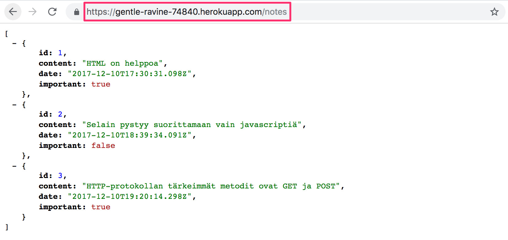
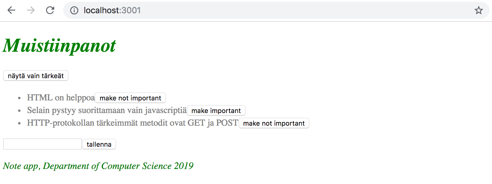
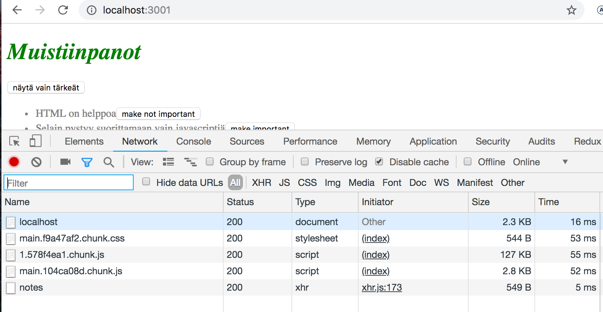
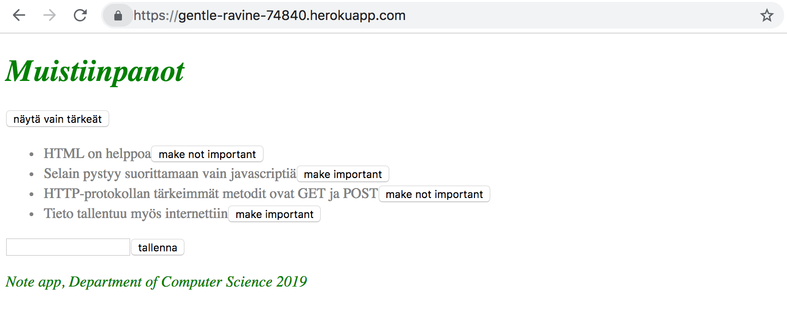
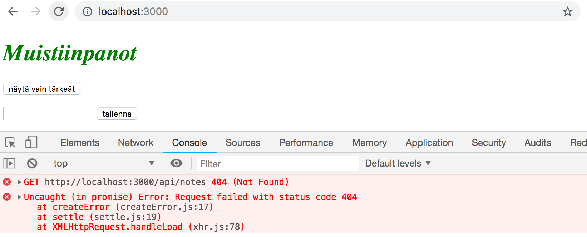

<div class="content">

Palataan yritykseemme käyttää nyt tehtyä backendiä [osassa 2](/osa2) tehdyllä React-frontendillä. Aiempi yritys lopahti seuraavaan virheilmoitukseen


Frontendin tekemä GET-pyyntö osoitteeseen <http://localhost:3001/notes> ei jostain syystä toimi. Mistä on kyse? Backend toimii kuitenkin selaimesta ja postmanista käytettäessä ilman ongelmaa.

### Same origin policy ja CORS

Kyse on asiasta nimeltään CORS eli Cross-origin resource sharing. [Wikipedian](https://en.wikipedia.org/wiki/Cross-origin_resource_sharing) sanoin

> <i>Cross-origin resource sharing (CORS) is a mechanism that allows restricted resources (e.g. fonts) on a web page to be requested from another domain outside the domain from which the first resource was served. A web page may freely embed cross-origin images, stylesheets, scripts, iframes, and videos. Certain "cross-domain" requests, notably Ajax requests, are forbidden by default by the same-origin security policy.</i>

Lyhyesti sanottuna meidän kontekstissa kyse on seuraavasta: websovelluksen selaimessa suoritettava Javascript-koodi saa oletusarvoisesti kommunikoida vain samassa [originissa](https://developer.mozilla.org/en-US/docs/Web/Security/Same-origin_policy) olevan palvelimen kanssa. Koska palvelin on localhostin portissa 3001 ja frontend localhostin portissa 3000, niiden origin ei ole sama.

Korostetaan vielä, että [same origin policy](https://developer.mozilla.org/en-US/docs/Web/Security/Same-origin_policy) ja CORS eivät ole mitenkään React- tai Node-spesifisiä asioita, vaan yleismaailmallisia periaatteita Web-sovellusten toiminnasta.

Voimme sallia muista <i>origineista</i> tulevat pyynnöt käyttämällä Noden [cors](https://github.com/expressjs/cors)-middlewarea.

Asennetaan <i>cors</i> komennolla

```bash
npm install cors --save
```

Otetaan middleware käyttöön ja sallitaan kaikki origineista tulevat pyynnöt:

```js
const cors = require('cors')

app.use(cors())
```

Nyt frontend toimii! Tosin muistiinpanojen tärkeäksi muuttavaa toiminnallisuutta backendissa ei vielä ole.

CORS:ista voi lukea tarkemmin esim. [Mozillan sivuilta](https://developer.mozilla.org/en-US/docs/Web/HTTP/CORS).

### Sovellus internettiin

Kun koko "stäkki" on saatu vihdoin kuntoon, siirretään sovellus internettiin. Viime aikoina on tullut uusia mielenkiintoisa sovellusten hostausmahdollisuuksia, esim. [Zeit](https://zeit.co). Käytetään seuraavassa vanhaa kunnon [Herokua](https://www.heroku.com).

Lisätään projektin juureen tiedosto <i>Procfile</i>, joka kertoo Herokulle, miten sovellus käynnistetään

```bash
web: node index.js
```

Muutetaan tiedoston <i>index.js</i> lopussa olevaa sovelluksen käyttämän portin määrittelyä seuraavasti:

```js
const PORT = process.env.PORT || 3001  // highlight-line
app.listen(PORT, () => {
  console.log(`Server running on port ${PORT}`)
})
```

Nyt käyttöön tulee [ympäristömuuttujassa](https://en.wikipedia.org/wiki/Environment_variable) _PORT_ määritelty portti tai 3001 jos ympäristömuuttuja _PORT_ ei ole määritelty. Heroku konfiguroi sovelluksen portin ympäristömuuttujan avulla.

Tehdään projektihakemistosta git-repositorio, lisätään <i>.gitignore</i> jolla seuraava sisältö

```bash
node_modules
```

Luodaan heroku-sovellus komennolla <i>heroku create</i>, tehdään sovelluksen hakemistosta git-repositorio, commitoidaan koodi ja siirretään se Herokuun komennolla <i>git push heroku master</i>.

Jos kaikki meni hyvin, sovellus toimii:



Jos ei, vikaa voi selvittää herokun lokeja lukemalla, eli komennolla <i>heroku logs</i>.

> **HUOM** ainakin alussa on järkevää tarkkailla Herokussa olevan sovelluksen lokeja koko ajan. Parhaiten tämä onnistuu antamalla komento <i>heroku logs -t</i>, jolloin logit tulevat konsoliin sitä mukaan kun palvelimella tapahtuu jotain.

Myös frontend toimii Herokussa olevan backendin avulla. Voit varmistaa asian muuttamalla frontendiin määritellyn backendin osoitteen viittaamaan <i>http://localhost:3001</i>:n sijaan Herokussa olevaan backendiin.

Seuraavaksi herää kysymys miten saamme myös frontendin internettiin? Vaihtoehtoja on useita.

### Frontendin tuotantoversio

Olemme toistaiseksi suorittaneet React-koodia <i>sovelluskehitysmoodissa</i>, missä sovellus on konfiguroitu antamaan havainnollisia virheilmoituksia, päivittämään koodiin tehdyt muutokset automaattisesti selaimeen ym.

Kun sovellus viedään tuotantoon, täytyy siitä tehdä [production build](https://reactjs.org/docs/optimizing-performance.html#use-the-production-build)
eli tuotantoa varten optimoitu versio.

<i>create-react-app</i>:in avulla tehdyistä sovelluksista saadaan muodostettua tuotantoversio komennolla [npm run build](https://github.com/facebookincubator/create-react-app#npm-run-build-or-yarn-build).

Suoritetaan nyt komento <i>frontendin projektin juuressa</i>.

Komennon seurauksena syntyy hakemiston <i>build</i> (joka sisältää jo sovelluksen ainoan html-tiedoston <i>index.html</i>) sisään hakemisto <i>static</i>, minkä alle generoituu sovelluksen Javascript-koodin [minifioitu](<https://en.wikipedia.org/wiki/Minification_(programming)>) versio. Vaikka sovelluksen koodi on kirjoitettu useaan tiedostoon, generoituu kaikki Javascript yhteen tiedostoon, samaan tiedostoon tulee itseasiassa myös kaikkien sovelluksen koodin tarvitsemien riippuvuuksien koodi.

Minifioitu koodi ei ole miellyttävää luettavaa. Koodin alku näyttää seuraavalta:

```js
!function(e){function r(r){for(var n,f,i=r[0],l=r[1],a=r[2],c=0,s=[];c<i.length;c++)f=i[c],o[f]&&s.push(o[f][0]),o[f]=0;for(n in l)Object.prototype.hasOwnProperty.call(l,n)&&(e[n]=l[n]);for(p&&p(r);s.length;)s.shift()();return u.push.apply(u,a||[]),t()}function t(){for(var e,r=0;r<u.length;r++){for(var t=u[r],n=!0,i=1;i<t.length;i++){var l=t[i];0!==o[l]&&(n=!1)}n&&(u.splice(r--,1),e=f(f.s=t[0]))}return e}var n={},o={2:0},u=[];function f(r){if(n[r])return n[r].exports;var t=n[r]={i:r,l:!1,exports:{}};return e[r].call(t.exports,t,t.exports,f),t.l=!0,t.exports}f.m=e,f.c=n,f.d=function(e,r,t){f.o(e,r)||Object.defineProperty(e,r,{enumerable:!0,get:t})},f.r=function(e){"undefined"!==typeof Symbol&&Symbol.toStringTag&&Object.defineProperty(e,Symbol.toStringTag,{value:"Module"})
```

### Staattisten tiedostojen tarjoaminen backendistä

Eräs mahdollisuus frontendin tuotantoon viemiseen on kopioida tuotantokoodi, eli hakemisto <i>build</i> backendin repositorion juureen ja määritellä backend näyttämään pääsivunaan frontendin <i>pääsivu</i>, eli tiedosto <i>build/index.html</i>.

Aloitetaan kopioimalla frontendin tuotantokoodi backendin alle, projektin juureen. Omalla koneellani kopiointi tapahtuu frontendin hakemistosta käsin komennolla

```bash
cp -r build ../../../osa3/notes-backend
```

Backendin sisältävän hakemiston tulee nyt näyttää seuraavalta:


Jotta saamme expressin näyttämään <i>staattista sisältöä</i> eli sivun <i>index.html</i> ja sen lataaman Javascriptin ym. tarvitsemme expressiin sisäänrakennettua middlewarea [static](http://expressjs.com/en/starter/static-files.html).

Kun lisäämme muiden middlewarejen määrittelyn yhteyteen seuraavan

```js
app.use(express.static('build'))
```

tarkastaa Express GET-tyyppisten HTTP-pyyntöjen yhteydessä ensin löytyykö pyynnön polkua vastaavan nimistä tiedostoa hakemistosta <i>build</i>. Jos löytyy, palauttaa express tiedoston.

Nyt HTTP GET -pyyntö osoitteeseen <i>www.palvelimenosoite.com/index.html</i> tai <i>www.palvelimenosoite.com</i> näyttää Reactilla tehdyn frontendin. GET-pyynnön esim. osoitteeseen <i>www.palvelimenosoite.com/notes</i> hoitaa backendin koodi.

Koska tässä tapauksessa sekä frontend että backend toimivat samassa osoitteessa, voidaan React-sovelluksessa tapahtuva backendin _baseUrl_ määritellä [suhteellisena](https://www.w3.org/TR/WD-html40-970917/htmlweb.html#h-5.1.2) URL:ina, eli ilman palvelinta yksilöivää osaa:

```js
import axios from 'axios'
const baseUrl = '/notes' // highlight-line

const getAll = () => {
  const request = axios.get(baseUrl)
  return request.then(response => response.data)
}

// ...
```

Muutoksen jälkeen on luotava uusi production build ja kopioitava se backendin repositorion juureen.

Sovellusta voidaan käyttää nyt <i>backendin</i> osoitteesta <http://localhost:3001>:



Sovelluksemme toiminta vastaa nyt täysin osan 0 luvussa [Single page app](/osa0/#single-page-app) läpikäydyn esimerkkisovelluksen toimintaa.

Kun mennään selaimella osoitteeseen <http://localhost:3001> palauttaa palvelin hakemistossa <i>build</i> olevan tiedoston <i>index.html</i>, jonka sisältö hieman tiivistettynä on seuraava:

```html
<head>
  <meta charset="utf-8"/>
  <title>React App</title>
  <link href="/static/css/main.f9a47af2.chunk.css" rel="stylesheet">
</head>
<body>
  <div id="root"></div>
  <script src="/static/js/1.578f4ea1.chunk.js"></script>
  <script src="/static/js/main.104ca08d.chunk.js"></script>
</body>
</html>
```

Sivu sisältää ohjeen ladata sovelluksen tyylit määrittelevän CSS-tiedoston, sekä kaksi <i>script</i>-tagia, joiden ansiosta selain lataa sovelluksen Javascript-koodin, eli varsinaisen React-sovelluksen.

React-koodi hakee palvelimelta muistiinpanot osoitteesta <http://localhost:3001/notes> ja renderöi ne ruudulle. Selaimen ja palvelimen kommunikaatio selviää tuttuun tapaan konsolin välilehdeltä <i>Network</i>:



Kun sovelluksen "internettiin vietävä" versio todetaan toimivan paikallisesti, commitoidaan frontendin tuotantoversio backendin repositorioon ja pushataan koodi uudelleen herokuun.

[Sovellus](https://gentle-ravine-74840.herokuapp.com/) toimii moitteettomasti lukuunottamatta vielä backendiin toteuttamatonta muistiinpanon tärkeyden muuttamista:



Sovelluksemme tallettama tieto ei ole ikuisesti pysyvää, sillä sovellus tallettaa muistiinpanot muuttujaan. Jos sovellus kaatuu tai se uudelleenkäynnistetään, kaikki tiedot katoavat.

Tarvitsemme sovelluksellemme tietokannan. Ennen tietokannan käyttöönottoa katsotaan kuitenkin vielä muutamaa asiaa.

### Frontendin deployauksen suoraviivaistus

Jotta uuden frontendin version generointi onnistuisi jatkossa ilman turhia manuaalisia askelia, tehdään frontendin repositorion juureen yksinkertainen shell-scripti, joka suorittaa uuden tuotantoversion buildaamisen eli komennon _npm run build_ ja sen siirron backendin alle. Annetaan skriptille nimeksi <i>deploy.sh</i>. Sisältö on seuraava

```bash
#!/bin/sh
npm run build
rm -rf ../../osa3/notebackend/build
cp -r build ../../osa3/notebackend/
```

Skriptille pitää antaa vielä suoritusoikeudet:

```bash
chmod u+x deploy.sh
```

Skripti voidaan suorittaa frontendin juuresta komennolla _./deploy.sh_

### Backendin urlit

Backendin tarjoama muistiinpanojen käsittelyn rajapinta on nyt suoraan sovelluksen URL:in <https://gentle-ravine-74840.herokuapp.com/> alla. Eli <https://gentle-ravine-74840.herokuapp.com//notes> on kaikkien mustiinpanojen lista ym. Koska backendin roolina on tarjota frontendille koneluettava rajapinta, eli API, olisi ehkä parempi erottaa API:n tarjoama osoitteisto selkeämmin, esim. aloittamalla kaikki sanalla _api_.

Tehdään muutos ensin muuttamalla käsin **kaikki backendin routet**:

```js
//...
app.get('/api/notes', (request, response) => {
  response.json(notes)
});
//...
```

Frontendin koodiin riittää seuraava muutos

```js
import axios from 'axios'
const baseUrl = '/api/notes'  // highlight-line

const getAll = () => {
  const request = axios.get(baseUrl)
  return request.then(response => response.data)
}

// ...
```

Muutosten jälkeen esim. kaikki muistiinpanot tarjoavan API-endpointin osoite on <https://gentle-ravine-74840.herokuapp.com/api/notes>


Frontend on edelleen sovelluksen juuressa eli osoitteessa <https://fullstack-notes.herokuapp.com/>.

> Sivuhuomautus: **API:en versiointi**
>
> Joskus API:n urleissa ilmaistaan myös API:n versio. Eri versioita saatetaan tarvita, jos aikojen kuluessa API:in tehdään laajennuksia, jotka ilman versiointia hajoittaisivat olemassaolevia osia ohjelmista. Versioinnin avulla voidaan tuoda vanhojen rinnalle uusia, hieman eri tavalla toimivia versioita API:sta.
>
> API:n version ilmaiseminen URL:issa ei kuitenkaan ole välttämättä, ainakaan kaikkien mielestä järkevää vaikka tapaa paljon käytetäänkin. Oikeasta tavasta API:n versiointiin [kiistellään ympäri internettiä](https://stackoverflow.com/questions/389169/best-practices-for-api-versioning).

### Proxy

Frontendiin tehtyjen muutosten seurauksena on nyt se, että kun suoritamme frontendiä sovelluskehitysmoodissa, eli käynnistämällä sen komennolla _npm start_, yhteys backendiin ei toimi:



Syynä tälle on se, että backendin osoite muutettiin suhteellisesti määritellyksi:

```js
const baseUrl = '/api/notes'
```

Koska frontend toimii osoitteessa <i>localhost:3000</i>, menevät backendiin tehtävät pyynnöt väärään osoitteeseen <i>localhost:3000/api/notes</i>. Backend toimii kuitenkin osoitteessa <i>localhost:3001</i>

create-react-app:illa luoduissa projekteissa ongelma on helppo ratkaista. Riittää, että frontendin repositorion tiedostoon <i>package.json</i> lisätään seuraava määritelmä:

```bash
{
  "dependencies": {
    // ...
  },
  "scripts": {
    // ...
  },
  "proxy": "http://localhost:3001"  // highlight-line
}
```

Uudelleenkäynnistyksen jälkeen Reactin sovelluskehitysympäristö toimii [proxynä](https://github.com/facebookincubator/create-react-app/blob/master/packages/react-scripts/template/README.md#proxying-api-requests-in-development) ja jos React-koodi tekee HTTP-pyynnön palvelimen <i>http://localhost:3000</i> johonkin osoitteeseen joka ei ole React-sovelluksen vastuulla (eli kyse ei ole esim. sovelluksen Javascript-koodin tai CSS:n lataamisesta), lähetetään pyyntö edelleen osoitteessa <i>http://localhost:3001</i> olevalle palvelimelle.

Nyt myös frontend on kunnossa, se toimii sekä sovelluskehitysmoodissa että tuotannossa yhdessä palvelimen kanssa.

Eräs negatiivinen puoli käyttämässämme lähestymistavassa on se, että sovelluksen uuden version tuotantoon vieminen edellyttää frontendin koodin tuotantoversion generoinnista ja sen backendin repositorion kopioimisesta huolehtivan skriptin <i>delpoy.sh</i> suorittamisen. Tämä taas hankaloittaa automatisoidun [deployment pipelinen](https://martinfowler.com/bliki/DeploymentPipeline.html) toteuttamista. Deployment pipelinellä tarkoitetaan automatisoitua ja hallittua tapaa viedä koodi sovelluskehittäjän koneelta erilaisten testien ja laadunhallinnallisten vaiheiden kautta tuotantoympäristöön.

Tähänkin on useita erilaisia ratkaisuja (esim. sekä frontendin että backendin [sijoittaminen samaan repositorioon](https://github.com/mars/heroku-cra-node)), emme kuitenkaan nyt mene niihin.

Myös frontendin koodin deployaaminen omana sovelluksenaan voi joissain tilanteissa olla järkevää. create-react-app:in avulla luotujen sovellusten osalta se on [suoraviivaista](https://github.com/mars/create-react-app-buildpack).

Sovelluksen tämänhetkinen koodi on kokonaisuudessaan [githubissa](https://github.com/fullstack-hy2019/part3-notes-backend/tree/part3-3), branchissa <i>part3-3</i>.

</div>

<div class="tasks">

### Tehtäviä

Seuraavissa tehtävissä koodia ei tarvita montaa riviä. Tehtävät ovat kuitenkin haastavia, sillä nyt on tarkaleen hallittava missä tapahtuu mitäkin, ja kaikki konfiguraatiot on tehtävä täsmälleen oikein. 

#### 3.9 puhelinluettelon backend step9

Laita backend toimimaan edellisessä osassa tehdyn puhelinluettelon frontendin kanssa muilta osin, paitsi mahdollisen puhelinnumeron muutoksen osalta, jonka vastaava toiminnallisuus toteutetaan backendiin vasta tehtävässä 3.17.

Joudut todennäköisesti tekemään frontendiin erinäisiä pieniä muutoksia ainakin backendin oletettujen urlien osalta. Muista pitää selaimen konsoli koko ajan auki. Jos jotkut HTTP-pyynnöt epäonnistuvat, kannattaa katsoa <i>Network</i>-välilehdeltä mitä tapahtuu. Pidä myös silmällä mitä palvelimen konsolissa tapahtuu. Jos et tehnyt edellistä tehtävää, kannattaa POST-pyyntöä käsittelevässä tapahtumankäsittelijässä tulostaa konsoliin mukana tuleva data eli <i>request.body</i>.

#### 3.10 puhelinluettelon backend step10

Vie sovelluksen backend internetiin, esim. Herokuun. 

**Huom** komento _heroku_ toimii laitoksen koneilla ja fuksikannettavilla. Jos et jostain syystä saa [asennettua](https://devcenter.heroku.com/articles/heroku-cli) herokua koneellesi, voit käyttää komentoa [npx heroku-cli](https://www.npmjs.com/package/heroku-cli).

Testaa selaimen ja postmanin tai VS Code REST clientin avulla, että internetissä oleva backend toimii.

**PRO TIP:** kun deployaat sovelluksen herokuun, kannattaa ainakin alkuvaiheissa pitää **KOKO AJAN** näkyvillä Herokussa olevan sovelluksen loki antamalla komento <em>heroku logs -t</em>. 

Seuraavassa loki eräästä tyypillisestä ongelmatilanteesta, heroku ei löydä sovelluksen riippuvuutena olevaa moduulia <i>express</i>:


Syynä ongelmalle on se, että <i>expressiä</i> asennettaessa oli unohtunut antaa optio <i>--save</i>, joka tallentaa tiedon riippuvuudesta tiedostoon <i>package.json</i>. 

Toinen tyypillinen ongelma on se, että sovellusta ei ole konfiguroitu käyttämään ympäristömuuttujana <em>PORT</em> määriteltyä porttia:


Tee repositorion juureen tiedosto README.md ja lisää siihen linkki internetissä olevaan sovellukseesi.

#### 3.11 puhelinluettelo full stack

Generoi frontendistä tuotantoversio ja lisää se internetissä olevaan sovellukseesi tässä osassa esiteltyä menetelmää noudattaen.

**Huom** eihän hakemisto <i>build</i> ole gitignoroituna projektissasi?

Huolehdi myös, että frontend toimii edelleen myös paikallisesti.

</div>
