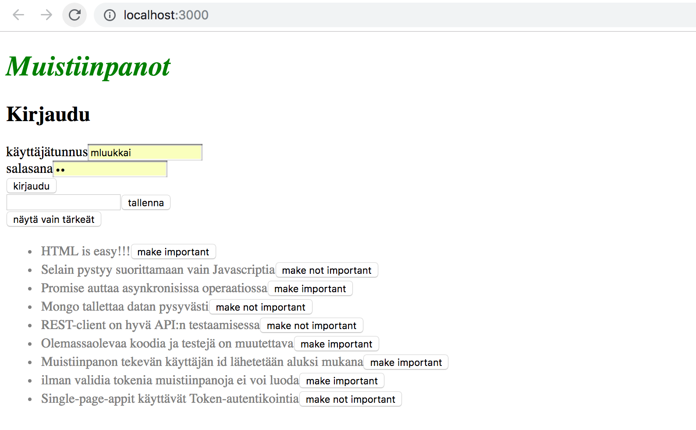
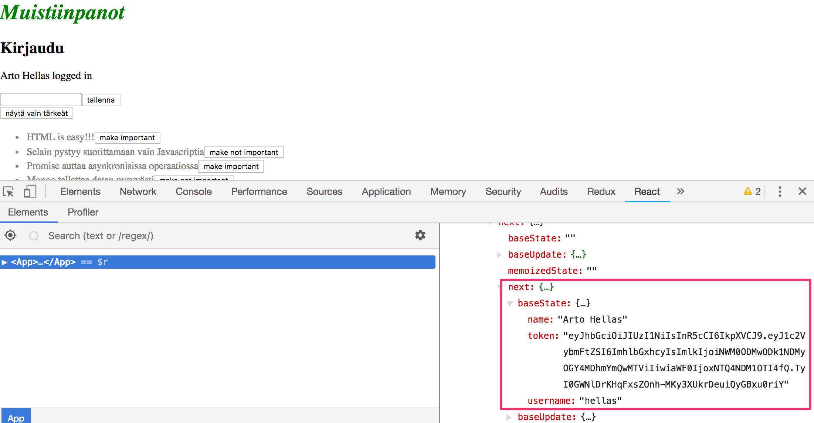
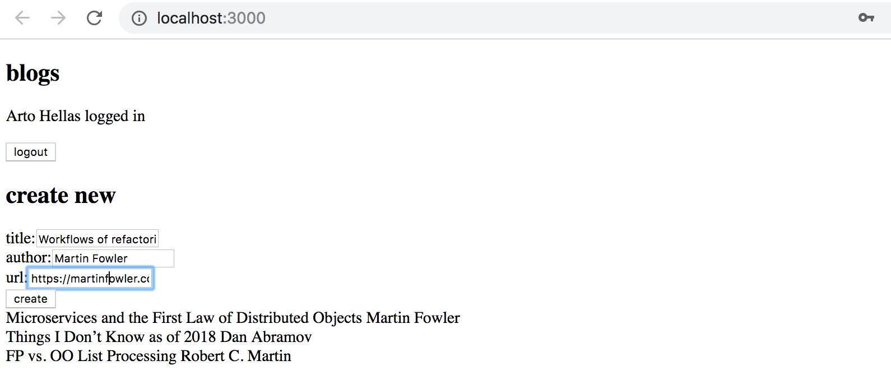
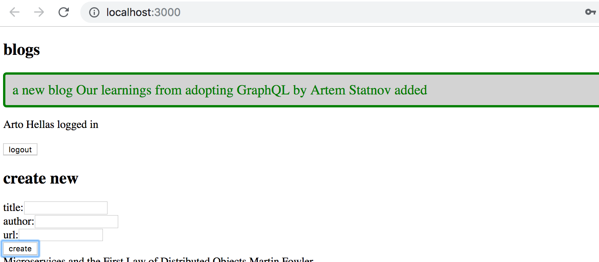

<div class="content">

Kaksi edellistä osaa keskittyivät lähinnä backendin toiminnallisuuteen. Edellisessä osassa backendiin toteutettua käyttäjänhallintaa ei ole tällä hetkellä tuettuna frontendissa millään tavalla.

Frontend näyttää tällä hetkellä olemassaolevat muistiinpanot ja antaa muuttaa niiden tilaa. Uusia muistiinpanoja ei kuitenkaan voi lisätä, sillä osan 4 muutosten myötä backend edellyttää, että lisäyksen mukana on käyttäjän identiteetin varmistava token.

Toteutetaan nyt osa käyttäjienhallinnan edellyttämästä toiminnallisuudesta frontendiin. Aloitetaan käyttäjän kirjautumisesta. Oletetaan vielä tässä osassa, että käyttäjät luodaan suoraan backendiin.

Sovelluksen yläosaan on nyt lisätty kirjautumislomake, myös uuden muistiinpanon lisäämisestä huolehtiva lomake on siirretty muistiinpanojen yläpuolelle:



Komponentin <i>App</i> koodi näyttää seuraavalta:

```js
const App = () => {
  const [notes, setNotes] = useState([]) 
  const [newNote, setNewNote] = useState('')
  const [showAll, setShowAll] = useState(true)
  const [errorMessage, setErrorMessage] = useState(null)
  // highlight-start
  const [username, setUsername] = useState('') 
  const [password, setPassword] = useState('') 
// highlight-end

  useEffect(() => {
    noteService
      .getAll().then(initialNotes => {
        setNotes(initialNotes)
      })
  }, [])

  // ...

// highlight-start
  const handleLogin = (event) => {
    event.preventDefault()
    console.log('logging in with', username, password)
  }
  // highlight-end

  return (
    <div>
      <h1>Muistiinpanot</h1>

      <Notification message={errorMessage} />

      <h2>Kirjaudu</h2>

      // highlight-start
      <form onSubmit={handleLogin}>
        <div>
          käyttäjätunnus
            <input
            type="text"
            value={username}
            name="Username"
            onChange={({ target }) => setUsername(target.value)}
          />
        </div>
        <div>
          salasana
            <input
            type="password"
            value={password}
            name="Password"
            onChange={({ target }) => setPassword(target.value)}
          />
        </div>
        <button type="submit">kirjaudu</button>
      </form>
    // highlight-end

      // ...
    </div>
  )
}

export default App

```

Sovelluksen tämänhetkinen koodi on kokonaisuudessaan [githubissa](https://github.com/fullstack-hy2019part2-notes/tree/part5-1), branchissa <i>part5-1</i>.

Kirjautumislomakkeen käsittely noudattaa samaa periaatetta kuin [osassa 2](/osa2#lomakkeet). Lomakkeen kenttiä varten on lisätty komponentin tilaan  <i>username</i> ja <i>password</i>. Molemmille kentille on määritelty muutoksenkäsittelijä, joka synkronoi kenttään tehdyt muutokset komponentin <i>App</i> tilaan. Muutoksenkäsittelijä on yksinkertainen, se destrukturoi parametrina tulevasta oliosta kentän <i>target</i> ja asettaa sen arvon vastaavaan tilaan:

´´´js
({ target }) => setUsername(target.value)
´´´

Kirjautumislomakkeen lähettämisestä vastaava metodi _handleLogin_ ei tee vielä mitään.

Kirjautuminen tapahtuu tekemällä HTTP POST -pyyntö palvelimen osoitteeseen <i>api/login</i>. Eristetään pyynnön tekevä koodi omaan moduuliin, tiedostoon <i>services/login.js</i>.

Käytetään nyt promisejen sijaan <i>async/await</i>-syntaksia HTTP-pyynnön tekemiseen:

```js
import axios from 'axios'
const baseUrl = '/api/login'

const login = async credentials => {
  const response = await axios.post(baseUrl, credentials)
  return response.data
}

export default { login }
```

Kirjautumisen käsittelystä huolehtiva metodi voidaan toteuttaa seuraavasti:

```js
import loginService from './services/login' 

const App = () => {
  // ...

  const handleLogin = async (event) => {
    event.preventDefault()
    try {
      const user = await loginService.login({
        username, password,
      })

      setUser(user)
      setUsername('')
      setPassword('')
    } catch (exception) {
      setErrorMessage('käyttäjätunnus tai salasana virheellinen')
      setTimeout(() => {
        setErrorMessage(null)
      }, 5000)
    }
  }

  // ...
}
```

Kirjautumisen onnistuessa nollataan kirjautumislomakkeen kentät <i>ja</i> talletetaan palvelimen vastaus (joka sisältää <i>tokenin</i> sekä kirjautuneen käyttäjän tiedot) sovelluksen tilaan <i>user</i>.

Jos kirjautuminen epäonnistuu, eli funktion _loginService.login_ suoritus aiheuttaa poikkeuksen, ilmoitetaan siitä käyttäjälle.

Onnistunut kirjautuminen ei nyt näy sovelluksen käyttäjälle mitenkään. Muokataan sovellusta vielä siten, että kirjautumislomake näkyy vain <i>jos käyttäjä ei ole kirjautuneena</i> eli _user === null_ ja uuden muistiinpanon luomislomake vain <i>jos käyttäjä on kirjautuneena</i>, eli (eli _user_ sisältää kirjautuneen käyttäjän tiedot.

Määritellään ensin komponenttiin <i>App</i> apufunktiot lomakkeiden generointia varten:

```js
const App = () => {
  // ...

  const loginForm = () => (
    <form onSubmit={login}>
      <div>
        käyttäjätunnus
          <input
          type="text"
          value={username}
          name="Username"
          onChange={({ target }) => setUsername(target.value)}
        />
      </div>
      <div>
        salasana
          <input
          type="password"
          value={password}
          name="Password"
          onChange={({ target }) => setPassword(target.value)}
        />
      </div>
      <button type="submit">kirjaudu</button>
    </form>      
  )

  const noteForm = () => (
    <form onSubmit={addNote}>
      <input
        value={newNote}
        onChange={handleNoteChange}
      />
      <button type="submit">tallenna</button>
    </form>  
  )

  return (
    // ...
  )
}
```

ja renderöidään ne ehdollisesti komponenttiin <i>App</i> :

```js
const App = () => {
  // ...

  const loginForm = () => (
    // ...
  )

  const noteForm = () => (
    // ...
  )

  return (
    <div>
      <h1>Muistiinpanot</h1>

      <Notification message={errorMessage} />

      <h2>Kirjaudu</h2>

      {user === null && loginForm()} // highlight-line
      {user !== null && noteForm()} // highlight-line

      <div>
        <button onClick={() => setShowAll(!showAll)}>
          näytä {showAll ? 'vain tärkeät' : 'kaikki'}
        </button>
      </div>
      <ul>
        {rows()}
      </ul>

      <Footer />
    </div>
  )
}

```

Lomakkeiden ehdolliseen renderöintiin käytetään hyväksi aluksi hieman erikoiselta näyttävää, mutta Reactin yhteydessä [yleisesti käytettyä kikkaa](https://reactjs.org/docs/conditional-rendering.html#inline-if-with-logical--operator):

```js
{
  user === null && loginForm()
}
```

Jos ensimmäinen osa evaluoituu epätodeksi eli on [falsy](https://developer.mozilla.org/en-US/docs/Glossary/Falsy), ei toista osaa eli lomakkeen generoivaa koodia suoriteta ollenkaan.

Voimme suoraviivaistaa edellistä vielä hieman käyttämällä [kysymysmerkkioperaattoria](https://developer.mozilla.org/en-US/docs/Web/JavaScript/Reference/Operators/Conditional_Operator):

```js
return (
  <div>
    <h1>Muistiinpanot</h1>

    <Notification message={errorMessage} />

    <h2>Kirjaudu</h2>

    {user === null ?
      loginForm() :
      <div>
        <p>{user.name} logged in</p>
        {noteForm()}
      </div>
    }

    <h2>Muistiinpanot</h2>

    // ...

  </div>
)
```

Eli jos _this.state.user === null_ on [truthy](https://developer.mozilla.org/en-US/docs/Glossary/Truthy), suoritetaan _loginForm_ ja muussa tapauksessa _noteForm_.

Tehdään vielä sellainen muutos, että jos käyttäjä on kirjautunut, renderöidään kirjautuneen käyttäjän nimi:

```js
return (
  <div>
    <h1>Muistiinpanot</h1>

    <Notification message={this.state.error}/>

    <h2>Kirjaudu</h2>

    {user === null ?
      loginForm() :
      noteForm()
    }

    <h2>Muistiinpanot</h2>

    // ...

  </div>
)
```

Ratkaisu näyttää hieman rumalta, mutta jätämme sen koodiin toistaiseksi. 

Sovelluksemme pääkomponentti <i>App</i> on tällä hetkellä jo aivan liian laaja ja nyt tekemämme muutokset ovat ilmeinen signaali siitä, että lomakkeet olisi syytä refaktoroida omiksi komponenteikseen. Jätämme sen kuitenkin harjoitustehtäväksi.


Sovelluksen tämänhetkinen koodi on kokonaisuudessaan [githubissa](https://github.com/fullstack-hy2019part2-notes/tree/part5-2), branchissa <i>part5-2</i>. 


### Muistiinpanojen luominen

Frontend on siis tallettanut onnistuneen kirjautumisen yhteydessä backendilta saamansa tokenin sovelluksen tilan <i>user</i> kenttään <i>token</i>:



Valitettavasti react dev toolsin uusimmassa 15.1.2019 versiossa 3.6.0 hookatut tilat [eivät näy kunnolla](https://github.com/facebook/react-devtools/issues/1282) jos ne ovat taulukkoja tai olioita. Kuvakaappaus on versiosta 3.5. 

Korjataan uusien muistiinpanojen luominen siihen muotoon, mitä backend edellyttää, eli lisätään kirjautuneen käyttäjän token HTTP-pyynnön Authorization-headeriin.

<i>noteService</i>-moduuli muuttuu seuraavasti:

```js
import axios from 'axios'
const baseUrl = '/api/notes'

let token = null // highlight-line

// highlight-start
const setToken = newToken => {
  token = `bearer ${newToken}`
}
// highlight-end

const getAll = () => {
  const request = axios.get(baseUrl)
  return request.then(response => response.data)
}

const create = async newObject => {
  // highlight-start
  const config = {
    headers: { Authorization: token },
  }
// highlight-end

  const response = await axios.post(baseUrl, newObject, config) // highlight-line
  return response.data
}

const update = (id, newObject) => {
  const request = axios.put(`${ baseUrl } /${id}`, newObject)
  return request.then(response => response.data)
}

export default { getAll, create, update, setToken } // highlight-line
```

Moduulille on määritelty vain moduulin sisällä näkyvä muuttuja _token_, jolle voidaan asettaa arvo moduulin exporttaamalla funktiolla _setToken_. Async/await-syntaksiin muutettu _create_ asettaa moduulin tallessa pitämän tokenin <i>Authorization</i>-headeriin, jonka se antaa axiosille metodin <i>post</i> kolmantena parametrina.

Kirjautumisesta huolehtivaa tapahtumankäsittelijää pitää vielä viilata sen verran, että se kutsuu metodia <code>noteService.setToken(user.token)</code> onnistuneen kirjautumisen yhteydessä:

```js
const handleLogin = async (event) => {
  event.preventDefault()
  try {
    const user = await loginService.login({
      username, password,
    })

    noteService.setToken(user.token) // highlight-line
    setUser(user)
    setUsername('')
    setPassword('')
  } catch (exception) {
    // ...
  }
}
```

Uusien muistiinpanojen luominen onnistuu taas!

### Tokenin tallettaminen selaimen local storageen

Sovelluksessamme on ikävä piirre: kun sivu uudelleenladataan, tieto käyttäjän kirjautumisesta katoaa. Tämä hidastaa melkoisesti myös sovelluskehitystä, esim. testatessamme uuden muistiinpanon luomista, joudumme joka kerta kirjautumaan järjestelmään.

Ongelma korjaantuu helposti tallettamalla kirjautumistiedot [local storageen](https://developer.mozilla.org/en-US/docs/Web/API/Storage) eli selaimessa olevaan avain-arvo- eli [key-value](https://en.wikipedia.org/wiki/Key-value_database)-periaatteella toimivaan tietokantaan.

Local storage on erittäin helppokäyttöinen. Metodilla [setItem](https://developer.mozilla.org/en-US/docs/Web/API/Storage/setItem) talletetaan tiettyä <i>avainta</i> vastaava <i>arvo</i>, esim:

```js
window.localStorage.setItem('nimi', 'juha tauriainen')
```

tallettaa avaimen <i>nimi</i> arvoksi toisena parametrina olevan merkkijonon.

Avaimen arvo selviää metodilla [getItem](https://developer.mozilla.org/en-US/docs/Web/API/Storage/getItem):

```js
window.localStorage.getItem('nimi')
```

ja [removeItem](https://developer.mozilla.org/en-US/docs/Web/API/Storage/removeItem) poistaa avaimen.

Storageen talletetut arvot säilyvät vaikka sivu uudelleenladattaisiin. Storage on ns. [origin](https://developer.mozilla.org/en-US/docs/Glossary/Origin)-kohtainen, eli jokaisella selaimella käytettävällä web-sovelluksella on oma storagensa.

Laajennetaan sovellusta siten, että se asettaa kirjautuneen käyttäjän tiedot local storageen.

Koska storageen talletettavat arvot ovat [merkkijonoja](https://developer.mozilla.org/en-US/docs/Web/API/DOMString), emme voi tallettaa storageen suoraan Javascript-oliota, vaan ne on muutettava ensin JSON-muotoon metodilla _JSON.stringify_. Vastaavasti kun JSON-muotoinen olio luetaan local storagesta, on se parsittava takaisin Javascript-olioksi metodilla _JSON.parse_.

Kirjautumisen yhteyteen tehtävä muutos on seuraava:

```js
  const handleLogin = async (event) => {
    event.preventDefault()
    try {
      const user = await loginService.login({
        username, password,
      })

      // highlight-start
      window.localStorage.setItem(
        'loggedNoteappUser', JSON.stringify(user)
      ) 
      // highlight-end
      noteService.setToken(user.token)
      setUser(user)
      setUsername('')
      setPassword('')
    } catch (exception) {
      // ...
    }
  }
```

Kirjautuneen käyttäjän tiedot tallentuvat nyt local storageen ja niitä voidaan tarkastella konsolista:


Sovellusta on vielä laajennettava siten, että kun sivulle tullaan uudelleen, esim. selaimen uudelleenlataamisen yhteydessä, tulee sovelluksen tarkistaa löytyykö local storagesta tiedot kirjautuneesta käyttäjästä. Jos löytyy, asetetaan ne sovelluksen tilaan ja <i>noteServicelle</i>.


Oikea paikka asian hoitamiselle on [effect hook](https://reactjs.org/docs/hooks-effect.html), eli [osasta 2](/osa2/palvelimella_olevan_datan_hakeminen#effect-hookit) tuttu mekanismi, jonka avulla haemme frontendiin palvelimelle talleteut muistiinpanot. 

Effect hookeja voi olla useita, joten tehdään oma hoitamaan kirjautuneen käyttäjän ensimmäinen sivun lataus:

```js
const App = () => {
  const [notes, setNotes] = useState([]) 
  const [newNote, setNewNote] = useState('')
  const [showAll, setShowAll] = useState(true)
  const [errorMessage, setErrorMessage] = useState(null)
  const [username, setUsername] = useState('') 
  const [password, setPassword] = useState('') 
  const [user, setUser] = useState(null) 

  useEffect(() => {
    noteService
      .getAll().then(initialNotes => {
        setNotes(initialNotes)
      })
  }, [])

  // highlight-start
  useEffect(() => {
    const loggedUserJSON = window.localStorage.getItem('loggedNoteappUser')
    if (loggedUserJSON) {
      const user = JSON.parse(loggedUserJSON)
      setUser(user)
      noteService.setToken(user.token)
    }
  }, [])
  // highlight-end

  // ...
}
```

Efektin parametrina oleva tyhjä taulukko varmistaa sen, että efekti suoritetaan ainoastaan kun komponentti renderöidään [ensimmäistä kertaa](https://reactjs.org/docs/hooks-reference.html#conditionally-firing-an-effect).

Nyt käyttäjä pysyy kirjautuneena sovellukseen ikuisesti. Sovellukseen olisikin kenties syytä lisätä <i>logout</i>-toiminnallisuus, joka poistaisi kirjautumistiedot local storagesta. Jätämme kuitenkin uloskirjautumisen harjoitustehtäväksi.

Meille riittää se, että sovelluksesta on mahdollista kirjautua ulos kirjoittamalla konsoliin

```js
window.localStorage.removeItem('loggedNoteappUser')
```

tai local storagen tilan kokonaan nollaavan komennon

```js
window.localStorage.clear()
```

Sovelluksen tämänhetkinen koodi on kokonaisuudessaan [githubissa](https://github.com/fullstack-hy2019part2-notes/tree/part5-3), branchissa <i>part5-3</i>.

</div>

<div class="tasks">

### Tehtäviä

Teemme nyt edellisen osan tehtävissä tehtyä bloglist-backendia käyttävän frontendin. Voit ottaa tehtävien pohjaksi [Githubista](https://github.com/fullstack-hy2019/bloglist-frontend) olevan sovellusrungon. Sovellus olettaa, että backend on käynnissä koneesi portissa 3003.
Lopullisen version palauttaminen riittää, voit toki halutessasi tehdä commitin jokaisen tehtävän jälkeisestä tilanteesta, mutta se ei ole välttämätöntä.

Tämän osan alun tehtävät käytännössä kertaavat kaiken oleellisen tämän kurssin puitteissa Reactista läpikäydyn asian ja voivat siinä mielessä olla kohtuullisen haastavia, erityisesti jos edellisen osan tehtävissä toteuttamasi backend toimii puutteellisesti. Saattaakin olla varminta siirtyä käyttämään osan 4 mallivastauksen backendia.

Muista tehtäviä tehdessäsi kaikki debuggaukseen liittyvät käytänteet, erityisesti konsolin tarkkailu.

**Varoitus:** jos huomaat kirjoittavasi sekaisin async/awaitia ja _then_-kutsuja, on 99.9% varmaa, että teet jotain väärin. Käytä siis jompaa kumpaa tapaa, älä missään tapauksessa "varalta" molempia.

#### 5.1: blogilistan frontend, step1

Ota tehtävien pohjaksi [Githubissa](https://github.com/fullstack-hy2019/bloglist-frontend.git) olevan sovellusrunko kloonaamalla se sopivaan paikkaan komennolla

```bash
git clone https://github.com/fullstack-hy2019/bloglist-frontend.git
```

<i>Poista kloonatun sovelluksen git-konfiguraatio</i>

```bash
cd bloglist-frontend   // mene kloonatun repositorion hakemistoon
rm -rf .git
```

Sovellus käynnistyy normaaliin tapaan, mutta joudut ensin asentamaan sovelluksen riippuvuudet:

```bash
npm install
npm start
```

Toteuta frontendiin kirjautumisen mahdollistava toiminnallisuus. Kirjautumisen yhteydessä backendin palauttama <i>token</i> tallennetaan sovelluksen tilaan <i>user</i>.

Jos käyttäjä ei ole kirjautunut, sivulla näytetään <i>pelkästään</i> kirjautumislomake:


Kirjautuneelle käyttäjälle näytetään kirjautuneen käyttäjän nimi sekä blogien lista


Tässä vaiheessa kirjautuneiden käyttäjien tietoja ei vielä tarvitse muistaa local storagen avulla.

**HUOM** Voit tehdä kirjautumislomakkeen ehdollisen renderöinnin esim. seuraavasti:

```js
  if (user === null) {
    return (
      <div>
        <h2>Log in to application</h2>
        <form>
          //...
        </form>
      </div>
    )
  }

  return (
    <div>
      <h2>blogs</h2>
      {blogs.map(blog =>
        <Blog key={blog.id} blog={blog} />
      )}
    </div>
  )
}
```

#### 5.2: blogilistan frontend, step2

Tee kirjautumisesta "pysyvä" local storagen avulla. Tee sovellukseen myös mahdollisuus uloskirjautumiseen


Uloskirjautumisen jälkeen selain ei saa muistaa kirjautunutta käyttäjää reloadauksen jälkeen.

#### 5.3: blogilistan frontend, step3

Laajenna sovellusta siten, että kirjautunut käyttäjä voi luoda uusia blogeja:



Bloginluomislomakkeesta voi tehdä oman komponenttinsa, joka hallitsee lomakkeen kenttien sisältöä tilansa avulla. Kaiken blogin luomiseen liittyvän tilan voi toki tallettaa myös <i>App</i>-komponenttiin.

#### 5.4*: blogilistan frontend, step4

Toteuta sovellukseen notifikaatiot, jotka kertovat sovelluksen yläosassa onnistuneista ja epäonnistuneista toimenpiteistä. Esim. blogin lisäämisen yhteydessä voi antaa seuraavan notifikaation



epäonnistunut kirjautuminen taas johtaa notifikaatioon


Notifikaation tulee olla näkyvillä muutaman sekunnin ajan. Värien lisääminen ei ole pakollista.

</div>
