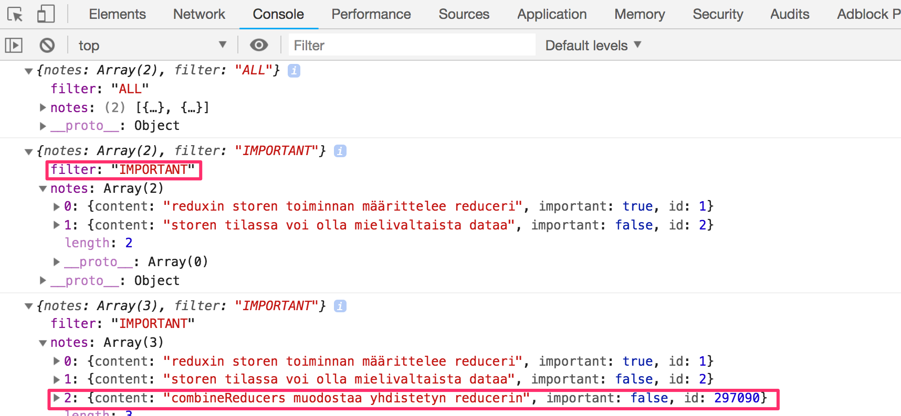
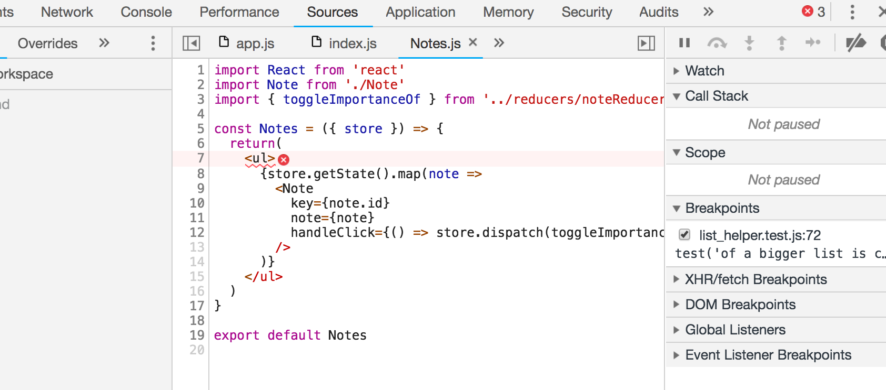
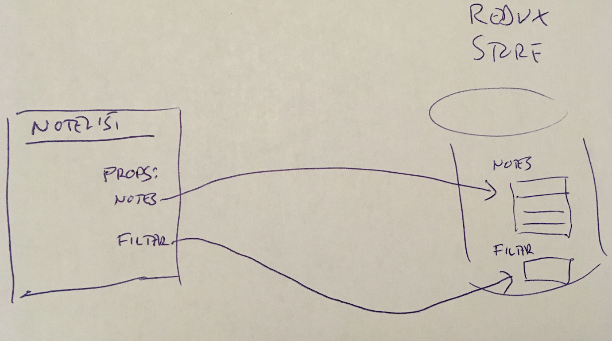
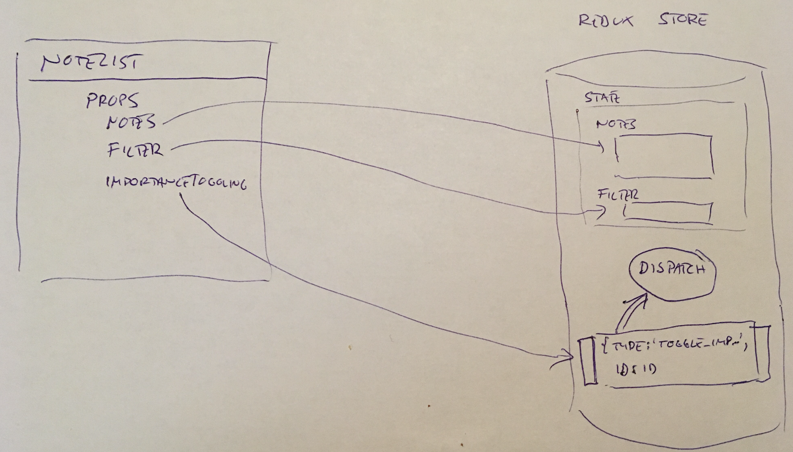

<div class="content">

Jatketaan muistiinpanosovelluksen yksinkertaistetun [redux-version](/osa5#redux-muistiinpanot) laajentamista.

Sovelluskehitystä helpottaaksemme laajennetaan reduceria siten, että storelle määritellään alkutila, jossa on pari muistiinpanoa:

```js
const initialState = [
  {
    content: 'reduxin storen toiminnan määrittelee reduceri',
    important: true,
    id: 1,
  },
  {
    content: 'storen tilassa voi olla mielivaltaista dataa',
    important: false,
    id: 2,
  },
]

const noteReducer = (state = initialState, action) => {
  // ...
}

// ...
export default noteReducer
```

### Monimutkaisempi tila storessa

Toteutetaan sovellukseen näytettävien muistiinpanojen filtteröinti, jonka avulla näytettäviä muistiinpanoja voidaan rajata. Filtterin toteutus tapahtuu [radiobuttoneiden](https://developer.mozilla.org/en-US/docs/Web/HTML/Element/input/radio) avulla:


Aloitetaan todella suoraviivaisella toteutuksella:

```js
import React from 'react'
import NewNote from './components/NewNote'
import Notes from './components/Notes'

const App = (props) => {
  const store = props.store

//highlight-start
  const filterSelected = (value) => () => {
    console.log(value)
  }
//highlight-end

  return (
    <div>
      <NewNote store={store}/>
      <div>
        <div>
        //highlight-start
          kaikki    <input type="radio" name="filter"
            onChange={filterSelected('ALL')} />
          tärkeät   <input type="radio" name="filter"
            onChange={filterSelected('IMPORTANT')} />
          eitärkeät <input type="radio" name="filter"
            onChange={filterSelected('NONIMPORTANT')} />
          //highlight-end
        </div>
      </div>
      
      <Notes store={store} />
    </div>
  )
}
```

Koska painikkeiden attribuutin <i>name</i> arvo on kaikilla sama, muodostavat ne <i>nappiryhmän</i>, joista ainoastaan yksi voi olla kerrallaan valittuna.

Napeille on määritelty muutoksenkäsittelijä, joka tällä hetkellä ainoastaan tulostaa painettua nappia vastaavan merkkijonon konsoliin.

Päätämme toteuttaa filtteröinnin siten, että talletamme muistiinpanojen lisäksi sovelluksen storeen myös <i>filtterin arvon</i>. Eli muutoksen jälkeen storessa olevan tilan tulisi näyttää seuraavalta:

```js
{
  notes: [
    { content: 'reduxin storen toiminnan määrittelee reduceri', important: true, id: 1},
    { content: 'storen tilassa voi olla mielivaltaista dataa', important: false, id: 2}
  ],
  filter: 'IMPORTANT'
}
```

Tällä hetkellähän tilassa on ainoastaan muistiinpanot sisältävä taulukko. Uudessa ratkaisussa tilalla on siis kaksi avainta, <i>notes</i> jonka arvona muistiinpanot ovat sekä <i>filter</i>, jonka arvona on merkkijono joka kertoo mitkä muistiinpanoista tulisi näyttää ruudulla.

### Yhdistetyt reducerit

Voisimme periaatteessa muokata jo olemassaolevaa reduceria ottamaan huomioon muuttuneen tilanteen. Parempi ratkaisu on kuitenkin määritellä tässä tilanteessa uusi, filtterin arvosta huolehtiva reduceri:

```js
const filterReducer = (state = 'ALL', action) => {
  switch (action.type) {
    case 'SET_FILTER':
      return action.filter
    default:
      return state
  }
}
```

Filtterin arvon asettavat actionit ovat siis muotoa

```js
{
  type: 'SET_FILTER',
  filter: 'IMPORTANT'
}
```

Määritellään samalla myös sopiva _action creator_ -funktio. Sijoitetaan koodi moduuliin <i>src/reducers/filterReducer.js</i>:

```js
const filterReducer = (state = 'ALL', action) => {
  // ...
}

export const filterChange = filter => {
  return {
    type: 'SET_FILTER',
    filter,
  }
}

export default filterReducer
```

Saamme nyt muodostettua varsinaisen reducerin yhdistämällä kaksi olemassaolevaa reduceria funktion [combineReducers](https://redux.js.org/api-reference/combinereducers) avulla.

Määritellään yhdistetty reduceri tiedostossa <i>index.js</i>:

```js
import React from 'react'
import ReactDOM from 'react-dom'
import { createStore, combineReducers } from 'redux' // highlight-line
import App from './App'
import noteReducer from './reducers/noteReducer'
import filterReducer from './reducers/filterReducer'  // highlight-line

 // highlight-start
const reducer = combineReducers({
  notes: noteReducer,
  filter: filterReducer
})
 // highlight-end

const store = createStore(reducer)  // highlight-line

console.log(store.getState())

ReactDOM.render(
  <div></div>,  // highlight-line
  document.getElementById('root')
)
```

Koska sovelluksemme hajoaa tässä vaiheessa täysin, komponentin <i>App</i> sijasta renderöidään tyhjä <i>div</i>-elementti.

Konsoliin tulostuu storen tila:


eli store on juuri siinä muodossa missä haluammekin sen olevan!

Tarkastellaan vielä yhdistetyn reducerin luomista

```js
const reducer = combineReducers({
  notes: noteReducer,
  filter: filterReducer,
})
```

Näin tehdyn reducerin määrittelemän storen tila on olio, jossa on kaksi kenttää, <i>notes</i> ja <i>filter</i>. Tilan kentän <i>notes</i> arvon määrittelee <i>noteReducer</i>, jonka ei tarvitse välittää mitään tilan muista kentistä. Vastaavasti <i>filter</i> kentän käsittely tapahtuu <i>filterReducer</i>:in avulla.

Ennen muun koodin muutoksia, kokeillaan vielä konsolista, miten actionit muuttavat yhdistetyn reducerin muodostamaa staten tilaa. Lisätään seuraavat tiedostoon <i>index.js</i>:

```js
import { createNote } from './reducers/noteReducer'
import { filterChange } from './reducers/filterReducer'
//...
store.subscribe(() => console.log(store.getState()))
store.dispatch(filterChange('IMPORTANT'))
store.dispatch(createNote('combineReducers muodostaa yhdistetyn reducerin'))
```

Kun simuloimme näin filtterin tilan muutosta ja muistiinpanon luomista Konsoliin tulostuu storen tila jokaisen muutoksen jälkeen:



Jo tässä vaiheessa kannattaa laittaa mieleen eräs tärkeä detalji. Jos lisäämme <i>molempien reducerien alkuun</i> konsoliin tulostuksen:

```js
const filterReducer = (state = 'ALL', action) => {
  console.log('ACTION: ', action)
  // ...
};
```

Näyttää konsolin perusteella siltä, että jokainen action kahdentuu:


Onko koodissa bugi? Ei. Yhdistetty reducer toimii siten, että jokainen <i>action</i> käsitellään <i>kaikissa</i> yhdistetyn reducerin osissa. Usein tietystä actionista on kiinnostunut vain yksi reduceri, on kuitenkin tilanteita, joissa useampi reduceri muuttaa hallitsemaansa staten tilaa jonkin actionin seurauksena.

### Filtteröinnin viimeistely

Viimeistellään nyt sovellus käyttämään yhdistettyä reduceria, eli palautetaan tiedostossa <i>index.js</i> suoritettava renderöinti muotoon

```js
ReactDOM.render(
  <App store={store} />,
  document.getElementById('root')
)
```

Korjataan sitten bugi, joka johtuu siitä, että koodi olettaa storen tilan olevan mustiinpanot tallettava taulukko:



Korjaus on helppo. Viitteen <i>store.getState()</i> sijaan kaikki muistiinpanot sisältävään taulukkoon viitataan <i>store.getState().notes</i>:

```js
const Notes = ({ store }) => {
  return(
    <ul>
      {store.getState().notes.map(note => // highlight-line
        <Note
          key={note.id}
          note={note}
          handleClick={() => store.dispatch(toggleImportanceOf(note.id))}
        />
      )}
    </ul>
  )
}
```

Eriytetään näkyvyyden säätelyfiltteri omaksi, tiedostoon sijoitettavaksi <i>src/components/VisibilityFilter.js</i> komponentiksi:

```js
import React from 'react'
import { filterChange } from '../reducers/filterReducer'

const VisibilityFilter = (props) => {

  const filterClicked = (value) => {
    props.store.dispatch(filterChange(value))
  }

  return (
    <div>
      kaikki    
      <input 
        type="radio" 
        name="filter" 
        onChange={() => filterClicked('ALL')}
      />
      tärkeät   
      <input
        type="radio"
        name="filter"
        onChange={() => filterClicked('IMPORTANT')}
      />
      eitärkeät 
      <input
        type="radio"
        name="filter"
        onChange={() => filterClicked('NONIMPORTANT')}
      />
    </div>
  )
}

export default VisibilityFilter
```

Toteutus on suoraviivainen, radiobuttonin klikkaaminen muuttaa storen kentän <i>filter</i> tilaa.

Muutetaan vielä komponentin <i>NoteList</i> ottamaan huomioon filtteri

```js
const Notes = ({ store }) => {
  // highlight-start
  const { notes, filter } = store.getState()
  const notesToShow = () => {
    if ( filter === 'ALL' ) {
      return notes
    }

    return filter === 'IMPORTANT'
      ? notes.filter(note => note.important)
      : notes.filter(note => !note.important)
  }
  // highlight-end

  return(
    <ul>
      {notesToShow().map(note => // highlight-line
        <Note
          key={note.id}
          note={note}
          handleClick={() => store.dispatch(toggleImportanceOf(note.id))}
        />
      )}
    </ul>
  )
}
```

Huomaa miten storen tilan kentät on otettu tuttuun tapaan destrukturoimalla apumuuttujiin

```js
const { notes, filter } = store.getState()
```

siis on sama kuin kirjoittaisimme

```js
const notes = this.context.store.getState().notes
const filter = this.context.store.getState().filter
```

Sovelluksen tämänhetkinen koodi on [githubissa](https://github.com/fullstack-hy2019/redux-notes) branchissa </i>part6-2</i>.

Sovelluksessa on vielä pieni kauneusvirhe, vaikka oletusarvosesti filtterin arvo on <i>ALL</i>, eli näytetään kaikki muistiinpanot, ei vastaava radiobutton ole valittuna. Ongelma on luonnollisestikin mahdollista korjata, mutta koska kyseessä on ikävä, mutta harmiton feature, jätämme korjauksen myöhemmäksi.

### Tehtäviä

Jatketaan tehtävässä 6.3 aloitetun reduxia käyttävän anekdoottisovelluksen parissa.

#### 6.7 anekdootit, step5

Sovelluksessa on valmiina komponentin <i>Notification</i> runko:

```react
class Notification extends React.Component {
  render() {
    const style = {
      border: 'solid',
      padding: 10,
      borderWidth: 1
    }
    return (
      <div style={style}>
        render here notification...
      </div>
    )
  }
}
```

Laajenna komponenttia siten, että se renderöi redux-storeen talletetun viestin, eli renderöitävä komponentti muuttuu muodoon:

```react
return (
  <div style={style}>
    {this.props.store.getState()...}
  </div>
)
```

Joudut siis muuttamaan/laajentamaan sovelluksen olemassaolevaa reduceria. Tee toiminnallisuutta varten oma reduceri ja siirry käyttämään sovelluksessa yhdistettyä reduceria tämän osan materiaalin tapaan.

Tässä vaiheessa sovelluksen ei vielä tarvitse osata käyttää <i>Notification</i> komponenttia järkevällä tavalla, riittää että sovellus toimii ja näyttää <i>notificationReducerin</i> alkuarvoksi asettaman viestin.

#### 6.8 paremmat anekdootit, step6

Laajenna sovellusta siten, että se näyttää <i>Notification</i>-komponentin avulla viiden sekunnin ajan kun sovelluksessa äänestetään tai luodaan uusia anekdootteja:


Notifikaation asettamista ja poistamista varten kannattaa toteuttaa [action creatorit](https://redux.js.org/basics/actions#action-creators).

#### 6.9* paremmat anekdootit, step7

Toteuta sovellukseen näytettävien muistiinpanojen filtteröiminen


Säilytä filtterin tila redux storessa, eli käytännössä kannattaa jälleen luoda uusi reduceri ja action creatorit.

Tee filtterin ruudulla näyttämistä varten komponentti <i>Filter</i>. Voit ottaa sen pohjaksi seuraavan

```bash
const Filter = (props) => {
  handleChange = (event) => {
    // input-kentän arvo muuttujassa event.target.value
  }
  render() {
    const style = {
      marginBottom: 10
    }

    return (
      <div style={style}>
        filter <input onChange={this.handleChange}/>
      </div>
    )
  }
}
```

### Connect

ikävästi store propseissa, ja gludge indexissä jolla uudelleenrenderöidään

[React Redux](https://github.com/reactjs/react-redux) -kirjaston määrittelemä funktio [connect](https://github.com/reactjs/react-redux/blob/master/docs/api.md#connectmapstatetoprops-mapdispatchtoprops-mergeprops-options) on paras ratkaisu siihen, miten Redux-store saadaan välitettyä React-componenteille.

Connect voi olla aluksi haastava sisäistää, mutta hieman vaivaa kannattaa ehdottomasti nähdä. Tutustutaan nyt connectin käyttöön. Asensimme jo edellisessä osassa kirjaston, joten voimme aloittaa sen käytön suoraan.

Tutkitaan ensin komponenttia _NoteList_. Funktiota _connect_ käyttämällä "normaaleista" React-komponenteista saadaan muodostettua komponentteja, joiden _propseihin_ on "mäpätty" eli yhdistetty haluttuja osia storen määrittelemästä tilasta.

Muodostetaan ensin komponentista _NoteList_ connectin avulla _yhdistetty komponentti_:

```js
// ...
import { connect } from 'react-redux';

class NoteList extends React.Component {
  // ...
}

const ConnectedNoteList = connect()(NoteList);

export default ConnectedNoteList;
```

Moduuli eksporttaa nyt alkuperäisen komponentin sijaan _yhdistetyn komponentin_, joka toimii toistaiseksi täsmälleen alkuperäisen komponentin kaltaisesti.

Komponentti tarvitsee storesta sekä muistiinpanojen listan, että filtterin arvon. Funktion _connect_ ensimmäisenä parametrina voidaan määritellä funktio [mapStateToProps](https://github.com/reactjs/react-redux/blob/master/docs/api.md#arguments), joka liittää joitakin storen tilan perusteella määriteltyjä asioita connectilla muodostetun _yhdistetyn komponentin_ propseiksi.

Jos määritellään:

```js
const mapStateToProps = state => {
  return {
    notes: state.notes,
    filter: state.filter,
  };
};

const ConnectedNoteList = connect(mapStateToProps)(NoteList);

export default ConnectedNoteList;
```

on komponentin _NoteList_ sisällä mahdollista viitata storen tilaan, esim. muistiinpanoihin suoraan propsin kautta _props.notes_ sen sijaan, että käytettäisiin suoraan contextia muodossa _this.context.store.getState().notes_. Vastaavasti _props.filter_ viittaa storessa olevaan filter-kentän tilaan.

Metodin _render_ sisältö pelkistyy seuraavasti

```js
class NoteList extends React.Component {
  render() {
    const notesToShow = () => {
      const { notes, filter } = this.props;
      if (filter === 'ALL') {
        return notes;
      }

      return filter === 'IMPORTANT'
        ? notes.filter(note => note.important)
        : notes.filter(note => !note.important);
    };

    // ...
  }
}
```

Connect-komennolla, ja _mapStateToProps_-määrittelyllä aikaan saatua tilannetta voidaan visualisoida seuraavasti:



eli komponentin _NoteList_ sisältä on propsien _props.notes_ ja _props.filter_ kautta "suora pääsy" tarkastelemaan Redux storen sisällä olevaa tilaa.

_NoteList_ viittaa edelleen suoraan kontekstin kautta storen metodiin _dispatch_, jota se tarvitsee action creatorin _importanceToggling_ avulla tehdyn actionin dispatchaamiseen:

```js
toggleImportance = (id) => () => {
  this.context.store.dispatch(
    importanceToggling(id)
  )
```

Connect-funktion toisena parametrina voidaan määritellä [mapDispatchToProps](https://github.com/reactjs/react-redux/blob/master/docs/api.md#arguments) eli joukko _action creator_ -funktioita, jotka välitetään yhdistetylle komponentille propseina. Laajennetaan connectausta seuraavasti

```js
const mapStateToProps = state => {
  return {
    notes: state.notes,
    filter: state.filter,
  };
};

const mapDispatchToProps = {
  importanceToggling,
};

const ConnectedNoteList = connect(
  mapStateToProps,
  mapDispatchToProps
)(NoteList);

export default ConnectedNoteList;
```

Nyt komponentti voi dispatchata suoraan action creatorin _importanceToggling_ määrittelemän actionin kutsumalla propsien kautta saamaansa funktiota koodissa:

```js
class NoteList extends React.Component {
  toggleImportance = id => () => {
    this.props.importanceToggling(id);
  };

  // ...
}
```

Storen _dispatch_-funktiota ei enää tarvitse kutsua, sillä _connect_ on muokannut action creatorin _importanceToggling_ sellaiseen muotoon, joka sisältää dispatchauksen.

_mapDispatchToProps_ lienee aluksi hieman haastava ymmärtää, etenkin sen kohta käsiteltävä [vaihtoehtoinen käyttötapa](/osa6/#mapdispatchtopropsin-vaihtoehtoinen-käyttötapa).

Connectin aikaansaamaa tilannetta voidaan havainnollistaa seuraavasti:



eli sen lisäksi että _NoteList_ pääsee storen tilaan propsien _props.notes_ ja _props.filter_ kautta, se viittaa _props.importanceToggling_:lla funktioon, jonka avulla storeen saadaan dispatchattua _TOGGLE_IMPORTANCE_-tyyppisiä actioneja.

Koska komponentti saa storeen liittyvät asiat propseina, voidaan koodista poistaa metodit _componentDidMount_ ja _componentWillUnMount_ jotka huolehtivat komponentin uudelleenrenderöitymisestä storen tilan muuttuessa. Connect tekee tämän puolestamme.

Komponentti _NoteList_ ei tarvitse storea enää mihinkään, se saa kaiken tarvitsemansa propseina _connect_-funktion ansiosta. Komponentti ei käytä enää suoraan contextia, joten koodi yksinkertaistuu seuraavaan muotoon:

```js
import React from 'react'
import { connect } from 'react-redux'
import { importanceToggling } from './../reducers/noteReducer'
import Note from './Note'

class NoteList extends React.Component {
  render() {
    const notesToShow = () => {
      const { notes, filter } = this.props
      if (filter === 'ALL') {
        return notes
      }

      return filter === 'IMPORTANT'
        ? notes.filter(note => note.important)
        : notes.filter(note => !note.important)
    }

    return (
      <ul>
        {notesToShow().map(note =>
          <Note
            key={note.id}
            note={note}
            handleClick={() => this.props.importanceToggling(note.id)}
          />
        )}
      </ul>
    )
  }
}

const mapStateToProps = (state) => {
  return {
    notes: state.notes,
    filter: state.filter
  }
}

const ConnectedNoteList = connect(
  mapStateToProps,
  { importanceToggling }
)(NoteList)

export default ConnectedNoteList
```

Koodi sisältää pari muutakin oikaisua, mm. apumetodista _toggleImportance_ on hankkiuduttu eroon.
Itseasiassa komponentti on nyt niin yksinkertainen että se voitaisiin määritellä funktionaalisena komponenttina. Emme kuitenkaan tee muutosta nyt.

Otetaan _connect_ käyttöön myös uuden muistiinpanon luomisessa:

```js
import React from 'react'
import { noteCreation } from './../reducers/noteReducer'
import { connect } from 'react-redux'

class NoteForm extends React.Component {

  addNote = (event) => {
    event.preventDefault()
    this.props.noteCreation(event.target.note.value)
    event.target.note.value = ''
  }

  render() {
    return (
      <form onSubmit={this.addNote}>
        <input name="note" />
        <button>lisää</button>
      </form>
    )
  }
}

export default connect(
  null,
  { noteCreation }
)(NoteForm)
```

Koska komponentti ei tarvitse storen tilasta mitään, on funktion _connect_ ensimmäinen parametri _null_.

Sovelluksen tämänhetkinen koodi on [githubissa](https://github.com/fullstack-hy2019/redux-notes) tagissä _part6-3_.

### Provider

Funktion _connect_ käytön edellytyksenä on se, että sovellus on määritelty React redux kirjaston tarjoaman [Provider](https://github.com/reactjs/react-redux/blob/master/docs/api.md#provider-store)-komponentin lapseksi ja että sovelluksen käyttämä store on annettu Provider-komponentin attribuutiksi _store_:

```js
import React from 'react'
import ReactDOM from 'react-dom'
import { createStore, combineReducers } from 'redux'
import { Provider } from 'react-redux'
import App from './App'
import noteReducer from './reducers/noteReducer'
import filterReducer from './reducers/filterReducer'

const reducer = combineReducers({
  notes: noteReducer,
  filter: filterReducer
})

const store = createStore(reducer)

ReactDOM.render(
  <Provider store={store}>
    <App />
  </Provider>,
  document.getElementById('root'))
```

Lisäsimme jo edellisen osan lopussa sovellukseen _Providerin_, joten _connect_ oli tällä kertaa suoraan käytettävissä.

### Huomio propsina välitettyyn action creatoriin viittaamisesta

Tarkastellaan vielä erästä mielenkiintoista seikkaa komponentista _NoteForm_:

```js
import React from 'react'
import { noteCreation } from './../reducers/noteReducer'
import { connect } from 'react-redux'

class NoteForm extends React.Component {

  addNote = (event) => {
    event.preventDefault()
    this.props.noteCreation(event.target.note.value)
    event.target.note.value = ''
  }

  render() {
    // ...
  }
}

export default connect(
  null,
  { noteCreation }
)(NoteForm)
```

Aloittelevalle connectin käyttäjälle aiheuttaa joskus ihmetystä se, että action creatorista _noteCreation_ on komponentin sisällä käytettävissä _kaksi eri versiota_.

Funktioon tulee viitata propsien kautta, eli _this.props.noteCreation_, tällöin kyseessä on _connectin_ muotoilema, _dispatchauksen sisältävä_ versio funktiosta.

Moduulissa olevan import-lauseen

```js
import { noteCreation } from './../reducers/noteReducer';
```

ansiosta komponentin sisältä on mahdollista viitata funktioon myös suoraan, eli _noteCreation_. Näin ei kuitenkaan tule tehdä, sillä silloin on kyseessä alkuperäinen action creator joka _ei sisällä dispatchausta_.

Jos tulostamme funktiot koodin sisällä (emme olekaan vielä käyttäneet kurssilla tätä erittäin hyödyllistä debug-kikkaa)

```js
render() {
  console.log(noteCreation)
  console.log(this.props.noteCreation)
  return (
    <form onSubmit={this.addNote}>
      <input name="note" />
      <button>lisää</button>
    </form>
  )
}
```

näemme eron:


Ensimmäinen funktioista siis on normaali _action creator_, toinen taas connectin muotoilema funktio, joka sisältää storen metodin dispatch-kutsun.

Connect on erittäin kätevä työkalu, mutta abstraktiutensa takia kenties käsitteellisesti haastavin kurssin tähänastisista asioista.

Viimeistään nyt kannattaa katsoa kokonaisuudessaan Egghead.io:ta Reduxin kehittäjän Dan Abramovin loistava tuoriaali [Getting started with Redux](https://egghead.io/courses/getting-started-with-redux). Neljässä viimeisessä videossa käsitellään _connect_-metodia.

Siinä vaiheessa kun videot on tehty, connectin käyttö oli asteen verran nykyistä hankalampaa, sillä esimerkeissä käyttämämme tapa määritellä connectin toinen parametri _mapDispatchToProps_ suoraan _action creator_ -funktioiden avulla ei ollut vielä mahdollinen. Katsotaan seuraavassa luvussa lyhyesti vaihtoehtoista, "hankalampaa" tapaa, sitä näkee usein vanhemmassa React-koodissa, joten sen tunteminen on oleellista.

### mapDispatchToPropsin vaihtoehtoinen käyttötapa

Määrittelimme siis connectin komponentille _NoteForm_ antamat actioneja dispatchaavan funktion seuraavasti:

```js
class NoteForm extends React.Component {
  // ...
}

export default connect(
  null,
  { noteCreation }
)(NoteForm);
```

Eli määrittelyn ansiosta komponentti dispatchaa uuden muistiinpanon lisäyksen suorittavan actionin suoraan komennolla <code>this.props.noteCreation('uusi muistiinpano')</code>.

Parametrin _mapDispatchToProps_ kenttinä ei voi antaa mitä tahansa funktiota, vaan funktion on oltava _action creator_, eli Redux-actionin palauttava funktio.

Kannattaa huomata, että parametri _mapDispatchToProps_ on nyt _olio_, sillä määrittely

```js
{
  noteCreation;
}
```

on lyhempi tapa määritellä olioliteraali

```js
{
  noteCreation: noteCreation;
}
```

eli olio, jonka ainoan kentän _noteCreation_ arvona on funktio _noteCreation_.

Voimme määritellä saman myös "pitemmän kaavan" kautta, antamalla _connectin_ toisena parametrina seuraavanlaisen _funktion_:

```js
class NoteForm extends React.Component {
  // ...
}

const mapDispatchToProps = dispatch => {
  return {
    createTodo: value => {
      dispatch(noteCreation(value));
    },
  };
};

export default connect(
  null,
  mapDispatchToProps
)(NoteForm);
```

Tässä vaihtoehtoisessa tavassa _mapDispatchToProps_ on funktio, jota _connect_ kutsuu antaen sille parametriksi storen _dispatch_-funktion. Funktion paluuarvona on olio, joka määrittelee joukon funktioita, jotka annetaan connectoitavalle komponentille propsiksi. Esimerkkimme määrittelee propsin _createTodo_ olevan funktion

```js
value => {
  dispatch(noteCreation(value));
};
```

eli action creatorilla luodun actionin dispatchaus.

Komponentti siis viittaa funktioon propsin _this.props.createTodo_ kautta:

```js
class NoteForm extends React.Component {

  addNote = (event) => {
    event.preventDefault()
    this.props.createTodo(event.target.note.value)
    event.target.note.value = ''
  }

  render() {
    return (
      <form onSubmit={this.addNote}>
        <input name="note" />
        <button>lisää</button>
      </form>
    )
  }
}
```

Konsepti on hiukan monimutkainen ja sen selittäminen sanallisesti on haastavaa. Kannattaa katsoa huolellisesti Dan Abramovin videot ja koittaa miettiä mistä on kyse.

Useimmissa tapauksissa riittää _mapDispatchToProps_:in yksinkertaisempi muoto. On kuitenkin tilanteita, joissa monimutkaisempi muoto on tarpeen, esim. jos määriteltäessä propseiksi mäpättyjä _dispatchattavia actioneja_ on [viitattava komponentin omiin propseihin](https://github.com/gaearon/redux-devtools/issues/250#issuecomment-186429931).

### Presentational/Container revisited

Komponentti _NoteList_ käyttää apumetodia _notesToShow_, joka päättelee filtterin perusteella näytettävien muistiinpanojen listan:

```js
const notesToShow = () => {
  const { notes, filter } = this.props;
  if (filter === 'ALL') {
    return notes;
  }

  return filter === 'IMPORTANT'
    ? notes.filter(note => note.important)
    : notes.filter(note => !note.important);
};
```

Komponentin on tarpeetonta sisältää kaikkea tätä logiikkaa. Eriytetään se komponentin ulkopuolelle _connect_-metodin parametrin _mapStateToProps_ yhteyteen. Muutetaan komponentti samalla funktionaaliseksi:

```js
import React from 'react'
import { connect } from 'react-redux'
import { importanceToggling } from './../reducers/noteReducer'
import Note from './Note'

const NoteList = (props) => (
  <ul>
    {props.visibleNotes.map(note =>
      <Note
        key={note.id}
        note={note}
        handleClick={() => props.importanceToggling(note.id)}
      />
    )}
  </ul>
)

const notesToShow = (notes, filter) => {
  if (filter === 'ALL') {
    return notes
  }
  return filter === 'IMPORTANT'
    ? notes.filter(note => note.important)
    : notes.filter(note => !note.important)
}

const mapStateToProps = (state) => {
  return {
    visibleNotes: notesToShow(state.notes, state.filter)
  }
}

export default connect(
  mapStateToProps,
  { importanceToggling }
)(NoteList)
```

_mapStateToProps_ ei siis tällä kertaa mäppää propsiksi suoraan storessa olevaa asiaa, vaan storen tilasta funktion _notesToShow_ avulla muodostetun sopivasti filtteröidyn datan.

Uudistettu _NoteList_ keskittyy lähes ainoastaan muistiinpanojen renderöimiseen, se on hyvin lähellä sitä minkä sanotaan olevan [presentational](https://medium.com/@dan_abramov/smart-and-dumb-components-7ca2f9a7c7d0)-komponentti, joita Dan Abramovin [sanoin](https://medium.com/@dan_abramov/smart-and-dumb-components-7ca2f9a7c7d0) kuvailee seuraavasti:

- Are concerned with how things look.
- May contain both presentational and container components inside, and usually have some DOM markup and styles of their own.
- Often allow containment via this.props.children.
- Have no dependencies on the rest of the app, such Redux actions or stores.
- Don’t specify how the data is loaded or mutated.
- Receive data and callbacks exclusively via props.
- Rarely have their own state (when they do, it’s UI state rather than data).
- Are written as functional components unless they need state, lifecycle hooks, or performance optimizations.

Connect-metodin avulla muodostettu _yhdistetty komponentti_

```js
const notesToShow = (notes, filter) => {
  if (filter === 'ALL') {
    return notes;
  }
  return filter === 'IMPORTANT'
    ? notes.filter(note => note.important)
    : notes.filter(note => !note.important);
};

const mapStateToProps = state => {
  return {
    visibleNotes: notesToShow(state.notes, state.filter),
  };
};

connect(
  mapStateToProps,
  { importanceToggling }
)(NoteList);
```

taas on selkeästi _container_-komponentti, joita Dan Abramov [luonnehtii](https://medium.com/@dan_abramov/smart-and-dumb-components-7ca2f9a7c7d0) seuraavasti:

- Are concerned with how things work.
- May contain both presentational and container components inside but usually don’t have any DOM markup of their own except for some wrapping divs, and never have any styles.
- Provide the data and behavior to presentational or other container components.
- Call Redux actions and provide these as callbacks to the presentational components.
- Are often stateful, as they tend to serve as data sources.
- Are usually generated using higher order components such as connect from React Redux, rather than written by hand.

Komponenttien presentational vs. container -jaottelu on eräs hyväksi havaittu tapa strukturoida React-sovelluksia. Jako voi olla toimiva tai sitten ei, kaikki riippuu kontekstista.

Abramov mainitsee jaon [eduiksi](https://medium.com/@dan_abramov/smart-and-dumb-components-7ca2f9a7c7d0) muunmuassa seuraavat

- Better separation of concerns. You understand your app and your UI better by writing components this way.
- Better reusability. You can use the same presentational component with completely different state sources, and turn those into separate container components that can be further reused.
- Presentational components are essentially your app’s “palette”. You can put them on a single page and let the designer tweak all their variations without touching the app’s logic. You can run screenshot regression tests on that page.

Abramov mainitsee termin [high order component](https://reactjs.org/docs/higher-order-components.html). Esim. _NoteList_ on normaali komponentti, React-reduxin _connect_ metodi taas on _high order komponentti_, eli käytännössä funktio, joka haluaa parametrikseen komponentin muuttuakseen "normaaliksi" komponentiksi.

High order componentit eli HOC:t ovatkin yleinen tapa määritellä geneeristä toiminnallisuutta, joka sitten erikoistetaan esim. renderöitymisen määrittelyn suhteen parametrina annettavan komponentin avulla. Kyseessä on funktionaalisen ohjelmoinnin etäisesti olio-ohjelmoinnin perintää muistuttava käsite.

HOC:it ovat oikeastaan käsitteen [High Order Function](https://en.wikipedia.org/wiki/Higher-order_function) (HOF) yleistys. HOF:eja ovat sellaiset funkiot, jotka joko ottavat parametrikseen funktioita tai palauttavat funkioita. Olemme oikeastaan käyttäneet HOF:eja läpi kurssin, esim. lähes kaikki taulukoiden käsittelyyn tarkoitetut metodit, kuten _map, filter ja find_ ovat HOF:eja, samoin jo monta kertaa käyttämämme funktioita palauttavat (eli kahden nuolen) funktiot, esim.

```js
filterClicked = value => () => {
  this.props.filterChange(value);
};
```

Sovelluksen tämänhetkinen koodi on [githubissa](https://github.com/fullstack-hy2019/redux-notes) tagissa _part6-4_.


### Tehtäviä

#### 6.10 paremmat anekdootit, step8

Sovelluksessa välitetään _redux store_ tällä hetkellä kaikille komponenteille propseina.

Ota käyttöön kirjasto [react-redux](https://github.com/reactjs/react-redux) ja muuta komponenttia _Notification_ niin, että se pääsee käsiksi tilaan _connect_-funktion välityksellä.

Huomaa, että toimiakseen _connect_ edellyttää että sovellukselle on määriteltävä [Provider](https://github.com/reactjs/react-redux/blob/master/docs/api.md#provider-store).


#### 6.11 paremmat anekdootit, step9

Tee sama komponentille <i>filter</i> ja _AnecdoteForm_.

#### 6.12 paremmat anekdootit, step10

Muuta myös _AnecdoteList_ käyttämään connectia.

Poista turhaksi staten propseina tapahtuva välittäminen, eli pelkistä _App_ muotoon:

```react
class App extends React.Component {
  render() {
    return (
      <div>
        <h1>Programming anecdotes</h1>
        <Notification />
        <AnecdoteForm />
        <AnecdoteList />
      </div>
    )
  }
}
```

#### 6.13 paremmat anekdootit, step11

Välitä komponentille _AnecdoteList_ connectin avulla ainoastaan yksi stateen liittyvä propsi, filtterin tilan perusteella näytettävät anekdootit samaan tapaan kuin materiaalin luvussa [Presentational/Container revisited](/osa6/#presentationalcontainer-revisited).

Komponentin _AnecdoteList_ metodi _render_ siis typistyy suunnilleen seuraavaan muotoon

```react
class AnecdoteList extends React.Component {
  // ...
  render() {
    return (
      <div>
        <h2>Anecdotes</h2>
        <Filter />
        {this.props.anecdotesToShow.map(anecdote =>
          <div key={anecdote.id}>
            ...
          </div>
        )}
      </div>
    )
  )
}
```

</div>
