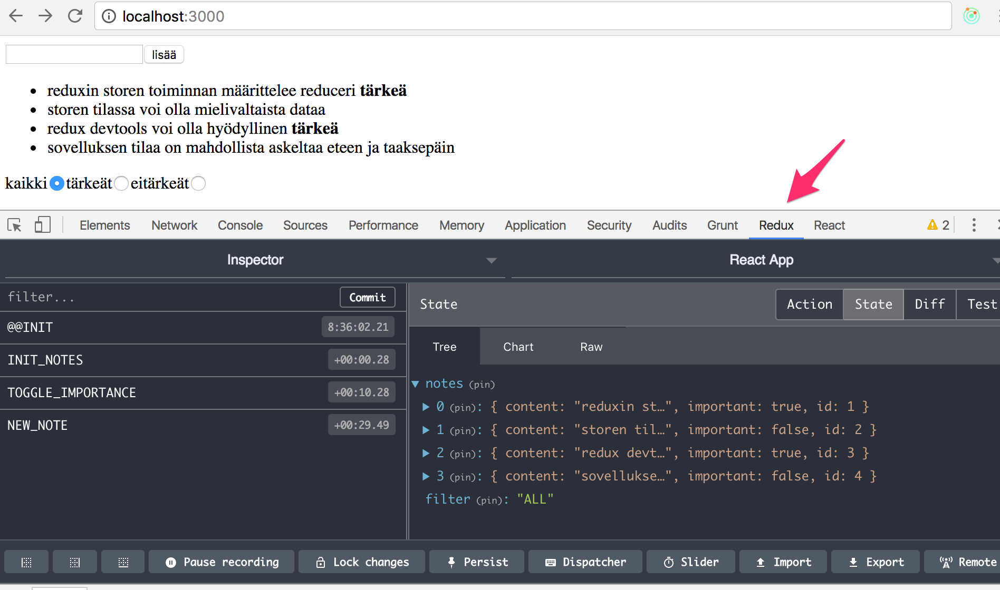
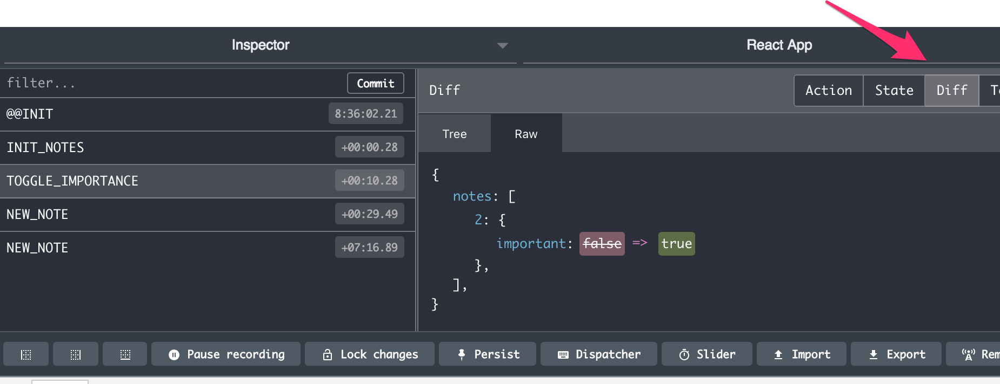

<div class="content">

## Redux-sovelluksen kommunikointi palvelimen kanssa

Laajennetaan sovellusta siten, että muistiinpanot talletetaan backendiin. Käytetään osasta 2 tuttua [json-serveriä](/osa2#datan-haku-palvelimelta).

Tallennetaan projektin juuren tiedostoon _db.json_ tietokannan alkutila:

```json
{
  "notes": [
    {
      "content": "reduxin storen toiminnan määrittelee reduceri",
      "important": true,
      "id": 1
    },
    {
      "content": "storen tilassa voi olla mielivaltaista dataa",
      "important": false,
      "id": 2
    }
  ]
}
```

Asennetaan projektiin json-server

```bash
npm install json-server --save
```

ja lisätään tiedoston _package.json_ osaan _scripts_ rivi

```bash
"scripts": {
  "server": "json-server -p3001 db.json",
  // ...
}
```

Käynnistetään json-server komennolla _npm run server_.

Tehdään sitten tuttuun tapaan _axiosia_ hyödyntävä backendistä dataa hakeva metodi tiedostoon _services/notes.js_

```js
import axios from 'axios';

const getAll = async () => {
  const response = await axios.get('http://localhost:3001/notes');
  return response.data;
};

export default { getAll };
```

Asennetaan myös axios projektiin

```bash
npm install axios --save
```

Muutetaan _nodeReducer_:issa tapahtuva muistiinpanojen tilan alustusta, siten että oletusarvoisesti mustiinpanoja ei ole:

```js
const noteReducer = (state = [], action) => {
  // ...
};
```

Nopea tapa saada storen tila alustettua palvelimella olevan datan perusteella on hakea muistiinpanot tiedostossa _index.js_ ja dispatchata niille yksitellen action _NEW_NOTE_:

```js
// ...
import noteService from './services/notes';

const reducer = combineReducers({
  notes: noteReducer,
  filter: filterReducer,
});

const store = createStore(reducer);

noteService.getAll().then(notes =>
  notes.forEach(note => {
    store.dispatch({ type: 'NEW_NOTE', data: note });
  })
);

// ...
```

Lisätään reduceriin tuki actionille _INIT_NOTES_, jonka avulla alustus voidaan tehdä dispatchaamalla yksittäinen action. Luodaan myös sitä varten oma action creator -funktio _noteInitialization_:

```js
// ...
const noteReducer = (state = [], action) => {
  console.log('ACTION:', action);
  switch (action.type) {
    case 'NEW_NOTE':
      return [...state, action.data];
    case 'INIT_NOTES':
      return action.data;
    // ...
  }
};

export const noteInitialization = data => {
  return {
    type: 'INIT_NOTES',
    data,
  };
};

// ...
```

_index.js_ yksinkertaistuu:

```js
import noteReducer, { noteInitialization } from './reducers/noteReducer';
// ...

noteService.getAll().then(notes => store.dispatch(noteInitialization(notes)));
```

> **HUOM:** miksi emme käyttäneet koodissa promisejen ja _then_-metodilla rekisteröidyn tapahtumankäsittelijän sijaan awaitia?
>
> await toimii ainoastaan _async_-funktioiden sisällä, ja _index.js_:ssä oleva koodi ei ole funktiossa, joten päädyimme tilanteen yksinkertaisuuden takia tällä kertaa jättämään _async_:in käyttämättä.

Päätetään kuitenkin siirtää muistiinpanojen alustus _App_-komponentin metodiin _[componentDidMount](https://reactjs.org/docs/react-component.html#componentdidmount)_, se on luonteva paikka alustuksille, sillä metodi suoritetaan heti sovelluksemme ensimmäisen renderöinnin jälkeen.

Jotta saamme action creatorin _noteInitialization_ käyttöön komponentissa _App_ tarvitsemme jälleen _connect_-metodin apua:

```react
import React from 'react'
import NoteForm from './components/NoteForm.js'
import NoteList from './components/NoteList.js'
import VisibilityFilter from './components/VisibilityFilter'
import { connect } from 'react-redux'
import { noteInitialization } from './reducers/noteReducer'
import noteService from './services/notes'

class App extends React.Component {
  componentDidMount = async () => {
    const notes = await noteService.getAll()
    this.props.noteInitialization(notes)
  }

  render() {
    return (
      <div>
        <NoteForm />
        <VisibilityFilter />
        <NoteList />
      </div>
    )
  }
}

export default connect(
  null,
  { noteInitialization }
)(App)
```

Näin funktio _noteInitialization_ tulee komponentin _App_ propsiksi _this.props.noteInitialization_ ja sen kutsumiseen ei tarvita _dispatch_-metodia koska _connect_ hoitaa asian puolestamme.

Pääsimme nyt myös käyttämään aina mukavaa async/awaitia. Palvelimen kanssa kommunikointi tapahtuu joka tapauksessa funktiossa, joten sen määrittely asyncina on vaivatonta:

```js
componentDidMount = async () => {
  const notes = await noteService.getAll();
  this.props.noteInitialization(notes);
};
```

Voimme toimia samoin myös uuden muistiinpanon luomisen suhteen. Laajennetaan palvelimen kanssa kommunikoivaa koodia:

```js
const url = 'http://localhost:3001/notes';

const getAll = async () => {
  const response = await axios.get(url);
  return response.data;
};

const createNew = async content => {
  const response = await axios.post(url, { content, important: false });
  return response.data;
};

export default {
  getAll,
  createNew,
};
```

Komponentin _NoteForm_ metodi _addNote_ muuttuu hiukan:

```react
import React from 'react'
import { noteCreation } from './../reducers/noteReducer'
import { connect } from 'react-redux'
import noteService from '../services/notes'

class NoteForm extends React.Component {

  addNote = async (event) => {
    event.preventDefault()
    const content = event.target.note.value
    event.target.note.value = ''
    const newNote = await noteService.createNew(content)
    this.props.noteCreation(newNote)
  }

  render() {
    //...
  }
}

export default connect(
  null,
  {noteCreation}
)(NoteForm)
```

Koska backend generoi muistiinpanoille id:t, muutetaan action creator _noteCreation_ muotoon

```js
export const noteCreation = data => {
  return {
    type: 'NEW_NOTE',
    data,
  };
};
```

Muistiinpanojen tärkeyden muuttaminen olisi mahdollista toteuttaa samalla periaatteella, eli tehdä palvelimelle ensin asynkroninen metodikutsu ja sen jälkeen dispatchata sopiva action.

Sovelluksen tämänhetkinen koodi on [githubissa](https://github.com/FullStack-HY/redux-notes/tree/part6-5) tagissä _part6-5_.

## Tehtäviä

6.16
6.17
6.18

Tee nyt tehtävät [6.10-6.12](/tehtävät#redux-ja-backend)

### Asynkroniset actionit ja redux thunk

Lähestymistapamme on ok, mutta siinä mielessä ikävä, että palvelimen kanssa kommunikointi tapahtuu komponenttien metodeissa. Olisi parempi, jos kommunikointi voitaisiin abstrahoida komponenteilta siten, että niiden ei tarvitsisi kuin kutsua sopivaa _action creatoria_, esim. _App_ alustaisi sovelluksen tilan seuraavasti:

```js
class App extends React.Component {
  componentDidMount() {
    this.props.initializeNotes();
  }
  // ...
}
```

ja _NoteForm_ loisi uuden muistiinpanon seuraavasti:

```js
class NoteForm extends React.Component {
  addNote = async event => {
    event.preventDefault();
    const content = event.target.note.value;
    event.target.note.value = '';
    this.props.createNote(content);
  };
}
```

Molemmat komponentit käyttäisivät ainoastaan propsina saamaansa funktiota, välittämättä siitä että taustalla tapahtuu todellisuudessa palvelimen kanssa tapahtuvaa kommunikointia.

Asennetaan nyt [redux-thunk](https://github.com/gaearon/redux-thunk)-kirjasto, joka mahdollistaa _asynkronisten actionien_ luomisen. Asennus tapahtuu komennolla:

```bash
npm install --save redux-thunk
```

redux-thunk-kirjasto on ns. _redux-middleware_ joka täytyy ottaa käyttöön storen alustuksen yhteydessä. Eriytetään samalla storen määrittely omaan tiedostoon _store.js_:

```js
import { createStore, combineReducers, applyMiddleware } from 'redux';
import thunk from 'redux-thunk';

import noteReducer from './reducers/noteReducer';
import filterReducer from './reducers/filterReducer';

const reducer = combineReducers({
  notes: noteReducer,
  filter: filterReducer,
});

const store = createStore(reducer, applyMiddleware(thunk));

export default store;
```

Tiedosto _src/index.js_ on muutoksen jälkeen seuraava

```react
import React from 'react'
import ReactDOM from 'react-dom'
import { Provider } from 'react-redux'
import App from './App'
import store from './store'

ReactDOM.render(
  <Provider store={store}>
    <App />
  </Provider>,
  document.getElementById('root')
)
```

redux-thunkin ansiosta on mahdollista määritellä _action creatoreja_ siten, että ne palauttavat funktion, jonka parametrina on redux-storen _dispatch_-metodi. Tämän ansiosta on mahdollista tehdä asynkronisia action creatoreja, jotka ensin odottavat jonkin toimenpiteen valmistumista ja vasta sen jälkeen dispatchaavat varsinaisen actionin.

Voimme nyt määritellä muistiinpanojen alkutilan palvelimelta hakevan action creatorin _initializeNotes_ seuraavasti:

```js
export const initializeNotes = () => {
  return async dispatch => {
    const notes = await noteService.getAll();
    dispatch({
      type: 'INIT_NOTES',
      data: notes,
    });
  };
};
```

Sisemmässä funktiossaan, eli _asynkronisessa actionissa_ operaatio hakee ensin palvelimelta kaikki muistiinpanot ja sen jälkeen _dispatchaa_ muistiinpanot storeen lisäävän actionin.

Komponentti _App_ voidaan nyt määritellä seuraavasti:

```react
class App extends React.Component {
  componentDidMount () {
    this.props.initializeNotes()
  }

  render() {
    return (
      <div>
        <NoteForm />
        <NoteList />
        <VisibilityFilter />
      </div>
    )
  }
}

export default connect(
  null, { initializeNotes }
)(App)
```

Ratkaisu on elegantti, muistiinpanojen alustuslogiikka on eriytetty kokonaan React-komponenttien ulkopuolelle.

Uuden muistiinpanon lisäävä action creator _createNew_ on seuraavassa

```js
export const createNew = content => {
  return async dispatch => {
    const newNote = await noteService.createNew(content);
    dispatch({
      type: 'NEW_NOTE',
      data: newNote,
    });
  };
};
```

Periaate on jälleen sama, ensin suoritetaan asynkroninen operaatio, ja sen valmistuttua _dispatchataan_ storen tilaa muuttava action.

Lomake muuttuu seuraavasti:

```react
class NoteForm extends React.Component {

  addNote = async (event) => {
    event.preventDefault()
    const content = event.target.note.value
    event.target.note.value = ''
    this.props.createNew(content)
  }

  render() {
    return (
      <form onSubmit={this.addNote}>
        <input name='note' />
        <button>lisää</button>
      </form>
    )
  }
}

export default connect(
  null, { createNew }
)(NoteForm)
```

Sovelluksen tämänhetkinen koodi on [githubissa](https://github.com/FullStack-HY/redux-notes/tree/part6-6) tagissä _part6-6_.

### Redux DevTools

Chromeen on asennettavissa [Redux DevTools](https://chrome.google.com/webstore/detail/redux-devtools/lmhkpmbekcpmknklioeibfkpmmfibljd), jonka avulla Redux-storen tilaa ja sitä muuttavia actioneja on mahdollisuus seurata selaimen konsolista.

Selaimen lisäosan lisäksi debugatessa tarvitaan kirjastoa [redux-devtools-extension](https://www.npmjs.com/package/redux-devtools-extension). Asennetaan se komennolla

```js
npm install --save redux-devtools-extension
```

Storen luomistapaa täytyy hieman muuttaa, että kirjasto saadaan käyttöön:

```react
// ...
import { createStore, combineReducers, applyMiddleware } from 'redux'
import thunk from 'redux-thunk'
import { composeWithDevTools } from 'redux-devtools-extension'

import noteReducer from './reducers/noteReducer'
import filterReducer from './reducers/filterReducer'

const reducer = combineReducers({
  notes: noteReducer,
  filter: filterReducer
})

const store = createStore(
  reducer,
  composeWithDevTools(
    applyMiddleware(thunk)
  )
)

export default store
```

Kun nyt avaat konsolin, välilehti _redux_ näyttää seuraavalta:



Konsolin avulla on myös mahdollista dispatchata actioneja storeen


Storen tietyn hetkisen tilan lisäksi on myös mahdollista tarkastella, mikä on kunkin actionin tilalle aiheuttama muutos:



Egghead.io:ssa on ilmaiseksi saatavilla Reduxin kehittäjän Dan Abramovin loistava tutoriaali [Getting started with Redux](https://egghead.io/courses/getting-started-with-redux). Neljässä viimeisessä videossa käytettävää _connect_-metodia käsittelemme vasta kurssin seuraavassa osassa.


## tehtäviä

6.19
6.20
6.21

Tee nyt tehtävät [6.13-6.15](/tehtävät#thunk)

</div>

