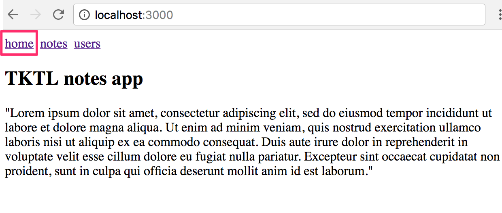
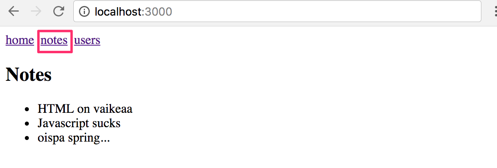
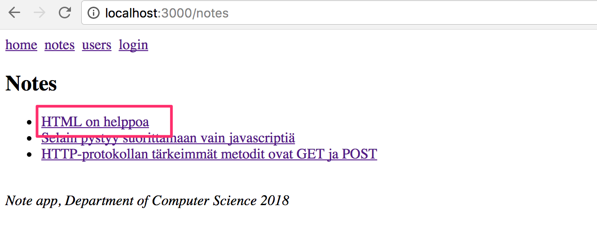
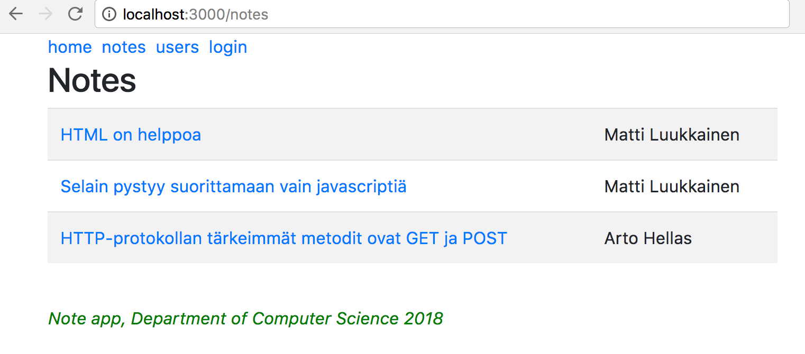
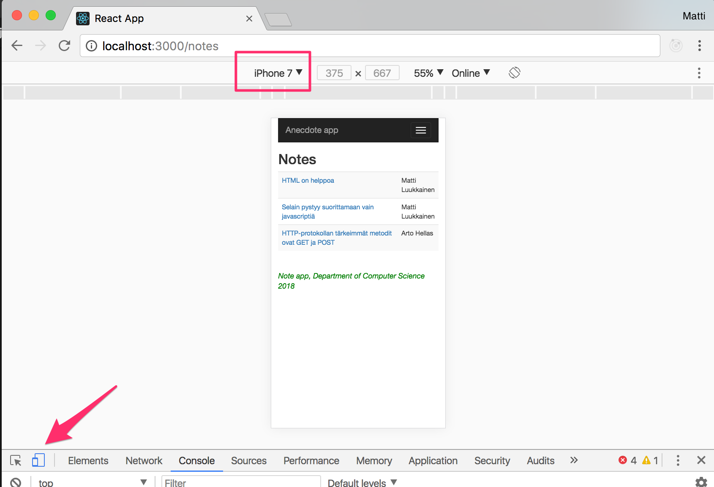
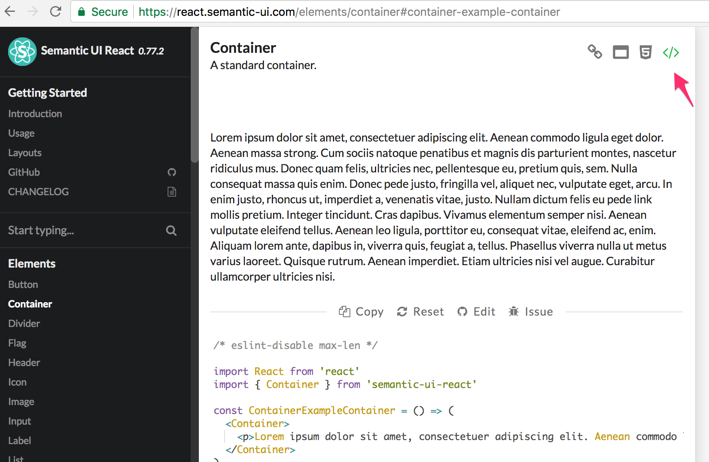
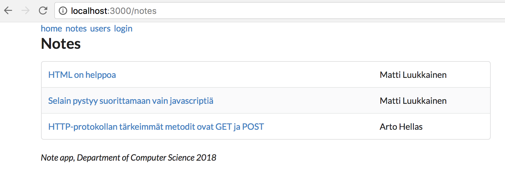
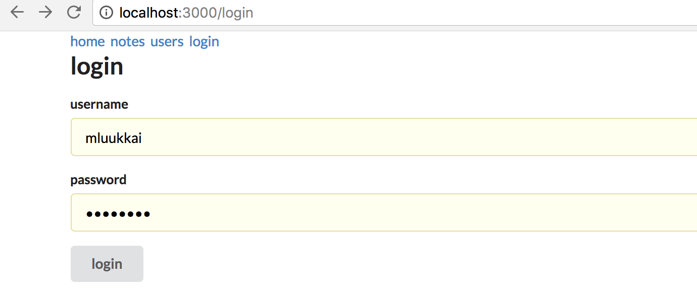

<div class="content">

## React router

Palataan jälleen Reduxittoman Reactin pariin.

On erittäin tyypillistä, että web-sovelluksissa on navigaatiopalkki, jonka avulla on mahdollista vaihtaa sovelluksen näkymää. Muistiinpanosovelluksemme voisi sisältää pääsivun:



ja omat sivunsa muistiinpanojen ja käyttäjien tietojen näyttämiseen:



[Vanhan koulukunnan websovelluksessa](/osa0#perinteinen-web-sovellus) sovelluksen näyttämän sivun vaihto tapahtui siten että selain teki palvelimelle uuden HTTP GET -pyynnön ja renderöi sitten palvelimen palauttaman näkymää vastaavan HTML-koodin.

Single page appeissa taas ollaan todellisuudessa koko ajan samalla sivulla, ja selaimessa suoritettava Javascript-koodi luo illuusion eri "sivuista". Jos näkymää vaihdettaessa tehdään HTTP-kutsuja, niiden avulla haetaan ainoastaan JSON-muotoista dataa jota uuden näkymän näyttäminen ehkä edellyttää.

Navigaatiopalkki ja useita näkymiä sisältävä sovellus on erittäin helppo toteuttaa Reactilla.

Seuraavassa on eräs tapa:

```react
const Home = () => (
  <div> <h2>TKTL notes app</h2> </div>
)

const Notes = () => (
  <div> <h2>Notes</h2> </div>
)

const Users = () => (
  <div> <h2>Users</h2> </div>
)

class App extends React.Component {
  constructor() {
    super()
    this.state = {
      page: 'home'
    }
  }

  toPage = (page) => (event) => {
    event.preventDefault()
    this.setState({ page })
  }

  render() {
    const content = () => {
      if (this.state.page === 'home') {
        return <Home />
      } else if (this.state.page === 'notes') {
        return <Notes />
      } else if (this.state.page === 'users') {
        return <Users />
      }
    }

    return (
      <div>
        <div>
          <a href="" onClick={ this.toPage('home') }>home</a> &nbsp;
          <a href="" onClick={ this.toPage('notes') }>notes</a> &nbsp;
          <a href="" onClick={ this.toPage('users') }>users</a>
        </div>

        {content()}
      </div>
    )
  }
}
```

Eli jokainen näkymä on toteutettu omana komponenttinaan ja sovelluksen tilassa pidetään tieto siitä, minkä näkymää vastaava komponentti menupalkin alla näytetään.

**Huom:** navigointivalikossa oleva _&amp;nbsp;_ tarkoittaa _a_-tagien väliin sjijoitettavaa välilyöntiä. CSS:n käyttö olisi luonnollisesti parempi tapa sivun ulkoasun muotoilulle mutta nyt tyydymme quick'n'dirty-ratkaisuun.

Menetelmä ei kuitenkaan ole optimaalinen. Kuten kuvista näkyy, sivuston osoite pysyy samana vaikka välillä ollaankin eri näkymässä. Jokaisella näkymällä tulisi kuitenkin olla oma osoitteensa, jotta esim. bookmarkien tekeminen olisi mahdollista. Sovelluksessamme ei myöskään selaimen _back_-painike toimi loogisesti, eli _back_ ei vie edelliseksi katsottuun sovelluksen näkymään vaan jonnekin ihan muualle. Jos sovellus kasvaisi suuremmaksi ja sinne haluttaisiin esim. jokaiselle käyttäjälle sekä muistiinpanolle oma yksittäinen näkymänsä, itse koodattu _reititys_ eli sivuston navigaationhallinta menisi turhan monimutkaiseksi.

Reactissa on onneksi valmis komponentti [React router](https://github.com/ReactTraining/react-router) joka tarjoaa erinomaisen ratkaisun React-sovelluksen navigaation hallintaan.

Muutetaan ylläoleva sovellus käyttämään React routeria. Asennetaan React router komennolla

```bash
npm install --save react-router-dom
```

React routerin tarjoama reititys saadaan käyttöön muuttamalla sovellusta seuraavasti:

```react
import { BrowserRouter as Router, Route, Link } from 'react-router-dom'

class App extends React.Component {

  render() {
    return (
      <div>
        <Router>
          <div>
            <div>
              <Link to="/">home</Link> &nbsp;
              <Link to="/notes">notes</Link> &nbsp;
              <Link to="/users">users</Link>
            </div>
            <Route exact path="/" render={() => <Home />} />
            <Route path="/notes" render={() => <Notes />} />
            <Route path="/users" render={() => <Users />} />
          </div>
        </Router>
      </div>
    )
  }
}
```

Reititys, eli komponenttien ehdollinen, selaimen _urliin perustuva_ renderöinti otetaan käyttöön sijoittamalla komponentteja _Router_-komponentin lapsiksi, eli _Router_-tagien sisälle.

Huomaa, että vaikka komponenttiin viitataan nimellä _Router_ kyseessä on [BrowserRouter](https://reacttraining.com/react-router/web/api/BrowserRouter), sillä
importtaus tapahtuu siten, että importattava olio uudelleennimetään:

```js
import { BrowserRouter as Router ... } from 'react-router-dom'
```

Manuaalin mukaan

> _BrowserRouter_ is a _Router_ that uses the HTML5 history API (pushState, replaceState and the popstate event) to keep your UI in sync with the URL.

Normaalisti selain lataa uuden sivun osoiterivillä olevan urlin muuttuessa. [HTML5 history API](https://css-tricks.com/using-the-html5-history-api/):n avulla _BrowserRouter_ kuitenkin mahdollistaa sen, että selaimen osoiterivillä olevaa urlia voidaan käyttää React-sovelluksen sisäiseen "reitittämiseen", eli vaikka osoiterivillä oleva url muuttuu, sivun sisältöä manipuloidaan ainoastaan Javascriptillä ja selain ei lataa uutta sisältöä palvelimelta. Selaimen toiminta back- ja forward-toimintojen ja bookmarkien tekemisen suhteen on kuitenkin loogista, eli toimii kuten perinteisillä web-sivuilla.

Routerin sisälle määritellään selaimen osoiteriviä muokkaavia _linkkejä_ komponentin [Link](https://reacttraining.com/react-router/web/api/Link) avulla. Esim.

```bash
<Link to="/notes">notes</Link>
```

luo sovellukseen linkin, jonka teksti on _notes_ ja jonka klikkaaminen vaihtaa selaimen osoiteriville urliksi _/notes_.

Selaimen urliin perustuen renderöitävät komponentit määritellään komponentin [Route](https://reacttraining.com/react-router/web/api/Route) avulla. Esim.

```bash
<Route path="/notes" render={() => <Notes />} />
```

määrittelee, että jos selaimen osoiteena on _/notes_, renderöidään komponentti _Notes_.

Sovelluksen juuren, eli osoitteen _/_ määritellään renderöivän komponentti _Home_:

```bash
<Route exact path="/" render={() => <Home />} />
```

joudumme käyttämään routen _path_ attribuutin edessä määrettä _exact_, muuten _Home_ renderöityy kaikilla muillakin poluilla, sillä juuri _/_ on kaikkien muiden polkujen _alkuosa_.

### parametroitu route

Tarkastellaan sitten hieman modifioitua versiota edellisestä esimerkistä. Esimerkin koodi kokonaisuudessaan on [täällä](https://github.com/FullStack-HY/FullStack-Hy.github.io/wiki/router-esimerkki).

Sovellus sisältää nyt viisi eri näkymää, joiden näkyvyyttä kontrolloidaan routerin avulla. Edellisestä esimerkistä tuttujen komponenttien _Home_, _Notes_ ja _Users_ lisäksi mukana on kirjautumisnäkymää vastaava _Login_ ja yksittäisen muistiinpanon näkymää vastaava _Note_.

_Home_ ja _Users_ ovat kuten aiemmassa esimerkissä. _Notes_ on hieman monimutkaisempi, se renderöi propseina saamansa muistiinpanojen listan siten, että jokaisen muistiinpanon nimi on klikattavissa



Nimen klikattavuus on toteutettu komponentilla _Link_ ja esim. muistiinpanon, jonka id on 3 nimen klikkaaminen aiheuttaa selaimen osoitteen arvon päivittymisen muotoon _notes/3_:

```react
const Notes = ({notes}) => (
  <div>
    <h2>Notes</h2>
    <ul>
      {notes.map(note=>
        <li key={note.id}>
          <Link to={`/notes/${note.id}`}>{note.content}</Link>
        </li>
      )}
    </ul>
  </div>
)
```

Kun selain siirtyy muistiinpanon yksilöivään osoitteeseen, esim. _notes/3_, renderöidään komponentti _Note_:

```react
const Note = ({note}) => {
  return(
  <div>
    <h2>{note.content}</h2>
    <div>{note.user}</div>
    <div><strong>{note.important ? 'tärkeä' : ''}</strong></div>
  </div>
)}
```

Tämä tapahtuu laajentamalla komponentissa _App_ olevaa reititystä seuraavasti:

```bash
<div>
  <Router>
    <div>
      <div>
        <Link to="/">home</Link> &nbsp;
        <Link to="/notes">notes</Link> &nbsp;
        <Link to="/users">users</Link> &nbsp;
      </div>

      <Route exact path="/" render={() => <Home />} />
      <Route exact path="/notes" render={() =>
        <Notes notes={this.state.notes} />}
      />
      <Route exact path="/notes/:id" render={({match}) =>
        <Note note={noteById(match.params.id)} />}
      />
    </div>
  </Router>
</div>
```

Kaikki muistiinpanon renderöivään routeen on lisätty määre _exact path="/notes"_ sillä muuten se renderöityisi myös _/notes/3_-muotoisten polkujen yhteydessä.

Yksittäisen muistiinpanon näkymän renderöivä route määritellään "expressin tyyliin" merkkaamalla reitin parametrina oleva osa merkinnällä _:id_

```react
<Route exact path="/notes/:id" />
```

Renderöityvän komponentin määrittävä _render_-attribuutti pääsee käsiksi id:hen parametrinsa [match](https://reacttraining.com/react-router/web/api/match) avulla seuraavasti:

```react
render={({match}) => <Note note={noteById(match.params.id)} />}
```

Muuttujassa _match.params.id_ olevaa id:tä vastaava muistiinpano selvitetään apufunktion _noteById_ avulla

```react
const noteById = (id) =>
  this.state.notes.find(note => note.id === Number(id))
```

renderöityvä _Note_-komponentti saa siis propsina urlin yksilöivää osaa vastaavan muistiinpanon.

### history

Sovellukseen on myös toteutettu erittäin yksinkertainen kirjautumistoiminto. Jos sovellukseen ollaan kirjautuneena, talletetaan tieto kirjautuneesta käyttäjästä komponentin _App_ tilaan _this.state.user_.

Mahdollisuus _Login_-näkymään navigointiin renderöidään menuun ehdollisesti

```bash
<Router>
  <div>
    <div>
      <Link to="/">home</Link> &nbsp;
      <Link to="/notes">notes</Link> &nbsp;
      <Link to="/users">users</Link> &nbsp;
      {this.state.user
        ? <em>{this.state.user} logged in</em>
        : <Link to="/login">login</Link>
      }
    </div>
  ...
  </div>
</Router>
```

eli jos käyttäjä on kirjaantunut, renderöidäänkin linkin _Login_ sijaan kirjautuneen käyttäjän käyttäjätunnus:


Kirjautumisen toteuttamiseen liittyy eräs mielenkiintoinen seikka. Kirjaantumislomakkeelle mennään selaimen osoitteen ollessa _/login_. Toiminnallisuuden määrittelevä Route on seuraavassa

```bash
<Route path="/login" render={({history}) =>
  <Login history={history} onLogin={this.login} />}
/>
```

Routen render-attribuutissa määritelty metodi ottaa nyt vastaan olion [history](https://reacttraining.com/react-router/web/api/history), joka tarjoaa mm. mahdollisuuden manipuloida selaimen osoiterivin arvoa ohjelmallisesti.

Renderöitävälle _Login_-näkymälle annetaan parametriksi _history_-olio ja kirjautumisen komponentin _App_ tilaan synkronoiva funktio _this.login_:

```bash
<Login history={history} onLogin={this.login}/>}
```

Komponentin koodi seuraavassa

```react
const Login = ({onLogin, history}) => {
  const onSubmit = (event) => {
    event.preventDefault()
    onLogin(event.target.username.value)
    history.push('/')
  }
  return (
    <div>
      <h2>login</h2>
      <form onSubmit={onSubmit}>
        <div>
          username: <input />
        </div>
        <div>
          password: <input type="password" />
        </div>
        <button type="submit">login</button>
      </form>
    </div>
  )
}
```

Kirjautumisen yhteydessä funktiossa _onSubmit_ kutsutaan [history](https://reacttraining.com/react-router/web/api/history)-olion metodia _push_. Käytetty komento <code>history.push('/')</code> saa aikaan sen, että selaimen osoiteriville tulee osoitteeksi _/_ ja sovellus renderöi osoitetta vastaavan komponentin _Home_.

### redirect

Näkymän _Users_ routeen liittyy vielä eräs mielenkiintoinen detalji:

```bash
<Route path="/users" render={() =>
  this.state.user
    ? <Users />
    : <Redirect to="/login" />
  }/>
```

Jos käyttäjä ei ole kirjautuneena, ei renderöidäkään näkymää _Users_ vaan sen sijaan _uudelleenohjataan_ käyttäjä _Redirect_-komponentin avulla kirjautumisnäkymään

```react
<Redirect to="/login" />
```

Todellisessa sovelluksessa olisi kenties parempi olla kokonaan näyttämättä navigaatiovalikossa kirjautumista edellyttäviä näkymiä jos käyttäjä ei ole kirjautunut sovellukseen.

Seuraavassa vielä komponentin _App_ koodi kokonaisuudessaan:

```react
class App extends React.Component {
  constructor() {
    super()
    this.state = {
      notes: [
        {
          id: 1,
          content: 'HTML on helppoa',
          important: true,
          user: 'Matti Luukkainen'
        },
        // ...
      ],
      user: null
    }
  }

  login = (user) => {
    this.setState({user})
  }

  render() {
    const noteById = (id) =>
      this.state.notes.find(note => note.id === Number(id))

    return (
      <div>
        <Router>
          <div>
            <div>
              <Link to="/">home</Link> &nbsp;
              <Link to="/notes">notes</Link> &nbsp;
              <Link to="/users">users</Link> &nbsp;
              {this.state.user
                ? <em>{this.state.user} logged in</em>
                : <Link to="/login">login</Link>
              }
            </div>

            <Route exact path="/" render={() => <Home />} />
            <Route exact path="/notes" render={() => <Notes notes={this.state.notes}/>} />
            <Route exact path="/notes/:id" render={({match}) =>
              <Note note={noteById(match.params.id)} />}
            />
            <Route path="/users" render={() =>
              this.state.user
                ? <Users />
                : <Redirect to="/login" />
              }/>
            <Route path="/login" render={({history}) =>
              <Login history={history} onLogin={this.login} />}
            />
          </div>
        </Router>
        <div>
          <em>Note app, Department of Computer Science 2018</em>
        </div>
      </div>
    )
  }
}
```

Render-metodissa määritellään myös kokonaan _Router_:in ulkopuolella oleva nykyisille web-sovelluksille tyypillinen _footer_-elementti, eli sivuston pohjalla oleva osa, joka on näkyvillä riippumatta siitä mikä komponentti sovelluksen reititetyssä osassa näytetään.

**Huom:** edellä olevassa esimerkissä käytetään React Routerin versiota 4.2.6. Jos ja kun etsit esimerkkejä internetistä, kannattaa varmistaa, että niissä käytetään Routerista vähintään versiota 4.0. Nelosversio ei ole ollenkaan alaspäinyhteensopiva kolmosen kanssa, eli vanhaa React Routeria käyttävä koodi on täysin käyttökelvotonta Routerin versiota 4 käytettäessä.

## tehtäviä

Tee nyt tehtävät [6.16-6.18](/tehtävät#router)

## Valmiit käyttöliittymätyylikirjastot

Eräs lähestymistapa sovelluksen tyylien määrittelyyn on valmiin "UI frameworkin", eli suomeksi ehkä käyttöliittymätyylikirjaston käyttö.

Ensimmäinen laajaa kuuluisuutta saanut UI framework oli Twitterin kehittämä [Bootstrap](https://getbootstrap.com/), joka lienee edelleen UI frameworkeista eniten käytetty. Viime aikoina UI frameworkeja on noussut kuin sieniä sateella. Valikoima on niin iso, ettei tässä kannata edes yrittää tehdä tyhjentävää listaa.

Monet UI-frameworkit sisältävät web-sovellusten käyttöön valmiiksi määriteltyjä teemoja sekä "komponentteja", kuten painikkeita, menuja, taulukkoja. Termi komponentti on edellä kirjotettu hipsuissa sillä kyse ei ole samasta asiasta kuin React-komponentti. Useimmiten UI-frameworkeja käytetään sisällyttämällä sovellukseen frameworkin määrittelemät CSS-tyylitiedostot sekä Javascript-koodi.

Monesta UI-frameworkista on tehty React-ystävällisiä versiota, joissa UI-frameworkin avulla määritellyistä "komponenteista" on tehty React-komponentteja. Esim. Bootstrapista on olemassa parikin React-versiota [reactstrap](http://reactstrap.github.io/) ja [react-bootstrap](https://react-bootstrap.github.io/).

Katsotaan seuraavaksi kahta UI-framworkia bootstrapia ja [semantic ui](https://semantic-ui.com/):ta.
Lisätään molempien avulla samantapaiset tyylit luvun [React-router](/osa6/#react-router) sovellukseen.

### react bootstrap

Aloitetaan bootstrapista, käytetään kirjastoa [react-bootstrap](https://react-bootstrap.github.io/).

Asennetaan kirjasto suorittamalla komento

```bash
npm install --save react-bootstrap
```

Lisätään sitten sovelluksen _public/index.html_ tiedoston _head_-tagin sisään bootstrapin css-määrittelyt lataava rivi:

```html
<head>
  <link
    rel="stylesheet"
    href="https://maxcdn.bootstrapcdn.com/bootstrap/3.3.7/css/bootstrap.min.css"
    integrity="sha384-BVYiiSIFeK1dGmJRAkycuHAHRg32OmUcww7on3RYdg4Va+PmSTsz/K68vbdEjh4u"
    crossorigin="anonymous"
  />
  // ...
</head>
```

Kun sovellus ladataan uudelleen, näyttää se jo aavistuksen tyylikkäämmältä:


Bootstrapissa koko sivun sisältö renderöidään yleensä [container](https://getbootstrap.com/docs/4.0/layout/overview/#containers):ina, eli käytännössä koko sovelluksen ympäröivä _div_-elementti merkitään luokalla _container_:

```react
// ...

class App extends React.Component {
  // ...
  render() {
    return (
      <div className="container">
        // ...
      </div>
    )
  }
}
```

Sovelluksen ulkoasu muuttuu siten, että sisältö ei ole enää yhtä kiinni selaimen reunoissa:


Muutetaan seuraavaksi komponenttia _Notes_ siten, että se renderöi muistiinpanojen listan [taulukkona](https://getbootstrap.com/docs/4.0/content/tables/). React bootstrap tarjoaa valmiin komponentin [Table](https://react-bootstrap.github.io/components/table/), joten CSS-luokan käyttöön ei ole tarvetta.

```react
const Notes = ({notes}) => (
  <div>
    <h2>Notes</h2>
    <Table striped>
      <tbody>
        {notes.map(note=>
          <tr key={note.id}>
            <td>
              <Link to={`/notes/${note.id}`}>{note.content}</Link>
            </td>
            <td>
              {note.user}
            </td>
          </tr>
        )}
      </tbody>
    </Table>
  </div>
)
```

Ulkoasu on varsin tyylikäs:



Huomaa, että koodissa käytettävät React bootstrapin komponentit täytyy importata, eli koodiin on lisättävä:

```js
import { Table } from 'react-bootstrap';
```

#### Lomake

Parannellaan seuraavaksi näkymän _Login_ kirjautumislomaketta Bootstrapin [lomakkeiden](https://getbootstrap.com/docs/4.0/components/forms/) avulla.

React bootstrap tarjoaa valmiit [komponentit](https://react-bootstrap.github.io/components/forms/) myös lomakkeiden muodostamiseen (dokumentaatio tosin ei ole paras mahdollinen):

```react
const Login = ({onLogin, history}) => {
  // ...
  return (
    <div>
      <h2>login</h2>
      <form onSubmit={onSubmit}>
        <FormGroup>
          <ControlLabel>username:</ControlLabel>
          <FormControl
            type="text"
            name="username"
          />
          <ControlLabel>password:</ControlLabel>
          <FormControl
            type="password"
          />
          <Button bsStyle="success" type="submit">login</Button>
        </FormGroup>
      </form>
    </div>
)}
```

Importoitavien komponenttien määrä kasvaa:

```js
import {
  Table,
  FormGroup,
  FormControl,
  ControlLabel,
  Button,
} from 'react-bootstrap';
```

Lomake näyttää parantelun jälkeen seuraavalta:


#### Notifikaatio

Toteutetaan sovellukseen kirjautumisen jälkeinen _notifikaatio_:


Asetetaan notifikaatio kirjautumisen yhteydessä komponentin _App_ tilan kenttään _message_:

```js
login = user => {
  this.setState({ user, message: `welcome ${user}` });
  setTimeout(() => {
    this.setState({ message: null });
  }, 10000);
};
```

ja renderöidään viesti Bootstrapin [Alert](https://getbootstrap.com/docs/4.0/components/alerts/)-komponentin avulla. React bootstrap tarjoaa tähän jälleen valmiin [React-komponentin](https://react-bootstrap.github.io/components/alerts/):

```react
{(this.state.message &&
  <Alert color="success">
    {this.state.message}
  </Alert>
)}
```

#### Navigaatiorakenne

Muutetaan vielä lopuksi sovelluksen navigaatiomenu käyttämään Bootstrapin [Navbaria](https://getbootstrap.com/docs/4.0/components/navbar/). Tähänkin React bootstrap tarjoaa [valmiit komponentit](https://react-bootstrap.github.io/components/navbar/#navbars-mobile-friendly), dokumentaatio on hieman kryptistä, mutta trial and error johtaa lopulta toimivaan ratkaisuun:

```bash
<Navbar inverse collapseOnSelect>
  <Navbar.Header>
    <Navbar.Brand>
      Anecdote app
    </Navbar.Brand>
    <Navbar.Toggle />
  </Navbar.Header>
  <Navbar.Collapse>
    <Nav>
      <NavItem href="#">
        <Link to="/">home</Link>
      </NavItem>
      <NavItem href="#">
        <Link to="/notes">notes</Link>
      </NavItem>
      <NavItem href="#">
        <Link to="/users">users</Link>
      </NavItem>
      <NavItem>
        {this.state.user
          ? <em>{this.state.user} logged in</em>
          : <Link to="/login">login</Link>
        }
      </NavItem>
    </Nav>
  </Navbar.Collapse>
</Navbar>
```

Ulkoasu on varsin tyylikäs


Jos selaimen kokoa kaventaa, huomaamme että menu "kollapsoituu" ja sen saa näkyville vain klikkaamalla:


Bootstrap ja valtaosa tarjolla olevista UI-frameworkeista tuottavat [responsiivisia](https://en.wikipedia.org/wiki/Responsive_web_design) näkymiä, eli sellaisia jotka renderöityvät vähintään kohtuullisesti monen kokoisilla näytöillä.

Chromen konsolin avulla on mahdollista simuloida sovelluksen käyttöä erilaisilla mobiilipäätteillä



Sovellus toimii hyvin, mutta konsoliin vilkaisu paljastaa erään ikävän detaljin:


Syy valituksiin on navigaatiorakenteessa

```bash
<NavItem href="#">
  <Link to="/">home</Link>
</NavItem>
```

Nämä sisäkkäiset komponentit sisältävät molemmat _a_-tagin ja React hermostuu tästä.

Ongelma on ikävä ja sen kiertäminen on toki mahdollista, katso esim.
<https://serverless-stack.com/chapters/adding-links-in-the-navbar.html>

Esimerkin sovelluksen koodi kokonaisuudessaan [täällä](https://github.com/FullStack-HY/FullStack-Hy.github.io/wiki/bootstrap).

### Semantic UI

Olen käyttänyt bootstrapia vuosia, mutta siirryin hiljattain [Semantic UI](https://semantic-ui.com/):n käyttäjäksi. Kurssin tehtävien [palautusovellus](https://studies.cs.helsinki.fi/fs-stats) on tehty Semanticilla ja kokemukset ovat olleet rohkaisevia, erityisesti semanticin [React-tuki](https://react.semantic-ui.com) on ensiluokkainen ja dokumentaatiokin huomattavasti parempi kuin bootstrapissa.

Lisätään nyt [React-router](/osa6/#react-router)-sovellukselle edellisen luvun tapaan tyylit semanticilla.

Aloitetaan asentamalla [semantic-ui-react](https://react.semantic-ui.com)-kirjasto:

```bash
npm install --save semantic-ui-react
```

Lisätään sitten sovelluksen tiedostoon _public/index.html_ head-tagin sisään semanticin css-määrittelyt lataava rivi (joka löytyy [tästä](https://react.semantic-ui.com/usage#content-delivery-network-cdn)):

```html
<head>
  <link rel="stylesheet" href="//cdnjs.cloudflare.com/ajax/libs/semantic-ui/2.2.12/semantic.min.css"></link>
  // ...
</head>
```

Sijoitetaan koko sovelluksen renderöimä sisältö Semanticin komponentin [Container](https://react.semantic-ui.com/elements/container) sisälle.

Semanticin dokumentaatio sisältää jokaisesta komponentista useita esimerkkikoodinpätkiä, joiden avulla komponenttien käytön periaatteet on helppo omaksua:



Muutetaan komponentin App uloin _div_-elementti _Containeriksi_:

```bash
import { Container } from 'semantic-ui-react'

// ...

class App extends React.Component {
  // ...
  render() {
    return (
      <Container>
        // ...
      </Container>
    )
  }
}
```

Sivun sisältö ei ole enää reunoissa kiinni:


Edellisen luvun tapaan, renderöidään muistiinpanot taulukkona, komponentin [Table](https://react.semantic-ui.com/collections/table) avulla. Koodi näyttää seuraavalta

```react
import { Table } from 'semantic-ui-react'

const Notes = ({ notes }) => (
  <div>
    <h2>Notes</h2>
    <Table striped celled>
      <Table.Body>
        {notes.map(note =>
          <Table.Row key={note.id}>
            <Table.Cell>
              <Link to={`/notes/${note.id}`}>{note.content}</Link>
            </Table.Cell>
            <Table.Cell>
              {note.user}
            </Table.Cell>
          </Table.Row>
        )}
      </Table.Body>
    </Table>
  </div>
)
```

Muistiinpanojen lista näyttää seuraavalta:



#### Lomake

Otetaan kirjautumissivulla käyttöön Semanticin [Form](https://react.semantic-ui.com/collections/form)-komponentti:

```
import { Form, Button } from 'semantic-ui-react'

const Login = ({ onLogin, history }) => {
  const onSubmit = (event) => {
    // ...
  }
  return (
    <div>
      <h2>login</h2>
      <Form onSubmit={onSubmit}>
        <Form.Field>
          <label>username</label>
          <input name='username' />
        </Form.Field>
        <Form.Field>
          <label>password</label>
          <input type='password' />
        </Form.Field>
        <Button type='submit'>login</Button>
      </Form>
    </div>
  )
}
```

Ulkoasu näyttää seuraavalta:



#### Notifikaatio

Edellisen luvun tapaan, toteutetaan sovellukseen kirjautumisen jälkeinen _notifikaatio_:


Kuten edellisessä luvussa, asetetaan notifikaatio kirjautumisen yhteydessä komponentin _App_ tilan kenttään _message_:

```js
login = user => {
  this.setState({ user, message: `welcome ${user}` });
  setTimeout(() => {
    this.setState({ message: null });
  }, 10000);
};
```

ja renderöidään viesti käyttäen komponenttia [Message](https://react.semantic-ui.com/collections/message):

```react
{(this.state.message &&
  <Message success>
    {this.state.message}
  </Message>
)}
```

#### Navigaatiorakenne

Navigaatiorakenne toteutetaan komponentin [Menu](https://react.semantic-ui.com/collections/menu) avulla:

```bash
<Menu inverted>
  <Menu.Item link>
    <Link to="/">home</Link>
  </Menu.Item>
  <Menu.Item link>
    <Link to="/notes">notes</Link>
  </Menu.Item>
  <Menu.Item link>
    <Link to="/users">users</Link>
  </Menu.Item>
  <Menu.Item link>
    {this.state.user
      ? <em>{this.state.user} logged in</em>
      : <Link to="/login">login</Link>
    }
  </Menu.Item>
</Menu>
```

Lopputulos näyttää seuraavalta:


Bootstrapin yhteydessä esiintynyttä sisäkkäisen _a_-tagien ongelmaa ei semanticin kanssa ole.

Esimerkin sovelluksen koodi kokonaisuudessaan [täällä](https://github.com/FullStack-HY/FullStack-Hy.github.io/wiki/semantic-ui).

### Loppuhuomioita

Ero react-bootstrapin ja semantic-ui-reactin välillä ei ole suuri. On makuasia kummalla tuotettu ulkoasu on tyylikkäämpi. Oma vuosia kestäneen bootstrapin käytön jälkeinen siirtymiseni semanticiin johtuu semanticin saumattomammasta React-tuesta, laajemmasta valmiiden komponenttien valikoimasta ja paremmasta sekä selkeämmästä dokumentaatiosta. Semantic UI projektin kehitystyön jatkuvuuden suhteen on kuitenkin viime aikoina ollut ilmoilla muutamia [kysymysmerkkejä](https://github.com/Semantic-Org/Semantic-UI/issues/6109), ja tilannetta kannattaakin seurata.

Esimerkissä käytettiin UI-frameworkeja niiden React-integraatiot tarjoavien kirjastojen kautta.

Sen sijaan että käytimme kirjastoa [React bootstrap](https://react-bootstrap.github.io/), olisimme voineet aivan yhtä hyvin käyttää Bootstrapia suoraan, liittämällä HTML-elementteihin CSS-luokkia. Eli sen sijaan että määrittelimme esim. taulukon komponentin _Table_ avulla

```bash
<Table striped>
  // ...
</Table>
```

olisimme voineet käyttää normaalia HTML:n taulukkoa _table_ ja CSS-luokkaa

```bash
<table className="table striped">
  // ...
</table>
```

Taulukon määrittelyssä React bootstrapin tuoma etu ei ole suuri.

Tiiviimmän ja ehkä paremmin luettavissa olevan kirjoitusasun lisäksi toinen etu React-kirjastoina olevissa UI-frameworkeissa on se, että kirjastojen mahdollisesti käyttämä Javascript-koodi on sisällytetty React-komponentteihin. Esim. osa Bootstrapin komponenteista edellyttää toimiakseen muutamaakin ikävää [Javascript-riippuvuutta](https://getbootstrap.com/docs/4.0/getting-started/introduction/#js) joita emme mielellään halua React-sovelluksiin sisällyttää.

React-kirjastoina tarjottavien UI-frameworkkien ikävä puoli verrattuna frameworkin "suoraan käyttöön" on React-kirjastojen API:n mahdollinen epästabiilius ja osittain huono dokumentaatio. Tosin [react-semanticin](https://react.semantic-ui.com) suhteen tilanne on paljon parempi kuin monien muiden UI-frameworkien sillä kyseessä on virallinen React-integraatio.

Kokonaan toinen kysymys on se kannattaako UI-frameworkkeja ylipäätän käyttää. Kukin muodostakoon oman mielipiteensä, mutta CSS:ää taitamattomalle ja puutteellisilla design-taidoilla varustetulle ne ovat varsin käyttökelpoisia työkaluja.

### Muita UI-frameworkeja

Luetellaan tässä kaikesta huolimatta muitakin UI-frameworkeja. Jos oma suosikkisi ei ole mukana, tee pull request

- <http://www.material-ui.com/>
- <https://bulma.io/>
- <https://ant.design/>
- <https://foundation.zurb.com/>

Alun perin tässä osassa oli tarkoitus käyttää [Material UI](http://www.material-ui.com/):ta, mutta kirjasto on juuri nyt kiivaan kehityksen alla ennen version 1.0 julkaisemista ja osa dokumentaation esimerkeistä ei toiminut uusimmalla versiolla. Voikin olla viisainta odotella Materialin kanssa versiota 1.0.

## Tehtäviä

Tee nyt tehtävät [6.21-6.23](/tehtävät#ui-framework)

</div>
