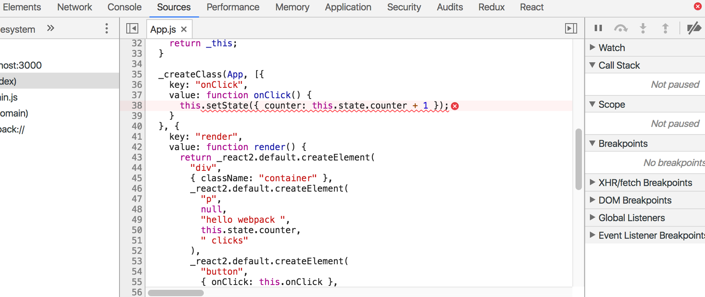
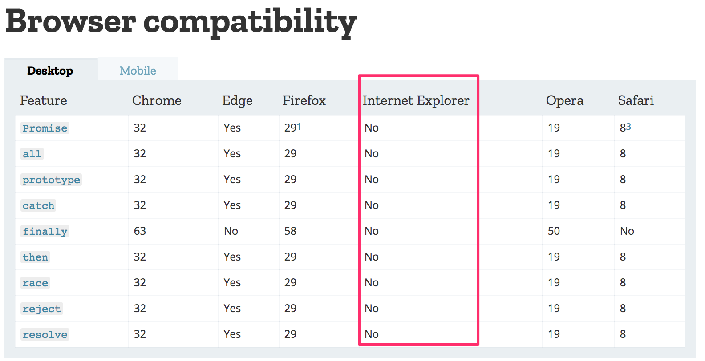
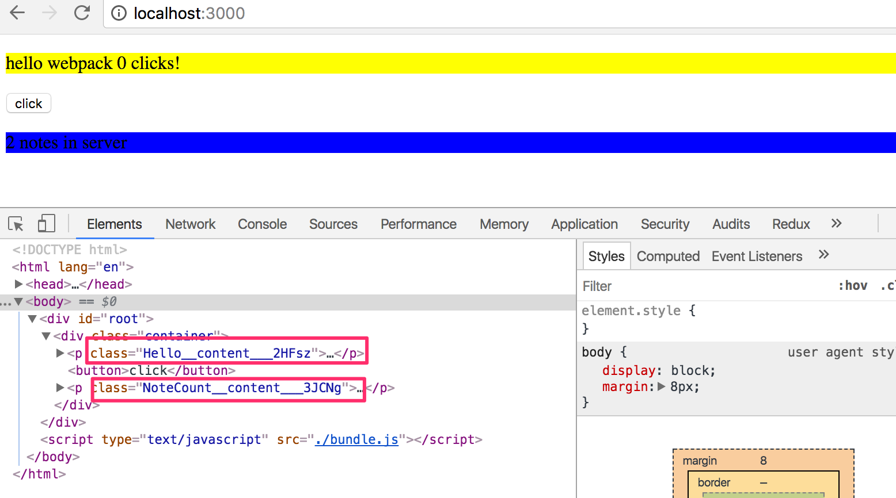

<div class="content">

### CSS

Lisätään sovellukseemme hieman CSS:ää. Tehdään tiedosto _src/index.css_

```css
.container {
  margin: 10;
  background-color: #dee8e4;
}
```

Määritellään tyyli käytettäväksi komponentissa _App_

```react
const App = () => (
  <div className="container">
    hello webpack
  </div>
)
```

ja importataan se tiedostossa _index.js_

```js
import './index.css';
```

Transpilointi hajoaa, ja CSS:ää varten onkin otettava käyttöön [css](https://webpack.js.org/loaders/css-loader/)- ja [style](https://webpack.js.org/loaders/style-loader/)-loaderit:

```js
{
  rules: [
    {
      test: /\.js$/,
      loader: 'babel-loader',
      query: {
        presets: ['env', 'react'],
      },
    },
    {
      test: /\.css$/,
      loaders: ['style-loader', 'css-loader'],
    },
  ];
}
```

[css-loaderin](https://webpack.js.org/loaders/css-loader/) tehtävänä on ladata _CSS_-tiedostot, ja [style-loader](https://webpack.js.org/loaders/style-loader/) generoi koodiin CSS:t sisältävän _style_-elementin.

Näin konfiguroituna CSS-määrittelyt sisällytetään sovelluksen Javascriptin sisältävään tiedostoon _main.js_. Sovelluksen päätiedostossa _index.html_ ei siis ole tarvetta erikseen ladata CSS:ää.

CSS voidaan tarpeen vaatiessa myös generoida omaan tiedostoonsa esim. [mini-css-extract-pluginin](https://github.com/webpack-contrib/mini-css-extract-plugin) avulla.

Kun loaderit asennetaan

```bash
npm install style-loader css-loader --save-dev
```

bundlaus toimii taas ja sovellus saa uudet tyylit.

### Webpack-dev-server

Sovelluskehitys onnistuu jo, mutta development workflow on suorastaan hirveä (alkaa jo muistuttaa Javalla tapahtuvaa sovelluskehitystä...), muutosten jälkeen koodin on bundlattava ja selain uudelleenladattava jos haluamme testata koodia.

Ratkaisun tarjoaa [webpack-dev-server](https://webpack.js.org/guides/development/#using-webpack-dev-server). Asennetaan se komennolla

```bash
npm install --save-dev webpack-dev-server
```

Määritellään dev-serverin käynnistävä npm-skripti:

```bash
{
  // ...
  "scripts": {
    "build": "webpack --mode=development",
    "start": "webpack-dev-server --mode=development"
  },
  // ...
}
```

Lisätään tiedostoon _webpack.config.js_ kenttä _devServer_

```js
const config = {
  entry: './src/index.js',
  output: {
    path: path.resolve(__dirname, 'dist'),
    filename: 'main.js',
  },
  devServer: {
    contentBase: path.resolve(__dirname, 'dist'),
    compress: true,
    port: 3000,
  },
  // ...
};
```

Komento _npm start_ käynnistää nyt dev-serverin porttiin, eli sovelluskehitys tapahtuu avaamalla tuttuun tapaan selain osoitteeseen <http://localhost:3000>. Kun teemme koodiin muutoksia, reloadaa selain automaattisesti itsensä.

Päivitysprosessi on nopea, dev-serveriä käytettäessä webpack ei bundlaa koodia normaaliin tapaan tiedostoksi _main.js_, bundlauksen tuotos on olemassa ainoastaan keskusmuistissa.

Laajennetaan koodia muuttamalla komponentin _App_ määrittelyä seuraavasti:

```react
class App extends React.Component {
  constructor() {
    super()
    this.state = {
      counter: 0
    }
  }

  render() {
    return (
      <div className="container">
        <p>hello webpack {this.state.counter} clicks</p>
        <button onClick={()=>this.setState({counter: this.state.counter+1})}>click</button>
      </div>
    )
  }
}
```

Kannattaa huomata, että virheviestit eivät renderöidy selaimeen kuten create-react-app:illa tehdyissä sovelluksissa, eli on seurattava tarkasti konsolia:


Sovellus toimii hyvin ja kehitys on melko sujuvaa.

### Sourcemappaus

Erotetaan napin klikkauksenkäsittelijä omaksi funktioksi:

```react
class App extends React.Component {
  constructor() {
    super()
    this.state = {
      counter: 0
    }
  }

  onClick() {
    this.setState({ counter: this.state.counter + 1 })
  }

  render() {
    return (
      <div className="container">
        <p>hello webpack {this.state.counter} clicks</p>
        <button onClick={this.onClick}>click</button>
      </div>
    )
  }
}
```

Sovellus ei enää toimi, ja konsoli kertoo virheestä


Tiedämme tietenkin nyt että virhe on metodissa onClick, mutta jos olisi kyse suuremmasta sovelluksesta, on virheilmoitus sikäli hyvin ikävä, että sen ilmoittama paikka:

<pre>
App.js:38 Uncaught TypeError: Cannot read property 'setState' of undefined
    at onClick (App.js:38)
</pre>

ei vastaa alkuperäisen koodin virheen sijaintia. Jos klikkaamme virheilmoitusta, huomaamme, että näytettävä koodi on jotain ihan muuta kuin kirjoittamamme koodi:



Haluamme tietenkin, että virheilmoitusten yhteydessä näytetään kirjoittamamme koodi.

Korjaus on onneksi hyvin helppo, pyydetään webpackia generoimaan bundlelle ns. [source map](https://webpack.js.org/configuration/devtool/), jonka avulla bundlea suoritettaessa tapahtuva virhe on mahdollista _mäpätä_ alkuperäisen koodin vastaavaan kohtaan.

Source map saadaan generoitua lisäämällä konfiguraatioon kenttä _devtool_ ja sen arvoksi 'source-map':

```js
const config = {
  entry: './src/index.js',
  output: {
    // ...
  },
  devServer: {
    // ...
  },
  devtool: 'source-map',
  // ..
};
```

Konfiguraatioiden muuttuessa webpack tulee käynnistää uudelleen, on tosin mahdollista konfiguroida webpack tarkkailemaan konfiguraatioiden muutoksia, mutta emme tee sitä.

Nyt virheilmoitus on hyvä


Source mapin käyttö mahdollistaa myös chromen debuggerin luontevan käytön


Kyseinen virhe on siis jo [osasta 1](/osa1#metodien-käyttö-ja-this) tuttu this:in kadottaminen. Korjataan ongelma määrittelemällä metodi uudelleen meille jo kovin tutulla syntaksilla:

```js
onClick = () => {
  this.setState({ counter: this.state.counter + 1 });
};
```

Tästä aiheutuu kuitenkin virheilmoitus


Virhe johtuu siitä, että käyttämämme syntaksi ei ole vielä mukana Javascriptin uusimmassa standardissa ES7. Saamme syntaksin käyttöön asentamalla [transform-class-properties](https://babeljs.io/docs/plugins/transform-class-properties/)-pluginin komennolla

```bash
npm install babel-plugin-transform-class-properties --save-dev
```

ja kehottamalla _babel-loader_:ia käyttämään pluginia:

```js
{
  test: /\.js$/,
  loader: 'babel-loader',
  query: {
    presets: ['env', 'react'],
    plugins: [require('babel-plugin-transform-class-properties')]
  }
}
```

### Koodin minifiointi

Kun sovellus viedään tuotantoon, on siis käytössä tiedostoon _main.js_ webpackin generoima koodi. Vaikka sovelluksemme sisältää omaa koodia vain muutaman rivin, on tiedoston _main.js_ koko 557450 tavua, sillä se sisältää myös kaiken React-kirjaston koodin. Tiedoston koollahan on sikäli väliä, että selain joutuu lataamaan tiedoston kun sovellusta aletaan käyttämään. Nopeilla internetyhteyksillä 557450 tavua ei sinänsä ole ongelma, mutta jos mukaan sisällytetään enemmän kirjastoja, alkaa sovelluksen lataaminen pikkuhiljaa hidastua etenkin mobiilikäytössä.

Jos tiedoston sisältöä tarkastelee, huomaa että sitä voisi optimoida huomattavasti koon suhteen esim. poistamalla kommentit. Tiedostoa ei kuitenkaan kannata lähteä optimoimaan käsin, sillä tarkoitusta varten on olemassa monia työkaluja.

Javascript-tiedostojen optimointiprosessista käytetään nimitystä _minifiointi_. Alan johtava työkalu tällä hetkellä lienee [UglifyJS](http://lisperator.net/uglifyjs/).

Webpackin versiosta 4 alkaen pluginia ei ole tarvinnut konfiguroida erikseen, riittää että muutetaan tiedoston _package.json_ määrittelyä siten, että koodin bundlaus tapahtuu _production_-moodissa:

```json
{
  "name": "webpack-osa7",
  "version": "0.0.1",
  "description": "practising webpack",
  "scripts": {
    "build": "webpack --mode=production",
    "start": "webpack-dev-server --mode=development"
  },
  "license": "MIT",
  "dependencies": {
    // ...
  },
  "devDependencies": {
    // ...
  }
}
```

Kun sovellus bundlataan uudelleen, pienenee tuloksena oleva _main.js_ mukavasti

```bash
-rw-r--r--  1 mluukkai  984178727  101944 Mar  3 21:29 main.js
```

Minifioinnin lopputulos on kuin vanhan liiton c-koodia, kommentit ja jopa turhat välilyönnit ja rivinvaihdot on poistettu ja muuttujanimet ovat yksikirjaimisia:

```js
function h(){if(!d){var e=u(p);d=!0;for(var t=c.length;t;){for(s=c,c=[];++f<t;)s&&s[f].run();f=-1,t=c.length}s=null,d=!1,function(e){if(o===clearTimeout)return clearTimeout(e);if((o===l||!o)&&clearTimeout)return o=clearTimeout,clearTimeout(e);try{o(e)}catch(t){try{return o.call(null,e)}catch(t){return o.call(this,e)}}}(e)}}a.nextTick=function(e){var t=new Array(arguments.length-1);if(arguments.length>1)
```

### Sovelluskehitys- ja tuotantokonfiguraatio

Lisätään sovellukselle backend. Käytetään jo tutuksi käynyttä muistiinpanoja tarjoavaa palvelua.

Talletetaan seuraava sisältö tiedostoon _db.json_

```json
{
  "notes": [
    {
      "important": true,
      "content": "HTML on helppoa",
      "id": "5a3b8481bb01f9cb00ccb4a9"
    },
    {
      "important": false,
      "content": "Mongo osaa tallettaa oliot",
      "id": "5a3b920a61e8c8d3f484bdd0"
    }
  ]
}
```

Tarkoituksena on konfiguroida sovellus webpackin avulla siten, että paikallisesti sovellusta kehitettäessä käytetään backendina portissa 3001 toimivaa json-serveriä.

Bundlattu tiedosto laitetaan sitten käyttämään todellista, osoitteessa <https://radiant-plateau-25399.herokuapp.com/api/notes> olevaa backendia.

Asennetaan _axios_, käynnistetään json-server ja muokataan komponenttia _App_ seuraavasti:

```react
class App extends React.Component {
  constructor() {
    super()
    this.state = {
      counter: 0,
      noteCount: 0
    }
  }

  componentDidMount() {
    axios.get('http://localhost:3001/notes').then(result => {
      this.setState({ noteCount: result.data.length })
    })
  }

  onClick = () => {
    this.setState({ counter: this.state.counter + 1 })
  }

  render() {
    return (
      <div className="container">
        <p>hello webpack {this.state.counter} clicks</p>
        <button onClick={this.onClick}>click</button>
        <p>{this.state.noteCount} notes in server</p>
      </div>
    )
  }
}
```

Koodissa on nyt kovakoodattuna sovelluskehityksessä käytettävän palvelimen osoite. Miten saamme osoitteen hallitusti muutettua osoittamaan internetissä olevaan backendiin bundlatessamme koodin?

Muutetaan _webpack.config.js_ oliosta [funktioksi](https://webpack.js.org/configuration/configuration-types/#exporting-a-function):

```js
const path = require('path');

const config = (env, argv) => {
  return {
    entry: './src/index.js',
    output: {
      // ...
    },
    devServer: {
      // ...
    },
    devtool: 'source-map',
    module: {
      // ...
    },
    plugins: [
      // ...
    ],
  };
};

module.exports = config;
```

Määrittely on muuten täysin sama, mutta aiemmin eksportattu olio on nyt määritellyn funktion paluuarvo. Funktio saa parametrit _env_ ja _argv_, joista jälkimmäisen avulla saamme selville npm-skriptissä määritellyn _moden_.

Webpackin [DefinePlugin](https://webpack.js.org/plugins/define-plugin/):in avulla voimme määritellä globaaleja _vakioarvoja_, joita on mahdollista käyttää bundlattavassa koodissa. Määritellään nyt vakio _BACKEND_URL_, joka saa eri arvon riippuen siitä ollaanko kehitysympäristössä vai tehdäänkö tuotantoon sopivaa bundlea:

```bash
const path = require('path')
const webpack = require('webpack')

const config = (env, argv) => {
  console.log('argv', argv.mode)

  const backend_url = argv.mode === 'production'
    ? 'https://radiant-plateau-25399.herokuapp.com/api/notes'
    : 'http://localhost:3001/notes'

  return {
    entry: './src/index.js',
    output: {
      path: path.resolve(__dirname, 'dist'),
      filename: 'main.js'
    },
    devServer: {
      contentBase: path.resolve(__dirname, "dist"),
      compress: true,
      port: 3000
    },
    devtool: 'source-map',
    module: {
      // ...
    },
    plugins: [
      new webpack.DefinePlugin({
        BACKEND_URL: JSON.stringify(backend_url)
      })
    ]
  }

}

module.exports = config
```

Määriteltyä vakiota käytetään koodissa seuraavasti:

```js
componentDidMount() {
  axios.get(BACKEND_URL)
    .then(result => {
      this.setState({noteCount: result.data.length})
    })
}
```

Jos kehitys- ja tuotantokonfiguraatio eriytyvät paljon, saattaa olla hyvä idea [eriyttää konfiguraatiot](https://webpack.js.org/guides/production/) omiin tiedostoihinsa.

Tuotantoversiota eli bundlattua sovellusta on mahdollista kokeilla lokaalisti suorittamalla komento

```bash
npx static-server
```

hakemistossa _dist_ jolloin sovellus käynnistyy oletusarvoisesti osoitteeseen <http://localhost:9080>.

### Polyfill

Sovelluksemme on valmis ja toimii muiden selaimien kohtuullisen uusilla versiolla, mutta Internet Explorerilla sovellus ei toimi. Syynä tähän on se, että _axiosin_ ansiosta koodissa käytetään [Promiseja](https://developer.mozilla.org/en-US/docs/Web/JavaScript/Reference/Global_Objects/Promise), mikään IE:n versio ei kuitenkaan niitä tue:



On paljon muutakin standardissa määriteltyjä asioita, joita IE ei tue, esim. niinkin harmiton komento kuin taulukoiden [find](https://developer.mozilla.org/en-US/docs/Web/JavaScript/Reference/Global_Objects/Array/find) ylittää IE:n kyvyt:


Tälläisessä tilanteessa normaali koodin transpilointi ei auta, sillä transpiloinnissa koodia käännetään uudemmasta Javascript-syntaksista vanhempaan, selaimien paremmin tukemaan syntaksiin. Promiset ovat syntaktisesti täysin IE:n ymmärrettävissä, IE:ltä vain puuttuu toteutus promisesta, samoin on tilanne taulukoiden suhteen, IE:llä taulukoiden _find_ on arvoltaan _undefined_.

Jos haluamme sovelluksen IE-yhteensopivaksi, tarvitsemme [polyfilliä](https://remysharp.com/2010/10/08/what-is-a-polyfill), eli koodia, joka lisää puuttuvan toiminnallisuuden vanhempiin selaimiin.

Polyfillaus on mahdollista hoitaa [Webpackin ja Babelin avulla](https://babeljs.io/docs/usage/polyfill/) tai asentamalla yksi monista tarjolla olevista polyfill-kirjastoista.

Esim. kirjaston [promise-polyfill](https://www.npmjs.com/package/promise-polyfill) tarjoaman polyfillin käyttö on todella helppoa, koodiin lisätään seuraava:

```js
import PromisePolyfill from 'promise-polyfill';

if (!window.Promise) {
  window.Promise = PromisePolyfill;
}
```

Jos globaalia _Promise_-olioa ei ole olemassa, eli selain ei tue promiseja, sijoitetaan polyfillattu promise globaaliin muuttujaan. Jos polyfillattu promise on hyvin toteutettu, muun koodin pitäisi toimia ilman ongelmia.

Kattavahko lista olemassaolevista polyfilleistä löytyy [täältä](https://github.com/Modernizr/Modernizr/wiki/HTML5-Cross-browser-Polyfills).

Selaimien yhteensopivuus käytettävien API:en suhteen kannattaakin tarkistaa esim. [https://caniuse.com](https://caniuse.com)-sivustolta tai [Mozillan sivuilta](https://developer.mozilla.org/en-US/).

### Eject

Create-react-app käyttää taustalla webpackia. Jos peruskonfiguraatio ei riitä, on projektit mahdollista [ejektoida](https://github.com/facebook/create-react-app/blob/master/packages/react-scripts/template/README.md#npm-run-eject), jolloin kaikki konepellin alla oleva magia häviää, ja konfiguraatiot tallettuvat hakemistoon _config_ ja muokattuun _package.json_-tiedostoon.

Jos create-react-app:illa tehdyn sovelluksen ejektoi, paluuta ei ole, sen jälkeen kaikesta konfiguroinnista on huolehdittava itse. Konfiguraatiot eivät ole triviaaleimmasta päästä ja create-react-appin ja ejektoinnin sijaan parempi vaihtoehto saattaa joskus olla tehdä itse koko webpack-konfiguraatio.

Ejektoidun sovelluksen konfiguraatioiden lukeminen on suositeltavaa ja sangen opettavaista!

## Lisää tyyleistä

Osissa 2 ja 6 on jo katsottu muutamaa tapaa tyylien lisäämiseen eli vanhan koulukunnan [yksittäistä CSS](/osa2#tyylien-lisääminen)-tiedostoa, [inline-tyylejä](/osa6#inline-tyylit) ja [UI-frameworkien](/osa6#valmiit-käyttöliittymätyylikirjastot) kuten Bootstrapin käyttöä.

Tapoja on [monia muitakin](https://survivejs.com/react/advanced-techniques/styling-react/), katsotaan vielä lyhyestä kahta tapaa.

### CSS-moduulit

Yksi CSS:n keskeisistä ongelmista on se, että CSS-määrittelyt ovat _globaaleja_. Suurissa tai jo keskikokoisissakin sovelluksissa tämä aiheuttaa ongelmia, sillä tiettyihin komponentteihin vaikuttavat monissa paikoissa määritellyt tyylit ja lopputulos voi olla vaikeasti ennakoitavissa.

Laitoksen [kurssilistasivun](https://www.cs.helsinki.fi/courses) alaosassa on itseasiassa eräs ilmentymä tälläisestä ikävästä bugista


Sivulla on monessa paikassa määriteltyjä tyylejä, osa määrittelyistä tulee Drupal-sisällönhallintajärjestelmän oletuskonfiguraatiosta, osa on Drupaliin laitoksella tehtyjä lisäyksiä, osa taas tulee sivun yläosan olemassaolevaa opetustarjontaa näyttävistä syksyllä lisätyistä komponenteista. Vika on niin hankala korjata, ettei kukaan ole viitsinyt sitä tehdä.

Demonstroidaan vastaavankaltaista ongelmatilannetta esimerkkisovelluksessamme.

Muutetaan esimerkkitiedostoamme siten, että komponentista _App_ irrotetaan osa toiminnallisuudesta komponentteihin _Hello_ ja _NoteCount_:

```react
import './Hello.css'

const Hello = ({ counter }) => (
  <p className="content">
    hello webpack {counter} clicks!
  </p>
)

export default Hello
```

```react
import './NoteCount.css'

const NoteCount = ({ noteCount }) => (
  <p className="content">
    {noteCount} notes in server
  </p>
)

export default NoteCount
```

Molemmat komponentit määrittelevät oman tyylitiedostonsa:

_Hello.css_

```CSS
.content {
  background-color: yellow;
}
```

_NoteCount.css_:

```CSS
.content {
  background-color: blue;
}
```

Koska molemmat komponentit käyttävät samaa CSS-luokan nimeä _content_, käykin niin että myöhemmin määritelty ylikirjoittaa aiemmin määritellyn, ja molempien tyyli on sama:


Perinteinen tapa kiertää ongelma on ollut käyttää monimutkaisempia CSS-luokan nimiä, esim. _Hello_container_ ja _NoteCount_container_, tämä muuttuu kuitenkin jossain vaiheessa varsin hankalaksi.

[CSS-moduulit](https://github.com/css-modules/css-modules) tarjoaa tähän erään ratkaisun.

Lyhyesti ilmaisten periaatteena on tehdä CSS-määrittelyistä lähtökohtaisesti lokaaleja, vain yhden komponentin kontekstissa voimassa olevia, joka taas mahdollistaa luontevien CSS-luokkanimien käytön. Käytännössä tämä lokaalius toteutetaan generoimalla konepellin alla CSS-luokille uniikit luokkanimet.

CSS-moduulit voidaan toteuttaa suoraan Webpackin css-loaderin avulla seuraten [sivun](https://www.triplet.fi/blog/practical-guide-to-react-and-css-modules/) ohjetta.

Muutetaan tyylejä käyttäviä komponentteja hiukan:

```react
import styles from './Hello.css'

const Hello = ({ counter }) => (
  <p className={styles.content}>
    hello webpack {counter} clicks!
  </p>
)

export default Hello
```

Erona siis edelliseen on se, että tyyliit "sijoitetaan muuttujaan" _styles_

```js
import styles from './Hello.css';
```

Nyt tyylitiedoston määrittelelyihin voi viitata muuttujan _styles_ kautta, ja CSS-luokan liittäminen tapahtuu seuraavasti

```react
<p className={styles.content}>
```

Vastaava muutos tehdään komponentille _NoteCount_.

Muutetaan sitten Webpackin konfiguraatiossa olevaa _css-loaderin_ määrittelyä siten että se enabloi [CSS-modulit](https://github.com/webpack-contrib/css-loader#modules):

```js
{
  test: /\.css$/,
  loaders: [
    'style-loader',
    'css-loader?modules&importLoaders=1&localIdentName=[name]__[local]___[hash:base64:5]&sourceMap&-minimize'
  ]
}
```

Nyt molemmat komponentit saavat omat tyylinsä. Konsolista tarkastelemalla huomaamme, että komponenttien luokille on generoitunut webpackin css-loaderin generoimat uniikit nimet:



CSS-luokan nimen muotoileva osa on _css-loaderin_ yhteydessä oleva

<pre>
localIdentName=[name]\_\_[local]\_\_\_[hash:base64:5]
</pre>

Jos olet aikeissa käyttää CSS-moduuleja, kannattaa vilkaista mitä kirjasto [react-css-modules](https://github.com/gajus/react-css-modules) tarjoaa.

### Styled components

Mielenkiintoisen näkökulman tyylien määrittelyyn tarjoaa ES6:n [tagged template literal](https://developer.mozilla.org/en-US/docs/Web/JavaScript/Reference/Template_literals) -syntaksia hyödyntävä [styled components](https://www.styled-components.com/) -kirjasto.

Tehdään styled-componentsin avulla esimerkkisovellukseemme muutama tyylillinen muutos:

```bash
import styled from 'styled-components'

const Button = styled.button `
  font-size: 1em;
  margin: 1em;
  padding: 0.25em 1em;
  border: 2px solid black;
  border-radius: 3px;
`

const Hello = ({ className, counter }) => (
  <p className={className}>
    hello webpack {counter} clicks
  </p>
)

const StyledHello = styled(Hello) `
  color: blue;
  font-weight: bold;
`

class App extends React.Component {
  //...

  render() {
    return (
      <div>
        <StyledHello counter={this.state.counter} />
        <Button onClick={this.onClick}>click</Button>
      </div>
    )
  }
}
```

Heti alussa luodaan HTML:n _button_-elementistä jalostettu versio ja sijoitetaan se muuttujaan _Button_:

```js
const Button = styled.button`
  font-size: 1em;
  margin: 1em;
  padding: 0.25em 1em;
  border: 2px solid black;
  border-radius: 3px;
`;
```

Tyylien määrittelyn syntaksi on varsin mielenkiintoinen.

Määritelty komponentti toimii kuten normaali _button_ ja sovellus renderöi sen normaaliin tapaan:

```html
<button onClick="{this.onClick}">click</button>
```

Seuraavaksi koodi määrittelee normaalin React-komponentin

```react
const Hello = ({ className, counter }) => (
  <p className={className}>
    hello webpack {counter} clicks
  </p>
)
```

ja lisää tälle tyylit metodin _styled_ avulla:

```js
const StyledHello = styled(Hello)`
  color: blue;
  font-weight: bold;
`;
```

Muuttujaan _StyledHello_ sijoitettua tyyleillä jalostettua komponenttia käytetään kuten alkuperäistä:

```bash
<StyledHello counter={this.state.counter} />
```

Sovelluksen ulkoasu seuraavassa:


</div>
