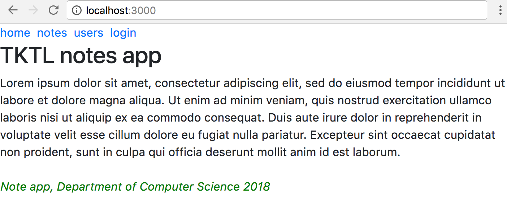
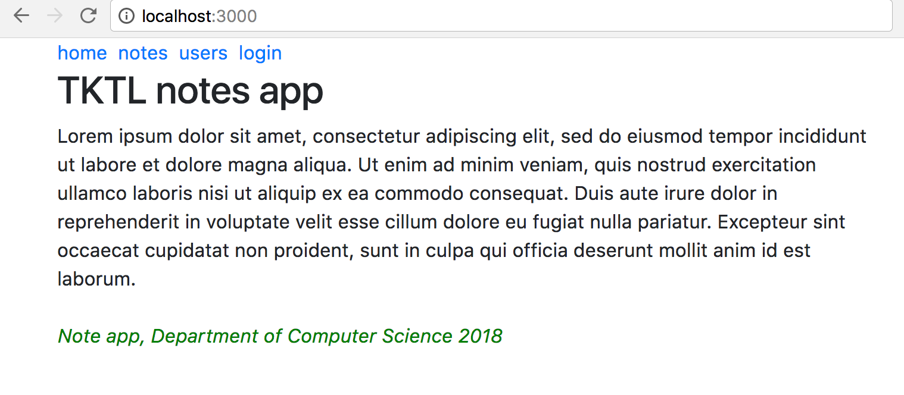
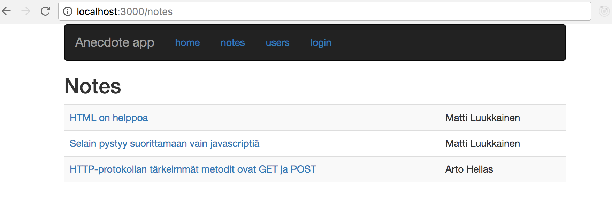
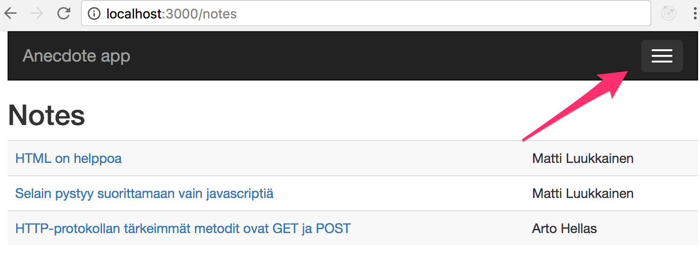
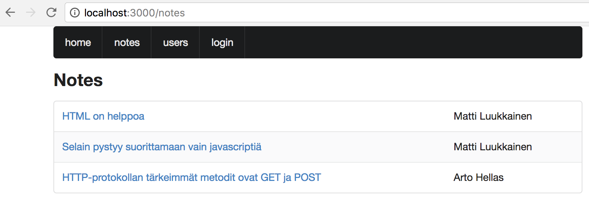
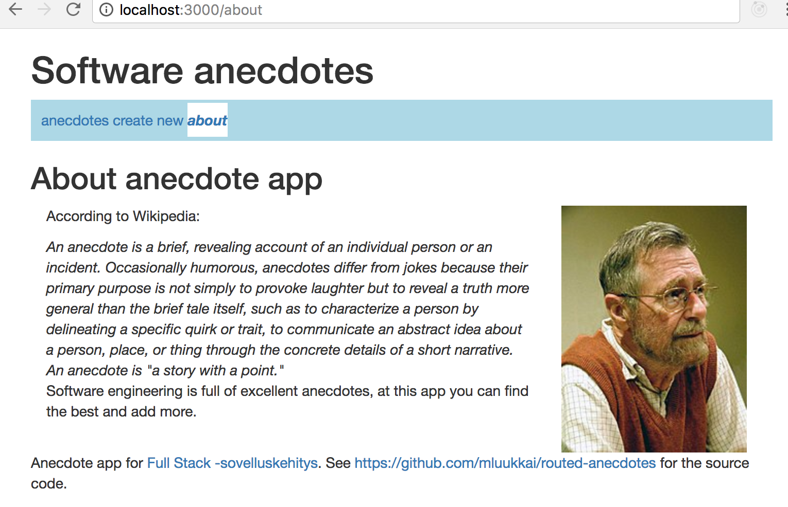
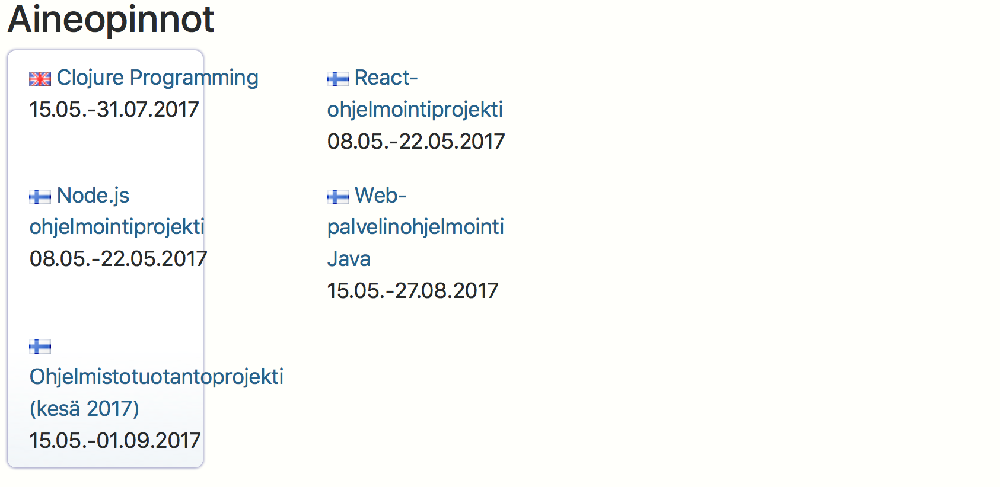

<div class="content">

Osassa 2 jo katsottu kahta tapaa tyylien lisäämiseen eli vanhan koulukunnan [yksittäistä CSS](/osa2#tyylien-lisääminen)-tiedostoa, [inline-tyylejä](/osa6#inline-tyylit). Kolme tapaa...

### Valmiit käyttöliittymätyylikirjastot

Eräs lähestymistapa sovelluksen tyylien määrittelyyn on valmiin "UI frameworkin", eli suomeksi ehkä käyttöliittymätyylikirjaston käyttö.

Ensimmäinen laajaa kuuluisuutta saanut UI framework oli Twitterin kehittämä [Bootstrap](https://getbootstrap.com/), joka lienee edelleen UI frameworkeista eniten käytetty. Viime aikoina UI frameworkeja on noussut kuin sieniä sateella. Valikoima on niin iso, ettei tässä kannata edes yrittää tehdä tyhjentävää listaa.

Monet UI-frameworkit sisältävät web-sovellusten käyttöön valmiiksi määriteltyjä teemoja sekä "komponentteja", kuten painikkeita, menuja, taulukkoja. Termi komponentti on edellä kirjotettu hipsuissa sillä kyse ei ole samasta asiasta kuin React-komponentti. Useimmiten UI-frameworkeja käytetään sisällyttämällä sovellukseen frameworkin määrittelemät CSS-tyylitiedostot sekä Javascript-koodi.

Monesta UI-frameworkista on tehty React-ystävällisiä versiota, joissa UI-frameworkin avulla määritellyistä "komponenteista" on tehty React-komponentteja. Esim. Bootstrapista on olemassa parikin React-versiota [reactstrap](http://reactstrap.github.io/) ja [react-bootstrap](https://react-bootstrap.github.io/).

Katsotaan seuraavaksi kahta UI-framworkia bootstrapia ja [semantic ui](https://semantic-ui.com/):ta.
Lisätään molempien avulla samantapaiset tyylit luvun [React-router](/osa6/#react-router) sovellukseen.

### react bootstrap

Aloitetaan bootstrapista, käytetään kirjastoa [react-bootstrap](https://react-bootstrap.github.io/).

Asennetaan kirjasto suorittamalla komento

```bash
npm install --save react-bootstrap
```

Lisätään sitten sovelluksen _public/index.html_ tiedoston _head_-tagin sisään bootstrapin css-määrittelyt lataava rivi:

```html
<head>
  <link
    rel="stylesheet"
    href="https://maxcdn.bootstrapcdn.com/bootstrap/3.3.7/css/bootstrap.min.css"
    integrity="sha384-BVYiiSIFeK1dGmJRAkycuHAHRg32OmUcww7on3RYdg4Va+PmSTsz/K68vbdEjh4u"
    crossorigin="anonymous"
  />
  // ...
</head>
```

Kun sovellus ladataan uudelleen, näyttää se jo aavistuksen tyylikkäämmältä:



Bootstrapissa koko sivun sisältö renderöidään yleensä [container](https://getbootstrap.com/docs/4.0/layout/overview/#containers):ina, eli käytännössä koko sovelluksen ympäröivä _div_-elementti merkitään luokalla _container_:

```react
// ...

class App extends React.Component {
  // ...
  render() {
    return (
      <div className="container">
        // ...
      </div>
    )
  }
}
```

Sovelluksen ulkoasu muuttuu siten, että sisältö ei ole enää yhtä kiinni selaimen reunoissa:



Muutetaan seuraavaksi komponenttia _Notes_ siten, että se renderöi muistiinpanojen listan [taulukkona](https://getbootstrap.com/docs/4.0/content/tables/). React bootstrap tarjoaa valmiin komponentin [Table](https://react-bootstrap.github.io/components/table/), joten CSS-luokan käyttöön ei ole tarvetta.

```react
const Notes = ({notes}) => (
  <div>
    <h2>Notes</h2>
    <Table striped>
      <tbody>
        {notes.map(note=>
          <tr key={note.id}>
            <td>
              <Link to={`/notes/${note.id}`}>{note.content}</Link>
            </td>
            <td>
              {note.user}
            </td>
          </tr>
        )}
      </tbody>
    </Table>
  </div>
)
```

Ulkoasu on varsin tyylikäs:


Huomaa, että koodissa käytettävät React bootstrapin komponentit täytyy importata, eli koodiin on lisättävä:

```js
import { Table } from 'react-bootstrap';
```

#### Lomake

Parannellaan seuraavaksi näkymän _Login_ kirjautumislomaketta Bootstrapin [lomakkeiden](https://getbootstrap.com/docs/4.0/components/forms/) avulla.

React bootstrap tarjoaa valmiit [komponentit](https://react-bootstrap.github.io/components/forms/) myös lomakkeiden muodostamiseen (dokumentaatio tosin ei ole paras mahdollinen):

```react
const Login = ({onLogin, history}) => {
  // ...
  return (
    <div>
      <h2>login</h2>
      <form onSubmit={onSubmit}>
        <FormGroup>
          <ControlLabel>username:</ControlLabel>
          <FormControl
            type="text"
            name="username"
          />
          <ControlLabel>password:</ControlLabel>
          <FormControl
            type="password"
          />
          <Button bsStyle="success" type="submit">login</Button>
        </FormGroup>
      </form>
    </div>
)}
```

Importoitavien komponenttien määrä kasvaa:

```js
import {
  Table,
  FormGroup,
  FormControl,
  ControlLabel,
  Button,
} from 'react-bootstrap';
```

Lomake näyttää parantelun jälkeen seuraavalta:


#### Notifikaatio

Toteutetaan sovellukseen kirjautumisen jälkeinen _notifikaatio_:


Asetetaan notifikaatio kirjautumisen yhteydessä komponentin _App_ tilan kenttään _message_:

```js
login = user => {
  this.setState({ user, message: `welcome ${user}` });
  setTimeout(() => {
    this.setState({ message: null });
  }, 10000);
};
```

ja renderöidään viesti Bootstrapin [Alert](https://getbootstrap.com/docs/4.0/components/alerts/)-komponentin avulla. React bootstrap tarjoaa tähän jälleen valmiin [React-komponentin](https://react-bootstrap.github.io/components/alerts/):

```react
{(this.state.message &&
  <Alert color="success">
    {this.state.message}
  </Alert>
)}
```

#### Navigaatiorakenne

Muutetaan vielä lopuksi sovelluksen navigaatiomenu käyttämään Bootstrapin [Navbaria](https://getbootstrap.com/docs/4.0/components/navbar/). Tähänkin React bootstrap tarjoaa [valmiit komponentit](https://react-bootstrap.github.io/components/navbar/#navbars-mobile-friendly), dokumentaatio on hieman kryptistä, mutta trial and error johtaa lopulta toimivaan ratkaisuun:

```bash
<Navbar inverse collapseOnSelect>
  <Navbar.Header>
    <Navbar.Brand>
      Anecdote app
    </Navbar.Brand>
    <Navbar.Toggle />
  </Navbar.Header>
  <Navbar.Collapse>
    <Nav>
      <NavItem href="#">
        <Link to="/">home</Link>
      </NavItem>
      <NavItem href="#">
        <Link to="/notes">notes</Link>
      </NavItem>
      <NavItem href="#">
        <Link to="/users">users</Link>
      </NavItem>
      <NavItem>
        {this.state.user
          ? <em>{this.state.user} logged in</em>
          : <Link to="/login">login</Link>
        }
      </NavItem>
    </Nav>
  </Navbar.Collapse>
</Navbar>
```

Ulkoasu on varsin tyylikäs



Jos selaimen kokoa kaventaa, huomaamme että menu "kollapsoituu" ja sen saa näkyville vain klikkaamalla:



Bootstrap ja valtaosa tarjolla olevista UI-frameworkeista tuottavat [responsiivisia](https://en.wikipedia.org/wiki/Responsive_web_design) näkymiä, eli sellaisia jotka renderöityvät vähintään kohtuullisesti monen kokoisilla näytöillä.

Chromen konsolin avulla on mahdollista simuloida sovelluksen käyttöä erilaisilla mobiilipäätteillä


Sovellus toimii hyvin, mutta konsoliin vilkaisu paljastaa erään ikävän detaljin:


Syy valituksiin on navigaatiorakenteessa

```bash
<NavItem href="#">
  <Link to="/">home</Link>
</NavItem>
```

Nämä sisäkkäiset komponentit sisältävät molemmat _a_-tagin ja React hermostuu tästä.

Ongelma on ikävä ja sen kiertäminen on toki mahdollista, katso esim.
<https://serverless-stack.com/chapters/adding-links-in-the-navbar.html>

Esimerkin sovelluksen koodi kokonaisuudessaan [täällä](https://github.com/FullStack-HY/FullStack-Hy.github.io/wiki/bootstrap).

### Semantic UI

Olen käyttänyt bootstrapia vuosia, mutta siirryin hiljattain [Semantic UI](https://semantic-ui.com/):n käyttäjäksi. Kurssin tehtävien [palautusovellus](https://studies.cs.helsinki.fi/fs-stats) on tehty Semanticilla ja kokemukset ovat olleet rohkaisevia, erityisesti semanticin [React-tuki](https://react.semantic-ui.com) on ensiluokkainen ja dokumentaatiokin huomattavasti parempi kuin bootstrapissa.

Lisätään nyt [React-router](/osa6/#react-router)-sovellukselle edellisen luvun tapaan tyylit semanticilla.

Aloitetaan asentamalla [semantic-ui-react](https://react.semantic-ui.com)-kirjasto:

```bash
npm install --save semantic-ui-react
```

Lisätään sitten sovelluksen tiedostoon _public/index.html_ head-tagin sisään semanticin css-määrittelyt lataava rivi (joka löytyy [tästä](https://react.semantic-ui.com/usage#content-delivery-network-cdn)):

```html
<head>
  <link rel="stylesheet" href="//cdnjs.cloudflare.com/ajax/libs/semantic-ui/2.2.12/semantic.min.css"></link>
  // ...
</head>
```

Sijoitetaan koko sovelluksen renderöimä sisältö Semanticin komponentin [Container](https://react.semantic-ui.com/elements/container) sisälle.

Semanticin dokumentaatio sisältää jokaisesta komponentista useita esimerkkikoodinpätkiä, joiden avulla komponenttien käytön periaatteet on helppo omaksua:


Muutetaan komponentin App uloin _div_-elementti _Containeriksi_:

```bash
import { Container } from 'semantic-ui-react'

// ...

class App extends React.Component {
  // ...
  render() {
    return (
      <Container>
        // ...
      </Container>
    )
  }
}
```

Sivun sisältö ei ole enää reunoissa kiinni:


Edellisen luvun tapaan, renderöidään muistiinpanot taulukkona, komponentin [Table](https://react.semantic-ui.com/collections/table) avulla. Koodi näyttää seuraavalta

```react
import { Table } from 'semantic-ui-react'

const Notes = ({ notes }) => (
  <div>
    <h2>Notes</h2>
    <Table striped celled>
      <Table.Body>
        {notes.map(note =>
          <Table.Row key={note.id}>
            <Table.Cell>
              <Link to={`/notes/${note.id}`}>{note.content}</Link>
            </Table.Cell>
            <Table.Cell>
              {note.user}
            </Table.Cell>
          </Table.Row>
        )}
      </Table.Body>
    </Table>
  </div>
)
```

Muistiinpanojen lista näyttää seuraavalta:


#### Lomake

Otetaan kirjautumissivulla käyttöön Semanticin [Form](https://react.semantic-ui.com/collections/form)-komponentti:

```
import { Form, Button } from 'semantic-ui-react'

const Login = ({ onLogin, history }) => {
  const onSubmit = (event) => {
    // ...
  }
  return (
    <div>
      <h2>login</h2>
      <Form onSubmit={onSubmit}>
        <Form.Field>
          <label>username</label>
          <input name='username' />
        </Form.Field>
        <Form.Field>
          <label>password</label>
          <input type='password' />
        </Form.Field>
        <Button type='submit'>login</Button>
      </Form>
    </div>
  )
}
```

Ulkoasu näyttää seuraavalta:


#### Notifikaatio

Edellisen luvun tapaan, toteutetaan sovellukseen kirjautumisen jälkeinen _notifikaatio_:


Kuten edellisessä luvussa, asetetaan notifikaatio kirjautumisen yhteydessä komponentin _App_ tilan kenttään _message_:

```js
login = user => {
  this.setState({ user, message: `welcome ${user}` });
  setTimeout(() => {
    this.setState({ message: null });
  }, 10000);
};
```

ja renderöidään viesti käyttäen komponenttia [Message](https://react.semantic-ui.com/collections/message):

```react
{(this.state.message &&
  <Message success>
    {this.state.message}
  </Message>
)}
```

#### Navigaatiorakenne

Navigaatiorakenne toteutetaan komponentin [Menu](https://react.semantic-ui.com/collections/menu) avulla:

```bash
<Menu inverted>
  <Menu.Item link>
    <Link to="/">home</Link>
  </Menu.Item>
  <Menu.Item link>
    <Link to="/notes">notes</Link>
  </Menu.Item>
  <Menu.Item link>
    <Link to="/users">users</Link>
  </Menu.Item>
  <Menu.Item link>
    {this.state.user
      ? <em>{this.state.user} logged in</em>
      : <Link to="/login">login</Link>
    }
  </Menu.Item>
</Menu>
```

Lopputulos näyttää seuraavalta:



Bootstrapin yhteydessä esiintynyttä sisäkkäisen _a_-tagien ongelmaa ei semanticin kanssa ole.

Esimerkin sovelluksen koodi kokonaisuudessaan [täällä](https://github.com/FullStack-HY/FullStack-Hy.github.io/wiki/semantic-ui).

### Loppuhuomioita

Ero react-bootstrapin ja semantic-ui-reactin välillä ei ole suuri. On makuasia kummalla tuotettu ulkoasu on tyylikkäämpi. Oma vuosia kestäneen bootstrapin käytön jälkeinen siirtymiseni semanticiin johtuu semanticin saumattomammasta React-tuesta, laajemmasta valmiiden komponenttien valikoimasta ja paremmasta sekä selkeämmästä dokumentaatiosta. Semantic UI projektin kehitystyön jatkuvuuden suhteen on kuitenkin viime aikoina ollut ilmoilla muutamia [kysymysmerkkejä](https://github.com/Semantic-Org/Semantic-UI/issues/6109), ja tilannetta kannattaakin seurata.

Esimerkissä käytettiin UI-frameworkeja niiden React-integraatiot tarjoavien kirjastojen kautta.

Sen sijaan että käytimme kirjastoa [React bootstrap](https://react-bootstrap.github.io/), olisimme voineet aivan yhtä hyvin käyttää Bootstrapia suoraan, liittämällä HTML-elementteihin CSS-luokkia. Eli sen sijaan että määrittelimme esim. taulukon komponentin _Table_ avulla

```bash
<Table striped>
  // ...
</Table>
```

olisimme voineet käyttää normaalia HTML:n taulukkoa _table_ ja CSS-luokkaa

```bash
<table className="table striped">
  // ...
</table>
```

Taulukon määrittelyssä React bootstrapin tuoma etu ei ole suuri.

Tiiviimmän ja ehkä paremmin luettavissa olevan kirjoitusasun lisäksi toinen etu React-kirjastoina olevissa UI-frameworkeissa on se, että kirjastojen mahdollisesti käyttämä Javascript-koodi on sisällytetty React-komponentteihin. Esim. osa Bootstrapin komponenteista edellyttää toimiakseen muutamaakin ikävää [Javascript-riippuvuutta](https://getbootstrap.com/docs/4.0/getting-started/introduction/#js) joita emme mielellään halua React-sovelluksiin sisällyttää.

React-kirjastoina tarjottavien UI-frameworkkien ikävä puoli verrattuna frameworkin "suoraan käyttöön" on React-kirjastojen API:n mahdollinen epästabiilius ja osittain huono dokumentaatio. Tosin [react-semanticin](https://react.semantic-ui.com) suhteen tilanne on paljon parempi kuin monien muiden UI-frameworkien sillä kyseessä on virallinen React-integraatio.

Kokonaan toinen kysymys on se kannattaako UI-frameworkkeja ylipäätän käyttää. Kukin muodostakoon oman mielipiteensä, mutta CSS:ää taitamattomalle ja puutteellisilla design-taidoilla varustetulle ne ovat varsin käyttökelpoisia työkaluja.

### Muita UI-frameworkeja

Luetellaan tässä kaikesta huolimatta muitakin UI-frameworkeja. Jos oma suosikkisi ei ole mukana, tee pull request

- <http://www.material-ui.com/>
- <https://bulma.io/>
- <https://ant.design/>
- <https://foundation.zurb.com/>

Alun perin tässä osassa oli tarkoitus käyttää [Material UI](http://www.material-ui.com/):ta, mutta kirjasto on juuri nyt kiivaan kehityksen alla ennen version 1.0 julkaisemista ja osa dokumentaation esimerkeistä ei toiminut uusimmalla versiolla. Voikin olla viisainta odotella Materialin kanssa versiota 1.0.

</div>
<div class="tasks">

### Tehtäviä

#### 7.4: styled anecdotes, step1

Ota käyttöön bootstrap (tai valitsemasi framework) ja renderöi anekdoottien lista tyylikkäämmin, esim. bootstrapissa [ListGroup](https://react-bootstrap.github.io/components/list-group/)-komponentin tai Semanticissa [Tablen](https://react.semantic-ui.com/collections/table) avulla:


#### 7.5: styled anecdotes, step2

Tutustu [bootstrapin](https://react-bootstrap.github.io/layout/grid/) tai [semanticin](https://react.semantic-ui.com/collections/grid) grideihin ja muuta niiden avulla sovelluksen _about_-sivua siten, että oikeassa reunassa näytetään jonkun kuuluisan tietojenkäsittelijän kuva:



#### 7.6: styled anecdotes, step3

Lisää vielä vapaavalintaisia tyylejä valitsemallasi UI frameworkilla. Voit merkata tehtävän, jos käytät aikaa vapaavalintaisten tyylien lisäämiseen noin 30 minuuttia.

</div>

<div class="content">

### Lisää tyyleistä

Osissa 2 ja 6 on jo katsottu muutamaa tapaa tyylien lisäämiseen eli vanhan koulukunnan [yksittäistä CSS](/osa2#tyylien-lisääminen)-tiedostoa, [inline-tyylejä](/osa6#inline-tyylit) ja [UI-frameworkien](/osa6#valmiit-käyttöliittymätyylikirjastot) kuten Bootstrapin käyttöä.

Tapoja on [monia muitakin](https://survivejs.com/react/advanced-techniques/styling-react/), katsotaan vielä lyhyestä kahta tapaa.

### CSS-moduulit

Yksi CSS:n keskeisistä ongelmista on se, että CSS-määrittelyt ovat _globaaleja_. Suurissa tai jo keskikokoisissakin sovelluksissa tämä aiheuttaa ongelmia, sillä tiettyihin komponentteihin vaikuttavat monissa paikoissa määritellyt tyylit ja lopputulos voi olla vaikeasti ennakoitavissa.

Laitoksen [kurssilistasivun](https://www.cs.helsinki.fi/courses) alaosassa on itseasiassa eräs ilmentymä tälläisestä ikävästä bugista



Sivulla on monessa paikassa määriteltyjä tyylejä, osa määrittelyistä tulee Drupal-sisällönhallintajärjestelmän oletuskonfiguraatiosta, osa on Drupaliin laitoksella tehtyjä lisäyksiä, osa taas tulee sivun yläosan olemassaolevaa opetustarjontaa näyttävistä syksyllä lisätyistä komponenteista. Vika on niin hankala korjata, ettei kukaan ole viitsinyt sitä tehdä.

Demonstroidaan vastaavankaltaista ongelmatilannetta esimerkkisovelluksessamme.

Muutetaan esimerkkitiedostoamme siten, että komponentista _App_ irrotetaan osa toiminnallisuudesta komponentteihin _Hello_ ja _NoteCount_:

```react
import './Hello.css'

const Hello = ({ counter }) => (
  <p className="content">
    hello webpack {counter} clicks!
  </p>
)

export default Hello
```

```react
import './NoteCount.css'

const NoteCount = ({ noteCount }) => (
  <p className="content">
    {noteCount} notes in server
  </p>
)

export default NoteCount
```

Molemmat komponentit määrittelevät oman tyylitiedostonsa:

_Hello.css_

```CSS
.content {
  background-color: yellow;
}
```

_NoteCount.css_:

```CSS
.content {
  background-color: blue;
}
```

Koska molemmat komponentit käyttävät samaa CSS-luokan nimeä _content_, käykin niin että myöhemmin määritelty ylikirjoittaa aiemmin määritellyn, ja molempien tyyli on sama:


Perinteinen tapa kiertää ongelma on ollut käyttää monimutkaisempia CSS-luokan nimiä, esim. _Hello_container_ ja _NoteCount_container_, tämä muuttuu kuitenkin jossain vaiheessa varsin hankalaksi.

[CSS-moduulit](https://github.com/css-modules/css-modules) tarjoaa tähän erään ratkaisun.

Lyhyesti ilmaisten periaatteena on tehdä CSS-määrittelyistä lähtökohtaisesti lokaaleja, vain yhden komponentin kontekstissa voimassa olevia, joka taas mahdollistaa luontevien CSS-luokkanimien käytön. Käytännössä tämä lokaalius toteutetaan generoimalla konepellin alla CSS-luokille uniikit luokkanimet.

CSS-moduulit voidaan toteuttaa suoraan Webpackin css-loaderin avulla seuraten [sivun](https://www.triplet.fi/blog/practical-guide-to-react-and-css-modules/) ohjetta.

Muutetaan tyylejä käyttäviä komponentteja hiukan:

```react
import styles from './Hello.css'

const Hello = ({ counter }) => (
  <p className={styles.content}>
    hello webpack {counter} clicks!
  </p>
)

export default Hello
```

Erona siis edelliseen on se, että tyyliit "sijoitetaan muuttujaan" _styles_

```js
import styles from './Hello.css';
```

Nyt tyylitiedoston määrittelelyihin voi viitata muuttujan _styles_ kautta, ja CSS-luokan liittäminen tapahtuu seuraavasti

```react
<p className={styles.content}>
```

Vastaava muutos tehdään komponentille _NoteCount_.

Muutetaan sitten Webpackin konfiguraatiossa olevaa _css-loaderin_ määrittelyä siten että se enabloi [CSS-modulit](https://github.com/webpack-contrib/css-loader#modules):

```js
{
  test: /\.css$/,
  loaders: [
    'style-loader',
    'css-loader?modules&importLoaders=1&localIdentName=[name]__[local]___[hash:base64:5]&sourceMap&-minimize'
  ]
}
```

Nyt molemmat komponentit saavat omat tyylinsä. Konsolista tarkastelemalla huomaamme, että komponenttien luokille on generoitunut webpackin css-loaderin generoimat uniikit nimet:


CSS-luokan nimen muotoileva osa on _css-loaderin_ yhteydessä oleva

<pre>
localIdentName=[name]\_\_[local]\_\_\_[hash:base64:5]
</pre>

Jos olet aikeissa käyttää CSS-moduuleja, kannattaa vilkaista mitä kirjasto [react-css-modules](https://github.com/gajus/react-css-modules) tarjoaa.

### Styled components

Mielenkiintoisen näkökulman tyylien määrittelyyn tarjoaa ES6:n [tagged template literal](https://developer.mozilla.org/en-US/docs/Web/JavaScript/Reference/Template_literals) -syntaksia hyödyntävä [styled components](https://www.styled-components.com/) -kirjasto.

Tehdään styled-componentsin avulla esimerkkisovellukseemme muutama tyylillinen muutos:

```bash
import styled from 'styled-components'

const Button = styled.button `
  font-size: 1em;
  margin: 1em;
  padding: 0.25em 1em;
  border: 2px solid black;
  border-radius: 3px;
`

const Hello = ({ className, counter }) => (
  <p className={className}>
    hello webpack {counter} clicks
  </p>
)

const StyledHello = styled(Hello) `
  color: blue;
  font-weight: bold;
`

class App extends React.Component {
  //...

  render() {
    return (
      <div>
        <StyledHello counter={this.state.counter} />
        <Button onClick={this.onClick}>click</Button>
      </div>
    )
  }
}
```

Heti alussa luodaan HTML:n _button_-elementistä jalostettu versio ja sijoitetaan se muuttujaan _Button_:

```js
const Button = styled.button`
  font-size: 1em;
  margin: 1em;
  padding: 0.25em 1em;
  border: 2px solid black;
  border-radius: 3px;
`;
```

Tyylien määrittelyn syntaksi on varsin mielenkiintoinen.

Määritelty komponentti toimii kuten normaali _button_ ja sovellus renderöi sen normaaliin tapaan:

```html
<button onClick="{this.onClick}">click</button>
```

Seuraavaksi koodi määrittelee normaalin React-komponentin

```react
const Hello = ({ className, counter }) => (
  <p className={className}>
    hello webpack {counter} clicks
  </p>
)
```

ja lisää tälle tyylit metodin _styled_ avulla:

```js
const StyledHello = styled(Hello)`
  color: blue;
  font-weight: bold;
`;
```

Muuttujaan _StyledHello_ sijoitettua tyyleillä jalostettua komponenttia käytetään kuten alkuperäistä:

```bash
<StyledHello counter={this.state.counter} />
```

Sovelluksen ulkoasu seuraavassa:


</div>
