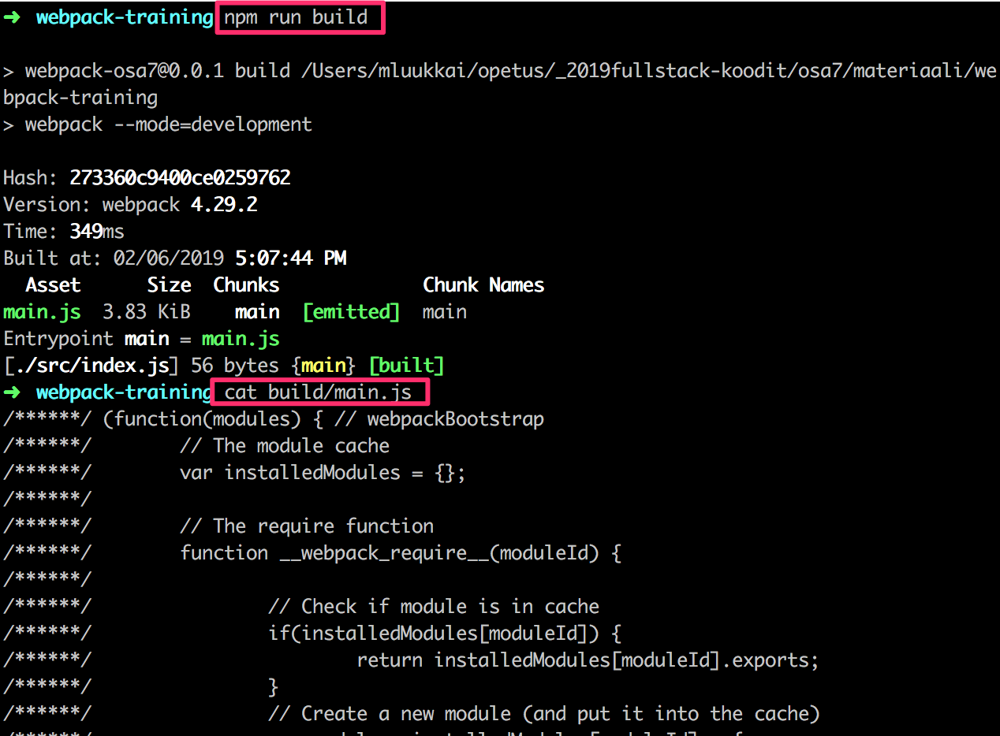
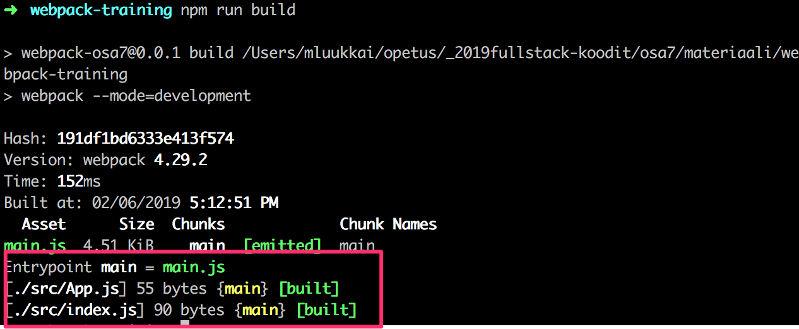
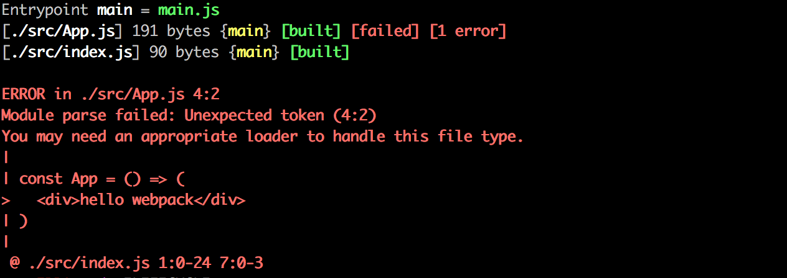
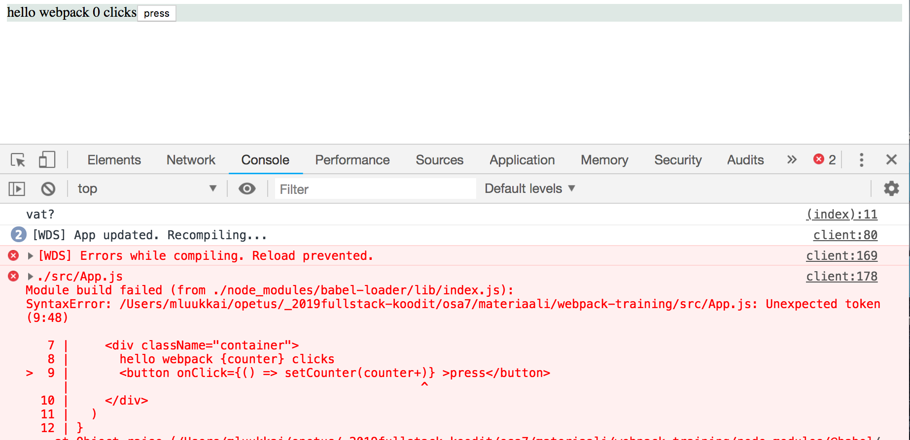
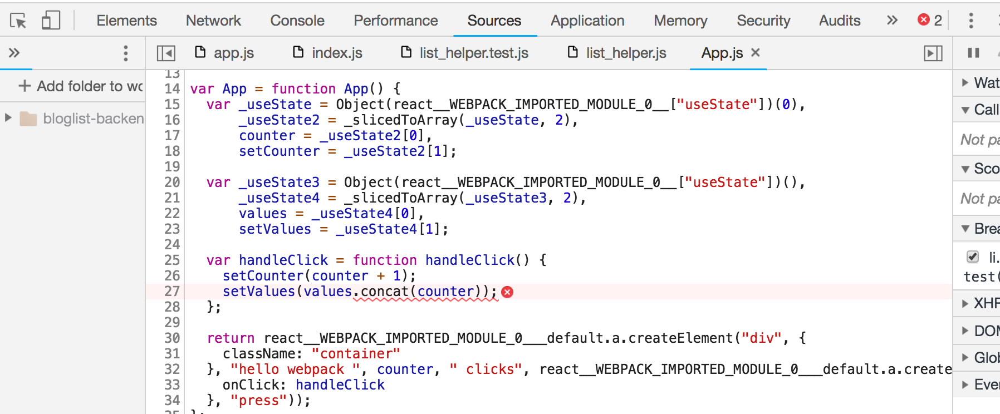
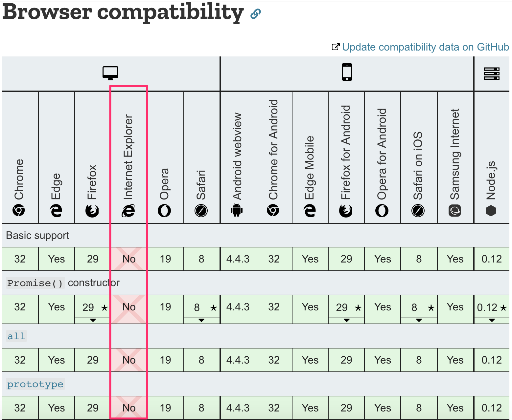

<div class="content">

React oli aiemmin jossain määrin kuuluisa siitä, että sovelluskehityksen edellyttämien työkalujen konfigurointi on ollut hyvin hankalaa. Kiitos [create-react-app](https://github.com/facebookincubator/create-react-app):in, sovelluskehitys Reactilla on kuitenkin nykyään tuskatonta, parempaa työskentelyflowta on tuskin ollut koskaan Javascriptillä tehtävässä selainpuolen sovelluskehityksessä.

Emme voi kuitenkaan turvautua ikuisesti create-react-app:in magiaan ja nyt onkin aika selvittää mitä kaikkea taustalla on. Avainasemassa React-sovelluksen toimintakuntoon saattamisessa on [webpack](https://webpack.js.org/)-niminen työkalu.

### bundlaus

Olemme toteuttaneet sovelluksia jakamalla koodin moduuleihin, joita on <i>importattu</i> niitä tarvitseviin paikkoihin. Vaikka ES6-moduulit ovatkin Javascript-standardissa määriteltyjä, ei mikään selain vielä osaa käsitellä moduuleihin jaettua koodia.

Selainta varten moduuleissa oleva koodi <i>bundlataan</i>, eli siitä muodostetaan yksittäinen, kaiken koodin sisältävä tiedosto.
Kun veimme Reactilla toteutetun frontendin tuotantoon osan 3 luvussa [Frontendin tuotantoversio](/osa3/sovellus_internetiin#frontendin-tuotantoversio), suoritimme bundlauksen komennolla _npm run build_. Konepellin alla kyseinen npm-skripti suorittaa bundlauksen webpackia hyväksi käyttäen. Tuloksena on joukko hakemistoon <i>build</i> sijoitettavia tiedostoja:

<pre>
├── asset-manifest.json
├── favicon.ico
├── index.html
├── manifest.json
├── precache-manifest.8082e70dbf004a0fe961fc1f317b2683.js
├── service-worker.js
└── static
    ├── css
    │   ├── main.f9a47af2.chunk.css
    │   └── main.f9a47af2.chunk.css.map
    └── js
        ├── 1.578f4ea1.chunk.js
        ├── 1.578f4ea1.chunk.js.map
        ├── main.8209a8f2.chunk.js
        ├── main.8209a8f2.chunk.js.map
        ├── runtime~main.229c360f.js
        └── runtime~main.229c360f.js.map
</pre>

Hakemiston juuressa oleva sovelluksen "päätiedosto" <i>index.html</i> lataa <i>script</i>-tagin avulla bundlatun Javascript-tiedoston (jos ollaan tarkkoja, on bundlattuja Javascript-tiedostoja kaksi kappaletta):

```html
<!doctype html><html lang="en">
<head>
  <meta charset="utf-8"/>
  <title>React App</title>
  <link href="/static/css/main.f9a47af2.chunk.css" rel="stylesheet"></head>
<body>
  <div id="root"></div>
  <script src="/static/js/1.578f4ea1.chunk.js"></script>
  <script src="/static/js/main.8209a8f2.chunk.js"></script>
</body>
</html>
```

Kuten esimerkistä näemme, create-react-app:illa tehdyssä sovelluksessa bundlataan Javascriptin lisäksi sovelluksen CSS-määrittelyt tiedostoon <i>/static/css/main.f9a47af2.chunk.css</i>

Käytännössä bundlaus tapahtuu siten, että sovelluksen Javascriptille määritellään alkupiste, usein tiedosto <i>index.js</i>, ja bundlauksen yhteydessä webpack ottaa mukaan kaiken koodin mitä alkupiste importtaa, sekä importattujen koodien importtaamat koodit, jne.

Koska osa importeista on kirjastoja, kuten React, Redux ja Axios, bundlattuun Javascript-tiedostoon tulee myös kaikkien näiden sisältö.

> Vanha tapa jakaa sovelluksen koodi moneen tiedostoon perustui siihen, että <i>index.html</i> latasi kaikki sovelluksen tarvitsemat erilliset Javascript-tiedostot script-tagien avulla. Tämä on kuitenkin tehotonta, sillä jokaisen tiedoston lataaminen aiheuttaa pienen overheadin ja nykyään pääosin suositaankin koodin bundlaamista yksittäiseksi tiedostoksi.

Tehdään nyt React-projektille sopiva webpack-konfiguraatio kokonaan käsin.

Luodaan projektia varten hakemisto ja sen sisälle seuraavat hakemistot (<i>build</i> ja <i>src</i>) sekä seuraavat tiedostot:

<pre>
├── build
├── package.json
├── src
│   └── index.js
└── webpack.config.js
</pre>

Tiedoston <i>package.json</i> sisältö voi olla esim. seuraava:

```json
{
  "name": "webpack-osa7",
  "version": "0.0.1",
  "description": "practising webpack",
  "scripts": {},
  "license": "MIT"
}
```

Asennetaan webpack komennolla

```js
npm install --save-dev webpack webpack-cli
```

Webpackin toiminta konfiguroidaan tiedostoon <i>webpack.config.js</i>, laitetaan sen alustavaksi sisällöksi seuraava

```js
const path = require('path')

const config = {
  entry: './src/index.js',
  output: {
    path: path.resolve(__dirname, 'build'),
    filename: 'main.js'
  }
}
module.exports = config
```

Määritellään sitten npm-skripti <i>build</i> jonka avulla bundlaus suoritetaan

```js
// ...
"scripts": {
  "build": "webpack --mode=development"
},
// ...
```

Lisätään hieman koodia tiedostoon <i>src/index.js</i>:

```js
const hello = name => {
  console.log(`hello ${name}`);
};
```

Kun nyt suoritamme komennon _npm run build_ webpack bundlaa koodin. Tuloksena on hakemistoon <i>build</i> sijoitettava tiedosto <i>main.js</i>:



Tiedostossa on paljon erikoisen näköistä tavaraa. Lopussa on mukana myös kirjoittamamme koodi.

Lisätään hakemistoon <i>src</i> tiedosto <i>App.js</i> ja sille sisältö

```js
const App = () => {
  return null
}

export default App
```

Importataan ja käytetään modulia <i>App</i> tiedostossa <i>index.js</i>

```js
import App from './App';

const hello = name => {
  console.log(`hello ${name}`)
};

App()
```

Kun nyt suoritamme bundlauksen komennolla _npm run build_ huomaamme webpackin havainneen molemmat tiedostot:



Kirjoittamamme koodi löytyy erittäin kryptisesti muotoiltuna bundlen lopusta:

```js
/***/ "./src/App.js":
/*!********************!*\
  !*** ./src/App.js ***!
  \********************/
/*! exports provided: default */
/***/ (function(module, __webpack_exports__, __webpack_require__) {

"use strict";
eval("__webpack_require__.r(__webpack_exports__);\nconst App = () => {\n  return null\n}\n\n/* harmony default export */ __webpack_exports__[\"default\"] = (App);\n\n//# sourceURL=webpack:///./src/App.js?");

/***/ }),

/***/ "./src/index.js":
/*!**********************!*\
  !*** ./src/index.js ***!
  \**********************/
/*! no exports provided */
/***/ (function(module, __webpack_exports__, __webpack_require__) {

"use strict";
eval("__webpack_require__.r(__webpack_exports__);\n/* harmony import */ var _App__WEBPACK_IMPORTED_MODULE_0__ = __webpack_require__(/*! ./App */ \"./src/App.js\");\n\n\nconst hello = name => {\n  console.log(`hello ${name}`)\n};\n\nObject(_App__WEBPACK_IMPORTED_MODULE_0__[\"default\"])()\n\n//# sourceURL=webpack:///./src/index.js?");

/***/ })
```

### Konfiguraatiotiedosto

Katsotaan nyt tarkemmin konfiguraation <i>webpack.config.js</i> tämänhetkistä sisältöä:

```js
const path = require('path')

const config = {
  entry: './src/index.js',
  output: {
    path: path.resolve(__dirname, 'build'),
    filename: 'main.js'
  }
}
module.exports = config
```

Konfiguraatio on Javascriptia ja tapahtuu eksporttaamalla määrittelyt sisältävä olio Noden moduulisyntaksilla.

Tämän hetkinen minimaalinen määrittely on aika ilmeinen, kenttä [entry](https://webpack.js.org/concepts/#entry) kertoo sen tiedoston, mistä bundlaus aloitetaan.

Kenttä [output](https://webpack.js.org/concepts/#output) taas kertoo minne muodostettu bundle sijoitetaan. Kohdehakemisto täytyy määritellä <i>absoluuttisena polkuna</i>, se taas onnistuu helposti [path.resolve](https://nodejs.org/docs/latest-v8.x/api/path.html#path_path_resolve_paths)-metodilla. [\_\_dirname](https://nodejs.org/docs/latest/api/globals.html#globals_dirname) on Noden globaali muuttuja, joka viittaa nykyiseen hakemistoon.

### Reactin bundlaaminen

Muutetaan sitten sovellus minimalistiseksi React-sovellukseksi. Asennetaan tarvittavat kirjastot

```js
npm install --save react react-dom
```

Liitetään tavanomaiset loitsut tiedostoon <i>index.js</i>

```js
import React from 'react'
import ReactDOM from 'react-dom'
import App from './App'

ReactDOM.render(<App />, document.getElementById('root'))
```

ja muutetaan <i>App.js</i> muotoon

```js
import React from 'react'

const App = () => (
  <div>hello webpack</div>
)

export default App
```

Tarvitsemme sovellukselle myös "pääsivuna" toimivan tiedoston <i>build/index.html</i> joka lataa <i>script</i>-tagin avulla bundlatun Javascriptin:

```html
<!DOCTYPE html>
<html lang="en">
  <head>
    <meta charset="utf-8" />
    <title>React App</title>
  </head>
  <body>
    <div id="root"></div>
    <script type="text/javascript" src="./main.js"></script>
  </body>
</html>
```

Kun bundlaamme sovelluksen, törmäämme kuitenkin ongelmaan



### Loaderit

Webpack mainitsee että saatamme tarvita <i>loaderin</i> tiedoston <i>App.js</i> käsittelyyn. Webpack ymmärtää itse vain Javascriptia ja vaikka se saattaa meiltä matkan varrella olla unohtunutkin, käytämme Reactia ohjelmoidessamme [JSX](https://facebook.github.io/jsx/):ää näkymien renderöintiin, eli esim. seuraava

```js
const App = () => (
  <div>hello webpack</div>
)
```

ei ole "normaalia" Javascriptia, vaan JSX:n tarjoama syntaktinen oikotie määritellä <i>div</i>-tagiä vastaava React-elementti.

[Loaderien](https://webpack.js.org/concepts/loaders/) avulla on mahdollista kertoa webpackille miten tiedostot tulee käsitellä ennen niiden bundlausta.

Määritellään projektiimme Reactin käyttämän JSX:n normaaliksi Javascriptiksi muuntava loaderi:

```js
const config = {
  entry: './src/index.js',
  output: {
    path: path.resolve(__dirname, 'build'),
    filename: 'main.js',
  },
  module: {
    rules: [
      {
        test: /\.js$/,
        loader: 'babel-loader',
        query: {
          presets: ['react'],
        },
      },
    ],
  },
}
```

Loaderit määritellään kentän <i>module</i> alle sijoitettavaan taulukkoon <i>rules</i>.

Yksittäisen loaderin määrittely on kolmiosainen:

```js
{
  test: /\.js$/,
  loader: 'babel-loader',
  query: {
    presets: ['@babel/preset-react']
  }
}
```

Kenttä <i>test</i> määrittelee että käsitellään <i>.js</i>-päätteisiä tiedostoja, <i>loader</i> kertoo että käsittely tapahtuu [babel-loader](https://github.com/babel/babel-loader):illa. Kenttä <i>query</i> taas antaa loaderille sen toimintaa ohjaavia parametreja.

Asennetaan loader ja sen tarvitsemat kirjastot <i>kehitysaikaiseksi riippuvuudeksi</i>:

```js
npm i @babel/core babel-loader @babel/preset-react --save-dev
```

Nyt bundlaus onnistuu.

Jos katsomme bundlattua koodia ja editoimme hieman koodin ulkoasua, huomaamme, että komponentti <i>App</i> on muuttunut muotoon

```js
const App = () =>
  react__WEBPACK_IMPORTED_MODULE_0___default.a.createElement(
    'div',
    null,
    'hello webpack'
  )
```

Eli JSX-syntaksin sijaan komponentit luodaan pelkällä Javascriptilla käyttäen Reactin funktiota [createElement](https://reactjs.org/docs/react-without-jsx.html).

Sovellusta voi nyt kokeilla avaamalla tiedoston <i>build/index.html</i>  selaimen <i>open file</i> -toiminnolla:


Tässä on jo melkein kaikki mitä tarvitsemme React-sovelluskehitykseen.

### Transpilaus

Prosessista, joka muuttaa Javascriptia muodosta toiseen käytetään englanninkielistä termiä [transpiling](https://en.wiktionary.org/wiki/transpile), joka taas on termi, joka viittaa koodin kääntämiseen (compile) sitä muuntamalla (transform). Suomenkielisen termin puuttuessa käytämme prosessista tällä kurssilla nimitystä <i>transpilaus</i>.

Edellisen luvun konfiguraation avulla siis <i>transpiloimme</i> JSX:ää sisältävän Javascriptin normaaliksi Javascriptiksi tämän hetken johtavan työkalun [babelin](https://babeljs.io/) avulla.

Kuten osassa 1 jo mainittiin, läheskään kaikki selaimet eivät vielä osaa Javascriptin uusimpien versioiden ES6:n ja ES7:n ominaisuuksia ja tämän takia koodi yleensä transpiloidaan käyttämään vanhempaa Javascript-syntaksia ES5:ttä.

Babelin suorittama transpilointiprosessi määritellään <i>pluginien</i> avulla. Käytännössä useimmiten käytetään valmiita [presetejä](https://babeljs.io/docs/plugins/), eli useamman sopivan pluginin joukkoja.

Tällä hetkellä sovelluksemme transpiloinnissa käytetään presetiä [@babel/preset-react](https://babeljs.io/docs/plugins/preset-react/):

```js
{
  test: /\.js$/,
  loader: 'babel-loader',
  query: {
    presets: ['@babel/preset-react']
  }
}
```

Otetaan käyttöön preset [@babel/preset-env](https://babeljs.io/docs/plugins/preset-env/), joka sisältää kaiken hyödyllisen, minkä avulla uusimman standardin mukainen koodi saadaan transpiloitua ES5-standardin mukaiseksi koodiksi:

```js
{
  test: /\.js$/,
  loader: 'babel-loader',
  query: {
    presets: ['@babel/preset-env', '@babel/preset-react'] // highlight-line
  }
}
```

Preset asennetaan komennolla

```js
npm install @babel/preset-env--save-dev
```

Kun nyt transpiloimme koodin, muuttuu se vanhan koulukunnan Javascriptiksi. Komponentin <i>App</i> määrittely näyttää seuraavalta:

```js
var App = function App() {
  return _react2.default.createElement('div', null, 'hello webpack')
};
```

Muuttujan määrittely tapahtuu avainsanan _var_ avulla, sillä ES5 ei tunne avainsanaa _const_. Myöskään nuolifunktiot eivät ole käytössä, joten funktiomäärittely käyttää avainsanaa _function_.

### CSS

Lisätään sovellukseemme hieman CSS:ää. Tehdään tiedosto <i>src/index.css</i>

```css
.container {
  margin: 10;
  background-color: #dee8e4;
}
```

Määritellään tyyli käytettäväksi komponentissa <i>App</i>

```js
const App = () => (
  <div className="container">
    hello webpack
  </div>
)
```

ja importataan se tiedostossa <i>index.js</i>

```js
import './index.css'
```

Transpilointi hajoaa


CSS:ää varten onkin otettava käyttöön [css](https://webpack.js.org/loaders/css-loader/)- ja [style](https://webpack.js.org/loaders/style-loader/)-loaderit:

```js
{
  rules: [
    {
      test: /\.js$/,
      loader: 'babel-loader',
      query: {
        presets: ['@babel/preset-react', '@babel/preset-env'],
      },
    },
    // highlight-start
    {
      test: /\.css$/,
      loaders: ['style-loader', 'css-loader'],
    },
    // highlight-end
  ];
}
```

[css-loaderin](https://webpack.js.org/loaders/css-loader/) tehtävänä on ladata <i>CSS</i>-tiedostot, ja [style-loader](https://webpack.js.org/loaders/style-loader/) generoi koodiin CSS:t sisältävän <i>style</i>-elementin.

Näin konfiguroituna CSS-määrittelyt sisällytetään sovelluksen Javascriptin sisältävään tiedostoon <i>main.js</i>. Sovelluksen päätiedostossa <i>index.html</i> ei siis ole tarvetta erikseen ladata CSS:ää.

CSS voidaan tarpeen vaatiessa myös generoida omaan tiedostoonsa esim. [mini-css-extract-pluginin](https://github.com/webpack-contrib/mini-css-extract-plugin) avulla.

Kun loaderit asennetaan

```js
npm install style-loader css-loader --save-dev
```

bundlaus toimii taas ja sovellus saa uudet tyylit.

### Webpack-dev-server

Sovelluskehitys onnistuu jo, mutta development workflow on suorastaan hirveä (alkaa jo muistuttaa Javalla tapahtuvaa sovelluskehitystä...), muutosten jälkeen koodin on bundlattava ja selain uudelleenladattava jos haluamme testata koodia.

Ratkaisun tarjoaa [webpack-dev-server](https://webpack.js.org/guides/development/#using-webpack-dev-server). Asennetaan se komennolla

```js
npm install --save-dev webpack-dev-server
```

Määritellään dev-serverin käynnistävä npm-skripti:

```js
{
  // ...
  "scripts": {
    "build": "webpack --mode=development",
    "start": "webpack-dev-server --mode=development" // highlight-line
  },
  // ...
}
```

Lisätään tiedostoon <i>webpack.config.js</i> kenttä <i>devServer</i>

```js
const config = {
  entry: './src/index.js',
  output: {
    path: path.resolve(__dirname, 'build'),
    filename: 'main.js',
  },
  // highlight-start
  devServer: {
    contentBase: path.resolve(__dirname, 'build'),
    compress: true,
    port: 3000,
  },
  // highlight-end
  // ...
};
```

Komento _npm start_ käynnistää nyt dev-serverin porttiin, eli sovelluskehitys tapahtuu avaamalla tuttuun tapaan selain osoitteeseen <http://localhost:3000>. Kun teemme koodiin muutoksia, reloadaa selain automaattisesti itsensä.

Päivitysprosessi on nopea, dev-serveriä käytettäessä webpack ei bundlaa koodia normaaliin tapaan tiedostoksi <i>main.js</i>, bundlauksen tuotos on olemassa ainoastaan keskusmuistissa.

Laajennetaan koodia muuttamalla komponentin <i>App</i> määrittelyä seuraavasti:

```js
import React, {useState} from 'react'

const App = () => {
  const [counter, setCounter] = useState(0)

  return (
    <div className="container">
      hello webpack {counter} clicks
      <button onClick={() => setCounter(counter + 1)} >press</button>
    </div>
  )
}

export default App
```

Kannattaa huomata, että virheviestit eivät renderöidy selaimeen kuten create-react-app:illa tehdyissä sovelluksissa, eli on seurattava tarkasti konsolia:



Sovellus toimii hyvin ja kehitys on melko sujuvaa.

### Sourcemappaus

Erotetaan napin klikkauksenkäsittelijä omaksi funktioksi ja talletetaan tilaan <i>values</i> aiemmat laskurin arvot:

```js
const App = () => {
  const [counter, setCounter] = useState(0)
  const [values, setValues] = useState() // highlight-line

  const handleClick = () => {
    setCounter(counter + 1)
    setValues(values.concat(counter)) // highlight-line
  }

  return (
    <div className="container">
      hello webpack {counter} clicks
      <button onClick={handleClick} >press</button>
    </div>
  )
}
```

Sovellus ei enää toimi, ja konsoli kertoo virheestä


Tiedämme tietenkin nyt että virhe on metodissa onClick, mutta jos olisi kyse suuremmasta sovelluksesta, on virheilmoitus sikäli hyvin ikävä, että sen ilmoittama paikka:

<pre>
App.js:27 Uncaught TypeError: Cannot read property 'concat' of undefined
    at handleClick (App.js:27)
</pre>

ei vastaa alkuperäisen koodin virheen sijaintia. Jos klikkaamme virheilmoitusta, huomaamme, että näytettävä koodi on jotain ihan muuta kuin kirjoittamamme koodi:



Haluamme tietenkin, että virheilmoitusten yhteydessä näytetään kirjoittamamme koodi.

Korjaus on onneksi hyvin helppo, pyydetään webpackia generoimaan bundlelle ns. [source map](https://webpack.js.org/configuration/devtool/), jonka avulla bundlea suoritettaessa tapahtuva virhe on mahdollista <i>mäpätä</i> alkuperäisen koodin vastaavaan kohtaan.

Source map saadaan generoitua lisäämällä konfiguraatioon kenttä <i>devtool</i> ja sen arvoksi 'source-map':

```js
const config = {
  entry: './src/index.js',
  output: {
    // ...
  },
  devServer: {
    // ...
  },
  devtool: 'source-map', // highlight-line
  // ..
};
```

Konfiguraatioiden muuttuessa webpack tulee käynnistää uudelleen, on tosin mahdollista konfiguroida webpack tarkkailemaan konfiguraatioiden muutoksia, mutta emme tee sitä.

Nyt virheilmoitus on hyvä


Source mapin käyttö mahdollistaa myös chromen debuggerin luontevan käytön


Korjataan bugi alustamalla tila <i>values</i> tyhjäksi taulukoksi:

```js
const App = () => {
  const [counter, setCounter] = useState(0)
  const [values, setValues] = useState([])
  // ...
}
```

### Koodin minifiointi

Kun sovellus viedään tuotantoon, on siis käytössä tiedostoon <i>main.js</i> webpackin generoima koodi. Vaikka sovelluksemme sisältää omaa koodia vain muutaman rivin, on tiedoston <i>main.js</i> koko 807027 tavua, sillä se sisältää myös kaiken React-kirjaston koodin. Tiedoston koollahan on sikäli väliä, että selain joutuu lataamaan tiedoston kun sovellusta aletaan käyttämään. Nopeilla internetyhteyksillä 807027 tavua ei sinänsä ole ongelma, mutta jos mukaan sisällytetään enemmän kirjastoja, alkaa sovelluksen lataaminen pikkuhiljaa hidastua etenkin mobiilikäytössä.

Jos tiedoston sisältöä tarkastelee, huomaa että sitä voisi optimoida huomattavasti koon suhteen esim. poistamalla kommentit. Tiedostoa ei kuitenkaan kannata lähteä optimoimaan käsin, sillä tarkoitusta varten on olemassa monia työkaluja.

Javascript-tiedostojen optimointiprosessista käytetään nimitystä <i>minifiointi</i>. Alan johtava työkalu tällä hetkellä lienee [UglifyJS](http://lisperator.net/uglifyjs/).

Webpackin versiosta 4 alkaen pluginia ei ole tarvinnut konfiguroida erikseen, riittää että muutetaan tiedoston <i>package.json</i> määrittelyä siten, että koodin bundlaus tapahtuu <i>production</i>-moodissa:

```json
{
  "name": "webpack-osa7",
  "version": "0.0.1",
  "description": "practising webpack",
  "scripts": {
    "build": "webpack --mode=production", // highlight-line
    "start": "webpack-dev-server --mode=development"
  },
  "license": "MIT",
  "dependencies": {
    // ...
  },
  "devDependencies": {
    // ...
  }
}
```

Kun sovellus bundlataan uudelleen, pienenee tuloksena oleva <i>main.js</i> mukavasti

```js
$ ls -l main.js
-rw-r--r--  1 mluukkai  984178727  126388 Feb  6 18:27 main.js
```

Minifioinnin lopputulos on kuin vanhan liiton c-koodia, kommentit ja jopa turhat välilyönnit ja rivinvaihdot on poistettu ja muuttujanimet ovat yksikirjaimisia:

```js
function h(){if(!d){var e=u(p);d=!0;for(var t=c.length;t;){for(s=c,c=[];++f<t;)s&&s[f].run();f=-1,t=c.length}s=null,d=!1,function(e){if(o===clearTimeout)return clearTimeout(e);if((o===l||!o)&&clearTimeout)return o=clearTimeout,clearTimeout(e);try{o(e)}catch(t){try{return o.call(null,e)}catch(t){return o.call(this,e)}}}(e)}}a.nextTick=function(e){var t=new Array(arguments.length-1);if(arguments.length>1)
```

### Sovelluskehitys- ja tuotantokonfiguraatio

Lisätään sovellukselle backend. Käytetään jo tutuksi käynyttä muistiinpanoja tarjoavaa palvelua.

Talletetaan seuraava sisältö tiedostoon <i>db.json</i>

```json
{
  "notes": [
    {
      "important": true,
      "content": "HTML on helppoa",
      "id": "5a3b8481bb01f9cb00ccb4a9"
    },
    {
      "important": false,
      "content": "Mongo osaa tallettaa oliot",
      "id": "5a3b920a61e8c8d3f484bdd0"
    }
  ]
}
```

Tarkoituksena on konfiguroida sovellus webpackin avulla siten, että paikallisesti sovellusta kehitettäessä käytetään backendina portissa 3001 toimivaa json-serveriä.

Bundlattu tiedosto laitetaan sitten käyttämään todellista, osoitteessa <https://radiant-plateau-25399.herokuapp.com/api/notes> olevaa backendia.

Asennetaan <i>axios</i>, käynnistetään json-server ja tehdään tarvittavat lisäykset sovellukseen. Vaihtelun vuoksi muistiinpanojen hakeminen palvelimelta on toteutettu [custom hookin](/osa5/custom_hookit) _useNotes_ avulla:

```js
import React, { useState, useEffect } from 'react'
import axios from 'axios';

// highlight-start
const useNotes = (url) => {
  const [notes, setNotes] = useState([])

  useEffect(() => {
    axios.get(url).then(response => {
      setNotes(response.data)
    })
  }, [url])

  return notes
}
// highlight-end

const App = () => {
  const [counter, setCounter] = useState(0)
  const [values, setValues] = useState([])
  const url = 'http://localhost:3001/notes'
  const notes = useNotes(url) // highlight-line

  const handleClick = () => {
    setCounter(counter + 1)
    setValues(values.concat(counter))
  }

  return (
    <div className="container">
      hello webpack {counter} clicks
      <button onClick={handleClick} >press</button>
      <div>{notes.length} notes on server {url}</div> // highlight-line
    </div>
  )
}

export default App
```

Koodissa on nyt kovakoodattuna sovelluskehityksessä käytettävän palvelimen osoite. Miten saamme osoitteen hallitusti muutettua osoittamaan internetissä olevaan backendiin bundlatessamme koodin?

Muutetaan <i>webpack.config.js</i> oliosta [funktioksi](https://webpack.js.org/configuration/configuration-types/#exporting-a-function):

```js
const path = require('path');

const config = (env, argv) => {
  return {
    entry: './src/index.js',
    output: {
      // ...
    },
    devServer: {
      // ...
    },
    devtool: 'source-map',
    module: {
      // ...
    },
    plugins: [
      // ...
    ],
  }
}

module.exports = config
```

Määrittely on muuten täysin sama, mutta aiemmin eksportattu olio on nyt määritellyn funktion paluuarvo. Funktio saa parametrit <i>env</i> ja <i>argv</i>, joista jälkimmäisen avulla saamme selville npm-skriptissä määritellyn <i>moden</i>.

Webpackin [DefinePlugin](https://webpack.js.org/plugins/define-plugin/):in avulla voimme määritellä globaaleja <i>vakioarvoja</i>, joita on mahdollista käyttää bundlattavassa koodissa. Määritellään nyt vakio <i>BACKEND\_URL</i>, joka saa eri arvon riippuen siitä ollaanko kehitysympäristössä vai tehdäänkö tuotantoon sopivaa bundlea:

```js
const path = require('path')
const webpack = require('webpack') // highlight-line

const config = (env, argv) => {
  console.log('argv', argv.mode)

  // highlight-start
  const backend_url = argv.mode === 'production'
    ? 'https://radiant-plateau-25399.herokuapp.com/api/notes'
    : 'http://localhost:3001/notes'
  // highlight-end

  return {
    entry: './src/index.js',
    output: {
      path: path.resolve(__dirname, 'build'),
      filename: 'main.js'
    },
    devServer: {
      contentBase: path.resolve(__dirname, 'build'),
      compress: true,
      port: 3000,
    },
    devtool: 'source-map',
    module: {
      // ...
    },
    // highlight-start
    plugins: [
      new webpack.DefinePlugin({
        BACKEND_URL: JSON.stringify(backend_url)
      })
    ]
    // highlight-end
  }
}

module.exports = config
```

Määriteltyä vakiota käytetään koodissa seuraavasti:

```js
const App = () => {
  const [counter, setCounter] = useState(0)
  const [values, setValues] = useState([])
  const notes = useNotes(BACKEND_URL) // highlight-line

  // ...
  return (
    <div className="container">
      hello webpack {counter} clicks
      <button onClick={handleClick} >press</button>
      <div>{notes.length} notes on server {BACKEND_URL}</div> // highlight-line
    </div>
  )
}
```

Jos kehitys- ja tuotantokonfiguraatio eriytyvät paljon, saattaa olla hyvä idea [eriyttää konfiguraatiot](https://webpack.js.org/guides/production/) omiin tiedostoihinsa.

Tuotantoversiota eli bundlattua sovellusta on mahdollista kokeilla lokaalisti suorittamalla komento

```js
npx static-server
```

hakemistossa <i>build</i>, jolloin sovellus käynnistyy oletusarvoisesti osoitteeseen <http://localhost:9080>.

### Polyfill

Sovelluksemme on valmis ja toimii muiden selaimien kohtuullisen uusilla versiolla, mutta Internet Explorerilla sovellus ei toimi. Syynä tähän on se, että _axiosin_ ansiosta koodissa käytetään [Promiseja](https://developer.mozilla.org/en-US/docs/Web/JavaScript/Reference/Global_Objects/Promise), mikään IE:n versio ei kuitenkaan niitä tue:



On paljon muutakin standardissa määriteltyjä asioita, joita IE ei tue, esim. niinkin harmiton komento kuin taulukoiden [find](https://developer.mozilla.org/en-US/docs/Web/JavaScript/Reference/Global_Objects/Array/find) ylittää IE:n kyvyt:


Tälläisessä tilanteessa normaali koodin transpilointi ei auta, sillä transpiloinnissa koodia käännetään uudemmasta Javascript-syntaksista vanhempaan, selaimien paremmin tukemaan syntaksiin. Promiset ovat syntaktisesti täysin IE:n ymmärrettävissä, IE:ltä vain puuttuu toteutus promisesta, samoin on tilanne taulukoiden suhteen, IE:llä taulukoiden _find_ on arvoltaan <i>undefined</i>.

Jos haluamme sovelluksen IE-yhteensopivaksi, tarvitsemme [polyfilliä](https://remysharp.com/2010/10/08/what-is-a-polyfill), eli koodia, joka lisää puuttuvan toiminnallisuuden vanhempiin selaimiin.

Polyfillaus on mahdollista hoitaa [Webpackin ja Babelin avulla](https://babeljs.io/docs/usage/polyfill/) tai asentamalla yksi monista tarjolla olevista polyfill-kirjastoista.

Esim. kirjaston [promise-polyfill](https://www.npmjs.com/package/promise-polyfill) tarjoaman polyfillin käyttö on todella helppoa, koodiin lisätään seuraava:

```js
import PromisePolyfill from 'promise-polyfill'

if (!window.Promise) {
  window.Promise = PromisePolyfill
}
```

Jos globaalia _Promise_-olioa ei ole olemassa, eli selain ei tue promiseja, sijoitetaan polyfillattu promise globaaliin muuttujaan. Jos polyfillattu promise on hyvin toteutettu, muun koodin pitäisi toimia ilman ongelmia.

Kattavahko lista olemassaolevista polyfilleistä löytyy [täältä](https://github.com/Modernizr/Modernizr/wiki/HTML5-Cross-browser-Polyfills).

Selaimien yhteensopivuus käytettävien API:en suhteen kannattaakin tarkistaa esim. [https://caniuse.com](https://caniuse.com)-sivustolta tai [Mozillan sivuilta](https://developer.mozilla.org/en-US/).

### Eject

Create-react-app käyttää taustalla webpackia. Jos peruskonfiguraatio ei riitä, on projektit mahdollista [ejektoida](https://github.com/facebook/create-react-app/blob/master/packages/react-scripts/template/README.md#npm-run-eject), jolloin kaikki konepellin alla oleva magia häviää, ja konfiguraatiot tallettuvat hakemistoon <i>config</i> ja muokattuun <i>package.json</i>-tiedostoon.

Jos create-react-app:illa tehdyn sovelluksen ejektoi, paluuta ei ole, sen jälkeen kaikesta konfiguroinnista on huolehdittava itse. Konfiguraatiot eivät ole triviaaleimmasta päästä ja create-react-appin ja ejektoinnin sijaan parempi vaihtoehto saattaa joskus olla tehdä itse koko webpack-konfiguraatio.

Ejektoidun sovelluksen konfiguraatioiden lukeminen on suositeltavaa ja sangen opettavaista!
</div>

<div class="tasks">

### Tehtäviä

Koko osan lopun [blogilistaa laajentavassa tehtäväsarjassa](http://localhost:8000/osa7/tehtavia_blogilistan_laajennus) on myös yksi webpackiin liittyvä tehtävä.

</div>
