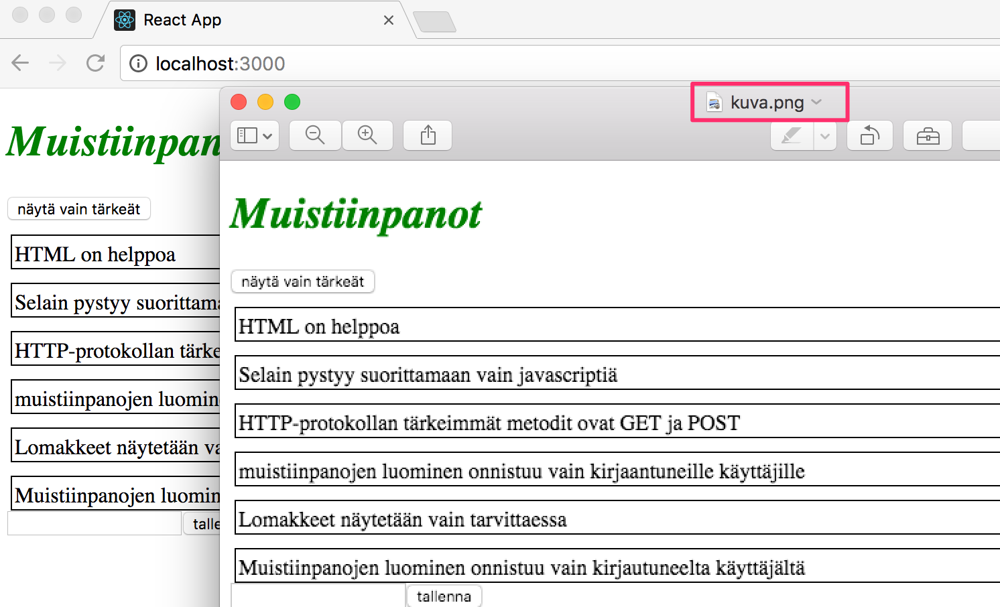
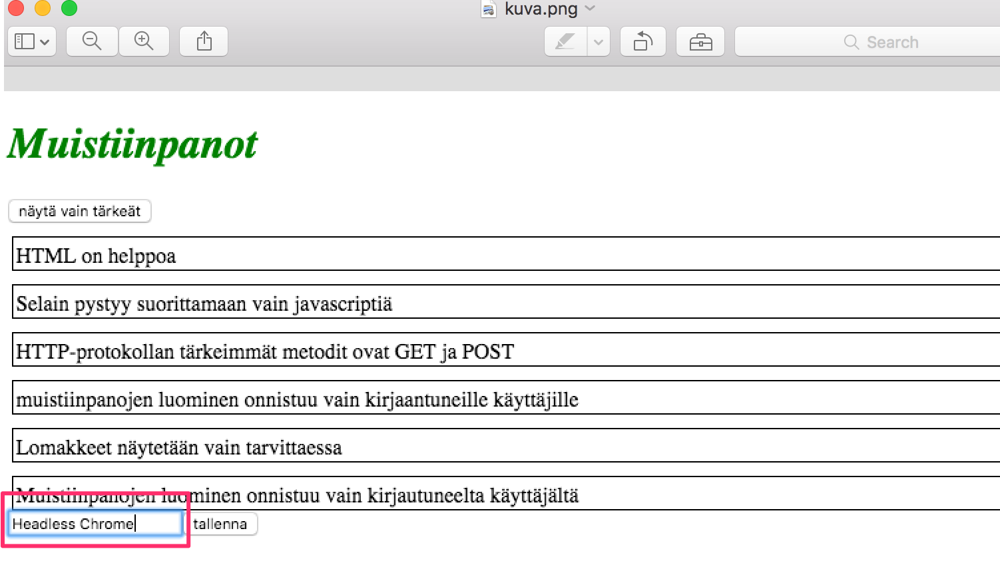

<div class="content">

## Sovelluksen end to end -testaus

Palataan vielä hetkeksi testauksen pariin. Aiemmissa osissa teimme sovelluksille yksikkötestejä sekä integraatiotestejä. Katsotaan nyt erästä tapaa tehdä [järjestelmää kokonaisuutena](https://en.wikipedia.org/wiki/System_testing) tutkivia _End to End (E2E) -testejä_.

Web-sovellusten E2E-testaus tapahtuu simuloidun selaimen avulla esimerkiksi [Selenium](http://www.seleniumhq.org/)-kirjastoa käyttäen. Toinen vaihtoehto on käyttää ns. [headless browseria](https://en.wikipedia.org/wiki/Headless_browser) eli selainta, jolla ei ole ollenkaan graafista käyttöliittymää.

Chrome-selain on jo hetken sisältänyt [headless](https://developers.google.com/web/updates/2017/04/headless-chrome)-moodin. Käytetään nyt headless chromea sille Node API:n tarjoavan [Puppeteer](https://github.com/GoogleChrome/puppeteer)-kirjaston avulla.

Tehdään muutama testi osan 3 muistiinpanosovelluksen ["Full stack"-versiolle](/osa3#sovellus-internettiin), joka sisältää sekä backendin että frontin samassa projektissa.

Asennetan puppeteer komennolla

```bash
npm install puppeteer --save-dev
```

Ennen testejä, tehdään kokeiluja varten tiedosto _puppeteer.js_ ja sille seuraava sisältö

```js
const puppeteer = require('puppeteer');

const main = async () => {
  const browser = await puppeteer.launch();
  const page = await browser.newPage();
  await page.goto('http://localhost:3000');
  await page.screenshot({ path: 'kuva.png' });

  await browser.close();
};

main();
```

Kun koodi suoritetaan komennolla _node puppeteer.js_ menee _headless chrome_ osoitteeseen http://localhost:3000 ja tallettaa sivulta ottamansa screenshotin tiedostoon _kuva.png_:



Muutetaan koodia vielä siten, että se kirjottaa sivulla olevaan _input_-elementtiin

```js
const main = async () => {
  const browser = await puppeteer.launch();
  const page = await browser.newPage();
  await page.goto('http://localhost:3000');
  await page.type('input', 'Headless Chrome');
  await page.screenshot({ path: 'kuva.png' });
  await browser.close();
};
```

Screenshot todistaa että näin on todellakin tapahtunut:



Debugatessa voi olla joskus avuksi myös käynnistää selain normaalimoodissa, ja hidastaa testien suoritusta:

```js
const main = async () => {
  const browser = await puppeteer.launch({
    headless: false,
    slowMo: 250, // jokainen operaatio kestää nyt 0.25 sekuntia
  });
  // ...
};
```

Tehdään sitten muutama testi. Toimiakseen hyvin Jestin kanssa vaaditaan hieman konfiguraatiota, joka onnistuu Jestin dokumentaation [ohjetta](https://facebook.github.io/jest/docs/en/puppeteer.html#content) noudattaen.

Tehdään ensimmäinen testi

```js
describe('note app', () => {
  it('renders main page', async () => {
    const page = await global.__BROWSER__.newPage();
    await page.goto('http://localhost:3000');
    const textContent = await page.$eval('body', el => el.textContent);

    expect(textContent.includes('Muistiinpanot')).toBe(true);
  });
});
```

Konfiguraatioiden ansiosta viite selaimeen on muuttujassa <code>global.**BROWSER**</code>

Selaimelta pyydetään aluksi [page](https://github.com/GoogleChrome/puppeteer/blob/master/docs/api.md#class-page)-olio, ja sen metodilla [\$eval](https://github.com/GoogleChrome/puppeteer/blob/master/docs/api.md#pageevalselector-pagefunction-args-1) haetaan sivun elementissä _body_ oleva tekstuaalinen sisältö.

Tehdään toinen testi, refaktoroidaan samalla testin yhteinen koodi [beforeEach](https://facebook.github.io/jest/docs/en/setup-teardown.html)-metodiin:

```js
describe('note app', () => {
  let page;
  beforeEach(async () => {
    page = await global.__BROWSER__.newPage();
    await page.goto('http://localhost:3000');
  });

  it('renders main page', async () => {
    const textContent = await page.$eval('body', el => el.textContent);
    expect(textContent.includes('Muistiinpanot')).toBe(true);
  });

  it('renders a note', async () => {
    const textContent = await page.$eval('body', el => el.textContent);
    expect(textContent.includes('HTML on helppoa')).toBe(true);
  });
});
```

Testi ei yllättäen mene läpi. Jos testissä tulostetaan konsoliin olion page metodilla [content](https://github.com/GoogleChrome/puppeteer/blob/master/docs/api.md#pagecontent) palauttama sivun koko sisältö, huomataan että sivulla ei todellakaan ole yhtään muistiinpanoa:

```html
<body>
  <noscript>
    You need to enable JavaScript to run this app.
  </noscript>
  <div id="root"><div><h1>Muistiinpanot</h1><div><button>näytä vain tärkeät</button></div><div class="notes"></div><form><input value=""><button>tallenna</button></form></div></div>
  <script type="text/javascript" src="/static/js/main.js"></script>
</body></html>
```

Syynä tälle on se, että puppeteer on ollut liian nopea, ja sivu ei ole _ehtinyt_ renderöityä.

Koska muistiinpanot sisältävällä _div_-elementillä on CSS-luokka _wrapper_, testi saadaan menemään läpi _odottamalla_ koko kyseisten elementtien renderöitymistä metodin [waitForSelector](https://github.com/GoogleChrome/puppeteer/blob/master/docs/api.md#pagewaitforselectorselector-options) avulla:

```js
it('renders a note', async () => {
  await page.waitForSelector('.wrapper');
  const textContent = await page.$eval('body', el => el.textContent);
  expect(textContent.includes('HTML on helppoa')).toBe(true);
});
```

Muutetaan testi hieman parempaan muotoon

```js
it('renders a note', async () => {
  await page.waitForSelector('.wrapper');

  const notes = await page.evaluate(() => {
    const elements = [...document.querySelectorAll('.wrapper')];
    return elements.map(e => e.textContent);
  });

  expect(notes.length > 0).toBe(true);
  expect(notes.join().includes('HTML on helppoa')).toBe(true);
});
```

Jestin [issueista](https://github.com/GoogleChrome/puppeteer/issues/303) löydetyn neuvon avulla testi hakee sivun kaikkien muistiinpanojen sisällöt ja tekee ekspektaatiot niiden avulla.

Lopuksi tehdään testi, joka luo uuden muistiinpanon

```js
it('allows new notes to be added', async () => {
  const id = Math.random() * 10000;
  const note = `jestin lisäämä muistiinpano ${id}`;
  await page.type('input', note);
  await page.click('form button');

  await page.waitForSelector('.notification'); // ilman tätä testi ei mene läpi

  const notes = await page.evaluate(() => {
    const elements = [...document.querySelectorAll('.wrapper')];
    return elements.map(e => e.textContent);
  });
  expect(notes.join().includes(note)).toBe(true);
});
```

Lomakkeen täyttäminen on helppoa. Koska sivulla on useita painikkeita, on käytetty CSS-selektoria _form button_ joka hakee sivulta lomakkeen sisällä olevan napin.

Napin painalluksen jälkeen syntyy jälleen potentiaalinen ajoitusongelma jos uuden muistiinpanon sivulle renderöitymistä testataan liian nopeasti. Ongelma on kierretty sillä, että sovellusta on muutettu siten, että se näyttää ruudulla CSS-luokalla _notification_ merkityssä _div_-elementissä uuden muistiinpanon lisäämisestä kertovan ilmoituksen.

Testausasetelmamme kaipaisi vielä paljon hiomista. Testejä vartan olisi mm. oltava oma tietokanta, jonka tilan testien pitäisi pystyä nollaamaan hallitusti. Nyt testit luottavat siihen että sovellus on käynnissä portissa 3001. Olisi parempi jos testit itse käynnistäisivät ja sammuttaisivat palvelimen.

Lisää aiheesta [Puppeteerin Github-sivujen](https://github.com/GoogleChrome/puppeteer) lisäksi esimerkiksi seuraavassa <https://www.valentinog.com/blog/ui-testing-jest-puppetteer/>

</div>
