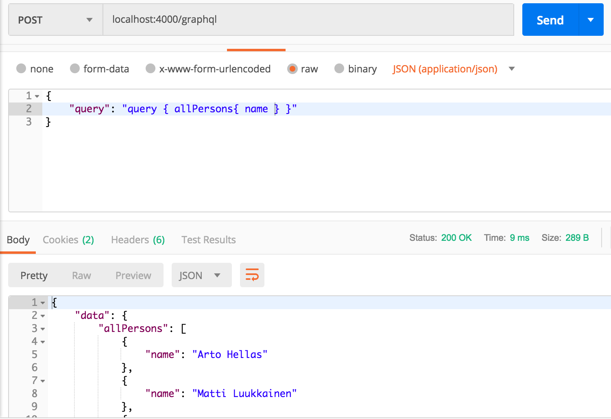

<div class="content">

Toteutetaan seuraavaksi React-sovellus, joka käyttää toteuttamaamme GraphQL-palvelinta. 

GraphQL:ää on periaatteessa mahdollista käyttää HTTP POST -pyyntöjen avulla. Seuraavassa esimerkki siitä, miten voimme tehdä kyselyn Postmanilla



Kyselyt siis tehdään osoitteeseen http://localhosto:4000/graphql kohdistuvina POST-pyyntöinä, ja itse kysely lähetetään pyynnön mukana merkkijonona avaimen <i>query</i> arvona. Voisimmekin hoitaa React-sovelluksen ja GraphQL:n kommunikoinnin Axiosilla. Tämä ei kuitenkaan ole useimmiten järkevää ja on parempi idea käyttää korkeamman tason kirjastoa, joka pystyy abstrahoimaan turhat detaljit clientin koodista. Tällä hetkellä järkeviä vaihtoehtoja on kaksi, Facebookin [Relay](https://facebook.github.io/relay/) ja
[Apollo Client](https://www.apollographql.com/docs/react/), näistä Apollo on ylivoimaisesti suositumpi ja myös meidän valintamme.

### Apollo client

Luodaan uusi React-sovellus ja asennetaan siihen [Apollo clientin](https://www.apollographql.com/docs/react/essentials/get-started.html#installation) vaatimat riippuvuudet

```js
```

```js
```

```js
```

```js
```

```js
```


### Frontti

GraphQL on jo melko iäkäs teknologia, se on ollut Facebookin sisäisessä käytössä jo vuodesta 2012 lähtien, teknologian voi siis todeta olevan "battle tested". Facebook julkaisi GraphQL:n vuonna 2015 ja se on pikkuhiljaa saanut enenevissä määrin huomiota ja nousee ehkä lähivuosina uhmaamaan REST:in valta-asemaa.

</div>

<div class="tasks">

### Tehtäviä

</div>
